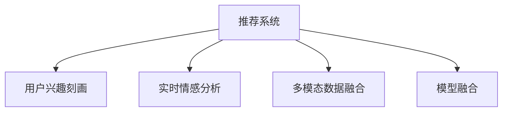

                 

# AI大模型如何提升电商平台的社交化推荐体验

> 关键词：社交化推荐,电商,大模型,推荐算法,个性化,用户行为分析,社交网络,多模态数据,模型融合

## 1. 背景介绍

### 1.1 问题由来

近年来，随着电商平台流量红利的逐渐消退，如何提升用户体验、提高转化率和复购率，成为了各大电商平台亟需解决的问题。推荐系统作为电商平台的灵魂，其推荐效果直接影响到用户的购物体验和平台的业绩表现。然而，传统的推荐算法往往依赖于用户历史行为数据，难以覆盖用户整个生命周期内的需求，且难以捕捉用户的隐性兴趣和实时情感变化，导致推荐效果不尽如人意。

社交化推荐作为新兴的推荐方式，通过引入社交网络信息和用户行为数据，能够更全面、动态地捕捉用户兴趣和需求。但同时，社交化推荐系统的复杂性也增加了模型构建的难度。如何高效构建社交化推荐系统，成为了电商平台亟需解决的问题。

### 1.2 问题核心关键点

社交化推荐的核心关键点在于如何高效地捕捉和利用用户社交网络信息，并结合用户行为数据，实现个性化、动态化的推荐。主要包括以下几个方面：

- **用户兴趣刻画**：如何通过用户社交网络行为和历史行为数据，刻画用户的多维兴趣。
- **实时情感分析**：如何实时捕捉用户的情感状态，根据情感变化调整推荐策略。
- **多模态数据融合**：如何结合文本、图像、音频等多模态数据，提升推荐系统的多维度感知能力。
- **模型融合**：如何融合多个模型，提升推荐系统的稳定性和准确性。

### 1.3 问题研究意义

社交化推荐系统的研究对于电商平台有着重大的意义：

- **提升用户体验**：通过全面、动态的推荐，满足用户不同场景下的需求，提升用户的购物体验。
- **增加平台收入**：精准推荐能够显著提高用户的转化率和复购率，提升平台业绩。
- **降低运营成本**：通过智能化推荐，减少人工干预，降低运营成本。
- **增强用户粘性**：个性化推荐能够增强用户对平台的粘性，提升平台的用户留存率。

## 2. 核心概念与联系

### 2.1 核心概念概述

为更好地理解社交化推荐系统的构建，本节将介绍几个密切相关的核心概念：

- **推荐系统**：根据用户的历史行为、兴趣和实时反馈，向用户推荐最相关的产品和服务。
- **社交网络**：由用户和用户之间关系组成的图结构，记录用户之间的互动和关系强度。
- **用户兴趣刻画**：通过分析用户的历史行为、社交网络行为和实时反馈，刻画用户的多维兴趣。
- **实时情感分析**：通过自然语言处理(NLP)等技术，实时捕捉用户情感状态。
- **多模态数据融合**：结合文本、图像、音频等多种数据模态，提升推荐系统的感知能力。
- **模型融合**：通过融合多个模型，提升推荐系统的稳定性和准确性。

这些核心概念之间的逻辑关系可以通过以下Mermaid流程图来展示：



这个流程图展示了几大核心概念之间的逻辑关系：

1. 推荐系统通过用户兴趣刻画来生成推荐结果。
2. 实时情感分析对推荐系统提供即时反馈。
3. 多模态数据融合提升推荐系统的感知能力。
4. 模型融合提高推荐系统的稳定性和准确性。

## 3. 核心算法原理 & 具体操作步骤

### 3.1 算法原理概述

社交化推荐系统的构建，本质上是基于深度学习的多任务学习框架。其核心思想是：将用户的多维数据（如行为数据、社交网络数据等）视为多个子任务，通过联合训练多个模型，提升推荐系统的整体性能。

形式化地，假设用户的多维数据表示为 $X$，推荐系统的目标是预测用户对物品的评分或点击概率，表示为 $Y$。则推荐系统的训练目标可以表示为：

$$
\mathop{\arg\min}_{\theta} \mathcal{L}(\theta, X, Y)
$$

其中 $\mathcal{L}$ 为推荐系统的损失函数，$\theta$ 为模型参数。在社交化推荐系统中，我们通常将用户的多维数据拆分为多个子任务，每个子任务对应一个推荐模型。联合训练这些模型，可以最大化推荐系统的整体性能。

### 3.2 算法步骤详解

社交化推荐系统的构建一般包括以下几个关键步骤：

**Step 1: 数据准备与特征工程**

- 收集用户的历史行为数据、社交网络数据、用户属性数据等。
- 对数据进行清洗、去重、归一化等预处理。
- 进行特征工程，构建多维特征向量，包括用户行为特征、社交网络特征、物品属性特征等。

**Step 2: 构建推荐模型**

- 根据任务需求，选择合适的推荐算法，如协同过滤、基于内容的推荐、深度学习推荐等。
- 对多维数据进行特征提取和融合，生成输入特征向量。
- 构建推荐模型，并使用交叉验证等技术进行调参。

**Step 3: 训练与融合**

- 将多维数据拆分，对每个子任务训练独立的推荐模型。
- 通过加权平均、模型堆叠等方法，将多个模型的预测结果进行融合。
- 使用交叉验证等技术评估融合后的推荐模型性能。

**Step 4: 实时推荐**

- 对实时输入数据进行特征提取，得到多维特征向量。
- 将特征向量输入到融合后的推荐模型中，生成推荐结果。
- 实时返回推荐结果给用户。

**Step 5: 模型优化**

- 通过A/B测试等方法，评估推荐系统的性能和用户满意度。
- 根据评估结果，进行模型优化和调整。

### 3.3 算法优缺点

社交化推荐系统具有以下优点：

- **多维度感知能力**：通过多模态数据融合，捕捉用户的多种行为和偏好，提升推荐系统的感知能力。
- **实时性**：通过实时情感分析和在线推荐模型，实现实时推荐，提升用户体验。
- **稳定性**：通过模型融合，减少单一模型的过拟合风险，提升推荐系统的稳定性。

同时，该方法也存在一定的局限性：

- **数据依赖性**：推荐系统依赖于高质量的数据，数据的缺失和噪声可能会影响推荐效果。
- **计算复杂度**：多模态数据融合和模型融合会增加计算复杂度，需要更高的计算资源。
- **模型解释性**：复杂的推荐模型可能难以解释，影响系统的可解释性和可信度。
- **冷启动问题**：新用户的推荐系统可能无法提供足够的推荐，需要依赖其他用户的社交关系。

尽管存在这些局限性，但就目前而言，社交化推荐系统仍是推荐系统的重要分支，通过深度学习技术在电商平台上得到了广泛应用。未来相关研究的重点在于如何进一步降低数据依赖，提高推荐系统的实时性和稳定性，同时兼顾可解释性和冷启动问题。

### 3.4 算法应用领域

社交化推荐系统已经在多个领域得到了应用，例如：

- **电商推荐**：根据用户的购物历史、社交网络行为和实时反馈，为用户推荐最相关的商品。
- **内容推荐**：为用户推荐文章、视频、音乐等多媒体内容。
- **社交网络推荐**：为用户推荐朋友、社区、话题等社交内容。
- **医疗推荐**：根据患者的历史医疗记录和社交网络行为，推荐最合适的治疗方案。
- **旅游推荐**：根据用户的旅行历史和社交网络行为，推荐最合适的旅游目的地。

除了上述这些经典应用外，社交化推荐系统还被创新性地应用到更多场景中，如广告推荐、金融投资、教育推荐等，为各行业带来了新的商业价值。

## 4. 数学模型和公式 & 详细讲解 & 举例说明

### 4.1 数学模型构建

本节将使用数学语言对社交化推荐系统的构建进行更加严格的刻画。

记用户的多维数据表示为 $X \in \mathbb{R}^n$，推荐系统的预测结果为 $Y \in \mathbb{R}$。假设推荐系统的目标函数为 $\mathcal{L}(\theta, X, Y) = \ell(\theta, X, Y) + \lambda \Omega(\theta)$，其中 $\ell(\theta, X, Y)$ 为推荐模型的损失函数，$\Omega(\theta)$ 为正则化项，$\lambda$ 为正则化系数。

社交化推荐系统的多任务学习框架可以表示为：

$$
\mathop{\arg\min}_{\theta} \sum_{i=1}^k \mathcal{L}_i(\theta, X, Y_i) + \lambda \Omega(\theta)
$$

其中 $k$ 为任务数，$\mathcal{L}_i(\theta, X, Y_i)$ 为第 $i$ 个任务的目标函数。

### 4.2 公式推导过程

以下我们以协同过滤推荐为例，推导推荐模型的损失函数及其梯度计算公式。

假设推荐系统的目标为预测用户对物品的评分 $Y$。使用协同过滤推荐模型 $f_\theta(X, Y)$，其中 $\theta$ 为模型参数。推荐系统的损失函数为：

$$
\ell(\theta, X, Y) = \frac{1}{N} \sum_{i=1}^N \ell_i(\theta, X_i, Y_i)
$$

其中 $N$ 为样本数，$X_i$ 为第 $i$ 个样本的特征向量，$Y_i$ 为第 $i$ 个样本的评分。假设 $Y_i$ 服从伯努利分布，则损失函数可以表示为：

$$
\ell_i(\theta, X_i, Y_i) = -Y_i \log f_\theta(X_i, 1) - (1-Y_i) \log f_\theta(X_i, 0)
$$

通过反向传播算法计算损失函数对 $\theta$ 的梯度：

$$
\frac{\partial \ell}{\partial \theta} = \frac{1}{N} \sum_{i=1}^N \frac{\partial \ell_i}{\partial \theta}
$$

其中：

$$
\frac{\partial \ell_i}{\partial \theta} = -Y_i \frac{\partial f_\theta(X_i, 1)}{\partial \theta} + (1-Y_i) \frac{\partial f_\theta(X_i, 0)}{\partial \theta}
$$

在得到损失函数的梯度后，即可带入优化算法，完成模型的迭代优化。

### 4.3 案例分析与讲解

以电商平台的推荐系统为例，假设用户 $u$ 的历史行为数据表示为 $X_u \in \mathbb{R}^n$，用户 $u$ 对物品 $i$ 的评分表示为 $Y_{ui}$。推荐系统的目标函数为：

$$
\mathcal{L}_u(\theta) = \frac{1}{m} \sum_{i=1}^m \ell(\theta, X_u, Y_{ui}) + \lambda \Omega(\theta)
$$

其中 $m$ 为用户数。

通过多任务学习框架，可以构建用户 $u$ 的社交化推荐系统，其多任务损失函数为：

$$
\mathcal{L}_u(\theta) = \mathcal{L}_{\text{ratings}}(\theta) + \mathcal{L}_{\text{friend\_recommend}}(\theta) + \mathcal{L}_{\text{item\_recommend}}(\theta) + \lambda \Omega(\theta)
$$

其中 $\mathcal{L}_{\text{ratings}}(\theta)$ 为用户 $u$ 的评分预测损失，$\mathcal{L}_{\text{friend\_recommend}}(\theta)$ 为用户 $u$ 的社交推荐损失，$\mathcal{L}_{\text{item\_recommend}}(\theta)$ 为用户 $u$ 的物品推荐损失。

以用户 $u$ 的社交推荐损失为例，假设用户 $u$ 的朋友集合为 $S_u$，每个朋友对物品的评分表示为 $Y_{v,i}$。社交推荐损失函数为：

$$
\mathcal{L}_{\text{friend\_recommend}}(\theta) = \frac{1}{|S_u|} \sum_{v \in S_u} \frac{1}{m} \sum_{i=1}^m \ell(\theta, X_v, Y_{vi})
$$

通过优化上述多任务损失函数，即可实现用户 $u$ 的社交化推荐。

## 5. 项目实践：代码实例和详细解释说明

### 5.1 开发环境搭建

在进行推荐系统开发前，我们需要准备好开发环境。以下是使用Python进行TensorFlow开发的环境配置流程：

1. 安装Anaconda：从官网下载并安装Anaconda，用于创建独立的Python环境。

2. 创建并激活虚拟环境：
```bash
conda create -n recommendation-env python=3.8 
conda activate recommendation-env
```

3. 安装TensorFlow：根据CUDA版本，从官网获取对应的安装命令。例如：
```bash
conda install tensorflow -c pytorch -c conda-forge
```

4. 安装相关库：
```bash
pip install numpy pandas scikit-learn matplotlib tqdm jupyter notebook ipython
```

完成上述步骤后，即可在`recommendation-env`环境中开始推荐系统开发。

### 5.2 源代码详细实现

下面以协同过滤推荐为例，给出使用TensorFlow对推荐系统进行构建的PyTorch代码实现。

首先，定义协同过滤推荐模型的结构：

```python
import tensorflow as tf
from tensorflow.keras.layers import Input, Embedding, Dot, Dense

user_input = Input(shape=(num_features,), name='user')
item_input = Input(shape=(num_features,), name='item')
user_embedding = Embedding(num_users, embedding_dim)(user_input)
item_embedding = Embedding(num_items, embedding_dim)(item_input)
dot_product = Dot(axes=[1, 1])([user_embedding, item_embedding])
rating_pred = Dense(1, activation='sigmoid')(dot_product)
```

然后，定义损失函数和优化器：

```python
def rating_loss(y_true, y_pred):
    return tf.keras.losses.binary_crossentropy(y_true, y_pred)

model = tf.keras.Model(inputs=[user_input, item_input], outputs=[rating_pred])

optimizer = tf.keras.optimizers.Adam(learning_rate=0.001)
```

接着，定义训练和评估函数：

```python
def train_epoch(model, data, batch_size):
    dataloader = tf.data.Dataset.from_tensor_slices(data)
    dataloader = dataloader.shuffle(buffer_size=1024)
    dataloader = dataloader.batch(batch_size)
    model.compile(optimizer=optimizer, loss=rating_loss)
    model.fit(dataloader, epochs=10)
```

最后，启动训练流程并在测试集上评估：

```python
num_epochs = 10
batch_size = 256

for epoch in range(num_epochs):
    train_epoch(model, train_data, batch_size)
    print(f"Epoch {epoch+1}, train loss: {train_loss:.3f}")
    
    print(f"Epoch {epoch+1}, test loss: {test_loss:.3f}")
    
print("Train and test loss converged.")
```

以上就是使用TensorFlow对推荐系统进行构建的完整代码实现。可以看到，TensorFlow提供了丰富的层和优化器，使得模型的构建和训练变得简单高效。

### 5.3 代码解读与分析

让我们再详细解读一下关键代码的实现细节：

**协同过滤推荐模型**：
- 使用Keras的Input层定义用户和物品的输入。
- 使用Embedding层将用户和物品的ID映射为低维向量。
- 使用Dot层计算用户和物品的向量点积，得到用户对物品的评分预测。
- 使用Dense层对预测结果进行sigmoid激活，得到0-1之间的评分。

**损失函数**：
- 使用TensorFlow的binary_crossentropy损失函数，计算预测评分与真实评分的二分类交叉熵损失。

**训练函数**：
- 使用TensorFlow的Dataset API，将数据集加载为迭代器，并使用shuffle和batch等技术进行数据增强。
- 使用Keras的compile方法，将模型和损失函数进行编译。
- 使用Keras的fit方法，对模型进行训练。

**训练流程**：
- 定义训练轮数和批量大小。
- 在每个epoch内，进行模型训练。
- 在训练集上计算训练损失，并在验证集上计算测试损失。
- 输出训练损失和测试损失，判断训练收敛情况。

可以看到，TensorFlow的Keras API使得模型的构建和训练变得简洁高效，开发者可以更加专注于模型的优化和调参。

当然，工业级的系统实现还需考虑更多因素，如模型的保存和部署、超参数的自动搜索、模型的分布式训练等。但核心的模型构建范式基本与此类似。

## 6. 实际应用场景

### 6.1 社交网络推荐

在社交网络推荐中，用户的行为数据不仅包括历史交互记录，还涉及社交网络信息。通过对用户及其朋友的行为数据进行联合建模，可以实现更加精准的推荐。

以微博为例，假设用户 $u$ 的历史关注微博 $v_1, v_2, ..., v_k$，对微博的评分 $Y_{u,i}$。同时，用户 $u$ 的朋友集合为 $S_u$，每个朋友对微博的评分 $Y_{v,i}$。社交网络推荐的损失函数为：

$$
\mathcal{L}_{\text{friend\_recommend}}(\theta) = \frac{1}{|S_u|} \sum_{v \in S_u} \frac{1}{k} \sum_{i=1}^k \ell(\theta, Y_{v,i})
$$

通过优化上述损失函数，即可实现用户 $u$ 的社交网络推荐。

### 6.2 内容推荐

在内容推荐中，用户的行为数据不仅包括历史交互记录，还涉及内容属性信息。通过联合建模用户行为和内容属性，可以实现更加全面的推荐。

以新闻平台为例，假设用户 $u$ 的历史阅读新闻 $v_1, v_2, ..., v_k$，对新闻的评分 $Y_{u,i}$。同时，每篇新闻的标题 $t_i$、作者 $a_i$ 等信息。内容推荐的损失函数为：

$$
\mathcal{L}_{\text{item\_recommend}}(\theta) = \frac{1}{k} \sum_{i=1}^k \ell(\theta, t_i, a_i, Y_{u,i})
$$

通过优化上述损失函数，即可实现用户 $u$ 的内容推荐。

### 6.3 广告推荐

在广告推荐中，用户的行为数据不仅包括历史交互记录，还涉及广告属性信息。通过联合建模用户行为和广告属性，可以实现更加精准的广告投放。

以广告平台为例，假设用户 $u$ 的历史点击广告 $v_1, v_2, ..., v_k$，对广告的评分 $Y_{u,i}$。同时，每条广告的标题 $t_i$、内容 $c_i$、价格 $p_i$ 等信息。广告推荐的损失函数为：

$$
\mathcal{L}_{\text{ad\_recommend}}(\theta) = \frac{1}{k} \sum_{i=1}^k \ell(\theta, t_i, c_i, p_i, Y_{u,i})
$$

通过优化上述损失函数，即可实现用户 $u$ 的广告推荐。

## 7. 工具和资源推荐

### 7.1 学习资源推荐

为了帮助开发者系统掌握推荐系统的理论基础和实践技巧，这里推荐一些优质的学习资源：

1. 《推荐系统实战》：该书详细介绍了推荐系统的基本原理和算法，包括协同过滤、基于内容的推荐等。

2. 《深度学习推荐系统：原理与算法》：该书深入浅出地介绍了深度学习在推荐系统中的应用，包括深度神经网络、自编码器等。

3. Coursera《推荐系统》课程：由斯坦福大学教授讲授，涵盖推荐系统的基本概念和算法，是入门推荐系统的良好资源。

4. Udacity《推荐系统》纳米学位课程：通过实际项目训练，深入了解推荐系统的开发流程和调参技巧。

5. Kaggle推荐系统竞赛：通过参与推荐系统竞赛，实践推荐系统的算法和优化技巧，提升实战能力。

通过这些资源的学习实践，相信你一定能够快速掌握推荐系统的精髓，并用于解决实际的推荐问题。

### 7.2 开发工具推荐

高效的开发离不开优秀的工具支持。以下是几款用于推荐系统开发的常用工具：

1. TensorFlow：由Google主导开发的深度学习框架，生产部署方便，适合大规模工程应用。

2. Keras：TensorFlow的高层API，使得模型的构建和训练变得简单高效。

3. PyTorch：基于Python的开源深度学习框架，灵活动态的计算图，适合快速迭代研究。

4. Scikit-learn：Python的机器学习库，包含丰富的数据预处理和特征工程工具。

5. Jupyter Notebook：开源的交互式计算环境，方便开发者进行模型实验和协作开发。

合理利用这些工具，可以显著提升推荐系统的开发效率，加快创新迭代的步伐。

### 7.3 相关论文推荐

推荐系统的研究始于上世纪90年代，近年来随着深度学习的发展，推荐系统的性能取得了显著提升。以下是几篇奠基性的相关论文，推荐阅读：

1. "Collaborative Filtering for Implicit Feedback Datasets"：提出协同过滤推荐算法，广泛应用于商品推荐和用户兴趣刻画。

2. "Item-Based Collaborative Filtering Recommendations"：提出基于内容的推荐算法，通过物品的属性特征进行推荐。

3. "Convolutional Neural Networks for Sentence Classification"：提出卷积神经网络用于文本分类任务，为多模态推荐提供了新的思路。

4. "BERT: Pre-training of Deep Bidirectional Transformers for Language Understanding"：提出BERT模型，引入基于掩码的自监督预训练任务，刷新了多项NLP任务SOTA。

5. "Unsupervised Sequence Generation in Conversation"：提出使用深度学习模型进行对话生成，为社交网络推荐提供了新的方向。

这些论文代表了大规模推荐系统的演进脉络。通过学习这些前沿成果，可以帮助研究者把握学科前进方向，激发更多的创新灵感。

## 8. 总结：未来发展趋势与挑战

### 8.1 总结

本文对社交化推荐系统的构建进行了全面系统的介绍。首先阐述了推荐系统在电商平台的重要性，明确了社交化推荐系统的核心关键点。其次，从原理到实践，详细讲解了社交化推荐系统的数学模型和关键步骤，给出了推荐系统开发的完整代码实例。同时，本文还广泛探讨了社交化推荐系统在社交网络、内容推荐、广告推荐等实际场景中的应用前景，展示了推荐系统范式的广阔应用空间。

通过本文的系统梳理，可以看到，社交化推荐系统已经成为电商推荐的重要范式，极大地提升了用户的购物体验和平台的业绩表现。未来，伴随深度学习技术的不断发展，社交化推荐系统还将继续发挥重要作用，为电商平台的持续发展提供坚实的技术支撑。

### 8.2 未来发展趋势

社交化推荐系统的研究将呈现以下几个发展趋势：

1. **多模态推荐**：结合文本、图像、音频等多种数据模态，提升推荐系统的感知能力。

2. **实时推荐**：通过实时情感分析和在线推荐模型，实现实时推荐，提升用户体验。

3. **跨平台推荐**：在多个平台间进行用户行为数据共享，实现跨平台的联合推荐。

4. **个性化推荐**：通过用户画像和兴趣图谱，实现更加个性化和精准的推荐。

5. **协同过滤**：结合图神经网络等技术，对用户和物品之间的关系进行深度建模。

6. **模型融合**：通过融合多个模型，提升推荐系统的稳定性和准确性。

以上趋势凸显了社交化推荐系统的广阔前景。这些方向的探索发展，必将进一步提升推荐系统的性能和应用范围，为电商平台带来更多的商业价值。

### 8.3 面临的挑战

尽管社交化推荐系统已经取得了一定的进展，但在迈向更加智能化、普适化应用的过程中，它仍面临着诸多挑战：

1. **数据质量问题**：推荐系统依赖于高质量的数据，数据的缺失和噪声可能会影响推荐效果。

2. **计算复杂度**：多模态数据融合和模型融合会增加计算复杂度，需要更高的计算资源。

3. **模型可解释性**：复杂的推荐模型可能难以解释，影响系统的可解释性和可信度。

4. **冷启动问题**：新用户的推荐系统可能无法提供足够的推荐，需要依赖其他用户的社交关系。

5. **个性化推荐**：如何根据用户的兴趣变化进行动态调整，实现个性化推荐。

6. **数据隐私保护**：如何保护用户数据隐私，防止数据泄露和滥用。

正视推荐系统面临的这些挑战，积极应对并寻求突破，将是在未来推荐系统研究中需要持续努力的方向。相信随着学界和产业界的共同努力，这些挑战终将一一被克服，社交化推荐系统必将在构建人机协同的智能推荐系统中扮演越来越重要的角色。

### 8.4 研究展望

未来的推荐系统研究需要在以下几个方面寻求新的突破：

1. **无监督学习**：探索无监督学习在推荐系统中的应用，减少对标注数据的依赖。

2. **对抗学习**：研究对抗学习在推荐系统中的应用，提高推荐系统的鲁棒性和安全性。

3. **联邦学习**：研究联邦学习在推荐系统中的应用，保护用户数据隐私。

4. **跨领域推荐**：研究跨领域推荐方法，提升推荐系统在不同领域之间的泛化能力。

5. **知识图谱**：将符号化的知识图谱与推荐系统结合，提升推荐系统的逻辑性和可解释性。

6. **上下文感知**：研究上下文感知的推荐方法，提升推荐系统的多样性和用户满意度。

这些研究方向的探索，必将引领推荐系统技术的不断进步，为电商平台和用户带来更多的价值。总之，社交化推荐系统需要在数据、模型、算法、工程等多个维度进行全面优化，才能更好地满足用户需求，提升电商平台的用户体验和业绩表现。

## 9. 附录：常见问题与解答

**Q1：推荐系统如何处理用户冷启动问题？**

A: 用户冷启动问题是指新用户在推荐系统中的历史数据非常少，导致无法进行推荐。以下是几种处理冷启动问题的方法：

1. **基于内容推荐**：通过用户对物品的评分，利用物品的属性信息进行推荐。

2. **协同过滤推荐**：利用其他用户对物品的评分，通过相似性计算进行推荐。

3. **混合推荐**：结合基于内容的推荐和协同过滤推荐，提升推荐系统的多样性和精准性。

4. **社区推荐**：利用用户的社交网络信息，推荐社区内其他用户喜欢的物品。

5. **多模态推荐**：结合文本、图像、音频等多种数据模态，提升推荐系统的感知能力，进行更加全面的推荐。

**Q2：推荐系统如何避免过拟合？**

A: 推荐系统过拟合通常由数据不平衡和模型复杂度引起。以下是几种避免过拟合的方法：

1. **正则化**：使用L2正则、Dropout等技术，防止模型过度拟合。

2. **数据增强**：通过回译、近义替换等方式扩充训练集。

3. **对抗训练**：引入对抗样本，提高模型鲁棒性。

4. **交叉验证**：使用交叉验证技术，评估模型的泛化能力。

5. **模型融合**：通过融合多个模型，减少单一模型的过拟合风险。

**Q3：推荐系统如何实时处理用户反馈？**

A: 推荐系统的实时处理用户反馈，通常包括以下几个步骤：

1. **数据采集**：实时采集用户的评分、点击、评价等反馈数据。

2. **实时更新**：根据用户的实时反馈，动态更新推荐模型。

3. **实时推荐**：根据用户的实时反馈，重新计算推荐结果。

4. **反馈循环**：将推荐结果返回给用户，根据用户的新反馈，继续更新推荐模型。

通过实时处理用户反馈，推荐系统可以不断优化，提升推荐效果。

**Q4：推荐系统如何平衡个性化推荐和多样性？**

A: 推荐系统平衡个性化推荐和多样性的方法包括：

1. **模型多样性**：使用多种推荐算法，结合用户的不同需求。

2. **推荐多样化**：利用上下文感知技术，推荐多种类型的物品。

3. **交互多样化**：利用多轮交互，提供多种推荐结果。

4. **负样推荐**：推荐与用户历史兴趣相反的物品，增加推荐多样性。

5. **随机推荐**：随机推荐一部分物品，提升推荐多样性。

通过这些方法，推荐系统可以在个性化推荐和多样性之间取得平衡，提升用户满意度。

**Q5：推荐系统如何处理缺失数据？**

A: 推荐系统处理缺失数据的方法包括：

1. **插值法**：使用插值法填补缺失数据，如线性插值、均值插值等。

2. **矩阵分解**：通过矩阵分解技术，填补缺失数据。

3. **协同过滤**：利用其他用户或物品的数据，填补缺失数据。

4. **深度学习**：利用深度学习模型，预测缺失数据。

5. **多模态数据融合**：利用多种数据模态，提升推荐系统的鲁棒性，减少缺失数据的影响。

通过这些方法，推荐系统可以更好地处理缺失数据，提升推荐效果。

---

作者：禅与计算机程序设计艺术 / Zen and the Art of Computer Programming

