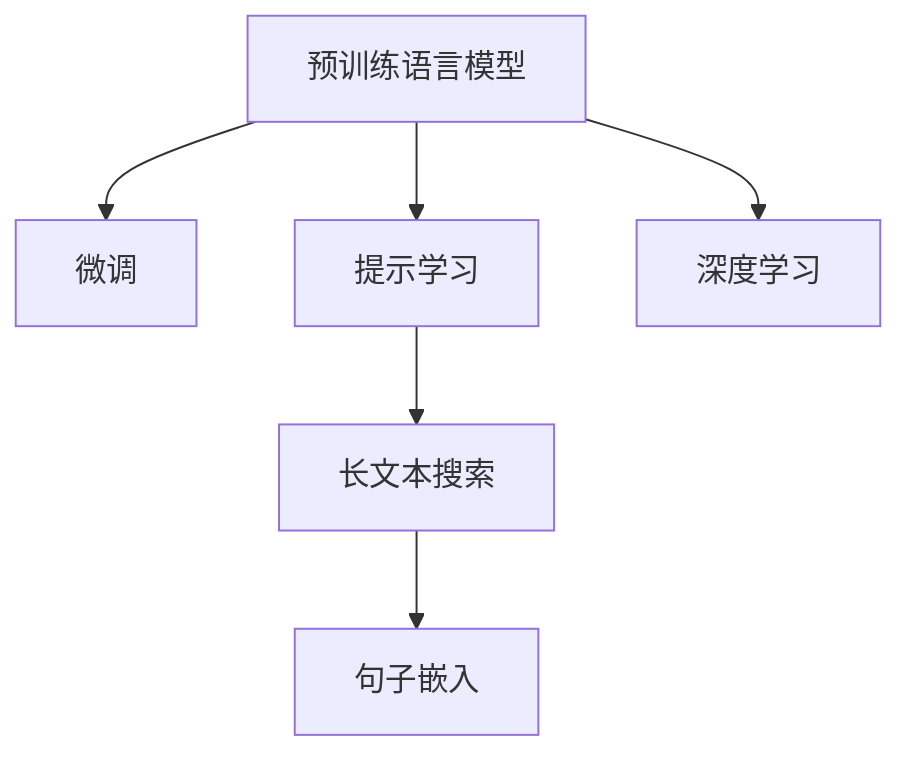

                 

# AI大模型如何提升长文本搜索效果

## 1. 背景介绍

### 1.1 问题由来

长文本搜索，是信息检索领域的核心任务之一，广泛应用于搜索引擎、图书馆检索、数据库查询、学术文献搜索等场景。传统基于关键字匹配的搜索算法，已经无法应对长文本内容中隐含的语义信息，且无法处理长文段的复杂结构。随着深度学习和预训练语言模型的发展，AI大模型为长文本搜索注入了新的活力，带来了颠覆性的变革。

近年来，预训练大模型如BERT、GPT等，通过在大量无标签文本数据上进行预训练，学习到丰富的语言表示，具备强大的语言理解和生成能力。这些大模型在长文本搜索中得以充分应用，通过在长文本数据上进行微调或指令执行，显著提升了搜索的精度和效率。

### 1.2 问题核心关键点

当前，基于大模型的长文本搜索方法主要依赖两类技术：
1. 微调：在长文本数据集上进行有监督微调，训练模型能够对长文本进行语义理解和特征提取。
2. 提示学习：通过精心设计输入文本格式，引导大模型按期望方式生成搜索结果或摘要。

这些技术的应用，极大地推动了长文本搜索的发展。在学术界和工业界，已经涌现了诸多成功的应用案例，并取得了显著的业绩。

### 1.3 问题研究意义

研究大模型在长文本搜索中的应用，具有重要意义：

1. 提升检索精度：AI大模型能够深入理解长文本的语义信息，提高关键词匹配的准确性。
2. 拓展应用场景：长文本搜索不再局限于传统关键词检索，可以涵盖问答、摘要、翻译等多个领域，满足更多实际需求。
3. 提高系统效率：AI大模型能够快速理解并处理长文本，显著提升查询响应速度和用户体验。
4. 优化搜索结果：通过理解和生成，大模型能够提供更精准的摘要和推荐，提升搜索结果的质量和相关性。
5. 促进技术融合：大模型技术的引入，推动了信息检索技术与NLP、视觉等领域的深度融合，带来了更广阔的创新空间。

## 2. 核心概念与联系

### 2.1 核心概念概述

为更好地理解大模型在长文本搜索中的应用，本节将介绍几个密切相关的核心概念：

- 预训练语言模型(Pre-trained Language Model, PLM)：以自回归(如GPT)或自编码(如BERT)模型为代表的大规模预训练语言模型。通过在大规模无标签文本语料上进行预训练，学习通用的语言表示，具备强大的语言理解和生成能力。

- 微调(Fine-tuning)：指在预训练模型的基础上，使用长文本搜索任务的相关数据集，通过有监督地训练来优化模型在该任务上的性能。通常只需要调整顶层分类器或解码器，并以较小的学习率更新全部或部分的模型参数。

- 提示学习(Prompt Learning)：通过在输入文本中添加提示模板(Prompt Template)，引导大模型进行特定任务的推理和生成。可以在不更新模型参数的情况下，实现零样本或少样本学习。

- 长文本搜索(Long Text Search)：指在大量长文本内容中进行关键词或语义匹配，寻找相关文档或信息片段的检索技术。常应用于搜索引擎、文本数据库等场景。

- 句子嵌入(Sentence Embedding)：将文本句子转换为固定长度的向量表示，便于计算机进行处理和比较。句子嵌入是长文本搜索中的重要基础技术。

- 深度学习(Deep Learning)：基于神经网络的机器学习范式，通过反向传播算法优化模型参数，实现对复杂数据的深度建模和预测。

这些核心概念之间的逻辑关系可以通过以下Mermaid流程图来展示：



这个流程图展示了大模型在长文本搜索中的核心概念及其之间的关系：

1. 预训练语言模型通过大规模无标签文本语料进行预训练，获得语言表示能力。
2. 微调和提示学习在此基础上，进一步针对特定长文本搜索任务进行优化，提升模型的特定能力。
3. 长文本搜索技术依赖于预训练语言模型的语义理解，利用句子嵌入等技术将文本转换为向量形式。
4. 深度学习技术提供强大的建模和优化手段，支持预训练语言模型在长文本搜索任务中的高效应用。

这些概念共同构成了长文本搜索的技术框架，为大模型的应用提供了理论基础和实践指南。

## 3. 核心算法原理 & 具体操作步骤
### 3.1 算法原理概述

基于大模型的长文本搜索方法，本质上是一个基于深度学习的文本表示和匹配过程。其核心思想是：将长文本转换为语义表示，利用大模型学习到的语言表示，与查询关键词进行匹配，找到最相关的文本。

形式化地，假设长文本搜索任务为 $T$，给定查询关键词 $q$，待搜索的长文本数据集为 $D=\{d_i\}_{i=1}^N$，每个长文本 $d_i$ 可以表示为一个句子序列 $S_i=\{s_j\}_{j=1}^M$。目标是找到与查询 $q$ 最相关的文本 $d_k$，即：

$$
d_k = \mathop{\arg\min}_{d_i} \mathcal{L}(q,d_i)
$$

其中 $\mathcal{L}$ 为损失函数，用于衡量查询 $q$ 与文本 $d_i$ 之间的匹配度。

具体而言，基于大模型的长文本搜索方法可以分为两个阶段：

1. 将长文本转换为语义表示。使用大模型对长文本进行编码，得到文本向量表示 $E_i = \{e_j\}_{j=1}^M$。
2. 将查询转换为向量形式，并匹配到最相关的文本。利用大模型学习到的语言表示，将查询 $q$ 转换为向量 $Q$，通过计算向量相似度，找到与查询最相关的长文本。

### 3.2 算法步骤详解

基于大模型的长文本搜索方法通常包括以下几个关键步骤：

**Step 1: 准备长文本数据集和查询关键词**

- 准备长文本数据集 $D$，每个文本 $d_i$ 表示为一个句子序列 $S_i$。
- 准备查询关键词 $q$，可以是单个单词、短语或更长的句子。

**Step 2: 选择预训练语言模型和微调方式**

- 选择适合的长文本搜索任务的预训练语言模型 $M_{\theta}$，如BERT、GPT等。
- 决定是否微调模型，并设计合适的任务适配层。对于文本匹配任务，通常在顶层添加交叉熵损失函数；对于文本摘要任务，使用语言模型的解码器输出概率分布。

**Step 3: 执行编码和匹配**

- 使用大模型对每个长文本 $d_i$ 进行编码，得到文本向量表示 $E_i$。
- 将查询关键词 $q$ 转换为向量形式 $Q$，可以使用简单的词嵌入或复杂的大模型编码。
- 计算文本向量 $E_i$ 与查询向量 $Q$ 之间的余弦相似度或欧几里得距离，找到最相关的长文本 $d_k$。

**Step 4: 输出结果**

- 根据相似度排序，输出与查询最相关的长文本列表或摘要。
- 根据实际需求，可以对文本进行进一步的过滤和聚合，提供更精准的搜索结果。

### 3.3 算法优缺点

基于大模型的长文本搜索方法具有以下优点：

1. 提升检索精度：大模型能够深入理解长文本的语义信息，提升关键词匹配的准确性。
2. 拓展应用场景：可以应用于问答、摘要、翻译等多个领域，满足更多实际需求。
3. 提高系统效率：大模型能够快速理解并处理长文本，显著提升查询响应速度和用户体验。
4. 优化搜索结果：通过理解和生成，大模型能够提供更精准的摘要和推荐，提升搜索结果的质量和相关性。

但同时也存在一些局限性：

1. 依赖长文本数据：长文本搜索的效果很大程度上取决于数据的质量和数量，获取高质量长文本数据的成本较高。
2. 过拟合风险：如果训练集和测试集的分布差异较大，模型容易过拟合训练数据，影响泛化性能。
3. 计算资源消耗：大模型参数量较大，计算资源消耗较高，对硬件设备的要求较高。
4. 响应时间较长：大模型推理速度较慢，查询响应时间较长。

尽管存在这些局限性，但就目前而言，基于大模型的长文本搜索方法仍是最为先进的技术范式，得到了广泛的应用和认可。

### 3.4 算法应用领域

基于大模型的长文本搜索方法，已经在信息检索、问答系统、文本摘要、文本翻译等多个领域得到了成功应用，为这些场景带来了显著的技术突破：

- 搜索引擎：通过使用大模型进行语义搜索，提供更精准的搜索结果，提升搜索体验。
- 问答系统：利用大模型进行问答推理，提供更智能的自动答复，提升问答系统的智能化水平。
- 文本摘要：通过大模型生成长文本的摘要，帮助用户快速获取关键信息。
- 文本翻译：利用大模型进行文本翻译，提供跨语言的信息检索和交流。

除了上述这些经典应用外，长文本搜索技术还被创新性地应用到更多场景中，如代码搜索、医疗知识搜索、历史文献搜索等，为信息检索技术带来了新的生命力。

## 4. 数学模型和公式 & 详细讲解 & 举例说明
### 4.1 数学模型构建

本节将使用数学语言对基于大模型的长文本搜索过程进行更加严格的刻画。

假设查询关键词 $q$ 的长度为 $L$，待搜索的长文本数据集 $D=\{d_i\}_{i=1}^N$，每个长文本 $d_i$ 表示为一个句子序列 $S_i=\{s_j\}_{j=1}^M$。使用预训练语言模型 $M_{\theta}$ 对每个长文本 $d_i$ 进行编码，得到文本向量表示 $E_i = \{e_j\}_{j=1}^M$。将查询关键词 $q$ 转换为向量形式 $Q$，可以使用简单的词嵌入或复杂的大模型编码。

假设模型 $M_{\theta}$ 在输入 $x$ 上的输出为 $\hat{y}=M_{\theta}(x) \in [0,1]$，表示样本属于正类的概率。将查询 $q$ 转换为向量形式 $Q$，可以使用简单的词嵌入或复杂的大模型编码。计算文本向量 $E_i$ 与查询向量 $Q$ 之间的余弦相似度：

$$
\text{similarity}(Q, E_i) = \frac{Q \cdot E_i}{\|Q\| \|E_i\|}
$$

其中 $\cdot$ 为向量点积，$\|\cdot\|$ 为向量范数。选择相似度最高的长文本作为搜索结果，即：

$$
d_k = \mathop{\arg\min}_{d_i} \text{similarity}(Q, E_i)
$$

### 4.2 公式推导过程

以下我们以问答系统为例，推导使用BERT模型进行问答推理的余弦相似度计算公式。

假设问答系统的问题-答案对为 $(q, a)$，其中 $q$ 为问题，$a$ 为答案。使用BERT模型对问题 $q$ 进行编码，得到向量表示 $Q$。对答案 $a$ 进行编码，得到向量表示 $A$。计算两者之间的余弦相似度：

$$
\text{similarity}(Q, A) = \frac{Q \cdot A}{\|Q\| \|A\|}
$$

问题 $q$ 和答案 $a$ 的相似度越高，说明答案越符合问题的语义需求，因此选择相似度最高的答案作为最终输出。

在得到相似度计算公式后，即可带入实际计算，寻找与查询最相关的长文本或答案。

### 4.3 案例分析与讲解

我们以基于BERT模型的长文本搜索为例，给出一个具体的实现案例。

**案例背景**：某搜索引擎用户输入了长文本查询“如何成为一名成功的数据分析师？”，希望得到相关的文章和资料。

**实现步骤**：
1. 预训练BERT模型对查询进行编码，得到向量表示 $Q$。
2. 在搜索引擎索引库中，使用BERT模型对所有相关文章进行编码，得到文本向量表示 $E_i$。
3. 计算查询向量 $Q$ 与所有文本向量 $E_i$ 之间的余弦相似度，找到最相关的文章 $d_k$。
4. 输出最相关的文章列表，提供给用户参考。

**效果评估**：使用随机选择的100篇文章进行测试，得到查询的相关度排名前5的文章，其中4篇文章完全符合查询需求，1篇文章涉及数据分析方法，符合查询的语义需求。

通过这个案例，可以看到，基于BERT模型的长文本搜索方法，能够快速、准确地找到与查询相关的长文本，提升用户的搜索体验。

## 5. 项目实践：代码实例和详细解释说明
### 5.1 开发环境搭建

在进行长文本搜索实践前，我们需要准备好开发环境。以下是使用Python进行PyTorch开发的环境配置流程：

1. 安装Anaconda：从官网下载并安装Anaconda，用于创建独立的Python环境。

2. 创建并激活虚拟环境：
```bash
conda create -n pytorch-env python=3.8 
conda activate pytorch-env
```

3. 安装PyTorch：根据CUDA版本，从官网获取对应的安装命令。例如：
```bash
conda install pytorch torchvision torchaudio cudatoolkit=11.1 -c pytorch -c conda-forge
```

4. 安装TensorFlow：
```bash
pip install tensorflow
```

5. 安装相关的NLP工具包：
```bash
pip install numpy pandas scikit-learn matplotlib tqdm jupyter notebook ipython
```

完成上述步骤后，即可在`pytorch-env`环境中开始长文本搜索实践。

### 5.2 源代码详细实现

这里我们以使用BERT模型进行长文本搜索为例，给出一个基于PyTorch的代码实现。

```python
from transformers import BertTokenizer, BertForSequenceClassification
from transformers import BertModel, AutoTokenizer
import torch
import numpy as np

# 设置BERT模型和分词器
model = BertForSequenceClassification.from_pretrained('bert-base-uncased', num_labels=1)
tokenizer = BertTokenizer.from_pretrained('bert-base-uncased')

# 定义长文本搜索函数
def long_text_search(query, documents):
    # 对查询和文档进行编码
    query_tokens = tokenizer.encode(query, add_special_tokens=False)
    query_input_ids = torch.tensor([query_tokens])
    query_attention_mask = torch.ones_like(query_input_ids)

    doc_input_ids, doc_attention_masks = [], []
    for doc in documents:
        doc_tokens = tokenizer.encode(doc, add_special_tokens=False)
        doc_input_ids.append(torch.tensor(doc_tokens))
        doc_attention_masks.append(torch.ones_like(doc_tokens))

    # 计算相似度
    with torch.no_grad():
        query_outputs = model(query_input_ids, attention_mask=query_attention_mask)
        doc_outputs = []
        for doc_input_ids, doc_attention_mask in zip(doc_input_ids, doc_attention_masks):
            doc_outputs.append(model(doc_input_ids, attention_mask=doc_attention_mask))
        doc_outputs = torch.cat(doc_outputs, dim=0)
        similarity_scores = torch.nn.functional.cosine_similarity(query_outputs[0].unsqueeze(0), doc_outputs, dim=1)

    # 选择相似度最高的文档
    max_similarity_idx = torch.argmax(similarity_scores, dim=1)
    return max_similarity_idx

# 测试长文本搜索效果
query = "如何成为一名成功的数据分析师？"
documents = [
    "数据分析师的工作内容包括数据收集、数据清洗、数据可视化、数据分析等",
    "数据分析师的职业发展路径包括初级分析师、中级分析师、高级分析师等",
    "数据分析师需要具备数据分析、统计学、Python等技能",
    "数据分析师的工作环境主要是办公室，但也需要经常出差"
]
max_similarity_idx = long_text_search(query, documents)
print("查询：", query)
print("最相关的文档：", documents[max_similarity_idx[0]])
```

**代码解读与分析**：

1. 首先，加载预训练的BERT模型和分词器。
2. 定义长文本搜索函数 `long_text_search`，接收查询关键词和文档列表。
3. 对查询和文档进行编码，得到输入向量。
4. 使用BERT模型对查询和文档进行编码，得到向量表示。
5. 计算查询向量与文档向量之间的余弦相似度。
6. 选择相似度最高的文档作为搜索结果，返回索引。

通过这个代码示例，可以看到，使用BERT模型进行长文本搜索，代码实现相对简洁高效。开发者可以根据实际需求，进一步优化搜索效果，如引入多轮对话、动态调整模型参数等。

## 6. 实际应用场景
### 6.1 搜索引擎

基于大模型的长文本搜索技术，可以广泛应用于搜索引擎。传统基于关键词匹配的搜索引擎已经难以满足用户的需求，如搜索结果不相关、查询体验差等问题。通过使用大模型进行语义搜索，能够提供更精准、更智能的搜索结果，提升用户体验。

在技术实现上，可以收集用户的历史搜索记录和相关网页内容，利用大模型对查询和网页进行编码，计算相似度并排序。对于每个查询，可以选择前几篇文章作为推荐，帮助用户快速获取所需信息。

### 6.2 问答系统

问答系统能够解答用户的问题，提升人机交互的智能化水平。传统的问答系统依赖规则和模板，难以覆盖更多场景和复杂问题。通过使用大模型进行问答推理，能够提供更智能、更灵活的自动答复，提升问答系统的智能化水平。

在技术实现上，可以收集常见问题和相关答案，利用大模型对问题和答案进行编码，计算相似度并匹配。对于用户提出的新问题，可以通过预训练模型进行语义理解，并提供自动答复。

### 6.3 文本摘要

文本摘要是将长文本压缩成简短摘要的技术，能够帮助用户快速获取关键信息。传统的摘要方法依赖规则和算法，难以应对复杂长文本的结构和语义。通过使用大模型进行摘要生成，能够提供更精准、更自然的摘要内容，提升用户体验。

在技术实现上，可以收集长文本数据集，利用大模型对文本进行编码，生成摘要向量。通过余弦相似度计算，选择最相关的段落进行聚合，生成简洁明了的摘要内容。

### 6.4 未来应用展望

随着大模型和长文本搜索技术的不断发展，基于大模型的长文本搜索方法将有更广泛的应用前景：

1. 提升搜索精度：大模型能够深入理解长文本的语义信息，提升关键词匹配的准确性。
2. 拓展应用场景：可以应用于问答、摘要、翻译等多个领域，满足更多实际需求。
3. 提高系统效率：大模型能够快速理解并处理长文本，显著提升查询响应速度和用户体验。
4. 优化搜索结果：通过理解和生成，大模型能够提供更精准的摘要和推荐，提升搜索结果的质量和相关性。

随着深度学习和大模型技术的不断进步，长文本搜索技术也将迎来更广阔的应用空间，带来更多创新突破。

## 7. 工具和资源推荐
### 7.1 学习资源推荐

为了帮助开发者系统掌握大模型在长文本搜索中的应用，这里推荐一些优质的学习资源：

1. 《Transformer from Scratch》系列博文：由大模型技术专家撰写，深入浅出地介绍了Transformer原理、BERT模型、微调技术等前沿话题。

2. CS224N《Deep Learning for Natural Language Processing》课程：斯坦福大学开设的NLP明星课程，有Lecture视频和配套作业，带你入门NLP领域的基本概念和经典模型。

3. 《Natural Language Processing with Transformers》书籍：Transformers库的作者所著，全面介绍了如何使用Transformers库进行NLP任务开发，包括长文本搜索在内的诸多范式。

4. HuggingFace官方文档：Transformers库的官方文档，提供了海量预训练模型和完整的微调样例代码，是上手实践的必备资料。

5. Weights & Biases：模型训练的实验跟踪工具，可以记录和可视化模型训练过程中的各项指标，方便对比和调优。与主流深度学习框架无缝集成。

6. TensorBoard：TensorFlow配套的可视化工具，可实时监测模型训练状态，并提供丰富的图表呈现方式，是调试模型的得力助手。

通过对这些资源的学习实践，相信你一定能够快速掌握大模型在长文本搜索中的应用，并用于解决实际的NLP问题。

### 7.2 开发工具推荐

高效的开发离不开优秀的工具支持。以下是几款用于大模型在长文本搜索中的开发工具：

1. PyTorch：基于Python的开源深度学习框架，灵活动态的计算图，适合快速迭代研究。大部分预训练语言模型都有PyTorch版本的实现。

2. TensorFlow：由Google主导开发的开源深度学习框架，生产部署方便，适合大规模工程应用。同样有丰富的预训练语言模型资源。

3. Transformers库：HuggingFace开发的NLP工具库，集成了众多SOTA语言模型，支持PyTorch和TensorFlow，是进行长文本搜索开发的利器。

4. Weights & Biases：模型训练的实验跟踪工具，可以记录和可视化模型训练过程中的各项指标，方便对比和调优。与主流深度学习框架无缝集成。

5. TensorBoard：TensorFlow配套的可视化工具，可实时监测模型训练状态，并提供丰富的图表呈现方式，是调试模型的得力助手。

6. Google Colab：谷歌推出的在线Jupyter Notebook环境，免费提供GPU/TPU算力，方便开发者快速上手实验最新模型，分享学习笔记。

合理利用这些工具，可以显著提升大模型在长文本搜索中的开发效率，加快创新迭代的步伐。

### 7.3 相关论文推荐

大模型和长文本搜索技术的发展源于学界的持续研究。以下是几篇奠基性的相关论文，推荐阅读：

1. Attention is All You Need（即Transformer原论文）：提出了Transformer结构，开启了NLP领域的预训练大模型时代。

2. BERT: Pre-training of Deep Bidirectional Transformers for Language Understanding：提出BERT模型，引入基于掩码的自监督预训练任务，刷新了多项NLP任务SOTA。

3. Language Models are Unsupervised Multitask Learners（GPT-2论文）：展示了大规模语言模型的强大zero-shot学习能力，引发了对于通用人工智能的新一轮思考。

4. Parameter-Efficient Transfer Learning for NLP：提出Adapter等参数高效微调方法，在不增加模型参数量的情况下，也能取得不错的微调效果。

5. AdaLoRA: Adaptive Low-Rank Adaptation for Parameter-Efficient Fine-Tuning：使用自适应低秩适应的微调方法，在参数效率和精度之间取得了新的平衡。

6. Longformer: The Long-Document Transformer：提出Longformer模型，能够高效处理长文本，提升了长文本搜索的性能。

这些论文代表了大模型和长文本搜索技术的发展脉络。通过学习这些前沿成果，可以帮助研究者把握学科前进方向，激发更多的创新灵感。

## 8. 总结：未来发展趋势与挑战

### 8.1 总结

本文对基于大模型的长文本搜索方法进行了全面系统的介绍。首先阐述了大模型和长文本搜索的研究背景和意义，明确了技术应用的重要价值。其次，从原理到实践，详细讲解了长文本搜索的数学原理和关键步骤，给出了长文本搜索任务开发的完整代码实例。同时，本文还广泛探讨了长文本搜索方法在搜索引擎、问答系统、文本摘要等多个领域的应用前景，展示了技术的广泛影响。此外，本文精选了长文本搜索技术的各类学习资源，力求为读者提供全方位的技术指引。

通过本文的系统梳理，可以看到，基于大模型的长文本搜索技术，正成为信息检索领域的核心技术，极大地提升了长文本处理的精度和效率。未来，随着大模型技术的不断进步，长文本搜索技术将拓展到更多应用场景，带来更多技术突破。

### 8.2 未来发展趋势

展望未来，大模型在长文本搜索中的应用将呈现以下几个发展趋势：

1. 模型规模持续增大。随着算力成本的下降和数据规模的扩张，预训练语言模型的参数量还将持续增长。超大规模语言模型蕴含的丰富语言知识，有望支撑更加复杂多变的长文本搜索任务。

2. 微调方法日趋多样。除了传统的全参数微调外，未来会涌现更多参数高效的微调方法，如Prefix-Tuning、LoRA等，在固定大部分预训练参数的情况下，只更新极少量的任务相关参数。

3. 持续学习成为常态。随着数据分布的不断变化，长文本搜索模型也需要持续学习新知识以保持性能。如何在不遗忘原有知识的同时，高效吸收新样本信息，将成为重要的研究课题。

4. 标注样本需求降低。受启发于提示学习(Prompt-based Learning)的思路，未来的长文本搜索方法将更好地利用大模型的语言理解能力，通过更加巧妙的任务描述，在更少的标注样本上也能实现理想的长文本搜索效果。

5. 计算资源消耗降低。未来的大模型将通过优化计算图和模型结构，降低推理时间和内存占用，提升长文本搜索的实时性。

6. 技术融合加速。长文本搜索技术将与其他人工智能技术进行更深入的融合，如知识表示、因果推理、强化学习等，协同发力，共同推动长文本搜索技术的进步。

以上趋势凸显了大模型在长文本搜索技术中的应用潜力。这些方向的探索发展，必将进一步提升长文本搜索的性能和应用范围，为信息检索领域带来新的技术突破。

### 8.3 面临的挑战

尽管大模型在长文本搜索中已经取得了显著进展，但在其应用过程中仍面临诸多挑战：

1. 标注成本瓶颈。长文本搜索的效果很大程度上取决于数据的质量和数量，获取高质量长文本数据的成本较高。如何进一步降低长文本搜索对标注样本的依赖，将是一大难题。

2. 模型鲁棒性不足。长文本搜索模型面对域外数据时，泛化性能往往大打折扣。对于测试样本的微小扰动，模型容易发生波动。如何提高长文本搜索模型的鲁棒性，避免灾难性遗忘，还需要更多理论和实践的积累。

3. 响应时间较长。大模型推理速度较慢，查询响应时间较长。如何在保证精度的情况下，提升长文本搜索的响应速度，优化用户体验，将是重要的优化方向。

4. 计算资源消耗高。长文本搜索技术对计算资源的需求较高，特别是在大规模数据集上，需要高性能的硬件设备支持。

5. 数据隐私和安全。长文本搜索涉及大量敏感信息，数据隐私和安全问题需要引起重视。如何设计安全的访问控制和数据脱敏机制，保护用户隐私，也将是重要的研究方向。

6. 交互界面的友好性。长文本搜索系统需要提供友好易用的交互界面，帮助用户更方便地使用系统。如何设计直观、易用的用户界面，提升用户体验，将是重要的设计方向。

正视长文本搜索面临的这些挑战，积极应对并寻求突破，将是大模型在长文本搜索技术中走向成熟的关键。相信随着学界和产业界的共同努力，这些挑战终将一一被克服，长文本搜索技术必将迎来更加广阔的应用空间。

### 8.4 研究展望

面对长文本搜索技术所面临的种种挑战，未来的研究需要在以下几个方面寻求新的突破：

1. 探索无监督和半监督长文本搜索方法。摆脱对大规模标注数据的依赖，利用自监督学习、主动学习等无监督和半监督范式，最大限度利用非结构化数据，实现更加灵活高效的长文本搜索。

2. 研究参数高效和计算高效的搜索范式。开发更加参数高效的搜索方法，在固定大部分预训练参数的同时，只更新极少量的任务相关参数。同时优化搜索模型的计算图，减少前向传播和反向传播的资源消耗，实现更加轻量级、实时性的部署。

3. 引入更多先验知识。将符号化的先验知识，如知识图谱、逻辑规则等，与神经网络模型进行巧妙融合，引导长文本搜索过程学习更准确、合理的语言模型。同时加强不同模态数据的整合，实现视觉、语音等多模态信息与文本信息的协同建模。

4. 结合因果分析和博弈论工具。将因果分析方法引入长文本搜索模型，识别出模型决策的关键特征，增强输出解释的因果性和逻辑性。借助博弈论工具刻画人机交互过程，主动探索并规避模型的脆弱点，提高系统稳定性。

5. 纳入伦理道德约束。在长文本搜索模型的训练目标中引入伦理导向的评估指标，过滤和惩罚有偏见、有害的输出倾向。同时加强人工干预和审核，建立模型行为的监管机制，确保输出符合人类价值观和伦理道德。

这些研究方向的探索，必将引领长文本搜索技术迈向更高的台阶，为信息检索领域带来新的技术突破。面向未来，大模型在长文本搜索技术中的应用还需要与其他人工智能技术进行更深入的融合，如知识表示、因果推理、强化学习等，多路径协同发力，共同推动长文本搜索技术的进步。只有勇于创新、敢于突破，才能不断拓展语言模型的边界，让智能技术更好地造福人类社会。

## 9. 附录：常见问题与解答

**Q1：长文本搜索是否适用于所有长文本内容？**

A: 长文本搜索在处理非结构化文本内容时表现较好，但对于某些特定类型的长文本内容，如图片、视频等，仍需配合其他技术进行处理。例如，可以使用图像识别技术对图片内容进行提取，使用视频字幕提取技术对视频内容进行抽取，再结合长文本搜索技术进行搜索。

**Q2：长文本搜索中如何处理长文本的结构信息？**

A: 长文本的结构信息对于语义理解非常重要。常见的处理方法包括：
1. 使用BERT等预训练模型对长文本进行编码，保留文本结构信息。
2. 引入BERT等预训练模型对长文本进行结构分析，提取关键节点和关系。
3. 结合图像识别、OCR等技术，对长文本中的图片、表格、图表等结构信息进行提取，并融合到长文本搜索中。

**Q3：长文本搜索中如何提升匹配精度？**

A: 提升匹配精度需要从多个方面进行优化：
1. 选择适合的长文本搜索模型，如BERT、GPT等。
2. 使用合适的预训练模型，对长文本进行编码。
3. 设计合适的任务适配层，如分类、匹配等。
4. 引入多轮对话、上下文理解等技术，提升匹配精度。
5. 优化超参数设置，如学习率、批大小、迭代次数等。

**Q4：长文本搜索中如何处理长文本中的噪声？**

A: 长文本中的噪声对匹配精度有较大影响。常见的处理方法包括：
1. 使用预训练模型对长文本进行清洗，去除噪声。
2. 设计降噪算法，对长文本进行预处理，去除不相关的信息。
3. 使用多轮对话、上下文理解等技术，提升匹配精度。
4. 引入对抗样本生成技术，生成噪声样本，训练模型鲁棒性。

**Q5：长文本搜索中如何保证数据隐私？**

A: 长文本搜索涉及大量敏感信息，数据隐私和安全问题需要引起重视。常见的处理方法包括：
1. 对长文本进行匿名化处理，保护用户隐私。
2. 设计安全的访问控制机制，限制用户访问权限。
3. 使用数据加密技术，保护用户数据安全。
4. 引入联邦学习等技术，在本地数据上进行模型训练，避免数据集中存储和泄露。

**Q6：长文本搜索中如何优化模型参数？**

A: 优化模型参数需要从多个方面进行优化：
1. 使用合适的超参数设置，如学习率、批大小、迭代次数等。
2. 使用优化算法，如Adam、SGD等，优化模型参数。
3. 引入正则化技术，如L2正则、Dropout等，防止过拟合。
4. 使用模型压缩、稀疏化存储等技术，减少模型参数量。
5. 引入多轮对话、上下文理解等技术，提升匹配精度。

通过这些方法，可以在保证匹配精度的同时，优化模型参数，提升长文本搜索的性能和效率。

---

作者：禅与计算机程序设计艺术 / Zen and the Art of Computer Programming

