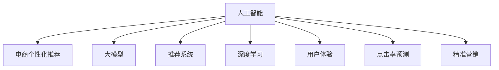

                 

# AI大模型对电商个性化推荐的影响

> 关键词：人工智能, 电商个性化推荐, 大模型, 推荐系统, 深度学习, 用户体验, 点击率预测, 精准营销

## 1. 背景介绍

### 1.1 问题由来

随着电商平台的蓬勃发展，个性化推荐系统已经成为了其核心竞争力之一。通过精准预测用户的购买意图，推荐系统能够显著提升用户体验，增加订单转化率，为电商平台带来巨大的商业价值。然而，传统的推荐系统基于统计模型，在处理大规模数据时容易产生稀疏性问题，且难以捕捉复杂的用户偏好和动态环境变化。因此，如何利用人工智能技术提升推荐系统的智能化水平，成为近年来研究的热点问题。

## 2. 核心概念与联系

### 2.1 核心概念概述

为更好地理解AI大模型对电商个性化推荐的影响，本节将介绍几个密切相关的核心概念：

- **人工智能 (Artificial Intelligence, AI)**：通过模拟人类智能行为，使计算机系统具有理解、学习、推理、自我修正等能力。
- **电商个性化推荐 (E-commerce Personalized Recommendation)**：利用用户行为数据，通过算法模型预测用户可能感兴趣的商品，进行个性化推荐。
- **大模型 (Large Model)**：指参数量巨大的深度神经网络模型，如BERT、GPT等。
- **推荐系统 (Recommendation System)**：基于用户行为数据，为用户提供产品推荐的应用系统，如内容推荐、广告推荐、商品推荐等。
- **深度学习 (Deep Learning)**：利用多层神经网络模拟人脑工作机制，通过大量数据进行训练，学习复杂非线性映射关系的算法。
- **用户体验 (User Experience, UX)**：指用户与产品或服务互动时产生的满意度和愉悦感，是衡量产品好坏的重要指标。
- **点击率预测 (Click-Through Rate Prediction)**：预测用户点击某商品的概率，用于评估推荐系统的效果。
- **精准营销 (Precision Marketing)**：通过精准的用户画像和个性化推荐，提高营销活动的转化率和效果。

这些核心概念之间的逻辑关系可以通过以下Mermaid流程图来展示：



这个流程图展示了大模型在电商推荐系统中的应用路径：

1. 人工智能技术为电商推荐系统提供了强大的技术支持，其中包括大模型、深度学习、推荐系统等核心组件。
2. 大模型通过学习大规模数据，具备强大的语义理解和复杂关系建模能力。
3. 电商推荐系统通过整合多种数据源，如用户行为、商品属性、交易记录等，生成个性化推荐列表。
4. 用户体验通过用户对推荐结果的满意度反馈，指导模型优化，提升推荐系统的性能。
5. 点击率预测通过预测用户点击行为，评估推荐系统的效果，指导模型的迭代优化。
6. 精准营销利用个性化推荐提升营销活动的转化率，实现高效的广告投放。

## 3. 核心算法原理 & 具体操作步骤
### 3.1 算法原理概述

AI大模型在电商个性化推荐中的应用，主要体现在两个方面：数据预训练和任务微调。

1. **数据预训练**：利用大模型在电商领域的海量数据上进行预训练，学习电商领域特定的知识表示和关系建模能力。
2. **任务微调**：将预训练模型应用到具体的推荐任务中，通过微调学习特定任务的知识，提高推荐系统的性能。

### 3.2 算法步骤详解

基于大模型的电商推荐系统主要包括以下几个关键步骤：

**Step 1: 数据准备**

- 收集电商领域的用户行为数据、商品属性数据、用户画像数据等，构建推荐系统的数据集。
- 数据预处理，包括数据清洗、缺失值处理、特征工程等。

**Step 2: 大模型预训练**

- 选择合适的预训练大模型，如BERT、GPT等，使用电商数据进行预训练。
- 设定预训练任务的超参数，如学习率、批量大小、训练轮数等。
- 使用合适的训练技术，如数据增强、迁移学习等。

**Step 3: 推荐任务微调**

- 根据电商推荐任务，设计任务适配层，如点击率预测、物品推荐等。
- 使用电商数据微调预训练模型，优化推荐任务的相关参数。
- 设定微调任务的超参数，如学习率、正则化系数、优化器等。
- 应用优化算法，如AdamW、SGD等，进行模型参数的迭代优化。

**Step 4: 评估与部署**

- 在验证集上评估微调后的模型性能，如AUC、精准率、召回率等。
- 调整模型参数，确保在测试集上达到最佳性能。
- 将微调后的模型部署到电商推荐系统中，实现实时推荐。

### 3.3 算法优缺点

基于大模型的电商推荐系统具有以下优点：

1. **大数据处理能力**：大模型具备强大的语义理解能力和复杂关系建模能力，可以处理海量数据，挖掘用户行为背后的复杂关联。
2. **高泛化能力**：大模型在电商领域进行预训练，学习到的知识具有较强的泛化能力，可以适应不同电商平台的特点。
3. **灵活可调**：大模型可以通过微调的方式，根据具体任务进行参数优化，提高推荐系统的针对性和效果。

同时，该方法也存在以下局限性：

1. **资源需求高**：大模型的预训练和微调需要大量计算资源和时间，成本较高。
2. **模型复杂度高**：大模型通常具有复杂的结构，难以解释和调试。
3. **数据隐私问题**：电商数据涉及用户隐私，数据收集和处理需要遵守相关法律法规。
4. **可解释性不足**：大模型的推荐结果缺乏可解释性，难以理解模型的内部推理过程。

尽管存在这些局限性，但就目前而言，基于大模型的电商推荐系统仍然是大规模电商平台的首选技术方案。未来相关研究的重点在于如何进一步降低资源成本，提高模型的可解释性，同时兼顾隐私保护和用户信任。

### 3.4 算法应用领域

基于大模型的电商推荐系统在多个电商平台上得到了广泛应用，如亚马逊、淘宝、京东等。具体应用领域包括：

- **商品推荐**：根据用户历史购买记录和浏览行为，推荐用户可能感兴趣的商品。
- **广告推荐**：根据用户画像和行为，推荐相关广告，提高广告的点击率和转化率。
- **搜索推荐**：在用户进行搜索时，提供个性化推荐，提升用户体验和满意度。
- **个性化标签推荐**：根据用户兴趣，推荐个性化标签，方便用户浏览和查找。

## 4. 数学模型和公式 & 详细讲解 & 举例说明

### 4.1 数学模型构建

为了更好地理解大模型在电商推荐系统中的应用，我们以点击率预测为例，介绍推荐系统的数学模型构建。

设用户对商品 $i$ 的点击行为为 $y_i$，其中 $y_i \in \{0, 1\}$。设用户对商品 $i$ 的兴趣度为 $h_i$，其中 $h_i \in \mathbb{R}$。假设点击行为 $y_i$ 可以用以下逻辑回归模型预测：

$$
y_i = \sigma(\theta^Th_i)
$$

其中，$\theta$ 为模型的权重向量，$\sigma$ 为sigmoid函数。$h_i$ 是用户对商品 $i$ 的兴趣度，可以表示为商品属性、用户画像、历史行为等多种因素的加权和。

### 4.2 公式推导过程

将上述逻辑回归模型带入交叉熵损失函数中，得到模型训练的损失函数：

$$
\mathcal{L}(\theta) = -\frac{1}{N} \sum_{i=1}^N [y_i \log(\sigma(\theta^Th_i)) + (1-y_i) \log(1-\sigma(\theta^Th_i))]
$$

通过梯度下降等优化算法，不断更新模型参数 $\theta$，使得损失函数 $\mathcal{L}(\theta)$ 最小化。

在电商推荐系统中，为了提高模型的预测精度，常常引入特征工程，将商品属性、用户画像等转换为特征向量，输入到模型中进行训练。例如，假设商品的属性向量为 $A_i = [a_{i1}, a_{i2}, ..., a_{in}]$，用户画像向量为 $U_u = [u_{u1}, u_{u2}, ..., u_{um}]$，则用户对商品 $i$ 的兴趣度 $h_i$ 可以表示为：

$$
h_i = f(A_i, U_u)
$$

其中，$f$ 为特征工程的映射函数，可以采用线性映射、非线性映射等多种形式。

### 4.3 案例分析与讲解

假设有一个电商平台的点击率预测任务，收集了 $10$ 万条用户点击记录和商品属性数据。我们将使用BERT大模型进行预训练，并在点击率预测任务上进行微调。

1. **数据准备**：收集电商平台的点击数据，并进行预处理。
2. **大模型预训练**：使用预训练的BERT模型对电商数据进行预训练。
3. **任务微调**：设计点击率预测任务适配层，并使用点击数据对预训练模型进行微调。
4. **评估与部署**：在验证集上评估微调后的模型性能，并在测试集上进行最终评估。

## 5. 项目实践：代码实例和详细解释说明
### 5.1 开发环境搭建

在进行电商推荐系统开发前，我们需要准备好开发环境。以下是使用Python进行PyTorch开发的环境配置流程：

1. 安装Anaconda：从官网下载并安装Anaconda，用于创建独立的Python环境。

2. 创建并激活虚拟环境：
```bash
conda create -n pytorch-env python=3.8 
conda activate pytorch-env
```

3. 安装PyTorch：根据CUDA版本，从官网获取对应的安装命令。例如：
```bash
conda install pytorch torchvision torchaudio cudatoolkit=11.1 -c pytorch -c conda-forge
```

4. 安装TensorFlow：由Google主导开发的开源深度学习框架，生产部署方便，适合大规模工程应用。同样有丰富的预训练语言模型资源。

5. 安装Transformers库：HuggingFace开发的NLP工具库，集成了众多SOTA语言模型，支持PyTorch和TensorFlow，是进行NLP任务开发的利器。

6. 安装各类工具包：
```bash
pip install numpy pandas scikit-learn matplotlib tqdm jupyter notebook ipython
```

完成上述步骤后，即可在`pytorch-env`环境中开始电商推荐系统的开发。

### 5.2 源代码详细实现

下面我们以电商平台的点击率预测任务为例，给出使用Transformers库对BERT模型进行微调的PyTorch代码实现。

首先，定义点击率预测任务的数据处理函数：

```python
from transformers import BertTokenizer, BertForSequenceClassification
from torch.utils.data import Dataset, DataLoader
import torch

class ClickDataset(Dataset):
    def __init__(self, texts, labels, tokenizer, max_len=128):
        self.texts = texts
        self.labels = labels
        self.tokenizer = tokenizer
        self.max_len = max_len
        
    def __len__(self):
        return len(self.texts)
    
    def __getitem__(self, item):
        text = self.texts[item]
        label = self.labels[item]
        
        encoding = self.tokenizer(text, return_tensors='pt', max_length=self.max_len, padding='max_length', truncation=True)
        input_ids = encoding['input_ids'][0]
        attention_mask = encoding['attention_mask'][0]
        
        # 对label进行编码
        label = label2id[label]  # 假设label2id是一个字典，将label映射到id
        
        return {'input_ids': input_ids, 
                'attention_mask': attention_mask,
                'labels': torch.tensor(label)}
```

然后，定义模型和优化器：

```python
from transformers import AdamW

model = BertForSequenceClassification.from_pretrained('bert-base-cased', num_labels=2)

optimizer = AdamW(model.parameters(), lr=2e-5)
```

接着，定义训练和评估函数：

```python
from tqdm import tqdm
from sklearn.metrics import roc_auc_score

device = torch.device('cuda') if torch.cuda.is_available() else torch.device('cpu')
model.to(device)

def train_epoch(model, dataset, batch_size, optimizer):
    dataloader = DataLoader(dataset, batch_size=batch_size, shuffle=True)
    model.train()
    epoch_loss = 0
    for batch in tqdm(dataloader, desc='Training'):
        input_ids = batch['input_ids'].to(device)
        attention_mask = batch['attention_mask'].to(device)
        labels = batch['labels'].to(device)
        model.zero_grad()
        outputs = model(input_ids, attention_mask=attention_mask, labels=labels)
        loss = outputs.loss
        epoch_loss += loss.item()
        loss.backward()
        optimizer.step()
    return epoch_loss / len(dataloader)

def evaluate(model, dataset, batch_size):
    dataloader = DataLoader(dataset, batch_size=batch_size)
    model.eval()
    preds, labels = [], []
    with torch.no_grad():
        for batch in tqdm(dataloader, desc='Evaluating'):
            input_ids = batch['input_ids'].to(device)
            attention_mask = batch['attention_mask'].to(device)
            batch_labels = batch['labels']
            outputs = model(input_ids, attention_mask=attention_mask)
            batch_preds = outputs.logits.argmax(dim=1).to('cpu').tolist()
            batch_labels = batch_labels.to('cpu').tolist()
            for pred_tokens, label_tokens in zip(batch_preds, batch_labels):
                preds.append(pred_tokens)
                labels.append(label_tokens)
                
    return roc_auc_score(labels, preds)
```

最后，启动训练流程并在测试集上评估：

```python
epochs = 5
batch_size = 16

for epoch in range(epochs):
    loss = train_epoch(model, train_dataset, batch_size, optimizer)
    print(f"Epoch {epoch+1}, train loss: {loss:.3f}")
    
    print(f"Epoch {epoch+1}, dev results:")
    roc_auc = evaluate(model, dev_dataset, batch_size)
    print(f"AUC: {roc_auc:.3f}")
    
print("Test results:")
roc_auc = evaluate(model, test_dataset, batch_size)
print(f"AUC: {roc_auc:.3f}")
```

以上就是使用PyTorch对BERT进行电商点击率预测任务的微调代码实现。可以看到，由于Transformers库的强大封装，我们只需关注模型的加载和微调过程，而不需要过多关注底层实现细节。

### 5.3 代码解读与分析

让我们再详细解读一下关键代码的实现细节：

**ClickDataset类**：
- `__init__`方法：初始化文本、标签、分词器等关键组件。
- `__len__`方法：返回数据集的样本数量。
- `__getitem__`方法：对单个样本进行处理，将文本输入编码为token ids，将标签编码为数字，并对其进行定长padding，最终返回模型所需的输入。

**label2id字典**：
- 定义了标签与id的映射关系，用于将label映射到模型可识别的数字。

**训练和评估函数**：
- 使用PyTorch的DataLoader对数据集进行批次化加载，供模型训练和推理使用。
- 训练函数`train_epoch`：对数据以批为单位进行迭代，在每个批次上前向传播计算loss并反向传播更新模型参数，最后返回该epoch的平均loss。
- 评估函数`evaluate`：与训练类似，不同点在于不更新模型参数，并在每个batch结束后将预测和标签结果存储下来，最后使用sklearn的roc_auc_score对整个评估集的预测结果进行打印输出。

**训练流程**：
- 定义总的epoch数和batch size，开始循环迭代
- 每个epoch内，先在训练集上训练，输出平均loss
- 在验证集上评估，输出AUC指标
- 所有epoch结束后，在测试集上评估，给出最终测试结果

可以看到，PyTorch配合Transformers库使得BERT微调的代码实现变得简洁高效。开发者可以将更多精力放在数据处理、模型改进等高层逻辑上，而不必过多关注底层的实现细节。

当然，工业级的系统实现还需考虑更多因素，如模型的保存和部署、超参数的自动搜索、更灵活的任务适配层等。但核心的微调范式基本与此类似。

## 6. 实际应用场景
### 6.1 智能客服系统

基于AI大模型的电商推荐系统可以广泛应用于智能客服系统的构建。传统的客服系统往往依赖人工，高峰期响应缓慢，且难以提供个性化服务。而使用电商推荐系统的数据和模型，智能客服系统可以7x24小时不间断服务，快速响应客户咨询，用个性化推荐满足用户需求。

在技术实现上，可以收集客户的历史行为数据，如浏览记录、购买记录、搜索记录等，构建推荐模型，并实时预测用户的下一步行为，生成推荐列表。智能客服系统可以将推荐列表作为回答，提升客户满意度。对于客户提出的新问题，还可以接入检索系统实时搜索相关内容，动态组织生成回答。如此构建的智能客服系统，能大幅提升客户咨询体验和问题解决效率。

### 6.2 个性化推荐系统

电商推荐系统已经成为电商平台的核心竞争力之一。通过精准预测用户的购买意图，推荐系统能够显著提升用户体验，增加订单转化率，为电商平台带来巨大的商业价值。AI大模型通过预训练和微调，学习电商领域特定的知识表示和关系建模能力，可以提升推荐系统的智能化水平，实现更高精度的推荐。

在具体实现中，可以通过收集用户的历史行为数据，如浏览记录、购买记录、搜索记录等，构建推荐模型，并实时预测用户的购买行为，生成个性化推荐列表。推荐系统可以将推荐列表展示给用户，帮助用户发现更多感兴趣的商品，提升购买意愿和满意度。通过不断优化推荐模型，电商平台可以实现精准营销，提高广告投放的效果和效率。

### 6.3 跨平台推荐系统

随着电商平台的不断扩展，用户在不同平台上的行为数据往往分散在不同的系统上，难以统一管理和分析。基于AI大模型的推荐系统可以跨平台集成，实现数据共享和协同推荐。

例如，用户在淘宝上浏览了某款商品，并在京东上购买了该商品。通过跨平台推荐系统，可以在京东上为用户推荐相关商品，提升用户体验和购买意愿。这种跨平台推荐可以大大提升推荐的全面性和精准性，帮助电商平台更好地满足用户需求，提升市场竞争力。

## 7. 工具和资源推荐
### 7.1 学习资源推荐

为了帮助开发者系统掌握AI大模型在电商推荐系统中的应用，这里推荐一些优质的学习资源：

1. 《深度学习与推荐系统》系列课程：由清华大学、斯坦福大学等高校教授讲授，系统介绍了深度学习在推荐系统中的应用。
2. 《推荐系统实战》书籍：详细介绍推荐系统的实现方法、算法优化和工程实践。
3. 《PyTorch深度学习实践》书籍：提供了大量深度学习模型的代码实现和应用案例。
4. 《电商数据科学与工程》课程：介绍电商数据处理、特征工程、推荐模型构建的完整流程。
5. HuggingFace官方文档：提供了丰富的预训练模型和微调样例代码，是上手实践的必备资料。

通过对这些资源的学习实践，相信你一定能够快速掌握AI大模型在电商推荐系统中的应用，并用于解决实际的推荐问题。

### 7.2 开发工具推荐

高效的开发离不开优秀的工具支持。以下是几款用于电商推荐系统开发的常用工具：

1. PyTorch：基于Python的开源深度学习框架，灵活动态的计算图，适合快速迭代研究。大部分预训练语言模型都有PyTorch版本的实现。
2. TensorFlow：由Google主导开发的开源深度学习框架，生产部署方便，适合大规模工程应用。同样有丰富的预训练语言模型资源。
3. Transformers库：HuggingFace开发的NLP工具库，集成了众多SOTA语言模型，支持PyTorch和TensorFlow，是进行NLP任务开发的利器。
4. Weights & Biases：模型训练的实验跟踪工具，可以记录和可视化模型训练过程中的各项指标，方便对比和调优。与主流深度学习框架无缝集成。
5. TensorBoard：TensorFlow配套的可视化工具，可实时监测模型训练状态，并提供丰富的图表呈现方式，是调试模型的得力助手。
6. Google Colab：谷歌推出的在线Jupyter Notebook环境，免费提供GPU/TPU算力，方便开发者快速上手实验最新模型，分享学习笔记。

合理利用这些工具，可以显著提升电商推荐系统的开发效率，加快创新迭代的步伐。

### 7.3 相关论文推荐

AI大模型和电商推荐技术的发展源于学界的持续研究。以下是几篇奠基性的相关论文，推荐阅读：

1. Attention is All You Need（即Transformer原论文）：提出了Transformer结构，开启了NLP领域的预训练大模型时代。
2. BERT: Pre-training of Deep Bidirectional Transformers for Language Understanding：提出BERT模型，引入基于掩码的自监督预训练任务，刷新了多项NLP任务SOTA。
3. Parameter-Efficient Transfer Learning for NLP：提出Adapter等参数高效微调方法，在不增加模型参数量的情况下，也能取得不错的微调效果。
4. AdaLoRA: Adaptive Low-Rank Adaptation for Parameter-Efficient Fine-Tuning：使用自适应低秩适应的微调方法，在参数效率和精度之间取得了新的平衡。
5. Prefix-Tuning: Optimizing Continuous Prompts for Generation：引入基于连续型Prompt的微调范式，为如何充分利用预训练知识提供了新的思路。

这些论文代表了大语言模型微调技术的发展脉络。通过学习这些前沿成果，可以帮助研究者把握学科前进方向，激发更多的创新灵感。

## 8. 总结：未来发展趋势与挑战
### 8.1 总结

本文对AI大模型在电商个性化推荐中的应用进行了全面系统的介绍。首先阐述了AI大模型和电商推荐系统的研究背景和意义，明确了推荐系统在电商平台的竞争优势。其次，从原理到实践，详细讲解了电商推荐系统中的数据预训练和任务微调，提供了完整的代码实例。同时，本文还广泛探讨了推荐系统在智能客服、个性化推荐、跨平台推荐等实际应用场景中的价值，展示了AI大模型在电商推荐系统中的应用前景。此外，本文精选了电商推荐系统的各类学习资源，力求为读者提供全方位的技术指引。

通过本文的系统梳理，可以看到，AI大模型在电商推荐系统中的应用，极大地提升了推荐系统的智能化水平，实现了高精度的个性化推荐。AI大模型通过预训练和微调，学习电商领域特定的知识表示和关系建模能力，显著提升了推荐系统的效果和性能。未来，随着AI大模型的不断发展，电商推荐系统必将更加智能、高效、个性化，为用户提供更好的购物体验。

### 8.2 未来发展趋势

展望未来，AI大模型在电商推荐系统中的应用将呈现以下几个发展趋势：

1. **推荐系统智能化水平提升**：随着深度学习和大模型的不断发展，推荐系统的智能化水平将进一步提升，能够更加精准地预测用户行为，生成个性化推荐。
2. **实时推荐系统普及**：实时推荐系统将更加普及，能够实时处理用户行为数据，及时更新推荐列表，提升用户体验。
3. **跨平台推荐系统发展**：跨平台推荐系统将成为电商推荐系统的核心技术之一，能够整合不同平台的用户行为数据，实现跨平台协同推荐。
4. **数据隐私保护加强**：随着数据隐私保护法律法规的完善，电商平台将更加注重用户数据隐私保护，推荐系统也将采用更加先进的数据处理技术，确保用户数据的安全。
5. **推荐系统可解释性增强**：为了满足用户对推荐系统的信任需求，推荐系统将更加注重可解释性，提供透明、可信的推荐理由。

以上趋势凸显了AI大模型在电商推荐系统中的重要价值。这些方向的探索发展，必将进一步提升推荐系统的性能和应用范围，为电商平台的智能化转型提供强有力的技术支持。

### 8.3 面临的挑战

尽管AI大模型在电商推荐系统中的应用已经取得了显著成果，但在迈向更加智能化、个性化、实时化的过程中，仍面临诸多挑战：

1. **数据隐私保护**：电商推荐系统需要收集用户行为数据，如何确保数据隐私安全，防止数据泄露和滥用，是电商平台面临的重要挑战。
2. **模型复杂度高**：AI大模型通常具有复杂的结构，难以解释和调试。如何在保证性能的同时，提高模型的可解释性，增强用户对推荐系统的信任，是一个重要课题。
3. **实时推荐系统**：实时推荐系统需要高效处理海量数据，对计算资源和存储资源提出了很高的要求。如何在保证性能的同时，降低成本，提高系统稳定性，是一个重要挑战。
4. **跨平台推荐系统**：跨平台推荐系统需要整合不同平台的用户行为数据，数据格式和标准各异，数据集成和处理复杂度较高。
5. **推荐系统鲁棒性**：推荐系统需要具备良好的鲁棒性，能够应对数据异常、网络异常等情况，避免模型失效和推荐错误。

这些挑战需要技术社区和电商平台的共同努力，通过持续的创新和优化，才能实现AI大模型在电商推荐系统中的广泛应用。

### 8.4 研究展望

面对AI大模型在电商推荐系统中的挑战，未来的研究需要在以下几个方面寻求新的突破：

1. **数据隐私保护技术**：开发更加先进的数据保护技术，如差分隐私、联邦学习等，确保用户数据的安全和隐私。
2. **模型压缩与优化**：开发更加高效的模型压缩和优化技术，如量化加速、模型剪枝、模型蒸馏等，提高模型的实时性和资源效率。
3. **推荐系统可解释性**：开发更加透明、可解释的推荐系统，通过可视化、推荐理由生成等方式，提高用户的信任和满意度。
4. **跨平台推荐系统架构**：设计更加高效的跨平台推荐系统架构，实现数据的高效集成和处理，提升跨平台协同推荐的效果。
5. **推荐系统鲁棒性提升**：开发更加鲁棒的推荐系统算法，增强系统对异常数据的处理能力，确保推荐系统的稳定性和可靠性。

这些研究方向的探索，必将引领AI大模型在电商推荐系统中的应用迈向更高的台阶，为电商平台的智能化转型提供更强大的技术保障。

## 9. 附录：常见问题与解答

**Q1：电商推荐系统如何处理大规模数据？**

A: 电商推荐系统通常需要处理大规模的用户行为数据，包括点击记录、浏览记录、购买记录等。为了提高系统的处理能力，可以采用以下方法：

1. **分布式计算**：将数据分布到多台机器上进行并行处理，提高处理效率。
2. **特征降维**：通过特征工程将高维数据降维，减少计算量。
3. **数据分区**：将数据分为多个分区，并行处理每个分区，提高处理效率。
4. **数据缓存**：将常用数据缓存到内存中，减少I/O操作，提高系统响应速度。

通过这些方法，电商推荐系统可以高效处理大规模数据，实现实时推荐。

**Q2：电商推荐系统的推荐效果如何评估？**

A: 电商推荐系统的推荐效果可以通过多种指标进行评估，如精确率、召回率、覆盖率、平均排名、点击率、转化率等。具体评估方法包括：

1. **离线评估**：使用历史数据集进行离线评估，计算模型在测试集上的各种指标。
2. **在线评估**：将模型部署到实际推荐系统中，实时监控推荐效果，评估模型的在线表现。
3. **A/B测试**：将模型部署到部分用户，与原始推荐系统进行对比，评估新模型的效果。
4. **用户满意度调查**：通过用户满意度调查，评估用户对推荐结果的满意度，指导模型的优化。

这些评估方法结合使用，可以全面评估电商推荐系统的推荐效果，指导模型的不断优化和改进。

**Q3：电商推荐系统如何进行模型微调？**

A: 电商推荐系统的模型微调通常包括以下步骤：

1. **数据准备**：收集电商平台的点击数据，并进行预处理。
2. **大模型预训练**：使用预训练的AI大模型对电商数据进行预训练，学习电商领域特定的知识表示和关系建模能力。
3. **任务微调**：设计推荐任务适配层，并使用电商数据对预训练模型进行微调，优化推荐任务的相关参数。
4. **评估与部署**：在验证集上评估微调后的模型性能，并在测试集上进行最终评估，将模型部署到实际推荐系统中。

通过这些步骤，电商推荐系统可以不断优化推荐模型，提升推荐效果和用户体验。

**Q4：电商推荐系统如何应对数据冷启动问题？**

A: 电商推荐系统在面对新用户或新商品时，通常会出现数据冷启动问题，难以进行个性化推荐。为了解决这一问题，可以采用以下方法：

1. **推荐基线**：使用通用推荐算法，如协同过滤、内容推荐等，为新用户或新商品提供推荐基线。
2. **数据增强**：通过数据增强技术，如回译、生成对抗网络等，扩充用户行为数据，提高模型的泛化能力。
3. **知识图谱**：引入知识图谱，构建商品和用户之间的知识网络，增强模型的知识表示能力。
4. **跨模态融合**：引入图像、语音等多模态信息，增强推荐系统的表现力和精准度。

通过这些方法，电商推荐系统可以更好地应对数据冷启动问题，为新用户和商品提供准确的推荐。

**Q5：电商推荐系统如何实现精准推荐？**

A: 电商推荐系统实现精准推荐的关键在于模型设计和特征工程。以下是一些常见的方法：

1. **特征工程**：通过特征选择、特征组合、特征降维等方法，提取和构建高质量的特征，提高模型的预测能力。
2. **模型优化**：采用先进深度学习模型，如Transformer、BERT等，提高模型的表达能力和泛化能力。
3. **上下文感知**：引入上下文信息，如用户画像、商品属性、交易记录等，增强推荐系统的个性化和精准度。
4. **在线学习**：采用在线学习技术，实时更新模型参数，适应用户行为的变化。
5. **模型集成**：采用模型集成技术，结合多个模型的预测结果，提高推荐系统的稳定性和效果。

通过这些方法，电商推荐系统可以实现精准推荐，提升用户的购买意愿和满意度。

---

作者：禅与计算机程序设计艺术 / Zen and the Art of Computer Programming

