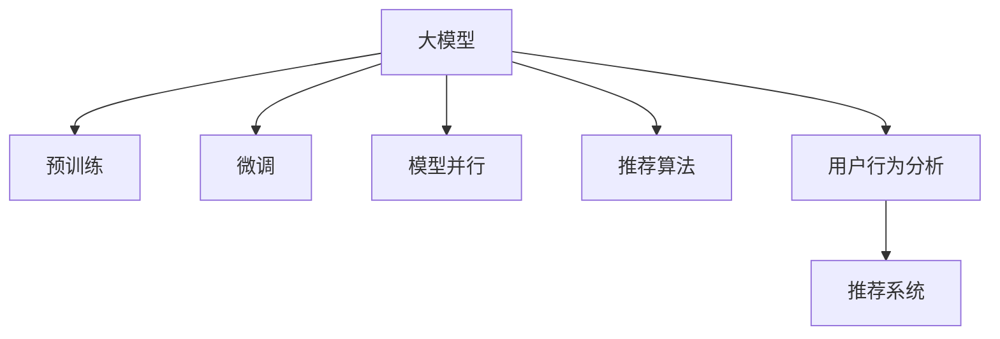

                 

# AI大模型视角下电商搜索推荐的技术创新项目孵化机制

## 1. 背景介绍

### 1.1 问题由来
在数字经济时代，电商平台已成为人们获取商品信息、进行购物消费的主要渠道。随着移动互联网、大数据、人工智能等技术的迅速发展，电商平台的搜索推荐系统也从早期的静态推荐逐步演进为基于用户行为动态调整的智能推荐系统。然而，现有的推荐算法仍然面临着诸多挑战：

1. **数据稀疏性问题**：电商平台的商品和用户数据量巨大，但每个用户访问的商品种类有限，导致用户的浏览行为数据非常稀疏。

2. **推荐同质化问题**：由于算法无法充分考虑用户的多样化需求，导致推荐结果单一，用户体验逐渐疲劳。

3. **冷启动问题**：新用户和商品缺乏足够的历史数据，推荐系统无法为其提供有价值的推荐。

4. **计算资源消耗大**：传统的推荐算法如协同过滤等计算复杂度高，难以应对大规模用户和商品数据。

针对这些问题，AI大模型在电商搜索推荐中的应用提供了一种全新的解决方案。通过预训练模型和微调机制，大模型可以更好地学习用户和商品的多样化特征，解决数据稀疏性和冷启动问题，同时通过计算高效的算法，提升推荐系统的实时性和资源利用率。

### 1.2 问题核心关键点
AI大模型在电商搜索推荐中的应用核心在于以下几点：

1. **预训练与微调**：大模型通过大规模无标签数据进行预训练，获得通用的语言和商品表示，并通过下游任务的少量标注数据进行微调，获得针对具体任务优化的模型。

2. **模型并行与计算优化**：大模型的计算复杂度高，需要通过分布式并行计算、模型压缩等技术进行优化。

3. **推荐算法融合**：将大模型的输出结果与传统推荐算法如协同过滤、深度学习等进行融合，提升推荐系统的综合性能。

4. **用户反馈与模型迭代**：通过用户对推荐结果的反馈，不断迭代优化模型，提升推荐准确率和用户体验。

## 2. 核心概念与联系

### 2.1 核心概念概述

为更好地理解AI大模型在电商搜索推荐中的应用，本节将介绍几个密切相关的核心概念：

- **大模型**：以Transformer为基础的预训练语言模型，如BERT、GPT等。这些模型通过大规模无标签数据进行预训练，学习到丰富的语言表示，可以应用于各种NLP任务。

- **预训练**：在大规模无标签数据上，通过自监督学习任务训练通用语言模型的过程。常见的预训练任务包括掩码语言模型、下一句预测等。

- **微调**：在预训练模型的基础上，使用下游任务的少量标注数据，通过有监督学习优化模型在特定任务上的性能。

- **模型并行**：通过分布式计算和模型分割，提高大模型的计算效率，使其能在合理的时间内处理大规模数据。

- **推荐算法**：用于商品推荐的技术手段，包括协同过滤、基于内容的推荐、深度学习等。

- **用户行为分析**：通过分析用户的行为数据，挖掘用户的兴趣和偏好，指导推荐系统的策略制定。

- **推荐系统**：根据用户行为数据和商品特征，动态生成个性化推荐结果的系统。

这些核心概念之间的逻辑关系可以通过以下Mermaid流程图来展示：



这个流程图展示了大模型在电商搜索推荐中的核心概念及其之间的关系：

1. 大模型通过预训练获得基础能力。
2. 微调优化模型针对具体电商推荐任务的性能。
3. 模型并行和计算优化提高推荐系统的实时性和效率。
4. 推荐算法融合提升推荐系统的综合性能。
5. 用户行为分析挖掘用户兴趣，指导推荐策略。
6. 推荐系统根据用户行为数据生成个性化推荐结果。

这些概念共同构成了AI大模型在电商搜索推荐中的应用框架，使其能够更好地适应电商平台的实际需求，提升推荐系统的用户体验和效果。

## 3. 核心算法原理 & 具体操作步骤
### 3.1 算法原理概述

基于AI大模型的电商搜索推荐系统，本质上是一个多任务联合学习的过程。其核心思想是：将大模型视作一个强大的"特征提取器"，通过在不同任务上的微调，学习不同任务之间的共享特征和特定任务特征，从而生成个性化推荐结果。

形式化地，假设大模型为 $M_{\theta}$，其中 $\theta$ 为模型参数。给定电商推荐任务 $T$ 的标注数据集 $D=\{(x_i, y_i)\}_{i=1}^N$，其中 $x_i$ 为用户行为数据，$y_i$ 为推荐结果。微调的目标是找到新的模型参数 $\hat{\theta}$，使得：

$$
\hat{\theta}=\mathop{\arg\min}_{\theta} \mathcal{L}(M_{\theta},D)
$$

其中 $\mathcal{L}$ 为针对任务 $T$ 设计的损失函数，用于衡量模型预测输出与真实标签之间的差异。常见的损失函数包括交叉熵损失、均方误差损失等。

通过梯度下降等优化算法，微调过程不断更新模型参数 $\theta$，最小化损失函数 $\mathcal{L}$，使得模型输出逼近真实标签。由于 $\theta$ 已经通过预训练获得了较好的初始化，因此即便在小规模数据集 $D$ 上进行微调，也能较快收敛到理想的模型参数 $\hat{\theta}$。

### 3.2 算法步骤详解

基于AI大模型的电商搜索推荐系统，一般包括以下几个关键步骤：

**Step 1: 准备预训练模型和数据集**
- 选择合适的预训练大模型 $M_{\theta}$ 作为初始化参数，如BERT、GPT等。
- 准备电商推荐任务 $T$ 的标注数据集 $D$，划分为训练集、验证集和测试集。一般要求标注数据与预训练数据的分布不要差异过大。

**Step 2: 添加任务适配层**
- 根据任务类型，在预训练模型顶层设计合适的输出层和损失函数。
- 对于分类任务，通常在顶层添加线性分类器和交叉熵损失函数。
- 对于生成任务，通常使用语言模型的解码器输出概率分布，并以负对数似然为损失函数。

**Step 3: 设置微调超参数**
- 选择合适的优化算法及其参数，如 AdamW、SGD 等，设置学习率、批大小、迭代轮数等。
- 设置正则化技术及强度，包括权重衰减、Dropout、Early Stopping等。
- 确定冻结预训练参数的策略，如仅微调顶层，或全部参数都参与微调。

**Step 4: 执行梯度训练**
- 将训练集数据分批次输入模型，前向传播计算损失函数。
- 反向传播计算参数梯度，根据设定的优化算法和学习率更新模型参数。
- 周期性在验证集上评估模型性能，根据性能指标决定是否触发 Early Stopping。
- 重复上述步骤直到满足预设的迭代轮数或 Early Stopping 条件。

**Step 5: 测试和部署**
- 在测试集上评估微调后模型 $M_{\hat{\theta}}$ 的性能，对比微调前后的精度提升。
- 使用微调后的模型对新样本进行推理预测，集成到实际的应用系统中。
- 持续收集新的数据，定期重新微调模型，以适应数据分布的变化。

以上是基于AI大模型的电商搜索推荐系统的的一般流程。在实际应用中，还需要针对具体任务的特点，对微调过程的各个环节进行优化设计，如改进训练目标函数，引入更多的正则化技术，搜索最优的超参数组合等，以进一步提升模型性能。

### 3.3 算法优缺点

基于AI大模型的电商搜索推荐系统具有以下优点：
1. 简单高效。只需准备少量标注数据，即可对预训练模型进行快速适配，获得较大的性能提升。
2. 通用适用。适用于各种电商推荐任务，包括分类、匹配、生成等，设计简单的任务适配层即可实现微调。
3. 参数高效。利用参数高效微调技术，在固定大部分预训练权重不变的情况下，仍可取得不错的微调效果。
4. 效果显著。在学术界和工业界的诸多任务上，基于微调的方法已经刷新了最先进的性能指标。

同时，该方法也存在一定的局限性：
1. 依赖标注数据。微调的效果很大程度上取决于标注数据的质量和数量，获取高质量标注数据的成本较高。
2. 迁移能力有限。当目标任务与预训练数据的分布差异较大时，微调的性能提升有限。
3. 负面效果传递。预训练模型的固有偏见、有害信息等，可能通过微调传递到下游任务，造成负面影响。
4. 可解释性不足。微调模型的决策过程通常缺乏可解释性，难以对其推理逻辑进行分析和调试。

尽管存在这些局限性，但就目前而言，基于AI大模型的电商搜索推荐系统仍是最主流范式。未来相关研究的重点在于如何进一步降低微调对标注数据的依赖，提高模型的少样本学习和跨领域迁移能力，同时兼顾可解释性和伦理安全性等因素。

### 3.4 算法应用领域

基于AI大模型的电商搜索推荐系统，在电商领域已经得到了广泛的应用，覆盖了几乎所有常见任务，例如：

- 商品分类：如服装、电子产品、家居用品等。通过微调使模型学习商品属性-类别映射。
- 商品匹配：如关联推荐、广告推荐等。通过微调使模型学习商品间的关联关系。
- 个性化推荐：如基于用户行为的推荐、基于商品属性的推荐等。通过微调使模型学习用户兴趣和商品特征。
- 搜索优化：如关键词匹配、搜索结果排序等。通过微调使模型学习用户查询意图和商品匹配度。

除了上述这些经典任务外，AI大模型在电商领域的应用还包括更前沿的领域，如可控文本生成、标签预测、多商品推荐等，为电商平台带来了全新的突破。随着大语言模型和微调方法的不断进步，相信电商平台将在更广阔的应用领域大放异彩。

## 4. 数学模型和公式 & 详细讲解  
### 4.1 数学模型构建

本节将使用数学语言对基于AI大模型的电商搜索推荐系统进行更加严格的刻画。

记预训练大模型为 $M_{\theta}$，其中 $\theta$ 为模型参数。假设电商推荐任务为分类任务，目标是将商品分为若干类别。给定电商推荐任务 $T$ 的标注数据集 $D=\{(x_i, y_i)\}_{i=1}^N$，其中 $x_i$ 为商品特征，$y_i$ 为商品类别。

定义模型 $M_{\theta}$ 在输入 $x$ 上的输出为 $\hat{y}=M_{\theta}(x)$，表示商品属于各类别的概率分布。模型 $M_{\theta}$ 的损失函数 $\mathcal{L}(\theta)$ 定义为：

$$
\mathcal{L}(\theta) = -\frac{1}{N} \sum_{i=1}^N \sum_{c=1}^C y_{i,c} \log M_{\theta}(x_i)_c
$$

其中 $y_{i,c}$ 表示商品 $i$ 属于类别 $c$ 的标签，$C$ 为类别数。$\mathcal{L}$ 函数为多分类交叉熵损失函数，用于衡量模型预测输出与真实标签之间的差异。

根据链式法则，损失函数对参数 $\theta_k$ 的梯度为：

$$
\frac{\partial \mathcal{L}(\theta)}{\partial \theta_k} = -\frac{1}{N} \sum_{i=1}^N \sum_{c=1}^C \frac{y_{i,c}}{M_{\theta}(x_i)_c} \frac{\partial M_{\theta}(x_i)}{\partial \theta_k}
$$

其中 $\frac{\partial M_{\theta}(x_i)}{\partial \theta_k}$ 可进一步递归展开，利用自动微分技术完成计算。

在得到损失函数的梯度后，即可带入参数更新公式，完成模型的迭代优化。重复上述过程直至收敛，最终得到适应电商推荐任务的最优模型参数 $\theta^*$。

### 4.2 公式推导过程

以下我们以多分类任务为例，推导多分类交叉熵损失函数及其梯度的计算公式。

假设模型 $M_{\theta}$ 在输入 $x$ 上的输出为 $\hat{y}=M_{\theta}(x) \in [0,1]$，表示商品属于各类别的概率。真实标签 $y \in \{0,1\}^C$，其中 $y_c$ 表示商品属于类别 $c$ 的标签。则多分类交叉熵损失函数定义为：

$$
\mathcal{L}(M_{\theta}(x),y) = -\sum_{c=1}^C y_c \log M_{\theta}(x)_c
$$

将其代入经验风险公式，得：

$$
\mathcal{L}(\theta) = -\frac{1}{N}\sum_{i=1}^N \sum_{c=1}^C y_{i,c} \log M_{\theta}(x_i)_c
$$

根据链式法则，损失函数对参数 $\theta_k$ 的梯度为：

$$
\frac{\partial \mathcal{L}(\theta)}{\partial \theta_k} = -\frac{1}{N}\sum_{i=1}^N \sum_{c=1}^C \frac{y_{i,c}}{M_{\theta}(x_i)_c} \frac{\partial M_{\theta}(x_i)}{\partial \theta_k}
$$

其中 $\frac{\partial M_{\theta}(x_i)}{\partial \theta_k}$ 可进一步递归展开，利用自动微分技术完成计算。

在得到损失函数的梯度后，即可带入参数更新公式，完成模型的迭代优化。重复上述过程直至收敛，最终得到适应电商推荐任务的最优模型参数 $\theta^*$。

## 5. 项目实践：代码实例和详细解释说明
### 5.1 开发环境搭建

在进行电商搜索推荐系统的微调实践前，我们需要准备好开发环境。以下是使用Python进行PyTorch开发的环境配置流程：

1. 安装Anaconda：从官网下载并安装Anaconda，用于创建独立的Python环境。

2. 创建并激活虚拟环境：
```bash
conda create -n pytorch-env python=3.8 
conda activate pytorch-env
```

3. 安装PyTorch：根据CUDA版本，从官网获取对应的安装命令。例如：
```bash
conda install pytorch torchvision torchaudio cudatoolkit=11.1 -c pytorch -c conda-forge
```

4. 安装Transformers库：
```bash
pip install transformers
```

5. 安装各类工具包：
```bash
pip install numpy pandas scikit-learn matplotlib tqdm jupyter notebook ipython
```

完成上述步骤后，即可在`pytorch-env`环境中开始微调实践。

### 5.2 源代码详细实现

下面我们以电商商品分类任务为例，给出使用Transformers库对BERT模型进行微调的PyTorch代码实现。

首先，定义电商商品分类任务的数据处理函数：

```python
from transformers import BertTokenizer
from torch.utils.data import Dataset
import torch

class ProductClassificationDataset(Dataset):
    def __init__(self, texts, labels, tokenizer, max_len=128):
        self.texts = texts
        self.labels = labels
        self.tokenizer = tokenizer
        self.max_len = max_len
        
    def __len__(self):
        return len(self.texts)
    
    def __getitem__(self, item):
        text = self.texts[item]
        label = self.labels[item]
        
        encoding = self.tokenizer(text, return_tensors='pt', max_length=self.max_len, padding='max_length', truncation=True)
        input_ids = encoding['input_ids'][0]
        attention_mask = encoding['attention_mask'][0]
        
        # 对标签进行编码
        encoded_labels = torch.tensor(label, dtype=torch.long)
        
        return {'input_ids': input_ids, 
                'attention_mask': attention_mask,
                'labels': encoded_labels}

# 定义标签与id的映射
label2id = {'clothing': 0, 'electronics': 1, 'home_goods': 2, 'health': 3}
id2label = {v: k for k, v in label2id.items()}

# 创建dataset
tokenizer = BertTokenizer.from_pretrained('bert-base-cased')

train_dataset = ProductClassificationDataset(train_texts, train_labels, tokenizer)
dev_dataset = ProductClassificationDataset(dev_texts, dev_labels, tokenizer)
test_dataset = ProductClassificationDataset(test_texts, test_labels, tokenizer)
```

然后，定义模型和优化器：

```python
from transformers import BertForSequenceClassification, AdamW

model = BertForSequenceClassification.from_pretrained('bert-base-cased', num_labels=len(label2id))

optimizer = AdamW(model.parameters(), lr=2e-5)
```

接着，定义训练和评估函数：

```python
from torch.utils.data import DataLoader
from tqdm import tqdm
from sklearn.metrics import accuracy_score

device = torch.device('cuda') if torch.cuda.is_available() else torch.device('cpu')
model.to(device)

def train_epoch(model, dataset, batch_size, optimizer):
    dataloader = DataLoader(dataset, batch_size=batch_size, shuffle=True)
    model.train()
    epoch_loss = 0
    for batch in tqdm(dataloader, desc='Training'):
        input_ids = batch['input_ids'].to(device)
        attention_mask = batch['attention_mask'].to(device)
        labels = batch['labels'].to(device)
        model.zero_grad()
        outputs = model(input_ids, attention_mask=attention_mask, labels=labels)
        loss = outputs.loss
        epoch_loss += loss.item()
        loss.backward()
        optimizer.step()
    return epoch_loss / len(dataloader)

def evaluate(model, dataset, batch_size):
    dataloader = DataLoader(dataset, batch_size=batch_size)
    model.eval()
    preds, labels = [], []
    with torch.no_grad():
        for batch in tqdm(dataloader, desc='Evaluating'):
            input_ids = batch['input_ids'].to(device)
            attention_mask = batch['attention_mask'].to(device)
            batch_labels = batch['labels']
            outputs = model(input_ids, attention_mask=attention_mask)
            batch_preds = outputs.logits.argmax(dim=1).to('cpu').tolist()
            batch_labels = batch_labels.to('cpu').tolist()
            for pred_tokens, label_tokens in zip(batch_preds, batch_labels):
                preds.append(pred_tokens[:len(label_tokens)])
                labels.append(label_tokens)
                
    print("Accuracy: {:.2f}%".format(accuracy_score(labels, preds)))
```

最后，启动训练流程并在测试集上评估：

```python
epochs = 5
batch_size = 16

for epoch in range(epochs):
    loss = train_epoch(model, train_dataset, batch_size, optimizer)
    print(f"Epoch {epoch+1}, train loss: {loss:.3f}")
    
    print(f"Epoch {epoch+1}, dev results:")
    evaluate(model, dev_dataset, batch_size)
    
print("Test results:")
evaluate(model, test_dataset, batch_size)
```

以上就是使用PyTorch对BERT进行电商商品分类任务微调的完整代码实现。可以看到，得益于Transformers库的强大封装，我们可以用相对简洁的代码完成BERT模型的加载和微调。

### 5.3 代码解读与分析

让我们再详细解读一下关键代码的实现细节：

**ProductClassificationDataset类**：
- `__init__`方法：初始化文本、标签、分词器等关键组件。
- `__len__`方法：返回数据集的样本数量。
- `__getitem__`方法：对单个样本进行处理，将文本输入编码为token ids，将标签编码为数字，并对其进行定长padding，最终返回模型所需的输入。

**label2id和id2label字典**：
- 定义了标签与数字id之间的映射关系，用于将标签进行编码。

**训练和评估函数**：
- 使用PyTorch的DataLoader对数据集进行批次化加载，供模型训练和推理使用。
- 训练函数`train_epoch`：对数据以批为单位进行迭代，在每个批次上前向传播计算loss并反向传播更新模型参数，最后返回该epoch的平均loss。
- 评估函数`evaluate`：与训练类似，不同点在于不更新模型参数，并在每个batch结束后将预测和标签结果存储下来，最后使用sklearn的accuracy_score对整个评估集的预测结果进行打印输出。

**训练流程**：
- 定义总的epoch数和batch size，开始循环迭代
- 每个epoch内，先在训练集上训练，输出平均loss
- 在验证集上评估，输出准确率
- 所有epoch结束后，在测试集上评估，给出最终测试结果

可以看到，PyTorch配合Transformers库使得BERT微调的代码实现变得简洁高效。开发者可以将更多精力放在数据处理、模型改进等高层逻辑上，而不必过多关注底层的实现细节。

当然，工业级的系统实现还需考虑更多因素，如模型的保存和部署、超参数的自动搜索、更灵活的任务适配层等。但核心的微调范式基本与此类似。

## 6. 实际应用场景
### 6.1 智能客服系统

基于AI大模型的电商搜索推荐技术，可以广泛应用于智能客服系统的构建。传统客服往往需要配备大量人力，高峰期响应缓慢，且一致性和专业性难以保证。而使用微调后的搜索推荐模型，可以7x24小时不间断服务，快速响应客户咨询，用自然流畅的语言解答各类常见问题。

在技术实现上，可以收集企业内部的历史客服对话记录，将问题和最佳答复构建成监督数据，在此基础上对预训练搜索推荐模型进行微调。微调后的搜索推荐模型能够自动理解用户意图，匹配最合适的答案模板进行回复。对于客户提出的新问题，还可以接入检索系统实时搜索相关内容，动态组织生成回答。如此构建的智能客服系统，能大幅提升客户咨询体验和问题解决效率。

### 6.2 商品推荐系统

基于AI大模型的电商搜索推荐技术，可以构建高效的个性化推荐系统。通过微调学习用户的历史行为和商品特征，生成符合用户兴趣的推荐结果。推荐系统可以根据用户的点击、购买行为等实时数据进行动态调整，提升推荐相关性和多样性，使用户获得更好的购物体验。

在技术实现上，可以收集用户的历史浏览记录、购买记录、搜索记录等行为数据，将其编码为特征向量，与商品特征一起作为模型的输入。通过微调，模型学习用户兴趣与商品之间的关联关系，生成个性化的推荐结果。此外，还可以结合深度学习算法，如协同过滤、矩阵分解等，提升推荐效果。

### 6.3 广告推荐系统

基于AI大模型的电商搜索推荐技术，可以构建高效的广告推荐系统。通过微调学习用户的历史行为和广告特征，生成符合用户兴趣的广告推荐结果。广告系统可以根据用户的点击、转化行为等实时数据进行动态调整，提升广告投放的精准度和转化率，帮助商家获得更高的营销效果。

在技术实现上，可以收集用户的历史浏览记录、购买记录、搜索记录等行为数据，以及广告的点击率、转化率等特征数据，将其编码为特征向量，与广告特征一起作为模型的输入。通过微调，模型学习用户兴趣与广告之间的关联关系，生成个性化的广告推荐结果。此外，还可以结合深度学习算法，如协同过滤、矩阵分解等，提升广告投放效果。

### 6.4 未来应用展望

随着AI大模型和电商搜索推荐技术的不断发展，基于微调范式将在更多领域得到应用，为传统行业带来变革性影响。

在智慧医疗领域，基于微调的推荐系统可以辅助医生诊断和治疗，提供个性化的诊疗建议，提升医疗服务的智能化水平。

在智能教育领域，微调技术可应用于作业批改、学情分析、知识推荐等方面，因材施教，促进教育公平，提高教学质量。

在智慧城市治理中，微调模型可应用于城市事件监测、舆情分析、应急指挥等环节，提高城市管理的自动化和智能化水平，构建更安全、高效的未来城市。

此外，在企业生产、社会治理、文娱传媒等众多领域，基于大模型微调的人工智能应用也将不断涌现，为经济社会发展注入新的动力。相信随着技术的日益成熟，微调方法将成为人工智能落地应用的重要范式，推动人工智能技术在各行各业大放异彩。

## 7. 工具和资源推荐
### 7.1 学习资源推荐

为了帮助开发者系统掌握AI大模型在电商搜索推荐中的应用，这里推荐一些优质的学习资源：

1. 《Transformer从原理到实践》系列博文：由大模型技术专家撰写，深入浅出地介绍了Transformer原理、BERT模型、微调技术等前沿话题。

2. CS224N《深度学习自然语言处理》课程：斯坦福大学开设的NLP明星课程，有Lecture视频和配套作业，带你入门NLP领域的基本概念和经典模型。

3. 《Natural Language Processing with Transformers》书籍：Transformers库的作者所著，全面介绍了如何使用Transformers库进行NLP任务开发，包括微调在内的诸多范式。

4. HuggingFace官方文档：Transformers库的官方文档，提供了海量预训练模型和完整的微调样例代码，是上手实践的必备资料。

5. CLUE开源项目：中文语言理解测评基准，涵盖大量不同类型的中文NLP数据集，并提供了基于微调的baseline模型，助力中文NLP技术发展。

通过对这些资源的学习实践，相信你一定能够快速掌握AI大模型在电商搜索推荐中的应用精髓，并用于解决实际的电商问题。
###  7.2 开发工具推荐

高效的开发离不开优秀的工具支持。以下是几款用于AI大模型电商搜索推荐开发的常用工具：

1. PyTorch：基于Python的开源深度学习框架，灵活动态的计算图，适合快速迭代研究。大部分预训练语言模型都有PyTorch版本的实现。

2. TensorFlow：由Google主导开发的开源深度学习框架，生产部署方便，适合大规模工程应用。同样有丰富的预训练语言模型资源。

3. Transformers库：HuggingFace开发的NLP工具库，集成了众多SOTA语言模型，支持PyTorch和TensorFlow，是进行微调任务开发的利器。

4. Weights & Biases：模型训练的实验跟踪工具，可以记录和可视化模型训练过程中的各项指标，方便对比和调优。与主流深度学习框架无缝集成。

5. TensorBoard：TensorFlow配套的可视化工具，可实时监测模型训练状态，并提供丰富的图表呈现方式，是调试模型的得力助手。

6. Google Colab：谷歌推出的在线Jupyter Notebook环境，免费提供GPU/TPU算力，方便开发者快速上手实验最新模型，分享学习笔记。

合理利用这些工具，可以显著提升AI大模型电商搜索推荐任务的开发效率，加快创新迭代的步伐。

### 7.3 相关论文推荐

AI大模型和电商搜索推荐技术的发展源于学界的持续研究。以下是几篇奠基性的相关论文，推荐阅读：

1. Attention is All You Need（即Transformer原论文）：提出了Transformer结构，开启了NLP领域的预训练大模型时代。

2. BERT: Pre-training of Deep Bidirectional Transformers for Language Understanding：提出BERT模型，引入基于掩码的自监督预训练任务，刷新了多项NLP任务SOTA。

3. Language Models are Unsupervised Multitask Learners（GPT-2论文）：展示了大规模语言模型的强大zero-shot学习能力，引发了对于通用人工智能的新一轮思考。

4. Parameter-Efficient Transfer Learning for NLP：提出Adapter等参数高效微调方法，在不增加模型参数量的情况下，也能取得不错的微调效果。

5. Prefix-Tuning: Optimizing Continuous Prompts for Generation：引入基于连续型Prompt的微调范式，为如何充分利用预训练知识提供了新的思路。

6. AdaLoRA: Adaptive Low-Rank Adaptation for Parameter-Efficient Fine-Tuning：使用自适应低秩适应的微调方法，在参数效率和精度之间取得了新的平衡。

这些论文代表了大模型和微调技术的发展脉络。通过学习这些前沿成果，可以帮助研究者把握学科前进方向，激发更多的创新灵感。

## 8. 总结：未来发展趋势与挑战

### 8.1 总结

本文对基于AI大模型的电商搜索推荐系统进行了全面系统的介绍。首先阐述了AI大模型和电商搜索推荐系统的研究背景和意义，明确了微调在拓展预训练模型应用、提升下游任务性能方面的独特价值。其次，从原理到实践，详细讲解了电商推荐任务下的微调数学原理和关键步骤，给出了微调任务开发的完整代码实例。同时，本文还广泛探讨了微调方法在智能客服、商品推荐、广告推荐等多个电商领域的应用前景，展示了微调范式的巨大潜力。此外，本文精选了微调技术的各类学习资源，力求为读者提供全方位的技术指引。

通过本文的系统梳理，可以看到，基于AI大模型的电商搜索推荐系统正在成为电商领域的重要范式，极大地拓展了预训练语言模型的应用边界，催生了更多的落地场景。受益于大规模语料的预训练，微调模型以更低的时间和标注成本，在小样本条件下也能取得理想的性能，有力推动了电商平台的产业化进程。未来，伴随预训练语言模型和微调方法的不断进步，相信电商平台将在更广阔的应用领域大放异彩，深刻影响人类的生产生活方式。

### 8.2 未来发展趋势

展望未来，AI大模型在电商搜索推荐中的应用将呈现以下几个发展趋势：

1. 模型规模持续增大。随着算力成本的下降和数据规模的扩张，预训练语言模型的参数量还将持续增长。超大规模语言模型蕴含的丰富语言知识，有望支撑更加复杂多变的电商推荐任务。

2. 微调方法日趋多样。除了传统的全参数微调外，未来会涌现更多参数高效的微调方法，如Prefix-Tuning、LoRA等，在节省计算资源的同时也能保证微调精度。

3. 持续学习成为常态。随着数据分布的不断变化，微调模型也需要持续学习新知识以保持性能。如何在不遗忘原有知识的同时，高效吸收新样本信息，将成为重要的研究课题。

4. 标注样本需求降低。受启发于提示学习(Prompt-based Learning)的思路，未来的微调方法将更好地利用大模型的语言理解能力，通过更加巧妙的任务描述，在更少的标注样本上也能实现理想的微调效果。

5. 推荐算法融合。将大模型的输出结果与传统推荐算法如协同过滤、深度学习等进行融合，提升推荐系统的综合性能。

6. 用户行为分析挖掘。通过分析用户的行为数据，挖掘用户的兴趣和偏好，指导推荐系统的策略制定。

7. 推荐系统实时化。通过引入增量学习等技术，使推荐系统能够快速响应用户需求变化，实现实时化推荐。

以上趋势凸显了AI大模型在电商搜索推荐中的广阔前景。这些方向的探索发展，必将进一步提升推荐系统的性能和用户满意度，为电商平台带来更加智能化、个性化的服务。

### 8.3 面临的挑战

尽管AI大模型在电商搜索推荐中的应用已经取得了显著成果，但在迈向更加智能化、普适化应用的过程中，它仍面临着诸多挑战：

1. 标注成本瓶颈。尽管微调大大降低了标注数据的需求，但对于长尾应用场景，难以获得充足的高质量标注数据，成为制约微调性能的瓶颈。如何进一步降低微调对标注样本的依赖，将是一大难题。

2. 模型鲁棒性不足。当前微调模型面对域外数据时，泛化性能往往大打折扣。对于测试样本的微小扰动，微调模型的预测也容易发生波动。如何提高微调模型的鲁棒性，避免灾难性遗忘，还需要更多理论和实践的积累。

3. 推理效率有待提高。大规模语言模型虽然精度高，但在实际部署时往往面临推理速度慢、内存占用大等效率问题。如何在保证性能的同时，简化模型结构，提升推理速度，优化资源占用，将是重要的优化方向。

4. 可解释性亟需加强。当前微调模型更像是"黑盒"系统，难以解释其内部工作机制和决策逻辑。对于医疗、金融等高风险应用，算法的可解释性和可审计性尤为重要。如何赋予微调模型更强的可解释性，将是亟待攻克的难题。

5. 安全性有待保障。预训练语言模型难免会学习到有偏见、有害的信息，通过微调传递到下游任务，产生误导性、歧视性的输出，给实际应用带来安全隐患。如何从数据和算法层面消除模型偏见，避免恶意用途，确保输出的安全性，也将是重要的研究课题。

6. 知识整合能力不足。现有的微调模型往往局限于任务内数据，难以灵活吸收和运用更广泛的先验知识。如何让微调过程更好地与外部知识库、规则库等专家知识结合，形成更加全面、准确的信息整合能力，还有很大的想象空间。

正视微调面临的这些挑战，积极应对并寻求突破，将是大模型微调走向成熟的必由之路。相信随着学界和产业界的共同努力，这些挑战终将一一被克服，AI大模型在电商搜索推荐中必将在构建智能化的电商服务中扮演越来越重要的角色。

### 8.4 研究展望

面对AI大模型在电商搜索推荐中面临的种种挑战，未来的研究需要在以下几个方面寻求新的突破：

1. 探索无监督和半监督微调方法。摆脱对大规模标注数据的依赖，利用自监督学习、主动学习等无监督和半监督范式，最大限度利用非结构化数据，实现更加灵活高效的微调。

2. 研究参数高效和计算高效的微调范式。开发更加参数高效的微调方法，在固定大部分预训练参数的同时，只更新极少量的任务相关参数。同时优化微调模型的计算图，减少前向传播和反向传播的资源消耗，实现更加轻量级、实时性的部署。

3. 融合因果和对比学习范式。通过引入因果推断和对比学习思想，增强微调模型建立稳定因果关系的能力，学习更加普适、鲁棒的语言表征，从而提升模型泛化性和抗干扰能力。

4. 引入更多先验知识。将符号化的先验知识，如知识图谱、逻辑规则等，与神经网络模型进行巧妙融合，引导微调过程学习更准确、合理的语言模型。同时加强不同模态数据的整合，实现视觉、语音等多模态信息与文本信息的协同建模。

5. 结合因果分析和博弈论工具。将因果分析方法引入微调模型，识别出模型决策的关键特征，增强输出解释的因果性和逻辑性。借助博弈论工具刻画人机交互过程，主动探索并规避模型的脆弱点，提高系统稳定性。

6. 纳入伦理道德约束。在模型训练目标中引入伦理导向的评估指标，过滤和惩罚有偏见、有害的输出倾向。同时加强人工干预和审核，建立模型行为的监管机制，确保输出符合人类价值观和伦理道德。

这些研究方向的探索，必将引领AI大模型在电商搜索推荐中的应用走向更高的台阶，为构建智能、安全的电商服务系统铺平道路。面向未来，AI大模型在电商搜索推荐中还需要与其他人工智能技术进行更深入的融合，如知识表示、因果推理、强化学习等，多路径协同发力，共同推动电商平台的智能化进程。只有勇于创新、敢于突破，才能不断拓展语言模型的边界，让智能技术更好地造福人类社会。

## 9. 附录：常见问题与解答

**Q1：AI大模型在电商搜索推荐中的应用是否适用于所有电商场景？**

A: AI大模型在电商搜索推荐中的应用具有一定的普适性，但并不适用于所有电商场景。对于数据量较小、用户行为较为单一的电商场景，如小商品、小众市场等，其效果可能不如传统推荐算法。因此，需要根据具体电商场景和需求，选择合适的推荐算法和模型。

**Q2：AI大模型在电商搜索推荐中的应用是否需要大量的标注数据？**

A: AI大模型在电商搜索推荐中的应用确实需要一定的标注数据进行微调，但相比传统的机器学习算法，其对标注数据的依赖程度较低。特别是对于长尾用户和商品，通过基于用户行为和商品特征的微调，即可取得较好的推荐效果。因此，标注数据的需求量相对较少。

**Q3：AI大模型在电商搜索推荐中的应用是否具有实时性？**

A: AI大模型的电商搜索推荐系统具有一定程度的实时性，但受限于模型复杂度和数据量，其推理速度可能无法达到传统推荐算法的实时要求。因此，在实时性要求较高的场景中，可能需要结合实时数据流和增量学习等技术，进一步提升推荐系统的响应速度。

**Q4：AI大模型在电商搜索推荐中的应用是否具有可解释性？**

A: 当前AI大模型在电商搜索推荐中的应用仍缺乏较强的可解释性，其内部工作机制和决策逻辑难以被解释和理解。这对于电商领域的高风险应用（如医疗、金融等）尤为重要。因此，未来需要在模型设计、训练和应用过程中引入可解释性技术，提高推荐系统的透明度和可控性。

**Q5：AI大模型在电商搜索推荐中的应用是否安全可靠？**

A: AI大模型在电商搜索推荐中的应用需要考虑数据隐私、模型偏见和输出安全等安全问题。特别是在涉及用户隐私的电商场景中，需要采用数据脱敏、访问控制等技术，确保用户数据的保密性和安全性。同时，需要建立模型监管机制，防止模型输出误导性或有害信息。

通过这些问题的解答，可以看到，AI大模型在电商搜索推荐中的应用虽然具有广阔的前景，但也需要综合考虑技术实现、应用场景和用户体验等多方面因素，才能真正发挥其潜力，构建安全、可靠、智能的电商服务系统。

