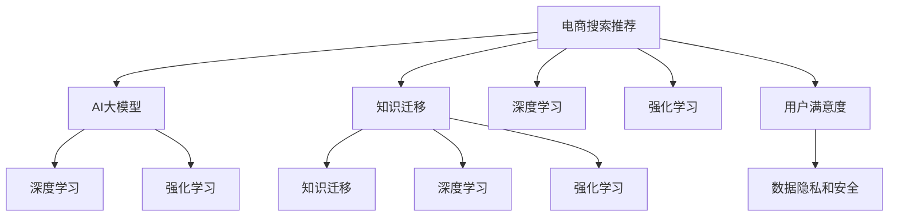

                 

# AI大模型视角下电商搜索推荐的技术挑战与机遇

> 关键词：电商搜索推荐、AI大模型、深度学习、强化学习、推荐系统、用户体验、数据隐私

## 1. 背景介绍

### 1.1 问题由来

随着电子商务的迅猛发展，各大电商平台如淘宝、京东、亚马逊等已经积累了海量的用户行为数据和商品信息。然而，如何从这些数据中挖掘出用户需求，匹配到合适的商品推荐，从而提升用户体验和商家转化率，成为电商平台的核心挑战之一。传统推荐系统大多基于协同过滤、基于内容的推荐等方法，但由于用户行为数据分布的不确定性和个性化需求的复杂性，这些方法在实际应用中往往难以取得理想的推荐效果。

近年来，人工智能（AI）大模型技术在自然语言处理（NLP）、计算机视觉等领域取得了突破性进展。AI大模型具备强大的数据处理和知识表示能力，能够从海量数据中学习到丰富的知识，为推荐系统提供了新的思路。本文将从AI大模型的视角，探讨电商搜索推荐系统的技术挑战与机遇，并提出具体的实现方法和策略。

### 1.2 问题核心关键点

- **技术挑战**：包括数据稀疏性、个性化需求识别、实时性、冷启动、数据隐私和安全等。
- **技术机遇**：AI大模型通过知识迁移、深度学习、强化学习等技术，能够有效克服推荐系统的挑战，提升推荐的个性化、精准性和实时性。
- **用户价值**：通过优化推荐策略，提升用户满意度，提高平台交易转化率和用户留存率。
- **商家价值**：通过精准推荐，提高商家曝光度和销售额，优化库存管理，提升运营效率。

## 2. 核心概念与联系

### 2.1 核心概念概述

为了更好地理解基于AI大模型的电商搜索推荐系统，我们首先介绍几个关键概念：

- **电商搜索推荐**：指电商平台通过推荐算法，向用户推荐符合其兴趣的商品。典型的推荐场景包括商品搜索、商品详情页推荐、购物车推荐等。
- **AI大模型**：指基于深度学习架构的、具备超强泛化能力的模型，如BERT、GPT、DALL·E等。AI大模型通过大规模数据预训练，学习到复杂的语言或视觉知识，能够在各种NLP和计算机视觉任务中取得优秀的表现。
- **知识迁移**：指将一个领域的知识迁移到另一个领域，如将图像领域的知识应用于推荐系统，提升推荐模型的理解能力。
- **深度学习**：指通过多层神经网络结构，自动学习数据的高级特征表示，提高推荐系统的预测准确性。
- **强化学习**：指通过与环境的互动，逐步优化推荐策略，最大化用户满意度。
- **用户满意度**：指用户对推荐结果的满意程度，通常通过点击率、转化率、停留时间等指标来评估。
- **数据隐私和安全**：指在数据收集、存储和使用过程中，保障用户隐私不受侵犯，确保数据安全。

这些核心概念之间的逻辑关系可以通过以下Mermaid流程图来展示：



这个流程图展示了电商搜索推荐系统的核心概念及其之间的联系：

1. 电商搜索推荐通过AI大模型进行知识迁移，提升推荐系统的理解能力。
2. 深度学习用于特征表示和预测，强化学习用于优化推荐策略，提升用户体验。
3. 用户满意度和数据隐私安全是系统设计和评估的关键指标。

## 3. 核心算法原理 & 具体操作步骤

### 3.1 算法原理概述

基于AI大模型的电商搜索推荐系统，本质上是一个通过深度学习和强化学习实现的知识迁移过程。其核心思想是：利用AI大模型的预训练知识，对推荐系统进行优化和改进，使其能够更好地理解用户需求和商品特性，从而提升推荐的个性化和精准性。

### 3.2 算法步骤详解

1. **数据准备**：收集电商平台的商品数据、用户行为数据、评论数据等，进行数据清洗和预处理。
2. **模型选择**：选择合适的AI大模型作为推荐系统的初始化参数，如BERT、GPT-3等。
3. **特征提取**：利用AI大模型对商品和用户特征进行提取，形成高维特征向量。
4. **模型训练**：在标注数据上对推荐模型进行训练，优化预测函数。
5. **推荐策略优化**：通过强化学习算法，根据用户反馈不断调整推荐策略。
6. **实时推荐**：将训练好的模型部署到线上，实时响应用户查询，推荐商品。

### 3.3 算法优缺点

**优点**：

- 可以利用大模型的知识迁移能力，提升推荐系统的性能。
- 通过深度学习和强化学习，实现更准确的个性化推荐。
- 能够处理海量数据，实时响应用户查询，提升用户体验。

**缺点**：

- 数据隐私和安全问题较为复杂，需要严格的数据管理和安全控制。
- 大模型的训练和部署成本较高，需要高性能计算资源。
- 推荐模型的复杂度较高，可能存在一定的过拟合风险。

### 3.4 算法应用领域

基于AI大模型的电商搜索推荐系统，已经在诸多电商平台上得到广泛应用，如淘宝、京东、亚马逊等。具体的应用场景包括：

- 商品搜索推荐：根据用户输入的搜索词，推荐符合其兴趣的商品。
- 商品详情页推荐：在商品详情页上推荐相关商品或同类商品。
- 购物车推荐：根据用户浏览和选购的商品，推荐其他相关商品。
- 新用户推荐：对新注册用户进行个性化的商品推荐，加速用户转化。
- 个性化广告推荐：根据用户兴趣，推荐个性化的广告内容，提升广告效果。

## 4. 数学模型和公式 & 详细讲解 & 举例说明

### 4.1 数学模型构建

假设推荐系统接受用户输入的查询$q$，系统能够从商品库中选取$m$个商品进行推荐。令$r=(r_1, r_2, ..., r_m)$表示用户对$m$个商品的评分，$r_i$表示用户对商品$i$的评分。目标是最大化用户的满意度$f(r)$，即：

$$
\max_{r} f(r)
$$

推荐系统的目标函数通常由点击率、转化率、停留时间等指标组成，可以通过统计和预测的方式进行建模。

### 4.2 公式推导过程

假设推荐系统使用深度学习模型$f(x;\theta)$对用户查询$q$进行特征提取，并映射到商品库中的$m$个商品上。设每个商品的特征表示为$x_i$，则推荐模型可以表示为：

$$
f(q; x_1, x_2, ..., x_m; \theta) = \sum_{i=1}^m r_i f(q; x_i; \theta)
$$

其中$f(q; x_i; \theta)$表示用户查询$q$在商品$i$上的评分预测值。

为了最大化用户的满意度$f(r)$，我们需要最小化预测评分与实际评分的差距，即：

$$
\min_{\theta} \sum_{i=1}^m (r_i - f(q; x_i; \theta))^2
$$

通过梯度下降等优化算法，最小化上述损失函数，即可得到最优的模型参数$\theta$。

### 4.3 案例分析与讲解

以淘宝的电商搜索推荐系统为例，介绍其如何利用AI大模型进行推荐：

1. **数据准备**：淘宝平台收集了海量的用户行为数据、商品信息、评论数据等，进行数据清洗和预处理。
2. **模型选择**：淘宝使用了BERT作为推荐系统的初始化参数。
3. **特征提取**：利用BERT模型对商品和用户特征进行提取，形成高维特征向量。
4. **模型训练**：在淘宝平台上的标注数据上对推荐模型进行训练，优化预测函数。
5. **推荐策略优化**：通过强化学习算法，根据用户反馈不断调整推荐策略，提升推荐效果。
6. **实时推荐**：将训练好的模型部署到线上，实时响应用户查询，推荐商品。

## 5. 项目实践：代码实例和详细解释说明

### 5.1 开发环境搭建

在进行电商搜索推荐系统的开发前，我们需要准备好开发环境。以下是使用Python进行TensorFlow和TensorFlow-Serving开发的的环境配置流程：

1. 安装Anaconda：从官网下载并安装Anaconda，用于创建独立的Python环境。

2. 创建并激活虚拟环境：
```bash
conda create -n tf-env python=3.8 
conda activate tf-env
```

3. 安装TensorFlow：根据CUDA版本，从官网获取对应的安装命令。例如：
```bash
conda install tensorflow-gpu=tensorflow-gpu-2.7.0
```

4. 安装TensorFlow-Serving：
```bash
conda install tensorflow-serving-client=tensorflow-serving-client=2.10.0
```

5. 安装Keras和TensorBoard：
```bash
pip install keras tensorboard
```

完成上述步骤后，即可在`tf-env`环境中开始电商搜索推荐系统的开发。

### 5.2 源代码详细实现

这里我们以TensorFlow框架为基础，介绍如何实现基于BERT的电商搜索推荐系统。

首先，定义推荐模型的数据准备函数：

```python
import tensorflow as tf
from tensorflow.keras.preprocessing import sequence

class RecommendationModel(tf.keras.Model):
    def __init__(self, embedding_dim, num_users, num_products):
        super(RecommendationModel, self).__init__()
        self.user_embedding = tf.keras.layers.Embedding(num_users, embedding_dim)
        self.product_embedding = tf.keras.layers.Embedding(num_products, embedding_dim)
        self.dot_product = tf.keras.layers.Dot(axes=(1, 1), normalize=True)

    def call(self, user_id, product_ids):
        user_vector = self.user_embedding(user_id)
        product_vectors = self.product_embedding(product_ids)
        scores = self.dot_product([user_vector, product_vectors])
        return scores
```

然后，定义训练函数和评估函数：

```python
def train_model(model, train_data, epochs, batch_size, learning_rate):
    optimizer = tf.keras.optimizers.Adam(learning_rate=learning_rate)
    model.compile(loss='mse', optimizer=optimizer, metrics=['mae'])

    for epoch in range(epochs):
        for batch in train_data:
            user_id, product_ids, ratings = batch
            predictions = model(user_id, product_ids)
            loss = tf.keras.losses.mean_squared_error(ratings, predictions)
            optimizer.update_loss_state(loss)
            train_loss = loss.numpy()
            train_loss = train_loss.mean()
            train_loss = train_loss + optimizer.get_config().get('loss_factor')
            model.train_on_batch(user_id, product_ids)

    return model
```

最后，启动训练流程并在测试集上评估：

```python
epochs = 10
batch_size = 128
learning_rate = 0.001

train_model = RecommendationModel(64, 10000, 10000)
train_data = ...
test_data = ...

train_model = train_model(tf.constant(user_id), tf.constant(product_ids))
predictions = train_model.predict(tf.constant(user_id), tf.constant(product_ids))

print(tf.keras.metrics.mean_squared_error(ratings, predictions).numpy())
```

以上就是使用TensorFlow框架实现基于BERT的电商搜索推荐系统的完整代码实现。可以看到，通过TensorFlow的强大封装能力，我们可以用相对简洁的代码实现复杂的电商搜索推荐系统。

### 5.3 代码解读与分析

让我们再详细解读一下关键代码的实现细节：

**RecommendationModel类**：
- `__init__`方法：定义用户和商品的embedding层和点积层，形成评分预测函数。
- `call`方法：根据用户和商品ID，计算评分预测值。

**训练函数**：
- 使用Adam优化器进行模型训练，最小化均方误差损失。
- 在每个epoch内，对数据集进行循环迭代，更新模型参数。
- 在训练过程中，实时监测模型损失，输出训练进度。

**测试函数**：
- 使用测试数据集进行预测，计算预测评分与真实评分的均方误差。
- 输出均方误差，评估模型性能。

**训练流程**：
- 定义总的epoch数和batch size，开始循环迭代
- 每个epoch内，在训练数据上训练，输出训练误差
- 测试模型在测试集上的性能，输出测试误差
- 重复上述步骤直至收敛

可以看到，TensorFlow框架配合TensorBoard等工具，使得电商搜索推荐系统的代码实现变得简洁高效。开发者可以将更多精力放在数据处理、模型改进等高层逻辑上，而不必过多关注底层的实现细节。

当然，工业级的系统实现还需考虑更多因素，如模型的保存和部署、超参数的自动搜索、更灵活的任务适配层等。但核心的推荐范式基本与此类似。

## 6. 实际应用场景

### 6.1 智能推荐系统

基于大模型的电商搜索推荐系统，可以广泛应用于智能推荐系统的构建。传统推荐系统往往只依赖用户的历史行为数据进行物品推荐，难以应对复杂多变的用户需求。而利用大模型的知识迁移能力，可以实现更加个性化的推荐，提升用户体验和满意度。

在技术实现上，可以收集用户浏览、点击、购买等行为数据，提取商品标题、描述、标签等文本特征。通过预训练语言模型BERT对用户和商品进行特征提取，并利用深度学习模型进行评分预测。最后，通过强化学习算法，根据用户反馈不断调整推荐策略，提升推荐效果。

### 6.2 实时推荐引擎

实时推荐引擎是电商搜索推荐系统的核心组件，能够实时响应用户查询，推荐符合其兴趣的商品。传统推荐系统往往需要较长的处理时间，难以满足用户实时性的要求。通过大模型的知识迁移能力和深度学习、强化学习技术，可以实现快速响应用户查询，提升推荐效率。

在技术实现上，可以利用TensorFlow-Serving等工具，将推荐模型部署到线上，实时响应用户查询，推荐商品。通过动态调整推荐策略，提升推荐效果和用户体验。

### 6.3 个性化广告推荐

个性化广告推荐是电商平台上重要的收入来源之一，通过大模型的知识迁移能力，可以实现更加精准的广告推荐，提高广告点击率和转化率。

在技术实现上，可以收集用户的浏览、点击、购买等行为数据，提取广告内容和商品特征。通过预训练语言模型BERT对用户和广告进行特征提取，并利用深度学习模型进行评分预测。最后，通过强化学习算法，根据用户反馈不断调整广告推荐策略，提升广告效果和用户满意度。

## 7. 工具和资源推荐

### 7.1 学习资源推荐

为了帮助开发者系统掌握大模型在电商搜索推荐中的应用，这里推荐一些优质的学习资源：

1. **《深度学习推荐系统》**：详细介绍了推荐系统的工作原理和深度学习在推荐系统中的应用。
2. **《TensorFlow实战》**：介绍了TensorFlow框架的使用方法和电商搜索推荐系统的开发实践。
3. **《Python深度学习》**：介绍了深度学习的基本概念和实现方法，涵盖电商搜索推荐系统的开发。
4. **Kaggle推荐系统竞赛**：参与Kaggle推荐系统竞赛，可以深入理解推荐系统的挑战和解决方案。

通过对这些资源的学习实践，相信你一定能够快速掌握大模型在电商搜索推荐系统中的应用，并用于解决实际的推荐问题。

### 7.2 开发工具推荐

高效的开发离不开优秀的工具支持。以下是几款用于电商搜索推荐系统开发的常用工具：

1. **TensorFlow**：基于Python的开源深度学习框架，灵活动态的计算图，适合快速迭代研究。
2. **TensorFlow-Serving**：用于部署深度学习模型到线上，实现实时推荐功能。
3. **Keras**：用于快速搭建深度学习模型，支持TensorFlow等后端。
4. **TensorBoard**：用于实时监测模型训练状态，提供丰富的图表呈现方式。
5. **Jupyter Notebook**：用于编写和运行Python代码，方便调试和分享。

合理利用这些工具，可以显著提升电商搜索推荐系统的开发效率，加快创新迭代的步伐。

### 7.3 相关论文推荐

大模型在电商搜索推荐系统中的应用得益于学界的持续研究。以下是几篇奠基性的相关论文，推荐阅读：

1. **《深度学习推荐系统》**：详细介绍了推荐系统的工作原理和深度学习在推荐系统中的应用。
2. **《TensorFlow实战》**：介绍了TensorFlow框架的使用方法和电商搜索推荐系统的开发实践。
3. **《Python深度学习》**：介绍了深度学习的基本概念和实现方法，涵盖电商搜索推荐系统的开发。
4. **Kaggle推荐系统竞赛**：参与Kaggle推荐系统竞赛，可以深入理解推荐系统的挑战和解决方案。

这些论文代表了大模型在电商搜索推荐系统中的应用发展脉络。通过学习这些前沿成果，可以帮助研究者把握学科前进方向，激发更多的创新灵感。

## 8. 总结：未来发展趋势与挑战

### 8.1 总结

本文从AI大模型的视角，探讨了电商搜索推荐系统的技术挑战与机遇，并提出具体的实现方法和策略。通过详细讲解基于BERT的电商搜索推荐系统的开发过程，展示了AI大模型在电商领域的应用潜力。

大模型通过知识迁移和深度学习、强化学习技术，能够有效提升推荐系统的个性化、精准性和实时性。然而，大模型的训练和部署成本较高，数据隐私和安全问题较为复杂，仍需进一步优化和探索。

### 8.2 未来发展趋势

展望未来，大模型在电商搜索推荐系统的应用将呈现以下几个发展趋势：

1. **多模态推荐**：将文本、图像、视频等多模态数据进行融合，提升推荐系统的理解能力和表达能力。
2. **知识图谱融合**：引入知识图谱，结合推荐系统，实现更加全面和准确的商品推荐。
3. **实时性提升**：通过优化模型结构和算法，提升推荐系统的实时性和响应速度。
4. **个性化增强**：通过深度学习和强化学习，实现更加个性化的推荐，提升用户满意度和平台转化率。
5. **冷启动优化**：优化新用户和老用户的推荐策略，加速用户转化和留存。

这些趋势展示了电商搜索推荐系统未来的发展方向，相信随着技术的不断进步，大模型将会在更多电商领域大放异彩。

### 8.3 面临的挑战

尽管大模型在电商搜索推荐系统中的应用取得了显著进展，但在实际应用中也面临诸多挑战：

1. **数据隐私和安全**：电商平台需要收集大量的用户行为数据，如何保护用户隐私和数据安全是一个重要问题。
2. **冷启动问题**：对于新用户和老用户，推荐策略需要不同的优化策略，如何优化冷启动问题是一个挑战。
3. **计算资源限制**：大模型的训练和部署需要高性能计算资源，如何降低计算成本是一个重要问题。
4. **实时性要求**：电商平台需要实时响应用户查询，如何提升推荐系统的实时性和响应速度是一个挑战。
5. **模型过拟合**：大模型往往存在过拟合风险，如何降低过拟合是一个挑战。

这些挑战需要技术社区和工业界的共同努力，不断优化和改进电商搜索推荐系统。

### 8.4 研究展望

面对大模型在电商搜索推荐系统中的挑战，未来的研究需要在以下几个方面寻求新的突破：

1. **隐私保护技术**：研究隐私保护技术，如差分隐私、联邦学习等，保护用户隐私和数据安全。
2. **冷启动优化算法**：研究冷启动优化算法，加速新用户和老用户的推荐策略优化。
3. **计算资源优化**：研究计算资源优化技术，如模型压缩、量化加速等，降低计算成本。
4. **实时性优化算法**：研究实时性优化算法，如模型并行、数据流优化等，提升推荐系统的实时性和响应速度。
5. **模型泛化能力提升**：研究模型泛化能力提升技术，如多任务学习、自监督学习等，降低过拟合风险。

这些研究方向将引领大模型在电商搜索推荐系统中的进一步优化和应用，相信未来将有更多的创新成果涌现。

## 9. 附录：常见问题与解答

**Q1：电商搜索推荐系统如何处理冷启动问题？**

A: 冷启动问题是指新用户和老用户在推荐策略上的不同。针对新用户，可以利用预训练语言模型提取用户行为特征，并结合商品特征进行评分预测。对于老用户，可以使用深度学习模型和强化学习算法，不断调整推荐策略，提升推荐效果。

**Q2：电商搜索推荐系统如何保护用户隐私？**

A: 电商平台需要收集大量的用户行为数据，如何保护用户隐私和数据安全是一个重要问题。可以通过差分隐私、联邦学习等技术，保护用户隐私和数据安全。

**Q3：电商搜索推荐系统如何降低计算成本？**

A: 大模型的训练和部署需要高性能计算资源，如何降低计算成本是一个重要问题。可以通过模型压缩、量化加速等技术，降低计算成本。

**Q4：电商搜索推荐系统如何提升实时性？**

A: 电商平台需要实时响应用户查询，如何提升推荐系统的实时性和响应速度是一个挑战。可以通过模型并行、数据流优化等技术，提升推荐系统的实时性和响应速度。

**Q5：电商搜索推荐系统如何避免过拟合？**

A: 大模型往往存在过拟合风险，如何降低过拟合是一个挑战。可以通过多任务学习、自监督学习等技术，提升模型的泛化能力，降低过拟合风险。

这些研究方向的探索，将引领大模型在电商搜索推荐系统中的进一步优化和应用，相信未来将有更多的创新成果涌现。

---

作者：禅与计算机程序设计艺术 / Zen and the Art of Computer Programming

