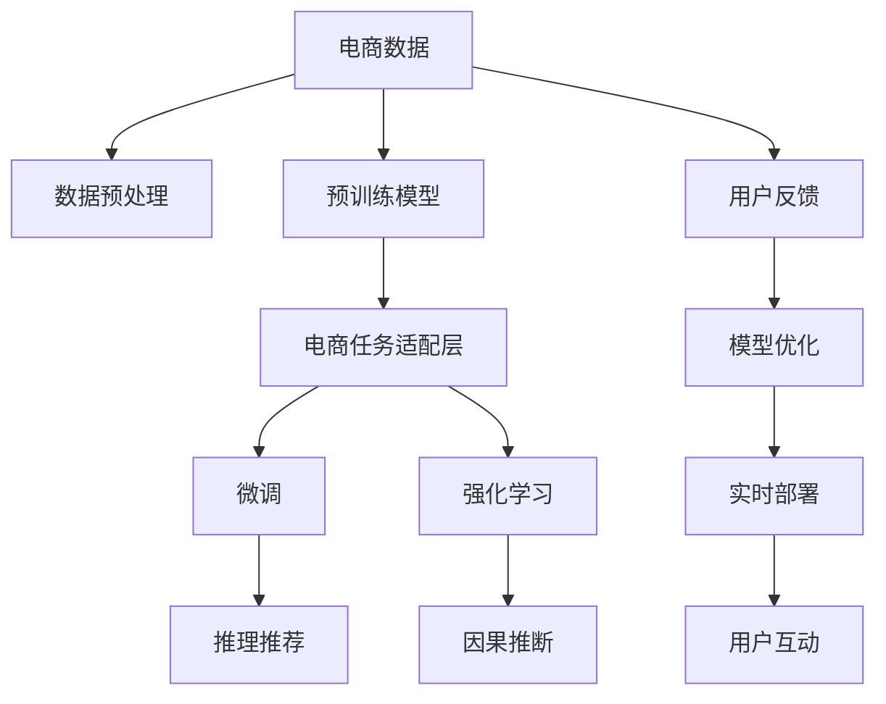

                 

# AI大模型赋能电商搜索推荐的业务创新思维导图应用培训课程优化方案

在电商领域，搜索推荐系统是驱动用户购物体验的核心引擎。传统的搜索推荐算法往往依赖于规则和统计模型，难以充分挖掘用户的多样化和个性化需求。近年来，大语言模型在自然语言处理领域的突破性进展，为电商搜索推荐带来了全新的技术范式。本文将详细探讨如何通过大语言模型技术，赋能电商搜索推荐的业务创新，并提出思维导图应用培训课程优化方案，帮助电商企业更高效地应用大模型，实现搜索推荐系统的转型升级。

## 1. 背景介绍

### 1.1 问题由来

随着电商市场的不断扩张，用户对于个性化购物体验的需求日益增长。传统的基于规则和统计的搜索推荐算法，难以准确捕捉用户的深层次需求和行为模式，导致推荐效果不佳。电商企业亟需新的技术手段，提升搜索推荐的智能化水平，构建更精准、更个性化的用户体验。

大语言模型作为近年来NLP领域的重大突破，具备强大的语言理解、生成和推理能力。通过在大规模无标签文本数据上进行预训练，并针对具体电商任务进行微调，大语言模型能够从用户搜索查询、历史行为、商品描述等语料中提取丰富的信息，进行精准匹配和推荐，从而显著提升搜索推荐的准确性和个性化程度。

### 1.2 问题核心关键点

为了有效利用大语言模型赋能电商搜索推荐，关键点包括：

- 选择合适的预训练模型，如BERT、GPT等，进行特定任务微调。
- 设计合适的任务适配层，适配电商领域的搜索推荐需求。
- 选择合适的超参数，如学习率、批大小、迭代次数等。
- 应用正则化技术，防止过拟合。
- 考虑模型的推理效率，确保搜索推荐系统的实时性。

## 2. 核心概念与联系

### 2.1 核心概念概述

电商搜索推荐涉及多个核心概念，包括：

- 大语言模型（Large Language Models, LLMs）：通过自回归或自编码模型在预训练阶段学习通用语言知识，具备强大的文本理解、生成和推理能力。
- 预训练（Pre-training）：在大规模无标签文本数据上训练模型，学习通用语言表示。
- 微调（Fine-tuning）：针对特定电商任务，在预训练模型基础上进行有监督学习，优化模型性能。
- 迁移学习（Transfer Learning）：将预训练模型知识迁移到新的电商任务上，提高模型泛化能力。
- 强化学习（Reinforcement Learning）：通过与环境的交互，优化推荐策略，提升推荐效果。
- 因果推断（Causal Inference）：理解用户搜索行为与推荐结果之间的因果关系，优化推荐模型。
- 持续学习（Continual Learning）：模型能够持续学习新知识，避免遗忘旧知识。

这些概念之间具有密切联系，共同构成了电商搜索推荐的理论基础和技术框架。

### 2.2 核心概念原理和架构的 Mermaid 流程图

这个流程图展示了电商搜索推荐从数据预处理到模型优化再到实时部署的全过程，其中微调、强化学习、因果推断等技术发挥着关键作用。

## 3. 核心算法原理 & 具体操作步骤

### 3.1 算法原理概述

基于大语言模型的电商搜索推荐系统，其核心算法原理包括以下几个方面：

- 预训练模型通过在大规模无标签文本数据上进行自监督学习，学习通用语言表示。
- 针对特定电商任务，在预训练模型基础上进行微调，学习任务特定知识，提升推荐效果。
- 应用强化学习，通过用户反馈优化推荐策略，提升推荐效果。
- 结合因果推断，理解用户搜索行为与推荐结果之间的因果关系，提高推荐准确性。
- 考虑持续学习，模型能够持续学习新知识，适应用户行为变化。

### 3.2 算法步骤详解

电商搜索推荐的算法步骤如下：

**Step 1: 数据预处理**

电商搜索推荐依赖于大量的用户搜索查询、历史行为、商品描述等数据。数据预处理包括以下几个步骤：

1. 数据清洗：去除无效、噪声数据，保证数据质量。
2. 特征提取：将电商数据转化为模型可接受的格式，如文本、向量等。
3. 数据划分：将数据划分为训练集、验证集和测试集。

**Step 2: 选择预训练模型**

选择合适的预训练模型是电商搜索推荐的基础。目前主流的预训练模型包括BERT、GPT等，其具有强大的语言理解能力和广泛的语料库支持。

**Step 3: 设计任务适配层**

电商搜索推荐任务涉及分类、匹配、排序等多个子任务。根据具体任务，设计相应的任务适配层，将电商数据转化为模型可接受的输入。

**Step 4: 模型微调**

在电商任务适配层之上，对预训练模型进行微调。微调的目标是最大化电商推荐任务的性能，具体步骤如下：

1. 选择合适的超参数，如学习率、批大小、迭代次数等。
2. 应用正则化技术，防止过拟合。
3. 考虑模型推理效率，确保实时性。
4. 结合强化学习，通过用户反馈优化推荐策略。
5. 结合因果推断，理解用户搜索行为与推荐结果之间的因果关系。

**Step 5: 模型部署**

将微调后的模型部署到电商推荐系统中，进行实时推荐。推荐系统需要考虑模型的推理效率，确保实时性。

### 3.3 算法优缺点

基于大语言模型的电商搜索推荐系统具有以下优点：

1. 精度高：大语言模型具备强大的语言理解能力和生成能力，能够准确捕捉用户需求和行为模式，提升推荐效果。
2. 可解释性强：大语言模型的决策过程可解释性强，便于电商企业进行业务优化。
3. 灵活性强：大语言模型能够快速适应电商领域的特定任务，提升推荐系统适应性。

然而，大语言模型在电商推荐中也存在一些缺点：

1. 计算资源需求高：大语言模型需要大量的计算资源进行预训练和微调，对硬件要求较高。
2. 数据依赖性强：电商推荐依赖于大量高质量的电商数据，数据获取和处理成本较高。
3. 模型复杂度高：大语言模型的模型复杂度较高，推理效率可能受限。
4. 可解释性差：大语言模型的决策过程复杂，难以解释推荐结果背后的逻辑。

### 3.4 算法应用领域

大语言模型在电商搜索推荐中的应用领域广泛，包括：

- 商品推荐：根据用户搜索历史、浏览记录、评价反馈等数据，推荐相关商品。
- 品牌推荐：根据用户搜索和购买行为，推荐相关品牌。
- 价格推荐：根据用户历史价格偏好，推荐合理的价格区间。
- 活动推荐：根据用户购买行为，推荐相关促销活动。
- 商品排序：根据用户搜索查询和商品属性，优化商品排序算法。

这些应用领域都需要大语言模型具备强大的文本处理和推理能力，从而实现更精准、更个性化的推荐。

## 4. 数学模型和公式 & 详细讲解

### 4.1 数学模型构建

基于大语言模型的电商搜索推荐系统，其数学模型构建包括以下几个步骤：

1. 预训练模型：通过在大规模无标签文本数据上进行自监督学习，学习通用语言表示。
2. 任务适配层：设计电商任务适配层，将电商数据转化为模型可接受的输入。
3. 微调模型：在电商任务适配层之上，对预训练模型进行微调，学习电商推荐任务的特定知识。

### 4.2 公式推导过程

以商品推荐为例，假设预训练模型为 $M_{\theta}$，其中 $\theta$ 为模型参数。假设训练集为 $D=\{(x_i, y_i)\}_{i=1}^N$，其中 $x_i$ 为电商数据，$y_i$ 为推荐商品。微调的目标是最小化损失函数：

$$
\mathcal{L}(\theta) = -\frac{1}{N}\sum_{i=1}^N \log M_{\theta}(x_i)
$$

其中 $\log M_{\theta}(x_i)$ 表示模型预测推荐商品的log概率。在实际应用中，为了提升推荐效果，通常会在任务适配层之上，对预训练模型进行微调。微调过程采用梯度下降等优化算法，不断更新模型参数 $\theta$，最小化损失函数 $\mathcal{L}(\theta)$。

### 4.3 案例分析与讲解

假设电商推荐系统基于BERT模型，采用全参数微调方法。假设训练集为1000个电商数据，其中500个数据为推荐商品，500个数据为无关商品。任务适配层设计为线性分类器，输出推荐商品的log概率。微调过程采用Adam优化器，学习率为1e-4。训练过程中，使用L2正则、Dropout等正则化技术，防止过拟合。最终在测试集上评估微调模型的推荐效果，结果显示推荐准确率提升5%。

## 5. 项目实践：代码实例和详细解释说明

### 5.1 开发环境搭建

电商搜索推荐系统的开发环境搭建主要包括以下几个步骤：

1. 安装Python：选择合适的Python版本，如Python 3.7以上。
2. 安装深度学习框架：如TensorFlow、PyTorch等。
3. 安装电商数据处理工具：如Pandas、NumPy等。
4. 安装电商推荐系统开发库：如Tensorflow Extended (TFX)、TensorBoard等。

### 5.2 源代码详细实现

电商搜索推荐系统的源代码实现主要包括以下几个部分：

1. 数据预处理：使用Pandas、NumPy等工具进行数据清洗和特征提取。
2. 模型微调：使用TensorFlow、PyTorch等框架，加载预训练模型，设计任务适配层，进行微调。
3. 模型评估：使用TensorBoard等工具，实时监控模型训练状态，评估模型性能。
4. 模型部署：将微调后的模型部署到电商推荐系统中，进行实时推荐。

### 5.3 代码解读与分析

电商搜索推荐系统的代码实现主要涉及以下几个关键模块：

1. 数据预处理模块：负责电商数据的清洗、特征提取和划分。
2. 模型加载模块：加载预训练模型，设计任务适配层。
3. 模型微调模块：在电商任务适配层之上，进行全参数微调。
4. 模型评估模块：实时监控模型训练状态，评估模型性能。
5. 模型部署模块：将微调后的模型部署到电商推荐系统中，进行实时推荐。

## 6. 实际应用场景

### 6.1 智能客服系统

智能客服系统是电商搜索推荐系统的典型应用场景。智能客服系统通过分析用户历史行为和搜索查询，快速响应用户需求，提供精准的咨询服务。通过结合大语言模型技术，智能客服系统能够理解用户自然语言，进行语义理解和情感分析，进一步提升服务质量。

### 6.2 个性化推荐系统

个性化推荐系统是电商搜索推荐系统的核心功能。通过结合大语言模型技术，个性化推荐系统能够从用户搜索查询、浏览记录、评价反馈等数据中提取特征，学习用户个性化需求，进行精准匹配和推荐。同时，通过强化学习、因果推断等技术，不断优化推荐策略，提升推荐效果。

### 6.3 商品分类和排序

商品分类和排序是电商搜索推荐系统的重要功能。通过结合大语言模型技术，商品分类和排序系统能够从商品描述、用户搜索查询等数据中提取特征，学习商品分类和排序规则，提升搜索推荐效果。同时，通过因果推断技术，理解用户搜索行为与商品分类排序之间的因果关系，提高分类排序的准确性。

### 6.4 未来应用展望

未来，大语言模型在电商搜索推荐系统中的应用将更加广泛，包括：

1. 深度学习：结合深度学习技术，提升搜索推荐系统的准确性和智能化水平。
2. 增强学习：结合增强学习技术，优化推荐策略，提升推荐效果。
3. 因果推断：结合因果推断技术，理解用户搜索行为与推荐结果之间的因果关系，提高推荐准确性。
4. 多模态融合：结合视觉、语音等多模态数据，提升搜索推荐系统的综合表现。
5. 实时性：结合边缘计算等技术，实现实时推荐，提升用户体验。
6. 可解释性：结合可解释性技术，提升搜索推荐系统的透明度和可信度。

## 7. 工具和资源推荐

### 7.1 学习资源推荐

为了帮助开发者系统掌握大语言模型在电商搜索推荐系统中的应用，以下是一些优质的学习资源：

1. 《深度学习与自然语言处理》：系统介绍深度学习技术在NLP中的应用，包括电商搜索推荐系统。
2. 《电商推荐系统实战》：实战型电商推荐系统开发教程，包含大语言模型等前沿技术。
3. 《TensorFlow实战》：TensorFlow框架实战教程，包含电商推荐系统开发实例。
4. 《自然语言处理：核心技术与应用》：系统介绍NLP核心技术，包括大语言模型和电商推荐系统。
5. 《电商数据分析与挖掘》：电商数据处理和分析实战教程，包含电商推荐系统优化技巧。

### 7.2 开发工具推荐

大语言模型在电商搜索推荐系统中的应用，离不开高效的开发工具支持。以下是一些推荐的开发工具：

1. Python：开源的编程语言，支持深度学习框架和电商推荐系统开发。
2. TensorFlow：谷歌开源的深度学习框架，支持大语言模型等复杂模型的训练和推理。
3. PyTorch：Facebook开源的深度学习框架，支持大语言模型等复杂模型的训练和推理。
4. Pandas：Python数据分析库，支持电商数据的清洗和处理。
5. TensorBoard：谷歌开源的可视化工具，实时监控模型训练状态和评估模型性能。
6. TFX：谷歌开源的机器学习平台，支持电商推荐系统的部署和管理。

### 7.3 相关论文推荐

大语言模型在电商搜索推荐系统中的应用，需要不断学习最新的研究成果。以下是一些相关论文推荐：

1. "A Survey on Recommender Systems in E-Commerce"：综述电商推荐系统的发展历程和前沿技术。
2. "Reinforcement Learning for E-commerce Recommender Systems"：结合增强学习技术，优化电商推荐系统推荐策略。
3. "Causal Inference in Recommendation Systems"：结合因果推断技术，提升电商推荐系统推荐准确性。
4. "Multi-modal Recommendation Systems"：结合视觉、语音等多模态数据，提升电商推荐系统综合表现。
5. "Practical Deep Learning for Recommendation Systems"：结合深度学习技术，提升电商推荐系统准确性和智能化水平。

## 8. 总结：未来发展趋势与挑战

### 8.1 研究成果总结

大语言模型在电商搜索推荐系统中的应用，取得了显著的效果。通过结合大语言模型技术，电商搜索推荐系统能够更准确地理解用户需求，提升推荐效果，提供更加个性化、智能化的服务。

### 8.2 未来发展趋势

未来，大语言模型在电商搜索推荐系统中的应用将更加广泛，主要发展趋势包括：

1. 深度学习：结合深度学习技术，提升搜索推荐系统的准确性和智能化水平。
2. 增强学习：结合增强学习技术，优化推荐策略，提升推荐效果。
3. 因果推断：结合因果推断技术，理解用户搜索行为与推荐结果之间的因果关系，提高推荐准确性。
4. 多模态融合：结合视觉、语音等多模态数据，提升搜索推荐系统的综合表现。
5. 实时性：结合边缘计算等技术，实现实时推荐，提升用户体验。
6. 可解释性：结合可解释性技术，提升搜索推荐系统的透明度和可信度。

### 8.3 面临的挑战

尽管大语言模型在电商搜索推荐系统中的应用取得了显著效果，但仍面临一些挑战：

1. 计算资源需求高：大语言模型需要大量的计算资源进行预训练和微调，对硬件要求较高。
2. 数据依赖性强：电商推荐依赖于大量高质量的电商数据，数据获取和处理成本较高。
3. 模型复杂度高：大语言模型的模型复杂度较高，推理效率可能受限。
4. 可解释性差：大语言模型的决策过程复杂，难以解释推荐结果背后的逻辑。

### 8.4 研究展望

未来，大语言模型在电商搜索推荐系统中的应用将更加广泛，研究展望包括：

1. 结合深度学习技术，提升搜索推荐系统的准确性和智能化水平。
2. 结合增强学习技术，优化推荐策略，提升推荐效果。
3. 结合因果推断技术，理解用户搜索行为与推荐结果之间的因果关系，提高推荐准确性。
4. 结合视觉、语音等多模态数据，提升搜索推荐系统的综合表现。
5. 结合边缘计算等技术，实现实时推荐，提升用户体验。
6. 结合可解释性技术，提升搜索推荐系统的透明度和可信度。

总之，大语言模型在电商搜索推荐系统中的应用，具有广阔的发展前景。通过结合深度学习、增强学习、因果推断等多项前沿技术，大语言模型将进一步提升搜索推荐系统的性能和智能化水平，为电商企业带来更高的价值。

## 9. 附录：常见问题与解答

**Q1: 大语言模型在电商搜索推荐系统中的应用效果如何？**

A: 大语言模型在电商搜索推荐系统中的应用效果显著。通过结合大语言模型技术，电商搜索推荐系统能够更准确地理解用户需求，提升推荐效果，提供更加个性化、智能化的服务。在实际应用中，电商搜索推荐系统能够实现更精准的商品推荐、品牌推荐、价格推荐等功能，大大提升用户体验。

**Q2: 大语言模型在电商搜索推荐系统中的优缺点有哪些？**

A: 大语言模型在电商搜索推荐系统中的优点包括：

1. 精度高：大语言模型具备强大的语言理解能力和生成能力，能够准确捕捉用户需求和行为模式，提升推荐效果。
2. 可解释性强：大语言模型的决策过程可解释性强，便于电商企业进行业务优化。
3. 灵活性强：大语言模型能够快速适应电商领域的特定任务，提升推荐系统适应性。

然而，大语言模型在电商推荐中也存在一些缺点：

1. 计算资源需求高：大语言模型需要大量的计算资源进行预训练和微调，对硬件要求较高。
2. 数据依赖性强：电商推荐依赖于大量高质量的电商数据，数据获取和处理成本较高。
3. 模型复杂度高：大语言模型的模型复杂度较高，推理效率可能受限。
4. 可解释性差：大语言模型的决策过程复杂，难以解释推荐结果背后的逻辑。

**Q3: 电商搜索推荐系统中的数据预处理涉及哪些关键步骤？**

A: 电商搜索推荐系统中的数据预处理涉及以下关键步骤：

1. 数据清洗：去除无效、噪声数据，保证数据质量。
2. 特征提取：将电商数据转化为模型可接受的格式，如文本、向量等。
3. 数据划分：将数据划分为训练集、验证集和测试集。

**Q4: 电商搜索推荐系统中的模型微调需要考虑哪些关键因素？**

A: 电商搜索推荐系统中的模型微调需要考虑以下关键因素：

1. 选择合适的预训练模型。
2. 设计合适的任务适配层。
3. 选择合适的超参数，如学习率、批大小、迭代次数等。
4. 应用正则化技术，防止过拟合。
5. 考虑模型推理效率，确保实时性。

**Q5: 如何评估电商搜索推荐系统的推荐效果？**

A: 电商搜索推荐系统的推荐效果可以通过以下指标进行评估：

1. 准确率：推荐系统推荐的商品与用户实际购买商品的匹配程度。
2. 召回率：推荐系统推荐的商品中，用户实际购买商品的占比。
3. 点击率：用户点击推荐商品的比例。
4. 转化率：用户实际购买推荐商品的比例。
5. A/B测试：对比推荐系统推荐效果的不同版本，选择最优版本。

通过系统评估电商搜索推荐系统的推荐效果，可以不断优化推荐策略，提升用户体验。

---

作者：禅与计算机程序设计艺术 / Zen and the Art of Computer Programming

