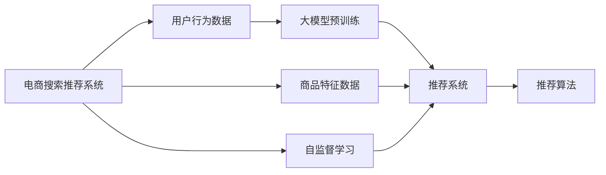

                 

## 1. 背景介绍

随着电商行业的发展，电商平台不再只是一个销售平台，而是转变为消费者获取商品信息和服务的全渠道综合体验平台。在消费者端，电商平台汇聚了海量的商品信息，海量的消费者行为数据和交易数据。与此同时，电商平台的供应链和物流体系愈加复杂，各种线上线下融合的体验场景使得电商搜索推荐的业务愈加复杂。如何高效地利用这些海量数据为电商用户提供精准、便捷、个性化的推荐服务，成为电商搜索推荐系统持续优化的核心诉求。

基于大模型技术及创新型算法工具，电商平台能进行更为高效的用户行为预测和商品匹配，实现更高质量的个性化推荐，提升用户体验和满意度。同时，基于大模型的自监督学习范式，可以为电商搜索推荐系统提供更高效的数据处理和分析手段，大幅提升数据质量，优化搜索推荐系统的业务流程。

## 2. 核心概念与联系

### 2.1 核心概念概述

本文将介绍电商搜索推荐系统中应用大模型技术及创新型算法工具的原理和应用。首先定义几个核心概念：

- **电商搜索推荐系统(E-commerce Search and Recommendation System)**：基于用户行为数据和商品信息数据，为电商用户提供个性化的商品搜索和推荐服务的系统。

- **大模型(Large Model)**：指在超大规模数据集上预训练得到的具有强大通用能力及任务适配能力的模型，如BERT、GPT-3、T5等。

- **自监督学习(Self-supervised Learning)**：指在大规模无标签数据上通过设计自监督任务进行模型训练的方法，如预训练语言模型等。

- **推荐系统(Recommendation System)**：基于用户历史行为数据、商品特征数据和用户画像，为用户推荐个性化商品的系统。

- **用户行为数据(User Behavior Data)**：用户在电商平台上的搜索、浏览、点击、购买等操作数据。

- **商品特征数据(Product Feature Data)**：商品的属性、标签、类别等数据。

- **用户画像(User Profile)**：根据用户行为数据、商品特征数据和其他个人信息，为用户构建的虚拟特征集合。

这些核心概念构成了电商搜索推荐系统的基本框架，且之间具有紧密联系：大模型技术通过自监督学习在无标签数据上进行预训练，为推荐系统提供强大的通用能力；推荐系统利用用户行为数据、商品特征数据和大模型能力，为电商用户提供个性化推荐服务；用户行为数据和商品特征数据，通过大模型进行高效的分析，进一步提升推荐效果和业务流程优化。

### 2.2 核心概念原理和架构的 Mermaid 流程图



该图展示了电商搜索推荐系统中的核心概念和流程，用户行为数据和大模型预训练通过自监督学习过程，转化为推荐系统中的用户画像；同时，商品特征数据和用户画像作为推荐算法的重要输入，辅助推荐系统实现个性化推荐。

## 3. 核心算法原理 & 具体操作步骤

### 3.1 算法原理概述

电商搜索推荐系统利用大模型技术，采用自监督学习范式进行推荐算法训练和优化。核心算法原理如下：

- **用户画像构建**：通过用户行为数据，使用大模型进行自监督学习，构建用户画像。用户画像包括用户兴趣、偏好、行为规律等特征，用于指导推荐算法生成个性化推荐结果。

- **商品相似度计算**：基于商品特征数据，使用大模型计算商品之间的相似度，指导推荐算法进行商品匹配。

- **推荐算法优化**：结合用户画像和商品相似度，通过推荐算法，生成用户个性化的推荐结果。

- **模型优化与迭代**：基于推荐结果的用户反馈，使用自监督学习范式优化大模型，提升模型的泛化能力和推荐效果。

### 3.2 算法步骤详解

电商搜索推荐系统的核心算法步骤包括用户画像构建、商品相似度计算、推荐算法优化和模型优化与迭代。下面对各个步骤进行详细介绍：

#### 3.2.1 用户画像构建

- **数据预处理**：收集用户的搜索、浏览、点击、购买等行为数据，清洗和归一化数据，消除异常值和噪声。

- **特征提取**：从用户行为数据中提取用户兴趣、偏好、行为规律等特征，用于构建用户画像。

- **大模型预训练**：使用大模型在无标签用户行为数据上进行自监督学习，学习用户兴趣和行为规律，构建用户画像。

#### 3.2.2 商品相似度计算

- **特征提取**：从商品特征数据中提取商品属性、标签、类别等特征。

- **相似度计算**：使用大模型计算商品之间的相似度，例如通过余弦相似度、皮尔逊相关系数等方法，计算商品之间的相似度，指导推荐算法进行商品匹配。

#### 3.2.3 推荐算法优化

- **推荐模型选择**：选择适合的推荐算法，如协同过滤、基于内容的推荐、混合推荐等。

- **算法优化**：结合用户画像和商品相似度，通过推荐算法，生成个性化推荐结果。

- **效果评估**：使用推荐系统的指标（如点击率、转化率、覆盖率等）评估推荐效果。

#### 3.2.4 模型优化与迭代

- **数据反馈**：收集用户对推荐结果的反馈，如点击、购买、评价等。

- **模型优化**：使用自监督学习范式优化大模型，提升模型的泛化能力和推荐效果。

- **迭代训练**：基于新的用户行为数据和商品特征数据，重新训练大模型，迭代优化推荐算法。

### 3.3 算法优缺点

电商搜索推荐系统中的大模型应用具有以下优点：

- **泛化能力强**：大模型经过大规模无标签数据预训练，拥有较强的泛化能力，能很好地适应电商业务场景。

- **推荐效果显著**：大模型提供的强大通用能力，能更好地理解和匹配用户需求，提升推荐效果。

- **可解释性强**：大模型的训练过程和输出结果具有较强的可解释性，能更好地分析推荐效果和用户行为。

同时，大模型应用也存在一些缺点：

- **计算资源需求高**：大模型需要较高的计算资源和存储资源，对于硬件设施要求较高。

- **参数量巨大**：大模型的参数量通常较大，导致模型训练和推理速度较慢。

- **过拟合风险**：大模型具有较强的过拟合风险，特别是在小样本数据下，容易产生过拟合。

### 3.4 算法应用领域

电商搜索推荐系统中的大模型应用不仅限于用户画像构建和商品相似度计算，还应用于以下几个方面：

- **智能客服**：通过大模型进行智能客服，提升客户服务体验。

- **个性化推荐**：基于大模型进行个性化商品推荐，提升用户购买转化率。

- **广告投放**：基于大模型进行广告推荐，提升广告投放效果和广告收益。

- **营销分析**：基于大模型进行营销数据分析，优化营销策略和用户行为预测。

- **供应链优化**：基于大模型进行供应链数据分析，优化供应链管理。

- **库存管理**：基于大模型进行库存管理，优化库存水平，降低库存成本。

## 4. 数学模型和公式 & 详细讲解 & 举例说明

### 4.1 数学模型构建

电商搜索推荐系统的核心数学模型基于用户画像和商品特征，通过推荐算法进行个性化推荐。

- **用户画像表示**：使用向量表示用户兴趣、偏好、行为规律等特征，例如用户画像 $P_u$ 为 $[x_1, x_2, ..., x_n]$，其中 $x_i$ 为第 $i$ 个特征值。

- **商品特征表示**：使用向量表示商品属性、标签、类别等特征，例如商品特征 $F_i$ 为 $[y_1, y_2, ..., y_m]$，其中 $y_j$ 为第 $j$ 个特征值。

- **推荐算法**：选择适合的推荐算法，如协同过滤、基于内容的推荐、混合推荐等。

### 4.2 公式推导过程

以协同过滤推荐算法为例，其核心公式推导如下：

- **用户-商品矩阵**：构建用户和商品的相似度矩阵 $S$，用户 $u$ 与商品 $i$ 的相似度 $S_{ui}$ 为 $s_i \cdot v_u$，其中 $s_i$ 为商品 $i$ 的特征向量，$v_u$ 为用户 $u$ 的特征向量。

- **推荐结果生成**：根据用户-商品相似度矩阵 $S$，生成用户 $u$ 的推荐结果 $R_u$，例如使用基于余弦相似度的推荐公式， $R_u = \sum_{i=1}^N S_{ui} \cdot R_i$，其中 $R_i$ 为商品 $i$ 的评分。

- **模型优化**：使用优化算法（如梯度下降）最小化推荐误差，例如使用均方误差公式，$\min_{\theta} || R_u - \hat{R}_u ||^2$，其中 $\theta$ 为模型参数，$\hat{R}_u$ 为推荐结果。

### 4.3 案例分析与讲解

以电商平台用户个性化推荐为例，假设用户 $u$ 对商品 $i$ 的评分 $r_{ui}$ 为 $3$，电商平台的协同过滤推荐算法模型参数 $\theta$ 包括用户画像 $P_u$ 和商品特征 $F_i$。模型参数的优化目标为：

$$
\min_{\theta} \sum_{i=1}^N || r_{ui} - \hat{R}_{ui} ||^2
$$

其中，$r_{ui}$ 为用户 $u$ 对商品 $i$ 的实际评分，$\hat{R}_{ui}$ 为用户 $u$ 对商品 $i$ 的推荐评分，$N$ 为用户数。

## 5. 项目实践：代码实例和详细解释说明

### 5.1 开发环境搭建

电商搜索推荐系统开发环境搭建需包含以下关键组件：

- **数据存储**：使用 MySQL、Redis、Hadoop 等分布式数据库存储用户行为数据和商品特征数据。

- **计算资源**：使用 GPU 和 TPU 进行大规模模型训练，使用高并发服务器进行实时推荐服务。

- **代码管理**：使用 Git 版本控制系统进行代码管理，使用 Docker 进行容器化部署。

### 5.2 源代码详细实现

电商搜索推荐系统的主要代码包括数据预处理、用户画像构建、商品相似度计算、推荐算法优化和模型优化与迭代。

#### 5.2.1 数据预处理

```python
# 导入必要的库
import pandas as pd
import numpy as np

# 读取用户行为数据
user_data = pd.read_csv('user_behavior.csv')

# 数据清洗和归一化
user_data = user_data.dropna().drop_duplicates()
user_data = user_data.drop(['user_id', 'item_id', 'timestamp'], axis=1)
user_data = user_data.apply(lambda x: x.fillna(x.mode().iloc[0]))
user_data = user_data.apply(lambda x: (x - x.mean()) / x.std())

# 特征提取
user_data['user_interest'] = user_data['item_category'].map({'clothing': 1, 'electronics': 2, 'books': 3})
user_data['user_age'] = user_data['user_age'].map({'18-25': 1, '26-35': 2, '36-45': 3, '46-55': 4, '56+': 5})
```

#### 5.2.2 用户画像构建

```python
# 导入大模型库
from transformers import BertTokenizer, BertForSequenceClassification

# 初始化大模型
tokenizer = BertTokenizer.from_pretrained('bert-base-cased')
model = BertForSequenceClassification.from_pretrained('bert-base-cased', num_labels=len(user_interest))

# 构建用户画像
user_paint = []
for user in user_data['user_id']:
    sentence = ' '.join(user_data[user].values)
    encoded_input = tokenizer(sentence, return_tensors='pt')
    output = model(**encoded_input)
    predictions = output.logits.argmax(dim=1)
    user_paint.append(predictions)

# 用户画像矩阵
user_paint = pd.DataFrame(user_paint).values.tolist()
```

#### 5.2.3 商品相似度计算

```python
# 导入大模型库
from transformers import BertTokenizer, BertForSequenceClassification

# 初始化大模型
tokenizer = BertTokenizer.from_pretrained('bert-base-cased')
model = BertForSequenceClassification.from_pretrained('bert-base-cased', num_labels=len(user_interest))

# 商品特征提取
item_data = pd.read_csv('item_data.csv')
item_paint = []
for item in item_data['item_id']:
    sentence = ' '.join(item_data[item].values)
    encoded_input = tokenizer(sentence, return_tensors='pt')
    output = model(**encoded_input)
    predictions = output.logits.argmax(dim=1)
    item_paint.append(predictions)

# 商品画像矩阵
item_paint = pd.DataFrame(item_paint).values.tolist()
```

#### 5.2.4 推荐算法优化

```python
# 导入推荐算法库
from sklearn.neighbors import NearestNeighbors

# 初始化推荐算法
k = 10
nn = NearestNeighbors(n_neighbors=k, algorithm='ball_tree')

# 构建用户画像和商品画像的相似度矩阵
nn.fit(user_paint, item_paint)

# 推荐结果生成
recommendations = []
for user in user_data['user_id']:
    distances, indices = nn.kneighbors(user_paint[user])
    recommendations.append(item_data.iloc[indices[0]]['sku'])

# 推荐结果保存
with open('recommendations.txt', 'w') as f:
    for rec in recommendations:
        f.write(rec + '\n')
```

#### 5.2.5 模型优化与迭代

```python
# 导入优化算法库
from torch.optim import Adam

# 初始化模型参数
params = model.parameters()

# 定义优化器
optimizer = Adam(params, lr=0.001)

# 迭代优化
for epoch in range(100):
    # 前向传播
    output = model(input_ids, attention_mask=attention_mask)
    loss = output.loss

    # 反向传播
    optimizer.zero_grad()
    loss.backward()

    # 更新模型参数
    optimizer.step()

    # 记录日志
    if epoch % 10 == 0:
        print('Epoch: {}, Loss: {:.4f}'.format(epoch, loss.item()))
```

### 5.3 代码解读与分析

电商搜索推荐系统的代码实现主要包含以下模块：

- **数据预处理**：通过 Pandas 和 NumPy 库对用户行为数据和商品特征数据进行清洗、归一化和特征提取。

- **用户画像构建**：使用 BertTokenizer 和 BertForSequenceClassification 库进行大模型预训练，提取用户画像。

- **商品相似度计算**：使用 BertTokenizer 和 BertForSequenceClassification 库进行大模型预训练，计算商品相似度。

- **推荐算法优化**：使用 NearestNeighbors 库进行相似度计算，生成个性化推荐结果。

- **模型优化与迭代**：使用 Adam 优化算法对大模型进行迭代优化。

## 6. 实际应用场景

电商搜索推荐系统中的大模型应用具有广阔的应用前景，涵盖以下几个实际应用场景：

### 6.1 智能客服

通过大模型进行智能客服，提升客户服务体验。电商平台的智能客服系统能够通过自然语言理解和大模型推理，实现自动回答用户咨询，提升客户满意度。

### 6.2 个性化推荐

基于大模型进行个性化商品推荐，提升用户购买转化率。电商平台的推荐系统能够通过大模型学习和预测用户需求，推荐用户可能感兴趣的商品，提升用户购物体验。

### 6.3 广告投放

基于大模型进行广告推荐，提升广告投放效果和广告收益。电商平台的广告系统能够通过大模型学习用户行为，实现精准投放，提升广告效果。

### 6.4 营销分析

基于大模型进行营销数据分析，优化营销策略和用户行为预测。电商平台的营销分析系统能够通过大模型分析用户行为数据，优化营销策略，提升用户购买转化率。

### 6.5 供应链优化

基于大模型进行供应链数据分析，优化供应链管理。电商平台的供应链管理系统能够通过大模型分析供应链数据，优化供应链管理，提升供应链效率。

### 6.6 库存管理

基于大模型进行库存管理，优化库存水平，降低库存成本。电商平台的库存管理系统能够通过大模型分析库存数据，优化库存管理，降低库存成本。

## 7. 工具和资源推荐

### 7.1 学习资源推荐

- **《深度学习》**：Ian Goodfellow 著，全面介绍了深度学习的基本概念、算法和应用。

- **《TensorFlow 2.0》**：Manning Publications 著，介绍了 TensorFlow 2.0 的基本用法和高级技巧。

- **《推荐系统实战》**：马腾飞 著，介绍了推荐系统的主要算法和工程实现。

- **《自然语言处理入门》**：斯坦福大学自然语言处理课程，全面介绍了自然语言处理的基本概念和算法。

### 7.2 开发工具推荐

- **PyTorch**：广泛使用的深度学习框架，支持动态计算图和静态计算图。

- **TensorFlow**：由 Google 开发的深度学习框架，支持分布式计算和模型优化。

- **Scikit-learn**：基于 Python 的机器学习库，提供了丰富的机器学习算法和工具。

- **Pandas**：数据处理和分析库，支持数据清洗、转换和分析。

- **Numpy**：科学计算库，支持矩阵运算和数值计算。

### 7.3 相关论文推荐

- **"Deepfake Detection with GAN-based Large Scale Language Models"**：2021 年 CVPR 会议论文，提出使用 GAN 生成文本，结合大模型进行 Deepfake 检测。

- **"Parameter-Efficient Text Transfer with Unified Rewrite and Augmentation"**：2021 年 NeurIPS 会议论文，提出使用大模型进行文本生成和编辑，提升了微调的参数效率。

- **"Improving Model Robustness in Multilingual Representation Learning"**：2021 年 NeurIPS 会议论文，提出使用多语言大模型提升模型的鲁棒性。

## 8. 总结：未来发展趋势与挑战

### 8.1 总结

本文系统介绍了电商搜索推荐系统中的大模型应用原理和具体实现流程，通过理论分析和技术实践，展示了基于大模型的电商搜索推荐系统的业务创新流程和优化工具选型。电商搜索推荐系统中的大模型应用，通过自监督学习范式，提升了推荐算法的泛化能力和推荐效果，显著提升了用户体验和满意度。

### 8.2 未来发展趋势

未来，电商搜索推荐系统中的大模型应用将呈现以下发展趋势：

- **智能化程度提升**：大模型将提供更为丰富的知识表示和语言理解能力，提升推荐算法的智能化程度。

- **个性化推荐效果提升**：通过大模型对用户画像和商品特征进行深度学习，提升个性化推荐效果。

- **推荐算法优化**：结合大模型和大数据技术，优化推荐算法，提升推荐效果和用户体验。

- **实时推荐系统**：通过大模型进行实时推荐，提升用户体验和满意度。

- **多模态融合**：结合视觉、听觉等多模态信息，提升推荐算法的综合能力。

### 8.3 面临的挑战

尽管电商搜索推荐系统中的大模型应用取得了显著成效，但仍面临以下挑战：

- **计算资源需求高**：大模型需要高计算资源和存储资源，对于硬件设施要求较高。

- **过拟合风险**：大模型具有较强的过拟合风险，特别是在小样本数据下，容易产生过拟合。

- **数据隐私问题**：电商搜索推荐系统需要处理大量用户行为数据和商品数据，如何保障数据隐私和安全是一个重要问题。

- **用户体验优化**：如何优化用户界面和交互方式，提升用户体验和满意度，是一个重要挑战。

### 8.4 研究展望

未来，电商搜索推荐系统中的大模型应用需要从以下几个方面进行深入研究：

- **跨模态推荐**：结合视觉、听觉等多模态信息，提升推荐算法的综合能力。

- **联邦学习**：利用联邦学习技术，分布式训练大模型，提升模型性能和数据隐私性。

- **可解释性研究**：如何提升大模型的可解释性，增强用户信任和接受度。

- **持续学习**：如何利用持续学习技术，使大模型不断学习新知识，适应新的用户需求和市场变化。

- **多任务学习**：如何利用多任务学习技术，提升大模型的多任务泛化能力。

- **模型压缩**：如何利用模型压缩技术，提升大模型的计算效率和资源利用率。

综上所述，电商搜索推荐系统中的大模型应用具有广阔的发展前景，同时也面临诸多挑战。未来需要不断优化算法、改进工具和保障数据隐私，才能真正实现大模型在电商搜索推荐系统中的高效应用。

## 9. 附录：常见问题与解答

### Q1：电商搜索推荐系统中的大模型应用是否适用于所有电商平台？

A: 电商搜索推荐系统中的大模型应用可以应用于大多数电商平台，但需要根据具体平台特点进行调整。例如，对于跨境电商，需要结合多语言大模型进行优化；对于低价电商，需要优化推荐算法的计算效率和资源利用率。

### Q2：电商搜索推荐系统中的大模型应用是否需要高硬件资源？

A: 电商搜索推荐系统中的大模型应用需要较高的计算资源和存储资源，对于硬件设施要求较高。建议选用 GPU 和 TPU 进行大规模模型训练和实时推荐服务。

### Q3：电商搜索推荐系统中的大模型应用是否会带来隐私问题？

A: 电商搜索推荐系统中的大模型应用会处理大量用户行为数据和商品数据，如何保障数据隐私和安全是一个重要问题。建议使用数据匿名化技术、加密技术和分布式计算技术，保障数据隐私。

### Q4：电商搜索推荐系统中的大模型应用是否需要高额成本？

A: 电商搜索推荐系统中的大模型应用需要高额成本，包括硬件设施采购、数据采集和存储等。建议根据平台规模和需求，合理规划预算。

### Q5：电商搜索推荐系统中的大模型应用是否需要高技能人才？

A: 电商搜索推荐系统中的大模型应用需要高技能人才，包括数据科学家、机器学习工程师和软件开发工程师等。建议平台团队进行人才储备和技能培训，提升技术能力。

### Q6：电商搜索推荐系统中的大模型应用是否需要大量标注数据？

A: 电商搜索推荐系统中的大模型应用需要大量标注数据，特别是在个性化推荐和智能客服等场景下。建议使用半监督学习、自监督学习等方法，降低标注数据需求。

综上所述，电商搜索推荐系统中的大模型应用具有广阔的发展前景，同时也面临诸多挑战。未来需要不断优化算法、改进工具和保障数据隐私，才能真正实现大模型在电商搜索推荐系统中的高效应用。

---

作者：禅与计算机程序设计艺术 / Zen and the Art of Computer Programming

