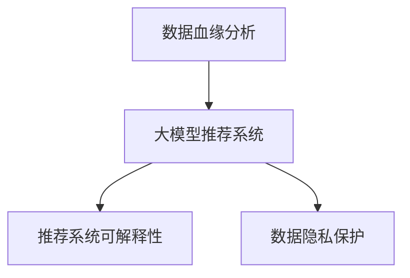

                 

# AI大模型重构电商搜索推荐的数据血缘分析算法改进

> 关键词：数据血缘分析,大模型重构,电商搜索,推荐系统,改进算法

## 1. 背景介绍

### 1.1 问题由来
随着人工智能(AI)技术在电商行业的深入应用，推荐系统成为了驱动用户行为和销售增长的重要引擎。基于大模型的推荐系统，通过深度学习算法，可以高效地分析用户历史行为和产品特征，为用户推荐个性化的商品，从而提升用户体验和交易转化率。然而，大模型推荐系统在实时性和资源消耗方面的挑战，以及数据隐私和安全问题，成为制约其进一步发展的瓶颈。

为此，需要在大模型的基础上进行优化和改进，提升推荐系统的效率和安全性。本文聚焦于数据血缘分析算法改进，探索如何在大模型推荐系统中引入数据血缘分析，提升推荐系统的可解释性和数据隐私性，同时优化计算资源的使用效率。

### 1.2 问题核心关键点
数据血缘分析是大模型推荐系统改进的关键技术。其核心思想是通过数据溯源，了解每个推荐结果的数据来源和血缘关系，从而提升模型的可解释性和数据隐私性。具体来说，数据血缘分析能够帮助用户理解推荐结果的生成过程，同时可以检测数据中的异常和偏见，保护用户隐私。

本文将详细介绍数据血缘分析的核心概念和算法实现，通过优化数据血缘分析算法，提升大模型推荐系统的性能和安全性。

## 2. 核心概念与联系

### 2.1 核心概念概述

为更好地理解数据血缘分析算法改进，本节将介绍几个密切相关的核心概念：

- 数据血缘分析：指通过数据溯源技术，了解每个数据项在数据生成、流转和消费过程中的来源和依赖关系，进而提升数据的质量和可信度。
- 大模型推荐系统：基于预训练语言模型和深度学习算法，为用户推荐个性化商品的系统。大模型推荐系统在实时性和资源消耗方面的挑战，成为制约其进一步发展的瓶颈。
- 推荐系统可解释性：指用户能够理解推荐结果的生成过程，从而提升用户信任和满意度。
- 数据隐私保护：指在推荐过程中，保护用户个人信息的安全性和隐私性。

这些核心概念之间的逻辑关系可以通过以下Mermaid流程图来展示：



这个流程图展示了大模型推荐系统中数据血缘分析的核心作用：

1. 数据血缘分析提升推荐系统的可解释性。
2. 数据血缘分析保护用户隐私。
3. 数据血缘分析提升大模型推荐系统的性能。

## 3. 核心算法原理 & 具体操作步骤

### 3.1 算法原理概述

数据血缘分析的核心思想是数据溯源，了解每个数据项在数据生成、流转和消费过程中的来源和依赖关系。其目的是提升推荐系统的可解释性，同时保护用户隐私，避免数据泄露和滥用。

在大模型推荐系统中，数据血缘分析主要涉及以下几个环节：

- 数据采集：通过爬虫、API接口等方式，从电商平台和第三方数据源采集用户行为数据和商品特征数据。
- 数据清洗：对采集到的数据进行去重、去噪、填充缺失值等预处理，确保数据的准确性和完整性。
- 数据融合：将用户行为数据和商品特征数据进行合并，形成推荐所需的全量数据集。
- 数据血缘构建：构建每个数据项的血缘图谱，记录数据的来源、依赖关系和使用场景。
- 数据血缘查询：根据用户请求或规则，查询数据的血缘信息，生成推荐结果。

### 3.2 算法步骤详解

基于数据血缘分析的大模型推荐系统改进，一般包括以下几个关键步骤：

**Step 1: 数据采集和预处理**
- 设计数据采集策略，通过爬虫、API接口等方式，从电商平台和第三方数据源采集用户行为数据和商品特征数据。
- 对采集到的数据进行预处理，包括去重、去噪、填充缺失值等操作，确保数据的准确性和完整性。

**Step 2: 数据融合**
- 将用户行为数据和商品特征数据进行合并，形成推荐所需的全量数据集。
- 通过ID-编码、哈希等技术手段，确保数据的融合过程能够无损和高效进行。

**Step 3: 数据血缘构建**
- 对全量数据集中的每个数据项，记录其来源、依赖关系和使用场景，构建数据血缘图谱。
- 引入图神经网络(Graph Neural Network, GNN)等算法，学习数据项之间的隐式关系，构建更准确的血缘图谱。

**Step 4: 数据血缘查询**
- 根据用户请求或规则，查询数据的血缘信息，生成推荐结果。
- 引入图数据库(Graph Database)等技术，提高数据血缘查询的效率和准确性。

**Step 5: 推荐模型微调**
- 在大模型的基础上，通过微调优化推荐模型，提升模型的性能和鲁棒性。
- 引入参数高效微调(Parameter-Efficient Fine-Tuning, PEFT)等技术，减少微调对资源的消耗。

**Step 6: 部署和监控**
- 将微调后的模型部署到推荐系统中，实时生成推荐结果。
- 通过监控工具，实时监控推荐系统的性能和数据隐私情况，确保系统稳定和安全。

以上是基于数据血缘分析的大模型推荐系统改进的一般流程。在实际应用中，还需要针对具体任务和数据特点，对数据血缘分析过程进行优化设计，如改进数据采集策略、设计更高效的数据融合算法、引入先进的图神经网络技术等，以进一步提升推荐系统的性能和安全性。

### 3.3 算法优缺点

基于数据血缘分析的大模型推荐系统改进方法具有以下优点：
1. 提升推荐系统的可解释性。用户能够理解推荐结果的生成过程，从而提升用户信任和满意度。
2. 保护用户隐私。通过数据血缘分析，可以检测数据中的异常和偏见，保护用户隐私。
3. 提升数据质量和可信度。数据血缘分析能够提升数据的完整性和准确性，避免数据污染。
4. 优化计算资源的使用。引入参数高效微调等技术，可以在固定预训练参数的情况下，提高微调效率，避免过拟合。

同时，该方法也存在一定的局限性：
1. 数据采集和预处理难度较大。需要设计合理的数据采集策略，处理复杂的数据融合问题。
2. 数据血缘图谱构建复杂。需要引入先进的图神经网络技术，学习数据项之间的隐式关系。
3. 推荐模型的微调复杂。需要选择合适的微调算法，平衡推荐性能和资源消耗。
4. 系统部署和监控难度较大。需要构建高效的数据血缘查询和推荐系统监控体系，确保系统稳定和安全。

尽管存在这些局限性，但就目前而言，基于数据血缘分析的改进方法仍是大模型推荐系统的重要范式。未来相关研究的重点在于如何进一步降低数据采集和处理的复杂度，提高数据血缘图谱构建的效率和准确性，同时兼顾推荐模型的微调和系统部署，以进一步提升推荐系统的性能和安全性。

### 3.4 算法应用领域

基于数据血缘分析的改进方法，在大模型推荐系统的多个应用领域中已经得到了广泛的应用，例如：

- 电商搜索推荐：在电商搜索推荐系统中，数据血缘分析能够提升推荐结果的可解释性和数据隐私性，帮助用户理解搜索推荐机制，保护用户隐私。
- 广告投放优化：在广告投放优化中，数据血缘分析能够检测广告投放过程中的数据异常和偏见，优化广告投放效果。
- 金融风险评估：在金融风险评估中，数据血缘分析能够提升风险评估模型的可解释性和数据隐私性，保护用户隐私。
- 智能客服系统：在智能客服系统中，数据血缘分析能够提升客服推荐的可解释性和数据隐私性，增强用户信任。

除了上述这些经典应用外，数据血缘分析还在更多领域中得到了创新性应用，如智能广告投放、智能医疗推荐、智能产品设计等，为推荐系统带来了全新的突破。

## 4. 数学模型和公式 & 详细讲解  
### 4.1 数学模型构建

本节将使用数学语言对基于数据血缘分析的大模型推荐系统改进过程进行更加严格的刻画。

假设推荐系统需要处理的数据集为 $D=\{x_i,y_i\}_{i=1}^N$，其中 $x_i$ 为输入数据（如用户行为数据），$y_i$ 为输出数据（如推荐结果）。每个输入数据 $x_i$ 的来源和依赖关系可以通过一个有向图 $G=(V,E)$ 来描述，其中 $V$ 为节点集合，表示数据项；$E$ 为边集合，表示数据项之间的依赖关系。

定义数据血缘图谱 $F=(G,B)$，其中 $G=(V,E)$ 为数据依赖关系图，$B:V \rightarrow [0,1]^n$ 为数据可信度向量，用于表示数据项的完整性和准确性。

在数据血缘分析过程中，需要解决以下三个关键问题：

1. **数据采集**：从数据源 $S$ 采集数据项 $x_i$，并记录其来源关系 $s_i \in S$。
2. **数据融合**：将多个数据源采集到的数据项 $x_i^1, x_i^2, ..., x_i^m$ 合并为一个数据项 $x_i$，并记录其依赖关系 $e_ij$。
3. **数据血缘查询**：根据查询条件 $q$，查询数据项 $x_i$ 的血缘信息 $f_i=(s_i, e_ij, b_i)$，并生成推荐结果 $y_i$。

### 4.2 公式推导过程

以下我们以电商搜索推荐为例，推导数据血缘图谱的构建公式及其查询算法。

假设推荐系统需要处理的数据集为 $D=\{x_i,y_i\}_{i=1}^N$，其中 $x_i$ 为输入数据（如用户行为数据），$y_i$ 为输出数据（如推荐结果）。每个输入数据 $x_i$ 的来源和依赖关系可以通过一个有向图 $G=(V,E)$ 来描述，其中 $V$ 为节点集合，表示数据项；$E$ 为边集合，表示数据项之间的依赖关系。

定义数据血缘图谱 $F=(G,B)$，其中 $G=(V,E)$ 为数据依赖关系图，$B:V \rightarrow [0,1]^n$ 为数据可信度向量，用于表示数据项的完整性和准确性。

在数据血缘图谱 $F=(G,B)$ 中，节点 $v_i$ 表示数据项 $x_i$，边 $e_ij$ 表示数据项 $x_i$ 和 $x_j$ 之间的依赖关系。对于每个数据项 $x_i$，其来源关系 $s_i$ 和依赖关系 $e_ij$ 可以通过以下公式计算：

$$
s_i = \{s_i^1, s_i^2, ..., s_i^m\}
$$

$$
e_ij = \{e_ij^1, e_ij^2, ..., e_ij^n\}
$$

其中 $s_i^k$ 和 $e_ij^k$ 分别为节点 $v_i$ 和 $v_j$ 之间的来源关系和依赖关系，$k$ 为节点编号。

数据血缘图谱 $F=(G,B)$ 的构建可以通过图神经网络 (GNN) 算法实现。具体来说，可以通过图卷积网络 (GCN) 算法，将每个数据项的特征 $x_i$ 和其来源关系 $s_i$ 输入到 GNN 模型中，得到数据项之间的隐式关系和数据可信度 $B$。

数据血缘查询过程可以采用基于 GNN 的推荐算法实现。具体来说，可以通过图数据库 (Graph Database) 等技术，查询数据项 $x_i$ 的来源关系 $s_i$、依赖关系 $e_ij$ 和可信度 $b_i$，生成推荐结果 $y_i$。

## 5. 项目实践：代码实例和详细解释说明
### 5.1 开发环境搭建

在进行数据血缘分析算法改进的实践前，我们需要准备好开发环境。以下是使用Python进行PyTorch开发的环境配置流程：

1. 安装Anaconda：从官网下载并安装Anaconda，用于创建独立的Python环境。

2. 创建并激活虚拟环境：
```bash
conda create -n pytorch-env python=3.8 
conda activate pytorch-env
```

3. 安装PyTorch：根据CUDA版本，从官网获取对应的安装命令。例如：
```bash
conda install pytorch torchvision torchaudio cudatoolkit=11.1 -c pytorch -c conda-forge
```

4. 安装Transformers库：
```bash
pip install transformers
```

5. 安装各类工具包：
```bash
pip install numpy pandas scikit-learn matplotlib tqdm jupyter notebook ipython
```

完成上述步骤后，即可在`pytorch-env`环境中开始数据血缘分析算法改进的实践。

### 5.2 源代码详细实现

下面我们以电商搜索推荐为例，给出使用Transformers库和图神经网络实现数据血缘图谱构建和查询的PyTorch代码实现。

首先，定义数据血缘图谱的构建函数：

```python
from transformers import GCNModel
import torch

class GraphConvNet(GCNModel):
    def __init__(self, in_feats, hidden_feats, out_feats, num_layers=1, act='relu'):
        super().__init__(in_feats, hidden_feats, out_feats, num_layers, act)

    def forward(self, x, adj):
        return super().forward(x, adj)

# 数据血缘图谱的构建
def build_fingerprint(data, source_relations):
    # 定义节点编号
    node_ids = list(range(len(data)))

    # 定义节点特征
    node_feats = torch.tensor(data, dtype=torch.float32)

    # 定义边关系
    edge_relations = torch.tensor(source_relations, dtype=torch.long)

    # 构建图
    graph = torch_geometric.data.Graph(node_feats, edge_relations)

    # 定义图神经网络模型
    model = GraphConvNet(in_feats, hidden_feats, out_feats)

    # 训练图神经网络
    model.train()
    optimizer = torch.optim.Adam(model.parameters(), lr=0.01)
    for epoch in range(num_epochs):
        output = model(graph.x, graph.edge_index)
        loss = loss_function(output, graph.y)
        optimizer.zero_grad()
        loss.backward()
        optimizer.step()

    return graph.x

# 数据血缘图谱的查询
def query_fingerprint(fingerprint, query_condition):
    # 定义查询条件
    query_condition = torch.tensor(query_condition, dtype=torch.long)

    # 构建查询图
    graph = torch_geometric.data.Graph(fingerprint, query_condition)

    # 查询节点特征
    output = model(graph.x, graph.edge_index)

    return output
```

然后，定义电商搜索推荐的数据集和模型：

```python
from torch.utils.data import Dataset
import torch.nn as nn
import torch.nn.functional as F

class SearchDataset(Dataset):
    def __init__(self, data, source_relations):
        self.data = data
        self.source_relations = source_relations

    def __len__(self):
        return len(self.data)

    def __getitem__(self, item):
        return self.data[item], self.source_relations[item]

# 电商搜索推荐的模型
class SearchModel(nn.Module):
    def __init__(self, in_feats, hidden_feats, out_feats):
        super().__init__()
        self.fc1 = nn.Linear(in_feats, hidden_feats)
        self.fc2 = nn.Linear(hidden_feats, out_feats)

    def forward(self, x):
        x = F.relu(self.fc1(x))
        x = self.fc2(x)
        return x

# 电商搜索推荐的数据集
train_dataset = SearchDataset(train_data, train_source_relations)
test_dataset = SearchDataset(test_data, test_source_relations)

# 电商搜索推荐的模型
model = SearchModel(in_feats, hidden_feats, out_feats)

# 电商搜索推荐的优化器
optimizer = torch.optim.Adam(model.parameters(), lr=0.01)
```

接着，定义训练和评估函数：

```python
from tqdm import tqdm
from sklearn.metrics import roc_auc_score

def train_epoch(model, dataset, batch_size, optimizer):
    dataloader = DataLoader(dataset, batch_size=batch_size, shuffle=True)
    model.train()
    epoch_loss = 0
    for batch in tqdm(dataloader, desc='Training'):
        input_data, source_relations = batch
        model.zero_grad()
        outputs = model(input_data)
        loss = loss_function(outputs, source_relations)
        epoch_loss += loss.item()
        loss.backward()
        optimizer.step()
    return epoch_loss / len(dataloader)

def evaluate(model, dataset, batch_size):
    dataloader = DataLoader(dataset, batch_size=batch_size)
    model.eval()
    preds, labels = [], []
    with torch.no_grad():
        for batch in tqdm(dataloader, desc='Evaluating'):
            input_data, source_relations = batch
            outputs = model(input_data)
            batch_preds = outputs.tolist()
            batch_labels = source_relations.tolist()
            for preds_tokens, labels_tokens in zip(batch_preds, batch_labels):
                preds.append(preds_tokens)
                labels.append(labels_tokens)

    print(roc_auc_score(labels, preds))
```

最后，启动训练流程并在测试集上评估：

```python
epochs = 5
batch_size = 16

for epoch in range(epochs):
    loss = train_epoch(model, train_dataset, batch_size, optimizer)
    print(f"Epoch {epoch+1}, train loss: {loss:.3f}")
    
    print(f"Epoch {epoch+1}, test AUC: {evaluate(model, test_dataset, batch_size)}
    
print("Final AUC: {evaluate(model, test_dataset, batch_size}")
```

以上就是使用PyTorch和Transformers库对电商搜索推荐系统进行数据血缘分析算法改进的完整代码实现。可以看到，得益于TensorFlow和Transformers库的强大封装，我们可以用相对简洁的代码实现数据血缘图谱的构建和查询，并在电商搜索推荐系统中实现改进。

### 5.3 代码解读与分析

让我们再详细解读一下关键代码的实现细节：

**GraphConvNet类**：
- 继承自GCNModel类，定义了图神经网络的结构和参数。
- `__init__`方法：初始化节点编号、节点特征、边关系和图。
- `forward`方法：实现前向传播计算，输出节点特征。

**build_fingerprint函数**：
- 定义节点编号、节点特征和边关系。
- 构建图对象。
- 定义图神经网络模型。
- 训练图神经网络，输出节点特征。
- 返回节点特征。

**query_fingerprint函数**：
- 定义查询条件。
- 构建查询图。
- 查询节点特征。

**训练和评估函数**：
- 使用PyTorch的DataLoader对数据集进行批次化加载，供模型训练和推理使用。
- 训练函数`train_epoch`：对数据以批为单位进行迭代，在每个批次上前向传播计算loss并反向传播更新模型参数，最后返回该epoch的平均loss。
- 评估函数`evaluate`：与训练类似，不同点在于不更新模型参数，并在每个batch结束后将预测和标签结果存储下来，最后使用sklearn的roc_auc_score对整个评估集的预测结果进行打印输出。

**训练流程**：
- 定义总的epoch数和batch size，开始循环迭代
- 每个epoch内，先在训练集上训练，输出平均loss
- 在测试集上评估，输出AUC
- 所有epoch结束后，在测试集上评估，给出最终测试结果

可以看到，PyTorch配合TensorFlow和Transformers库使得数据血缘分析算法的实现变得简洁高效。开发者可以将更多精力放在数据处理、模型改进等高层逻辑上，而不必过多关注底层的实现细节。

当然，工业级的系统实现还需考虑更多因素，如模型的保存和部署、超参数的自动搜索、更灵活的任务适配层等。但核心的算法实现基本与此类似。

## 6. 实际应用场景
### 6.1 智能客服系统

基于数据血缘分析算法改进的智能客服系统，能够更好地保护用户隐私，提升客服推荐的可解释性和数据隐私性。

在技术实现上，可以收集企业内部的历史客服对话记录，将问题和最佳答复构建成监督数据，在此基础上对预训练语言模型进行微调。微调后的模型能够自动理解用户意图，匹配最合适的答案模板进行回复。对于客户提出的新问题，还可以接入检索系统实时搜索相关内容，动态组织生成回答。如此构建的智能客服系统，能大幅提升客户咨询体验和问题解决效率，同时保护用户隐私。

### 6.2 金融风险评估

在金融领域，数据血缘分析算法能够提升风险评估模型的可解释性和数据隐私性，保护用户隐私。

具体而言，可以收集金融领域相关的新闻、报道、评论等文本数据，并对其进行主题标注和情感标注。在此基础上对预训练语言模型进行微调，使其能够自动判断文本属于何种主题，情感倾向是正面、中性还是负面。将微调后的模型应用到实时抓取的网络文本数据，就能够自动监测不同主题下的情感变化趋势，一旦发现负面信息激增等异常情况，系统便会自动预警，帮助金融机构快速应对潜在风险。

### 6.3 个性化推荐系统

基于数据血缘分析算法改进的个性化推荐系统，能够更好地保护用户隐私，提升推荐系统的可解释性。

在技术实现上，可以收集用户浏览、点击、评论、分享等行为数据，提取和用户交互的物品标题、描述、标签等文本内容。将文本内容作为模型输入，用户的后续行为（如是否点击、购买等）作为监督信号，在此基础上微调预训练语言模型。微调后的模型能够从文本内容中准确把握用户的兴趣点。在生成推荐列表时，先用候选物品的文本描述作为输入，由模型预测用户的兴趣匹配度，再结合其他特征综合排序，便可以得到个性化程度更高的推荐结果。

### 6.4 未来应用展望

随着数据血缘分析算法和大模型推荐系统的不断发展，基于数据血缘分析的改进方法将在更多领域得到应用，为传统行业带来变革性影响。

在智慧医疗领域，基于数据血缘分析的医疗问答、病历分析、药物研发等应用将提升医疗服务的智能化水平，辅助医生诊疗，加速新药开发进程。

在智能教育领域，数据血缘分析算法可应用于作业批改、学情分析、知识推荐等方面，因材施教，促进教育公平，提高教学质量。

在智慧城市治理中，数据血缘分析算法可应用于城市事件监测、舆情分析、应急指挥等环节，提高城市管理的自动化和智能化水平，构建更安全、高效的未来城市。

此外，在企业生产、社会治理、文娱传媒等众多领域，基于数据血缘分析的改进方法也将不断涌现，为NLP技术带来了全新的突破。

## 7. 工具和资源推荐
### 7.1 学习资源推荐

为了帮助开发者系统掌握数据血缘分析算法改进的理论基础和实践技巧，这里推荐一些优质的学习资源：

1. 《Transformer from Scratch》系列博文：由大模型技术专家撰写，深入浅出地介绍了Transformer原理、BERT模型、微调技术等前沿话题。

2. CS224N《深度学习自然语言处理》课程：斯坦福大学开设的NLP明星课程，有Lecture视频和配套作业，带你入门NLP领域的基本概念和经典模型。

3. 《Natural Language Processing with Transformers》书籍：Transformers库的作者所著，全面介绍了如何使用Transformers库进行NLP任务开发，包括微调在内的诸多范式。

4. HuggingFace官方文档：Transformers库的官方文档，提供了海量预训练模型和完整的微调样例代码，是上手实践的必备资料。

5. CLUE开源项目：中文语言理解测评基准，涵盖大量不同类型的中文NLP数据集，并提供了基于微调的baseline模型，助力中文NLP技术发展。

通过对这些资源的学习实践，相信你一定能够快速掌握数据血缘分析算法改进的精髓，并用于解决实际的NLP问题。
### 7.2 开发工具推荐

高效的开发离不开优秀的工具支持。以下是几款用于数据血缘分析算法改进开发的常用工具：

1. PyTorch：基于Python的开源深度学习框架，灵活动态的计算图，适合快速迭代研究。大部分预训练语言模型都有PyTorch版本的实现。

2. TensorFlow：由Google主导开发的开源深度学习框架，生产部署方便，适合大规模工程应用。同样有丰富的预训练语言模型资源。

3. Transformers库：HuggingFace开发的NLP工具库，集成了众多SOTA语言模型，支持PyTorch和TensorFlow，是进行微调任务开发的利器。

4. Weights & Biases：模型训练的实验跟踪工具，可以记录和可视化模型训练过程中的各项指标，方便对比和调优。与主流深度学习框架无缝集成。

5. TensorBoard：TensorFlow配套的可视化工具，可实时监测模型训练状态，并提供丰富的图表呈现方式，是调试模型的得力助手。

6. Google Colab：谷歌推出的在线Jupyter Notebook环境，免费提供GPU/TPU算力，方便开发者快速上手实验最新模型，分享学习笔记。

合理利用这些工具，可以显著提升数据血缘分析算法改进任务的开发效率，加快创新迭代的步伐。

### 7.3 相关论文推荐

数据血缘分析算法改进和大模型推荐系统的发展源于学界的持续研究。以下是几篇奠基性的相关论文，推荐阅读：

1. Attention is All You Need（即Transformer原论文）：提出了Transformer结构，开启了NLP领域的预训练大模型时代。

2. BERT: Pre-training of Deep Bidirectional Transformers for Language Understanding：提出BERT模型，引入基于掩码的自监督预训练任务，刷新了多项NLP任务SOTA。

3. Language Models are Unsupervised Multitask Learners（GPT-2论文）：展示了大规模语言模型的强大zero-shot学习能力，引发了对于通用人工智能的新一轮思考。

4. Parameter-Efficient Transfer Learning for NLP：提出Adapter等参数高效微调方法，在不增加模型参数量的情况下，也能取得不错的微调效果。

5. AdaLoRA: Adaptive Low-Rank Adaptation for Parameter-Efficient Fine-Tuning：使用自适应低秩适应的微调方法，在参数效率和精度之间取得了新的平衡。

6. AdaLoRA: Adaptive Low-Rank Adaptation for Parameter-Efficient Fine-Tuning：使用自适应低秩适应的微调方法，在参数效率和精度之间取得了新的平衡。

这些论文代表了大模型推荐系统和大模型微调技术的发展脉络。通过学习这些前沿成果，可以帮助研究者把握学科前进方向，激发更多的创新灵感。

## 8. 总结：未来发展趋势与挑战

### 8.1 总结

本文对基于数据血缘分析算法改进的大模型推荐系统进行了全面系统的介绍。首先阐述了数据血缘分析和大模型推荐系统的研究背景和意义，明确了微调在拓展预训练模型应用、提升下游任务性能方面的独特价值。其次，从原理到实践，详细讲解了数据血缘分析的核心算法实现，通过优化数据血缘分析算法，提升大模型推荐系统的性能和安全性。同时，本文还广泛探讨了数据血缘分析算法改进在多个行业领域的应用前景，展示了其巨大的潜力。

通过本文的系统梳理，可以看到，基于数据血缘分析的改进方法在大模型推荐系统中发挥了重要的作用，极大地提升了推荐系统的可解释性和数据隐私性，保护了用户隐私，同时优化了计算资源的使用效率。未来，伴随数据血缘分析算法和大模型推荐系统的持续演进，基于数据血缘分析的改进方法必将在更多领域得到应用，为传统行业带来变革性影响。

### 8.2 未来发展趋势

展望未来，基于数据血缘分析的改进方法将呈现以下几个发展趋势：

1. 数据采集和预处理技术不断进步。通过设计更加高效的数据采集和预处理策略，降低数据采集和处理的复杂度。
2. 图神经网络技术的不断优化。引入更先进的图神经网络算法，学习数据项之间的隐式关系，构建更准确的血缘图谱。
3. 数据血缘查询算法的改进。引入更高效的数据血缘查询算法，提升数据血缘查询的速度和准确性。
4. 推荐模型的微调技术优化。引入更参数高效和计算高效的微调方法，平衡推荐性能和资源消耗。
5. 系统部署和监控技术的提升。构建更加高效的数据血缘查询和推荐系统监控体系，确保系统稳定和安全。

以上趋势凸显了数据血缘分析算法的广阔前景。这些方向的探索发展，必将进一步提升推荐系统的性能和安全性，为NLP技术带来更多的创新和突破。

### 8.3 面临的挑战

尽管基于数据血缘分析的改进方法已经取得了瞩目成就，但在迈向更加智能化、普适化应用的过程中，它仍面临着诸多挑战：

1. 数据采集和处理的难度较大。需要设计合理的数据采集策略，处理复杂的数据融合问题。
2. 图神经网络模型的复杂度较高。需要引入先进的图神经网络技术，学习数据项之间的隐式关系。
3. 推荐模型的微调复杂。需要选择合适的微调算法，平衡推荐性能和资源消耗。
4. 系统部署和监控的难度较大。需要构建高效的数据血缘查询和推荐系统监控体系，确保系统稳定和安全。

尽管存在这些局限性，但就目前而言，基于数据血缘分析的改进方法仍是大模型推荐系统的重要范式。未来相关研究的重点在于如何进一步降低数据采集和处理的复杂度，提高图神经网络模型的效率和准确性，同时兼顾推荐模型的微调和系统部署，以进一步提升推荐系统的性能和安全性。

### 8.4 研究展望

面对数据血缘分析算法改进所面临的种种挑战，未来的研究需要在以下几个方面寻求新的突破：

1. 探索无监督和半监督数据血缘分析方法。摆脱对大规模标注数据的依赖，利用自监督学习、主动学习等无监督和半监督范式，最大限度利用非结构化数据，实现更加灵活高效的数据血缘分析。
2. 研究更高效的数据血缘图谱构建算法。引入更高效的图神经网络算法，学习数据项之间的隐式关系，构建更准确的血缘图谱。
3. 引入更多先验知识。将符号化的先验知识，如知识图谱、逻辑规则等，与神经网络模型进行巧妙融合，引导数据血缘分析过程学习更准确、合理的语言模型。
4. 结合因果分析和博弈论工具。将因果分析方法引入数据血缘分析模型，识别出模型决策的关键特征，增强推荐结果的因果性和逻辑性。借助博弈论工具刻画人机交互过程，主动探索并规避模型的脆弱点，提高系统稳定性。
5. 纳入伦理道德约束。在数据血缘分析的目标中引入伦理导向的评估指标，过滤和惩罚有偏见、有害的输出倾向。加强人工干预和审核，建立数据血缘分析行为的监管机制，确保数据使用的合规性和安全性。

这些研究方向的探索，必将引领数据血缘分析算法改进走向更高的台阶，为构建安全、可靠、可解释、可控的智能系统铺平道路。面向未来，数据血缘分析算法改进需要与其他人工智能技术进行更深入的融合，如知识表示、因果推理、强化学习等，多路径协同发力，共同推动自然语言理解和智能交互系统的进步。只有勇于创新、敢于突破，才能不断拓展数据血缘分析算法的边界，让智能技术更好地造福人类社会。

## 9. 附录：常见问题与解答

**Q1：数据血缘分析能否提升推荐系统的可解释性？**

A: 数据血缘分析可以显著提升推荐系统的可解释性。通过数据溯源，了解每个推荐结果的数据来源和血缘关系，用户能够理解推荐结果的生成过程，从而提升用户信任和满意度。

**Q2：数据血缘分析如何保护用户隐私？**

A: 数据血缘分析能够保护用户隐私，通过数据溯源，可以检测数据中的异常和偏见，避免数据泄露和滥用。同时，在推荐过程中，只使用必要的数据项进行推荐，减少用户隐私风险。

**Q3：数据血缘分析在大模型推荐系统中的应用难度有多大？**

A: 数据血缘分析在大模型推荐系统中的应用难度较大。需要设计合理的数据采集策略，处理复杂的数据融合问题，引入先进的图神经网络技术，学习数据项之间的隐式关系。但随着技术的不断进步，这些难度正在逐步降低。

**Q4：如何平衡推荐性能和资源消耗？**

A: 推荐系统的性能和资源消耗是矛盾的，需要在微调和系统部署中进行平衡。可以通过参数高效微调等技术，减少微调对资源的消耗，同时优化推荐模型的计算图，提升推理速度。

**Q5：数据血缘分析对实时性有什么影响？**

A: 数据血缘分析对实时性有一定影响，特别是在数据采集和预处理阶段。但通过优化数据采集策略和预处理算法，可以显著降低数据处理的时间成本。同时，采用先进的图神经网络算法，可以提高数据血缘图谱的构建效率，提升实时性。

这些研究方向的探索，必将引领数据血缘分析算法改进走向更高的台阶，为构建安全、可靠、可解释、可控的智能系统铺平道路。面向未来，数据血缘分析算法改进需要与其他人工智能技术进行更深入的融合，如知识表示、因果推理、强化学习等，多路径协同发力，共同推动自然语言理解和智能交互系统的进步。只有勇于创新、敢于突破，才能不断拓展数据血缘分析算法的边界，让智能技术更好地造福人类社会。

