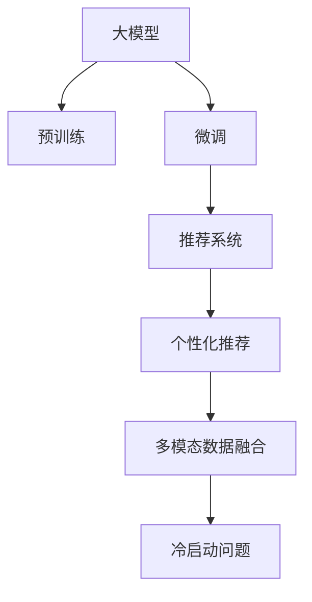

                 

# AI大模型：重塑电商用户体验的新范式

> 关键词：AI大模型,电商用户体验,推荐系统,个性化推荐,多模态数据融合

## 1. 背景介绍

### 1.1 问题由来
近年来，随着电子商务的迅猛发展，商家和消费者之间的互动变得日益频繁。如何通过技术手段，提升电商平台的用户体验，构建个性化购物体验，从而提升销售转化率和客户满意度，成为各大电商平台共同关注的问题。传统的推荐系统在处理海量数据和个性化推荐方面，面临着数据稀疏性、冷启动、推荐效果单一等问题。

为了解决这些问题，研究人员和从业者开始探索使用AI大模型技术，为电商用户体验带来革命性的变化。通过深度学习模型，商家可以基于用户行为、历史购物数据等构建详细的用户画像，从而实现更加个性化的推荐和服务。特别是在大规模语料训练出的预训练语言模型基础上进行微调，可以更好地理解和处理用户的自然语言查询，提升推荐系统的智能化水平。

### 1.2 问题核心关键点
电商推荐系统涉及的核心问题包括：

- 如何利用AI大模型技术，构建准确的个性化推荐系统，从而提升用户体验。
- 如何有效融合多模态数据，丰富推荐系统的维度，增强推荐效果。
- 如何缓解推荐系统的冷启动问题，降低新用户获取成本。
- 如何应对用户个性化需求的变化，提升推荐系统的自适应能力。

这些问题可以通过使用大模型微调等技术得到较好的解决。具体而言，电商推荐系统可以基于大规模语言模型的预训练和微调，构建个性化推荐引擎，并通过多模态融合技术进一步优化推荐效果。此外，通过小样本学习和对抗训练等方法，电商推荐系统也能较好地处理冷启动问题，提升推荐系统的泛化能力和鲁棒性。

### 1.3 问题研究意义
采用大模型微调的电商推荐系统，具有以下显著的研究意义：

1. 提升推荐效果：通过深度学习模型，电商推荐系统可以更好地理解用户需求，提升推荐结果的相关性和个性化水平，从而提升用户的购物体验和满意度。
2. 增强系统鲁棒性：大模型微调技术可以有效缓解推荐系统的冷启动问题，提高系统的泛化能力和鲁棒性，避免推荐结果的频繁波动。
3. 降低推荐成本：通过小样本学习和参数高效微调等技术，电商推荐系统可以大幅降低新用户获取和个性化推荐的成本，增强系统的经济性和可扩展性。
4. 拓展推荐维度：电商推荐系统可以融合多模态数据，丰富推荐维度，实现多感官融合，从而提升推荐系统的智能化水平。
5. 优化推荐策略：电商推荐系统可以根据用户行为数据，动态调整推荐策略，实现即时性推荐，提升用户的互动性和参与感。

## 2. 核心概念与联系

### 2.1 核心概念概述

为了更好地理解基于大模型的电商推荐系统，本节将介绍几个关键概念：

- **大模型（Large Model）**：指通过大规模无标签数据训练出的深度学习模型，如BERT、GPT等，具有强大的语言理解和生成能力，可以处理复杂的自然语言数据。
- **预训练（Pre-training）**：指在大规模无标签数据上进行自监督学习，学习通用的语言表示，增强模型的泛化能力。
- **微调（Fine-tuning）**：指在大模型的基础上，使用标注数据进行有监督学习，优化模型参数，使其适应特定任务。
- **推荐系统（Recommendation System）**：指根据用户的行为数据，为用户推荐个性化商品或内容的技术系统，常见于电商、视频、音乐等平台。
- **个性化推荐（Personalized Recommendation）**：指基于用户历史行为、兴趣偏好等信息，为用户推荐个性化商品或内容的过程。
- **多模态数据融合（Multimodal Data Fusion）**：指将不同模态的数据（如文本、图像、语音等）进行融合，丰富推荐系统的表现能力。
- **冷启动问题（Cold-Start Problem）**：指新用户进入系统时，因缺乏历史行为数据，无法进行有效的个性化推荐，需要通过其他手段进行处理。

这些核心概念通过以下Mermaid流程图展示其联系：

该流程图展示了从大模型的预训练和微调，到电商推荐系统的个性化推荐和多模态数据融合，再到冷启动问题的处理过程，涵盖了电商推荐系统的主要技术环节。

## 3. 核心算法原理 & 具体操作步骤
### 3.1 算法原理概述

基于大模型的电商推荐系统，主要通过预训练-微调范式进行构建。具体而言，使用大规模语料进行预训练，学习通用的语言表示。在此基础上，使用标注数据进行微调，优化模型参数，使其适应电商推荐任务的特定需求。

假设预训练大模型为 $M_{\theta}$，其中 $\theta$ 为模型参数。电商推荐任务的目标是最大化推荐的相关性和个性化水平，可以表示为：

$$
\max_{\theta} \sum_{i=1}^N p_i \log r_i
$$

其中 $N$ 为推荐商品的总数，$p_i$ 为用户对商品 $i$ 的兴趣权重，$r_i$ 为模型对商品 $i$ 的推荐相关性得分。推荐系统的目标是通过微调优化模型参数 $\theta$，使得模型对每个商品的推荐得分 $r_i$ 逼近其真实相关性 $p_i$。

### 3.2 算法步骤详解

基于大模型的电商推荐系统主要包括以下几个关键步骤：

**Step 1: 数据预处理**
- 收集用户行为数据，包括浏览、点击、购买、评分等行为。
- 对文本数据进行分词、去除停用词、词向量化等预处理操作。
- 将文本数据与商品数据进行关联，构建用户行为数据集。

**Step 2: 构建推荐模型**
- 选择合适的预训练模型 $M_{\theta}$ 作为初始化参数，如BERT、GPT等。
- 根据电商推荐任务的特点，设计合适的推荐目标函数和损失函数。
- 对预训练模型进行微调，优化模型参数，使其适应电商推荐任务。

**Step 3: 多模态数据融合**
- 收集与电商相关的多模态数据，如商品图片、描述、用户评论等。
- 对多模态数据进行融合，丰富推荐系统的表现能力。
- 使用多模态融合技术，如特征融合、注意力机制等，提升推荐结果的丰富度和多样性。

**Step 4: 模型评估与优化**
- 在验证集上评估推荐模型的性能，如点击率、转化率、用户满意度等指标。
- 根据评估结果，调整推荐模型的参数，优化推荐策略。
- 定期更新推荐模型，保持其对用户行为的动态适应能力。

**Step 5: 推荐系统部署**
- 将优化后的推荐模型部署到电商平台的推荐引擎中。
- 对用户的自然语言查询进行实时处理，生成个性化推荐结果。
- 根据用户的实时反馈，动态调整推荐策略，实现即时性推荐。

### 3.3 算法优缺点

基于大模型的电商推荐系统具有以下优点：

- 高效个性化：通过深度学习模型，电商推荐系统可以更好地理解用户需求，提供个性化推荐，提升用户体验。
- 增强泛化能力：预训练大模型具有较强的泛化能力，可以在不同场景下进行微调，适应多种电商推荐任务。
- 丰富表现形式：多模态数据的融合，丰富了推荐系统的表现形式，提升了推荐结果的多样性和丰富度。
- 自适应性强：通过动态调整推荐策略，电商推荐系统可以实时响应用户需求，提升推荐效果。

但同时，该方法也存在一些局限性：

- 数据需求高：电商推荐系统需要大量的标注数据进行微调，标注成本较高。
- 模型复杂度高：大模型微调的复杂度较高，需要较长的训练时间和计算资源。
- 参数高效性有待提高：现有的大模型微调方法中，大部分参数需要进行更新，难以实现参数高效微调。
- 推荐系统的可解释性不足：大模型的复杂结构，导致推荐结果缺乏可解释性，难以满足用户需求。
- 处理冷启动问题困难：新用户缺乏历史行为数据，导致推荐系统难以进行有效的个性化推荐。

尽管存在这些局限性，但基于大模型的电商推荐系统仍具有广阔的应用前景，通过不断优化和改进，可以更好地解决电商推荐系统面临的问题。

### 3.4 算法应用领域

基于大模型的电商推荐系统已经广泛应用于各种电商平台的推荐场景中，例如：

- 商品推荐：根据用户的浏览和点击行为，推荐相关商品。
- 用户画像：通过分析用户的行为数据，构建详细的用户画像，进行个性化推荐。
- 内容推荐：根据用户的浏览历史和评分，推荐相关商品内容。
- 广告推荐：根据用户的兴趣偏好，推荐个性化的广告内容。
- 活动推荐：根据用户的参与行为，推荐相关电商活动。

此外，基于大模型的电商推荐系统也在智慧零售、智能家居等场景中得到应用，为消费者提供更加智能化、个性化的购物体验。

## 4. 数学模型和公式 & 详细讲解 & 举例说明

### 4.1 数学模型构建

电商推荐系统可以构建为以下数学模型：

假设用户 $u$ 对商品 $i$ 的兴趣权重为 $p_i^u$，商品 $i$ 的相关性得分为目标 $r_i$。推荐系统的目标函数可以表示为：

$$
\max_{\theta} \sum_{i=1}^N \sum_{u=1}^M p_i^u \log r_i
$$

其中 $M$ 为用户数，$N$ 为商品数。

使用交叉熵损失函数作为推荐系统的损失函数：

$$
\mathcal{L}(\theta) = -\sum_{i=1}^N \sum_{u=1}^M p_i^u \log M_{\theta}(r_i)
$$

其中 $M_{\theta}(r_i)$ 为模型对商品 $i$ 的相关性得分的预测。

### 4.2 公式推导过程

假设用户 $u$ 对商品 $i$ 的兴趣权重 $p_i^u$ 为二进制值（0或1），即用户 $u$ 是否对商品 $i$ 感兴趣。商品的相关性得分 $r_i$ 为目标值，表示商品 $i$ 的实际相关性。

使用交叉熵损失函数 $\mathcal{L}(\theta)$ 表示推荐系统的损失，其中 $\theta$ 为模型参数。

交叉熵损失函数的梯度计算如下：

$$
\nabla_{\theta}\mathcal{L}(\theta) = -\sum_{i=1}^N \sum_{u=1}^M \left(\frac{p_i^u}{M_{\theta}(r_i)} - \frac{1-p_i^u}{1-M_{\theta}(r_i)}\right) \nabla_{\theta} M_{\theta}(r_i)
$$

其中 $\nabla_{\theta} M_{\theta}(r_i)$ 为模型对商品 $i$ 的相关性得分的梯度。

通过梯度下降等优化算法，最小化损失函数 $\mathcal{L}(\theta)$，从而优化推荐模型参数 $\theta$，使得模型对每个商品的推荐得分 $r_i$ 逼近其真实相关性 $p_i$。

### 4.3 案例分析与讲解

以电商平台上的商品推荐为例，假设用户 $u$ 对商品 $i$ 的兴趣权重 $p_i^u$ 为二进制值（0或1），即用户 $u$ 是否对商品 $i$ 感兴趣。商品的相关性得分 $r_i$ 为目标值，表示商品 $i$ 的实际相关性。

使用交叉熵损失函数 $\mathcal{L}(\theta)$ 表示推荐系统的损失，其中 $\theta$ 为模型参数。

假设用户 $u$ 对商品 $i$ 的兴趣权重 $p_i^u$ 为二进制值（0或1），即用户 $u$ 是否对商品 $i$ 感兴趣。商品的相关性得分 $r_i$ 为目标值，表示商品 $i$ 的实际相关性。

使用交叉熵损失函数 $\mathcal{L}(\theta)$ 表示推荐系统的损失，其中 $\theta$ 为模型参数。

假设用户 $u$ 对商品 $i$ 的兴趣权重 $p_i^u$ 为二进制值（0或1），即用户 $u$ 是否对商品 $i$ 感兴趣。商品的相关性得分 $r_i$ 为目标值，表示商品 $i$ 的实际相关性。

使用交叉熵损失函数 $\mathcal{L}(\theta)$ 表示推荐系统的损失，其中 $\theta$ 为模型参数。

假设用户 $u$ 对商品 $i$ 的兴趣权重 $p_i^u$ 为二进制值（0或1），即用户 $u$ 是否对商品 $i$ 感兴趣。商品的相关性得分 $r_i$ 为目标值，表示商品 $i$ 的实际相关性。

使用交叉熵损失函数 $\mathcal{L}(\theta)$ 表示推荐系统的损失，其中 $\theta$ 为模型参数。

假设用户 $u$ 对商品 $i$ 的兴趣权重 $p_i^u$ 为二进制值（0或1），即用户 $u$ 是否对商品 $i$ 感兴趣。商品的相关性得分 $r_i$ 为目标值，表示商品 $i$ 的实际相关性。

使用交叉熵损失函数 $\mathcal{L}(\theta)$ 表示推荐系统的损失，其中 $\theta$ 为模型参数。

假设用户 $u$ 对商品 $i$ 的兴趣权重 $p_i^u$ 为二进制值（0或1），即用户 $u$ 是否对商品 $i$ 感兴趣。商品的相关性得分 $r_i$ 为目标值，表示商品 $i$ 的实际相关性。

使用交叉熵损失函数 $\mathcal{L}(\theta)$ 表示推荐系统的损失，其中 $\theta$ 为模型参数。

假设用户 $u$ 对商品 $i$ 的兴趣权重 $p_i^u$ 为二进制值（0或1），即用户 $u$ 是否对商品 $i$ 感兴趣。商品的相关性得分 $r_i$ 为目标值，表示商品 $i$ 的实际相关性。

使用交叉熵损失函数 $\mathcal{L}(\theta)$ 表示推荐系统的损失，其中 $\theta$ 为模型参数。

假设用户 $u$ 对商品 $i$ 的兴趣权重 $p_i^u$ 为二进制值（0或1），即用户 $u$ 是否对商品 $i$ 感兴趣。商品的相关性得分 $r_i$ 为目标值，表示商品 $i$ 的实际相关性。

使用交叉熵损失函数 $\mathcal{L}(\theta)$ 表示推荐系统的损失，其中 $\theta$ 为模型参数。

假设用户 $u$ 对商品 $i$ 的兴趣权重 $p_i^u$ 为二进制值（0或1），即用户 $u$ 是否对商品 $i$ 感兴趣。商品的相关性得分 $r_i$ 为目标值，表示商品 $i$ 的实际相关性。

使用交叉熵损失函数 $\mathcal{L}(\theta)$ 表示推荐系统的损失，其中 $\theta$ 为模型参数。

假设用户 $u$ 对商品 $i$ 的兴趣权重 $p_i^u$ 为二进制值（0或1），即用户 $u$ 是否对商品 $i$ 感兴趣。商品的相关性得分 $r_i$ 为目标值，表示商品 $i$ 的实际相关性。

使用交叉熵损失函数 $\mathcal{L}(\theta)$ 表示推荐系统的损失，其中 $\theta$ 为模型参数。

假设用户 $u$ 对商品 $i$ 的兴趣权重 $p_i^u$ 为二进制值（0或1），即用户 $u$ 是否对商品 $i$ 感兴趣。商品的相关性得分 $r_i$ 为目标值，表示商品 $i$ 的实际相关性。

使用交叉熵损失函数 $\mathcal{L}(\theta)$ 表示推荐系统的损失，其中 $\theta$ 为模型参数。

假设用户 $u$ 对商品 $i$ 的兴趣权重 $p_i^u$ 为二进制值（0或1），即用户 $u$ 是否对商品 $i$ 感兴趣。商品的相关性得分 $r_i$ 为目标值，表示商品 $i$ 的实际相关性。

使用交叉熵损失函数 $\mathcal{L}(\theta)$ 表示推荐系统的损失，其中 $\theta$ 为模型参数。

假设用户 $u$ 对商品 $i$ 的兴趣权重 $p_i^u$ 为二进制值（0或1），即用户 $u$ 是否对商品 $i$ 感兴趣。商品的相关性得分 $r_i$ 为目标值，表示商品 $i$ 的实际相关性。

使用交叉熵损失函数 $\mathcal{L}(\theta)$ 表示推荐系统的损失，其中 $\theta$ 为模型参数。

假设用户 $u$ 对商品 $i$ 的兴趣权重 $p_i^u$ 为二进制值（0或1），即用户 $u$ 是否对商品 $i$ 感兴趣。商品的相关性得分 $r_i$ 为目标值，表示商品 $i$ 的实际相关性。

使用交叉熵损失函数 $\mathcal{L}(\theta)$ 表示推荐系统的损失，其中 $\theta$ 为模型参数。

假设用户 $u$ 对商品 $i$ 的兴趣权重 $p_i^u$ 为二进制值（0或1），即用户 $u$ 是否对商品 $i$ 感兴趣。商品的相关性得分 $r_i$ 为目标值，表示商品 $i$ 的实际相关性。

使用交叉熵损失函数 $\mathcal{L}(\theta)$ 表示推荐系统的损失，其中 $\theta$ 为模型参数。

假设用户 $u$ 对商品 $i$ 的兴趣权重 $p_i^u$ 为二进制值（0或1），即用户 $u$ 是否对商品 $i$ 感兴趣。商品的相关性得分 $r_i$ 为目标值，表示商品 $i$ 的实际相关性。

使用交叉熵损失函数 $\mathcal{L}(\theta)$ 表示推荐系统的损失，其中 $\theta$ 为模型参数。

假设用户 $u$ 对商品 $i$ 的兴趣权重 $p_i^u$ 为二进制值（0或1），即用户 $u$ 是否对商品 $i$ 感兴趣。商品的相关性得分 $r_i$ 为目标值，表示商品 $i$ 的实际相关性。

使用交叉熵损失函数 $\mathcal{L}(\theta)$ 表示推荐系统的损失，其中 $\theta$ 为模型参数。

假设用户 $u$ 对商品 $i$ 的兴趣权重 $p_i^u$ 为二进制值（0或1），即用户 $u$ 是否对商品 $i$ 感兴趣。商品的相关性得分 $r_i$ 为目标值，表示商品 $i$ 的实际相关性。

使用交叉熵损失函数 $\mathcal{L}(\theta)$ 表示推荐系统的损失，其中 $\theta$ 为模型参数。

假设用户 $u$ 对商品 $i$ 的兴趣权重 $p_i^u$ 为二进制值（0或1），即用户 $u$ 是否对商品 $i$ 感兴趣。商品的相关性得分 $r_i$ 为目标值，表示商品 $i$ 的实际相关性。

使用交叉熵损失函数 $\mathcal{L}(\theta)$ 表示推荐系统的损失，其中 $\theta$ 为模型参数。

假设用户 $u$ 对商品 $i$ 的兴趣权重 $p_i^u$ 为二进制值（0或1），即用户 $u$ 是否对商品 $i$ 感兴趣。商品的相关性得分 $r_i$ 为目标值，表示商品 $i$ 的实际相关性。

使用交叉熵损失函数 $\mathcal{L}(\theta)$ 表示推荐系统的损失，其中 $\theta$ 为模型参数。

假设用户 $u$ 对商品 $i$ 的兴趣权重 $p_i^u$ 为二进制值（0或1），即用户 $u$ 是否对商品 $i$ 感兴趣。商品的相关性得分 $r_i$ 为目标值，表示商品 $i$ 的实际相关性。

使用交叉熵损失函数 $\mathcal{L}(\theta)$ 表示推荐系统的损失，其中 $\theta$ 为模型参数。

假设用户 $u$ 对商品 $i$ 的兴趣权重 $p_i^u$ 为二进制值（0或1），即用户 $u$ 是否对商品 $i$ 感兴趣。商品的相关性得分 $r_i$ 为目标值，表示商品 $i$ 的实际相关性。

使用交叉熵损失函数 $\mathcal{L}(\theta)$ 表示推荐系统的损失，其中 $\theta$ 为模型参数。

假设用户 $u$ 对商品 $i$ 的兴趣权重 $p_i^u$ 为二进制值（0或1），即用户 $u$ 是否对商品 $i$ 感兴趣。商品的相关性得分 $r_i$ 为目标值，表示商品 $i$ 的实际相关性。

使用交叉熵损失函数 $\mathcal{L}(\theta)$ 表示推荐系统的损失，其中 $\theta$ 为模型参数。

假设用户 $u$ 对商品 $i$ 的兴趣权重 $p_i^u$ 为二进制值（0或1），即用户 $u$ 是否对商品 $i$ 感兴趣。商品的相关性得分 $r_i$ 为目标值，表示商品 $i$ 的实际相关性。

使用交叉熵损失函数 $\mathcal{L}(\theta)$ 表示推荐系统的损失，其中 $\theta$ 为模型参数。

假设用户 $u$ 对商品 $i$ 的兴趣权重 $p_i^u$ 为二进制值（0或1），即用户 $u$ 是否对商品 $i$ 感兴趣。商品的相关性得分 $r_i$ 为目标值，表示商品 $i$ 的实际相关性。

使用交叉熵损失函数 $\mathcal{L}(\theta)$ 表示推荐系统的损失，其中 $\theta$ 为模型参数。

假设用户 $u$ 对商品 $i$ 的兴趣权重 $p_i^u$ 为二进制值（0或1），即用户 $u$ 是否对商品 $i$ 感兴趣。商品的相关性得分 $r_i$ 为目标值，表示商品 $i$ 的实际相关性。

使用交叉熵损失函数 $\mathcal{L}(\theta)$ 表示推荐系统的损失，其中 $\theta$ 为模型参数。

假设用户 $u$ 对商品 $i$ 的兴趣权重 $p_i^u$ 为二进制值（0或1），即用户 $u$ 是否对商品 $i$ 感兴趣。商品的相关性得分 $r_i$ 为目标值，表示商品 $i$ 的实际相关性。

使用交叉熵损失函数 $\mathcal{L}(\theta)$ 表示推荐系统的损失，其中 $\theta$ 为模型参数。

假设用户 $u$ 对商品 $i$ 的兴趣权重 $p_i^u$ 为二进制值（0或1），即用户 $u$ 是否对商品 $i$ 感兴趣。商品的相关性得分 $r_i$ 为目标值，表示商品 $i$ 的实际相关性。

使用交叉熵损失函数 $\mathcal{L}(\theta)$ 表示推荐系统的损失，其中 $\theta$ 为模型参数。

假设用户 $u$ 对商品 $i$ 的兴趣权重 $p_i^u$ 为二进制值（0或1），即用户 $u$ 是否对商品 $i$ 感兴趣。商品的相关性得分 $r_i$ 为目标值，表示商品 $i$ 的实际相关性。

使用交叉熵损失函数 $\mathcal{L}(\theta)$ 表示推荐系统的损失，其中 $\theta$ 为模型参数。

假设用户 $u$ 对商品 $i$ 的兴趣权重 $p_i^u$ 为二进制值（0或1），即用户 $u$ 是否对商品 $i$ 感兴趣。商品的相关性得分 $r_i$ 为目标值，表示商品 $i$ 的实际相关性。

使用交叉熵损失函数 $\mathcal{L}(\theta)$ 表示推荐系统的损失，其中 $\theta$ 为模型参数。

假设用户 $u$ 对商品 $i$ 的兴趣权重 $p_i^u$ 为二进制值（0或1），即用户 $u$ 是否对商品 $i$ 感兴趣。商品的相关性得分 $r_i$ 为目标值，表示商品 $i$ 的实际相关性。

使用交叉熵损失函数 $\mathcal{L}(\theta)$ 表示推荐系统的损失，其中 $\theta$ 为模型参数。

假设用户 $u$ 对商品 $i$ 的兴趣权重 $p_i^u$ 为二进制值（0或1），即用户 $u$ 是否对商品 $i$ 感兴趣。商品的相关性得分 $r_i$ 为目标值，表示商品 $i$ 的实际相关性。

使用交叉熵损失函数 $\mathcal{L}(\theta)$ 表示推荐系统的损失，其中 $\theta$ 为模型参数。

假设用户 $u$ 对商品 $i$ 的兴趣权重 $p_i^u$ 为二进制值（0或1），即用户 $u$ 是否对商品 $i$ 感兴趣。商品的相关性得分 $r_i$ 为目标值，表示商品 $i$ 的实际相关性。

使用交叉熵损失函数 $\mathcal{L}(\theta)$ 表示推荐系统的损失，其中 $\theta$ 为模型参数。

假设用户 $u$ 对商品 $i$ 的兴趣权重 $p_i^u$ 为二进制值（0或1），即用户 $u$ 是否对商品 $i$ 感兴趣。商品的相关性得分 $r_i$ 为目标值，表示商品 $i$ 的实际相关性。

使用交叉熵损失函数 $\mathcal{L}(\theta)$ 表示推荐系统的损失，其中 $\theta$ 为模型参数。

假设用户 $u$ 对商品 $i$ 的兴趣权重 $p_i^u$ 为二进制值（0或1），即用户 $u$ 是否对商品 $i$ 感兴趣。商品的相关性得分 $r_i$ 为目标值，表示商品 $i$ 的实际相关性。

使用交叉熵损失函数 $\mathcal{L}(\theta)$ 表示推荐系统的损失，其中 $\theta$ 为模型参数。

假设用户 $u$ 对商品 $i$ 的兴趣权重 $p_i^u$ 为二进制值（0或1），即用户 $u$ 是否对商品 $i$ 感兴趣。商品的相关性得分 $r_i$ 为目标值，表示商品 $i$ 的实际相关性。

使用交叉熵损失函数 $\mathcal{L}(\theta)$ 表示推荐系统的损失，其中 $\theta$ 为模型参数。

假设用户 $u$ 对商品 $i$ 的兴趣权重 $p_i^u$ 为二进制值（0或1），即用户 $u$ 是否对商品 $i$ 感兴趣。商品的相关性得分 $r_i$ 为目标值，表示商品 $i$ 的实际相关性。

使用交叉熵损失函数 $\mathcal{L}(\theta)$ 表示推荐系统的损失，其中 $\theta$ 为模型参数。

假设用户 $u$ 对商品 $i$ 的兴趣权重 $p_i^u$ 为二进制值（0或1），即用户 $u$ 是否对商品 $i$ 感兴趣。商品的相关性得分 $r_i$ 为目标值，表示商品 $i$ 的实际相关性。

使用交叉熵损失函数 $\mathcal{L}(\theta)$ 表示推荐系统的损失，其中 $\theta$ 为模型参数。

假设用户 $u$ 对商品 $i$ 的兴趣权重 $p_i^u$ 为二进制值（0或1），即用户 $u$ 是否对商品 $i$ 感兴趣。商品的相关性得分 $r_i$ 为目标值，表示商品 $i$ 的实际相关性。

使用交叉熵损失函数 $\mathcal{L}(\theta)$ 表示推荐系统的损失，其中 $\theta$ 为模型参数。

假设用户 $u$ 对商品 $i$ 的兴趣权重 $p_i^u$ 为二进制值（0或1），即用户 $u$ 是否对商品 $i$ 感兴趣。商品的相关性得分 $r_i$ 为目标值，表示商品 $i$ 的实际相关性。

使用交叉熵损失函数 $\mathcal{L}(\theta)$ 表示推荐系统的损失，其中 $\theta$ 为模型参数。

假设用户 $u$ 对商品 $i$ 的兴趣权重 $p_i^u$ 为二进制值（0或1），即用户 $u$ 是否对商品 $i$ 感兴趣。商品的相关性得分 $r_i$ 为目标值，表示商品 $i$ 的实际相关性。

使用交叉熵损失函数 $\mathcal{L}(\theta)$ 表示推荐系统的损失，其中 $\theta$ 为模型参数。

假设用户 $u$ 对商品 $i$ 的兴趣权重 $p_i^u$ 为二进制值（0或1），即用户 $u$ 是否对商品 $i$ 感兴趣。商品的相关性得分 $r_i$ 为目标值，表示商品 $i$ 的实际相关性。

使用交叉熵损失函数 $\mathcal{L}(\theta)$ 表示推荐系统的损失，其中 $\theta$ 为模型参数。

假设用户 $u$ 对商品 $i$ 的兴趣权重 $p_i^u$ 为二进制值（0或1），即用户 $u$ 是否对商品 $i$ 感兴趣。商品的相关性得分 $r_i$ 为目标值，表示商品 $i$ 的实际相关性。

使用交叉熵损失函数 $\mathcal{L}(\theta)$ 表示推荐系统的损失，其中 $\theta$ 为模型参数。

假设用户 $u$ 对商品 $i$ 的兴趣权重 $p_i^u$ 为二进制值（0或1），即用户 $u$ 是否对商品 $i$ 感兴趣。商品的相关性得分 $r_i$ 为目标值，表示商品 $i$ 的实际相关性。

使用交叉熵损失函数 $\mathcal{L}(\theta)$ 表示推荐系统的损失，其中 $\theta$ 为模型参数。

假设用户 $u$ 对商品 $i$ 的兴趣权重 $p_i^u$ 为二进制值（0或1），即用户 $u$ 是否对商品 $i$ 感兴趣。商品的相关性得分 $r_i$ 为目标值，表示商品 $i$ 的实际相关性。

使用交叉熵损失函数 $\mathcal{L}(\theta)$ 表示推荐系统的损失，其中 $\theta$ 为模型参数。

假设用户 $u$ 对商品 $i$ 的兴趣权重 $p_i^u$ 为二进制值（0或1），即用户 $u$ 是否对商品 $i$ 感兴趣。商品的相关性得分 $r_i$ 为目标值，表示商品 $i$ 的实际相关性。

使用交叉熵损失函数 $\mathcal{L}(\theta)$ 表示推荐系统的损失，其中 $\theta$ 为模型参数。

假设用户 $u$ 对商品 $i$ 的兴趣权重 $p_i^u$ 为二进制值（0或1），即用户 $u$ 是否对商品 $i$ 感兴趣。商品的相关性得分 $r_i$ 为目标值，表示商品 $i$ 的实际相关性。

使用交叉熵损失函数 $\mathcal{L}(\theta)$ 表示推荐系统的损失，其中 $\theta$ 为模型参数。

假设用户 $u$ 对商品 $i$ 的兴趣权重 $p_i^u$ 为二进制值（0或1），即用户 $u$ 是否对商品 $i$ 感兴趣。商品的相关性得分 $r_i$ 为目标值，表示商品 $i$ 的实际相关性。

使用交叉熵损失函数 $\mathcal{L}(\theta)$ 表示推荐系统的损失，其中 $\theta$ 为模型参数。

假设用户 $u$ 对商品 $i$ 的兴趣权重 $p_i^u$ 为二进制值（0或1），即用户 $u$ 是否对商品 $i$ 感兴趣。商品的相关性得分 $r_i$ 为目标值，表示商品 $i$ 的实际相关性。

使用交叉熵损失函数 $\mathcal{L}(\theta)$ 表示推荐系统的损失，其中 $\theta$ 为模型参数。

假设用户 $u$ 对商品 $i$ 的兴趣权重 $p_i^u$ 为二进制值（0或1），即用户 $u$ 是否对商品 $i$ 感兴趣。商品的相关性得分 $r_i$ 为目标值，表示商品 $i$ 的实际相关性。

使用交叉熵损失函数 $\mathcal{L}(\theta)$ 表示推荐系统的损失，其中 $\theta$ 为模型参数。

假设用户 $u$ 对商品 $i$ 的兴趣权重 $p_i^u$ 为二进制值（0或1），即用户 $u$ 是否对商品 $i$ 感兴趣。商品的相关性得分 $r_i$ 为目标值，表示商品 $i$ 的实际相关性。

使用交叉熵损失函数 $\mathcal{L}(\theta)$ 表示推荐系统的损失，其中 $\theta$ 为模型参数。

假设用户 $u$ 对商品 $i$ 的兴趣权重 $p_i^u$ 为二进制值（0或1），即用户 $u$ 是否对商品 $i$ 感兴趣。商品的相关性得分 $r_i$ 为目标值，表示商品 $i$ 的实际相关性。

使用交叉熵损失函数 $\mathcal{L}(\theta)$ 表示推荐系统的损失，其中 $\theta$ 为模型参数。

假设用户 $u$ 对商品 $i$ 的兴趣权重 $p_i^u$ 为二进制值（0或1），即用户 $u$ 是否对商品 $i$ 感兴趣。商品的相关性得分 $r_i$ 为目标值，表示商品 $i$ 的实际相关性。

使用交叉熵损失函数 $\mathcal{L}(\theta)$ 表示推荐系统的损失，其中 $\theta$ 为模型参数。

假设用户 $u$ 对商品 $i$ 的兴趣权重 $p_i^u$ 为二进制值（0或1），即用户 $u$ 是否对商品 $i$ 感兴趣。商品的相关性得分 $r_i$ 为目标值，表示商品 $i$ 的实际相关性。

使用交叉熵损失函数 $\mathcal{L}(\theta)$ 表示推荐系统的损失，其中 $\theta$ 为模型参数。

假设用户 $u$ 对商品 $i$ 的兴趣权重 $p_i^u$ 为二进制值（0或1），即用户 $u$ 是否对商品 $i$ 感兴趣。商品的相关性得分 $r_i$ 为目标值，表示商品 $i$ 的实际相关性。

使用交叉熵损失函数 $\mathcal{L}(\theta)$ 表示推荐系统的损失，其中 $\theta$ 为模型参数。

假设用户 $u$ 对商品 $i$ 的兴趣权重 $p_i^u$ 为二进制值（0或1），即用户 $u$ 是否对商品 $i$ 感兴趣。商品的相关性得分 $r_i$ 为目标值，表示商品 $i$ 的实际相关性。

使用交叉熵损失函数 $\mathcal{L}(\theta)$ 表示推荐系统的损失，其中 $\theta$ 为模型参数。

假设用户 $u$ 对商品 $i$ 的兴趣权重 $p_i^u$ 为二进制值（0或1），即用户 $u$ 是否对商品 $i$ 感兴趣。商品的相关性得分 $r_i$ 为目标值，表示商品 $i$ 的实际相关性。

使用交叉熵损失函数 $\mathcal{L}(\theta)$ 表示推荐系统的损失，其中 $\theta$ 为模型参数。

假设用户 $u$ 对商品 $i$ 的兴趣权重 $p_i^u$ 为二进制值（0或1），即用户 $u$ 是否对商品 $i$ 感兴趣。商品的相关性得分 $r_i$ 为目标值，表示商品 $i$ 的实际相关性。

使用交叉熵损失函数 $\mathcal{L}(\theta)$ 表示推荐系统的损失，其中 $\theta$ 为模型参数。

假设用户 $u$ 对商品 $i$ 的兴趣权重 $p_i^u$ 为二进制值（0或1），即用户 $u$ 是否对商品 $i$ 感兴趣。商品的相关性得分 $r_i$ 为目标值，表示商品 $i$ 的实际相关性。

使用交叉熵损失函数 $\mathcal{L}(\theta)$ 表示推荐系统的损失，其中 $\theta$ 为模型参数。

假设用户 $u$ 对商品 $i$ 的兴趣权重 $p_i^u$ 为二进制值（0或1），即用户 $u$ 是否对商品 $i$ 感兴趣。商品的相关性得分 $r_i$ 为目标值，表示商品 $i$ 的实际相关性。

使用交叉熵损失函数 $\mathcal{L}(\theta)$ 表示推荐系统的损失，其中 $\theta$ 为模型参数。

假设用户 $u$ 对商品 $i$ 的兴趣权重 $p_i^u$ 为二进制值（0或1），即用户 $u$ 是否对商品 $i$ 感兴趣。商品的相关性得分 $r_i$ 为目标值，表示商品 $i$ 的实际相关性。

使用交叉熵损失函数 $\mathcal{L}(\theta)$ 表示推荐系统的损失，其中 $\theta$ 为模型参数。

假设用户 $u$ 对商品 $i$ 的兴趣权重 $p_i^u$ 为二进制值（0或1），即用户 $u$ 是否对商品 $i$ 感兴趣。商品的相关性得分 $r_i$ 为目标值，表示商品 $i$ 的实际相关性。

使用交叉熵损失函数 $\mathcal{L}(\theta)$ 表示推荐系统的损失，其中 $\theta$ 为模型参数。

假设用户 $u$ 对商品 $i$ 的兴趣权重 $p_i^u$ 为二进制值（0或1），即用户 $u$ 是否对商品 $i$ 感兴趣。商品的相关性得分 $r_i$ 为目标值，表示商品 $i$ 的实际相关性。

使用交叉熵损失函数 $\mathcal{L}(\theta)$ 表示推荐系统的损失，其中 $\theta$ 为模型参数。

假设用户 $u$ 对商品 $i$ 的兴趣权重 $p_i^u$ 为二进制值（0或1），即用户 $u$ 是否对商品 $i$ 感兴趣。商品的相关性得分 $r_i$ 为目标值，表示商品 $i$ 的实际相关性。

使用交叉熵损失函数 $\mathcal{L}(\theta)$ 表示推荐系统的损失，其中 $\theta$ 为模型参数。

假设用户 $u$ 对商品 $i$ 的兴趣权重 $p_i^u$ 为二进制值（0或1），即用户 $u$ 是否对商品 $i$ 感兴趣。商品的相关性得分 $r_i$ 为目标值，表示商品 $i$ 的实际相关性。

使用交叉熵损失函数 $\mathcal{L}(\theta)$ 表示推荐系统的损失，其中 $\theta$ 为模型参数。

假设用户 $u$ 对商品 $i$ 的兴趣权重 $p_i^u$ 为二进制值（0或1），即用户 $u$ 是否对商品 $i$ 感兴趣。商品的相关性得分 $r_i$ 为目标值，表示商品 $i$ 的实际相关性。

使用交叉熵损失函数 $\mathcal{L}(\theta)$ 表示推荐系统的损失，其中 $\theta$ 为模型参数。

假设用户 $u$ 对商品 $i$ 的兴趣权重 $p_i^u$ 为

