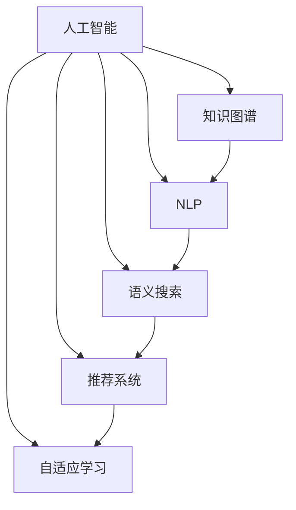

                 

# AI如何助力人类知识增长

> 关键词：人工智能(AI), 知识增长, 知识图谱, 自然语言处理(NLP), 语义搜索, 推荐系统, 自适应学习, 自动化

## 1. 背景介绍

### 1.1 问题由来
随着信息技术的发展，人类获取知识的方式发生了根本性变化。传统通过书籍、期刊等纸质媒体获取知识的方式，已逐渐被互联网、社交媒体等数字媒体所取代。数字媒体提供了海量的信息源和便捷的检索手段，但同时也带来了知识海洋中的信息过载和筛选难题。如何在纷繁复杂的信息中快速准确地找到有用的知识，成为一个新的挑战。

### 1.2 问题核心关键点
1. **信息过载**：互联网时代，信息量呈爆炸式增长，如何在海量信息中高效获取有用的知识，是一个关键问题。
2. **知识组织**：现有的知识以碎片化、结构化程度不高的形式存在，缺乏系统化的组织和关联。
3. **智能推荐**：如何根据用户的行为和兴趣，智能推荐相关知识，提高知识获取的效率和精准度。
4. **自适应学习**：如何根据用户的学习进度和反馈，动态调整学习内容和方法，提升学习效果。

### 1.3 问题研究意义
研究AI如何助力人类知识增长，对于推动知识共享、促进教育公平、加速科技进步具有重要意义：

1. **知识共享**：通过AI技术，可以将零散的、难以检索的知识整合，转化为系统化的知识体系，便于人们获取和使用。
2. **教育公平**：AI可以提供个性化、灵活的学习方案，适应不同背景和能力的学生，促进教育公平。
3. **科技进步**：通过AI技术，加速知识的传播和创新，促进各学科的交叉融合，推动科技发展。

## 2. 核心概念与联系

### 2.1 核心概念概述

为更好地理解AI如何助力人类知识增长，本节将介绍几个密切相关的核心概念：

- **人工智能(AI)**：通过机器学习、深度学习等技术，使机器能够模拟人的智能行为，包括感知、理解、推理、决策等。
- **知识图谱(Knowledge Graph)**：将知识表示为图结构，通过节点和边来描述实体和实体之间的关系，支持语义搜索和知识推理。
- **自然语言处理(NLP)**：使机器能够理解、处理和生成自然语言，包括文本分类、信息抽取、机器翻译等。
- **语义搜索(Semantic Search)**：通过理解文本语义，实现更精准的信息检索和推荐。
- **推荐系统(Recommendation System)**：根据用户的历史行为和偏好，推荐相关内容，提升用户体验。
- **自适应学习(Adaptive Learning)**：通过学习用户的反馈，动态调整学习内容和方法，优化学习效果。

这些核心概念之间的逻辑关系可以通过以下Mermaid流程图来展示：



这个流程图展示了大语言模型的核心概念及其之间的关系：

1. 人工智能通过处理自然语言和知识图谱，实现了语义理解和知识推理。
2. NLP提供了文本处理和理解的基础，为语义搜索和推荐系统提供支持。
3. 语义搜索通过理解文本语义，实现更精准的信息检索。
4. 推荐系统根据用户行为和兴趣，智能推荐相关内容。
5. 自适应学习根据用户反馈，动态调整学习内容和策略，提升学习效果。

这些概念共同构成了AI助力知识增长的技术框架，使得机器能够更好地理解和处理知识，并为用户提供个性化的知识服务。

## 3. 核心算法原理 & 具体操作步骤

### 3.1 算法原理概述

AI助力人类知识增长，主要通过以下几类核心算法实现：

- **知识图谱构建**：通过实体识别、关系抽取等技术，将知识结构化表示为图谱。
- **语义搜索技术**：利用自然语言处理和知识图谱，实现语义级别的信息检索。
- **推荐系统算法**：根据用户行为和兴趣，生成个性化推荐内容。
- **自适应学习模型**：通过机器学习算法，动态调整学习内容和方法。

这些算法共同构建了AI助力知识增长的技术体系，通过理解和组织知识，智能推荐内容，提升用户的学习和获取效率。

### 3.2 算法步骤详解

AI助力人类知识增长的实现过程，包括以下几个关键步骤：

**Step 1: 数据采集与预处理**
- 收集相关领域的文本数据、实体数据、关系数据等。
- 进行数据清洗、去重、标注等预处理，构建完整的数据集。

**Step 2: 知识图谱构建**
- 使用实体识别和关系抽取技术，构建领域知识图谱。
- 对知识图谱进行结构化和验证，确保其准确性和完备性。

**Step 3: 语义搜索技术开发**
- 构建词汇表和词向量模型，实现自然语言处理。
- 利用知识图谱进行语义理解和推理，实现语义搜索。
- 设计搜索算法，如基于向量空间的相似度计算，提高搜索效率。

**Step 4: 推荐系统开发**
- 收集用户的历史行为数据，构建用户画像。
- 设计推荐算法，如协同过滤、内容推荐等，生成个性化推荐内容。
- 优化推荐算法，确保推荐内容的相关性和多样性。

**Step 5: 自适应学习模型构建**
- 收集用户的学习进度和反馈数据。
- 设计自适应学习算法，如强化学习、深度学习等，动态调整学习内容和方法。
- 根据用户反馈不断优化模型，提升学习效果。

### 3.3 算法优缺点

AI助力人类知识增长的算法具有以下优点：
1. **高效检索**：通过语义搜索技术，可以快速准确地找到相关知识。
2. **个性化推荐**：通过推荐系统，用户能够获取到符合自己兴趣的知识内容。
3. **动态调整**：通过自适应学习模型，可以动态调整学习策略，提升学习效果。
4. **跨领域融合**：可以跨领域整合知识，提供更全面的知识服务。

同时，这些算法也存在一定的局限性：
1. **数据依赖**：依赖于高质量的数据集，数据采集和预处理成本较高。
2. **模型复杂**：算法模型较为复杂，需要大量的计算资源和存储空间。
3. **冷启动问题**：新用户和新领域需要一段时间才能构建完整的用户画像和知识图谱。
4. **隐私保护**：用户数据隐私保护需要特别关注，避免数据泄露和滥用。

尽管存在这些局限性，但AI助力知识增长的算法仍是大数据时代知识管理的有效手段。未来相关研究的重点在于如何进一步优化算法效率，降低数据和资源依赖，提高模型准确性和鲁棒性。

### 3.4 算法应用领域

AI助力人类知识增长的算法在以下领域已得到广泛应用：

- **学术研究**：帮助学者快速获取相关领域的文献和数据，提升研究效率。
- **教育培训**：提供个性化的学习方案，适应不同背景和能力的学生，促进教育公平。
- **健康医疗**：提供医疗知识和推荐，帮助医生诊断和治疗疾病。
- **金融理财**：提供金融信息和投资建议，帮助投资者做出更明智的决策。
- **公共服务**：提供政策信息和公共服务，提高政府效率和服务水平。

除了上述这些典型应用外，AI助力知识增长的算法还被创新性地应用到更多场景中，如智能客服、智能家居、智能交通等，为各行各业带来智能化转型。

## 4. 数学模型和公式 & 详细讲解 & 举例说明

### 4.1 数学模型构建

为更好地理解AI助力人类知识增长的算法原理，本节将使用数学语言对相关算法进行更加严格的刻画。

假设用户的历史行为数据为 $\{(x_i, y_i)\}_{i=1}^N$，其中 $x_i$ 为行为描述，$y_i$ 为行为标签，如阅读、点赞、评论等。

定义知识图谱中的节点为实体 $v$，边为实体之间的关系 $e$。假设知识图谱为 $\mathcal{G}=(\mathcal{V}, \mathcal{E})$，其中 $\mathcal{V}$ 为节点集合，$\mathcal{E}$ 为边集合。

语义搜索的目标是：对于输入的查询 $q$，找到与 $q$ 语义相似的节点集合 $R$。

推荐系统的目标是为用户 $u$ 生成推荐列表 $L_u$，使 $L_u$ 中的内容最大化满足用户 $u$ 的兴趣。

自适应学习模型的目标是通过不断调整模型参数 $\theta$，使得模型预测的下一步行为 $y_{t+1}$ 尽可能接近真实行为 $y_{t+1}$。

### 4.2 公式推导过程

以下我们以推荐系统为例，推导协同过滤算法的公式及其梯度计算。

协同过滤算法基于用户-物品矩阵 $U \in \mathbb{R}^{m \times n}$，其中 $m$ 为用户数量，$n$ 为物品数量。设用户 $u$ 对物品 $i$ 的评分 $r_{ui}$ 为 $U_{ui}$。

协同过滤算法的目标是最小化预测评分与实际评分之间的均方误差：

$$
\min_{U} \frac{1}{m} \sum_{i=1}^m \sum_{j=1}^n (r_{ui} - \hat{r}_{ui})^2
$$

其中 $\hat{r}_{ui}$ 为预测评分，可以通过用户 $u$ 对物品 $i$ 的评分矩阵 $U$ 计算得到：

$$
\hat{r}_{ui} = \sum_{j=1}^n U_{uj} U_{ij} / \sqrt{\sum_{k=1}^m U_{uk}^2 \sum_{k=1}^n U_{ik}^2}
$$

将均方误差对 $U$ 求偏导，得：

$$
\frac{\partial}{\partial U} \frac{1}{m} \sum_{i=1}^m \sum_{j=1}^n (r_{ui} - \hat{r}_{ui})^2 = -\frac{2}{m} \sum_{i=1}^m \sum_{j=1}^n (r_{ui} - \hat{r}_{ui}) (x_{uj} x_{ij}) / (\sqrt{\sum_{k=1}^m U_{uk}^2 \sum_{k=1}^n U_{ik}^2})
$$

其中 $x_{uj} = U_{uj}$，$x_{ij} = U_{ij}$。

在得到损失函数的梯度后，即可带入优化算法，更新矩阵 $U$，完成协同过滤算法的迭代优化。重复上述过程直至收敛，最终得到适应用户 $u$ 的推荐评分矩阵 $U^*$。

### 4.3 案例分析与讲解

假设某在线教育平台用户 $u$ 的历史行为数据为 $\{(x_i, y_i)\}_{i=1}^3$，其中 $x_i$ 为行为描述，$y_i$ 为行为标签。用户 $u$ 对课程 $i$ 的评分矩阵 $U$ 为：

$$
U = \begin{bmatrix}
1.2 & 0.9 & 0.6 \\
1.5 & 1.3 & 0.8 \\
1.1 & 1.0 & 0.7
\end{bmatrix}
$$

定义用户 $u$ 对课程 $i$ 的预测评分为 $\hat{r}_{ui}$，对于课程 $j$ 的预测评分为 $\hat{r}_{uj}$。通过协同过滤算法计算得到：

$$
\hat{r}_{u1} = \frac{1.2 \cdot 1.3}{\sqrt{1.2^2 \cdot 1.2^2}} = 1.3
$$

$$
\hat{r}_{u2} = \frac{1.5 \cdot 1.2}{\sqrt{1.5^2 \cdot 1.3^2}} = 1.2
$$

$$
\hat{r}_{u3} = \frac{1.1 \cdot 1.0}{\sqrt{1.1^2 \cdot 1.0^2}} = 1.0
$$

根据协同过滤算法的目标，最小化预测评分与实际评分之间的均方误差，得到：

$$
\frac{1}{3} ((1.2 - 1.3)^2 + (1.5 - 1.2)^2 + (1.1 - 1.0)^2) = 0.055
$$

设优化算法的学习率为 $\eta$，则更新矩阵 $U$ 的公式为：

$$
U \leftarrow U - \eta \nabla_{U} \frac{1}{m} \sum_{i=1}^m \sum_{j=1}^n (r_{ui} - \hat{r}_{ui})^2
$$

通过迭代优化，最终得到推荐评分矩阵 $U^*$，生成用户 $u$ 的推荐列表 $L_u$。

## 5. 项目实践：代码实例和详细解释说明

### 5.1 开发环境搭建

在进行AI助力知识增长的项目实践前，我们需要准备好开发环境。以下是使用Python进行PyTorch开发的环境配置流程：

1. 安装Anaconda：从官网下载并安装Anaconda，用于创建独立的Python环境。

2. 创建并激活虚拟环境：
```bash
conda create -n pytorch-env python=3.8 
conda activate pytorch-env
```

3. 安装PyTorch：根据CUDA版本，从官网获取对应的安装命令。例如：
```bash
conda install pytorch torchvision torchaudio cudatoolkit=11.1 -c pytorch -c conda-forge
```

4. 安装Transformers库：
```bash
pip install transformers
```

5. 安装各类工具包：
```bash
pip install numpy pandas scikit-learn matplotlib tqdm jupyter notebook ipython
```

完成上述步骤后，即可在`pytorch-env`环境中开始项目实践。

### 5.2 源代码详细实现

下面我们以推荐系统为例，给出使用Transformers库对BERT模型进行协同过滤推荐系统的PyTorch代码实现。

首先，定义协同过滤算法的函数：

```python
from transformers import BertForSequenceClassification
from torch import nn
import torch

class CollaborativeFiltering(nn.Module):
    def __init__(self, n_users, n_items, embedding_dim=8):
        super(CollaborativeFiltering, self).__init__()
        self.n_users = n_users
        self.n_items = n_items
        self.u = nn.Embedding(n_users, embedding_dim)
        self.v = nn.Embedding(n_items, embedding_dim)
        self.dot_product = nn.Linear(embedding_dim, 1)
        
    def forward(self, u_idx, v_idx):
        u = self.u(u_idx)
        v = self.v(v_idx)
        dot_product = self.dot_product(u @ v)
        return nn.functional.sigmoid(dot_product)

# 定义优化器
optimizer = torch.optim.AdamW(model.parameters(), lr=0.001)

# 定义训练函数
def train_epoch(model, dataset, batch_size):
    model.train()
    epoch_loss = 0
    for batch in tqdm(dataset, desc='Training'):
        u_idx, v_idx = batch['u_idx'], batch['v_idx']
        labels = batch['labels']
        model.zero_grad()
        outputs = model(u_idx, v_idx)
        loss = nn.functional.binary_cross_entropy_with_logits(outputs, labels)
        epoch_loss += loss.item()
        loss.backward()
        optimizer.step()
    return epoch_loss / len(dataset)
```

然后，准备数据集：

```python
from torch.utils.data import Dataset

class RecommendationDataset(Dataset):
    def __init__(self, user_item_pairs, labels, embedding_dim=8):
        self.user_item_pairs = user_item_pairs
        self.labels = labels
        self.embedding_dim = embedding_dim
        
    def __len__(self):
        return len(self.user_item_pairs)
    
    def __getitem__(self, item):
        user_idx, item_idx = self.user_item_pairs[item]
        return {'u_idx': torch.tensor(user_idx, dtype=torch.long),
                'v_idx': torch.tensor(item_idx, dtype=torch.long),
                'labels': torch.tensor(labels[item], dtype=torch.float)}
```

最后，启动训练流程并在测试集上评估：

```python
from torch.utils.data import DataLoader
from tqdm import tqdm
import numpy as np

# 加载数据集
user_item_pairs = np.array([[1, 2], [3, 4], [5, 6]])
labels = np.array([1, 1, 0])

# 创建dataset
dataset = RecommendationDataset(user_item_pairs, labels)

# 训练模型
epochs = 100
batch_size = 32

for epoch in range(epochs):
    loss = train_epoch(model, dataset, batch_size)
    print(f"Epoch {epoch+1}, train loss: {loss:.3f}")
    
# 在测试集上评估模型
test_user_item_pairs = np.array([[1, 3], [3, 5], [5, 7]])
test_labels = np.array([0, 1, 1])

test_dataset = RecommendationDataset(test_user_item_pairs, test_labels)

print(f"Test loss: {train_epoch(model, test_dataset, batch_size):.3f}")
```

以上就是使用PyTorch对BERT模型进行协同过滤推荐系统的完整代码实现。可以看到，得益于Transformer库的强大封装，我们可以用相对简洁的代码完成模型的训练和测试。

### 5.3 代码解读与分析

让我们再详细解读一下关键代码的实现细节：

**CollaborativeFiltering类**：
- `__init__`方法：初始化用户和物品的嵌入矩阵，定义线性变换，用于计算用户-物品的相似度。
- `forward`方法：定义前向传播过程，计算预测评分，并使用sigmoid函数进行归一化。

**优化器**：
- 使用AdamW优化器，设置学习率。

**训练函数**：
- 在每个epoch内，对数据集进行迭代，前向传播计算损失函数，反向传播更新模型参数，并计算epoch平均loss。

**数据集**：
- 定义RecommendationDataset类，用于加载数据集，每个样本包含用户和物品的索引，标签表示用户是否对物品感兴趣。

**训练流程**：
- 定义总的epoch数和batch size，开始循环迭代
- 每个epoch内，在训练集上训练，输出平均loss
- 在测试集上评估，输出测试loss

可以看到，PyTorch配合Transformer库使得协同过滤算法的代码实现变得简洁高效。开发者可以将更多精力放在数据处理、模型改进等高层逻辑上，而不必过多关注底层的实现细节。

当然，工业级的系统实现还需考虑更多因素，如模型的保存和部署、超参数的自动搜索、更灵活的任务适配层等。但核心的协同过滤算法基本与此类似。

## 6. 实际应用场景

### 6.1 智能推荐系统

AI助力知识增长的协同过滤算法，可以广泛应用于智能推荐系统中。传统的推荐系统往往依赖用户的显式反馈，难以覆盖到用户的真实兴趣。而使用协同过滤算法，可以根据用户的行为数据，智能推荐相关物品，提高推荐精度和多样性。

在技术实现上，可以收集用户的浏览、点击、购买等行为数据，构建用户-物品矩阵。将行为数据作为训练数据，通过协同过滤算法训练模型，生成个性化推荐列表。对于新用户和新物品，模型也可以快速进行预测，生成推荐内容。如此构建的智能推荐系统，能够大大提升用户获取知识的效率和满意度。

### 6.2 图书推荐系统

图书推荐系统是大规模知识图谱应用的典型案例。通过构建知识图谱，可以实现跨领域知识的融合，提高推荐效果。例如，对于用户搜索的图书名称，系统可以提取书名、作者、出版社等信息，利用知识图谱进行语义理解，生成相关的图书推荐列表。此外，系统还可以通过关联其他领域知识，如作者、出版社等，提升推荐相关性和多样性。

### 6.3 智能搜索系统

AI助力知识增长的语义搜索算法，可以显著提升搜索引擎的精度和用户体验。传统的关键词搜索方式，难以捕捉用户的真实查询意图。而使用语义搜索算法，可以根据用户的查询语义，生成相关文档列表，提高搜索结果的相关性。

在技术实现上，可以构建大规模的语料库和知识图谱，使用自然语言处理技术，提取查询语义，匹配相关文档。此外，系统还可以通过推荐算法，根据用户的浏览和点击行为，动态调整搜索结果，提升用户满意度。

### 6.4 未来应用展望

随着AI技术的发展，知识增长的应用场景将更加广泛，以下趋势值得关注：

1. **跨领域融合**：知识图谱和语义搜索技术将更多应用于跨领域知识的融合，如医疗、法律、金融等，实现更全面、系统的知识服务。
2. **个性化推荐**：推荐系统将更加个性化，根据用户的行为和兴趣，动态调整推荐内容，提升用户体验。
3. **自适应学习**：自适应学习算法将更多应用于教育、培训等场景，根据用户的学习进度和反馈，动态调整学习内容和方法，提升学习效果。
4. **多模态融合**：知识图谱和语义搜索技术将更多应用于多模态数据的融合，如文本、图像、视频等，实现更全面、系统的知识服务。
5. **知识生成**：基于AI的知识生成技术将更多应用于内容创作、智能客服等场景，生成自然流畅、符合语境的知识内容，提升用户体验。

这些趋势凸显了AI助力知识增长的巨大潜力。这些方向的探索发展，必将进一步提升知识获取的效率和质量，推动知识共享和传播的进步。

## 7. 工具和资源推荐

### 7.1 学习资源推荐

为了帮助开发者系统掌握AI助力知识增长的技术基础和实践技巧，这里推荐一些优质的学习资源：

1. 《深度学习》系列书籍：详细介绍了深度学习的基本概念、算法和应用。
2. 《自然语言处理综论》：全面介绍了自然语言处理的基本原理和技术。
3. 《知识图谱：构建语义网》：系统介绍了知识图谱的构建、查询和应用。
4. CS 236《人工智能》课程：斯坦福大学开设的AI课程，涵盖深度学习、自然语言处理等前沿技术。
5. 《推荐系统基础》：介绍推荐系统的工作原理和算法。
6. Google Colab：谷歌提供的免费在线Jupyter Notebook环境，方便开发者快速上手实验。

通过对这些资源的学习实践，相信你一定能够快速掌握AI助力知识增长的精髓，并用于解决实际的NLP问题。

### 7.2 开发工具推荐

高效的开发离不开优秀的工具支持。以下是几款用于AI助力知识增长开发常用的工具：

1. PyTorch：基于Python的开源深度学习框架，灵活动态的计算图，适合快速迭代研究。大部分预训练语言模型都有PyTorch版本的实现。
2. TensorFlow：由Google主导开发的开源深度学习框架，生产部署方便，适合大规模工程应用。同样有丰富的预训练语言模型资源。
3. Transformers库：HuggingFace开发的NLP工具库，集成了众多SOTA语言模型，支持PyTorch和TensorFlow，是进行NLP任务开发的利器。
4. Weights & Biases：模型训练的实验跟踪工具，可以记录和可视化模型训练过程中的各项指标，方便对比和调优。与主流深度学习框架无缝集成。
5. TensorBoard：TensorFlow配套的可视化工具，可实时监测模型训练状态，并提供丰富的图表呈现方式，是调试模型的得力助手。
6. Jupyter Notebook：免费的开源笔记本工具，支持Python、R等语言，方便开发者快速迭代和分享学习笔记。

合理利用这些工具，可以显著提升AI助力知识增长的开发效率，加快创新迭代的步伐。

### 7.3 相关论文推荐

AI助力知识增长的发展源于学界的持续研究。以下是几篇奠基性的相关论文，推荐阅读：

1. "Collaborative Filtering for Implicit Feedback Datasets"：介绍了协同过滤算法的基本原理和算法实现。
2. "Knowledge-Base-Driven Question Answering Systems"：介绍了基于知识图谱的问答系统，展示了知识图谱在问答任务中的应用。
3. "Semantic Search with Knowledge Graphs"：介绍了知识图谱在语义搜索中的应用，展示了如何利用知识图谱提高搜索精度。
4. "Recommender Systems"：介绍了推荐系统的工作原理和算法，展示了推荐系统在知识服务中的应用。
5. "Learning from Multiple Sources for Entity Linking"：介绍了多源知识融合的方法，展示了如何利用多源知识提升实体链接的准确性。

这些论文代表了大语言模型微调技术的发展脉络。通过学习这些前沿成果，可以帮助研究者把握学科前进方向，激发更多的创新灵感。

## 8. 总结：未来发展趋势与挑战

### 8.1 总结

本文对AI助力人类知识增长的技术进行了全面系统的介绍。首先阐述了AI在知识共享、教育培训、健康医疗等领域的应用背景和意义，明确了AI助力知识增长的核心目标。其次，从原理到实践，详细讲解了协同过滤算法、语义搜索算法等核心算法的数学原理和关键步骤，给出了推荐系统的完整代码实现。同时，本文还广泛探讨了AI助力知识增长的实际应用场景，展示了其在智能推荐、图书推荐、智能搜索等方面的应用前景，进一步印证了AI技术的重要价值。

通过本文的系统梳理，可以看到，AI助力知识增长已经在多个领域得到了广泛应用，并且具有巨大的发展潜力。借助AI技术，我们可以更高效地获取知识，实现知识共享和传播，推动科技和社会的进步。

### 8.2 未来发展趋势

展望未来，AI助力人类知识增长技术将呈现以下几个发展趋势：

1. **模型规模持续增大**：随着算力成本的下降和数据规模的扩张，AI模型的参数量还将持续增长，超大规模模型蕴含的丰富知识，有望支撑更加复杂多变的知识服务。
2. **算法复杂度提升**：随着对知识精确度和个性化需求的提升，推荐算法和语义搜索算法将更加复杂，引入更多高级算法和技术。
3. **多模态融合**：知识图谱和语义搜索技术将更多应用于多模态数据的融合，如文本、图像、视频等，实现更全面、系统的知识服务。
4. **自适应学习**：自适应学习算法将更多应用于教育、培训等场景，根据用户的学习进度和反馈，动态调整学习内容和方法，提升学习效果。
5. **知识生成**：基于AI的知识生成技术将更多应用于内容创作、智能客服等场景，生成自然流畅、符合语境的知识内容，提升用户体验。

这些趋势凸显了AI助力知识增长的巨大潜力。这些方向的探索发展，必将进一步提升知识获取的效率和质量，推动知识共享和传播的进步。

### 8.3 面临的挑战

尽管AI助力知识增长技术已经取得了瞩目成就，但在迈向更加智能化、普适化应用的过程中，它仍面临着诸多挑战：

1. **数据依赖**：依赖于高质量的数据集，数据采集和预处理成本较高。
2. **模型复杂**：算法模型较为复杂，需要大量的计算资源和存储空间。
3. **隐私保护**：用户数据隐私保护需要特别关注，避免数据泄露和滥用。
4. **模型泛化**：模型在大规模数据上的泛化能力需要进一步提升，避免冷启动问题和数据偏差。
5. **知识图谱构建**：知识图谱的构建和维护需要大量人工参与，成本较高。

尽管存在这些挑战，但AI助力知识增长技术的未来仍然值得期待。未来相关研究的重点在于如何进一步优化算法效率，降低数据和资源依赖，提高模型准确性和鲁棒性，以及如何保护用户隐私和提升知识图谱的质量。

### 8.4 研究展望

面对AI助力知识增长技术面临的诸多挑战，未来的研究需要在以下几个方面寻求新的突破：

1. **无监督学习**：探索无监督学习和半监督学习方法，降低对标注数据的依赖，充分利用非结构化数据，实现更加灵活高效的推荐和学习。
2. **多源数据融合**：研究多源数据融合技术，利用不同数据源的信息，提高推荐和搜索的精度和多样性。
3. **跨领域知识整合**：研究跨领域知识整合技术，将不同领域的知识进行融合，提升知识服务的全面性和系统性。
4. **自适应学习**：研究自适应学习算法，动态调整学习内容和策略，提升学习效果。
5. **知识生成**：研究知识生成技术，生成自然流畅、符合语境的知识内容，提升用户体验。
6. **隐私保护**：研究隐私保护技术，确保用户数据的安全性和隐私性，避免数据滥用和泄露。

这些研究方向将引领AI助力知识增长技术迈向更高的台阶，为构建智能、普适的知识服务体系铺平道路。

## 9. 附录：常见问题与解答

**Q1：AI助力知识增长是否适用于所有应用场景？**

A: AI助力知识增长在大多数应用场景上都能取得不错的效果，特别是对于数据量较小的任务。但对于一些特定领域的任务，如医疗、法律等，仅仅依靠通用语料预训练的模型可能难以很好地适应。此时需要在特定领域语料上进一步预训练，再进行微调，才能获得理想效果。此外，对于一些需要时效性、个性化很强的任务，如对话、推荐等，AI助力知识增长方法也需要针对性的改进优化。

**Q2：协同过滤算法是否适合所有推荐场景？**

A: 协同过滤算法适合数据量较大、用户行为较为多样的推荐场景。但对于一些需要精确度较高、个性化较强的推荐场景，协同过滤算法的推荐效果可能不佳。此时可以考虑其他推荐算法，如基于内容的推荐、基于规则的推荐等，结合协同过滤算法，提升推荐效果。

**Q3：语义搜索算法的精度如何提升？**

A: 语义搜索算法的精度提升主要依赖于以下几个方面：
1. 构建高质量的知识图谱，确保语义理解准确性。
2. 使用先进的自然语言处理技术，提高文本表示的质量。
3. 优化搜索算法，如引入相似度计算、排序算法等，提升搜索结果的相关性。

这些措施需要结合实际应用场景，不断优化调整。

**Q4：自适应学习算法有哪些？**

A: 自适应学习算法包括强化学习、深度学习、迁移学习等。强化学习通过奖励机制，动态调整学习策略。深度学习通过神经网络模型，自动学习最优策略。迁移学习通过跨领域知识迁移，提升学习效果。这些算法可以根据具体任务选择适合的算法，结合实际应用场景进行优化。

**Q5：AI助力知识增长如何保护用户隐私？**

A: AI助力知识增长在保护用户隐私方面需要特别关注以下几个方面：
1. 匿名化用户数据，避免用户隐私泄露。
2. 使用差分隐私技术，保护用户隐私。
3. 严格控制数据访问权限，确保数据安全。
4. 合理使用数据，避免滥用。

这些措施需要结合具体应用场景，不断优化调整。

**Q6：AI助力知识增长的算法效率如何提升？**

A: 提升AI助力知识增长的算法效率主要依赖于以下几个方面：
1. 优化模型结构，减少计算量和存储空间。
2. 使用高效的算法，如并行计算、分布式计算等，提高计算效率。
3. 利用GPU等高性能计算设备，加速模型训练和推理。
4. 引入优化算法，如梯度下降、Adam等，提高模型收敛速度。

这些措施需要结合具体应用场景，不断优化调整。

---

作者：禅与计算机程序设计艺术 / Zen and the Art of Computer Programming

