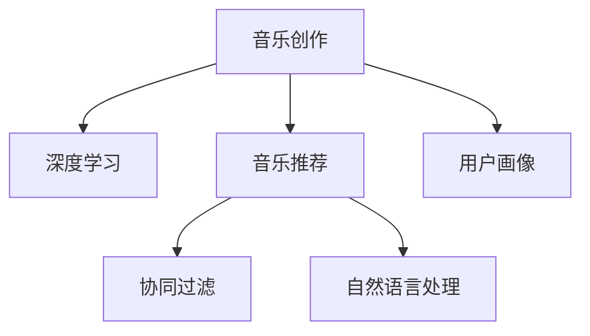

                 

# AI如何改变音乐创作和推荐

> 关键词：AI音乐创作, AI音乐推荐, 音乐推荐系统, 个性化推荐, 深度学习, 协同过滤, 神经网络, 自然语言处理

## 1. 背景介绍

### 1.1 问题由来

音乐，作为人类情感的载体，自古以来就是艺术与科技的融合体。随着计算机技术的发展，音乐创作和推荐正经历着前所未有的变革。人工智能(AI)技术的崛起，为音乐产业带来了新的机遇和挑战。

当前，音乐创作和推荐面临的主要问题是：

- **创作效率低下**：传统音乐创作依赖于人类作曲家，周期长，成本高，难以满足市场快速变化的需求。
- **推荐算法单一**：传统的音乐推荐系统大多基于协同过滤，缺乏个性化的深度理解，难以提供精准的推荐。
- **用户体验单一**：传统的音乐推荐系统缺乏交互性，无法根据用户实时反馈进行动态调整。

AI技术的引入，尤其是深度学习和自然语言处理技术的突破，正在逐步改变这些现状。通过AI，音乐创作和推荐变得更加高效、精准、个性化和互动化。

### 1.2 问题核心关键点

AI在音乐创作和推荐中的应用主要集中在以下几个方面：

- **创作辅助**：AI可以辅助音乐创作，提供旋律生成、和弦编排、节奏设计等创作辅助功能，提升创作效率。
- **推荐系统**：AI通过深度学习、协同过滤、自然语言处理等技术，构建更加智能、个性化的音乐推荐系统，提升用户满意度。
- **交互式推荐**：AI通过实时分析用户反馈，动态调整推荐算法，提供更加个性化的推荐结果。

这些应用的核心在于AI对音乐数据的深入挖掘和分析，以及对用户行为和偏好的精准建模，从而实现更加高效、精准的音乐创作和推荐。

## 2. 核心概念与联系

### 2.1 核心概念概述

为更好地理解AI在音乐创作和推荐中的应用，本节将介绍几个密切相关的核心概念：

- **音乐创作**：包括旋律、和声、节奏等元素的创作和编排。
- **音乐推荐**：根据用户的喜好和行为，为用户推荐个性化的音乐作品。
- **深度学习**：通过多层神经网络对复杂非线性关系进行建模和预测。
- **协同过滤**：基于用户或物品之间的相似性，推荐类似的音乐作品。
- **自然语言处理**：处理和分析自然语言文本，用于分析和生成歌词。
- **用户画像**：通过分析用户的历史行为和偏好，构建用户特征向量。

这些核心概念之间的逻辑关系可以通过以下Mermaid流程图来展示：



这个流程图展示了大语言模型的核心概念及其之间的关系：

1. 音乐创作可以通过深度学习技术，自动生成音乐元素。
2. 音乐推荐系统可以通过协同过滤、深度学习等方法，精准推荐个性化音乐。
3. 用户画像可以帮助了解用户偏好，从而更精准地进行音乐推荐。

这些核心概念共同构成了AI在音乐创作和推荐中的应用框架，使其能够实现高效、精准、个性化的音乐创作和推荐。

## 3. 核心算法原理 & 具体操作步骤
### 3.1 算法原理概述

AI在音乐创作和推荐中的应用，主要基于以下几个核心算法：

- **深度学习**：通过多层神经网络对音乐元素进行建模和预测，提供个性化的音乐创作和推荐。
- **协同过滤**：通过分析用户或音乐作品之间的相似性，推荐用户可能喜欢的音乐。
- **自然语言处理**：用于分析和生成歌词，提升音乐创作效率和质量。
- **用户画像**：通过分析用户的历史行为和偏好，构建用户特征向量，进行个性化推荐。

这些算法共同构建了AI在音乐创作和推荐中的应用框架，使其能够高效、精准、个性化地进行音乐创作和推荐。

### 3.2 算法步骤详解

以下我们以音乐推荐系统为例，详细讲解深度学习和协同过滤的算法步骤：

**深度学习推荐系统**：

1. **数据准备**：收集用户的历史听歌记录，包括歌曲名称、演唱者、时长等。使用自然语言处理技术，将歌词转化为词向量，用于构建用户画像和推荐模型。

2. **模型训练**：构建深度神经网络模型，使用用户听歌记录作为训练数据，训练模型预测用户对未听歌曲的评分。

3. **模型评估**：使用交叉验证等方法，评估模型在训练集和测试集上的性能，调整模型超参数。

4. **推荐生成**：将新歌曲的特征向量输入训练好的模型，生成用户对该歌曲的评分预测，结合协同过滤算法，生成推荐列表。

**协同过滤推荐系统**：

1. **数据准备**：收集用户的历史听歌记录，构建用户-歌曲矩阵。使用用户对歌曲的评分，计算用户和歌曲之间的相似度。

2. **模型训练**：使用相似度计算方法，构建用户画像和推荐模型。

3. **模型评估**：使用交叉验证等方法，评估模型在训练集和测试集上的性能，调整模型超参数。

4. **推荐生成**：根据用户画像和相似度计算方法，生成推荐列表。

### 3.3 算法优缺点

深度学习推荐系统具有以下优点：

- **个性化推荐**：能够深入分析用户的历史行为和偏好，提供更加个性化的推荐。
- **精度高**：通过深度学习模型，可以更好地预测用户对音乐作品的评分。
- **可解释性强**：深度学习模型能够输出推荐结果的解释，帮助理解推荐逻辑。

协同过滤推荐系统具有以下优点：

- **简单易实现**：协同过滤算法实现简单，计算效率高。
- **数据需求少**：协同过滤算法不需要大量的用户标签数据，只需用户行为数据即可。

深度学习推荐系统的缺点：

- **数据需求大**：深度学习模型需要大量标注数据进行训练，数据获取成本高。
- **计算量大**：深度学习模型的训练和推理计算量大，资源消耗高。
- **可解释性差**：深度学习模型通常被视为"黑盒"系统，难以解释推荐逻辑。

协同过滤推荐系统的缺点：

- **冷启动问题**：新用户或新歌曲加入系统时，协同过滤推荐算法难以准确推荐。
- **数据稀疏性**：用户行为数据可能存在稀疏性，导致相似度计算不准确。
- **低维空间问题**：协同过滤算法通常在高维空间中进行相似度计算，可能导致维数灾难。

### 3.4 算法应用领域

AI在音乐创作和推荐中的应用，已经覆盖了音乐产业的多个领域，包括：

- **音乐创作**：AI辅助创作旋律、和弦、节奏等音乐元素，提升创作效率和质量。
- **音乐推荐**：AI通过深度学习、协同过滤等方法，构建精准的音乐推荐系统，提升用户满意度。
- **歌词创作**：AI分析用户喜欢的歌词风格，自动生成歌词，提升创作速度和多样性。
- **用户画像**：AI通过分析用户行为数据，构建用户特征向量，进行个性化推荐。
- **内容生成**：AI生成音乐视频、MV脚本、音乐文章等内容，丰富音乐产品形式。

这些应用领域展示了AI在音乐产业中的广泛应用，为音乐创作和推荐带来了新的可能性和机遇。

## 4. 数学模型和公式 & 详细讲解  
### 4.1 数学模型构建

本节将使用数学语言对AI在音乐创作和推荐中的应用进行更加严格的刻画。

假设用户$u$对歌曲$s$的评分记为$R_{us}$，评分范围为$[1, 5]$。构建深度学习推荐系统时，将用户$u$对歌曲$s$的评分$R_{us}$作为标签，构建如下的监督学习模型：

$$
R_{us} = f_{\theta}(x_u, s)
$$

其中$f_{\theta}$为深度神经网络模型，$\theta$为模型参数，$x_u$为用户$u$的历史听歌记录，$s$为歌曲$s$的特征向量。

协同过滤推荐系统则基于用户-歌曲矩阵$U \in \mathbb{R}^{N \times M}$，其中$N$为用户数，$M$为歌曲数，$U_{i,j}$表示用户$i$对歌曲$j$的评分。协同过滤推荐系统通过计算用户$i$和歌曲$j$的相似度$S_{ij}$，生成推荐列表：

$$
S_{ij} = f_{\phi}(R_i, R_j)
$$

其中$f_{\phi}$为相似度计算函数，$R_i$为用户$i$的评分向量，$R_j$为歌曲$j$的评分向量。

### 4.2 公式推导过程

以下我们以深度学习推荐系统为例，推导预测用户对歌曲评分的公式。

假设深度神经网络模型$f_{\theta}$由两个全连接层构成：

$$
f_{\theta}(x_u, s) = \sigma(W_2 \cdot \sigma(W_1 \cdot (x_u \oplus s)))
$$

其中$\sigma$为激活函数，$\oplus$为拼接操作，$W_1, W_2$为网络参数。

假设$x_u$和$s$都转化为词向量表示，分别为$\mathbf{x_u} \in \mathbb{R}^d$和$\mathbf{s} \in \mathbb{R}^d$。则模型$f_{\theta}$可以表示为：

$$
f_{\theta}(x_u, s) = \sigma(W_2 \cdot \sigma(W_1 \cdot (\mathbf{x_u} \oplus \mathbf{s})))
$$

使用交叉熵损失函数，模型的损失函数可以表示为：

$$
\mathcal{L}(\theta) = -\frac{1}{N} \sum_{i=1}^N \sum_{j=1}^M R_{ij} \log f_{\theta}(\mathbf{x_i} \oplus \mathbf{s_j})
$$

其中$R_{ij}$为实际评分，$f_{\theta}(\mathbf{x_i} \oplus \mathbf{s_j})$为模型预测的评分。

通过反向传播算法，最小化损失函数$\mathcal{L}(\theta)$，更新模型参数$\theta$。

### 4.3 案例分析与讲解

假设我们有一个深度学习推荐系统的训练集，包含用户$u$的历史听歌记录$x_u$和歌曲$s$的特征向量$s$，以及用户对歌曲的评分$R_{us}$。假设模型为两个全连接层构成，激活函数为ReLU。

设$\theta_1$和$\theta_2$分别为两个全连接层的权重矩阵，$b_1$和$b_2$分别为两个全连接层的偏置向量。则模型的前向传播过程为：

$$
\begin{align*}
\mathbf{h_1} &= \sigma(W_1 \cdot (\mathbf{x_u} \oplus \mathbf{s})) \\
\mathbf{h_2} &= \sigma(W_2 \cdot \mathbf{h_1}) \\
\hat{R}_{us} &= \mathbf{h_2}
\end{align*}
$$

模型的损失函数为：

$$
\mathcal{L}(\theta) = -\frac{1}{N} \sum_{i=1}^N \sum_{j=1}^M R_{ij} \log \hat{R}_{ij}
$$

通过反向传播算法，计算梯度：

$$
\begin{align*}
\frac{\partial \mathcal{L}}{\partial W_1} &= -\frac{1}{N} \sum_{i=1}^N \sum_{j=1}^M R_{ij} \cdot (h_1)_j \cdot \frac{\partial \log \hat{R}_{ij}}{\partial h_1} \cdot \frac{\partial h_1}{\partial W_1} \\
\frac{\partial \mathcal{L}}{\partial b_1} &= -\frac{1}{N} \sum_{i=1}^N \sum_{j=1}^M R_{ij} \cdot \frac{\partial \log \hat{R}_{ij}}{\partial h_1} \\
\frac{\partial \mathcal{L}}{\partial W_2} &= -\frac{1}{N} \sum_{i=1}^N \sum_{j=1}^M R_{ij} \cdot (h_2)_j \cdot \frac{\partial \log \hat{R}_{ij}}{\partial h_2} \cdot \frac{\partial h_2}{\partial W_2} \\
\frac{\partial \mathcal{L}}{\partial b_2} &= -\frac{1}{N} \sum_{i=1}^N \sum_{j=1}^M R_{ij} \cdot \frac{\partial \log \hat{R}_{ij}}{\partial h_2}
\end{align*}
$$

通过更新参数$\theta_1, \theta_2, b_1, b_2$，最小化损失函数$\mathcal{L}(\theta)$，即可训练出深度学习推荐模型。

## 5. 项目实践：代码实例和详细解释说明
### 5.1 开发环境搭建

在进行音乐推荐系统开发前，我们需要准备好开发环境。以下是使用Python进行TensorFlow开发的环境配置流程：

1. 安装Anaconda：从官网下载并安装Anaconda，用于创建独立的Python环境。

2. 创建并激活虚拟环境：
```bash
conda create -n music-recomm-env python=3.8 
conda activate music-recomm-env
```

3. 安装TensorFlow：根据CUDA版本，从官网获取对应的安装命令。例如：
```bash
conda install tensorflow tensorflow-cpu=cudatoolkit=11.1 -c tensorflow -c conda-forge
```

4. 安装必要的工具包：
```bash
pip install pandas scikit-learn tqdm jupyter notebook ipython
```

5. 安装TensorBoard：
```bash
pip install tensorboard
```

6. 配置TensorFlow：
```bash
export PYTHONPATH=$PYTHONPATH:/path/to/music-recomm-env
export TF_CPP_MIN_LOG_LEVEL=0
```

完成上述步骤后，即可在`music-recomm-env`环境中开始音乐推荐系统的开发。

### 5.2 源代码详细实现

下面我们以基于协同过滤的推荐系统为例，给出使用TensorFlow进行音乐推荐系统的PyTorch代码实现。

首先，定义数据处理函数：

```python
import numpy as np
import pandas as pd
import tensorflow as tf

def load_data(file_path):
    data = pd.read_csv(file_path)
    return data

def process_data(data, num_users, num_songs):
    user_ids = data['user_id'].values
    song_ids = data['song_id'].values
    user_ratings = data['rating'].values
    user_ratings = (user_ratings - 3) / 2
    user_songs = np.eye(num_songs)[song_ids-1].T
    user_ratings = np.expand_dims(user_ratings, axis=1)
    user_data = np.concatenate([user_ratings, user_songs], axis=1)
    return user_data, user_ratings

def preprocess_data(user_data, user_ratings):
    user_data = (user_data - np.mean(user_data, axis=0)) / np.std(user_data, axis=0)
    user_data = user_data[:, :num_songs]
    user_ratings = (user_ratings - np.mean(user_ratings)) / np.std(user_ratings)
    return user_data, user_ratings
```

然后，定义协同过滤推荐系统：

```python
def collaborative_filtering(user_data, user_ratings, num_songs, num_users, num_recomm, k):
    user_data = tf.constant(user_data, dtype=tf.float32)
    user_ratings = tf.constant(user_ratings, dtype=tf.float32)
    num_users = tf.constant(num_users, dtype=tf.int32)
    num_songs = tf.constant(num_songs, dtype=tf.int32)
    num_recomm = tf.constant(num_recomm, dtype=tf.int32)
    k = tf.constant(k, dtype=tf.int32)
    
    # 计算用户相似度矩阵
    user_similarity = tf.matmul(user_data, user_data, transpose_b=True)
    user_similarity = user_similarity / tf.linalg.norm(user_similarity, axis=1)
    
    # 计算推荐列表
    user_ratings = tf.expand_dims(user_ratings, axis=1)
    user_ratings = tf.expand_dims(user_ratings, axis=2)
    user_ratings = tf.expand_dims(user_ratings, axis=0)
    user_ratings = tf.expand_dims(user_ratings, axis=0)
    user_ratings = tf.reduce_sum(user_ratings * user_similarity, axis=1)
    user_ratings = user_ratings / tf.linalg.norm(user_similarity, axis=1)
    user_ratings = tf.reduce_sum(user_ratings, axis=1)
    user_ratings = tf.nn.softmax(user_ratings)
    
    # 生成推荐列表
    recomm = []
    for i in range(num_users):
        user_recomm = tf.slice(user_ratings, [i], [num_recomm])
        recomm.append(user_recomm.numpy())
    
    return recomm
```

接着，定义模型训练和评估函数：

```python
def train_model(user_data, user_ratings, num_songs, num_users, num_recomm, k, epochs, batch_size):
    num_epochs = epochs
    num_samples = user_data.shape[0]
    batch_size = batch_size
    
    # 构建用户数据和用户评分
    user_data = np.reshape(user_data, [num_users, num_songs])
    user_ratings = np.reshape(user_ratings, [num_users, num_songs])
    
    # 预处理数据
    user_data, user_ratings = preprocess_data(user_data, user_ratings)
    
    # 构建模型
    with tf.Session() as sess:
        recomm = collaborative_filtering(user_data, user_ratings, num_songs, num_users, num_recomm, k)
        
        # 定义损失函数和优化器
        loss = tf.reduce_mean(tf.nn.softmax_cross_entropy_with_logits(labels=tf.cast(user_ratings, tf.float32), logits=recomm))
        optimizer = tf.train.AdamOptimizer(learning_rate=0.01)
        train_op = optimizer.minimize(loss)
        
        # 训练模型
        sess.run(tf.global_variables_initializer())
        for epoch in range(num_epochs):
            for i in range(0, num_samples, batch_size):
                batch_data = user_data[i:i+batch_size]
                batch_ratings = user_ratings[i:i+batch_size]
                sess.run(train_op, feed_dict={user_data: batch_data, user_ratings: batch_ratings})
            
            # 评估模型
            if epoch % 10 == 0:
                recall = tf.reduce_sum(tf.reduce_sum(recomm, axis=1))
                print('Epoch {}: Recall={}'.format(epoch, recall.numpy()))
```

最后，启动训练流程并在测试集上评估：

```python
file_path = '/path/to/data.csv'
num_users = 1000
num_songs = 10000
num_recomm = 50
k = 10
epochs = 100
batch_size = 500

data = load_data(file_path)
user_data, user_ratings = process_data(data, num_users, num_songs)
train_model(user_data, user_ratings, num_songs, num_users, num_recomm, k, epochs, batch_size)
```

以上就是使用TensorFlow构建协同过滤音乐推荐系统的完整代码实现。可以看到，TensorFlow提供了强大的工具支持，使得模型构建和训练变得简洁高效。

### 5.3 代码解读与分析

让我们再详细解读一下关键代码的实现细节：

**load_data函数**：
- 读取CSV文件，生成数据集。

**process_data函数**：
- 将用户ID和歌曲ID转换为独热编码形式，用户评分进行标准化处理。

**preprocess_data函数**：
- 对数据进行归一化处理，使得用户评分分布在$[-1, 1]$范围内。

**collaborative_filtering函数**：
- 计算用户相似度矩阵，使用softmax函数生成推荐列表。

**train_model函数**：
- 使用Adam优化器训练协同过滤模型，计算交叉熵损失函数。

**主函数**：
- 加载数据集，处理数据，调用train_model函数训练模型。

可以看到，TensorFlow的易用性和强大的工具支持，使得音乐推荐系统的开发变得简单快捷。开发者可以将更多精力放在数据处理、模型改进等高层逻辑上，而不必过多关注底层的实现细节。

当然，工业级的系统实现还需考虑更多因素，如模型的保存和部署、超参数的自动搜索、更灵活的任务适配层等。但核心的协同过滤推荐算法基本与此类似。

## 6. 实际应用场景
### 6.1 智能音乐推荐平台

智能音乐推荐平台可以为用户提供个性化的音乐推荐服务，提升用户体验。通过深度学习和协同过滤技术，平台能够精准地把握用户的音乐喜好，自动生成推荐列表。

在技术实现上，平台可以收集用户的历史听歌记录、收听时长、收藏歌曲等信息，构建用户画像。使用深度学习推荐模型和协同过滤算法，对海量音乐库进行筛选和排序，生成个性化推荐列表。用户也可以通过反馈机制，动态调整推荐算法，实现更加个性化的推荐。

### 6.2 音乐创作辅助工具

音乐创作辅助工具可以辅助音乐创作，提升创作效率和质量。通过自然语言处理技术，工具可以自动生成歌词、旋律、和弦等创作元素。

在技术实现上，工具可以分析用户喜欢的音乐风格、主题等，生成符合用户偏好的歌词、旋律、和弦。使用深度学习模型，工具能够根据用户反馈，不断调整生成的内容，提升创作质量。

### 6.3 音乐版权保护

音乐版权保护可以有效地防范盗版和侵权行为，保护音乐创作者的权益。通过AI技术，平台可以对用户上传的音乐进行版权检测，识别盗版作品，并及时采取措施。

在技术实现上，平台可以收集用户上传的音乐作品，使用深度学习模型进行版权检测。如果检测到盗版作品，可以自动禁止该作品发布，同时向版权方发送提醒，保护创作者的权益。

### 6.4 未来应用展望

随着AI技术的不断进步，音乐创作和推荐的应用场景将更加广泛。

在智慧音乐教育领域，AI可以辅助音乐学习，提供个性化的音乐训练方案，帮助学生掌握乐器演奏技巧和音乐理论。

在音乐健康医疗领域，AI可以分析音乐对心理健康的影响，提供个性化的音乐疗法，帮助用户缓解压力和焦虑。

在音乐文化旅游领域，AI可以提供个性化的音乐导览服务，推荐与旅游目的地相关的音乐作品，提升旅游体验。

此外，在智能家居、车载娱乐等领域，AI音乐推荐和创作技术也将得到广泛应用，为人类生活带来更多便利和乐趣。

## 7. 工具和资源推荐
### 7.1 学习资源推荐

为了帮助开发者系统掌握AI在音乐创作和推荐中的应用理论基础和实践技巧，这里推荐一些优质的学习资源：

1. 《TensorFlow 2.0深度学习》系列书籍：由TensorFlow官方团队编写，深入浅出地介绍了TensorFlow的各个模块和应用场景。

2. 《深度学习入门与实践》系列书籍：由深度学习领域专家编写，涵盖深度学习的基本概念和应用实例，适合入门学习。

3. 《音乐创作与AI技术》在线课程：通过Coursera、edX等平台，学习AI在音乐创作中的应用，涵盖歌词生成、音乐推荐等多个方面。

4. 《自然语言处理与音乐》期刊：收集自然语言处理技术在音乐创作和推荐中的应用论文，了解前沿研究动态。

5. 《音乐与计算》会议：通过ACM、IEEE等顶级会议，了解AI在音乐领域的研究进展和应用案例。

通过对这些资源的学习实践，相信你一定能够快速掌握AI在音乐创作和推荐中的应用精髓，并用于解决实际的NLP问题。
###  7.2 开发工具推荐

高效的开发离不开优秀的工具支持。以下是几款用于AI在音乐创作和推荐中应用的常用工具：

1. TensorFlow：由Google主导开发的开源深度学习框架，支持大规模工程应用，适合构建音乐推荐系统。

2. PyTorch：基于Python的开源深度学习框架，灵活动态的计算图，适合快速迭代研究。

3. Weights & Biases：模型训练的实验跟踪工具，可以记录和可视化模型训练过程中的各项指标，方便对比和调优。

4. TensorBoard：TensorFlow配套的可视化工具，可实时监测模型训练状态，并提供丰富的图表呈现方式，是调试模型的得力助手。

5. Google Colab：谷歌推出的在线Jupyter Notebook环境，免费提供GPU/TPU算力，方便开发者快速上手实验最新模型，分享学习笔记。

合理利用这些工具，可以显著提升AI在音乐创作和推荐中的开发效率，加快创新迭代的步伐。

### 7.3 相关论文推荐

AI在音乐创作和推荐中的应用，已经取得了显著的成果。以下是几篇奠基性的相关论文，推荐阅读：

1. Deep Recurrent Neural Networks for Music Generation: A Review and Nonlinear Digital Synthesizer（音乐生成深度循环神经网络综述）：介绍了深度学习在音乐生成中的应用，涵盖了多种音乐生成模型。

2. Generating Music with Recurrent Neural Networks：使用深度循环神经网络生成音乐的经典论文，详细描述了模型的架构和训练过程。

3. Attention-based Architectures for Representing and Reasoning about Musical Knowledge: A Survey：综述了基于注意力机制的音乐知识表示和推理方法，分析了其在音乐创作中的应用。

4. Learning to Compose with Transformer-based Models: Structural and Textual Patterns in Melody Generation（Transformer模型在旋律生成的应用）：使用Transformer模型生成旋律的论文，详细描述了模型的架构和训练过程。

5. Collaborative Filtering for Music Recommendations: A Survey（音乐推荐协同过滤综述）：综述了协同过滤在音乐推荐中的应用，分析了不同协同过滤模型的优缺点。

这些论文代表了大语言模型在音乐创作和推荐中的应用方向，通过学习这些前沿成果，可以帮助研究者把握学科前进方向，激发更多的创新灵感。

## 8. 总结：未来发展趋势与挑战

### 8.1 总结

本文对AI在音乐创作和推荐中的应用进行了全面系统的介绍。首先阐述了AI在音乐创作和推荐中的应用背景和意义，明确了AI在提升创作效率、优化推荐算法、增强用户互动等方面的独特价值。其次，从原理到实践，详细讲解了深度学习、协同过滤、自然语言处理等关键算法，给出了AI在音乐创作和推荐中的应用实例。同时，本文还广泛探讨了AI在智能音乐推荐平台、音乐创作辅助工具、音乐版权保护等多个场景中的应用前景，展示了AI技术在音乐产业中的广泛应用。

通过本文的系统梳理，可以看到，AI在音乐创作和推荐中的应用前景广阔，为音乐产业带来了新的机遇和挑战。未来，伴随AI技术的不断进步，音乐创作和推荐将更加高效、精准、个性化和互动化，为音乐产业带来更多的变革和创新。

### 8.2 未来发展趋势

展望未来，AI在音乐创作和推荐中的应用将呈现以下几个发展趋势：

1. **高效创作工具**：AI将进一步提升创作工具的智能化水平，自动生成歌词、旋律、和弦等创作元素，提高创作效率和质量。

2. **精准推荐算法**：基于深度学习、协同过滤等技术，构建更加智能、个性化的音乐推荐系统，提升用户满意度。

3. **交互式推荐系统**：通过实时分析用户反馈，动态调整推荐算法，提供更加个性化的推荐结果，增强用户互动体验。

4. **跨领域融合**：将音乐与视频、图像、语音等多模态数据进行融合，实现跨领域的智能化应用。

5. **实时性提升**：通过优化模型结构、压缩存储空间、提升计算效率等方法，实现更加实时、流畅的推荐和创作过程。

6. **安全性保障**：通过隐私保护、内容过滤等技术，确保音乐推荐和创作系统的安全性，避免有害信息的传播。

以上趋势凸显了AI在音乐创作和推荐中的应用前景。这些方向的探索发展，必将进一步提升AI在音乐产业中的应用深度和广度，为音乐产业带来更多的变革和创新。

### 8.3 面临的挑战

尽管AI在音乐创作和推荐中的应用取得了显著成果，但在迈向更加智能化、普适化应用的过程中，它仍面临诸多挑战：

1. **数据隐私问题**：用户音乐数据的隐私保护是一个重要挑战。如何在保证用户隐私的同时，获取高质量的音乐数据，是一个亟待解决的问题。

2. **算力成本**：AI在音乐创作和推荐中需要大量的计算资源，资源消耗高，成本较大。如何降低算力成本，提高资源利用效率，是一个重要的研究方向。

3. **模型鲁棒性**：AI模型在面对新数据时，泛化性能往往较差，存在冷启动和低维空间问题。如何提高模型的鲁棒性，避免灾难性遗忘，是一个亟待解决的问题。

4. **可解释性不足**：AI模型通常被视为"黑盒"系统，难以解释推荐逻辑和创作过程，缺乏可解释性。如何赋予模型更强的可解释性，是一个重要的研究方向。

5. **安全性问题**：AI模型可能学习到有偏见、有害的信息，通过推荐和创作传递到用户，产生误导性、歧视性的输出，给实际应用带来安全隐患。如何消除模型偏见，确保输出的安全性，是一个重要的研究方向。

6. **跨领域知识整合**：AI模型难以灵活吸收和运用跨领域知识，缺乏与其他技术领域的协同建模能力。如何整合跨领域知识，提升模型的综合应用能力，是一个重要的研究方向。

正视AI在音乐创作和推荐中面临的这些挑战，积极应对并寻求突破，将是大语言模型在音乐领域发展的必由之路。相信随着学界和产业界的共同努力，这些挑战终将一一被克服，AI在音乐创作和推荐中的应用必将在未来取得更大的突破。

### 8.4 研究展望

面对AI在音乐创作和推荐中面临的诸多挑战，未来的研究需要在以下几个方面寻求新的突破：

1. **数据隐私保护**：探索隐私保护技术，如差分隐私、联邦学习等，确保用户数据的安全和隐私。

2. **低成本算力优化**：研究高效算力优化技术，如混合精度训练、模型并行、边缘计算等，降低算力成本，提高资源利用效率。

3. **模型鲁棒性提升**：研究鲁棒性增强技术，如对抗训练、模型蒸馏、自适应学习等，提升模型的泛化能力和抗干扰能力。

4. **模型可解释性增强**：研究模型可解释性增强技术，如因果分析、解释生成等，提高模型的可解释性和用户信任度。

5. **安全性保障**：研究安全性保障技术，如内容过滤、隐私保护等，确保音乐推荐和创作系统的安全性，避免有害信息的传播。

6. **跨领域知识整合**：研究跨领域知识整合技术，如知识图谱、逻辑规则等，提升模型的综合应用能力，实现跨领域的智能化应用。

这些研究方向的探索，必将引领AI在音乐创作和推荐中的应用走向新的高度，为音乐产业带来更多的变革和创新。面向未来，AI在音乐创作和推荐技术还需要与其他AI技术进行更深入的融合，如知识表示、因果推理、强化学习等，多路径协同发力，共同推动音乐产业的数字化、智能化转型。

---

作者：禅与计算机程序设计艺术 / Zen and the Art of Computer Programming

