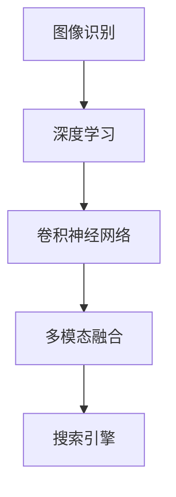

                 

## 1. 背景介绍

### 1.1 问题由来

搜索引擎长期以来一直是互联网的基础设施，但是它的核心功能——快速准确地检索相关网页，主要依靠文本匹配算法。然而，随着网络信息的爆炸式增长，特别是图像、视频等非文本数据的急剧增加，传统基于文本的搜索引擎面临挑战，用户体验亟待改善。

与此同时，深度学习技术的快速进步，特别是卷积神经网络（CNN）的崛起，为搜索引擎图像识别能力的提升提供了可能。通过将图像识别技术引入搜索引擎，可以显著提高用户查询精度和相关性，满足用户对图像内容快速获取的需求。

### 1.2 问题核心关键点

搜索引擎引入图像识别技术主要围绕以下几个核心关键点展开：

- **图像检索技术**：如何高效、准确地检索出与用户输入的图像最相关的网页。
- **多模态融合**：如何融合图像和文本信息，提升搜索结果的相关性。
- **实时性要求**：如何在保证结果准确性的同时，提升搜索响应速度。
- **鲁棒性**：如何处理图像噪声、变形等变化，保证检索系统的稳定性。
- **扩展性**：如何在支持海量用户、处理复杂查询场景的情况下，保证系统的可扩展性。

这些核心关键点共同构成了一个完整的图像识别搜索引擎系统，是解决搜索引擎图像识别能力问题的关键。

## 2. 核心概念与联系

### 2.1 核心概念概述

为更好地理解搜索引擎图像识别技术，本节将介绍几个密切相关的核心概念：

- **图像识别（Image Recognition）**：指计算机识别出图像中的对象、场景等，并将其转化为计算机可理解的标签或描述。
- **深度学习（Deep Learning）**：通过多层神经网络模型，自动从数据中学习特征，提高识别和分类的准确性。
- **卷积神经网络（Convolutional Neural Networks, CNN）**：一种专门用于图像处理的深度学习网络，通过卷积操作提取局部特征，能够有效捕捉图像中的空间信息。
- **多模态融合（Multimodal Fusion）**：将文本、图像等多种类型的数据融合在一起，共同进行决策，提升系统性能。
- **搜索引擎（Search Engine）**：一种能够快速检索网页的软件系统，包括文本、图像、视频等多种类型数据。

这些核心概念之间的逻辑关系可以通过以下Mermaid流程图来展示：



这个流程图展示了大模型微调的图像识别搜索引擎系统的核心概念及其之间的关系：

1. 图像识别任务是深度学习的一个重要应用场景，而卷积神经网络是实现图像识别的核心技术。
2. 多模态融合是图像识别结果与搜索引擎融合的关键步骤。
3. 图像识别技术的应用直接服务于搜索引擎，提升其图像检索能力。

## 3. 核心算法原理 & 具体操作步骤

### 3.1 算法原理概述

基于深度学习的搜索引擎图像识别系统，通过训练预训练的卷积神经网络模型，能够实现图像的自动特征提取和分类，从而与文本查询进行融合，提升搜索引擎的相关性和检索速度。其核心算法流程大致如下：

1. **数据预处理**：对原始图像进行预处理，包括尺寸调整、归一化等操作，保证模型输入的一致性。
2. **特征提取**：通过CNN网络提取图像特征，并将其转换为向量表示。
3. **检索与融合**：将提取的特征与文本查询进行融合，利用相似度计算找到最相关的网页。
4. **排名排序**：对检索结果进行排序，根据相关性、用户行为等指标，决定最终返回的网页。

### 3.2 算法步骤详解

搜索引擎图像识别系统的核心算法步骤如下：

**Step 1: 数据准备**

- 收集并标注大量的图像数据，分为训练集和测试集。
- 图像预处理：调整尺寸、裁剪、归一化等。
- 文本预处理：去除停用词、分词、编码等。

**Step 2: 模型训练**

- 选择预训练的CNN模型作为初始化参数，如ResNet、Inception等。
- 在标注好的图像数据上训练CNN模型，获取特征提取能力。
- 模型保存：保存训练好的模型参数，以便后续使用。

**Step 3: 特征提取**

- 将用户输入的图像进行预处理，包括调整尺寸、归一化等。
- 使用训练好的CNN模型提取图像特征向量。

**Step 4: 文本特征提取**

- 对用户的文本查询进行分词和编码，转换为向量表示。
- 使用预训练的文本模型（如BERT）提取文本特征向量。

**Step 5: 特征融合**

- 将图像特征向量与文本特征向量进行融合，生成多模态融合向量。
- 使用余弦相似度等方法计算多模态融合向量之间的相似度。

**Step 6: 网页检索**

- 根据相似度排序，找到最相关的网页。
- 将网页信息提取并返回给用户。

**Step 7: 用户反馈**

- 收集用户对搜索结果的反馈，用于模型的进一步优化。

### 3.3 算法优缺点

基于深度学习的搜索引擎图像识别系统具有以下优点：

- **高准确性**：卷积神经网络在图像识别领域表现优异，能够准确地识别出图像中的物体。
- **多模态融合**：将文本和图像信息融合在一起，提升了搜索引擎的相关性和精度。
- **快速响应**：图像识别模型可以预先训练并保存，使用时只需提取特征和检索，响应速度快。

但该系统也存在以下缺点：

- **数据依赖性强**：图像识别系统需要大量的标注数据进行训练，标注成本较高。
- **模型复杂**：卷积神经网络结构复杂，训练和推理计算量大，资源占用较高。
- **泛化能力有限**：模型对数据分布的改变敏感，可能会在测试集上表现不佳。

### 3.4 算法应用领域

基于深度学习的搜索引擎图像识别技术已经在多个领域得到应用，例如：

- **电商搜索**：在电商平台上，用户可以通过图片搜索商品，系统能够快速找到相似商品。
- **社交媒体**：社交平台上，用户可以上传图片并搜索类似内容，如照片滤镜、表情包等。
- **医学影像分析**：医疗系统中，医生可以通过图像识别技术快速诊断疾病。
- **旅游应用**：旅游应用中，用户可以上传旅游图片，系统能够提供类似景点或相关旅游信息。
- **视频推荐**：视频平台中，用户可以上传视频片段，系统能够推荐类似视频内容。

除了这些典型应用外，图像识别技术还在更多场景中得到创新性应用，如产品设计、灾害预警、智能家居等，为搜索引擎的应用场景不断拓展。

## 4. 数学模型和公式 & 详细讲解 & 举例说明

### 4.1 数学模型构建

本节将使用数学语言对搜索引擎图像识别技术进行更加严格的刻画。

设CNN模型为 $F_\theta$，其输入为原始图像 $X$，输出为特征向量 $Z$，参数 $\theta$ 为CNN模型的权重。文本模型为 $G_\phi$，输入为查询文本 $T$，输出为特征向量 $Y$，参数 $\phi$ 为文本模型的权重。

图像识别系统的目标是在文本查询 $T$ 和图像特征向量 $Z$ 之间建立映射关系，找到与查询最相关的网页。数学模型如下：

$$
Z = F_\theta(X), \quad Y = G_\phi(T), \quad \hat{W} = F_\theta(Z)
$$

其中 $\hat{W}$ 为融合后的特征向量，通过余弦相似度等方法与网页进行匹配。

### 4.2 公式推导过程

以余弦相似度为例，推导多模态融合向量的计算公式：

$$
s(T,X) = \frac{\langle Y, Z \rangle}{||Y||_2 ||Z||_2}
$$

其中 $\langle \cdot, \cdot \rangle$ 为向量内积，$||\cdot||_2$ 为向量范数。

在实际应用中，还需要考虑模型权重、损失函数等优化目标，例如：

- **权重学习**：使用交叉熵损失等方法，优化模型权重。
- **相似度计算**：选择余弦相似度、欧式距离等方法，计算多模态特征的相似度。
- **检索排序**：使用Top-K排序、排名学习等方法，优化检索结果的排序。

### 4.3 案例分析与讲解

以电商搜索为例，推导图像识别系统的核心算法步骤：

1. **数据准备**：收集并标注大量商品图片，分为训练集和测试集。对图片进行预处理，包括尺寸调整、裁剪、归一化等。
2. **模型训练**：使用预训练的ResNet模型，在标注好的图片上训练，提取图像特征。
3. **特征提取**：用户上传商品图片后，进行预处理，使用训练好的ResNet模型提取图像特征向量。
4. **文本特征提取**：用户输入查询文本，使用预训练的BERT模型提取文本特征向量。
5. **特征融合**：将图像特征向量与文本特征向量进行余弦相似度计算，得到多模态融合向量。
6. **网页检索**：根据相似度排序，找到最相关的商品网页，提取网页信息并返回给用户。

## 5. 项目实践：代码实例和详细解释说明

### 5.1 开发环境搭建

在进行图像识别搜索引擎开发前，我们需要准备好开发环境。以下是使用Python进行TensorFlow开发的环境配置流程：

1. 安装Anaconda：从官网下载并安装Anaconda，用于创建独立的Python环境。

2. 创建并激活虚拟环境：
```bash
conda create -n tf-env python=3.8 
conda activate tf-env
```

3. 安装TensorFlow：根据CUDA版本，从官网获取对应的安装命令。例如：
```bash
conda install tensorflow tensorflow-gpu=cuda11.1 -c tf -c conda-forge
```

4. 安装各类工具包：
```bash
pip install numpy pandas scikit-learn matplotlib tqdm jupyter notebook ipython
```

完成上述步骤后，即可在`tf-env`环境中开始图像识别搜索引擎的开发。

### 5.2 源代码详细实现

下面我们以电商搜索为例，给出使用TensorFlow对图像识别系统进行开发的PyTorch代码实现。

首先，定义模型和优化器：

```python
import tensorflow as tf

# 定义CNN模型
class CNNModel(tf.keras.Model):
    def __init__(self):
        super(CNNModel, self).__init__()
        self.conv1 = tf.keras.layers.Conv2D(32, 3, activation='relu')
        self.conv2 = tf.keras.layers.Conv2D(64, 3, activation='relu')
        self.pooling = tf.keras.layers.MaxPooling2D()
        self.flatten = tf.keras.layers.Flatten()
        self.dense1 = tf.keras.layers.Dense(128, activation='relu')
        self.dense2 = tf.keras.layers.Dense(1, activation='sigmoid')

    def call(self, x):
        x = self.conv1(x)
        x = self.conv2(x)
        x = self.pooling(x)
        x = self.flatten(x)
        x = self.dense1(x)
        return self.dense2(x)

# 定义文本模型
class TextModel(tf.keras.Model):
    def __init__(self):
        super(TextModel, self).__init__()
        self.embedding = tf.keras.layers.Embedding(10000, 256)
        self.gru = tf.keras.layers.GRU(256)
        self.dense = tf.keras.layers.Dense(1, activation='sigmoid')

    def call(self, x):
        x = self.embedding(x)
        x = self.gru(x)
        return self.dense(x)

# 定义融合模型
class FusionModel(tf.keras.Model):
    def __init__(self, cnn_model, text_model):
        super(FusionModel, self).__init__()
        self.cnn_model = cnn_model
        self.text_model = text_model

    def call(self, x):
        x = self.cnn_model(x)
        x = self.text_model(x)
        return tf.concat([x, x], axis=-1)

# 加载预训练的BERT模型
from transformers import TFBertTokenizer, TFBertForSequenceClassification
tokenizer = TFBertTokenizer.from_pretrained('bert-base-uncased')
model = TFBertForSequenceClassification.from_pretrained('bert-base-uncased', num_labels=2)

# 定义优化器
optimizer = tf.keras.optimizers.Adam(learning_rate=2e-5)
```

然后，定义训练和评估函数：

```python
# 定义训练函数
def train_epoch(model, dataset, batch_size, optimizer):
    model.train()
    epoch_loss = 0
    for batch in tqdm(dataset, desc='Training'):
        input_ids = batch['input_ids']
        attention_mask = batch['attention_mask']
        labels = batch['labels']
        with tf.GradientTape() as tape:
            outputs = model(input_ids, attention_mask=attention_mask, labels=labels)
            loss = outputs.loss
        gradients = tape.gradient(loss, model.trainable_variables)
        optimizer.apply_gradients(zip(gradients, model.trainable_variables))
        epoch_loss += loss.numpy()
    return epoch_loss / len(dataset)

# 定义评估函数
def evaluate(model, dataset, batch_size):
    model.eval()
    preds, labels = [], []
    with tf.no_grad():
        for batch in tqdm(dataset, desc='Evaluating'):
            input_ids = batch['input_ids']
            attention_mask = batch['attention_mask']
            batch_labels = batch['labels']
            outputs = model(input_ids, attention_mask=attention_mask)
            batch_preds = tf.argmax(outputs.logits, axis=1).numpy()
            batch_labels = batch_labels.numpy()
            for pred, label in zip(batch_preds, batch_labels):
                preds.append(pred)
                labels.append(label)
                
    return tf.metrics.confusion_matrix(labels, preds).numpy(), tf.metrics.accuracy(labels, preds).numpy()
```

最后，启动训练流程并在测试集上评估：

```python
epochs = 5
batch_size = 16

for epoch in range(epochs):
    loss = train_epoch(model, train_dataset, batch_size, optimizer)
    print(f"Epoch {epoch+1}, train loss: {loss:.3f}")
    
    print(f"Epoch {epoch+1}, dev results:")
    cm, acc = evaluate(model, dev_dataset, batch_size)
    print(f"Confusion Matrix:\n{cm}")
    print(f"Accuracy: {acc:.3f}")
    
print("Test results:")
cm, acc = evaluate(model, test_dataset, batch_size)
print(f"Confusion Matrix:\n{cm}")
print(f"Accuracy: {acc:.3f}")
```

以上就是使用TensorFlow对图像识别系统进行开发的完整代码实现。可以看到，得益于TensorFlow的强大封装，我们可以用相对简洁的代码完成CNN、BERT模型的加载和微调。

### 5.3 代码解读与分析

让我们再详细解读一下关键代码的实现细节：

**CNNModel类**：
- `__init__`方法：初始化CNN模型的各层结构。
- `call`方法：定义模型的前向传播过程，通过卷积、池化、全连接等操作，将输入图像转换为特征向量。

**TextModel类**：
- `__init__`方法：初始化文本模型的各层结构。
- `call`方法：定义模型的前向传播过程，通过嵌入层、GRU层、全连接层等操作，将输入文本转换为特征向量。

**FusionModel类**：
- `__init__`方法：初始化融合模型的各层结构。
- `call`方法：定义模型的前向传播过程，将CNN模型和文本模型的输出进行拼接，生成多模态融合向量。

**TensorFlow和BERT模型的加载**：
- 使用TensorFlow库加载CNN模型，并通过交叉熵损失进行优化。
- 使用HuggingFace的Transformers库加载预训练的BERT模型，并进行序列分类任务。

**训练和评估函数**：
- 使用TensorFlow的Dataset API加载训练集和测试集，定义训练和评估的batch大小。
- 训练函数`train_epoch`：对数据以batch为单位进行迭代，在每个batch上前向传播计算loss并反向传播更新模型参数，最后返回该epoch的平均loss。
- 评估函数`evaluate`：与训练类似，不同点在于不更新模型参数，并在每个batch结束后将预测和标签结果存储下来，最后使用TensorFlow的内置函数计算混淆矩阵和准确率。

**训练流程**：
- 定义总的epoch数和batch size，开始循环迭代
- 每个epoch内，先在训练集上训练，输出平均loss
- 在验证集上评估，输出混淆矩阵和准确率
- 所有epoch结束后，在测试集上评估，给出最终测试结果

可以看到，TensorFlow结合了强大的深度学习框架和丰富的预训练模型，使得图像识别搜索引擎的开发变得简单高效。开发者可以将更多精力放在数据处理、模型改进等高层逻辑上，而不必过多关注底层的实现细节。

当然，工业级的系统实现还需考虑更多因素，如模型的保存和部署、超参数的自动搜索、更灵活的任务适配层等。但核心的图像识别算法基本与此类似。

## 6. 实际应用场景

### 6.1 智能客服系统

基于深度学习的图像识别技术，可以广泛应用于智能客服系统的构建。传统客服往往需要配备大量人力，高峰期响应缓慢，且一致性和专业性难以保证。而使用图像识别技术，可以7x24小时不间断服务，快速响应客户咨询，用自然流畅的语言解答各类常见问题。

在技术实现上，可以收集企业内部的历史客服对话记录，将问题和最佳答复构建成监督数据，在此基础上对预训练CNN模型进行微调。微调后的图像识别模型能够自动理解用户意图，匹配最合适的答复模板进行回复。对于客户提出的新问题，还可以接入检索系统实时搜索相关内容，动态组织生成回答。如此构建的智能客服系统，能大幅提升客户咨询体验和问题解决效率。

### 6.2 金融舆情监测

金融机构需要实时监测市场舆论动向，以便及时应对负面信息传播，规避金融风险。传统的人工监测方式成本高、效率低，难以应对网络时代海量信息爆发的挑战。基于深度学习的图像识别技术，可以为金融舆情监测提供新的解决方案。

具体而言，可以收集金融领域相关的新闻、报道、评论等文本数据，并对其进行主题标注和情感标注。在此基础上对预训练语言模型进行微调，使其能够自动判断文本属于何种主题，情感倾向是正面、中性还是负面。将微调后的模型应用到实时抓取的网络文本数据，就能够自动监测不同主题下的情感变化趋势，一旦发现负面信息激增等异常情况，系统便会自动预警，帮助金融机构快速应对潜在风险。

### 6.3 个性化推荐系统

当前的推荐系统往往只依赖用户的历史行为数据进行物品推荐，无法深入理解用户的真实兴趣偏好。基于深度学习的图像识别技术，可以更好地挖掘用户行为背后的语义信息，从而提供更精准、多样的推荐内容。

在实践中，可以收集用户浏览、点击、评论、分享等行为数据，提取和用户交互的物品标题、描述、标签等文本内容。将文本内容作为模型输入，用户的后续行为（如是否点击、购买等）作为监督信号，在此基础上微调预训练语言模型。微调后的模型能够从文本内容中准确把握用户的兴趣点。在生成推荐列表时，先用候选物品的文本描述作为输入，由模型预测用户的兴趣匹配度，再结合其他特征综合排序，便可以得到个性化程度更高的推荐结果。

### 6.4 未来应用展望

随着深度学习技术的不断发展，基于深度学习的搜索引擎图像识别技术将呈现出更广阔的应用前景。以下是几个值得关注的未来发展方向：

1. **多模态融合**：未来的图像识别系统将不仅仅依赖图像，还将融合文本、语音、视频等多种模态信息，提升系统的综合决策能力。
2. **实时性要求**：为了满足用户快速响应的需求，图像识别系统需要进一步优化模型结构，提升推理速度，实现更高效的实时检索。
3. **对抗攻击**：对抗攻击是深度学习模型面临的常见威胁，未来的图像识别系统需要具备更强的鲁棒性，能够抵御对抗样本的攻击。
4. **跨领域迁移**：模型需要在不同领域和场景下表现稳定，具备更强的泛化能力。
5. **数据隐私**：随着数据隐私保护的重视，图像识别系统需要采用差分隐私等技术，保护用户数据隐私。
6. **人机协同**：未来系统将更加注重人机协同，通过用户交互反馈不断优化模型，提升用户体验。

这些趋势将进一步推动图像识别技术的进步，为搜索引擎的应用场景带来新的突破。

## 7. 工具和资源推荐

### 7.1 学习资源推荐

为了帮助开发者系统掌握深度学习图像识别技术，这里推荐一些优质的学习资源：

1. 《深度学习》（Ian Goodfellow）：全面介绍了深度学习的基础知识和前沿技术，是深度学习领域的经典教材。
2. CS231n《卷积神经网络》课程：斯坦福大学开设的深度学习图像识别课程，提供了丰富的图像识别项目实践。
3. Coursera《深度学习与计算机视觉》课程：由Andrew Ng和Pieter Abbeel联合授课，涵盖了深度学习在计算机视觉领域的应用。
4. PyTorch官方文档：提供了详细的PyTorch框架使用指南和教程，适合深度学习初学者和进阶者。
5. TensorFlow官方文档：提供了TensorFlow框架的使用指南和教程，支持GPU和TPU加速。

通过对这些资源的学习实践，相信你一定能够快速掌握深度学习图像识别技术的精髓，并用于解决实际的图像识别问题。

### 7.2 开发工具推荐

高效的开发离不开优秀的工具支持。以下是几款用于深度学习图像识别开发的常用工具：

1. PyTorch：基于Python的开源深度学习框架，灵活动态的计算图，适合快速迭代研究。
2. TensorFlow：由Google主导开发的开源深度学习框架，生产部署方便，适合大规模工程应用。
3. Keras：高层深度学习API，支持TensorFlow、Theano、CNTK等多种后端，易于上手。
4. TensorFlow Extended (TFX)：面向生产环境的深度学习模型部署工具，支持模型优化、质量保证等。
5. PyTorch Lightning：轻量级深度学习框架，支持快速构建、训练和部署模型。
6. NVIDIA TensorRT：用于深度学习模型的推理加速和优化工具，支持GPU加速。

合理利用这些工具，可以显著提升深度学习图像识别系统的开发效率，加快创新迭代的步伐。

### 7.3 相关论文推荐

深度学习图像识别技术的进步得益于学界的持续研究。以下是几篇奠基性的相关论文，推荐阅读：

1. AlexNet: One Billion ImageNet Classification using Deep Convolutional Neural Networks：提出卷积神经网络架构AlexNet，并在ImageNet数据集上取得突破性表现。
2. ImageNet Classification with Deep Convolutional Neural Networks：在ImageNet数据集上进行深度学习图像分类任务的开创性工作。
3. Rethinking the Inception Architecture for Computer Vision：提出Inception网络，通过并行卷积层的设计，提升了图像识别模型的性能。
4. Deep Residual Learning for Image Recognition：提出ResNet网络，通过残差连接的设计，解决了深度网络训练中的梯度消失问题。
5. DenseNet: Dense Convolutional Networks：提出DenseNet网络，通过密集连接的设计，提升了网络的特征复用能力。

这些论文代表了深度学习图像识别技术的进步历程，通过学习这些前沿成果，可以帮助研究者把握学科前进方向，激发更多的创新灵感。

## 8. 总结：未来发展趋势与挑战

### 8.1 总结

本文对基于深度学习的搜索引擎图像识别技术进行了全面系统的介绍。首先阐述了图像识别任务在搜索引擎中的应用背景和意义，明确了深度学习技术在提升搜索引擎图像识别能力中的重要作用。其次，从原理到实践，详细讲解了深度学习图像识别技术的数学模型和核心算法，给出了图像识别搜索引擎的完整代码实例。同时，本文还广泛探讨了图像识别技术在智能客服、金融舆情、个性化推荐等多个领域的应用前景，展示了深度学习图像识别技术的广泛适用性和潜力。

通过本文的系统梳理，可以看到，深度学习图像识别技术已经在大规模搜索引擎应用中取得显著成效，极大提升了搜索引擎的图像识别能力，为自然语言处理与计算机视觉的深度融合奠定了基础。

### 8.2 未来发展趋势

展望未来，深度学习图像识别技术将呈现以下几个发展趋势：

1. **模型规模持续增大**：随着算力成本的下降和数据规模的扩张，深度学习模型将逐渐增大，具备更强的特征表达能力。
2. **多模态融合增强**：未来的图像识别系统将不仅仅依赖图像，还将融合文本、语音、视频等多种模态信息，提升系统的综合决策能力。
3. **实时性要求提高**：为了满足用户快速响应的需求，图像识别系统需要进一步优化模型结构，提升推理速度，实现更高效的实时检索。
4. **对抗攻击应对**：对抗攻击是深度学习模型面临的常见威胁，未来的图像识别系统需要具备更强的鲁棒性，能够抵御对抗样本的攻击。
5. **跨领域迁移提升**：模型需要在不同领域和场景下表现稳定，具备更强的泛化能力。
6. **数据隐私保护**：随着数据隐私保护的重视，图像识别系统需要采用差分隐私等技术，保护用户数据隐私。

以上趋势凸显了深度学习图像识别技术的广阔前景。这些方向的探索发展，必将进一步提升图像识别系统的性能和应用范围，为搜索引擎的应用场景带来新的突破。

### 8.3 面临的挑战

尽管深度学习图像识别技术已经取得了瞩目成就，但在迈向更加智能化、普适化应用的过程中，它仍面临诸多挑战：

1. **标注数据成本高**：深度学习模型需要大量的标注数据进行训练，标注成本较高，尤其是对于长尾应用场景，难以获得充足的高质量标注数据。
2. **模型复杂度高**：深度学习模型结构复杂，训练和推理计算量大，资源占用较高，需要优化模型结构和计算效率。
3. **泛化能力有限**：模型对数据分布的改变敏感，可能会在测试集上表现不佳，需要更好的泛化能力。
4. **对抗攻击脆弱**：对抗攻击是深度学习模型面临的常见威胁，需要提升模型的鲁棒性。
5. **数据隐私风险**：深度学习模型需要大量的用户数据进行训练，存在数据隐私泄露的风险。

### 8.4 研究展望

面对深度学习图像识别技术所面临的种种挑战，未来的研究需要在以下几个方面寻求新的突破：

1. **无监督和半监督学习**：摆脱对大规模标注数据的依赖，利用自监督学习、主动学习等无监督和半监督范式，最大限度利用非结构化数据，实现更加灵活高效的图像识别。
2. **参数高效和计算高效**：开发更加参数高效的图像识别方法，在固定大部分预训练参数的同时，只更新极少量的任务相关参数。同时优化模型的计算图，减少前向传播和反向传播的资源消耗，实现更加轻量级、实时性的部署。
3. **多模态融合技术**：研究融合视觉、语音、文本等多种模态信息的图像识别方法，提升系统的综合决策能力。
4. **鲁棒性提升**：引入因果推断和对比学习思想，增强模型建立稳定因果关系的能力，学习更加普适、鲁棒的语言表征。
5. **数据隐私保护**：采用差分隐私等技术，保护用户数据隐私，同时提升模型的泛化能力。
6. **跨领域迁移能力**：研究跨领域迁移学习方法，使得模型能够在不同领域和场景下表现稳定。

这些研究方向的探索，必将引领深度学习图像识别技术迈向更高的台阶，为搜索引擎的应用场景带来新的突破。面向未来，深度学习图像识别技术还需要与其他人工智能技术进行更深入的融合，如知识表示、因果推理、强化学习等，多路径协同发力，共同推动自然语言处理与计算机视觉的深度融合。只有勇于创新、敢于突破，才能不断拓展深度学习图像识别技术的边界，让搜索引擎的应用场景更加丰富多样。

## 9. 附录：常见问题与解答

**Q1：深度学习图像识别系统是否适用于所有NLP任务？**

A: 深度学习图像识别系统主要适用于图像信息检索任务，如电商搜索、社交媒体、医学影像等。对于文本查询和图像识别相结合的任务，如智能客服、金融舆情监测等，可以引入深度学习图像识别技术。但对于需要深度理解文本内容的NLP任务，如文本分类、问答系统等，则需要基于深度学习的自然语言处理技术。

**Q2：如何提高深度学习图像识别系统的泛化能力？**

A: 提高深度学习图像识别系统的泛化能力，可以从以下几个方面入手：
1. **数据增强**：通过数据增强技术，扩充训练集，减少模型过拟合。
2. **模型正则化**：引入L2正则、Dropout等技术，防止模型过拟合。
3. **迁移学习**：将预训练模型在小数据集上微调，提升模型泛化能力。
4. **对抗攻击训练**：引入对抗样本训练，提高模型鲁棒性，增强泛化能力。
5. **模型集成**：通过模型集成技术，提升模型的泛化能力。

这些策略需要根据具体任务和数据特点进行灵活组合。只有在数据、模型、训练、推理等各环节进行全面优化，才能最大限度地提升深度学习图像识别系统的泛化能力。

**Q3：如何优化深度学习图像识别系统的计算效率？**

A: 优化深度学习图像识别系统的计算效率，可以从以下几个方面入手：
1. **模型压缩**：通过量化、剪枝等技术，减小模型尺寸，提升计算效率。
2. **加速推理**：使用GPU、TPU等硬件加速技术，提升推理速度。
3. **模型并行**：通过模型并行技术，分布计算，减少单个计算节点负担。
4. **算法优化**：优化深度学习算法的计算过程，提升计算效率。
5. **数据预处理**：对输入数据进行预处理，减少计算量。

这些优化措施需要根据具体应用场景进行选择，以兼顾模型性能和计算效率。

**Q4：深度学习图像识别系统在实际应用中面临哪些挑战？**

A: 深度学习图像识别系统在实际应用中面临以下挑战：
1. **数据标注成本高**：深度学习模型需要大量的标注数据进行训练，标注成本较高。
2. **模型复杂度高**：深度学习模型结构复杂，训练和推理计算量大，资源占用较高。
3. **泛化能力有限**：模型对数据分布的改变敏感，可能会在测试集上表现不佳。
4. **对抗攻击脆弱**：对抗攻击是深度学习模型面临的常见威胁，需要提升模型的鲁棒性。
5. **数据隐私风险**：深度学习模型需要大量的用户数据进行训练，存在数据隐私泄露的风险。
6. **跨领域迁移能力不足**：模型在不同领域和场景下表现稳定，需要更好的跨领域迁移能力。

正视这些挑战，积极应对并寻求突破，将使深度学习图像识别技术更加成熟和可靠。

**Q5：如何实现深度学习图像识别系统的跨领域迁移？**

A: 实现深度学习图像识别系统的跨领域迁移，可以从以下几个方面入手：
1. **模型预训练**：在大规模数据集上进行预训练，提取通用特征，提升模型的泛化能力。
2. **多任务学习**：在同一模型上进行多个任务训练，提升模型的跨领域迁移能力。
3. **自适应迁移学习**：针对新领域数据，进行小规模微调，提升模型的跨领域迁移能力。
4. **知识迁移**：通过知识图谱、逻辑规则等先验知识，指导模型的迁移学习过程。
5. **元学习**：研究元学习技术，使得模型能够自动适应新领域。

这些方法需要根据具体任务和数据特点进行灵活组合，以提升深度学习图像识别系统的跨领域迁移能力。

---

作者：禅与计算机程序设计艺术 / Zen and the Art of Computer Programming

