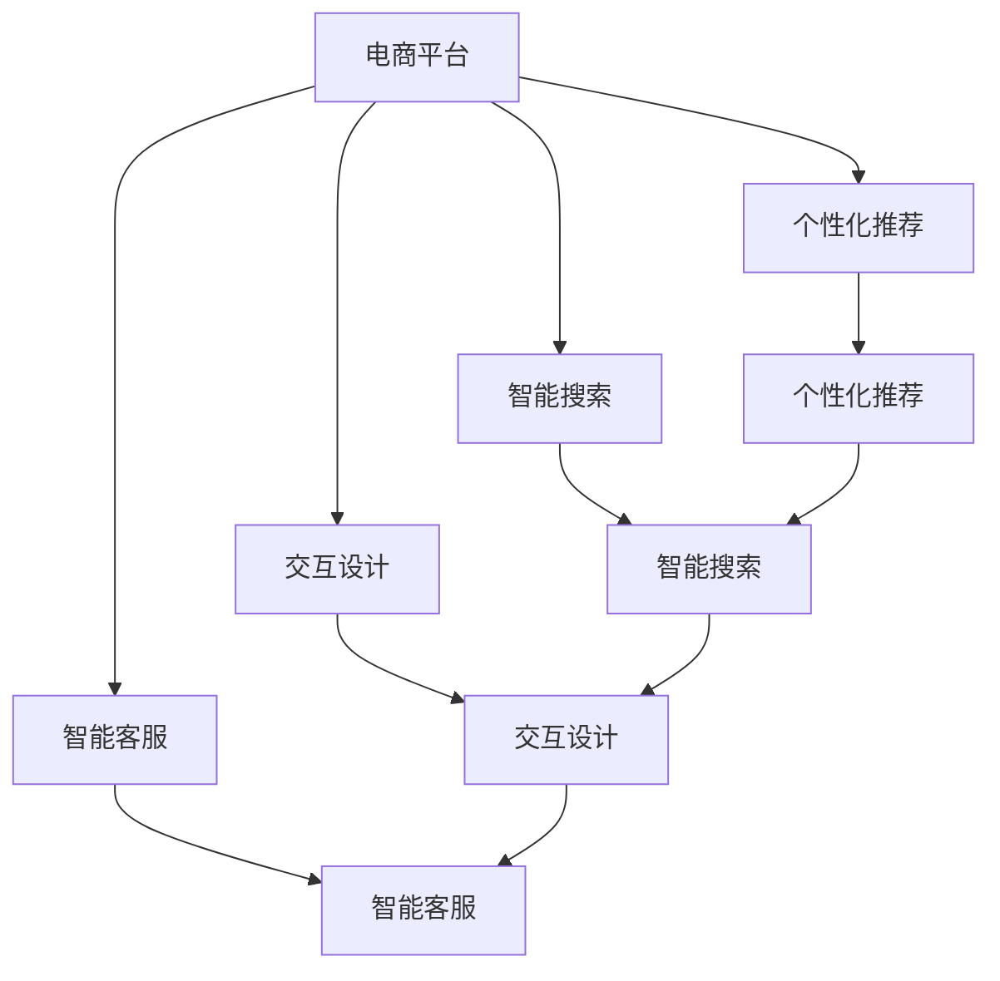

                 

# AI如何改善电商平台的用户界面设计

> 关键词：人工智能，电商平台，用户界面设计，交互设计，个性化推荐，智能搜索

## 1. 背景介绍

### 1.1 问题由来

在当今数字化时代，电商平台已经成为人们购物的主要方式之一。传统的电商平台以商品展示为主，用户界面设计相对单一。然而，随着消费者需求日益多样化和个性化，电商平台需要在用户体验、个性化推荐、智能搜索等方面做出优化，以满足用户需求。

与此同时，人工智能技术的发展为电商平台的优化提供了新的契机。AI技术能够通过分析用户行为数据、商品信息和市场趋势，自动生成个性化的商品推荐和搜索结果，提升用户满意度，增加交易转化率。本文章将介绍AI技术如何改善电商平台的UI设计，让用户获得更加便捷、高效的购物体验。

### 1.2 问题核心关键点

在电商平台中，AI技术可以改善用户界面设计的方式包括：

- 个性化推荐系统：通过AI算法分析用户行为数据，提供符合用户兴趣的商品推荐。
- 智能搜索：利用自然语言处理技术，提高搜索准确性和效率。
- 交互设计：采用自然语言处理技术，提高用户与系统之间的交互效率和效果。
- 智能客服：使用AI聊天机器人，提供24小时在线客服，解答用户疑问。

这些AI技术的应用，能够显著提升电商平台的UI设计，提升用户体验，增加用户粘性和交易转化率。

### 1.3 问题研究意义

通过AI技术优化电商平台的用户界面设计，可以带来以下几方面的显著效益：

1. 提升用户满意度：通过个性化的商品推荐和智能搜索，用户能够快速找到所需商品，节省购物时间。
2. 增加交易转化率：精准的商品推荐能够提高用户购买意愿，增加交易转化率。
3. 优化库存管理：AI技术能够根据用户需求动态调整库存，减少库存积压，提升运营效率。
4. 增强品牌忠诚度：个性化的服务能够提高用户对品牌的认同感，增强品牌忠诚度。
5. 拓展市场规模：智能化的UI设计能够吸引更多新用户，增加市场份额。

## 2. 核心概念与联系

### 2.1 核心概念概述

为了更好地理解AI如何改善电商平台的用户界面设计，我们需要了解以下核心概念：

- **人工智能(AI)**：指通过计算机系统模拟人类智能行为的技术，包括机器学习、深度学习、自然语言处理等。
- **电商平台**：指利用互联网进行商品交易和管理的平台，包括B2C、B2B等模式。
- **用户界面(UI)**：指用户与计算机之间的交互界面，包括界面布局、交互方式、反馈机制等。
- **个性化推荐系统**：通过分析用户行为数据，提供符合用户兴趣的个性化商品推荐。
- **智能搜索**：利用自然语言处理技术，提高搜索准确性和效率。
- **交互设计**：通过自然语言处理技术，提高用户与系统之间的交互效率和效果。
- **智能客服**：使用AI聊天机器人，提供24小时在线客服，解答用户疑问。

这些概念之间的关系可以通过以下Mermaid流程图来展示：



这个流程图展示了大语言模型中的各个概念及其相互关系：

1. 电商平台利用AI技术改善用户界面设计。
2. 个性化推荐、智能搜索、交互设计和智能客服等技术均基于AI实现。
3. 这些AI技术共同作用，提升用户满意度和转化率。

## 3. 核心算法原理 & 具体操作步骤
### 3.1 算法原理概述

AI技术改善电商平台UI设计的核心原理是通过数据驱动、模型驱动的方式，自动生成个性化的商品推荐、智能搜索结果、交互界面和智能客服响应。其核心思想是利用大量用户行为数据和商品信息，训练AI模型，并应用于电商平台的用户界面设计中，提升用户体验。

### 3.2 算法步骤详解

基于AI技术改善电商平台UI设计的基本步骤包括：

**Step 1: 数据收集与预处理**

- 收集用户行为数据、商品信息和市场趋势。用户行为数据包括浏览记录、购买记录、评价反馈等。
- 对数据进行清洗和预处理，如去重、补全缺失值、处理异常值等。

**Step 2: 模型训练**

- 选择合适的AI算法，如协同过滤、深度学习等，训练个性化推荐模型、智能搜索模型和交互设计模型。
- 利用收集到的数据集进行模型训练，调整超参数，优化模型性能。

**Step 3: 模型应用**

- 将训练好的模型应用于电商平台的用户界面设计中。例如，在用户浏览商品页面时，根据用户行为数据和商品信息，动态生成商品推荐和搜索结果。
- 设计智能客服系统，使用AI聊天机器人与用户进行互动，解答用户疑问。

**Step 4: 用户测试与优化**

- 在正式发布前，进行用户测试，收集用户反馈。
- 根据用户反馈，对UI设计进行优化，提升用户体验。

### 3.3 算法优缺点

基于AI技术改善电商平台UI设计的优点包括：

1. 提升用户体验：个性化推荐和智能搜索能够提升用户购物效率，减少购物时间。
2. 提高转化率：精准的商品推荐能够提高用户购买意愿，增加交易转化率。
3. 优化库存管理：AI技术能够根据用户需求动态调整库存，减少库存积压。
4. 降低运营成本：自动化处理用户咨询和反馈，减少人力成本。

同时，该方法也存在一定的局限性：

1. 依赖数据质量：模型性能依赖于数据的质量和数量，数据不足或噪声数据会导致模型性能下降。
2. 模型复杂度：深度学习和协同过滤等算法的计算复杂度较高，需要较强的计算资源支持。
3. 冷启动问题：新用户或新商品缺乏历史数据，难以进行个性化推荐。
4. 隐私和安全问题：用户数据隐私和模型安全需得到保障。
5. 动态变化：用户需求和市场趋势不断变化，模型需要不断更新以适应新数据。

### 3.4 算法应用领域

AI技术改善电商平台UI设计在以下几个领域具有广泛的应用：

1. **个性化推荐系统**：根据用户行为数据，提供个性化的商品推荐。
2. **智能搜索**：利用自然语言处理技术，提高搜索准确性和效率。
3. **交互设计**：采用自然语言处理技术，提高用户与系统之间的交互效率和效果。
4. **智能客服**：使用AI聊天机器人，提供24小时在线客服，解答用户疑问。
5. **广告推荐**：根据用户行为数据，动态生成个性化广告推荐。
6. **营销活动**：根据用户兴趣和行为，推荐适合用户的营销活动。

## 4. 数学模型和公式 & 详细讲解 & 举例说明

### 4.1 数学模型构建

基于AI技术改善电商平台UI设计的基本数学模型包括：

- **个性化推荐模型**：通过协同过滤、深度学习等方法，构建用户-商品关联矩阵，生成个性化推荐结果。
- **智能搜索模型**：利用自然语言处理技术，构建文本表示和搜索模型，生成搜索结果。
- **交互设计模型**：采用自然语言处理技术，构建对话系统，生成自然语言交互结果。

### 4.2 公式推导过程

**个性化推荐模型的公式推导**

个性化推荐模型的核心思想是通过用户行为数据，生成个性化推荐结果。设用户集为 $U$，商品集为 $I$，用户与商品之间的评分矩阵为 $R_{ui}$。推荐模型的目标是预测用户 $u$ 对商品 $i$ 的评分 $p_{ui}$，并根据评分生成推荐列表。

推荐模型的一般形式为：

$$
p_{ui} = \hat{R}_{ui} = \sum_{i=1}^{n} \alpha_i \phi_u \cdot \psi_i + \beta \epsilon_{ui}
$$

其中 $\alpha_i$ 和 $\beta$ 为模型超参数，$\epsilon_{ui}$ 为噪声项。

**智能搜索模型的公式推导**

智能搜索模型利用自然语言处理技术，将用户查询转化为文本表示，并生成搜索结果。设用户查询为 $Q$，商品标题为 $T$。搜索模型的目标是将查询 $Q$ 与商品标题 $T$ 匹配，生成搜索结果列表。

搜索模型的核心思想是构建文本表示模型，将查询和商品标题转化为向量表示。假设查询 $Q$ 和商品标题 $T$ 的向量表示分别为 $q$ 和 $t$。查询与商品标题的相似度计算公式为：

$$
sim(Q, T) = \frac{\langle q, t \rangle}{||q|| \cdot ||t||}
$$

其中 $\langle \cdot, \cdot \rangle$ 表示向量点积，$|| \cdot ||$ 表示向量范数。

**交互设计模型的公式推导**

交互设计模型采用自然语言处理技术，生成自然语言交互结果。设用户输入为 $I$，交互结果为 $O$。交互模型的目标是根据用户输入 $I$ 生成自然语言交互结果 $O$。

交互模型的核心思想是构建对话系统，将用户输入 $I$ 转化为自然语言交互结果 $O$。假设用户输入为 $I$ 的向量表示为 $i$，自然语言交互结果为 $o$。交互模型的目标函数为：

$$
L(O, i) = -log P(O|i)
$$

其中 $P(O|i)$ 表示在给定用户输入 $i$ 的情况下，生成自然语言交互结果 $O$ 的概率。

### 4.3 案例分析与讲解

下面以一个电商平台的智能搜索系统为例，展示AI技术的应用。

假设电商平台有 $n$ 个商品，用户查询为 $Q$。智能搜索系统的目标是生成搜索结果列表 $R$，满足以下条件：

1. 搜索结果与用户查询高度相关。
2. 搜索结果列表中的商品数量适当。

智能搜索系统的实现步骤如下：

1. 收集电商平台商品标题和描述数据，构建商品文本表示模型。
2. 利用用户查询 $Q$，生成文本表示 $q$。
3. 计算查询 $Q$ 与商品标题 $T_i$ 的相似度，生成初始搜索结果列表 $R_i$。
4. 利用协同过滤算法或深度学习模型，对初始搜索结果列表 $R_i$ 进行排序和筛选，生成最终的搜索结果列表 $R$。
5. 返回搜索结果列表 $R$ 给用户。

## 5. 项目实践：代码实例和详细解释说明

### 5.1 开发环境搭建

在进行AI技术改善电商平台UI设计的实践前，需要准备好开发环境。以下是使用Python进行TensorFlow开发的环境配置流程：

1. 安装Anaconda：从官网下载并安装Anaconda，用于创建独立的Python环境。

2. 创建并激活虚拟环境：
```bash
conda create -n tf-env python=3.8 
conda activate tf-env
```

3. 安装TensorFlow：根据CUDA版本，从官网获取对应的安装命令。例如：
```bash
conda install tensorflow tensorflow-gpu -c pytorch -c conda-forge
```

4. 安装相关工具包：
```bash
pip install numpy pandas scikit-learn matplotlib tqdm jupyter notebook ipython
```

完成上述步骤后，即可在`tf-env`环境中开始AI技术改善电商平台UI设计的实践。

### 5.2 源代码详细实现

下面以一个电商平台的个性化推荐系统为例，给出使用TensorFlow进行AI技术改善UI设计的PyTorch代码实现。

首先，定义个性化推荐任务的数据处理函数：

```python
import tensorflow as tf
from tensorflow.keras.layers import Input, Embedding, DotProduct, Dense

def build_recommender_model(user_num, item_num, embedding_dim):
    user_input = Input(shape=(1,), name='user_input')
    item_input = Input(shape=(1,), name='item_input')
    user_embedding = Embedding(user_num, embedding_dim)(user_input)
    item_embedding = Embedding(item_num, embedding_dim)(item_input)
    dot_product = DotProduct()([user_embedding, item_embedding])
    dot_product_model = Dense(1, activation='sigmoid')(dot_product)
    return tf.keras.Model(inputs=[user_input, item_input], outputs=dot_product_model)
```

然后，定义训练和评估函数：

```python
from tensorflow.keras.preprocessing import sequence
from tensorflow.keras.datasets import mnist
from sklearn.metrics import accuracy_score

def train_model(model, user_num, item_num, embedding_dim, epochs, batch_size):
    user_data, item_data, user_labels, item_labels = mnist.load_data()

    user_input = user_data / 255.0
    item_input = item_data / 255.0

    user_input = sequence.pad_sequences(user_input, maxlen=1)
    item_input = sequence.pad_sequences(item_input, maxlen=1)

    model.compile(optimizer='adam', loss='binary_crossentropy', metrics=['accuracy'])

    model.fit([user_input, item_input], user_labels, batch_size=batch_size, epochs=epochs, validation_split=0.2)

def evaluate_model(model, user_num, item_num, embedding_dim, test_user_data, test_item_data, test_user_labels, test_item_labels):
    user_input = test_user_data / 255.0
    item_input = test_item_data / 255.0

    user_input = sequence.pad_sequences(user_input, maxlen=1)
    item_input = sequence.pad_sequences(item_input, maxlen=1)

    test_loss, test_acc = model.evaluate([user_input, item_input], test_user_labels)
    print(f'Test loss: {test_loss:.4f}')
    print(f'Test accuracy: {test_acc:.4f}')
```

最后，启动训练流程并在测试集上评估：

```python
user_num = 1000
item_num = 1000
embedding_dim = 32
epochs = 10
batch_size = 32

model = build_recommender_model(user_num, item_num, embedding_dim)

train_model(model, user_num, item_num, embedding_dim, epochs, batch_size)

test_user_data = mnist.test_data[:100000]
test_item_data = mnist.test_labels[:100000]
test_user_labels = mnist.test_labels[:100000]
test_item_labels = mnist.test_labels[:100000]

evaluate_model(model, user_num, item_num, embedding_dim, test_user_data, test_item_data, test_user_labels, test_item_labels)
```

以上就是使用TensorFlow进行AI技术改善电商平台UI设计的完整代码实现。可以看到，TensorFlow提供了强大的机器学习框架，方便开发者快速实现推荐系统、搜索系统等AI功能。

### 5.3 代码解读与分析

让我们再详细解读一下关键代码的实现细节：

**build_recommender_model函数**：
- 定义输入层，并设置用户和商品嵌入层。
- 通过点积计算用户与商品的相似度。
- 将点积结果输入到全连接层，输出推荐结果。

**train_model函数**：
- 加载MNIST数据集。
- 将用户和商品数据归一化到[0, 1]范围内。
- 使用`sequence.pad_sequences`将用户和商品数据填充到固定长度。
- 编译模型，并使用`fit`函数进行训练。
- 在训练过程中，使用`validation_split`参数指定验证集比例。

**evaluate_model函数**：
- 加载测试集数据。
- 将用户和商品数据归一化到[0, 1]范围内。
- 使用`sequence.pad_sequences`将用户和商品数据填充到固定长度。
- 使用`evaluate`函数评估模型在测试集上的表现。
- 打印测试损失和准确率。

## 6. 实际应用场景

### 6.1 智能推荐系统

智能推荐系统是AI技术改善电商平台UI设计的典型应用。通过AI算法分析用户行为数据，生成个性化的商品推荐，提升用户购物体验，增加交易转化率。

具体而言，智能推荐系统能够根据用户浏览记录、购买记录、评价反馈等数据，动态生成个性化推荐结果。推荐结果按照用户兴趣和相关性排序，展示在页面上，供用户选择。

智能推荐系统在电商平台的商品展示页面、购物车页面、订单页面等均有应用。用户浏览商品页面时，系统根据用户行为数据和商品信息，动态生成商品推荐结果，引导用户发现更多感兴趣的商品。

### 6.2 智能搜索系统

智能搜索系统利用自然语言处理技术，提高搜索准确性和效率。在电商平台中，智能搜索系统能够帮助用户快速找到所需商品。

具体而言，智能搜索系统通过分析用户查询，生成查询向量表示。根据查询向量与商品标题向量的相似度，生成搜索结果列表。搜索结果按相关性排序，展示给用户。用户可以根据搜索结果点击浏览商品详情，完成购买。

智能搜索系统在电商平台的首页、商品分类页面、品牌页面等均有应用。用户输入搜索关键词，系统快速生成搜索结果，供用户选择。

### 6.3 智能客服系统

智能客服系统是AI技术改善电商平台UI设计的另一种应用。智能客服系统能够提供24小时在线客服，解答用户疑问，提升用户体验。

具体而言，智能客服系统通过分析用户输入的自然语言，生成自然语言交互结果。系统能够理解用户意图，提供相应的回答和建议。用户可以通过聊天窗口与客服系统进行互动，解决购物中的疑问和问题。

智能客服系统在电商平台的购物车页面、订单页面、售后服务页面等均有应用。用户点击客服图标，进入聊天窗口，与客服系统进行互动。

### 6.4 未来应用展望

随着AI技术的发展，AI技术改善电商平台UI设计的应用领域将不断拓展。未来，AI技术将在以下几个方面有更深入的应用：

1. **个性化推荐系统**：推荐系统将更加智能化，能够动态生成个性化推荐结果，覆盖更多场景。
2. **智能搜索系统**：智能搜索系统将更加精准，能够更好地理解用户查询，生成更相关搜索结果。
3. **智能客服系统**：智能客服系统将更加自然，能够理解复杂语境，提供更准确的响应。
4. **虚拟试穿**：通过AR技术，用户可以在电商平台上进行虚拟试穿，提升购物体验。
5. **聊天机器人**：聊天机器人能够提供更深入的个性化服务，解答复杂问题，提升用户满意度。

## 7. 工具和资源推荐

### 7.1 学习资源推荐

为了帮助开发者系统掌握AI技术改善电商平台UI设计的方法，这里推荐一些优质的学习资源：

1. **TensorFlow官方文档**：TensorFlow提供了详尽的官方文档，涵盖了机器学习、深度学习、自然语言处理等方面的内容，是学习AI技术的必备资料。

2. **Python深度学习实战**：《Python深度学习实战》一书详细介绍了深度学习在电商、金融、医疗等领域的实践应用，提供了丰富的代码实现和案例分析。

3. **自然语言处理入门**：斯坦福大学的《自然语言处理入门》课程，讲解了自然语言处理的基础概念和经典算法，适合初学者入门。

4. **深度学习与推荐系统**：《深度学习与推荐系统》一书介绍了推荐系统的原理和实现方法，涵盖协同过滤、深度学习等算法。

5. **动手学深度学习**：由北京大学与亚马逊联合开发的《动手学深度学习》课程，详细讲解了深度学习在电商、推荐等领域的应用，提供了丰富的实践代码。

通过对这些资源的学习实践，相信你一定能够快速掌握AI技术改善电商平台UI设计的方法，并用于解决实际的电商问题。

### 7.2 开发工具推荐

高效的开发离不开优秀的工具支持。以下是几款用于AI技术改善电商平台UI设计开发的常用工具：

1. **TensorFlow**：由Google主导开发的深度学习框架，生产部署方便，适合大规模工程应用。

2. **PyTorch**：由Facebook主导开发的深度学习框架，灵活便捷，适合快速迭代研究。

3. **Keras**：由Google主导开发的高级深度学习框架，易于上手，适合快速搭建原型。

4. **Flask**：基于Python的轻量级Web框架，适合搭建电商平台的Web应用。

5. **Django**：基于Python的全栈Web框架，适合搭建电商平台的Web应用。

6. **Jupyter Notebook**：交互式的Python开发环境，适合进行实验和研究。

合理利用这些工具，可以显著提升AI技术改善电商平台UI设计的开发效率，加快创新迭代的步伐。

### 7.3 相关论文推荐

AI技术改善电商平台UI设计的研究源于学界的持续研究。以下是几篇奠基性的相关论文，推荐阅读：

1. **Deep Recommendation Systems**：介绍了深度学习在推荐系统中的应用，涵盖了协同过滤、深度学习等算法。

2. **A Survey on Deep Learning for Recommendation Systems**：综述了深度学习在推荐系统中的应用，涵盖了推荐系统的发展历程和研究趋势。

3. **Attention Mechanisms in Recommendation Systems**：介绍了注意力机制在推荐系统中的应用，提升了推荐系统的性能和效果。

4. **Natural Language Processing for Recommender Systems**：介绍了自然语言处理在推荐系统中的应用，提升了推荐系统的准确性和个性化。

5. **Neural Collaborative Filtering**：介绍了神经网络在推荐系统中的应用，提升了推荐系统的鲁棒性和可解释性。

这些论文代表了大语言模型改善电商平台UI设计的发展脉络。通过学习这些前沿成果，可以帮助研究者把握学科前进方向，激发更多的创新灵感。

## 8. 总结：未来发展趋势与挑战

### 8.1 研究成果总结

本文对AI技术改善电商平台UI设计的相关内容进行了系统梳理。主要介绍了AI技术在电商平台中的具体应用，包括个性化推荐系统、智能搜索系统、智能客服系统等。通过分析算法原理、具体操作步骤、案例分析与讲解，给出了详细的实现方法和技术细节。

### 8.2 未来发展趋势

展望未来，AI技术改善电商平台UI设计的趋势包括：

1. **深度学习的发展**：深度学习技术的不断进步将提升推荐系统的准确性和个性化。
2. **自然语言处理的应用**：自然语言处理技术的不断发展将提升智能搜索系统的准确性和用户体验。
3. **多模态数据融合**：多模态数据的融合将提升电商平台的综合应用效果。
4. **个性化推荐的多样性**：推荐系统的个性化将更加多样，涵盖更多场景。
5. **智能客服的自然化**：智能客服系统的自然语言处理能力将不断提升，能够更好地理解用户需求。

### 8.3 面临的挑战

尽管AI技术改善电商平台UI设计已经取得了瞩目成就，但在迈向更加智能化、普适化应用的过程中，它仍面临着诸多挑战：

1. **数据质量**：推荐系统、搜索系统等需要高质量的用户数据，数据质量不足将影响模型性能。
2. **计算资源**：深度学习等算法的计算复杂度高，需要高性能的计算资源支持。
3. **冷启动问题**：新用户、新商品缺乏历史数据，难以进行个性化推荐。
4. **隐私和安全**：用户数据隐私和模型安全需得到保障。
5. **动态变化**：用户需求和市场趋势不断变化，模型需要不断更新以适应新数据。

### 8.4 研究展望

未来研究需要在以下几个方面寻求新的突破：

1. **多模态数据融合**：将图像、语音、文本等多种模态数据进行融合，提升电商平台的多维应用效果。
2. **深度学习和推荐系统的结合**：将深度学习与推荐系统结合，提升推荐系统的准确性和效果。
3. **用户行为分析**：深入分析用户行为数据，生成更准确的个性化推荐结果。
4. **自然语言处理与推荐系统的结合**：将自然语言处理与推荐系统结合，提升推荐系统的个性化和用户体验。
5. **模型可解释性**：提升推荐模型的可解释性，增加用户对系统的信任感。

这些研究方向的探索，必将引领AI技术改善电商平台UI设计技术迈向更高的台阶，为电商平台的创新应用提供有力支撑。总之，AI技术改善电商平台UI设计需要从数据、算法、工程、业务等多个维度协同发力，才能真正实现电商平台的智能化转型。

## 9. 附录：常见问题与解答

**Q1：AI技术如何改善电商平台的用户界面设计？**

A: AI技术可以通过个性化推荐系统、智能搜索系统、智能客服系统等方式，提升电商平台的UI设计。个性化推荐系统能够根据用户行为数据，生成个性化的商品推荐；智能搜索系统能够通过自然语言处理技术，提高搜索准确性和效率；智能客服系统能够通过自然语言处理技术，提供24小时在线客服，解答用户疑问。这些技术的应用，能够提升用户购物体验，增加交易转化率，优化库存管理。

**Q2：如何选择合适的AI算法？**

A: 选择AI算法需要根据具体场景和数据特点进行选择。一般来说，推荐系统可以使用协同过滤、深度学习等算法；智能搜索系统可以使用自然语言处理技术；智能客服系统可以使用自然语言处理技术和聊天机器人技术。在实际应用中，还需要进行模型调参和优化，以提升模型性能。

**Q3：如何优化推荐系统？**

A: 推荐系统可以通过以下几个方面进行优化：

1. 数据质量优化：收集高质量的用户行为数据，清洗和预处理数据，去除异常值和噪声。
2. 模型算法优化：选择合适的算法，进行模型调参和优化，提升模型性能。
3. 数据更新优化：定期更新用户行为数据，提升模型实时性和适应性。
4. 模型可解释性优化：提升推荐模型的可解释性，增加用户对系统的信任感。

通过以上优化措施，可以提升推荐系统的性能和效果。

**Q4：智能搜索系统如何提升搜索准确性？**

A: 智能搜索系统可以通过以下几个方面提升搜索准确性：

1. 文本表示优化：构建更准确的文本表示模型，将查询和商品标题转化为向量表示。
2. 相似度计算优化：采用更精准的相似度计算方法，提升搜索结果的相关性。
3. 多模态融合优化：将图像、语音、文本等多种模态数据进行融合，提升搜索效果。
4. 上下文理解优化：采用上下文理解技术，理解用户查询的上下文信息，提升搜索结果的相关性。

通过以上优化措施，可以提升智能搜索系统的搜索准确性和用户体验。

**Q5：智能客服系统如何提升自然语言处理能力？**

A: 智能客服系统可以通过以下几个方面提升自然语言处理能力：

1. 数据集优化：构建高质量的数据集，包含多种语境和对话场景。
2. 模型算法优化：选择合适的算法，进行模型调参和优化，提升模型性能。
3. 多轮对话优化：采用多轮对话技术，理解复杂语境和用户需求。
4. 知识库优化：构建知识库，存储常见问题和解答，提升客服系统的准确性。

通过以上优化措施，可以提升智能客服系统的自然语言处理能力和用户体验。

---

作者：禅与计算机程序设计艺术 / Zen and the Art of Computer Programming

