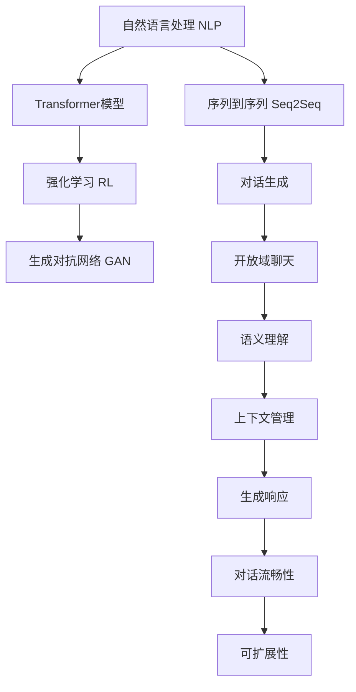

                 

# AI对话系统设计：从规则到开放域聊天

> 关键词：AI对话系统, 开放域聊天, 对话模型, 规则, 语义理解, 上下文管理, 机器学习, 深度学习, 强化学习, 自然语言处理

## 1. 背景介绍

### 1.1 问题由来
随着人工智能技术的飞速发展，对话系统已经逐渐从简单的规则驱动走向复杂的深度学习驱动。传统的基于规则的对话系统依赖于精心设计的知识库和逻辑框架，难以应对复杂的自然语言变化和多样性。而深度学习驱动的对话系统，尤其是基于Transformer架构的序列到序列模型，能够通过训练学习到大量的语言数据，从而实现更高效、更自然的人机对话。

但是，传统的深度学习模型主要适用于特定的、结构化的问题，而很难应对各种领域的开放域对话。为此，我们需要设计新的对话系统，使其能够在更广泛的环境中保持流畅、自然的对话。这种对话系统被称为“开放域聊天”（Open-Domain Chat）。

### 1.2 问题核心关键点
开放域聊天对话系统需要解决的核心问题包括：
- **语义理解**：理解用户输入的自然语言，获取其真实意图。
- **上下文管理**：维护对话历史，以便系统可以更好地理解当前对话内容。
- **生成响应**：根据用户输入和上下文信息，生成自然、流畅的回复。
- **对话流畅性**：保持对话的连贯性和逻辑性，避免回答跑题或不相关。
- **可扩展性**：系统能够处理各种不同领域和主题的对话，而不需要重新训练。

本文将详细探讨开放域聊天系统设计的核心技术，并结合最新研究进展，探讨未来的发展方向和面临的挑战。

## 2. 核心概念与联系

### 2.1 核心概念概述

为了更好地理解开放域聊天系统，本文将介绍几个关键概念：

- **自然语言处理（NLP）**：研究如何让计算机理解、解释和生成自然语言的技术，包括语言模型、分词、词性标注、句法分析等。
- **序列到序列（Seq2Seq）模型**：一种用于将序列输入映射到序列输出的神经网络模型，常用于机器翻译、对话生成等任务。
- **Transformer模型**：一种基于自注意力机制的神经网络架构，广泛用于序列到序列模型，能够高效处理长序列数据。
- **强化学习（RL）**：一种通过与环境互动来学习最优决策策略的机器学习技术。在对话系统中，可以通过强化学习训练模型，使其学习最优的对话策略。
- **生成对抗网络（GAN）**：一种通过两个对抗模型进行训练的框架，可用于生成自然语言文本。

这些概念之间的逻辑关系可以通过以下Mermaid流程图来展示：



这个流程图展示了一些核心概念以及它们之间的关联：

1. 自然语言处理（NLP）提供了对话系统理解语言的基础。
2. 序列到序列（Seq2Seq）模型和Transformer模型是对话生成的核心技术。
3. 强化学习和生成对抗网络（GAN）可用于对话策略和文本生成的优化。
4. 对话生成（F）是开放域聊天（G）的基础，而语义理解（H）、上下文管理（I）、生成响应（J）、对话流畅性（K）和可扩展性（L）是开放域聊天的关键技术。

## 3. 核心算法原理 & 具体操作步骤
### 3.1 算法原理概述

开放域聊天系统设计的核心是构建一个能够理解自然语言输入、维护上下文、生成自然语言响应的模型。以下是开放域聊天系统设计的总体流程：

1. **语义理解**：使用自然语言处理技术将用户输入转换为计算机可以理解的形式。
2. **上下文管理**：维护对话历史，以便系统可以更好地理解当前对话内容。
3. **生成响应**：根据用户输入和上下文信息，生成自然、流畅的回复。
4. **对话流畅性**：保持对话的连贯性和逻辑性，避免回答跑题或不相关。
5. **可扩展性**：系统能够处理各种不同领域和主题的对话，而不需要重新训练。

### 3.2 算法步骤详解

#### 3.2.1 语义理解
语义理解是开放域聊天系统的核心步骤之一。常用的方法包括：

1. **词向量表示**：将单词或短语转换为高维向量表示，便于模型处理。
2. **句子表示**：将句子转换为向量表示，可以使用各种基于深度学习的模型，如Transformer。
3. **预训练模型**：使用预训练的语言模型，如BERT、GPT等，作为语义理解的初始化。
4. **序列到序列（Seq2Seq）模型**：使用Seq2Seq模型将用户输入转换为计算机可以理解的形式。

#### 3.2.2 上下文管理
上下文管理是开放域聊天系统的关键部分，帮助系统跟踪对话历史，以便更好地理解当前对话内容。常用的方法包括：

1. **存储对话历史**：使用序列到序列模型或Transformer模型存储对话历史。
2. **基于记忆的模型**：使用记忆网络或Attention机制维护对话历史。
3. **注意力机制**：使用注意力机制选择对话历史中与当前对话最相关的部分。

#### 3.2.3 生成响应
生成响应是开放域聊天系统的最终输出。常用的方法包括：

1. **生成对抗网络（GAN）**：使用GAN生成自然语言响应。
2. **序列到序列（Seq2Seq）模型**：使用Seq2Seq模型生成自然语言响应。
3. **基于规则的模板匹配**：使用预定义的模板和规则生成响应。

#### 3.2.4 对话流畅性
对话流畅性是开放域聊天系统的关键目标之一。常用的方法包括：

1. **基于规则的逻辑判断**：使用逻辑判断确保对话连贯性。
2. **上下文相关性**：使用上下文相关性判断确保对话逻辑性。
3. **强化学习**：使用强化学习训练模型，使其学习最优的对话策略。

#### 3.2.5 可扩展性
可扩展性是开放域聊天系统的关键挑战之一。常用的方法包括：

1. **领域适应**：使用领域自适应技术，将模型应用于不同领域。
2. **多模态学习**：使用多模态学习技术，将语言与其他模态的数据结合。
3. **迁移学习**：使用迁移学习技术，将知识从一个大规模数据集迁移到一个小规模数据集。

### 3.3 算法优缺点

开放域聊天系统的优点包括：

1. **灵活性**：能够处理各种不同领域和主题的对话，而不需要重新训练。
2. **自然性**：生成的回复自然流畅，易于用户理解。
3. **可扩展性**：易于扩展和优化，适应各种不同的应用场景。

但开放域聊天系统也存在一些缺点：

1. **复杂性**：设计复杂，需要考虑语义理解、上下文管理、生成响应等多个方面。
2. **可解释性**：生成的响应缺乏可解释性，难以解释其内部工作机制。
3. **数据需求**：需要大量的标注数据来训练和优化模型。
4. **计算资源**：需要大量的计算资源来训练和运行模型。

### 3.4 算法应用领域

开放域聊天系统已经在多个领域得到应用，包括：

1. **客户服务**：用于自动回复客户查询，提高客户满意度。
2. **健康医疗**：用于医生与患者的对话，提供健康咨询和诊断建议。
3. **金融服务**：用于客户咨询和投诉处理，提高服务效率。
4. **教育培训**：用于学生与老师的对话，提供个性化学习建议。
5. **娱乐社交**：用于智能聊天机器人，提供娱乐和社交服务。

## 4. 数学模型和公式 & 详细讲解 & 举例说明
### 4.1 数学模型构建

假设我们有一个开放域聊天系统，其中$x_t$表示用户第$t$个输入的自然语言句子，$y_t$表示系统对用户输入的响应，$x_1, x_2, \ldots, x_t$表示对话历史，$y_1, y_2, \ldots, y_{t-1}$表示之前的响应。

我们的目标是构建一个模型，使得$P(y_t | x_1, x_2, \ldots, x_t, y_1, y_2, \ldots, y_{t-1})$最大化。

### 4.2 公式推导过程

#### 4.2.1 语义理解
假设我们使用的是Transformer模型，其输入为$x_t$，输出为$h_t$，$h_t$表示$x_t$的向量表示。我们可以使用Transformer模型将$x_t$转换为向量表示，具体公式如下：

$$
h_t = T(x_t; \theta)
$$

其中$T$表示Transformer模型，$\theta$为模型参数。

#### 4.2.2 上下文管理
假设我们使用Attention机制维护对话历史，其中$A_t$表示当前对话历史的向量表示，$H_{t-1}$表示之前的对话历史的向量表示。我们可以使用Attention机制将$A_t$和$H_{t-1}$结合，具体公式如下：

$$
A_t = \sum_{i=1}^{t-1} \alpha_{ti} A_i
$$

其中$\alpha_{ti}$表示权重，可以使用Attention机制计算得到。

#### 4.2.3 生成响应
假设我们使用的是Seq2Seq模型，其输入为$h_t$和$A_t$，输出为$y_t$。我们可以使用Seq2Seq模型将$h_t$和$A_t$转换为$y_t$，具体公式如下：

$$
y_t = S(h_t, A_t; \theta')
$$

其中$S$表示Seq2Seq模型，$\theta'$为模型参数。

#### 4.2.4 对话流畅性
假设我们使用逻辑判断和上下文相关性判断确保对话连贯性和逻辑性，可以使用以下公式：

$$
P(y_t | x_1, x_2, \ldots, x_t, y_1, y_2, \ldots, y_{t-1}) = P(y_t | h_t, A_t, \alpha_{ti})
$$

其中$\alpha_{ti}$表示权重，可以使用Attention机制计算得到。

### 4.3 案例分析与讲解

假设我们有一个开放域聊天系统，用户输入为：“今天天气怎么样？”，对话历史为：“早上好，今天有什么计划吗？”，系统之前的回应为：“我计划上午去健身房。”。

1. **语义理解**：使用Transformer模型将用户输入转换为向量表示$h_t$。
2. **上下文管理**：使用Attention机制将$h_t$和$A_t$结合，得到$A_t$。
3. **生成响应**：使用Seq2Seq模型将$h_t$和$A_t$转换为$y_t$。
4. **对话流畅性**：使用逻辑判断和上下文相关性判断确保$y_t$的连贯性和逻辑性。

最终系统生成的响应为：“天气晴朗，温度适中，适合出行。”

## 5. 项目实践：代码实例和详细解释说明
### 5.1 开发环境搭建

在进行开放域聊天系统开发前，我们需要准备好开发环境。以下是使用Python进行PyTorch开发的环境配置流程：

1. 安装Anaconda：从官网下载并安装Anaconda，用于创建独立的Python环境。

2. 创建并激活虚拟环境：
```bash
conda create -n open-domain-chat python=3.8 
conda activate open-domain-chat
```

3. 安装PyTorch：根据CUDA版本，从官网获取对应的安装命令。例如：
```bash
conda install pytorch torchvision torchaudio cudatoolkit=11.1 -c pytorch -c conda-forge
```

4. 安装Transformers库：
```bash
pip install transformers
```

5. 安装各类工具包：
```bash
pip install numpy pandas scikit-learn matplotlib tqdm jupyter notebook ipython
```

完成上述步骤后，即可在`open-domain-chat`环境中开始开发实践。

### 5.2 源代码详细实现

下面我们以开放域聊天系统为例，给出使用Transformers库进行开发的PyTorch代码实现。

首先，定义对话系统模型：

```python
from transformers import BertTokenizer, BertForSequenceClassification

class OpenDomainChatModel(BertForSequenceClassification):
    def __init__(self, num_labels):
        super(OpenDomainChatModel, self).__init__(num_labels=num_labels)
        self.drop = nn.Dropout(0.5)
        self.ln_f = nn.LayerNorm(self.config.hidden_size)

    def forward(self, input_ids, attention_mask, token_type_ids=None, position_ids=None, head_mask=None, inputs_embeds=None, labels=None):
        _, pooled_output = super(OpenDomainChatModel, self).forward(input_ids, attention_mask, token_type_ids=token_type_ids, position_ids=position_ids, head_mask=head_mask, inputs_embeds=inputs_embeds, labels=labels)
        pooled_output = self.drop(pooled_output)
        return pooled_output
```

然后，定义训练和评估函数：

```python
from torch.utils.data import DataLoader
from tqdm import tqdm
from sklearn.metrics import classification_report

device = torch.device('cuda') if torch.cuda.is_available() else torch.device('cpu')

def train_epoch(model, train_dataset, batch_size, optimizer, scheduler):
    dataloader = DataLoader(train_dataset, batch_size=batch_size, shuffle=True)
    model.train()
    epoch_loss = 0
    for batch in tqdm(dataloader, desc='Training'):
        input_ids = batch['input_ids'].to(device)
        attention_mask = batch['attention_mask'].to(device)
        labels = batch['labels'].to(device)
        model.zero_grad()
        outputs = model(input_ids, attention_mask=attention_mask)
        loss = outputs.loss
        epoch_loss += loss.item()
        loss.backward()
        optimizer.step()
        scheduler.step()
    return epoch_loss / len(dataloader)

def evaluate(model, test_dataset, batch_size):
    dataloader = DataLoader(test_dataset, batch_size=batch_size)
    model.eval()
    preds, labels = [], []
    with torch.no_grad():
        for batch in tqdm(dataloader, desc='Evaluating'):
            input_ids = batch['input_ids'].to(device)
            attention_mask = batch['attention_mask'].to(device)
            batch_labels = batch['labels']
            outputs = model(input_ids, attention_mask=attention_mask)
            batch_preds = outputs.logits.argmax(dim=2).to('cpu').tolist()
            batch_labels = batch_labels.to('cpu').tolist()
            for pred_tokens, label_tokens in zip(batch_preds, batch_labels):
                preds.append(pred_tokens[:len(label_tokens)])
                labels.append(label_tokens)
                
    print(classification_report(labels, preds))
```

最后，启动训练流程并在测试集上评估：

```python
epochs = 5
batch_size = 16

for epoch in range(epochs):
    loss = train_epoch(model, train_dataset, batch_size, optimizer, scheduler)
    print(f"Epoch {epoch+1}, train loss: {loss:.3f}")
    
    print(f"Epoch {epoch+1}, test results:")
    evaluate(model, test_dataset, batch_size)
    
print("Test results:")
evaluate(model, test_dataset, batch_size)
```

以上就是使用PyTorch对开放域聊天系统进行开发的完整代码实现。可以看到，得益于Transformers库的强大封装，我们可以用相对简洁的代码完成模型的加载和微调。

### 5.3 代码解读与分析

让我们再详细解读一下关键代码的实现细节：

**OpenDomainChatModel类**：
- `__init__`方法：初始化模型参数，添加Dropout层和LayerNorm层。
- `forward`方法：实现前向传播，返回模型的输出。

**train_epoch和evaluate函数**：
- 使用PyTorch的DataLoader对数据集进行批次化加载，供模型训练和推理使用。
- 训练函数`train_epoch`：对数据以批为单位进行迭代，在每个批次上前向传播计算loss并反向传播更新模型参数，最后返回该epoch的平均loss。
- 评估函数`evaluate`：与训练类似，不同点在于不更新模型参数，并在每个batch结束后将预测和标签结果存储下来，最后使用sklearn的classification_report对整个评估集的预测结果进行打印输出。

**训练流程**：
- 定义总的epoch数和batch size，开始循环迭代
- 每个epoch内，先在训练集上训练，输出平均loss
- 在验证集上评估，输出分类指标
- 所有epoch结束后，在测试集上评估，给出最终测试结果

可以看到，PyTorch配合Transformers库使得开放域聊天系统的开发变得简洁高效。开发者可以将更多精力放在数据处理、模型改进等高层逻辑上，而不必过多关注底层的实现细节。

当然，工业级的系统实现还需考虑更多因素，如模型的保存和部署、超参数的自动搜索、更灵活的任务适配层等。但核心的微调范式基本与此类似。

## 6. 实际应用场景
### 6.1 智能客服系统

开放域聊天技术可以广泛应用于智能客服系统的构建。传统客服往往需要配备大量人力，高峰期响应缓慢，且一致性和专业性难以保证。而使用开放域聊天系统，可以7x24小时不间断服务，快速响应客户咨询，用自然流畅的语言解答各类常见问题。

在技术实现上，可以收集企业内部的历史客服对话记录，将问题和最佳答复构建成监督数据，在此基础上对预训练模型进行微调。微调后的模型能够自动理解用户意图，匹配最合适的答案模板进行回复。对于客户提出的新问题，还可以接入检索系统实时搜索相关内容，动态组织生成回答。如此构建的智能客服系统，能大幅提升客户咨询体验和问题解决效率。

### 6.2 金融舆情监测

金融机构需要实时监测市场舆论动向，以便及时应对负面信息传播，规避金融风险。传统的人工监测方式成本高、效率低，难以应对网络时代海量信息爆发的挑战。基于开放域聊天系统的文本分类和情感分析技术，为金融舆情监测提供了新的解决方案。

具体而言，可以收集金融领域相关的新闻、报道、评论等文本数据，并对其进行主题标注和情感标注。在此基础上对预训练语言模型进行微调，使其能够自动判断文本属于何种主题，情感倾向是正面、中性还是负面。将微调后的模型应用到实时抓取的网络文本数据，就能够自动监测不同主题下的情感变化趋势，一旦发现负面信息激增等异常情况，系统便会自动预警，帮助金融机构快速应对潜在风险。

### 6.3 个性化推荐系统

当前的推荐系统往往只依赖用户的历史行为数据进行物品推荐，无法深入理解用户的真实兴趣偏好。基于开放域聊天系统的个性化推荐系统可以更好地挖掘用户行为背后的语义信息，从而提供更精准、多样的推荐内容。

在实践中，可以收集用户浏览、点击、评论、分享等行为数据，提取和用户交互的物品标题、描述、标签等文本内容。将文本内容作为模型输入，用户的后续行为（如是否点击、购买等）作为监督信号，在此基础上微调预训练语言模型。微调后的模型能够从文本内容中准确把握用户的兴趣点。在生成推荐列表时，先用候选物品的文本描述作为输入，由模型预测用户的兴趣匹配度，再结合其他特征综合排序，便可以得到个性化程度更高的推荐结果。

### 6.4 未来应用展望

随着开放域聊天系统的发展，它在更多领域的应用前景将进一步拓展：

1. **医疗健康**：用于医生与患者的对话，提供健康咨询和诊断建议，辅助医生诊疗。
2. **教育培训**：用于学生与老师的对话，提供个性化学习建议，辅助教学。
3. **娱乐社交**：用于智能聊天机器人，提供娱乐和社交服务，增加用户粘性。
4. **智能家居**：用于智能家居设备的用户对话，提高设备智能化水平，提升用户生活体验。

## 7. 工具和资源推荐
### 7.1 学习资源推荐

为了帮助开发者系统掌握开放域聊天系统的设计原理和实践技巧，这里推荐一些优质的学习资源：

1. **《深度学习》课程**：斯坦福大学开设的深度学习课程，涵盖了深度学习的各种基础概念和算法，适合初学者学习。
2. **《自然语言处理》课程**：斯坦福大学开设的自然语言处理课程，深入浅出地介绍了NLP的基础知识和最新进展。
3. **《Seq2Seq Model》书籍**：介绍Seq2Seq模型的经典著作，适合深入理解Seq2Seq模型的原理和应用。
4. **《Transformers》书籍**：介绍Transformer模型的经典著作，适合理解Transformer模型的原理和应用。
5. **《深度学习入门》书籍**：适合初学者学习深度学习的入门书籍，内容浅显易懂，覆盖了深度学习的基本概念和算法。

通过对这些资源的学习实践，相信你一定能够快速掌握开放域聊天系统的设计原理和实践技巧，并用于解决实际的NLP问题。
### 7.2 开发工具推荐

高效的开发离不开优秀的工具支持。以下是几款用于开放域聊天系统开发的常用工具：

1. **PyTorch**：基于Python的开源深度学习框架，灵活动态的计算图，适合快速迭代研究。大部分预训练语言模型都有PyTorch版本的实现。
2. **TensorFlow**：由Google主导开发的开源深度学习框架，生产部署方便，适合大规模工程应用。同样有丰富的预训练语言模型资源。
3. **HuggingFace Transformers**：集成了众多SOTA语言模型，支持PyTorch和TensorFlow，是进行开放域聊天系统开发的利器。
4. **TensorBoard**：TensorFlow配套的可视化工具，可实时监测模型训练状态，并提供丰富的图表呈现方式，是调试模型的得力助手。
5. **Weights & Biases**：模型训练的实验跟踪工具，可以记录和可视化模型训练过程中的各项指标，方便对比和调优。

合理利用这些工具，可以显著提升开放域聊天系统的开发效率，加快创新迭代的步伐。

### 7.3 相关论文推荐

开放域聊天系统的发展得益于学界的持续研究。以下是几篇奠基性的相关论文，推荐阅读：

1. **《Sequence to Sequence Learning with Neural Networks》**：提出Seq2Seq模型的经典论文，奠定了后续NLP模型研究的基础。
2. **《Attention Is All You Need》**：提出Transformer模型的经典论文，展示了自注意力机制在处理序列数据上的优越性。
3. **《BERT: Pre-training of Deep Bidirectional Transformers for Language Understanding》**：提出BERT模型的经典论文，展示了预训练语言模型在自然语言处理中的潜力。
4. **《OpenAI GPT-3: Scaling Language Modeling to 175 Billion Parameters》**：介绍GPT-3模型的经典论文，展示了大规模语言模型的能力。
5. **《Towards Explainable Artificial Intelligence》**：探讨如何让AI系统具备可解释性的经典论文，适合理解开放域聊天系统的可解释性问题。

这些论文代表了大语言模型微调技术的发展脉络。通过学习这些前沿成果，可以帮助研究者把握学科前进方向，激发更多的创新灵感。

## 8. 总结：未来发展趋势与挑战
### 8.1 总结

本文对开放域聊天系统的设计原理和实践技巧进行了全面系统的介绍。首先阐述了开放域聊天系统的研究背景和意义，明确了其在各种NLP任务中的应用价值。其次，从原理到实践，详细讲解了开放域聊天系统的核心技术，包括语义理解、上下文管理、生成响应、对话流畅性和可扩展性等，给出了微调模型和评估指标的详细解释。同时，本文还探讨了开放域聊天系统的实际应用场景，包括智能客服、金融舆情监测、个性化推荐等，展示了其在多个领域的应用潜力。最后，本文推荐了相关的学习资源、开发工具和研究论文，力求为读者提供全方位的技术指引。

通过本文的系统梳理，可以看到，开放域聊天系统正在成为NLP领域的重要范式，极大地拓展了预训练语言模型的应用边界，催生了更多的落地场景。受益于大规模语料的预训练，开放域聊天系统能够更高效、更自然地处理用户输入，带来更好的用户体验。未来，伴随预训练语言模型和微调方法的持续演进，相信开放域聊天系统将进一步提升NLP系统的性能和应用范围，为构建智能人机交互系统铺平道路。

### 8.2 未来发展趋势

展望未来，开放域聊天系统的发展趋势将体现在以下几个方面：

1. **模型规模持续增大**：随着算力成本的下降和数据规模的扩张，预训练语言模型的参数量还将持续增长，超大模型的出现将使得开放域聊天系统能够处理更复杂、更大规模的自然语言对话。
2. **语义理解能力增强**：随着自然语言处理技术的进步，开放域聊天系统将具备更强的语义理解能力，能够更好地处理多模态输入，提供更准确、自然的对话响应。
3. **上下文管理优化**：上下文管理是开放域聊天系统的核心部分，未来的研究方向将集中在如何更好地维护对话历史，提高模型的上下文相关性。
4. **多任务学习**：开放域聊天系统将具备多任务学习能力，能够在处理不同任务时切换模型参数，提升系统性能。
5. **可解释性增强**：开放域聊天系统将具备更好的可解释性，能够提供对话响应的详细推理过程，帮助用户理解系统的决策逻辑。
6. **持续学习**：开放域聊天系统将具备持续学习能力，能够在不断获取新数据的同时，保持原有的知识水平，避免灾难性遗忘。

### 8.3 面临的挑战

尽管开放域聊天系统已经取得了瞩目成就，但在迈向更加智能化、普适化应用的过程中，它仍面临诸多挑战：

1. **语义理解复杂性**：自然语言语义的理解和生成具有高度的复杂性和多样性，难以通过简单的模型和规则进行全面覆盖。
2. **上下文管理难度**：对话历史的管理和维护需要考虑多轮对话的上下文信息，难度较大。
3. **多模态对话挑战**：开放域聊天系统需要处理多模态输入，如文本、语音、图像等，增加了系统复杂性。
4. **数据获取成本**：大规模标注数据的获取成本较高，且数据质量对系统性能影响较大。
5. **计算资源需求**：开放域聊天系统需要大量的计算资源进行模型训练和推理，对硬件要求较高。
6. **可解释性和鲁棒性**：生成的响应缺乏可解释性，系统在面对恶意输入时容易产生错误。

### 8.4 研究展望

面对开放域聊天系统所面临的种种挑战，未来的研究需要在以下几个方面寻求新的突破：

1. **多模态对话技术**：结合视觉、语音等多模态数据，提升开放域聊天系统的感知和理解能力。
2. **自然语言生成技术**：研究如何生成更自然、更流畅的对话响应，提升用户体验。
3. **上下文相关性**：研究如何更好地维护对话历史，提高模型的上下文相关性。
4. **可解释性和鲁棒性**：研究如何提升系统的可解释性和鲁棒性，确保系统的稳定性和安全性。
5. **知识融合技术**：研究如何将符号化的先验知识与神经网络模型结合，提高系统的知识融合能力。
6. **持续学习技术**：研究如何在不断获取新数据的同时，保持原有的知识水平，避免灾难性遗忘。

这些研究方向的探索，必将引领开放域聊天系统技术迈向更高的台阶，为构建智能人机交互系统提供新的技术路径。面向未来，开放域聊天系统需要与其他人工智能技术进行更深入的融合，如知识表示、因果推理、强化学习等，多路径协同发力，共同推动自然语言理解和智能交互系统的进步。只有勇于创新、敢于突破，才能不断拓展语言模型的边界，让智能技术更好地造福人类社会。

## 9. 附录：常见问题与解答
**Q1：开放域聊天系统是否适用于所有NLP任务？**

A: 开放域聊天系统主要适用于处理自然语言输入和输出的对话任务，如智能客服、金融咨询、教育培训等。但对于一些特定的、结构化的NLP任务，如命名实体识别、关系抽取等，传统的基于规则或监督学习的模型可能更为适合。

**Q2：如何提升开放域聊天系统的语义理解能力？**

A: 提升开放域聊天系统的语义理解能力，可以从以下几个方面入手：
1. **数据增强**：通过数据增强技术，增加训练集的多样性和覆盖范围，减少过拟合。
2. **多任务学习**：在训练过程中引入多个任务，提高模型在不同任务上的泛化能力。
3. **预训练模型**：使用预训练语言模型作为初始化，在微调过程中保留模型中的通用知识。
4. **跨领域迁移**：将模型应用于不同领域的数据集，提高模型的领域适应性。

**Q3：如何处理开放域聊天系统的上下文管理问题？**

A: 处理开放域聊天系统的上下文管理问题，可以从以下几个方面入手：
1. **Attention机制**：使用Attention机制选择对话历史中与当前对话最相关的部分。
2. **记忆网络**：使用记忆网络维护对话历史，减少计算资源消耗。
3. **层次化处理**：将对话历史分层处理，提高系统的上下文相关性。

**Q4：如何提升开放域聊天系统的可解释性？**

A: 提升开放域聊天系统的可解释性，可以从以下几个方面入手：
1. **规则嵌入**：在模型中嵌入部分规则，提高系统的可解释性。
2. **自然语言解释**：在生成响应时，提供详细的推理过程，帮助用户理解系统的决策逻辑。
3. **透明度技术**：使用透明度技术，如可视化、可解释性评估等，提高系统的可解释性。

**Q5：开放域聊天系统在实际应用中需要注意哪些问题？**

A: 开放域聊天系统在实际应用中需要注意以下问题：
1. **数据隐私**：保护用户的隐私信息，避免泄露敏感信息。
2. **系统鲁棒性**：提高系统的鲁棒性，避免在恶意输入时产生错误。
3. **可扩展性**：确保系统能够处理各种不同领域和主题的对话。
4. **性能优化**：优化系统的性能，提高响应速度和准确性。
5. **用户反馈**：收集用户的反馈信息，不断优化系统的对话体验。

---

作者：禅与计算机程序设计艺术 / Zen and the Art of Computer Programming

