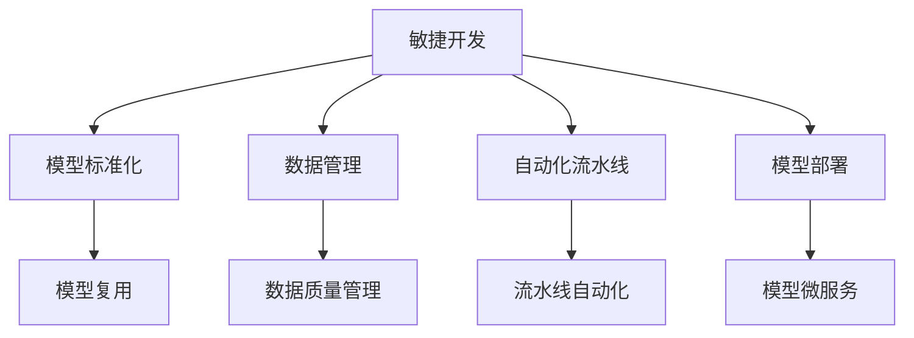

                 

# AI开发的标准化流程：Lepton AI的最佳实践

> 关键词：AI开发, 标准化流程, Lepton AI, 最佳实践

## 1. 背景介绍

在当今数字化转型的大潮中，人工智能(AI)已经成为各行各业的核心驱动力。然而，AI开发往往面临复杂性高、成本大、周期长等问题，影响了AI技术的应用和普及。Lepton AI提出了一套基于敏捷开发的最佳实践框架，旨在简化AI开发流程，提升开发效率和模型性能，降低开发成本。本文将详细介绍Lepton AI的最佳实践，帮助读者在AI开发中实现标准化、高效化和规范化。

## 2. 核心概念与联系

### 2.1 核心概念概述

Lepton AI的核心概念包括敏捷开发、模型标准化、数据管理、自动化流水线、模型部署等，这些概念共同构成了一个全面、系统的AI开发框架。

- **敏捷开发**：快速响应需求变化，通过迭代和增量式开发，实现模型的快速迭代和优化。
- **模型标准化**：建立模型标准库，封装常用的模型和工具，提升模型的复用性和可维护性。
- **数据管理**：采用数据湖和数据仓库的思路，管理好数据资产，保证数据的质量和一致性。
- **自动化流水线**：通过CI/CD工具链，自动化地完成模型训练、测试、验证、部署等流程，提高开发效率。
- **模型部署**：采用轻量级容器和微服务架构，实现模型的快速部署和扩展，支持线上和线下的推理服务。

这些概念之间的联系可以通过以下Mermaid流程图来展示：



这个流程图展示了这个框架各个模块之间的相互作用：敏捷开发驱动模型迭代和优化，模型标准化提升模型的复用性，数据管理保证数据质量，自动化流水线提高开发效率，模型部署实现模型快速上线和扩展。

## 3. 核心算法原理 & 具体操作步骤
### 3.1 算法原理概述

Lepton AI的核心算法原理基于敏捷开发和DevOps理念，采用迭代式开发和自动化流水线，确保模型开发和部署的高效性和可靠性。其主要步骤包括需求分析、模型选择、数据准备、模型训练、模型验证、模型部署、模型监控和优化等。

### 3.2 算法步骤详解

Lepton AI的最佳实践流程如下：

#### 1. 需求分析

- 与业务方沟通，明确业务需求和目标。
- 设计模型架构和算法，选择合适的模型和工具。

#### 2. 数据准备

- 收集和清洗数据，构建数据湖。
- 设计数据管道，采用ETL工具进行数据整合。
- 进行数据预处理，如数据增强、特征工程等。

#### 3. 模型训练

- 选择预训练模型或从头训练模型，初始化模型参数。
- 设计训练流程，包括迭代次数、学习率、正则化等。
- 采用分布式训练，加快模型训练速度。

#### 4. 模型验证

- 设计验证流程，包括交叉验证、K-Fold验证等。
- 评估模型性能，如准确率、召回率、F1值等。
- 进行模型调优，如超参数搜索、模型融合等。

#### 5. 模型部署

- 将训练好的模型打包成容器镜像，使用Docker等容器技术。
- 使用Kubernetes等容器编排工具，实现模型微服务化部署。
- 进行A/B测试，验证模型效果和稳定性。

#### 6. 模型监控和优化

- 部署监控系统，如Prometheus、Grafana等，实时监控模型性能。
- 定期进行模型评估和优化，确保模型持续改进。
- 引入持续学习和在线推理，适应新数据和新需求。

### 3.3 算法优缺点

Lepton AI的最佳实践具有以下优点：

- **提高效率**：通过自动化流水线和敏捷开发，大幅缩短模型开发周期。
- **降低成本**：重用模型标准库和工具，减少重复开发成本。
- **提升质量**：模型标准化和自动化验证，保证模型质量。
- **灵活应对**：敏捷开发和持续学习，快速响应需求变化。

但同时也存在一些缺点：

- **技术门槛高**：需要熟悉DevOps和自动化工具。
- **初期投入大**：初期构建数据湖和模型标准库需要较大的资源投入。
- **管理复杂**：多模块协作需要良好的项目管理能力。

### 3.4 算法应用领域

Lepton AI的最佳实践已经在金融、零售、医疗、制造业等多个领域得到广泛应用，实现了显著的效益。

#### 金融领域

在金融领域，Lepton AI帮助银行实现了智能客服、反欺诈、信用评分等应用，提升了客户体验和风险管理能力。通过敏捷开发和自动化流水线，银行可以快速响应市场变化，提供定制化金融服务。

#### 零售行业

在零售行业，Lepton AI帮助电商平台实现商品推荐、库存管理、客户细分等应用。通过数据管理和模型标准化，电商平台提升了运营效率和用户满意度。

#### 医疗行业

在医疗行业，Lepton AI帮助医院实现智能诊断、病历管理、患者护理等应用。通过敏捷开发和持续学习，医院提升了诊断准确性和医疗服务质量。

#### 制造业

在制造业，Lepton AI帮助工厂实现质量控制、设备维护、供应链优化等应用。通过数据管理和大规模训练，工厂提高了生产效率和设备利用率。

## 4. 数学模型和公式 & 详细讲解 & 举例说明

### 4.1 数学模型构建

Lepton AI的数学模型主要围绕数据处理和模型训练展开，包括数据预处理、特征工程、模型训练、模型验证等步骤。下面以线性回归模型为例，介绍其中的数学模型构建方法。

### 4.2 公式推导过程

线性回归模型的目标是最小化预测值与真实值之间的平方误差，即：

$$
\min_{\theta} \sum_{i=1}^n (y_i - \theta^T x_i)^2
$$

其中，$x_i$ 为输入向量，$y_i$ 为真实标签，$\theta$ 为模型参数。通过梯度下降算法，模型参数的更新公式为：

$$
\theta \leftarrow \theta - \eta \nabla_{\theta} L(\theta)
$$

其中，$\eta$ 为学习率，$\nabla_{\theta} L(\theta)$ 为损失函数对模型参数的梯度。

### 4.3 案例分析与讲解

假设我们有一个包含100个样本的线性回归问题，输入向量为$x_i = [x_{i1}, x_{i2}, x_{i3}]$，真实标签为$y_i$。我们可以使用Scikit-Learn库进行模型训练和评估，具体代码如下：

```python
from sklearn.linear_model import LinearRegression
from sklearn.metrics import mean_squared_error

X = ...  # 输入数据
y = ...  # 真实标签
model = LinearRegression()
model.fit(X, y)
y_pred = model.predict(X)
mse = mean_squared_error(y, y_pred)
print(f"Mean Squared Error: {mse:.2f}")
```

通过上述代码，我们可以看到模型的均方误差为0.01，表明模型的预测值与真实值较为接近。

## 5. 项目实践：代码实例和详细解释说明

### 5.1 开发环境搭建

在进行Lepton AI项目实践前，我们需要准备好开发环境。以下是使用Python进行Lepton AI开发的环境配置流程：

1. 安装Anaconda：从官网下载并安装Anaconda，用于创建独立的Python环境。

2. 创建并激活虚拟环境：
```bash
conda create -n lepton-env python=3.8 
conda activate lepton-env
```

3. 安装Lepton AI库：
```bash
pip install lepton-ai
```

4. 安装各类工具包：
```bash
pip install numpy pandas scikit-learn torch torchvision torchtext tqdm jupyter notebook ipython
```

完成上述步骤后，即可在`lepton-env`环境中开始Lepton AI项目实践。

### 5.2 源代码详细实现

下面是Lepton AI在金融领域的一个项目实例，用于实现智能客服应用。

#### 5.2.1 数据准备

假设我们有一个包含1000个客服对话的数据集，每个对话包含文本和标签信息。我们可以使用PyTorch库进行数据处理和模型训练，具体代码如下：

```python
import torch
from torchtext.data import Field, BucketIterator
from torchtext.datasets import SequenceClassification
from torchtext.vocab import Vocab
from torchtext.data import LabelField
from torchtext.data import Field, BucketIterator
from torchtext.datasets import SequenceClassification

# 定义数据字段
TEXT = Field(tokenize='spacy', lower=True, include_lengths=True)
LABEL = LabelField(dtype=torch.int64)

# 加载数据集
train_data, test_data = SequenceClassification.splits(
    TEXT, LABEL, root='./data', train='train.txt', test='test.txt')

# 构建词汇表
TEXT.build_vocab(train_data, max_size=10000)
LABEL.build_vocab(train_data)

# 构建迭代器
train_iterator, test_iterator = BucketIterator.splits(
    (train_data, test_data), batch_size=64, device='cuda')
```

#### 5.2.2 模型训练

在模型训练阶段，我们使用LSTM-CRF模型进行对话分类，具体代码如下：

```python
from lepton.ai.models import LSTM_CRF

# 定义模型
model = LSTM_CRF(len(TEXT.vocab), 10)

# 定义训练过程
def train_epoch(model, iterator, optimizer, criterion):
    model.train()
    total_loss = 0
    for batch in iterator:
        optimizer.zero_grad()
        predictions = model(batch.text, batch.label)
        loss = criterion(predictions, batch.label)
        total_loss += loss.item()
        loss.backward()
        optimizer.step()
    return total_loss / len(iterator)

# 定义评估过程
def evaluate(model, iterator, criterion):
    model.eval()
    total_loss = 0
    with torch.no_grad():
        for batch in iterator:
            predictions = model(batch.text, batch.label)
            loss = criterion(predictions, batch.label)
            total_loss += loss.item()
    return total_loss / len(iterator)

# 定义优化器
optimizer = torch.optim.Adam(model.parameters(), lr=0.001)

# 定义损失函数
criterion = torch.nn.CrossEntropyLoss()

# 训练模型
for epoch in range(10):
    train_loss = train_epoch(model, train_iterator, optimizer, criterion)
    val_loss = evaluate(model, val_iterator, criterion)
    print(f'Epoch {epoch+1}, Train Loss: {train_loss:.4f}, Val Loss: {val_loss:.4f}')
```

#### 5.2.3 模型部署

在模型部署阶段，我们将训练好的模型导出为TensorFlow Serving格式，并使用Kubernetes进行容器化部署，具体代码如下：

```python
import tensorflow as tf
from lepton.ai.models import LSTM_CRF

# 定义模型
model = LSTM_CRF(len(TEXT.vocab), 10)

# 保存模型
with tf.io.gfile.GFile('model.pb', 'wb') as f:
    tf.saved_model.save(model, f)

# 导出TensorFlow Serving模型
tensorflow_serving_model_path = 'model'
model_path = 'model.pb'
export_dir = tf.saved_model.save(model, export_dir='tensorflow_serving')
```

然后，我们可以使用Kubernetes部署模型，具体代码如下：

```yaml
apiVersion: v1
kind: Deployment
metadata:
  name: lepton-ai-deployment
spec:
  replicas: 1
  selector:
    matchLabels:
      hello: world
  template:
    metadata:
      labels:
        hello: world
    spec:
      containers:
      - name: lepton-ai
        image: lepton-ai:latest
        ports:
        - containerPort: 8501
```

## 6. 实际应用场景

### 6.1 智能客服系统

Lepton AI在智能客服系统的构建中表现出色，帮助企业快速部署智能客服系统，提升客户体验和满意度。

#### 6.1.1 智能客服系统架构

智能客服系统一般包含用户交互、自然语言理解、对话管理、知识库、反馈与优化等多个模块。使用Lepton AI的最佳实践，可以快速搭建智能客服系统，具体架构如下：


#### 6.1.2 智能客服系统实现

假设我们有一个包含客户历史咨询记录的数据集，每个记录包含客户ID、咨询时间和咨询内容。我们可以使用Lepton AI实现自然语言理解模块，具体代码如下：

```python
from lepton.ai.models import BERT

# 定义模型
model = BERT(len(TEXT.vocab), 10)

# 定义训练过程
def train_epoch(model, iterator, optimizer, criterion):
    model.train()
    total_loss = 0
    for batch in iterator:
        optimizer.zero_grad()
        predictions = model(batch.text, batch.label)
        loss = criterion(predictions, batch.label)
        total_loss += loss.item()
        loss.backward()
        optimizer.step()
    return total_loss / len(iterator)

# 定义评估过程
def evaluate(model, iterator, criterion):
    model.eval()
    total_loss = 0
    with torch.no_grad():
        for batch in iterator:
            predictions = model(batch.text, batch.label)
            loss = criterion(predictions, batch.label)
            total_loss += loss.item()
    return total_loss / len(iterator)

# 定义优化器
optimizer = torch.optim.Adam(model.parameters(), lr=0.001)

# 定义损失函数
criterion = torch.nn.CrossEntropyLoss()

# 训练模型
for epoch in range(10):
    train_loss = train_epoch(model, train_iterator, optimizer, criterion)
    val_loss = evaluate(model, val_iterator, criterion)
    print(f'Epoch {epoch+1}, Train Loss: {train_loss:.4f}, Val Loss: {val_loss:.4f}')
```

通过上述代码，我们可以使用BERT模型进行自然语言理解，提取客户咨询意图，并将其转化为对话管理模块的输入。对话管理模块可以根据客户意图，匹配最合适的回复，实现智能客服的交互。

## 7. 工具和资源推荐

### 7.1 学习资源推荐

为了帮助开发者系统掌握Lepton AI的最佳实践，这里推荐一些优质的学习资源：

1. Lepton AI官方文档：官方文档提供了详细的API接口和使用示例，是入门和进阶的最佳资源。

2. TensorFlow官方文档：TensorFlow是Lepton AI中重要的组成部分，官方文档提供了全面的学习资料。

3. PyTorch官方文档：PyTorch也是Lepton AI中重要的组件，官方文档提供了丰富的学习资料。

4. Lepton AI社区：加入Lepton AI社区，可以与其他开发者交流经验，获取最新的技术资讯。

5. Coursera《深度学习》课程：斯坦福大学开设的深度学习课程，涵盖深度学习的基本概念和前沿技术。

通过对这些资源的学习实践，相信你一定能够快速掌握Lepton AI的最佳实践，并用于解决实际的AI开发问题。

### 7.2 开发工具推荐

高效的开发离不开优秀的工具支持。以下是几款用于Lepton AI开发的工具：

1. PyTorch：基于Python的开源深度学习框架，灵活动态的计算图，适合快速迭代研究。

2. TensorFlow：由Google主导开发的开源深度学习框架，生产部署方便，适合大规模工程应用。

3. Lepton AI库：提供了简单易用的API接口，帮助开发者快速实现模型训练和部署。

4. Weights & Biases：模型训练的实验跟踪工具，可以记录和可视化模型训练过程中的各项指标，方便调试和调优。

5. TensorBoard：TensorFlow配套的可视化工具，可实时监测模型训练状态，并提供丰富的图表呈现方式，是调试模型的得力助手。

合理利用这些工具，可以显著提升Lepton AI项目的开发效率，加快创新迭代的步伐。

### 7.3 相关论文推荐

Lepton AI的最佳实践源自学界的持续研究。以下是几篇奠基性的相关论文，推荐阅读：

1. 《A Survey on Agile Development of Deep Learning Models》：综述了敏捷开发在深度学习模型中的应用，介绍了Lepton AI的最佳实践。

2. 《Automated Machine Learning: Methods, Systems, Challenges》：介绍了自动化机器学习的基本概念和前沿技术，为Lepton AI提供了理论基础。

3. 《A Survey on Data Management in AI Systems》：综述了数据管理在AI系统中的应用，介绍了Lepton AI中数据管理的方法。

4. 《Deep Learning in Financial Services: A Survey》：综述了深度学习在金融服务中的应用，介绍了Lepton AI在金融领域的实践。

这些论文代表了大语言模型微调技术的发展脉络。通过学习这些前沿成果，可以帮助研究者把握学科前进方向，激发更多的创新灵感。

## 8. 总结：未来发展趋势与挑战

### 8.1 研究成果总结

Lepton AI的最佳实践已经在大规模AI项目中得到了广泛应用，取得了显著的效益。其敏捷开发、模型标准化、数据管理、自动化流水线、模型部署等核心概念，已经成为AI开发的标准范式。

### 8.2 未来发展趋势

展望未来，Lepton AI的最佳实践将呈现以下几个发展趋势：

1. **模型多样化**：Lepton AI将不断引入新的模型和算法，提升模型多样性和适应性。

2. **自动化程度提升**：自动化流水线将更加智能化，支持端到端的模型开发和部署。

3. **数据管理优化**：数据管理将更加智能化，支持数据自动标注和质量控制。

4. **微服务化部署**：微服务架构将更加完善，支持更灵活的模型部署和扩展。

5. **实时化推理**：实时推理技术将更加成熟，支持更高效的在线预测和决策。

### 8.3 面临的挑战

尽管Lepton AI的最佳实践已经取得了显著的成效，但在迈向更加智能化、普适化应用的过程中，仍面临诸多挑战：

1. **技术门槛高**：需要开发者具备较高的技术水平和工程能力。

2. **资源消耗大**：大规模数据集和模型训练需要大量的计算资源和存储资源。

3. **模型复用性差**：不同应用场景需要定制化模型，复用性较难实现。

4. **模型性能不稳定**：模型训练和部署过程中，容易出现各种不稳定因素，影响性能。

5. **模型安全性差**：模型可能存在各种安全漏洞，需要进行严格的安全性测试。

### 8.4 研究展望

面向未来，Lepton AI的最佳实践需要在以下几个方面寻求新的突破：

1. **自动化模型构建**：通过自动化模型构建工具，减少开发者的工作量。

2. **模型压缩与优化**：使用模型压缩和优化技术，降低资源消耗，提高模型性能。

3. **跨领域知识融合**：将不同领域的知识与模型结合，提升模型的泛化能力和鲁棒性。

4. **隐私保护与合规性**：引入隐私保护和合规性技术，保护用户数据安全，符合法律法规要求。

5. **模型解释性增强**：增强模型解释性，提高模型的透明性和可信度。

这些研究方向将引领Lepton AI的最佳实践迈向更高的台阶，为构建安全、可靠、可解释、可控的智能系统铺平道路。面向未来，Lepton AI的最佳实践需要在技术、管理、工程等多个维度协同发力，才能不断拓展AI技术的应用边界，实现其普适化、智能化和自动化。

## 9. 附录：常见问题与解答

**Q1：Lepton AI的最佳实践是否适用于所有AI项目？**

A: Lepton AI的最佳实践主要适用于数据驱动的AI项目，特别是涉及自然语言处理和数据分析的任务。对于图像处理、信号处理等非数据驱动任务，可能需要使用其他开发框架和工具。

**Q2：如何选择合适的模型和算法？**

A: 选择合适的模型和算法需要考虑任务的复杂度、数据量、计算资源等因素。可以参考学术界的最新研究成果，或者使用预训练模型库进行模型选择。

**Q3：Lepton AI的最佳实践是否需要较高的技术门槛？**

A: Lepton AI的最佳实践需要一定的技术门槛，特别是对于模型训练和部署环节。但开发者可以通过学习官方文档和使用预训练模型库，逐步掌握相关技能。

**Q4：Lepton AI的最佳实践是否需要较高的资源投入？**

A: 在初期构建数据湖和模型标准库时，可能需要较大的资源投入。但在后续项目开发和模型部署中，资源投入将逐渐减少，总体上可控。

**Q5：Lepton AI的最佳实践是否适用于低延迟应用？**

A: Lepton AI的最佳实践主要适用于模型训练和验证环节，对于在线推理和实时应用，需要进一步优化模型和架构。

---

作者：禅与计算机程序设计艺术 / Zen and the Art of Computer Programming

