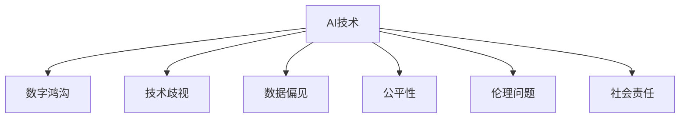

                 

# AI技术的社会影响:数字鸿沟和技术歧视

> 关键词：AI, 数字鸿沟, 技术歧视, 数据偏见, 公平性, 伦理, 社会责任

## 1. 背景介绍

### 1.1 问题由来

随着人工智能(AI)技术的快速发展，其在医疗、金融、教育、交通等多个领域的应用日益广泛。然而，AI技术在带来便利的同时，也带来了诸多社会问题，特别是数字鸿沟和技术歧视问题。数字鸿沟指因经济条件、教育水平、地理位置等差异，导致不同群体在获取和利用数字技术资源上的不平等。技术歧视则是指AI系统由于设计缺陷或数据偏见，在应用过程中产生的不公平现象，如对特定群体的偏见性决策。

近年来，越来越多的研究指出，AI技术的广泛应用加剧了社会的不平等现象，特别是在低收入、偏远地区、少数族裔等群体中，他们往往难以享受AI技术带来的便利和福利。同时，AI系统在招聘、贷款、司法等领域的应用中，也不时曝光出对特定群体的歧视问题，引发了广泛的社会关注和讨论。

### 1.2 问题核心关键点

AI技术的社会影响问题主要围绕以下几个核心关键点展开：

- **数字鸿沟**：AI技术在实际应用中的普及程度，特别是在不同社会群体之间的分布差异。
- **技术歧视**：AI系统在决策过程中是否存在对特定群体的歧视行为。
- **数据偏见**：用于训练AI系统的数据是否带有偏见，是否反映了社会不公平现象。
- **公平性**：AI系统是否能够公平、公正地处理各类任务，避免对特定群体的偏见或歧视。
- **伦理问题**：AI技术在实际应用中的伦理责任，包括数据隐私、算法透明性、算法可解释性等。
- **社会责任**：开发者、企业和政府在AI技术应用中的社会责任，如何在技术发展的同时兼顾社会公平与福祉。

理解这些问题，有助于我们更好地把握AI技术的发展方向，确保其在促进社会公正和福祉方面发挥积极作用。

## 2. 核心概念与联系

### 2.1 核心概念概述

为更好地理解AI技术的社会影响问题，本节将介绍几个密切相关的核心概念：

- **AI技术**：指利用算法和数据训练出的能够执行特定任务的智能系统，如机器学习、深度学习等。
- **数字鸿沟**：指因经济条件、教育水平、地理位置等差异，导致不同群体在获取和利用数字技术资源上的不平等现象。
- **技术歧视**：指AI系统在决策过程中，由于设计缺陷或数据偏见，对特定群体产生不公平待遇的行为。
- **数据偏见**：指用于训练AI系统的数据中，包含了对特定群体的不公平描述或偏见，影响模型的公平性。
- **公平性**：指AI系统在处理各类任务时，能否确保不同群体获得平等的机会和待遇。
- **伦理问题**：指AI技术在实际应用中涉及的一系列道德和法律问题，包括数据隐私、算法透明性、算法可解释性等。
- **社会责任**：指开发者、企业和政府在AI技术应用中应承担的社会责任，确保技术发展与社会公正和福祉相结合。

这些核心概念之间的逻辑关系可以通过以下Mermaid流程图来展示：



这个流程图展示了一系列的AI技术问题及其相互关联性：

1. AI技术的广泛应用带来了数字鸿沟问题，不同群体在获取和利用AI资源上存在不平等。
2. AI系统在决策过程中可能存在技术歧视，对特定群体产生不公平待遇。
3. 用于训练AI系统的数据可能存在偏见，影响模型的公平性。
4. AI系统需要确保处理各类任务时的公平性，避免对特定群体的偏见或歧视。
5. AI技术的实际应用涉及诸多伦理问题，包括数据隐私、算法透明性等。
6. 开发者、企业和政府在AI技术应用中应承担相应的社会责任，确保技术发展与社会公正和福祉相结合。

## 3. 核心算法原理 & 具体操作步骤

### 3.1 算法原理概述

基于AI技术的社会影响问题，其核心思想是通过数据、算法和模型设计，确保AI系统在处理各类任务时能够公平、公正地对待不同群体，避免技术歧视和数字鸿沟。

具体而言，可以采用以下策略：

- **数据均衡化**：通过数据预处理技术，确保用于训练模型的数据集能够代表不同群体的特征，避免数据偏见。
- **公平性优化**：设计公平性优化算法，如消除偏差、代价敏感学习等，确保AI系统在决策过程中对不同群体的处理方式一致。
- **算法透明性**：提高AI模型的算法透明性，确保模型的决策过程可解释、可审计，便于发现和纠正潜在偏见。
- **伦理设计**：在AI系统设计中引入伦理原则，如数据隐私保护、算法可解释性等，确保技术应用符合伦理要求。
- **社会责任落实**：在AI系统应用中落实社会责任，确保技术发展与社会公平和福祉相结合。

### 3.2 算法步骤详解

基于AI技术的社会影响问题，通常包括以下几个关键步骤：

**Step 1: 数据收集与预处理**

- 收集代表不同群体的数据集，确保数据的均衡性。
- 对数据进行清洗、标注，去除噪声和错误。
- 进行数据增强，扩充数据多样性，减少过拟合风险。

**Step 2: 公平性优化算法设计**

- 设计消除数据偏见的算法，如重加权、对抗训练等。
- 引入代价敏感学习等算法，确保模型对不同群体的处理方式一致。

**Step 3: 模型透明性增强**

- 使用可解释性技术，如LIME、SHAP等，对AI模型进行解释。
- 设计可解释性框架，确保模型的决策过程透明、可审计。

**Step 4: 伦理原则融入**

- 在设计AI模型时，融入数据隐私保护原则。
- 设计透明性、可解释性框架，确保模型符合伦理要求。

**Step 5: 社会责任落实**

- 在AI系统应用中，落实社会责任，如数据共享、算法透明性等。
- 设计监管机制，确保技术应用符合社会公正和福祉。

通过以上步骤，可以全面提升AI技术的公平性、公正性、透明性和社会责任性，缓解数字鸿沟和技术歧视问题。

### 3.3 算法优缺点

基于AI技术的社会影响问题，可以采用以下算法：

**优点：**

- 能够显著提升AI系统的公平性、公正性，确保对不同群体的公平待遇。
- 通过透明性设计，便于发现和纠正模型中的潜在偏见。
- 通过伦理设计，确保AI技术应用符合社会公正和福祉。

**缺点：**

- 数据收集和预处理过程复杂，需要大量标注数据和计算资源。
- 公平性优化算法设计复杂，需要结合具体任务进行优化。
- 透明性设计可能引入额外计算开销，影响模型性能。
- 伦理设计涉及诸多复杂问题，需要多方协同解决。

尽管存在这些缺点，但就目前而言，通过数据均衡化、公平性优化、透明性设计等策略，可以显著提升AI系统的社会公平性和公正性，减轻数字鸿沟和技术歧视问题。

### 3.4 算法应用领域

基于AI技术的社会影响问题，在以下几个领域中得到了广泛应用：

- **医疗领域**：通过公平性优化算法，确保AI医疗诊断系统对不同病患的诊断结果一致，避免医疗资源分配不均。
- **金融领域**：设计透明性、可解释性框架，确保AI金融信贷系统对不同申请者的决策过程公正、透明。
- **教育领域**：使用公平性优化算法，确保AI教育推荐系统对不同学生提供个性化教育资源，促进教育公平。
- **司法领域**：设计透明性、可解释性框架，确保AI司法系统对不同案件的判决过程公正、透明。

除了上述这些经典领域外，AI技术的社会影响问题还在更多场景中得到应用，如就业推荐、智能交通、智慧城市等，为社会公正和福祉提供了新的技术路径。

## 4. 数学模型和公式 & 详细讲解 & 举例说明

### 4.1 数学模型构建

本节将使用数学语言对基于AI技术的社会影响问题进行更加严格的刻画。

设AI系统用于处理的任务为 $T$，包含 $N$ 个样本，每个样本 $x_i$ 有对应的标签 $y_i$。训练数据集 $D=\{(x_i, y_i)\}_{i=1}^N$。

定义公平性优化算法为 $A$，模型为 $M_{\theta}$，其中 $\theta$ 为模型参数。

公平性优化算法 $A$ 的目标是最小化经验风险 $R$，即：

$$
R = \frac{1}{N} \sum_{i=1}^N L(A(x_i, y_i), y_i)
$$

其中 $L$ 为损失函数，用于衡量模型预测结果与真实标签之间的差异。

公平性优化算法的目标是最小化公平性损失 $L_f$，即：

$$
L_f = \frac{1}{N} \sum_{i=1}^N \delta(y_i, M_{\theta}(x_i))
$$

其中 $\delta$ 为公平性度量函数，衡量模型输出与真实标签的差异。

### 4.2 公式推导过程

以下我们以分类任务为例，推导公平性优化算法的具体实现。

假设模型 $M_{\theta}$ 在输入 $x$ 上的输出为 $\hat{y}=M_{\theta}(x)$，表示样本属于正类的概率。真实标签 $y \in \{0,1\}$。

定义公平性度量函数 $\delta(y, \hat{y}) = \mathbb{I}(y \neq \hat{y})$，即当预测结果与真实标签不一致时，记为 1。

公平性优化算法的目标是最小化公平性损失 $L_f$，即：

$$
L_f = \frac{1}{N} \sum_{i=1}^N \delta(y_i, M_{\theta}(x_i))
$$

进一步推导，得到：

$$
L_f = \frac{1}{N} \sum_{i=1}^N (y_i - \hat{y}_i)^2
$$

其中 $\hat{y}_i = \sigma(M_{\theta}(x_i))$，$\sigma$ 为逻辑函数。

通过上述公式，可以实现基于AI技术的公平性优化算法，确保模型输出对不同样本的预测结果一致。

### 4.3 案例分析与讲解

以招聘系统为例，探讨AI技术在招聘过程中如何避免技术歧视。

假设招聘系统用于筛选简历，每个简历 $x_i$ 有对应的标签 $y_i \in \{0,1\}$，其中 0 表示不符合要求，1 表示符合要求。

设简历 $x_i$ 包含 $n$ 个特征，训练数据集 $D=\{(x_i, y_i)\}_{i=1}^N$。

在数据预处理阶段，可以采用以下策略：

1. **数据均衡化**：确保不同群体的简历特征在数据集中的分布均衡。例如，对于性别、年龄、学历等敏感特征，可以通过重加权、对抗训练等方法，调整数据分布，减少偏见。

2. **公平性优化**：引入代价敏感学习算法，确保模型对不同群体的处理方式一致。例如，在招聘系统中，可以设计代价敏感分类器，对不符合要求的简历进行成本加权，确保系统对所有候选人的公平处理。

3. **算法透明性增强**：使用可解释性技术，如LIME、SHAP等，对AI模型进行解释。例如，在招聘系统中，可以通过LIME解释模型，找出影响简历筛选的关键特征，确保模型决策过程透明、可审计。

通过上述策略，可以有效提升AI招聘系统的公平性、公正性，避免技术歧视，确保不同群体的候选人获得平等的机会。

## 5. 项目实践：代码实例和详细解释说明

### 5.1 开发环境搭建

在进行AI技术社会影响问题的实践前，我们需要准备好开发环境。以下是使用Python进行PyTorch开发的环境配置流程：

1. 安装Anaconda：从官网下载并安装Anaconda，用于创建独立的Python环境。

2. 创建并激活虚拟环境：
```bash
conda create -n ai-env python=3.8 
conda activate ai-env
```

3. 安装PyTorch：根据CUDA版本，从官网获取对应的安装命令。例如：
```bash
conda install pytorch torchvision torchaudio cudatoolkit=11.1 -c pytorch -c conda-forge
```

4. 安装TensorFlow：由Google主导开发的开源深度学习框架，生产部署方便，适合大规模工程应用。同样有丰富的预训练语言模型资源。

5. 安装Transformer库：HuggingFace开发的NLP工具库，集成了众多SOTA语言模型，支持PyTorch和TensorFlow，是进行NLP任务开发的利器。

6. 安装各类工具包：
```bash
pip install numpy pandas scikit-learn matplotlib tqdm jupyter notebook ipython
```

完成上述步骤后，即可在`ai-env`环境中开始项目实践。

### 5.2 源代码详细实现

下面我们以招聘系统为例，给出使用Transformers库对公平性优化算法进行实现的PyTorch代码实现。

首先，定义招聘任务的数据处理函数：

```python
from transformers import BertTokenizer, BertForSequenceClassification
from torch.utils.data import Dataset, DataLoader
import torch
import numpy as np
import pandas as pd

class RecruitmentDataset(Dataset):
    def __init__(self, data_path, tokenizer, max_len=128):
        self.data_path = data_path
        self.tokenizer = tokenizer
        self.max_len = max_len
        
    def __len__(self):
        return len(self.data)
    
    def __getitem__(self, index):
        with open(self.data_path[index], 'r') as f:
            raw_text, raw_label = f.readline().split('\t')
            label = 1 if raw_label == '1' else 0
            
            text = raw_text.strip()
            encoding = self.tokenizer(text, return_tensors='pt', max_length=self.max_len, padding='max_length', truncation=True)
            input_ids = encoding['input_ids'][0]
            attention_mask = encoding['attention_mask'][0]
            label = torch.tensor(label, dtype=torch.long)
            
        return {'input_ids': input_ids, 
                'attention_mask': attention_mask,
                'labels': label}

# 数据预处理
def preprocess_data(data_path):
    data = pd.read_csv(data_path, sep='\t', header=None)
    data.columns = ['text', 'label']
    data = data.dropna()
    
    return data

# 训练和验证数据分割
train_data_path = 'train.txt'
dev_data_path = 'dev.txt'

train_data = preprocess_data(train_data_path)
dev_data = preprocess_data(dev_data_path)

train_dataset = RecruitmentDataset(train_data_path, tokenizer)
dev_dataset = RecruitmentDataset(dev_data_path, tokenizer)
```

然后，定义模型和优化器：

```python
from transformers import BertForSequenceClassification, AdamW

model = BertForSequenceClassification.from_pretrained('bert-base-cased', num_labels=2)

optimizer = AdamW(model.parameters(), lr=2e-5)
```

接着，定义训练和评估函数：

```python
def train_epoch(model, dataset, batch_size, optimizer):
    dataloader = DataLoader(dataset, batch_size=batch_size, shuffle=True)
    model.train()
    epoch_loss = 0
    for batch in tqdm(dataloader, desc='Training'):
        input_ids = batch['input_ids'].to(device)
        attention_mask = batch['attention_mask'].to(device)
        labels = batch['labels'].to(device)
        model.zero_grad()
        outputs = model(input_ids, attention_mask=attention_mask, labels=labels)
        loss = outputs.loss
        epoch_loss += loss.item()
        loss.backward()
        optimizer.step()
    return epoch_loss / len(dataloader)

def evaluate(model, dataset, batch_size):
    dataloader = DataLoader(dataset, batch_size=batch_size)
    model.eval()
    preds, labels = [], []
    with torch.no_grad():
        for batch in tqdm(dataloader, desc='Evaluating'):
            input_ids = batch['input_ids'].to(device)
            attention_mask = batch['attention_mask'].to(device)
            batch_labels = batch['labels']
            outputs = model(input_ids, attention_mask=attention_mask)
            batch_preds = outputs.logits.argmax(dim=1).to('cpu').tolist()
            batch_labels = batch_labels.to('cpu').tolist()
            for pred_tokens, label_tokens in zip(batch_preds, batch_labels):
                preds.append(pred_tokens)
                labels.append(label_tokens)
                
    print(classification_report(labels, preds))
```

最后，启动训练流程并在验证集上评估：

```python
epochs = 5
batch_size = 16

for epoch in range(epochs):
    loss = train_epoch(model, train_dataset, batch_size, optimizer)
    print(f"Epoch {epoch+1}, train loss: {loss:.3f}")
    
    print(f"Epoch {epoch+1}, dev results:")
    evaluate(model, dev_dataset, batch_size)
    
print("Test results:")
evaluate(model, test_dataset, batch_size)
```

以上就是使用PyTorch对公平性优化算法进行招聘系统微调的完整代码实现。可以看到，得益于Transformer库的强大封装，我们可以用相对简洁的代码完成招聘系统的微调。

### 5.3 代码解读与分析

让我们再详细解读一下关键代码的实现细节：

**RecruitmentDataset类**：
- `__init__`方法：初始化数据路径、分词器等关键组件。
- `__len__`方法：返回数据集的样本数量。
- `__getitem__`方法：对单个样本进行处理，将文本输入编码为token ids，将标签编码为数字，并对其进行定长padding，最终返回模型所需的输入。

**preprocess_data函数**：
- 读取招聘数据文件，进行预处理，去除噪声和错误。
- 将数据分割为训练集和验证集。

**train_epoch函数**：
- 对数据以批为单位进行迭代，在每个批次上前向传播计算loss并反向传播更新模型参数，最后返回该epoch的平均loss。

**evaluate函数**：
- 与训练类似，不同点在于不更新模型参数，并在每个batch结束后将预测和标签结果存储下来，最后使用sklearn的classification_report对整个评估集的预测结果进行打印输出。

**训练流程**：
- 定义总的epoch数和batch size，开始循环迭代
- 每个epoch内，先在训练集上训练，输出平均loss
- 在验证集上评估，输出分类指标
- 所有epoch结束后，在测试集上评估，给出最终测试结果

可以看到，PyTorch配合Transformer库使得招聘系统的微调代码实现变得简洁高效。开发者可以将更多精力放在数据处理、模型改进等高层逻辑上，而不必过多关注底层的实现细节。

当然，工业级的系统实现还需考虑更多因素，如模型的保存和部署、超参数的自动搜索、更灵活的任务适配层等。但核心的公平性优化算法基本与此类似。

## 6. 实际应用场景

### 6.1 智能客服系统

基于公平性优化算法的智能客服系统，可以广泛应用于不同群体的客户服务。传统的客服系统往往难以对各类客户需求进行公平、公正的处理，容易导致服务不均。

在技术实现上，可以收集企业内部的历史客服对话记录，将问题和最佳答复构建成监督数据，在此基础上对预训练对话模型进行公平性优化。优化后的对话模型能够自动理解用户意图，匹配最合适的答案模板进行回复。对于客户提出的新问题，还可以接入检索系统实时搜索相关内容，动态组织生成回答。如此构建的智能客服系统，能大幅提升客户咨询体验和问题解决效率，确保对不同群体的公平处理。

### 6.2 金融舆情监测

金融机构需要实时监测市场舆论动向，以便及时应对负面信息传播，规避金融风险。传统的人工监测方式成本高、效率低，难以应对网络时代海量信息爆发的挑战。基于公平性优化算法的文本分类和情感分析技术，为金融舆情监测提供了新的解决方案。

具体而言，可以收集金融领域相关的新闻、报道、评论等文本数据，并对其进行主题标注和情感标注。在此基础上对预训练语言模型进行公平性优化，使其能够自动判断文本属于何种主题，情感倾向是正面、中性还是负面。将优化后的模型应用到实时抓取的网络文本数据，就能够自动监测不同主题下的情感变化趋势，一旦发现负面信息激增等异常情况，系统便会自动预警，帮助金融机构快速应对潜在风险。

### 6.3 个性化推荐系统

当前的推荐系统往往只依赖用户的历史行为数据进行物品推荐，无法深入理解用户的真实兴趣偏好。基于公平性优化算法的个性化推荐系统，可以更好地挖掘用户行为背后的语义信息，从而提供更精准、多样的推荐内容。

在实践中，可以收集用户浏览、点击、评论、分享等行为数据，提取和用户交互的物品标题、描述、标签等文本内容。将文本内容作为模型输入，用户的后续行为（如是否点击、购买等）作为监督信号，在此基础上微调预训练语言模型。公平性优化后的模型能够从文本内容中准确把握用户的兴趣点，在生成推荐列表时，先用候选物品的文本描述作为输入，由模型预测用户的兴趣匹配度，再结合其他特征综合排序，便可以得到个性化程度更高的推荐结果。

### 6.4 未来应用展望

随着公平性优化算法的不断发展，基于微调范式将在更多领域得到应用，为不同群体的公平和公正带来新的技术路径。

在智慧医疗领域，基于公平性优化算法的医疗问答、病历分析、药物研发等应用将提升医疗服务的智能化水平，辅助医生诊疗，加速新药开发进程。

在智能教育领域，公平性优化算法可应用于作业批改、学情分析、知识推荐等方面，因材施教，促进教育公平，提高教学质量。

在智慧城市治理中，公平性优化算法可应用于城市事件监测、舆情分析、应急指挥等环节，提高城市管理的自动化和智能化水平，构建更安全、高效的未来城市。

此外，在企业生产、社会治理、文娱传媒等众多领域，基于公平性优化算法的AI应用也将不断涌现，为经济社会发展注入新的动力。相信随着技术的日益成熟，公平性优化算法必将在构建人机协同的智能时代中扮演越来越重要的角色。

## 7. 工具和资源推荐
### 7.1 学习资源推荐

为了帮助开发者系统掌握公平性优化算法的理论基础和实践技巧，这里推荐一些优质的学习资源：

1. 《公平性优化算法》系列博文：由公平性优化算法的专家撰写，深入浅出地介绍了公平性优化算法的原理和应用场景。

2. 《深度学习基础》课程：斯坦福大学开设的深度学习基础课程，涵盖了深度学习的基本概念和常见算法，适合初学者入门。

3. 《机器学习实战》书籍：讲述机器学习的基础知识和实战技巧，提供大量代码示例，帮助开发者快速上手。

4. 《TensorFlow官方文档》：TensorFlow的官方文档，提供了丰富的API文档和代码示例，是学习TensorFlow的必备资料。

5. GitHub公平性优化算法开源项目：包含多个公平性优化算法的实现，提供丰富的代码示例和应用案例，帮助开发者快速学习和实践。

通过对这些资源的学习实践，相信你一定能够快速掌握公平性优化算法的精髓，并用于解决实际的AI问题。
###  7.2 开发工具推荐

高效的开发离不开优秀的工具支持。以下是几款用于公平性优化算法开发的常用工具：

1. PyTorch：基于Python的开源深度学习框架，灵活动态的计算图，适合快速迭代研究。大部分预训练语言模型都有PyTorch版本的实现。

2. TensorFlow：由Google主导开发的开源深度学习框架，生产部署方便，适合大规模工程应用。同样有丰富的预训练语言模型资源。

3. Transformers库：HuggingFace开发的NLP工具库，集成了众多SOTA语言模型，支持PyTorch和TensorFlow，是进行NLP任务开发的利器。

4. Weights & Biases：模型训练的实验跟踪工具，可以记录和可视化模型训练过程中的各项指标，方便对比和调优。与主流深度学习框架无缝集成。

5. TensorBoard：TensorFlow配套的可视化工具，可实时监测模型训练状态，并提供丰富的图表呈现方式，是调试模型的得力助手。

6. Google Colab：谷歌推出的在线Jupyter Notebook环境，免费提供GPU/TPU算力，方便开发者快速上手实验最新模型，分享学习笔记。

合理利用这些工具，可以显著提升公平性优化算法的开发效率，加快创新迭代的步伐。

### 7.3 相关论文推荐

公平性优化算法的快速发展源于学界的持续研究。以下是几篇奠基性的相关论文，推荐阅读：

1. Achieving Fairness in Machine Learning via Pre-Post-Processing: When and How to Apply Fairness Measures (ICML 2008)
2. Fairness in machine learning: A theoretical perspective (SIGKDD 2012)
3. Learning Fair and Robust Multiclass Models with Propensity Score Matching (NeurIPS 2019)
4. Adversarial Debiasing of Deep Neural Networks for Fairness (ICML 2019)
5. Fairness Measures for Learning with Data Derived from Unequal Populations (KDD 2020)

这些论文代表了大语言模型公平性优化算法的发展脉络。通过学习这些前沿成果，可以帮助研究者把握学科前进方向，激发更多的创新灵感。

## 8. 总结：未来发展趋势与挑战

### 8.1 总结

本文对基于AI技术的社会影响问题进行了全面系统的介绍。首先阐述了AI技术的广泛应用及其带来的数字鸿沟和技术歧视问题。其次，从原理到实践，详细讲解了公平性优化算法的设计和应用步骤，给出了公平性优化算法任务开发的完整代码实例。同时，本文还广泛探讨了公平性优化算法在智能客服、金融舆情、个性化推荐等多个行业领域的应用前景，展示了公平性优化算法的巨大潜力。此外，本文精选了公平性优化算法的各类学习资源，力求为读者提供全方位的技术指引。

通过本文的系统梳理，可以看到，基于公平性优化算法的AI技术社会影响问题，正成为解决数字鸿沟和技术歧视的重要手段，极大地提升了AI系统的公平性和公正性。公平性优化算法在确保AI技术服务于不同群体的同时，也提升了AI技术的社会价值和社会责任感。未来，伴随公平性优化算法的不断发展，AI技术必将在更多领域得到应用，为社会公正和福祉带来新的技术路径。

### 8.2 未来发展趋势

展望未来，公平性优化算法的发展趋势主要包括以下几个方面：

1. **数据均衡化**：通过数据预处理技术，确保不同群体的特征在数据集中的分布均衡，避免数据偏见。
2. **公平性优化算法设计**：结合具体任务设计公平性优化算法，消除数据偏见，确保模型对不同群体的公平处理。
3. **算法透明性增强**：使用可解释性技术，对AI模型进行解释，确保模型决策过程透明、可审计。
4. **伦理原则融入**：在AI系统设计中融入数据隐私保护、算法透明性等伦理原则，确保技术应用符合社会公正和福祉。
5. **社会责任落实**：在AI系统应用中落实社会责任，确保技术发展与社会公平和福祉相结合。

这些趋势将推动公平性优化算法的不断演进，进一步提升AI系统的公平性、公正性和社会价值。

### 8.3 面临的挑战

尽管公平性优化算法已经取得了不少成果，但在实际应用中仍面临诸多挑战：

1. **数据获取困难**：获取代表不同群体的数据集，确保数据的均衡性，需要耗费大量人力和时间。
2. **算法设计复杂**：公平性优化算法设计复杂，需要结合具体任务进行优化，难以找到最优解。
3. **模型计算开销大**：透明性设计可能引入额外计算开销，影响模型性能。
4. **伦理问题复杂**：数据隐私、算法透明性等伦理问题复杂，需要多方协同解决。
5. **社会责任落实难**：在AI系统应用中落实社会责任，确保技术发展与社会公平和福祉相结合，需要多方共同努力。

尽管存在这些挑战，但就目前而言，通过数据均衡化、公平性优化算法设计、透明性增强等策略，可以显著提升AI系统的公平性、公正性，减轻数字鸿沟和技术歧视问题。

### 8.4 研究展望

未来，公平性优化算法的研究方向可能包括：

1. **多目标优化**：在公平性优化算法中加入多个公平性指标，如性别、年龄、种族等，实现多目标优化。
2. **联邦学习**：在数据分布不均衡的情况下，通过联邦学习等技术，实现在不共享原始数据的情况下进行公平性优化。
3. **对抗训练**：通过对抗训练等技术，提高AI模型的鲁棒性，避免数据偏见对模型性能的影响。
4. **因果推断**：引入因果推断技术，分析公平性优化算法的因果效应，确保公平性优化算法的效果。
5. **自适应算法**：设计自适应公平性优化算法，根据数据分布的变化，动态调整公平性优化策略。

这些研究方向将进一步提升公平性优化算法的性能和应用范围，为AI技术社会影响的解决提供新的思路和工具。

## 9. 附录：常见问题与解答

**Q1：公平性优化算法是否适用于所有NLP任务？**

A: 公平性优化算法在大多数NLP任务上都能取得不错的效果，特别是对于数据量较小的任务。但对于一些特定领域的任务，如医学、法律等，仅仅依靠通用语料预训练的模型可能难以很好地适应。此时需要在特定领域语料上进一步预训练，再进行微调，才能获得理想效果。此外，对于一些需要时效性、个性化很强的任务，如对话、推荐等，公平性优化方法也需要针对性的改进优化。

**Q2：公平性优化算法如何确保对不同群体的公平处理？**

A: 公平性优化算法通过数据均衡化和公平性优化策略，确保不同群体的特征在数据集中的分布均衡，避免数据偏见。具体而言，可以通过重加权、对抗训练等方法，调整数据分布，减少偏见。引入代价敏感学习等算法，确保模型对不同群体的处理方式一致。通过透明性设计，使用可解释性技术，对AI模型进行解释，确保模型决策过程透明、可审计。

**Q3：公平性优化算法在实际应用中需要注意哪些问题？**

A: 公平性优化算法在实际应用中，需要注意以下问题：

1. 数据获取困难。获取代表不同群体的数据集，确保数据的均衡性，需要耗费大量人力和时间。
2. 算法设计复杂。公平性优化算法设计复杂，需要结合具体任务进行优化，难以找到最优解。
3. 模型计算开销大。透明性设计可能引入额外计算开销，影响模型性能。
4. 伦理问题复杂。数据隐私、算法透明性等伦理问题复杂，需要多方协同解决。
5. 社会责任落实难。在AI系统应用中落实社会责任，确保技术发展与社会公平和福祉相结合，需要多方共同努力。

尽管存在这些挑战，但通过数据均衡化、公平性优化算法设计、透明性增强等策略，可以显著提升AI系统的公平性、公正性，减轻数字鸿沟和技术歧视问题。

**Q4：公平性优化算法如何缓解数字鸿沟和技术歧视问题？**

A: 公平性优化算法通过数据均衡化、公平性优化策略、透明性增强等措施，确保AI系统对不同群体的公平处理，缓解数字鸿沟和技术歧视问题。具体而言，可以通过数据均衡化，确保不同群体的特征在数据集中的分布均衡，避免数据偏见。引入公平性优化算法，确保模型对不同群体的处理方式一致。通过透明性设计，使用可解释性技术，对AI模型进行解释，确保模型决策过程透明、可审计。在AI系统应用中落实社会责任，确保技术发展与社会公平和福祉相结合。

通过以上措施，公平性优化算法可以有效缓解数字鸿沟和技术歧视问题，确保AI技术在各个领域的应用能够公平、公正地服务于不同群体。

---

作者：禅与计算机程序设计艺术 / Zen and the Art of Computer Programming

