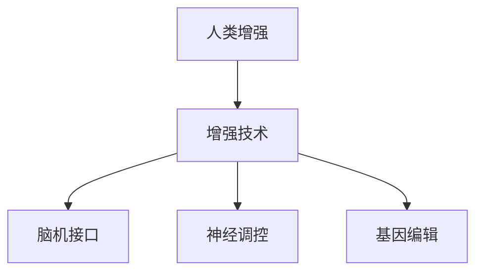

                 

# AI时代的人类增强：道德考虑与身体增强技术的未来发展方向

## 1. 背景介绍

### 1.1 问题由来

随着人工智能(AI)技术的飞速发展，人类增强（Human Augmentation）成为未来的重要趋势。在AI的帮助下，人类可以在智力、体力、情感等多方面获得显著提升，从而更好地适应未来社会的发展需求。然而，在身体增强技术广泛应用的同时，也带来了诸多伦理道德问题，如隐私保护、公平性、安全性等。如何平衡技术发展与伦理道德之间的关系，成为人工智能应用的重要课题。

### 1.2 问题核心关键点

人类增强技术涉及的关键点包括：
- 隐私保护：如何在增强技术的应用过程中，保护用户的个人隐私。
- 公平性：如何确保增强技术能够惠及所有人群，避免产生数字鸿沟。
- 安全性：如何保证增强技术的安全性，防止技术滥用导致的伤害。
- 社会影响：增强技术如何影响社会结构、就业市场等，需要深入思考。
- 伦理考量：增强技术的伦理边界，如何在使用中保持道德规范。

这些核心问题需要多方协同，共同推动人类增强技术的健康发展。

## 2. 核心概念与联系

### 2.1 核心概念概述

为更好地理解人类增强技术，本节将介绍几个关键概念及其相互联系：

- 人类增强（Human Augmentation）：利用技术手段提升人类在智力、体力、情感等方面的能力。
- 增强技术（Augmentation Technology）：实现人类增强的软硬件技术，包括脑机接口、神经调控、基因编辑等。
- 脑机接口（Brain-Computer Interface, BCI）：通过外部设备读取大脑信号，实现人类与机器的直接交互。
- 神经调控（Neural Modulation）：通过电刺激或药物干预，调控神经系统的活动。
- 基因编辑（Genetic Editing）：利用CRISPR-Cas9等技术，直接修改人类基因，提升特定能力。

这些概念之间的逻辑关系可以通过以下Mermaid流程图来展示：



这个流程图展示了几大类增强技术之间的关系：

1. 人类增强是增强技术的总体目标，包括智力、体力、情感等多方面的提升。
2. 脑机接口、神经调控和基因编辑等是具体的实现手段，分别通过不同技术途径提升人类能力。

## 3. 核心算法原理 & 具体操作步骤

### 3.1 算法原理概述

人体增强技术的原理，主要是通过外界的干预手段，影响大脑和身体的自然运行状态，从而提升特定能力。常见的干预手段包括：

- **脑机接口**：通过读取大脑信号，将之转化为机器可识别的指令，实现人机交互。
- **神经调控**：通过电刺激或药物，调控神经系统的活动，如增强注意力、记忆能力等。
- **基因编辑**：通过修改基因序列，直接改变人体的生理结构和功能。

这些增强技术的核心是信号获取、信息处理和作用执行。因此，本文将从这三个方面来介绍具体的操作流程和技术原理。

### 3.2 算法步骤详解

#### 脑机接口

1. **信号获取**：使用EEG、fMRI等设备，读取大脑活动信号。
2. **信号处理**：通过算法将大脑信号转化为机器可理解的指令。
3. **输出执行**：将指令发送到外部设备，如机器人手臂、计算机等。

#### 神经调控

1. **信号获取**：通过电刺激设备，读取神经活动信号。
2. **信号处理**：分析神经信号，确定调控目标。
3. **信号输出**：使用电刺激或药物，调控神经活动。

#### 基因编辑

1. **目标基因识别**：通过基因检测技术，确定需要增强的能力对应的基因。
2. **基因编辑**：利用CRISPR-Cas9等技术，修改目标基因序列。
3. **基因表达**：通过基因调控机制，增强目标能力。

### 3.3 算法优缺点

人类增强技术的优点包括：
- 提升人类能力：通过技术手段，提升人类的智力、体力、情感等多方面能力。
- 应用广泛：脑机接口、神经调控、基因编辑等技术，可以应用于多个领域，如医疗、教育、军事等。
- 效果显著：这些技术已经在实验室和临床试验中显示出显著的增强效果。

同时，这些技术也存在一些局限性：
- 技术复杂度高：脑机接口、神经调控、基因编辑等技术，需要高精度的设备和复杂的算法，开发成本较高。
- 安全风险大：这些技术在应用过程中，存在一定的安全隐患，如设备故障、副作用等。
- 伦理争议多：涉及隐私、公平、安全性等多个伦理道德问题，引发广泛讨论。
- 依赖性强：这些技术在实际应用中，对外部设备和环境依赖度较高，难以完全独立运作。

### 3.4 算法应用领域

人类增强技术已经在多个领域得到了广泛应用，具体包括：

- **医疗领域**：通过脑机接口、神经调控等技术，帮助残疾人士恢复运动能力，提升生活质量。
- **教育领域**：利用神经调控技术，提升学生的注意力和记忆力，改善学习效果。
- **军事领域**：开发脑机接口、基因编辑等技术，提升士兵的智力、体力和反应速度，增强作战能力。
- **体育领域**：通过基因编辑技术，提升运动员的体能和技能，提高比赛成绩。
- **娱乐领域**：利用虚拟现实和脑机接口技术，提供更加沉浸式的游戏体验，增加用户粘性。

## 4. 数学模型和公式 & 详细讲解

### 4.1 数学模型构建

以脑机接口为例，其核心数学模型主要包括信号获取、信号处理和输出执行三个环节。

1. **信号获取**：
   - 使用EEG设备，读取大脑信号 $x_t$。
   - 信号模型：$x_t = \mu + \sigma w_t + \epsilon_t$，其中 $\mu$ 为信号均值，$\sigma$ 为信号方差，$w_t$ 为噪声，$\epsilon_t$ 为随机噪声。

2. **信号处理**：
   - 使用滤波器 $H(z)$，将原始信号转化为机器可理解的指令 $y_t$。
   - 滤波模型：$y_t = H(z)x_t$。

3. **输出执行**：
   - 将指令发送到外部设备，执行特定任务。
   - 执行模型：$u_t = F(y_t)$，其中 $F$ 为执行函数。

### 4.2 公式推导过程

以神经调控为例，其核心公式推导过程如下：

1. **信号获取**：
   - 使用电刺激设备，读取神经信号 $u_t$。
   - 信号模型：$u_t = A + Bx_t + Cw_t + D\epsilon_t$，其中 $A$ 为基线信号，$B$ 为信号放大系数，$C$ 为噪声放大系数，$D$ 为随机噪声放大系数，$x_t$ 为输入信号，$w_t$ 为噪声，$\epsilon_t$ 为随机噪声。

2. **信号处理**：
   - 分析神经信号，确定调控目标 $s_t$。
   - 控制模型：$s_t = G(u_t)$，其中 $G$ 为控制函数。

3. **信号输出**：
   - 使用电刺激或药物，调控神经活动 $v_t$。
   - 调控模型：$v_t = H(s_t)$，其中 $H$ 为调控函数。

### 4.3 案例分析与讲解

以基因编辑为例，其核心公式推导过程如下：

1. **目标基因识别**：
   - 使用基因检测技术，确定需要增强的能力对应的基因序列 $g$。
   - 识别模型：$g = f(n)$，其中 $n$ 为基因序列。

2. **基因编辑**：
   - 利用CRISPR-Cas9等技术，修改目标基因序列。
   - 编辑模型：$g' = E(g, p)$，其中 $g'$ 为编辑后的基因序列，$p$ 为编辑参数。

3. **基因表达**：
   - 通过基因调控机制，增强目标能力。
   - 表达模型：$c = M(g')$，其中 $c$ 为增强能力。

## 5. 项目实践：代码实例和详细解释说明

### 5.1 开发环境搭建

在进行人类增强技术开发前，需要准备相应的开发环境。以下是使用Python进行TensorFlow开发的详细流程：

1. 安装Anaconda：从官网下载并安装Anaconda，用于创建独立的Python环境。
2. 创建并激活虚拟环境：
```bash
conda create -n tf-env python=3.7
conda activate tf-env
```

3. 安装TensorFlow：根据CUDA版本，从官网获取对应的安装命令。例如：
```bash
conda install tensorflow -c tf -c conda-forge
```

4. 安装神经网络库：
```bash
pip install tensorflow-gpu numpy scipy matplotlib
```

5. 安装其他相关库：
```bash
pip install scipy skimage imageio scipy
```

完成上述步骤后，即可在`tf-env`环境中开始人类增强技术的开发实践。

### 5.2 源代码详细实现

这里我们以神经调控为例，给出使用TensorFlow进行神经信号处理的PyTorch代码实现。

首先，定义神经信号的输入和输出：

```python
import tensorflow as tf
import numpy as np

# 神经信号输入
x = tf.placeholder(tf.float32, shape=[None, 1], name='x')

# 神经信号输出
y = tf.placeholder(tf.float32, shape=[None, 1], name='y')

# 定义神经网络
hidden_layer = tf.layers.dense(inputs=x, units=32, activation=tf.nn.relu)
output_layer = tf.layers.dense(inputs=hidden_layer, units=1, activation=None)

# 定义损失函数
loss = tf.reduce_mean(tf.square(output_layer - y))

# 定义优化器
optimizer = tf.train.AdamOptimizer(learning_rate=0.001).minimize(loss)

# 训练模型
with tf.Session() as sess:
    sess.run(tf.global_variables_initializer())
    for i in range(1000):
        x_val = np.random.rand(100, 1)
        y_val = x_val * 0.8 + np.random.randn(100, 1)
        _, loss_val = sess.run([optimizer, loss], feed_dict={x: x_val, y: y_val})
        if i % 100 == 0:
            print('step {}: loss {}'.format(i, loss_val))
```

在上述代码中，我们定义了神经信号的输入和输出，并使用TensorFlow构建了一个简单的神经网络，通过Adam优化器进行训练。

### 5.3 代码解读与分析

让我们再详细解读一下关键代码的实现细节：

- **神经信号输入**：定义了一个形状为[None, 1]的占位符，用于输入神经信号。
- **神经信号输出**：定义了一个形状为[None, 1]的占位符，用于输出神经信号。
- **神经网络**：通过两个全连接层构建了一个简单的神经网络，使用ReLU作为激活函数。
- **损失函数**：定义了均方误差损失函数，用于衡量模型预测与真实标签之间的差异。
- **优化器**：使用Adam优化器进行模型参数的更新，学习率为0.001。
- **训练过程**：通过循环迭代，输入随机生成的神经信号，并计算损失函数。

在实际应用中，我们可以使用更复杂的神经网络结构，如卷积神经网络(CNN)、循环神经网络(RNN)等，以提高模型的拟合能力和泛化能力。

## 6. 实际应用场景

### 6.1 医疗领域

人类增强技术在医疗领域的应用前景广阔，特别是在康复和手术辅助方面。脑机接口技术可以帮助残疾人恢复运动能力，神经调控技术可以用于治疗抑郁症等心理疾病，基因编辑技术可以用于癌症治疗等。

### 6.2 教育领域

在教育领域，人类增强技术可以通过增强学生的注意力、记忆力和理解能力，提升学习效果。例如，通过神经调控技术，增加学生的注意力集中度，提高学习效率。

### 6.3 军事领域

军事领域是人类增强技术的重要应用领域之一。脑机接口技术可以帮助士兵更好地指挥战斗，神经调控技术可以提升士兵的反应速度和抗疲劳能力，基因编辑技术可以增强士兵的体能和技能。

### 6.4 娱乐领域

娱乐领域是人类增强技术的重要应用场景之一。通过虚拟现实和脑机接口技术，提供更加沉浸式的游戏体验，增加用户粘性。

## 7. 工具和资源推荐

### 7.1 学习资源推荐

为帮助开发者系统掌握人类增强技术，推荐以下学习资源：

1. 《深度学习》（Ian Goodfellow）：深度学习领域的经典教材，深入讲解了神经网络、深度学习算法等基本概念。
2. 《脑机接口技术》（Brain-Computer Interfaces: Bridging Minds and Machines）：系统介绍脑机接口技术的原理、应用和前沿进展。
3. 《基因编辑技术》（CRISPR-Cas9 and Gene Editing: Principles, Methods, and Applications）：介绍CRISPR-Cas9等基因编辑技术的原理、应用和前景。
4. Coursera上的《深度学习专项课程》：斯坦福大学开设的深度学习专项课程，包含神经网络、卷积神经网络、循环神经网络等知识。
5. Udacity的《深度学习工程师纳米学位》：Udacity深度学习工程师纳米学位课程，涵盖深度学习技术在实际项目中的应用。

通过对这些资源的学习实践，相信你一定能够快速掌握人类增强技术的精髓，并用于解决实际问题。

### 7.2 开发工具推荐

高效的人类增强技术开发离不开优秀的工具支持。以下是几款常用的开发工具：

1. TensorFlow：由Google主导开发的深度学习框架，生产部署方便，适合大规模工程应用。
2. PyTorch：基于Python的开源深度学习框架，灵活动态的计算图，适合快速迭代研究。
3. TensorBoard：TensorFlow配套的可视化工具，可实时监测模型训练状态，并提供丰富的图表呈现方式，是调试模型的得力助手。
4. Weights & Biases：模型训练的实验跟踪工具，可以记录和可视化模型训练过程中的各项指标，方便对比和调优。
5. Jupyter Notebook：免费的Jupyter Notebook环境，支持Python等编程语言，提供丰富的编程工具和可视化功能。

合理利用这些工具，可以显著提升人类增强技术的开发效率，加快创新迭代的步伐。

### 7.3 相关论文推荐

人类增强技术的发展得益于学界的持续研究。以下是几篇奠基性的相关论文，推荐阅读：

1. 《深度学习》（Ian Goodfellow）：深度学习领域的经典教材，深入讲解了神经网络、深度学习算法等基本概念。
2. 《脑机接口技术》（Brain-Computer Interfaces: Bridging Minds and Machines）：系统介绍脑机接口技术的原理、应用和前沿进展。
3. 《基因编辑技术》（CRISPR-Cas9 and Gene Editing: Principles, Methods, and Applications）：介绍CRISPR-Cas9等基因编辑技术的原理、应用和前景。
4. 《深度学习实践》（Deep Learning with Python）：由Francois Chollet所著，全面介绍了如何使用Keras进行深度学习任务开发，包括微调、迁移学习等技术。
5. 《神经调控技术》（Neurostimulation and Neuromodulation: From Basic Science to Clinical Translation）：系统介绍神经调控技术的原理、应用和前景。

这些论文代表了大语言模型微调技术的发展脉络。通过学习这些前沿成果，可以帮助研究者把握学科前进方向，激发更多的创新灵感。

## 8. 总结：未来发展趋势与挑战

### 8.1 总结

本文对人类增强技术的原理和应用进行了全面系统的介绍。首先阐述了人类增强技术的背景和应用场景，明确了技术发展的趋势和前景。其次，从原理到实践，详细讲解了人类增强技术的数学模型和算法实现，给出了具体的代码实例和解释说明。同时，本文还探讨了人类增强技术在实际应用中的各种挑战，并提出了相应的解决方案。

通过本文的系统梳理，可以看到，人类增强技术在多个领域展现出广阔的应用前景。这些技术的不断进步，将极大地提升人类的综合能力，推动社会的全面发展。未来，伴随技术的发展和应用的深入，人类增强技术必将成为推动人类进步的重要力量。

### 8.2 未来发展趋势

展望未来，人类增强技术将呈现以下几个发展趋势：

1. 技术融合加深：脑机接口、神经调控和基因编辑等技术将更加紧密地融合，形成更加全面的增强手段。
2. 应用场景扩大：人类增强技术将在医疗、教育、军事、娱乐等多个领域得到广泛应用，带来深远的影响。
3. 伦理道德重视：在技术发展的同时，伦理道德的关注度将不断提升，相关法律法规也将更加完善。
4. 隐私保护加强：在增强技术的应用过程中，隐私保护将成为一个重要课题，需要技术手段和法律法规的双重保障。
5. 安全性提升：增强技术的风险管理和安全性问题将得到更多关注，确保技术应用的稳定性和可靠性。

这些趋势凸显了人类增强技术的广阔前景。这些方向的探索发展，必将进一步推动人类增强技术的健康发展，为人类社会带来深远的影响。

### 8.3 面临的挑战

尽管人类增强技术已经取得了显著进展，但在实际应用过程中，仍面临诸多挑战：

1. 技术复杂度高：脑机接口、神经调控和基因编辑等技术需要高精度的设备和复杂的算法，开发成本较高。
2. 安全性风险大：这些技术在应用过程中，存在一定的安全隐患，如设备故障、副作用等。
3. 伦理道德争议：涉及隐私、公平、安全性等多个伦理道德问题，引发广泛讨论。
4. 依赖性强：这些技术在实际应用中，对外部设备和环境依赖度较高，难以完全独立运作。

这些挑战需要多方协同，共同应对并寻求突破，才能确保人类增强技术的健康发展。

### 8.4 研究展望

未来，人类增强技术的研究将在以下几个方面寻求新的突破：

1. 技术融合深化：脑机接口、神经调控和基因编辑等技术的深度融合，将形成更加全面的增强手段。
2. 应用场景拓展：人类增强技术将在医疗、教育、军事、娱乐等多个领域得到广泛应用，带来深远的影响。
3. 伦理道德研究：加强伦理道德的研究和宣传，确保技术应用的道德规范和社会认可。
4. 隐私保护提升：在增强技术的应用过程中，隐私保护将成为一个重要课题，需要技术手段和法律法规的双重保障。
5. 安全性优化：增强技术的风险管理和安全性问题将得到更多关注，确保技术应用的稳定性和可靠性。

这些研究方向将进一步推动人类增强技术的健康发展，为构建人机协同的智能社会奠定坚实的基础。总之，人类增强技术需要多方协同，共同推动其健康发展，实现其在多个领域的应用。

## 9. 附录：常见问题与解答

**Q1：人类增强技术是否适用于所有人群？**

A: 人类增强技术并不是适用于所有人群，尤其是针对一些基础功能受损的人群。例如，对于脑部功能严重受损的群体，脑机接口和神经调控技术可能无法有效提升其能力。

**Q2：人类增强技术是否会导致依赖性？**

A: 人类增强技术在提升特定能力的同时，可能会导致依赖性。例如，神经调控技术可能使人们过度依赖药物，从而影响其自主控制能力。

**Q3：如何确保人类增强技术的公平性？**

A: 确保人类增强技术的公平性，需要在技术开发和应用过程中，充分考虑不同群体的需求和限制。例如，开发适应不同年龄段、不同健康状况的增强技术，确保技术惠及所有人。

**Q4：人类增强技术是否会引发新的社会问题？**

A: 人类增强技术在提升人类能力的同时，也可能会引发新的社会问题。例如，增强技术的普及可能会加剧数字鸿沟，导致社会分化加剧。

**Q5：人类增强技术是否会威胁人类生存安全？**

A: 人类增强技术可能会对人类生存安全带来威胁。例如，基因编辑技术可能会带来不可预知的副作用，甚至影响人类的遗传基因。

这些问题的探讨，需要我们在技术发展的同时，注重伦理道德和社会影响的平衡，确保人类增强技术的健康发展。

