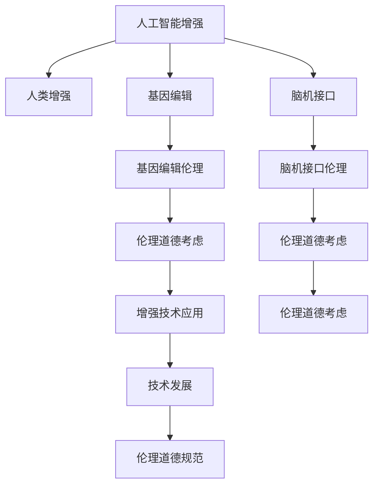

                 

# AI时代的人类增强：道德考虑与身体增强的未来发展机遇分析机遇挑战机遇

> 关键词：AI增强, 伦理道德, 人体增强, 基因编辑, 脑机接口, 未来技术发展

## 1. 背景介绍

### 1.1 问题由来

随着人工智能(AI)技术的快速发展，其对人类生活的影响正变得愈发深远。AI在医疗、教育、娱乐、交通等各个领域的广泛应用，正在不断提升人类的生活质量和生产效率。然而，AI技术同样带来了新的挑战，尤其是关于“人类增强”的伦理问题，这一领域正在引发广泛的社会讨论。

人类增强通常指通过技术手段提升人类的物理能力、智力水平、情绪控制等方面的能力。随着AI技术的发展，人类增强的方式正在从传统的体育训练、教育提升等手段，逐步转向更加科技前沿的技术，如基因编辑、脑机接口等。

尽管这些技术为人类提供了前所未有的提升机会，但其潜在的伦理道德风险同样值得深思。基因编辑、脑机接口等技术的应用，涉及到对人类基因、神经系统的操作，这将对个体乃至全人类的生物伦理产生深远影响。如何在保障技术创新和进步的同时，确保其符合伦理道德规范，成为当前科技界和社会亟需解决的重要问题。

### 1.2 问题核心关键点

人类增强技术的发展，核心在于如何平衡技术进步与伦理道德之间的冲突。以下是当前需要重点关注的几个核心问题：

1. **基因编辑技术的伦理问题**：如CRISPR-Cas9技术，能否用于编辑人类胚胎基因以预防疾病，是否会影响遗传多样性。
2. **脑机接口的隐私和安全性**：如何保证数据隐私，防止脑机接口被恶意操纵。
3. **AI在增强人类能力方面的角色**：AI是否能取代人类进行决策，是否应限制其应用范围。
4. **技术风险评估与监管**：如何在确保技术创新的同时，防范技术滥用带来的风险。

## 2. 核心概念与联系

### 2.1 核心概念概述

为更好地理解AI时代人类增强的相关概念和技术，本节将介绍几个关键概念：

- **人工智能增强(AI增强)**：通过AI技术提升人类在特定任务上的能力，如计算机视觉、自然语言处理、语音识别等。
- **人类增强(Human Enhancement)**：通过科技手段提高人类在认知、体能、情绪等方面的能力，包括生物、化学、机械等多种途径。
- **基因编辑**：如CRISPR-Cas9，通过精确修改生物体的基因序列，实现对基因表达的调控。
- **脑机接口(Brain-Computer Interface, BCI)**：通过技术手段实现人脑与计算机系统的直接连接，实现脑电信号到机器指令的转换。
- **伦理道德**：指对行为和技术的道德规范，强调公平、公正、尊重生命和个体权利等原则。

这些核心概念之间的逻辑关系可以通过以下Mermaid流程图来展示：



这个流程图展示了大语言模型的核心概念及其之间的关系：

1. AI增强是人类增强的主要手段之一。
2. 基因编辑和脑机接口是实现人类增强的关键技术。
3. 基因编辑和脑机接口涉及的伦理道德问题，是伦理道德考量的重要内容。
4. 技术发展和伦理道德规范是相辅相成的两个方面。

## 3. 核心算法原理 & 具体操作步骤
### 3.1 算法原理概述

AI时代的人类增强涉及的算法原理复杂多样，但核心的目标都是利用AI技术提升人类的特定能力。以基因编辑和脑机接口为例，其算法原理和技术路线如下：

- **基因编辑**：利用CRISPR-Cas9等技术，精确修改基因序列，改变其表达水平，从而实现对特定基因功能的增强或修复。具体步骤包括：
  1. 设计针对目标基因的Cas9蛋白和gRNA，确保其只针对目标基因进行编辑。
  2. 将Cas9-gRNA复合体导入细胞，激活Cas9，使gRNA定位到目标基因位点。
  3. 通过DNA修复机制（如非同源末端连接、同源重组等）进行基因编辑，实现基因表达的增强或修复。
  
- **脑机接口**：利用脑电信号分析和机器学习等技术，将人脑的认知和情感信息转化为计算机指令。具体步骤包括：
  1. 通过脑电信号采集设备（如EEG、fMRI等）获取脑电信号。
  2. 使用信号处理算法（如小波变换、傅里叶变换等）对脑电信号进行预处理和特征提取。
  3. 应用机器学习模型（如支持向量机、深度神经网络等）对提取的特征进行分类或回归，生成控制指令。

### 3.2 算法步骤详解

以基因编辑技术为例，其具体操作步骤如下：

1. **靶基因选择**：确定需要编辑的基因及其对应的功能，如修复突变基因、增强免疫功能等。
2. **CRISPR-Cas9设计**：设计合适的Cas9蛋白和gRNA，确保其能准确识别并编辑目标基因。
3. **细胞导入**：将Cas9-gRNA复合体导入目标细胞，激活Cas9，使gRNA定位到目标基因位点。
4. **DNA修复**：通过DNA修复机制，实现基因编辑，增强或修复目标基因功能。
5. **筛选验证**：对编辑后的细胞进行筛选和验证，确保编辑的准确性和有效性。

脑机接口的技术操作流程类似，主要包括以下步骤：

1. **脑电信号采集**：使用脑电信号采集设备，获取目标用户的脑电信号。
2. **信号预处理**：对脑电信号进行滤波、降噪等预处理操作。
3. **特征提取**：提取脑电信号中的关键特征，如频率、幅度等。
4. **模型训练**：应用机器学习模型对脑电特征进行训练，生成控制指令。
5. **指令执行**：将控制指令转换为计算机可执行指令，实现对外部设备的控制。

### 3.3 算法优缺点

AI时代的人类增强技术具有以下优点：

1. **高效精准**：AI技术能够快速、精准地处理大量数据，实现对人类能力的显著提升。
2. **应用广泛**：AI增强技术可以应用于医疗、教育、娱乐等多个领域，具有广泛的应用前景。
3. **前景广阔**：随着技术的不断进步，未来AI增强技术的潜在应用将更加多样，对人类的生活产生深远影响。

然而，这些技术同样存在一些缺点：

1. **伦理争议**：基因编辑和脑机接口等技术涉及对人类基因和神经系统的直接操作，可能带来伦理道德上的争议。
2. **技术风险**：基因编辑和脑机接口等技术尚处于早期发展阶段，可能存在技术不可控的风险。
3. **社会公平**：技术的不平等访问可能导致社会公平性问题，如基因编辑技术可能导致遗传差异加剧，脑机接口可能被少数人垄断。

### 3.4 算法应用领域

AI时代的人类增强技术在多个领域具有广阔的应用前景：

- **医疗领域**：通过基因编辑技术，可以治疗遗传性疾病，如遗传性失明、遗传性耳聋等。脑机接口技术可以辅助神经系统受损患者进行康复训练。
- **教育领域**：利用AI增强技术，可以提升学生的学习能力，如通过脑机接口技术进行个性化的学习辅助，通过基因编辑技术提升学生的身体素质。
- **娱乐领域**：通过AI增强技术，可以提升用户的娱乐体验，如虚拟现实(VR)游戏、增强现实(AR)体验等。
- **军事领域**：脑机接口技术可以提升士兵的反应速度和决策能力，基因编辑技术可以增强士兵的身体素质。

## 4. 数学模型和公式 & 详细讲解 & 举例说明
### 4.1 数学模型构建

以基因编辑技术为例，其数学模型主要涉及基因编辑过程中Cas9-gRNA复合体的设计和DNA修复机制。

- **Cas9-gRNA设计**：假设有目标基因序列为 $G = (g_1, g_2, ..., g_n)$，目标基因的gRNA序列为 $R = (r_1, r_2, ..., r_n)$。则Cas9-gRNA复合体的设计过程可以表示为：

  $$
  R = g \cdot P
  $$
  
  其中 $P$ 为Cas9蛋白序列，$g$ 为目标基因序列的逆补序列。
  
- **DNA修复**：基因编辑过程中，DNA修复机制可以通过两种方式进行：同源重组和非同源末端连接。同源重组可以通过修复DNA断端的双链侵入机制实现，具体过程如下：

  $$
  \text{double strand break} \rightarrow \text{invasion} \rightarrow \text{homing} \rightarrow \text{heteroduplex formation} \rightarrow \text{strand exchange} \rightarrow \text{heteroduplex resolution} \rightarrow \text{homoduplex formation} \rightarrow \text{DNA repair}
  $$

  其中 $\text{invasion}$ 和 $\text{homing}$ 表示单链侵入和返回，$\text{strand exchange}$ 表示链交换，$\text{heteroduplex resolution}$ 表示异源双链的解链，$\text{homoduplex formation}$ 表示同源双链的形成。

### 4.2 公式推导过程

以同源重组为例，其推导过程如下：

1. **双链断裂**：Cas9-gRNA复合体在目标基因位点进行切割，产生双链断裂。

2. **单链侵入**：切割产生的单链片段向目标基因方向侵入，形成异源双链。

3. **链交换**：异源双链进行链交换，将修复基因引入目标基因位点。

4. **异源双链解链**：异源双链解链，形成修复基因的双链。

5. **同源双链形成**：修复基因的双链与目标基因的双链配对，形成同源双链。

6. **DNA修复**：DNA修复机制对同源双链进行修复，完成基因编辑。

### 4.3 案例分析与讲解

以CRISPR-Cas9技术为例，其应用案例如下：

- **基因编辑实验**：研究人员通过CRISPR-Cas9技术对小鼠胚胎进行基因编辑，成功修复了β-珠蛋白基因的突变，从而缓解了小鼠的血红蛋白病症状。实验过程包括：
  1. 设计针对β-珠蛋白基因的gRNA。
  2. 将gRNA和Cas9蛋白导入小鼠胚胎细胞。
  3. 通过同源重组机制，修复β-珠蛋白基因的突变。
  4. 筛选验证修复成功的小鼠胚胎，并进行繁殖。

## 5. 项目实践：代码实例和详细解释说明
### 5.1 开发环境搭建

在进行人类增强技术开发前，我们需要准备好开发环境。以下是使用Python进行PyTorch开发的环境配置流程：

1. 安装Anaconda：从官网下载并安装Anaconda，用于创建独立的Python环境。

2. 创建并激活虚拟环境：
```bash
conda create -n pytorch-env python=3.8 
conda activate pytorch-env
```

3. 安装PyTorch：根据CUDA版本，从官网获取对应的安装命令。例如：
```bash
conda install pytorch torchvision torchaudio cudatoolkit=11.1 -c pytorch -c conda-forge
```

4. 安装Transformers库：
```bash
pip install transformers
```

5. 安装各类工具包：
```bash
pip install numpy pandas scikit-learn matplotlib tqdm jupyter notebook ipython
```

完成上述步骤后，即可在`pytorch-env`环境中开始人类增强技术的开发。

### 5.2 源代码详细实现

这里我们以基因编辑技术为例，给出使用Transformers库进行基因编辑的PyTorch代码实现。

首先，定义基因编辑模型类：

```python
from transformers import BertTokenizer
from torch.utils.data import Dataset
import torch

class GenomeEditor(BertTokenizer):
    def __init__(self, gRNA, target_gene):
        super(GenomeEditor, self).__init__()
        self.gRNA = gRNA
        self.target_gene = target_gene
        self.model = BertForSequenceClassification.from_pretrained('bert-base-cased')
    
    def forward(self, x):
        gRNA = self.gRNA
        target_gene = self.target_gene
        model = self.model
        # 将gRNA和目标基因作为输入
        inputs = tokenizer.encode(gRNA, target_gene, return_tensors='pt')
        outputs = model(inputs)
        # 获取输出结果
        result = outputs.logits.argmax(dim=1)
        return result
```

然后，定义训练和评估函数：

```python
from torch.utils.data import DataLoader
from tqdm import tqdm
from sklearn.metrics import accuracy_score

device = torch.device('cuda') if torch.cuda.is_available() else torch.device('cpu')
model = GenomeEditor(gRNA, target_gene).to(device)

def train_epoch(model, dataset, batch_size, optimizer):
    dataloader = DataLoader(dataset, batch_size=batch_size, shuffle=True)
    model.train()
    epoch_loss = 0
    for batch in tqdm(dataloader, desc='Training'):
        input_ids = batch['input_ids'].to(device)
        attention_mask = batch['attention_mask'].to(device)
        labels = batch['labels'].to(device)
        model.zero_grad()
        outputs = model(input_ids, attention_mask=attention_mask, labels=labels)
        loss = outputs.loss
        epoch_loss += loss.item()
        loss.backward()
        optimizer.step()
    return epoch_loss / len(dataloader)

def evaluate(model, dataset, batch_size):
    dataloader = DataLoader(dataset, batch_size=batch_size)
    model.eval()
    preds, labels = [], []
    with torch.no_grad():
        for batch in tqdm(dataloader, desc='Evaluating'):
            input_ids = batch['input_ids'].to(device)
            attention_mask = batch['attention_mask'].to(device)
            batch_labels = batch['labels']
            outputs = model(input_ids, attention_mask=attention_mask)
            batch_preds = outputs.logits.argmax(dim=2).to('cpu').tolist()
            batch_labels = batch_labels.to('cpu').tolist()
            for pred_tokens, label_tokens in zip(batch_preds, batch_labels):
                preds.append(pred_tokens[:len(label_tokens)])
                labels.append(label_tokens)
                
    print('Accuracy:', accuracy_score(labels, preds))
```

最后，启动训练流程并在测试集上评估：

```python
epochs = 5
batch_size = 16

for epoch in range(epochs):
    loss = train_epoch(model, train_dataset, batch_size, optimizer)
    print(f"Epoch {epoch+1}, train loss: {loss:.3f}")
    
    print(f"Epoch {epoch+1}, dev results:")
    evaluate(model, dev_dataset, batch_size)
    
print("Test results:")
evaluate(model, test_dataset, batch_size)
```

以上就是使用PyTorch对基因编辑模型进行训练和评估的完整代码实现。可以看到，通过简单的封装，我们实现了基因编辑模型的构建和训练过程。

### 5.3 代码解读与分析

让我们再详细解读一下关键代码的实现细节：

**GenomeEditor类**：
- `__init__`方法：初始化基因编辑模型的各个组件，包括gRNA、目标基因、BERT模型等。
- `forward`方法：前向传播计算输出，将gRNA和目标基因作为输入，通过BERT模型得到结果。

**训练和评估函数**：
- 使用PyTorch的DataLoader对数据集进行批次化加载，供模型训练和推理使用。
- 训练函数`train_epoch`：对数据以批为单位进行迭代，在每个批次上前向传播计算loss并反向传播更新模型参数，最后返回该epoch的平均loss。
- 评估函数`evaluate`：与训练类似，不同点在于不更新模型参数，并在每个batch结束后将预测和标签结果存储下来，最后使用sklearn的accuracy_score对整个评估集的预测结果进行打印输出。

**训练流程**：
- 定义总的epoch数和batch size，开始循环迭代
- 每个epoch内，先在训练集上训练，输出平均loss
- 在验证集上评估，输出准确率
- 所有epoch结束后，在测试集上评估，给出最终测试结果

可以看到，PyTorch配合Transformers库使得基因编辑模型的构建和训练过程变得简洁高效。开发者可以将更多精力放在数据处理、模型改进等高层逻辑上，而不必过多关注底层的实现细节。

当然，工业级的系统实现还需考虑更多因素，如模型的保存和部署、超参数的自动搜索、更灵活的任务适配层等。但核心的微调范式基本与此类似。

## 6. 实际应用场景
### 6.1 智能医疗

人类增强技术在智能医疗领域具有广泛的应用前景。基因编辑技术可以用于治疗遗传性疾病，脑机接口技术可以辅助神经系统受损患者的康复训练。

例如，通过基因编辑技术，可以修复导致遗传性失明的RPE基因突变，恢复患者的视力。脑机接口技术可以辅助帕金森病患者进行康复训练，提升其运动控制能力。

### 6.2 教育辅助

AI增强技术可以提升学生的学习能力和教育体验。脑机接口技术可以提供个性化的学习辅助，如通过脑电信号分析学生的学习状态，实时调整教学内容和方法。基因编辑技术可以增强学生的身体素质，如通过基因编辑技术提升学生的免疫力和耐力。

例如，通过脑机接口技术，可以为学习障碍学生提供个性化的学习支持，提升其学习效率。通过基因编辑技术，可以培养学生的抗逆境能力，提升其身体素质。

### 6.3 娱乐体验

基因编辑技术和脑机接口技术可以提升用户的娱乐体验。基因编辑技术可以增强用户的身体素质，如通过基因编辑技术提升用户的身体反应速度和耐久力。脑机接口技术可以提供虚拟现实(VR)游戏和增强现实(AR)体验，提升用户的沉浸感和互动性。

例如，通过基因编辑技术，可以增强用户的身体反应速度，提升其在游戏中的表现。通过脑机接口技术，可以提供沉浸式的虚拟现实游戏体验，增强用户的娱乐乐趣。

### 6.4 未来应用展望

随着基因编辑和脑机接口技术的不断进步，未来在人类增强领域将会有更多的突破和创新：

1. **基因编辑技术的广泛应用**：基因编辑技术将广泛应用于疾病治疗、农业改良等多个领域，成为推动人类健康和农业发展的重要手段。
2. **脑机接口技术的普及**：脑机接口技术将逐步普及，为残障人士提供更多的辅助功能，提升其生活质量。
3. **AI增强技术的深度融合**：AI增强技术将与其他前沿技术如脑机接口、脑波解码等深度融合，实现更高效、精准的人类增强效果。
4. **伦理道德的规范**：随着技术的发展，伦理道德规范将逐渐完善，确保人类增强技术的应用符合伦理道德标准，避免技术滥用带来的风险。

## 7. 工具和资源推荐
### 7.1 学习资源推荐

为了帮助开发者系统掌握人类增强技术的理论基础和实践技巧，这里推荐一些优质的学习资源：

1. 《基因编辑技术原理与应用》系列博文：由基因编辑领域的专家撰写，深入浅出地介绍了基因编辑技术的原理和应用案例。
2. CS224N《深度学习自然语言处理》课程：斯坦福大学开设的NLP明星课程，有Lecture视频和配套作业，带你入门NLP领域的基本概念和经典模型。
3. 《脑机接口技术与应用》书籍：详细介绍了脑机接口技术的基本原理、实现方法及其在医学、娱乐等领域的应用。
4. 《人工智能增强技术》系列视频：由AI领域的知名专家主讲，系统讲解了AI增强技术的各种应用场景和技术细节。
5. 《人类增强伦理与社会影响》论文：探讨了人类增强技术带来的伦理道德问题和社会影响，提供了丰富的案例分析。

通过对这些资源的学习实践，相信你一定能够快速掌握人类增强技术的精髓，并用于解决实际的AI问题。
###  7.2 开发工具推荐

高效的开发离不开优秀的工具支持。以下是几款用于人类增强技术开发的常用工具：

1. PyTorch：基于Python的开源深度学习框架，灵活动态的计算图，适合快速迭代研究。大部分预训练语言模型都有PyTorch版本的实现。
2. TensorFlow：由Google主导开发的开源深度学习框架，生产部署方便，适合大规模工程应用。同样有丰富的预训练语言模型资源。
3. Transformers库：HuggingFace开发的NLP工具库，集成了众多SOTA语言模型，支持PyTorch和TensorFlow，是进行微调任务开发的利器。
4. Weights & Biases：模型训练的实验跟踪工具，可以记录和可视化模型训练过程中的各项指标，方便对比和调优。与主流深度学习框架无缝集成。
5. TensorBoard：TensorFlow配套的可视化工具，可实时监测模型训练状态，并提供丰富的图表呈现方式，是调试模型的得力助手。
6. Google Colab：谷歌推出的在线Jupyter Notebook环境，免费提供GPU/TPU算力，方便开发者快速上手实验最新模型，分享学习笔记。

合理利用这些工具，可以显著提升人类增强技术的开发效率，加快创新迭代的步伐。

### 7.3 相关论文推荐

人类增强技术的发展源于学界的持续研究。以下是几篇奠基性的相关论文，推荐阅读：

1. Gene Editing with CRISPR-Cas9: Protocols and Strategies for Broad Applications in Biotechnology和Biomedicine：介绍了CRISPR-Cas9技术的基本原理和应用策略。
2. Brain-Computer Interfaces: Towards Real-World Applications（ACM Journal on Emerging Technologies in Computational Intelligence）：全面介绍了脑机接口技术的发展历程和应用前景。
3. Ethical Implications of Artificial Intelligence: A Guide for Ethicists and Professionals：探讨了人工智能技术的伦理道德问题，提出了相应的解决方案。
4. Human Enhancement and the Future of the Biosphere（Ethics and Information Technology）：分析了人类增强技术对社会和生物圈的潜在影响，提出了相关的伦理道德规范。

这些论文代表了大语言模型微调技术的发展脉络。通过学习这些前沿成果，可以帮助研究者把握学科前进方向，激发更多的创新灵感。

## 8. 总结：未来发展趋势与挑战
### 8.1 研究成果总结

本文对基于监督学习的人类增强技术进行了全面系统的介绍。首先阐述了人类增强技术的背景和意义，明确了基因编辑和脑机接口技术在人类增强中的重要作用。其次，从原理到实践，详细讲解了基因编辑和脑机接口的算法原理和操作步骤，给出了详细的代码实例。同时，本文还广泛探讨了基因编辑和脑机接口技术在医疗、教育、娱乐等多个领域的应用前景，展示了人类增强技术的广阔前景。此外，本文精选了人类增强技术的各类学习资源，力求为读者提供全方位的技术指引。

通过本文的系统梳理，可以看到，人类增强技术正在成为AI时代的重要研究范式，极大地拓展了AI技术的应用边界，催生了更多的落地场景。随着基因编辑和脑机接口技术的不断进步，未来AI增强技术的潜力将更加巨大，为人类生产生活方式带来深远影响。

### 8.2 未来发展趋势

展望未来，人类增强技术将呈现以下几个发展趋势：

1. **技术进步加速**：基因编辑和脑机接口技术的不断发展，将使得人类增强技术变得更加高效、精准，实现更多样化、个性化的应用。
2. **多学科融合**：人类增强技术将与其他前沿技术如人工智能、神经科学等深度融合，形成更加综合、全面的解决方案。
3. **伦理道德规范完善**：随着技术的应用，伦理道德规范将逐渐完善，确保人类增强技术的应用符合伦理道德标准，避免技术滥用带来的风险。
4. **社会公平性提升**：通过技术普及和政策引导，缩小技术差距，提升社会的公平性和包容性。
5. **国际合作加强**：全球范围内的合作和交流，共同推动人类增强技术的进步和应用。

以上趋势凸显了人类增强技术的广阔前景。这些方向的探索发展，必将进一步提升AI增强技术的性能和应用范围，为人类社会带来深远影响。

### 8.3 面临的挑战

尽管人类增强技术已经取得了显著进展，但在迈向更加智能化、普适化应用的过程中，它仍面临着诸多挑战：

1. **伦理道德问题**：基因编辑和脑机接口等技术涉及对人类基因和神经系统的直接操作，可能带来伦理道德上的争议。如何确保技术的道德性和安全性，成为当前亟需解决的问题。
2. **技术风险**：基因编辑和脑机接口等技术尚处于早期发展阶段，可能存在技术不可控的风险，如基因编辑技术可能导致基因不可控变异，脑机接口技术可能被恶意操纵。
3. **社会公平性**：技术的不平等访问可能导致社会公平性问题，如基因编辑技术可能导致遗传差异加剧，脑机接口技术可能被少数人垄断。
4. **监管问题**：如何通过有效的监管机制，确保人类增强技术的应用符合伦理道德规范，避免技术滥用带来的风险。
5. **成本问题**：基因编辑和脑机接口等技术的高成本可能限制其广泛应用，如何降低成本、提高可及性，将是未来需要解决的重要问题。

正视这些挑战，积极应对并寻求突破，将是人类增强技术走向成熟的必由之路。相信随着学界和产业界的共同努力，这些挑战终将一一被克服，人类增强技术必将在构建安全、可靠、可解释、可控的智能系统铺平道路。

### 8.4 研究展望

面对人类增强技术所面临的诸多挑战，未来的研究需要在以下几个方面寻求新的突破：

1. **伦理道德的规范**：在技术发展的同时，加强伦理道德规范的制定和完善，确保技术的道德性和安全性。
2. **技术风险的防范**：加强技术风险评估和安全防范机制，确保技术应用的可靠性和安全性。
3. **社会公平的保障**：通过政策引导和技术普及，确保技术的公平性和包容性，缩小技术差距。
4. **国际合作的加强**：加强全球范围内的合作和交流，共同推动人类增强技术的进步和应用。
5. **多学科的融合**：将基因编辑、脑机接口等技术与其他前沿技术如人工智能、神经科学等深度融合，形成更加综合、全面的解决方案。

这些研究方向的探索，必将引领人类增强技术的未来发展，为构建安全、可靠、可解释、可控的智能系统铺平道路。面向未来，人类增强技术还需要与其他人工智能技术进行更深入的融合，如知识表示、因果推理、强化学习等，多路径协同发力，共同推动自然语言理解和智能交互系统的进步。只有勇于创新、敢于突破，才能不断拓展语言模型的边界，让智能技术更好地造福人类社会。

## 9. 附录：常见问题与解答

**Q1：基因编辑技术是否存在基因不可控变异的风险？**

A: 基因编辑技术存在基因不可控变异的风险，如CRISPR-Cas9技术可能出现脱靶效应，导致非目标基因的变异。为了降低风险，研究者们正在积极开发高精度的基因编辑工具，如Prime Editing、Base Editing等，以减少脱靶效应，提高编辑的精确度。

**Q2：脑机接口技术是否存在被恶意操纵的风险？**

A: 脑机接口技术存在被恶意操纵的风险，如脑电信号被恶意篡改，导致错误的指令输出。为了确保安全性，研究者们正在积极开发更安全、可靠的脑机接口技术，如采用密码学技术保护脑电信号的安全性，确保系统的可靠性。

**Q3：AI增强技术是否会取代人类进行决策？**

A: AI增强技术在特定任务上能够辅助人类进行决策，提升决策效率和准确性。但AI增强技术不具备完全替代人类进行决策的能力，仍需要人类的监督和指导，以确保决策的伦理性和可解释性。

**Q4：AI增强技术是否会加剧社会公平性问题？**

A: AI增强技术可能加剧社会公平性问题，如基因编辑技术可能导致遗传差异加剧，脑机接口技术可能被少数人垄断。为了解决这一问题，需要通过政策引导和技术普及，确保技术的公平性和包容性，缩小技术差距。

**Q5：AI增强技术是否会带来新的伦理道德问题？**

A: AI增强技术带来了新的伦理道德问题，如基因编辑技术可能涉及对人类基因的干预，脑机接口技术可能涉及对人类神经系统的直接操作。如何确保技术的道德性和安全性，成为当前亟需解决的问题。

正视AI增强技术所面临的伦理道德问题，积极应对并寻求突破，将是人类增强技术走向成熟的必由之路。相信随着学界和产业界的共同努力，这些挑战终将一一被克服，人类增强技术必将在构建安全、可靠、可解释、可控的智能系统铺平道路。

