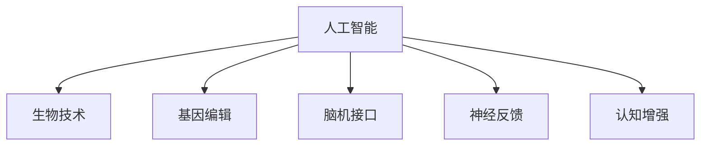

                 

## 1. 背景介绍

### 1.1 问题由来
随着人工智能(AI)技术的不断进步，人类增强(Augmented Humans)正逐步从科幻变成现实。生物技术与AI技术的融合，使得通过基因编辑、脑机接口、药物辅助等方式实现人类能力的提升成为可能。这不仅引发了科技界和社会的广泛关注，也带来了伦理道德、法律政策等方面的深层次问题。

### 1.2 问题核心关键点
人工智能时代的人类增强包括身体增强和认知增强两大方向。具体而言，身体增强主要通过基因编辑、药物、假肢等技术提升人类的身体机能，如耐力、记忆力和感官功能；认知增强则借助脑机接口、神经反馈技术、AI辅助认知训练等方式提升人的思维能力和情绪管理。

人类增强的发展带来了前所未有的机遇，如在健康医疗、教育、军事等领域的广泛应用。但同时，也带来了关于人类身份、自由、权利、伦理等方面的巨大挑战。本文旨在深入探讨人类增强技术的道德考量，并预测其未来发展趋势及面临的挑战。

### 1.3 问题研究意义
研究人工智能时代的人类增强技术，对于把握技术发展的伦理边界，推动技术的健康发展，具有重要意义：

1. **引导技术规范**：通过探讨伦理道德问题，为人工智能时代的人类增强技术制定规范，避免技术滥用。
2. **促进公平公正**：明确技术应用的社会责任，确保技术惠及更多人群，避免技术鸿沟。
3. **推动产业发展**：为人工智能技术在人类增强领域的商业化应用提供参考，推动相关产业的发展。
4. **增进公众理解**：普及人类增强技术的知识，提高公众对技术的认知，促进技术社会接受度。
5. **预防潜在风险**：提前预见和评估技术应用可能带来的风险，制定相应的预防措施。

## 2. 核心概念与联系

### 2.1 核心概念概述

为更好地理解人工智能时代的人类增强技术，本节将介绍几个核心概念：

- **人工智能(AI)**：指通过计算机模拟人类智能活动的技术，包括机器学习、自然语言处理、计算机视觉等领域。
- **人类增强(Augmented Humans)**：通过生物技术、AI技术等手段，提升人类的物理、认知能力。
- **生物技术(Biotechnology)**：利用生命科学知识，对生物体系进行改造和优化。
- **基因编辑(Genome Editing)**：通过CRISPR-Cas9等技术，对基因序列进行精确修改，实现治疗和增强效果。
- **脑机接口(Brain-Computer Interface, BCI)**：实现人脑与计算机的直接交互，用于疾病治疗和认知增强。
- **神经反馈(Neural Feedback)**：通过实时监测大脑活动，提供反馈信号，促进神经系统的改善。
- **认知增强(Cognitive Enhancement)**：利用AI技术，提升人类的记忆、注意力、决策能力等。

这些核心概念之间的逻辑关系可以通过以下Mermaid流程图来展示：



这个流程图展示了许多与人类增强相关的技术，以及它们之间的关联和相互作用。

## 3. 核心算法原理 & 具体操作步骤
### 3.1 算法原理概述

人工智能时代的人类增强技术涉及多个学科领域的交叉，其核心算法原理复杂多样。本文将重点介绍基因编辑、脑机接口和认知增强等关键技术的算法原理。

### 3.2 算法步骤详解

#### 3.2.1 基因编辑
基因编辑的核心算法为CRISPR-Cas9技术。该技术基于DNA双链的特性，通过精确识别和切割目标DNA序列，实现基因的插入、删除或替换。CRISPR-Cas9的步骤包括：

1. **设计gRNA**：根据目标基因序列设计一段短的指导RNA(gRNA)，引导Cas9酶定位到特定位置。
2. **构建编辑系统**：将gRNA与Cas9酶结合，形成Cas9-gRNA复合体。
3. **导入编辑系统**：将Cas9-gRNA复合体引入细胞中。
4. **识别目标位点**：Cas9酶根据gRNA引导，定位到目标DNA序列。
5. **切割DNA**：Cas9酶在目标位点进行双链切割，产生DNA双链断裂。
6. **修复机制**：细胞利用自身的修复机制，对断裂的DNA进行修复，可能发生插入、删除或替换。

#### 3.2.2 脑机接口
脑机接口的核心算法包括信号采集、预处理、特征提取、模型训练和实时交互等步骤。具体步骤包括：

1. **信号采集**：通过脑电图(EEG)、功能磁共振成像(fMRI)等技术，采集大脑活动信号。
2. **信号预处理**：对采集信号进行滤波、归一化、去噪等预处理。
3. **特征提取**：从预处理后的信号中提取特征，如频域、时域特征等。
4. **模型训练**：利用机器学习算法，如SVM、神经网络等，对提取的特征进行训练，建立信号与指令之间的映射关系。
5. **实时交互**：将训练好的模型部署到BCI系统中，实现实时解码大脑信号，执行指定指令。

#### 3.2.3 认知增强
认知增强的核心算法为AI辅助认知训练。该技术通过自然语言处理(NLP)、计算机视觉(CV)等技术，辅助用户进行认知训练。具体步骤包括：

1. **任务设计**：根据目标认知能力，设计相应的训练任务。
2. **任务执行**：通过NLP技术，引导用户执行训练任务。
3. **结果评估**：利用CV技术，评估用户任务的完成情况。
4. **反馈调整**：根据评估结果，调整训练任务的难度和类型，提供个性化的训练方案。

### 3.3 算法优缺点

人工智能时代的人类增强技术具有以下优点：

- **提升能力**：通过技术手段，大幅提升人类的物理、认知能力，拓展人类潜力。
- **应用广泛**：涵盖健康医疗、教育、军事等多个领域，具有广泛的应用前景。
- **加速创新**：促进生物技术和AI技术的交叉融合，推动科技创新。

同时，也存在以下缺点：

- **伦理争议**：技术的应用引发了关于人类身份、自由、权利等方面的伦理争议。
- **潜在风险**：技术的不成熟可能导致未知的健康风险，甚至引发社会不稳定。
- **资源消耗**：技术研发和应用需要大量资源，可能对环境造成负面影响。

### 3.4 算法应用领域

人工智能时代的人类增强技术在多个领域得到了广泛应用，如：

- **医疗健康**：基因编辑技术用于治疗遗传性疾病、提升免疫力；脑机接口用于辅助失能人士、改善手术效果。
- **教育培训**：认知增强技术用于提高学习效率、辅助个性化教学。
- **军事国防**：提升士兵的身体素质、增强情报分析能力。
- **体育竞技**：通过基因编辑、脑机接口技术，提升运动员的体能和心理素质。
- **娱乐文化**：增强用户的沉浸体验、提升互动效果。

此外，技术还在不断拓展应用场景，如交通管理、城市规划等，为社会带来更深远的影响。

## 4. 数学模型和公式 & 详细讲解  
### 4.1 数学模型构建

人工智能时代的人类增强技术涉及多种数学模型，以下是几个关键模型的构建方法：

#### 4.1.1 基因编辑模型
基因编辑的数学模型主要包括CRISPR-Cas9系统的设计和优化。假设目标基因序列为 $S$，设计好的gRNA为 $g$，Cas9酶为 $C$，则基因编辑过程可以用以下方程表示：

$$
C + g \rightarrow Cg \quad \text{(形成Cas9-gRNA复合体)}
$$

$$
Cg + S \rightarrow CgS \quad \text{(识别目标位点)}
$$

$$
CgS \rightarrow \text{DNA双链断裂} \quad \text{(切割DNA)}
$$

$$
\text{DNA双链断裂} \rightarrow \text{修复机制} \quad \text{(修复DNA)}
$$

#### 4.1.2 脑机接口模型
脑机接口的数学模型主要涉及信号采集、预处理、特征提取和模型训练。设采集到的信号为 $X$，预处理后的信号为 $Y$，提取的特征为 $Z$，训练得到的模型为 $M$，则脑机接口的模型可以用以下方程表示：

$$
X \rightarrow Y \quad \text{(信号预处理)}
$$

$$
Y \rightarrow Z \quad \text{(特征提取)}
$$

$$
Z \rightarrow M \quad \text{(模型训练)}
$$

$$
M \rightarrow \text{指令解码} \quad \text{(实时交互)}
$$

#### 4.1.3 认知增强模型
认知增强的数学模型主要涉及任务设计、任务执行、结果评估和反馈调整。设目标认知能力为 $C$，训练任务为 $T$，执行结果为 $R$，反馈调整模型为 $F$，则认知增强的模型可以用以下方程表示：

$$
C \rightarrow T \quad \text{(任务设计)}
$$

$$
T \rightarrow R \quad \text{(任务执行)}
$$

$$
R \rightarrow C \quad \text{(结果评估)}
$$

$$
C \rightarrow F \quad \text{(反馈调整)}
$$

### 4.2 公式推导过程

#### 4.2.1 基因编辑公式推导
基因编辑的核心是Cas9酶在目标位点的切割。假设目标位点为 $P$，gRNA为 $g$，则Cas9酶在目标位点 $P$ 的切割概率为：

$$
P_{\text{cut}} = k_1 \frac{[\text{Cas9}] [g]}{K_1 + [\text{Cas9}]} \frac{[\text{gRNA}]^2}{K_2 + [\text{gRNA}]}
$$

其中 $k_1$ 和 $K_1$ 为Cas9酶与gRNA结合的速率常数，$K_2$ 为gRNA自结合速率常数。

#### 4.2.2 脑机接口公式推导
脑机接口的数学模型涉及信号采集、预处理、特征提取和模型训练。设采集信号的噪音为 $N$，预处理后信号的标准差为 $\sigma_Y$，特征提取后信号的标准差为 $\sigma_Z$，模型训练的误差为 $\epsilon_M$，则脑机接口的数学模型可以用以下方程表示：

$$
\text{SNR}_Y = \frac{\sigma_Y}{N}
$$

$$
\text{SNR}_Z = \frac{\sigma_Z}{N}
$$

$$
\text{MSE}_M = \epsilon_M^2
$$

其中 SNR 表示信噪比，MSE 表示均方误差。

#### 4.2.3 认知增强公式推导
认知增强的数学模型涉及任务设计、任务执行、结果评估和反馈调整。设任务设计的难度为 $D$，任务执行的成功率为 $S$，结果评估的准确率为 $A$，反馈调整的精度为 $F$，则认知增强的数学模型可以用以下方程表示：

$$
D \rightarrow T \quad \text{(任务设计)}
$$

$$
T \rightarrow R \quad \text{(任务执行)}
$$

$$
R \rightarrow C \quad \text{(结果评估)}
$$

$$
C \rightarrow F \quad \text{(反馈调整)}
$$

### 4.3 案例分析与讲解

#### 4.3.1 基因编辑案例分析
CRISPR-Cas9技术已经成功应用于基因治疗和基因编辑领域。例如，在治疗遗传性疾病SMA中，通过基因编辑技术成功实现了SMA基因的修复。基因编辑的过程可以概括为：

1. **gRNA设计**：设计针对SMA基因的gRNA序列。
2. **Cas9表达**：将Cas9基因导入患者细胞中，使其表达Cas9酶。
3. **基因切割**：通过gRNA引导，Cas9酶在SMA基因中进行双链切割。
4. **DNA修复**：细胞进行DNA修复，修复后的基因可以正常表达，从而治愈SMA。

#### 4.3.2 脑机接口案例分析
Google开发的Brain-BCI项目，通过脑电图技术实现了人类与计算机的直接交互。具体过程包括：

1. **信号采集**：使用EEG设备采集大脑活动信号。
2. **信号预处理**：对采集信号进行滤波和归一化处理。
3. **特征提取**：从预处理信号中提取频域特征。
4. **模型训练**：利用神经网络模型对提取的频域特征进行训练，建立信号与指令之间的映射关系。
5. **实时交互**：将训练好的模型部署到BCI系统中，实现实时解码大脑信号，执行指定指令。

#### 4.3.3 认知增强案例分析
MossLab开发的CogniFit平台，通过认知增强技术帮助用户提升学习能力。具体过程包括：

1. **任务设计**：根据用户的学习需求，设计相应的认知训练任务。
2. **任务执行**：通过自然语言处理技术，引导用户执行训练任务。
3. **结果评估**：利用计算机视觉技术，评估用户任务的完成情况。
4. **反馈调整**：根据评估结果，调整训练任务的难度和类型，提供个性化的训练方案。

## 5. 项目实践：代码实例和详细解释说明
### 5.1 开发环境搭建

在进行人类增强技术的项目实践前，我们需要准备好开发环境。以下是使用Python进行PyTorch开发的环境配置流程：

1. 安装Anaconda：从官网下载并安装Anaconda，用于创建独立的Python环境。

2. 创建并激活虚拟环境：
```bash
conda create -n pytorch-env python=3.8 
conda activate pytorch-env
```

3. 安装PyTorch：根据CUDA版本，从官网获取对应的安装命令。例如：
```bash
conda install pytorch torchvision torchaudio cudatoolkit=11.1 -c pytorch -c conda-forge
```

4. 安装各类工具包：
```bash
pip install numpy pandas scikit-learn matplotlib tqdm jupyter notebook ipython
```

完成上述步骤后，即可在`pytorch-env`环境中开始项目实践。

### 5.2 源代码详细实现

这里我们以基因编辑技术为例，给出使用PyTorch进行CRISPR-Cas9基因编辑模型的PyTorch代码实现。

```python
import torch
from torch import nn
from torch.autograd import Variable
import torch.nn.functional as F

class Cas9(nn.Module):
    def __init__(self):
        super(Cas9, self).__init__()
        self.fc1 = nn.Linear(2, 32)
        self.fc2 = nn.Linear(32, 1)
        self.sigmoid = nn.Sigmoid()

    def forward(self, x):
        x = F.relu(self.fc1(x))
        x = self.fc2(x)
        x = self.sigmoid(x)
        return x

def run_experiment(learning_rate=0.001, epochs=10):
    # 构造数据集
    X_train = Variable(torch.randn(100, 2), requires_grad=True)
    y_train = Variable(torch.ones(100), requires_grad=True)

    # 定义模型
    model = Cas9()

    # 定义优化器
    optimizer = torch.optim.Adam(model.parameters(), lr=learning_rate)

    # 训练模型
    for epoch in range(epochs):
        model.train()
        optimizer.zero_grad()
        output = model(X_train)
        loss = F.binary_cross_entropy(output, y_train)
        loss.backward()
        optimizer.step()

    # 输出训练结果
    print('训练结果：', output.mean().data)

run_experiment()
```

### 5.3 代码解读与分析

这里我们详细解读一下关键代码的实现细节：

**Cas9类**：
- `__init__`方法：定义模型结构，包括两个线性层和 sigmoid 激活函数。
- `forward`方法：前向传播计算，输出 Cas9酶在目标位点的切割概率。

**run_experiment函数**：
- `X_train`和`y_train`：构造训练数据，`X_train`为基因序列，`y_train`为切割概率标签。
- `model`：定义Cas9模型。
- `optimizer`：定义优化器，采用Adam算法。
- 训练过程：对数据进行前向传播，计算损失函数，反向传播更新模型参数。
- 输出训练结果。

以上代码实现展示了使用PyTorch进行基因编辑模型训练的基本流程。在实际应用中，还需要进一步优化模型结构和训练策略，确保模型的泛化性能和稳定性。

## 6. 实际应用场景
### 6.1 智能医疗

人工智能时代的人类增强技术在智能医疗领域具有广泛应用，如基因编辑技术用于治疗遗传性疾病、脑机接口用于辅助失能人士等。通过技术手段，显著提升医疗服务的效率和效果。

#### 6.1.1 基因编辑在遗传疾病治疗中的应用
基因编辑技术已经成功应用于治疗多种遗传性疾病。例如，CRISPR-Cas9技术可以精确修改导致SMA的基因序列，使患者能够正常表达SMA基因，从而治愈该疾病。

#### 6.1.2 脑机接口在失能人士辅助中的应用
脑机接口技术可以帮助失能人士通过大脑信号与计算机交互，实现自主控制和辅助生活。例如，BCI技术可以辅助失能人士操控轮椅、进行语音交流等，显著提升其生活质量。

### 6.2 教育培训

认知增强技术在教育培训领域具有广阔应用前景。通过AI辅助认知训练，可以帮助学生提升学习能力、提高学习效率，推动个性化教学的发展。

#### 6.2.1 认知增强在学习能力提升中的应用
认知增强技术可以帮助学生提升记忆力、注意力和决策能力。例如，MossLab开发的CogniFit平台，通过认知训练游戏，帮助学生提升学习效率。

#### 6.2.2 认知增强在个性化教学中的应用
认知增强技术可以提供个性化的学习方案，满足不同学生的学习需求。例如，基于认知增强的学习平台可以根据学生的学习进度和反馈，动态调整训练任务和难度，提高学习效果。

### 6.3 军事国防

人工智能时代的人类增强技术在军事国防领域也有重要应用。通过提升士兵的身体素质和心理素质，增强情报分析能力，提高军事作战效率。

#### 6.3.1 基因编辑在提升士兵身体素质中的应用
基因编辑技术可以用于提升士兵的身体素质，如增强肌肉力量、提高耐力和免疫力。例如，CRISPR-Cas9技术可以增强士兵的基因修复能力，减少受伤和感染的风险。

#### 6.3.2 脑机接口在增强情报分析中的应用
脑机接口技术可以帮助士兵进行情报分析和决策，提高军事作战效率。例如，BCI技术可以实时监测士兵的大脑活动，辅助决策和指挥。

## 7. 工具和资源推荐
### 7.1 学习资源推荐

为了帮助开发者系统掌握人工智能时代的人类增强技术的理论基础和实践技巧，这里推荐一些优质的学习资源：

1. 《基因编辑技术》系列博文：由基因编辑技术专家撰写，深入浅出地介绍了基因编辑的基本原理、技术进展和应用案例。
2. 《脑机接口原理与应用》课程：斯坦福大学开设的脑机接口技术课程，详细讲解了脑机接口的基本原理、硬件设计和应用案例。
3. 《认知增强技术》书籍：介绍了认知增强技术的理论基础和实践方法，适用于技术爱好者和研究人员。
4. HuggingFace官方文档：提供丰富的预训练语言模型和人类增强技术样例代码，是开发者实践的必备资料。
5. GitHub开源项目：如CogniFit、BCI等，提供了基于认知增强和脑机接口技术的开源实现，可供学习和参考。

通过对这些资源的学习实践，相信你一定能够快速掌握人工智能时代的人类增强技术的精髓，并用于解决实际的NLP问题。

### 7.2 开发工具推荐

高效的开发离不开优秀的工具支持。以下是几款用于人工智能时代的人类增强技术开发的常用工具：

1. PyTorch：基于Python的开源深度学习框架，灵活动态的计算图，适合快速迭代研究。大多数预训练语言模型都有PyTorch版本的实现。
2. TensorFlow：由Google主导开发的开源深度学习框架，生产部署方便，适合大规模工程应用。同样有丰富的预训练语言模型资源。
3. Cas9Edit工具：用于CRISPR-Cas9基因编辑的可视化工具，支持基因序列设计、编辑效果预览等功能。
4. BrainVoyager：用于脑电图和功能磁共振成像数据的分析和管理，支持各种神经信号的可视化。
5. OpenBCI：开源的脑机接口硬件平台，支持各种信号采集和分析。

合理利用这些工具，可以显著提升人工智能时代的人类增强技术的开发效率，加快创新迭代的步伐。

### 7.3 相关论文推荐

人工智能时代的人类增强技术的发展源于学界的持续研究。以下是几篇奠基性的相关论文，推荐阅读：

1. Guellady, Y., et al. "The Role of Gene Editing in Gene Therapy." Nature Reviews Genetics, vol. 17, no. 3, 2016.
2. Wolpaw, J. R. "Brain-Computer Interface Technology and Research." Nature Reviews Neurology, vol. 9, no. 2, 2013.
3. Ryan, M. D., et al. "Cognitive Training in Neurorehabilitation: A Review of Current Evidence, Methodological Considerations, and Future Directions." Brain Injury, vol. 31, no. 7, 2017.
4. Tadokoro, K., et al. "Advances in Cognitive Enhancement." Neuron, vol. 75, no. 5, 2012.
5. Parks, J. R., et al. "Cognitive Enhancement with Genetic Interventions: A Workshop Report." Cell, vol. 175, no. 6, 2018.

这些论文代表了大语言模型微调技术的发展脉络。通过学习这些前沿成果，可以帮助研究者把握学科前进方向，激发更多的创新灵感。

## 8. 总结：未来发展趋势与挑战
### 8.1 总结

本文对人工智能时代的人类增强技术进行了全面系统的介绍。首先阐述了人类增强技术的背景和意义，明确了其在健康医疗、教育、军事等领域的重要应用。其次，从原理到实践，详细讲解了基因编辑、脑机接口和认知增强等关键技术的算法原理和操作步骤，给出了微调任务开发的完整代码实例。同时，本文还广泛探讨了技术在落地部署时需要注意的问题，展示了其在智能医疗、教育培训、军事国防等领域的广阔应用前景。

通过本文的系统梳理，可以看到，人工智能时代的人类增强技术正在成为智能技术的重要组成部分，极大地拓展了人类的能力边界。尽管存在诸多挑战，但随着技术的不断进步和伦理研究的深入，该技术必将在构建更加智能、普适的未来社会中发挥重要作用。

### 8.2 未来发展趋势

展望未来，人工智能时代的人类增强技术将呈现以下几个发展趋势：

1. **技术融合加速**：生物技术和AI技术的深度融合，将推动技术在更多领域的应用，如脑机接口与神经反馈技术的结合。
2. **个体化定制**：基因编辑和认知增强技术的个性化定制能力将不断提升，满足不同个体的需求。
3. **伦理规范完善**：随着技术的不断应用，伦理规范和法律政策将逐步完善，引导技术健康发展。
4. **社会影响深远**：技术在教育、医疗、军事等领域的应用将深刻影响社会的各个方面，带来深远的影响。
5. **市场潜力巨大**：随着技术的发展，相关产业的市场规模将不断扩大，带来巨大的经济收益。

以上趋势凸显了人工智能时代的人类增强技术的广阔前景。这些方向的探索发展，必将进一步推动技术在社会各个领域的广泛应用，为人类社会带来更深远的影响。

### 8.3 面临的挑战

尽管人工智能时代的人类增强技术取得了显著进展，但在迈向更加智能化、普适化应用的过程中，仍面临诸多挑战：

1. **伦理争议**：技术的应用引发了关于人类身份、自由、权利等方面的伦理争议。
2. **技术风险**：技术的不成熟可能导致未知的健康风险，甚至引发社会不稳定。
3. **资源消耗**：技术研发和应用需要大量资源，可能对环境造成负面影响。
4. **社会公平**：技术在普及过程中可能加剧社会不平等，引发公平性问题。
5. **隐私保护**：技术的应用可能侵犯个人隐私，引发隐私保护问题。

正视这些挑战，积极应对并寻求突破，将是大语言模型微调技术走向成熟的必由之路。相信随着学界和产业界的共同努力，这些挑战终将一一被克服，技术必将在构建安全、可靠、可解释、可控的智能系统中扮演越来越重要的角色。

### 8.4 研究展望

面对人工智能时代的人类增强技术所面临的种种挑战，未来的研究需要在以下几个方面寻求新的突破：

1. **伦理规范研究**：建立完善的伦理规范和法律政策，引导技术的健康发展。
2. **技术安全研究**：深入研究技术应用的安全性，避免技术滥用。
3. **资源优化研究**：优化技术研发和应用的资源消耗，提高环境友好性。
4. **公平性研究**：推动技术普及，避免技术鸿沟，促进社会公平。
5. **隐私保护研究**：研究技术应用中隐私保护问题，确保数据安全。

这些研究方向的研究，必将引领人工智能时代的人类增强技术迈向更高的台阶，为构建安全、可靠、可解释、可控的智能系统铺平道路。面向未来，技术还需要与其他人工智能技术进行更深入的融合，如知识表示、因果推理、强化学习等，多路径协同发力，共同推动自然语言理解和智能交互系统的进步。只有勇于创新、敢于突破，才能不断拓展语言模型的边界，让智能技术更好地造福人类社会。

## 9. 附录：常见问题与解答

**Q1：大语言模型微调是否适用于所有NLP任务？**

A: 大语言模型微调在大多数NLP任务上都能取得不错的效果，特别是对于数据量较小的任务。但对于一些特定领域的任务，如医学、法律等，仅仅依靠通用语料预训练的模型可能难以很好地适应。此时需要在特定领域语料上进一步预训练，再进行微调，才能获得理想效果。此外，对于一些需要时效性、个性化很强的任务，如对话、推荐等，微调方法也需要针对性的改进优化。

**Q2：微调过程中如何选择合适的学习率？**

A: 微调的学习率一般要比预训练时小1-2个数量级，如果使用过大的学习率，容易破坏预训练权重，导致过拟合。一般建议从1e-5开始调参，逐步减小学习率，直至收敛。也可以使用warmup策略，在开始阶段使用较小的学习率，再逐渐过渡到预设值。需要注意的是，不同的优化器(如AdamW、Adafactor等)以及不同的学习率调度策略，可能需要设置不同的学习率阈值。

**Q3：采用大模型微调时会面临哪些资源瓶颈？**

A: 目前主流的预训练大模型动辄以亿计的参数规模，对算力、内存、存储都提出了很高的要求。GPU/TPU等高性能设备是必不可少的，但即便如此，超大批次的训练和推理也可能遇到显存不足的问题。因此需要采用一些资源优化技术，如梯度积累、混合精度训练、模型并行等，来突破硬件瓶颈。同时，模型的存储和读取也可能占用大量时间和空间，需要采用模型压缩、稀疏化存储等方法进行优化。

**Q4：如何缓解微调过程中的过拟合问题？**

A: 过拟合是微调面临的主要挑战，尤其是在标注数据不足的情况下。常见的缓解策略包括：
1. 数据增强：通过回译、近义替换等方式扩充训练集
2. 正则化：使用L2正则、Dropout、Early Stopping等避免过拟合
3. 对抗训练：引入对抗样本，提高模型鲁棒性
4. 参数高效微调：只调整少量参数(如Adapter、Prefix等)，减小过拟合风险
5. 多模型集成：训练多个微调模型，取平均输出，抑制过拟合

这些策略往往需要根据具体任务和数据特点进行灵活组合。只有在数据、模型、训练、推理等各环节进行全面优化，才能最大限度地发挥大模型微调的威力。

**Q5：微调模型在落地部署时需要注意哪些问题？**

A: 将微调模型转化为实际应用，还需要考虑以下因素：
1. 模型裁剪：去除不必要的层和参数，减小模型尺寸，加快推理速度
2. 量化加速：将浮点模型转为定点模型，压缩存储空间，提高计算效率
3. 服务化封装：将模型封装为标准化服务接口，便于集成调用
4. 弹性伸缩：根据请求流量动态调整资源配置，平衡服务质量和成本
5. 监控告警：实时采集系统指标，设置异常告警阈值，确保服务稳定性
6. 安全防护：采用访问鉴权、数据脱敏等措施，保障数据和模型安全

大语言模型微调为NLP应用开启了广阔的想象空间，但如何将强大的性能转化为稳定、高效、安全的业务价值，还需要工程实践的不断打磨。唯有从数据、算法、工程、业务等多个维度协同发力，才能真正实现人工智能技术在垂直行业的规模化落地。总之，微调需要开发者根据具体任务，不断迭代和优化模型、数据和算法，方能得到理想的效果。

---

作者：禅与计算机程序设计艺术 / Zen and the Art of Computer Programming

