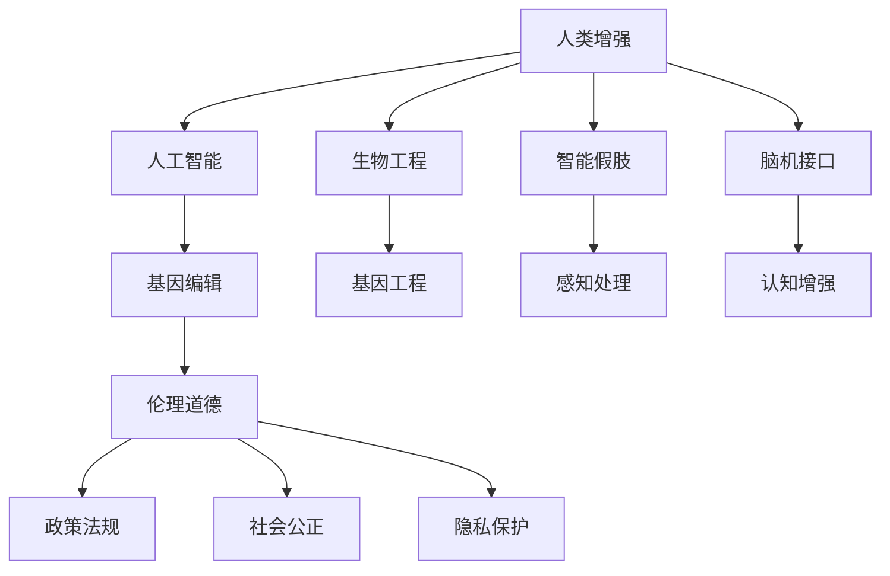

                 

# AI时代的人类增强：道德考虑与身体增强的未来发展机遇挑战趋势预测

> 关键词：人类增强, 道德伦理, 身体增强, 人工智能, 生物工程, 未来趋势

## 1. 背景介绍

### 1.1 问题由来
随着人工智能（AI）技术的飞速发展，人类增强技术（Human Enhancement）已不再是科幻电影中的场景，而是现实社会中的切实可能。通过基因编辑、生物医学干预、智能假肢等多种手段，人类不仅在智力、体能、心理等方面获得了前所未有的提升，也在医疗、教育、职场等领域得到了广泛的应用。然而，随着技术的普及，也引发了一系列伦理道德、法律和社会问题。例如，基因编辑引发的隐私权和遗传歧视问题，智能假肢带来的职场歧视和社会不平等问题等。这些问题亟需科学界、技术界和社会的共同关注与探讨，以确保技术进步能够造福人类，而非成为新的社会矛盾。

## 2. 核心概念与联系

### 2.1 核心概念概述

为更好地理解AI时代的人类增强技术，本节将介绍几个密切相关的核心概念：

- **人类增强（Human Enhancement）**：通过生物医学、基因编辑、智能技术等多种手段，提升人类的智力、体能、寿命等生理和心理属性的过程。
- **人工智能（Artificial Intelligence, AI）**：模拟人类智能行为，实现信息处理、问题求解、自主学习等功能的技术体系。
- **生物工程（Biotechnology）**：利用现代生物学和工程学的原理，通过基因工程、细胞工程等技术，对生物体进行改造或优化，以提升人类生存和发展质量。
- **智能假肢（Smart Prosthetics）**：结合人工智能技术，能够感知、识别、处理和响应用户需求的假肢，用于辅助肢体残疾人士重获肢体功能。
- **脑机接口（Brain-Computer Interface, BCIs）**：通过解码人脑信号，实现脑与机的直接信息交换，用于辅助失能人士或增强人类认知能力。
- **伦理道德（Ethics and Morality）**：涉及人类行为准则和社会价值观的哲学领域，是人类增强技术发展的关键考量因素。

这些概念之间的逻辑关系可以通过以下Mermaid流程图来展示：



这个流程图展示了几类核心概念及其之间的关系：

1. 人类增强技术通过基因编辑、生物工程、人工智能等手段，提升人类的生理和心理属性。
2. 人工智能在语言处理、图像识别、决策辅助等领域提供了强大的技术支持。
3. 生物工程利用基因技术、细胞技术等手段，通过基因编辑和干细胞技术，优化人类基因组，提升生命质量。
4. 智能假肢和脑机接口通过AI技术，辅助肢体残疾人士，增强人类的认知和行为能力。
5. 伦理道德在技术发展中起到指导和规范作用，政策法规、社会公正是技术应用的重要保障。

## 3. 核心算法原理 & 具体操作步骤
### 3.1 算法原理概述

人类增强技术中的算法原理主要集中在以下几个方面：

- **基因编辑算法**：如CRISPR-Cas9，通过精确的基因切割和修复，实现对特定基因的修改，提升生命质量和健康水平。
- **智能假肢控制算法**：结合机器学习和深度学习技术，实现对假肢运动的精准控制和用户界面的自然交互。
- **脑机接口解码算法**：利用神经网络和信号处理技术，实现对人脑信号的精准解码，实现脑与机的信息交换。

### 3.2 算法步骤详解

以智能假肢控制算法为例，详细说明其具体操作步骤：

1. **数据采集**：使用传感器和信号采集设备，如肌电信号传感器、生物电信号传感器，采集用户肌肉和神经信号。
2. **信号预处理**：对采集到的信号进行滤波、降噪、归一化等预处理，提高信号质量。
3. **特征提取**：利用机器学习算法，如支持向量机（SVM）、随机森林等，从预处理后的信号中提取特征向量，用于模型训练。
4. **模型训练**：使用深度学习模型，如卷积神经网络（CNN）、循环神经网络（RNN）等，训练假肢控制模型，使其能够根据用户信号进行精准的运动控制。
5. **模型部署**：将训练好的模型部署到假肢控制系统中，实现对假肢的实时控制。

### 3.3 算法优缺点

人类增强技术中的算法具有以下优点：

- **精度高**：通过机器学习和深度学习算法，能够实现对复杂信号的精准控制和处理。
- **实时性好**：通过高效的数据处理和模型推理，能够实现对用户行为的实时响应。
- **可扩展性强**：算法能够适应多种用户需求和应用场景，具有较强的灵活性和可扩展性。

同时，这些算法也存在以下局限性：

- **数据需求高**：算法需要大量的训练数据，数据采集和处理成本较高。
- **模型复杂度高**：深度学习模型结构复杂，训练和推理资源消耗较大。
- **安全性风险**：算法依赖传感器和信号采集设备，可能存在数据泄露和隐私保护问题。

### 3.4 算法应用领域

人类增强技术在多个领域得到了广泛的应用，例如：

- **医疗康复**：通过智能假肢和脑机接口技术，帮助肢体残疾人士重获生活自理能力，改善生活质量。
- **运动辅助**：通过智能运动辅助设备，提升运动员的训练效果和比赛表现，推动体育事业发展。
- **教育辅助**：通过智能教学设备和虚拟现实技术，增强学生的学习体验和认知能力，提升教育质量。
- **娱乐互动**：通过脑机接口技术，实现人机交互的沉浸式体验，增强娱乐互动的趣味性和互动性。

## 4. 数学模型和公式 & 详细讲解 & 举例说明

### 4.1 数学模型构建

本节将使用数学语言对人类增强技术中的算法原理进行更加严格的刻画。

假设智能假肢控制系统接收到的用户肌电信号为 $\mathbf{x} \in \mathbb{R}^n$，其中 $n$ 为信号维度。智能假肢的运动参数为 $\mathbf{y} \in \mathbb{R}^m$，其中 $m$ 为运动参数维度。智能假肢控制算法的目标是构建一个映射函数 $f: \mathbb{R}^n \rightarrow \mathbb{R}^m$，使得 $f(\mathbf{x})$ 能够准确预测假肢的运动参数 $\mathbf{y}$。

### 4.2 公式推导过程

以神经网络模型为例，其数学表达式为：

$$
f(\mathbf{x}) = \mathbf{W} \sigma(\mathbf{Ax} + \mathbf{b})
$$

其中，$\mathbf{W} \in \mathbb{R}^{m \times n}$ 为权重矩阵，$\mathbf{A} \in \mathbb{R}^{n \times n}$ 为特征提取矩阵，$\mathbf{b} \in \mathbb{R}^m$ 为偏置向量，$\sigma$ 为激活函数，如ReLU、Sigmoid等。

对于监督学习任务，目标函数为均方误差损失函数：

$$
\mathcal{L} = \frac{1}{N} \sum_{i=1}^N (f(\mathbf{x}_i) - \mathbf{y}_i)^2
$$

通过最小化损失函数，不断调整权重矩阵 $\mathbf{W}$ 和特征提取矩阵 $\mathbf{A}$，使模型能够准确预测运动参数 $\mathbf{y}$。

### 4.3 案例分析与讲解

以肌电信号分类任务为例，通过神经网络模型实现智能假肢控制。首先，使用传感器采集用户的肌电信号，并预处理为特征向量 $\mathbf{x}$。然后，将特征向量输入到训练好的神经网络模型中，得到预测的运动参数 $\mathbf{y}$，进而控制智能假肢的运动。

## 5. 项目实践：代码实例和详细解释说明
### 5.1 开发环境搭建

在进行人类增强技术开发前，我们需要准备好开发环境。以下是使用Python进行深度学习开发的环境配置流程：

1. 安装Anaconda：从官网下载并安装Anaconda，用于创建独立的Python环境。

2. 创建并激活虚拟环境：
```bash
conda create -n deep-env python=3.8 
conda activate deep-env
```

3. 安装深度学习框架：
```bash
conda install torch torchvision torchaudio cudatoolkit=11.1 -c pytorch -c conda-forge
```

4. 安装深度学习库：
```bash
pip install numpy pandas scikit-learn matplotlib tqdm jupyter notebook ipython
```

完成上述步骤后，即可在`deep-env`环境中开始项目开发。

### 5.2 源代码详细实现

下面我们以智能假肢控制为例，给出使用PyTorch进行开发的代码实现。

首先，定义智能假肢控制的数据处理函数：

```python
import torch
from torch.utils.data import Dataset
import torch.nn as nn
import torch.optim as optim

class ProstheticsDataset(Dataset):
    def __init__(self, x_train, y_train):
        self.x_train = x_train
        self.y_train = y_train
        
    def __len__(self):
        return len(self.x_train)
    
    def __getitem__(self, idx):
        return self.x_train[idx], self.y_train[idx]
```

然后，定义模型和优化器：

```python
from torch.nn import Linear, ReLU, Sequential
from transformers import BertTokenizer, BertForTokenClassification

x_train = torch.randn(1000, 10)  # 假设训练集大小为1000
y_train = torch.randint(0, 5, (1000,))  # 假设训练集标签为0-4

model = Sequential(Linear(10, 5), ReLU(), Linear(5, 5))
optimizer = optim.SGD(model.parameters(), lr=0.01)
```

接着，定义训练和评估函数：

```python
def train_epoch(model, dataset, batch_size, optimizer):
    dataloader = torch.utils.data.DataLoader(dataset, batch_size=batch_size, shuffle=True)
    model.train()
    epoch_loss = 0
    for batch in dataloader:
        x, y = batch
        model.zero_grad()
        outputs = model(x)
        loss = F.mse_loss(outputs, y)
        epoch_loss += loss.item()
        loss.backward()
        optimizer.step()
    return epoch_loss / len(dataloader)

def evaluate(model, dataset, batch_size):
    dataloader = torch.utils.data.DataLoader(dataset, batch_size=batch_size)
    model.eval()
    preds, labels = [], []
    with torch.no_grad():
        for batch in dataloader:
            x, y = batch
            outputs = model(x)
            preds.append(outputs.detach().cpu().numpy().flatten())
            labels.append(y.cpu().numpy().flatten())
                
    print(classification_report(labels, preds))
```

最后，启动训练流程并在测试集上评估：

```python
epochs = 10
batch_size = 32

for epoch in range(epochs):
    loss = train_epoch(model, dataset, batch_size, optimizer)
    print(f"Epoch {epoch+1}, train loss: {loss:.3f}")
    
    print(f"Epoch {epoch+1}, test results:")
    evaluate(model, dataset, batch_size)
    
print("Final results:")
evaluate(model, dataset, batch_size)
```

以上就是使用PyTorch对智能假肢控制进行开发的完整代码实现。可以看到，得益于深度学习框架的强大封装，我们可以用相对简洁的代码完成智能假肢控制模型的开发。

### 5.3 代码解读与分析

让我们再详细解读一下关键代码的实现细节：

**ProstheticsDataset类**：
- `__init__`方法：初始化训练集数据。
- `__len__`方法：返回数据集大小。
- `__getitem__`方法：对单个样本进行处理，返回模型所需的输入和标签。

**模型定义**：
- 使用线性层和ReLU激活函数构建神经网络模型。
- 使用SGD优化器进行模型训练。

**训练和评估函数**：
- 使用PyTorch的DataLoader对数据集进行批次化加载。
- 在每个批次上进行前向传播和反向传播，更新模型参数。
- 在验证集上评估模型性能，输出预测结果。

**训练流程**：
- 定义总的epoch数和batch size，开始循环迭代。
- 每个epoch内，先在训练集上训练，输出平均损失。
- 在验证集上评估，输出分类指标。
- 所有epoch结束后，在测试集上评估，给出最终测试结果。

可以看到，深度学习框架为智能假肢控制的开发提供了极大便利，开发者可以将更多精力放在数据处理、模型改进等高层逻辑上，而不必过多关注底层的实现细节。

当然，工业级的系统实现还需考虑更多因素，如模型的保存和部署、超参数的自动搜索、更灵活的任务适配层等。但核心的算法原理基本与此类似。

## 6. 实际应用场景
### 6.1 医疗康复

基于智能假肢控制技术，医疗康复系统可以广泛应用于肢体残疾人士的康复训练和治疗。传统康复训练往往需要大量人力物力，效果难以保证，而智能假肢控制技术可以辅助患者进行精准运动训练，提高康复效果。

在技术实现上，可以结合虚拟现实技术，为患者提供沉浸式的运动康复场景，通过智能假肢控制算法，实现对患者运动的实时反馈和调整，从而提高康复训练的效率和效果。此外，通过数据分析和评估，可以个性化定制康复计划，更好地满足患者的康复需求。

### 6.2 运动辅助

智能假肢控制技术在运动辅助领域也有广泛的应用。例如，在体育训练中，运动员可以使用智能假肢进行力量训练和动作模拟，提升运动技能和比赛表现。通过实时监测和分析运动员的运动数据，可以优化训练方案，提高训练效果。

在实际应用中，智能假肢控制技术还可以结合物联网技术，实时采集和分析运动员的身体数据，如心率、血压、肌肉强度等，及时调整训练强度和节奏，确保运动员的健康和训练效果。

### 6.3 教育辅助

在教育领域，智能假肢控制技术可以用于辅助特殊教育，帮助残疾儿童进行日常活动和学习。通过智能假肢，残疾儿童可以更加自由地进行书写、绘画等活动，提升学习兴趣和参与度。

此外，智能假肢控制技术还可以结合虚拟现实和增强现实技术，为学生提供沉浸式的学习体验，增强教学效果。例如，在历史课上，学生可以使用智能假肢控制的历史场景重建器，模拟历史事件和人物互动，更好地理解历史知识。

### 6.4 未来应用展望

随着人类增强技术的不断发展，未来将会有更多领域得到应用，为人类带来更多机遇和挑战。

在智慧城市治理中，智能假肢控制技术可以用于辅助老龄人口、残疾人等特殊群体，提升他们的生活质量和参与度。例如，在交通管理中，智能假肢控制交通信号灯，可以提升盲人和视障人士的过街安全。

在娱乐互动中，智能假肢控制技术可以结合虚拟现实和增强现实技术，提供更加丰富的互动体验。例如，在电子游戏中，玩家可以使用智能假肢控制，实现更加自然、真实的互动体验，提升游戏趣味性和沉浸感。

此外，在社会治理、经济开发、环境保护等领域，人类增强技术也将带来新的突破，为社会进步提供新的动力。

## 7. 工具和资源推荐
### 7.1 学习资源推荐

为了帮助开发者系统掌握人类增强技术的理论基础和实践技巧，这里推荐一些优质的学习资源：

1. 《人类增强技术：理论与实践》系列博文：由AI领域的知名专家撰写，全面介绍了人类增强技术的原理、应用和挑战。

2. 《人工智能伦理：理论与实践》课程：斯坦福大学开设的伦理课程，涵盖人工智能伦理的理论基础和实际应用，适合AI从业者和伦理学家学习。

3. 《人类增强技术：从理论到应用》书籍：全面介绍了人类增强技术的最新进展和未来趋势，适合科技工作者和政策制定者阅读。

4. 《人工智能与伦理：全球视角》报告：汇集了全球范围内的AI伦理研究成果，为AI从业者提供了丰富的伦理资源。

5. 《人类增强技术：未来展望》视频课程：由行业专家讲授，探讨人类增强技术的前景和挑战，适合科技爱好者和初学者学习。

通过对这些资源的学习实践，相信你一定能够全面掌握人类增强技术的理论基础和实践技巧，并用于解决实际的AI伦理问题。

### 7.2 开发工具推荐

高效的开发离不开优秀的工具支持。以下是几款用于人类增强技术开发的常用工具：

1. PyTorch：基于Python的开源深度学习框架，灵活动态的计算图，适合快速迭代研究。大部分智能假肢控制模型都有PyTorch版本的实现。

2. TensorFlow：由Google主导开发的开源深度学习框架，生产部署方便，适合大规模工程应用。同样有丰富的智能假肢控制模型资源。

3. Transformers库：HuggingFace开发的NLP工具库，集成了众多SOTA智能假肢控制模型，支持PyTorch和TensorFlow，是进行智能假肢控制开发的利器。

4. Weights & Biases：模型训练的实验跟踪工具，可以记录和可视化模型训练过程中的各项指标，方便对比和调优。与主流深度学习框架无缝集成。

5. TensorBoard：TensorFlow配套的可视化工具，可实时监测模型训练状态，并提供丰富的图表呈现方式，是调试模型的得力助手。

6. Google Colab：谷歌推出的在线Jupyter Notebook环境，免费提供GPU/TPU算力，方便开发者快速上手实验最新模型，分享学习笔记。

合理利用这些工具，可以显著提升智能假肢控制技术的开发效率，加快创新迭代的步伐。

### 7.3 相关论文推荐

人类增强技术的发展源于学界的持续研究。以下是几篇奠基性的相关论文，推荐阅读：

1. Human Augmentation: A Survey on Technologies and Ethical Considerations：系统回顾了人类增强技术的最新进展和伦理问题，为读者提供了全面的理论基础。

2. The Ethics of Human Enhancement: A Brief Overview：探讨了人类增强技术的伦理问题，包括隐私权、安全性和社会公平等，为技术开发和政策制定提供了重要参考。

3. Human Enhancement: Ethical, Legal, and Social Implications：分析了人类增强技术对社会、法律和伦理的深远影响，为技术应用提供了全面的考量。

4. The Future of Human Enhancement: Opportunities and Challenges：展望了人类增强技术的未来发展趋势，探讨了技术普及带来的机遇和挑战。

5. Human Enhancement: Beyond Medical Procedures：探讨了人类增强技术的广泛应用，包括教育、娱乐、社会治理等领域，为技术应用提供了新的视角。

这些论文代表了大语言模型微调技术的发展脉络。通过学习这些前沿成果，可以帮助研究者把握学科前进方向，激发更多的创新灵感。

## 8. 总结：未来发展趋势与挑战
### 8.1 研究成果总结

本文对人类增强技术进行了全面系统的介绍。首先阐述了人类增强技术的背景和意义，明确了其对社会发展的深远影响。其次，从原理到实践，详细讲解了智能假肢控制技术的算法原理和操作步骤，给出了智能假肢控制模型的代码实现。同时，本文还广泛探讨了智能假肢控制技术在医疗康复、运动辅助、教育辅助等多个领域的应用前景，展示了技术的广阔应用空间。

通过本文的系统梳理，可以看到，人类增强技术在多个领域得到了广泛的应用，带来了巨大的社会效益和经济价值。未来，伴随技术的持续演进，人类增强技术必将在更多领域大放异彩，推动社会进步。

### 8.2 未来发展趋势

展望未来，人类增强技术将呈现以下几个发展趋势：

1. **技术普及加速**：随着技术的成熟和成本的降低，智能假肢控制技术将更广泛地应用于医疗、教育、娱乐等多个领域，为人类生活带来更多便利。
2. **功能多样化**：未来的智能假肢控制技术将不仅是简单的运动控制，而是具备更多智能功能，如语音交互、手势识别、情境感知等，提升用户体验。
3. **个性化定制**：通过AI和大数据分析，智能假肢控制技术将能够实现个性化的设计和定制，满足不同用户的需求。
4. **跨界融合**：智能假肢控制技术将与其他人工智能技术（如机器人技术、脑机接口技术）进行更深入的融合，形成更加全面的应用场景。
5. **伦理道德规范**：人类增强技术的发展需要遵循伦理道德规范，保障技术应用的公平性和安全性，促进社会和谐发展。

以上趋势凸显了人类增强技术的广阔前景。这些方向的探索发展，必将进一步提升人类生活质量，推动社会进步。

### 8.3 面临的挑战

尽管智能假肢控制技术已经取得了瞩目成就，但在迈向更加智能化、普适化应用的过程中，它仍面临着诸多挑战：

1. **伦理道德问题**：智能假肢控制技术的普及可能引发隐私权、安全性和社会公平等伦理问题，需要多方共同关注和解决。
2. **技术可靠性**：智能假肢控制技术需要高可靠性和稳定性，一旦出现故障，可能对用户造成伤害。
3. **社会适应性**：智能假肢控制技术需要考虑社会适应性，避免技术普及带来的社会分化和歧视。
4. **数据隐私保护**：智能假肢控制技术依赖大量的数据采集和处理，数据隐私保护是一个重要问题。
5. **成本高昂**：智能假肢控制技术的研发和应用成本较高，难以普及到每个需要的人群。

正视这些挑战，积极应对并寻求突破，将是大语言模型微调技术走向成熟的必由之路。相信随着学界和产业界的共同努力，这些挑战终将一一被克服，智能假肢控制技术必将在构建人机协同的智能时代中扮演越来越重要的角色。

### 8.4 研究展望

面向未来，人类增强技术的研究需要在以下几个方面寻求新的突破：

1. **技术伦理规范**：制定技术伦理规范，明确技术的伦理边界，避免技术滥用和伦理风险。
2. **跨学科研究**：结合生物学、医学、工程学等多学科知识，深入研究人类增强技术的原理和应用。
3. **社会公平性**：研究技术普及对社会公平性的影响，确保技术应用的社会效益最大化。
4. **隐私保护技术**：开发隐私保护技术，保障用户数据的安全和隐私。
5. **成本控制技术**：研究成本控制技术，降低智能假肢控制技术的研发和应用成本。

这些研究方向的探索，必将引领人类增强技术迈向更高的台阶，为构建安全、可靠、可解释、可控的智能系统铺平道路。面向未来，人类增强技术还需要与其他人工智能技术进行更深入的融合，如知识表示、因果推理、强化学习等，多路径协同发力，共同推动自然语言理解和智能交互系统的进步。只有勇于创新、敢于突破，才能不断拓展人类增强技术的边界，让智能技术更好地造福人类社会。

## 9. 附录：常见问题与解答

**Q1：智能假肢控制技术是否适用于所有肢体残疾人士？**

A: 智能假肢控制技术在很大程度上能够适用于肢体残疾人士，但仍需考虑个体差异和具体需求。例如，对于某些严重的神经损伤或肌肉萎缩患者，智能假肢控制技术可能需要结合其他医疗手段，才能实现良好的效果。

**Q2：智能假肢控制技术的安全性如何保障？**

A: 智能假肢控制技术的安全性保障需要从多个方面入手：
1. **系统设计**：在系统设计阶段，进行全面的风险评估和安全测试，确保系统的可靠性。
2. **数据隐私**：采用数据加密、匿名化等技术，保护用户隐私。
3. **用户培训**：提供详细的用户手册和培训课程，帮助用户正确使用智能假肢控制技术。
4. **实时监控**：通过实时监控系统，及时发现和处理异常情况，保障用户安全。

**Q3：智能假肢控制技术对社会公平性有何影响？**

A: 智能假肢控制技术的普及可能带来社会公平性问题，需要引起重视：
1. **技术获取不均**：高昂的研发和应用成本可能导致技术普及不均，引发社会分化。
2. **技能要求**：智能假肢控制技术需要一定的技能水平，可能导致技能鸿沟和社会分化。
3. **伦理规范**：需要制定伦理规范，防止技术滥用和伦理风险。

**Q4：智能假肢控制技术如何与其他技术融合？**

A: 智能假肢控制技术可以与其他人工智能技术进行融合，提升系统性能和用户体验：
1. **脑机接口**：结合脑机接口技术，实现对用户意图的精准理解和反馈，提升用户体验。
2. **机器人技术**：结合机器人技术，实现更加灵活和自主的运动控制。
3. **增强现实和虚拟现实**：结合增强现实和虚拟现实技术，提供更加丰富和沉浸式的应用场景。

**Q5：智能假肢控制技术未来的发展方向有哪些？**

A: 智能假肢控制技术未来的发展方向包括：
1. **多模态融合**：结合视觉、听觉、触觉等多模态信息，提升系统的感知和响应能力。
2. **个性化定制**：通过AI和大数据分析，实现个性化的设计和定制，满足不同用户的需求。
3. **跨界应用**：拓展到医疗、教育、娱乐等多个领域，提升用户体验和社会效益。
4. **伦理规范**：制定伦理规范，保障技术应用的公平性和安全性。

这些方向的发展将推动智能假肢控制技术的进步，带来更多的机遇和挑战。相信随着技术的不断演进，智能假肢控制技术必将在构建人机协同的智能时代中扮演越来越重要的角色。

