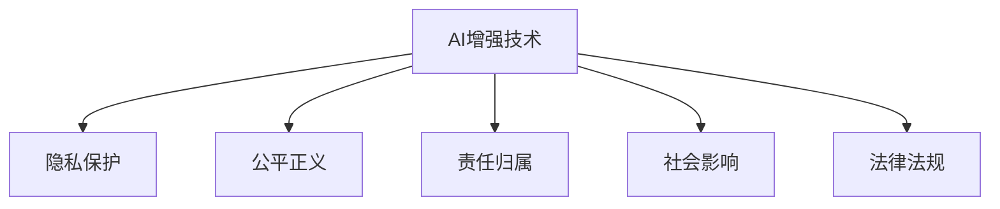

                 

# AI时代的人类增强：道德考虑和限制

## 1. 背景介绍

### 1.1 问题由来
人工智能（AI）技术的迅猛发展正深刻影响着人类社会的方方面面。从自动驾驶汽车到医疗诊断，从智能客服到自动翻译，AI的广泛应用正改变着我们的生产和生活方式。然而，随着AI技术的日益强大，人们对于其带来的伦理和道德问题也愈发关注。AI时代的人类增强，即通过AI技术提升人类能力的探索，正面临着巨大的道德挑战。

### 1.2 问题核心关键点
AI时代的人类增强主要涉及以下几个关键点：

- 增强目标：包括提升人的智力、体力、情感等多方面的能力。
- 伦理问题：涉及隐私保护、公平正义、责任归属等。
- 技术限制：技术成熟度、可操作性、安全性等。
- 社会影响：对就业、教育、治理等社会层面的影响。
- 法律法规：如何通过法律规范引导AI技术的合理应用。

这些问题交织在一起，共同构成了AI时代人类增强的复杂伦理景观。本文将围绕这些关键点，对AI时代的人类增强进行深入探讨，并提出相应的道德限制建议。

## 2. 核心概念与联系

### 2.1 核心概念概述

为更好地理解AI时代人类增强的伦理挑战，本节将介绍几个关键概念及其相互联系：

- **AI增强技术**：指通过AI技术（如机器学习、深度学习等）提升人类智能、体能、情感等能力的各种应用。
- **隐私保护**：指在AI增强过程中，如何保护个人信息的隐私不被滥用或泄露。
- **公平正义**：指AI增强技术在应用过程中应如何确保所有人的平等权益，避免偏见和歧视。
- **责任归属**：指在AI增强过程中，如何明确技术开发者、应用者、被增强者之间的责任划分。
- **社会影响**：指AI增强技术对就业、教育、治理等社会层面的深远影响。
- **法律法规**：指如何通过法律规范引导AI技术的合理应用，保障公共利益。

这些核心概念之间的逻辑关系可以通过以下Mermaid流程图来展示：



这个流程图展示了AI增强技术与隐私保护、公平正义、责任归属、社会影响、法律法规等核心概念之间的紧密联系。这些概念共同构成了AI时代人类增强的伦理框架，为技术应用提供了道德指引。

## 3. 核心算法原理 & 具体操作步骤

### 3.1 算法原理概述

AI时代的人类增强涉及多种技术手段，如深度学习、增强学习、自然语言处理等。其核心原理是通过数据驱动的方法，利用大量的数据和算法模型，训练出能够提升人类能力的AI系统。以下是几个典型算法的概述：

- **深度学习**：通过构建多层神经网络模型，从大量数据中学习特征表示，提升模型对复杂问题的处理能力。
- **增强学习**：通过与环境的交互，通过奖励机制引导模型学习最优策略，提升智能决策能力。
- **自然语言处理（NLP）**：利用语言模型、文本生成等技术，增强人类的语言理解和生成能力。

### 3.2 算法步骤详解

#### 3.2.1 数据收集与预处理
1. 确定增强目标，收集相关数据。例如，提升语言能力可以收集大量文本数据，提升体力可以收集运动数据等。
2. 清洗数据，去除噪声和异常值，确保数据质量。
3. 数据增强，通过数据扩充、回译等技术丰富数据集。

#### 3.2.2 模型训练与优化
1. 选择适当的算法和模型架构。例如，深度学习可以使用RNN、LSTM、Transformer等。
2. 训练模型，通过反向传播算法优化模型参数。
3. 验证模型，使用交叉验证等技术评估模型性能。
4. 调整模型，通过超参数调优、正则化等方法提升模型效果。

#### 3.2.3 应用部署与评估
1. 将训练好的模型集成到应用系统中，进行实际部署。
2. 对应用效果进行评估，使用各种指标（如准确率、召回率等）衡量模型表现。
3. 根据评估结果调整模型，进行迭代优化。

### 3.3 算法优缺点

AI时代的人类增强具有以下优点：

- **提升能力**：通过AI技术，可以显著提升人类在智能、体能、情感等方面的能力。
- **高效便捷**：AI系统可以在短时间内处理大量数据，提供快速有效的解决方案。
- **创新潜力**：AI技术不断进步，为人类增强提供了更多可能性。

同时，也存在一些缺点：

- **隐私风险**：大量数据收集和使用可能导致隐私泄露。
- **公平性问题**：算法偏见可能导致不公平的增强效果。
- **技术依赖**：AI增强高度依赖技术手段，存在技术失效的风险。
- **伦理争议**：增强效果和责任归属等问题引发伦理争议。
- **社会影响**：对就业、教育等社会层面的深远影响尚未充分评估。

### 3.4 算法应用领域

AI时代的人类增强已广泛应用于多个领域，包括但不限于：

- **医疗健康**：通过AI技术提升诊断准确性，提升手术精准度，提供个性化治疗方案。
- **教育培训**：提供智能辅导，个性化学习路径，提升学习效果。
- **体育运动**：通过AI技术分析运动员表现，提供训练方案，提升竞技水平。
- **安全防护**：通过AI技术提升公共安全，如智能监控、反恐预警等。
- **娱乐休闲**：通过AI技术提供智能推荐，增强用户体验，如影视推荐、游戏AI等。

## 4. 数学模型和公式 & 详细讲解  
### 4.1 数学模型构建

AI增强技术通常涉及复杂的数学模型，这里以深度学习为例进行说明。

假设有一个简单的神经网络模型 $M_{\theta}$，其中 $\theta$ 表示模型参数。训练数据集为 $D=\{(x_i, y_i)\}_{i=1}^N$，其中 $x_i$ 为输入，$y_i$ 为输出。

定义模型的损失函数为 $\mathcal{L}(M_{\theta}, D) = \frac{1}{N} \sum_{i=1}^N \ell(M_{\theta}(x_i), y_i)$，其中 $\ell$ 为具体的损失函数（如交叉熵损失）。

通过反向传播算法，可以得到参数 $\theta$ 的梯度 $\frac{\partial \mathcal{L}}{\partial \theta}$，进而使用梯度下降等优化算法更新模型参数。

### 4.2 公式推导过程

以最简单的线性回归模型为例，其损失函数为：

$$
\mathcal{L}(\theta) = \frac{1}{N} \sum_{i=1}^N (y_i - \hat{y}_i)^2
$$

其中 $\hat{y}_i = \theta^T x_i$，$\theta^T$ 表示参数矩阵的转置。

通过链式法则，可以得到 $\frac{\partial \mathcal{L}}{\partial \theta}$ 的计算公式为：

$$
\frac{\partial \mathcal{L}}{\partial \theta} = -\frac{2}{N} \sum_{i=1}^N (y_i - \hat{y}_i)x_i
$$

该公式即为反向传播算法的核心计算公式。

### 4.3 案例分析与讲解

以语音识别为例，通过深度学习模型将语音信号转换为文本。假设输入为 $x = (x_1, x_2, \ldots, x_n)$，输出为 $y$，模型结构如图：


其中，$x_i$ 为输入特征，$\theta$ 为模型参数。模型通过反向传播算法不断调整参数，使得模型输出 $y$ 逼近真实值 $y$。

## 5. 项目实践：代码实例和详细解释说明

### 5.1 开发环境搭建

在AI时代的人类增强项目中，通常需要使用深度学习框架（如TensorFlow、PyTorch）和相关库（如NumPy、Pandas等）。以下是Python环境的搭建步骤：

1. 安装Python：可以从官网下载最新版本Python，并进行安装。
2. 安装虚拟环境：使用`virtualenv`或`conda`创建虚拟环境，避免环境冲突。
3. 安装依赖库：通过pip或conda安装TensorFlow、PyTorch、NumPy等依赖库。

### 5.2 源代码详细实现

以语音识别为例，以下是基于PyTorch的代码实现：

```python
import torch
import torch.nn as nn
import torch.optim as optim
from torch.utils.data import DataLoader
from torchvision import datasets, transforms

# 定义模型结构
class Net(nn.Module):
    def __init__(self):
        super(Net, self).__init__()
        self.conv1 = nn.Conv2d(1, 32, 3)
        self.conv2 = nn.Conv2d(32, 64, 3)
        self.fc1 = nn.Linear(64 * 7 * 7, 128)
        self.fc2 = nn.Linear(128, 10)

    def forward(self, x):
        x = torch.relu(self.conv1(x))
        x = F.max_pool2d(x, 2)
        x = torch.relu(self.conv2(x))
        x = F.max_pool2d(x, 2)
        x = x.view(-1, 64 * 7 * 7)
        x = torch.relu(self.fc1(x))
        x = self.fc2(x)
        return x

# 加载数据集
transform = transforms.Compose([
    transforms.ToTensor(),
    transforms.Normalize((0.5,), (0.5,))
])
train_set = datasets.MNIST('data', train=True, download=True, transform=transform)
test_set = datasets.MNIST('data', train=False, download=True, transform=transform)
train_loader = DataLoader(train_set, batch_size=64, shuffle=True)
test_loader = DataLoader(test_set, batch_size=64, shuffle=False)

# 定义模型和优化器
model = Net()
criterion = nn.CrossEntropyLoss()
optimizer = optim.SGD(model.parameters(), lr=0.01)

# 训练模型
for epoch in range(10):
    for data, target in train_loader:
        optimizer.zero_grad()
        output = model(data)
        loss = criterion(output, target)
        loss.backward()
        optimizer.step()
```

### 5.3 代码解读与分析

这段代码实现了一个简单的卷积神经网络模型，用于图像识别。其中：

- `Net`类定义了模型结构，包括两个卷积层和两个全连接层。
- `transform`类用于数据预处理，将输入图像转化为张量并标准化。
- `train_set`和`test_set`分别用于加载训练数据集和测试数据集。
- `train_loader`和`test_loader`用于将数据集划分为批处理。
- `model`为定义的模型，`criterion`为定义的损失函数，`optimizer`为定义的优化器。
- 在训练过程中，通过反向传播算法不断更新模型参数。

### 5.4 运行结果展示

训练过程中，可以通过以下代码可视化模型性能：

```python
import matplotlib.pyplot as plt

def train_model(model, train_loader, test_loader, epochs=10, batch_size=64):
    train_loss = []
    test_loss = []
    for epoch in range(epochs):
        model.train()
        for data, target in train_loader:
            optimizer.zero_grad()
            output = model(data)
            loss = criterion(output, target)
            loss.backward()
            optimizer.step()
        train_loss.append(loss.item())

        model.eval()
        with torch.no_grad():
            test_loss.append(loss.item())

        print(f"Epoch {epoch+1}, train loss: {train_loss[-1]:.4f}, test loss: {test_loss[-1]:.4f}")
    plt.plot(train_loss, label='Train Loss')
    plt.plot(test_loss, label='Test Loss')
    plt.legend()
    plt.show()
```

训练结束后，可以通过绘制损失曲线来评估模型性能。

## 6. 实际应用场景

### 6.1 医疗健康

AI增强技术在医疗健康领域具有巨大应用潜力。例如，通过深度学习模型进行疾病诊断、基因分析等，可以显著提升诊断准确性和治疗效果。然而，医疗数据涉及隐私和伦理问题，需要严格遵守相关法律法规，保护患者隐私。

### 6.2 教育培训

在教育培训领域，AI增强技术可以提供个性化学习路径，提升学习效果。例如，通过自然语言处理技术分析学生学习行为，生成个性化作业，提供个性化辅导。但同时也要注意避免算法偏见，确保所有学生的平等权益。

### 6.3 体育运动

在体育运动领域，AI增强技术可以提升运动员训练效果，分析运动数据，制定个性化训练方案。例如，通过增强学习技术优化运动轨迹，提升竞技水平。但同时也要注意技术应用的安全性，避免过度训练导致运动员受伤。

### 6.4 娱乐休闲

在娱乐休闲领域，AI增强技术可以提供智能推荐，提升用户体验。例如，通过深度学习模型分析用户行为，生成个性化推荐内容。但同时也要注意算法公平性，避免推荐算法偏见导致不公平推荐。

## 7. 工具和资源推荐

### 7.1 学习资源推荐

为帮助开发者系统掌握AI增强技术，以下是一些优质的学习资源：

1. 《深度学习》书籍：由多位深度学习专家共同撰写，全面介绍了深度学习原理和应用。
2. 《Python深度学习》书籍：介绍了Python在深度学习中的应用，包含大量代码实例。
3. Coursera《深度学习》课程：斯坦福大学开设的深度学习课程，包含大量实战项目。
4. Udacity《机器学习工程师》课程：提供了从基础到高级的机器学习知识体系。

### 7.2 开发工具推荐

为提高AI增强项目开发效率，以下是几款常用的开发工具：

1. TensorFlow：开源深度学习框架，提供了丰富的算法和模型支持。
2. PyTorch：开源深度学习框架，支持动态计算图，便于研究和调试。
3. Jupyter Notebook：开源的交互式开发环境，便于编写和分享代码。
4. VS Code：开源的代码编辑器，支持多种编程语言和调试工具。

### 7.3 相关论文推荐

为深入理解AI增强技术，以下是几篇代表性论文：

1. 《Deep Learning》：由深度学习领域多位专家共同撰写，介绍了深度学习原理和应用。
2. 《ImageNet Classification with Deep Convolutional Neural Networks》：提出了深度卷积神经网络在图像分类任务上的应用，取得了突破性成果。
3. 《Generative Adversarial Nets》：提出生成对抗网络（GAN），解决了深度学习中的无监督学习和数据生成问题。

## 8. 总结：未来发展趋势与挑战

### 8.1 研究成果总结

AI时代的人类增强技术具有广阔的应用前景，但其伦理和道德问题仍需引起重视。本文从隐私保护、公平正义、责任归属等角度，探讨了AI增强技术的伦理框架。通过对现有技术的深入分析，提出了一系列道德限制建议，为AI增强技术的合理应用提供了指导。

### 8.2 未来发展趋势

未来AI增强技术的发展趋势包括：

1. **技术成熟度**：随着算力提升和算法优化，AI增强技术的成熟度将进一步提升。
2. **应用范围**：AI增强技术将在更多领域得到应用，如医疗、教育、体育等。
3. **社会影响**：AI增强技术将对就业、教育、治理等社会层面产生深远影响。
4. **法律法规**：需要制定相关法律法规，引导AI增强技术的合理应用。

### 8.3 面临的挑战

AI增强技术的发展仍面临诸多挑战，包括：

1. **隐私保护**：数据隐私和安全问题仍需关注。
2. **算法公平性**：算法偏见可能导致不公平的增强效果。
3. **技术可靠性**：技术失效和安全性问题仍需进一步研究。
4. **伦理争议**：增强效果和责任归属等问题引发伦理争议。
5. **社会影响**：对就业、教育等社会层面的深远影响尚未充分评估。

### 8.4 研究展望

未来AI增强技术的研究方向包括：

1. **隐私保护**：开发隐私保护技术，确保数据隐私安全。
2. **算法公平性**：开发公平算法，避免算法偏见。
3. **技术可靠性**：提高技术稳定性和安全性，确保应用效果。
4. **伦理约束**：制定伦理规范，确保技术应用符合社会价值观。
5. **社会影响**：评估AI增强技术对社会的影响，制定相关政策。

## 9. 附录：常见问题与解答

**Q1: 如何平衡AI增强技术的发展与伦理问题？**

A: 在AI增强技术的发展过程中，需要严格遵守隐私保护、公平正义、责任归属等伦理原则。例如，在医疗领域，应确保患者隐私不受侵犯，避免算法偏见导致不公平诊断，明确技术开发者、应用者、被增强者之间的责任划分。

**Q2: 如何确保AI增强技术的公平性？**

A: 开发公平算法，避免算法偏见是关键。例如，在招聘领域，应确保算法不因性别、年龄、种族等因素歧视某些群体。同时，应定期评估算法效果，及时发现和纠正偏见。

**Q3: 如何应对AI增强技术的安全性问题？**

A: 提高技术稳定性和安全性，是确保AI增强技术应用效果的关键。例如，在自动驾驶领域，应确保技术可靠性，避免因技术故障导致交通事故。同时，应加强技术测试和安全评估，确保应用效果。

**Q4: 如何评估AI增强技术对社会的影响？**

A: 评估AI增强技术对社会的影响，需要进行全面的社会调查和数据分析。例如，在教育领域，应评估个性化学习路径对学生学习效果的影响，避免技术应用带来的不公平问题。

---

作者：禅与计算机程序设计艺术 / Zen and the Art of Computer Programming

