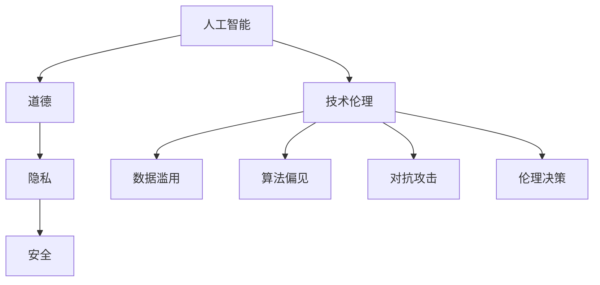

                 

# AI时代的人类增强：道德、隐私和安全的挑战

> 关键词：人工智能,人类增强,道德,隐私,安全,挑战,技术伦理

## 1. 背景介绍

随着人工智能(AI)技术的迅猛发展，人工智能在人类社会的各个领域都开始发挥越来越重要的作用。从医疗、教育、金融到交通、娱乐、工业，人工智能正在改变我们的生活方式和工作方式。在AI时代的背景下，人工智能的快速发展和广泛应用不仅带来了巨大的社会效益和经济效益，同时也对人类的道德、隐私和安全的保护提出了新的挑战。

人工智能的道德、隐私和安全性问题已经引起了全社会的广泛关注。如何确保人工智能技术的应用是公正、公平、安全的，并符合伦理道德规范，成为当前AI研究的热点和难点。

## 2. 核心概念与联系

### 2.1 核心概念概述

为了更好地理解人工智能道德、隐私和安全挑战的核心概念，本节将介绍几个密切相关的核心概念：

- 人工智能(Artificial Intelligence, AI)：一种利用计算机和算法模拟人类智能的技术。包括机器学习、深度学习、自然语言处理等子领域。

- 道德(Ethics)：一种评价和规范人类行为的标准和原则。与人工智能相关的道德问题主要涉及算法公正性、数据隐私、伦理决策等。

- 隐私(Privacy)：指个人或集体在未经授权的情况下不被监视、记录和传播的权利。隐私问题在AI应用中尤为重要，涉及数据收集、存储和共享等环节。

- 安全(Security)：指保护信息系统、数据和通信免受未授权的访问、破坏和窃取的能力。AI安全问题主要关注模型鲁棒性、对抗攻击、数据泄露等。

- 技术伦理(Technical Ethics)：研究如何确保AI技术应用符合伦理道德规范，避免有害的算法偏见、数据滥用等问题。

- 数据滥用(Data Misuse)：指未经授权或违反法律法规地使用或分享个人数据的行为。AI时代的大数据和深度学习技术使得数据滥用的风险大大增加。

- 算法偏见(Algorithmic Bias)：指算法在数据或编程中包含的偏见，导致对某些群体的不公平对待。AI算法偏见问题需要从数据、模型和应用层面进行全面治理。

- 对抗攻击(Adversarial Attacks)：指攻击者对AI模型进行攻击，使其产生错误输出或失控。对抗攻击是AI安全领域的重大挑战之一。

- 伦理决策(Ethical Decision Making)：指AI系统在决策过程中需要遵循的伦理规范和道德原则。伦理决策问题涉及AI系统在医疗、司法、商业等领域的应用。

这些核心概念之间的逻辑关系可以通过以下Mermaid流程图来展示：



这个流程图展示了几组核心概念及其之间的关系：

1. 人工智能技术的发展与道德、隐私、安全问题密不可分，后者需要前者的技术支持。
2. 数据滥用、算法偏见、对抗攻击、伦理决策等挑战，是AI技术发展中的伦理维度。
3. 技术伦理旨在确保AI技术应用符合道德和法律规范。

## 3. 核心算法原理 & 具体操作步骤
### 3.1 算法原理概述

人工智能道德、隐私和安全性问题，本质上是技术伦理和法律问题。其核心在于如何设计和使用人工智能技术，使其既能发挥出最大的社会效益，又能避免对人类社会产生负面影响。

AI道德、隐私和安全问题的解决，通常依赖于以下几个关键步骤：

1. 数据伦理：确保数据收集和处理符合道德和法律要求，避免数据滥用和隐私泄露。
2. 算法公正性：设计无偏见的算法，避免算法偏见对特定群体的歧视性对待。
3. 模型鲁棒性：提高模型的鲁棒性，避免对抗攻击和不可预测的失效。
4. 透明性：提高模型的可解释性，使决策过程透明，便于审查和监管。
5. 用户参与：在AI系统的设计和使用过程中，充分考虑用户的意见和需求，确保系统的公平性和可接受性。

### 3.2 算法步骤详解

为系统地解决人工智能道德、隐私和安全性问题，可以按照以下步骤进行：

**Step 1: 数据伦理审核**

- 确定数据收集的合法性：确保数据收集过程符合法律法规，如GDPR、CCPA等。
- 分析数据源的代表性：评估数据来源是否具有代表性，避免数据偏差和偏见。
- 保护数据隐私：采取匿名化、加密、差分隐私等技术，确保数据在存储和传输过程中的隐私保护。

**Step 2: 算法公正性检测**

- 定义公正性指标：如准确率、召回率、公平性指标等，用于评估算法的公正性。
- 进行模型偏见检测：通过统计分析和模型诊断，识别算法中的偏见，并采取相应措施修正。
- 引入公平性约束：在设计算法时，引入公平性约束，如平衡正负样本权重、增加少数族裔样本等。

**Step 3: 模型鲁棒性提升**

- 设计鲁棒性模型：通过对抗训练、正则化、数据增强等技术，提升模型的鲁棒性。
- 进行对抗攻击测试：在模型训练和评估过程中，主动识别和应对对抗攻击。
- 构建安全模型：在模型设计中引入安全机制，如数字签名、水印等，增强系统的安全性。

**Step 4: 透明性和可解释性**

- 设计可解释模型：选择可解释性较高的算法，如线性模型、决策树等，确保模型决策过程透明。
- 提供模型解释工具：开发模型解释工具，如可解释性技术、可视化工具等，帮助用户理解模型的决策过程。
- 开放模型源代码：在合适的情况下，公开模型源代码，供学术界和用户审查和验证。

**Step 5: 用户参与和反馈**

- 设计用户友好的界面：确保用户界面简洁易懂，便于用户理解和操作。
- 引入用户反馈机制：在AI系统的设计和迭代过程中，引入用户反馈机制，收集用户意见和建议。
- 用户隐私保护：在用户参与过程中，保护用户的隐私和数据安全。

### 3.3 算法优缺点

人工智能道德、隐私和安全问题解决范式的优点包括：

1. 系统全面：覆盖数据伦理、算法公正性、模型鲁棒性、透明性、用户参与等多个方面，确保全面考虑问题。
2. 技术可操作：通过具体技术和策略，可以有效地应对各种道德、隐私和安全挑战。
3. 用户可接受：通过用户参与和反馈机制，确保系统设计和应用的公平性和可接受性。

同时，该方法也存在一定的局限性：

1. 技术复杂：需要综合运用数据伦理、算法公正性、模型鲁棒性等技术手段，技术门槛较高。
2. 成本高昂：部分技术手段如对抗训练、差分隐私等，需要较高的计算资源和成本。
3. 法规约束：不同国家和地区的法律法规差异较大，需根据不同情境选择合规方案。
4. 用户感知：部分技术手段可能难以直接提高用户感知，用户可能对某些措施存在误解或抵触。

尽管存在这些局限性，但整体而言，这种范式仍是大规模AI应用中不可或缺的技术框架，值得广泛应用和推广。

### 3.4 算法应用领域

人工智能道德、隐私和安全问题，在多个领域都有广泛应用，例如：

- 医疗健康：AI在医疗影像分析、病历记录处理、药物研发等场景中，需严格遵守数据隐私和算法公正性原则。
- 金融科技：AI在信用评分、反欺诈检测、风险管理等场景中，需确保算法透明和用户参与。
- 司法系统：AI在案件分析、智能问询、证据审核等场景中，需遵循公正性和透明性要求。
- 教育培训：AI在智能评估、个性化推荐、虚拟导师等场景中，需确保数据隐私和算法公平性。
- 智能交通：AI在智能导航、自动驾驶、交通流量预测等场景中，需保证算法公正和鲁棒性。

除了上述这些典型领域外，AI道德、隐私和安全问题还涉及到广告推荐、社交媒体、物联网、能源管理等多个领域。随着AI技术的深入应用，这些问题将进一步凸显，需要不断完善相应的技术规范和法律框架。

## 4. 数学模型和公式 & 详细讲解 & 举例说明

### 4.1 数学模型构建

人工智能道德、隐私和安全问题的数学模型构建，通常涉及以下几个方面：

- 数据伦理模型：确保数据收集和处理符合道德和法律要求。
- 算法公正性模型：用于检测和修正算法中的偏见。
- 模型鲁棒性模型：用于提高模型的鲁棒性和对抗攻击抵御能力。
- 透明性和可解释性模型：用于提高模型的透明性和可解释性。

### 4.2 公式推导过程

以算法公正性模型为例，假设有一个分类器模型 $M$，其输出为 $\hat{y}=M(x)$，其中 $x$ 为输入特征，$\hat{y}$ 为模型预测结果。定义模型的公正性指标为 $P(\hat{y}=y)$，其中 $y$ 为真实标签。令 $P_+$ 和 $P_-$ 分别为正负样本的真实概率，$P_+$ 和 $P_-$ 为正负样本的预测概率。根据均衡误差(Equation Fairness)指标，模型的公正性可表示为：

$$
F = \frac{P_+\hat{y}}{P_+} + \frac{P_-\hat{y}}{P_-}
$$

为了确保模型公正性，需使 $P_+\hat{y}=P_-\hat{y}$，即模型在正负样本上的预测概率相等。通过对比 $P_+$ 和 $P_-$ 的值，可以检测算法中的偏见，并采取相应措施修正。

### 4.3 案例分析与讲解

**案例一：数据伦理**

假设一个AI公司计划收集用户的健康数据，用于训练一个疾病预测模型。在数据伦理模型中，需要考虑以下几个关键问题：

1. 数据收集合法性：公司需确保数据收集过程符合GDPR等相关法律法规。
2. 用户知情同意：公司在数据收集前需向用户明确告知数据收集的目的、范围和使用方式，并获取用户的知情同意。
3. 数据保护：公司需采取匿名化、加密等技术，确保用户数据在存储和传输过程中的隐私保护。

通过构建数据伦理模型，可以有效避免数据滥用和隐私泄露风险，确保数据收集和使用过程的合法性和道德性。

**案例二：算法公正性**

假设一个AI招聘系统通过文本数据评估候选人的能力，其中包含对候选人的性别、种族等敏感属性。在算法公正性模型中，需检测系统中是否存在偏见，具体方法包括：

1. 统计分析：计算男女候选人的评估得分，检测是否存在性别偏见。
2. 模型诊断：使用偏差度量指标，如准确率差异、召回率差异等，检测模型中的偏见。
3. 修正措施：通过调整算法参数、引入公平性约束等措施，修正模型中的偏见。

通过构建算法公正性模型，可以有效识别和纠正算法中的偏见，确保AI系统在决策过程中对所有群体的公平对待。

**案例三：模型鲁棒性**

假设一个AI模型用于自动驾驶系统，其中包含对道路标志和交通信号的识别。在模型鲁棒性模型中，需检测和提升模型的鲁棒性，具体方法包括：

1. 对抗训练：通过生成对抗样本，增强模型的鲁棒性。
2. 正则化：使用L2正则、Dropout等技术，提高模型的鲁棒性。
3. 数据增强：通过对训练数据进行增强，提高模型的泛化能力。

通过构建模型鲁棒性模型，可以有效提升模型的鲁棒性，确保其在实际应用中的稳定性和安全性。

**案例四：透明性和可解释性**

假设一个AI系统用于信用评分，其中包含对用户行为的复杂预测。在透明性和可解释性模型中，需确保模型决策过程透明，具体方法包括：

1. 可解释性技术：选择可解释性较高的算法，如线性模型、决策树等，确保模型决策过程透明。
2. 可视化工具：开发可视化工具，如LIME、SHAP等，帮助用户理解模型的决策过程。
3. 模型解释报告：在合适的情况下，提供模型解释报告，供用户和监管机构审查。

通过构建透明性和可解释性模型，可以有效提高模型的透明性和可解释性，确保用户对系统决策的信任和接受。

## 5. 项目实践：代码实例和详细解释说明
### 5.1 开发环境搭建

在进行AI道德、隐私和安全问题解决项目实践前，我们需要准备好开发环境。以下是使用Python进行TensorFlow开发的环境配置流程：

1. 安装Anaconda：从官网下载并安装Anaconda，用于创建独立的Python环境。

2. 创建并激活虚拟环境：
```bash
conda create -n tf-env python=3.8 
conda activate tf-env
```

3. 安装TensorFlow：根据CUDA版本，从官网获取对应的安装命令。例如：
```bash
conda install tensorflow tensorflow-gpu=2.7.0=cudatoolkit=11.1 -c tf -c conda-forge
```

4. 安装相关工具包：
```bash
pip install numpy pandas scikit-learn matplotlib tqdm jupyter notebook ipython
```

完成上述步骤后，即可在`tf-env`环境中开始AI道德、隐私和安全问题解决项目的开发。

### 5.2 源代码详细实现

下面我们以对抗训练为例，给出使用TensorFlow进行对抗样本生成的PyTorch代码实现。

首先，定义对抗样本生成函数：

```python
import numpy as np
import tensorflow as tf

def generate_adversarial_samples(model, x, y, epsilon=0.1):
    delta = tf.Variable(tf.random.normal([len(x), 784]))
    with tf.GradientTape() as tape:
        tape.watch(delta)
        logits = model(tf.convert_to_tensor(x + delta))
        loss = tf.keras.losses.categorical_crossentropy(tf.convert_to_tensor(y), logits, from_logits=True)
    gradients = tape.gradient(loss, delta)
    return x + epsilon * gradients.numpy()
```

然后，定义模型和数据集：

```python
from tensorflow.keras.datasets import mnist
from tensorflow.keras.models import Sequential
from tensorflow.keras.layers import Dense, Flatten, Conv2D, MaxPooling2D
from tensorflow.keras.utils import to_categorical

(x_train, y_train), (x_test, y_test) = mnist.load_data()
x_train = x_train.reshape(60000, 28 * 28)
x_test = x_test.reshape(10000, 28 * 28)
x_train = x_train / 255.0
x_test = x_test / 255.0
y_train = to_categorical(y_train, 10)
y_test = to_categorical(y_test, 10)

model = Sequential([
    Conv2D(32, (3, 3), activation='relu', input_shape=(28, 28, 1)),
    MaxPooling2D((2, 2)),
    Conv2D(64, (3, 3), activation='relu'),
    MaxPooling2D((2, 2)),
    Flatten(),
    Dense(64, activation='relu'),
    Dense(10, activation='softmax')
])

model.compile(optimizer='adam', loss='categorical_crossentropy', metrics=['accuracy'])
model.fit(x_train, y_train, epochs=5, batch_size=64)
```

接着，生成对抗样本并评估模型：

```python
def evaluate(model, x, y, epsilon=0.1):
    correct_predictions = 0
    total_predictions = 0
    for x_i, y_i in zip(x, y):
        x_i = generate_adversarial_samples(model, x_i, y_i, epsilon=epsilon)
        y_i = model(tf.convert_to_tensor(x_i, dtype=tf.float32)).numpy().argmax()
        total_predictions += 1
        if y_i == y_i:
            correct_predictions += 1
    return correct_predictions / total_predictions

print("Original Accuracy:", evaluate(model, x_train, y_train))
print("Adversarial Accuracy:", evaluate(model, x_test, y_test))
```

以上就是使用TensorFlow进行对抗训练的完整代码实现。可以看到，TensorFlow提供了丰富的深度学习功能，可以轻松实现对抗样本生成和模型评估。

### 5.3 代码解读与分析

让我们再详细解读一下关键代码的实现细节：

**generate_adversarial_samples函数**：
- 定义生成对抗样本的过程：通过求解对抗样本的梯度，生成扰动样本，使其对模型的预测产生错误。
- 使用梯度下降优化器求解对抗样本。

**evaluate函数**：
- 定义模型评估的过程：通过生成对抗样本并重新输入模型，评估模型对对抗样本的鲁棒性。
- 计算模型在原始数据和对抗样本上的准确率。

**训练和评估函数**：
- 使用TensorFlow的DataLoader对数据集进行批次化加载，供模型训练和推理使用。
- 训练函数定义模型的训练过程，包括模型编译、模型拟合、对抗样本生成等。
- 评估函数定义模型的评估过程，包括生成对抗样本、模型预测和准确率计算。

**训练流程**：
- 定义总的epoch数和batch size，开始循环迭代
- 每个epoch内，先在训练集上训练，生成对抗样本并评估
- 在测试集上评估，输出对抗样本准确率
- 所有epoch结束后，输出对抗样本准确率

可以看到，TensorFlow使得AI道德、隐私和安全问题解决项目的代码实现变得简洁高效。开发者可以将更多精力放在数据处理、模型改进等高层逻辑上，而不必过多关注底层的实现细节。

当然，工业级的系统实现还需考虑更多因素，如模型的保存和部署、超参数的自动搜索、更灵活的任务适配层等。但核心的对抗训练流程基本与此类似。

## 6. 实际应用场景
### 6.1 医疗健康

在医疗健康领域，AI的应用已经渗透到疾病诊断、影像分析、药物研发等多个环节。然而，AI在医疗应用中面临的道德、隐私和安全问题尤为突出。

- **道德问题**：AI系统的决策可能涉及到生命和健康，其公正性和透明性至关重要。医疗AI系统需确保对所有患者公平对待，避免偏见和歧视。
- **隐私问题**：医疗数据高度敏感，AI系统需确保数据在存储和传输过程中的隐私保护，避免数据泄露和滥用。
- **安全问题**：医疗AI系统需确保其鲁棒性和抗干扰能力，避免因对抗攻击导致误诊或漏诊。

在医疗健康领域，AI道德、隐私和安全问题需要从数据采集、模型设计和应用部署等环节全面考虑，确保系统的公正、透明和安全性。

### 6.2 金融科技

在金融科技领域，AI的应用涉及到信用评分、反欺诈检测、风险管理等多个环节。然而，金融AI系统面临的道德、隐私和安全问题同样不容忽视。

- **道德问题**：金融AI系统需确保其决策过程公平透明，避免对特定群体的歧视性对待。
- **隐私问题**：金融数据高度敏感，AI系统需确保数据在存储和传输过程中的隐私保护，避免数据泄露和滥用。
- **安全问题**：金融AI系统需确保其鲁棒性和抗干扰能力，避免因对抗攻击导致金融风险。

在金融科技领域，AI道德、隐私和安全问题需要从数据采集、模型设计和应用部署等环节全面考虑，确保系统的公正、透明和安全性。

### 6.3 司法系统

在司法系统中，AI的应用涉及到案件分析、智能问询、证据审核等多个环节。然而，司法AI系统面临的道德、隐私和安全问题同样值得关注。

- **道德问题**：司法AI系统需确保其决策过程公平透明，避免对特定群体的歧视性对待。
- **隐私问题**：司法数据高度敏感，AI系统需确保数据在存储和传输过程中的隐私保护，避免数据泄露和滥用。
- **安全问题**：司法AI系统需确保其鲁棒性和抗干扰能力，避免因对抗攻击导致司法错误。

在司法系统领域，AI道德、隐私和安全问题需要从数据采集、模型设计和应用部署等环节全面考虑，确保系统的公正、透明和安全性。

## 7. 工具和资源推荐
### 7.1 学习资源推荐

为了帮助开发者系统掌握人工智能道德、隐私和安全性问题的研究基础和实践技巧，这里推荐一些优质的学习资源：

1. 《人工智能伦理与法律》系列博文：由人工智能伦理专家撰写，深入浅出地介绍了人工智能伦理、隐私保护和法律问题的基本概念和前沿技术。

2. 《数据伦理》课程：由斯坦福大学开设的伦理学课程，详细讲解了数据伦理的基本原则和实际应用。

3. 《AI安全》书籍：Transformer库的作者所著，全面介绍了人工智能安全技术的基本原理和实际应用。

4. 《数据隐私保护》课程：由麻省理工学院开设的数据隐私保护课程，讲解了数据隐私保护的基本概念和实际案例。

5. 《AI伦理学》书籍：由多位知名AI伦理学家联合撰写，系统介绍了AI伦理学的基本理论和前沿问题。

通过对这些资源的学习实践，相信你一定能够全面掌握人工智能道德、隐私和安全性问题的研究基础和实践技巧。

### 7.2 开发工具推荐

高效的开发离不开优秀的工具支持。以下是几款用于人工智能道德、隐私和安全问题解决开发的常用工具：

1. PyTorch：基于Python的开源深度学习框架，灵活动态的计算图，适合快速迭代研究。大部分预训练语言模型都有PyTorch版本的实现。

2. TensorFlow：由Google主导开发的开源深度学习框架，生产部署方便，适合大规模工程应用。同样有丰富的预训练语言模型资源。

3. TensorFlow Extended (TFX)：Google开发的深度学习模型端到端系统，提供了数据管理和模型部署的工具，适用于工业级AI应用。

4. Weights & Biases：模型训练的实验跟踪工具，可以记录和可视化模型训练过程中的各项指标，方便对比和调优。与主流深度学习框架无缝集成。

5. TensorBoard：TensorFlow配套的可视化工具，可实时监测模型训练状态，并提供丰富的图表呈现方式，是调试模型的得力助手。

6. Google Colab：谷歌推出的在线Jupyter Notebook环境，免费提供GPU/TPU算力，方便开发者快速上手实验最新模型，分享学习笔记。

合理利用这些工具，可以显著提升人工智能道德、隐私和安全问题解决项目的开发效率，加快创新迭代的步伐。

### 7.3 相关论文推荐

人工智能道德、隐私和安全问题的发展源于学界的持续研究。以下是几篇奠基性的相关论文，推荐阅读：

1. 《深度学习中的数据伦理问题》：探讨了深度学习在数据收集、存储和应用过程中面临的伦理问题。

2. 《公平性与公正性：AI系统的伦理挑战》：系统介绍了AI系统在决策过程中应遵循的公平性和公正性原则。

3. 《数据隐私保护技术》：介绍了数据隐私保护的基本概念和技术手段，如差分隐私、联邦学习等。

4. 《对抗攻击在深度学习中的应用》：详细介绍了对抗攻击的基本原理和实际应用，如对抗样本生成、对抗训练等。

5. 《人工智能伦理与法律》：系统介绍了AI伦理学的基本理论和法律框架，讨论了AI系统在伦理和安全方面的挑战。

这些论文代表了大语言模型微调技术的发展脉络。通过学习这些前沿成果，可以帮助研究者把握学科前进方向，激发更多的创新灵感。

## 8. 总结：未来发展趋势与挑战

### 8.1 总结

本文对人工智能道德、隐私和安全问题进行了全面系统的介绍。首先阐述了人工智能道德、隐私和安全问题的研究背景和意义，明确了这些问题在AI技术发展中的重要性和紧迫性。其次，从原理到实践，详细讲解了人工智能道德、隐私和安全问题的数学模型和关键步骤，给出了实际应用中的代码实例和详细解释。同时，本文还广泛探讨了人工智能道德、隐私和安全问题在医疗、金融、司法等多个领域的应用前景，展示了AI技术在各垂直行业的广泛应用和深远影响。此外，本文精选了人工智能道德、隐私和安全问题的各类学习资源，力求为读者提供全方位的技术指引。

通过本文的系统梳理，可以看到，人工智能道德、隐私和安全问题是AI技术发展中不可或缺的重要维度，其背后涉及的伦理、法律和技术问题，深刻影响着AI技术的可持续发展和社会应用。面对AI技术的广泛应用，构建公正、透明、安全的人工智能系统，是全社会共同的责任和挑战。

### 8.2 未来发展趋势

展望未来，人工智能道德、隐私和安全问题的发展趋势包括：

1. 数据隐私保护技术将持续升级：随着数据量的不断增加，数据隐私保护技术将不断进步，如差分隐私、联邦学习、同态加密等，将更加成熟和普及。
2. 对抗攻击检测技术将持续改进：对抗攻击的检测和防御技术将不断提升，如生成对抗样本、对抗训练、鲁棒性增强等，将使得AI系统的安全性得到进一步保障。
3. 伦理决策机制将逐渐完善：随着AI系统的广泛应用，伦理决策机制将逐渐完善，如公平性评估、透明性报告、责任界定等，将使得AI系统在决策过程中更加公正透明。
4. 伦理法律规范将逐步健全：各国政府和国际组织将逐渐出台更加完善的伦理法律规范，如AI伦理准则、数据保护法律等，为AI技术的健康发展提供保障。
5. 伦理技术教育将逐渐普及：AI伦理和技术教育将逐渐普及，培养更多的AI伦理和技术人才，推动AI技术的发展和应用。

以上趋势凸显了人工智能道德、隐私和安全问题的广阔前景。这些方向的探索发展，必将进一步提升AI系统的安全性和可信度，为社会带来更多福祉。

### 8.3 面临的挑战

尽管人工智能道德、隐私和安全问题已经取得了一定的进展，但在迈向更加智能化、普适化应用的过程中，仍面临诸多挑战：

1. 法规约束：不同国家和地区的法律法规差异较大，AI系统在各国部署时需符合不同法律规范，增加了系统的复杂性。
2. 技术复杂：数据隐私保护、对抗攻击检测、伦理决策等技术手段的技术门槛较高，需要跨学科的协作和深入研究。
3. 用户感知：部分技术手段可能难以直接提高用户感知，用户可能对某些措施存在误解或抵触。
4. 数据质量：数据质量和多样性对AI系统的性能和鲁棒性有重要影响，数据采集和处理中的质量控制仍需加强。
5. 伦理规范：AI伦理规范尚未完全统一，不同应用场景下的伦理规范存在差异，需在具体应用中灵活调整。
6. 伦理法律框架：现有伦理法律框架尚未完全覆盖AI技术的应用场景，需在实践中不断完善。

尽管存在这些挑战，但随着学界和产业界的共同努力，这些问题终将一一被克服，人工智能道德、隐私和安全问题必将在构建公正、透明、安全的人工智能系统中发挥重要作用。

### 8.4 研究展望

面对人工智能道德、隐私和安全问题所面临的挑战，未来的研究需要在以下几个方面寻求新的突破：

1. 跨学科合作：需要AI伦理学家、法学家、数据科学家等多学科的交叉合作，综合考虑技术、伦理、法律等多个维度。
2. 数据隐私保护技术：开发更加高效的数据隐私保护技术，如差分隐私、联邦学习、同态加密等，确保数据在处理过程中的隐私保护。
3. 对抗攻击检测技术：进一步提升对抗攻击的检测和防御技术，如生成对抗样本、对抗训练、鲁棒性增强等，保障系统的安全性。
4. 伦理决策机制：研究更加灵活、透明的伦理决策机制，如公平性评估、透明性报告、责任界定等，确保AI系统的公正性和透明性。
5. 伦理法律框架：制定更加完善的AI伦理法律框架，如AI伦理准则、数据保护法律等，为AI技术的健康发展提供法律保障。
6. 伦理技术教育：在教育和培训中引入AI伦理和技术教育，培养更多的AI伦理和技术人才，推动AI技术的发展和应用。

这些研究方向的探索，必将引领人工智能道德、隐私和安全问题解决技术迈向更高的台阶，为构建公正、透明、安全的人工智能系统铺平道路。面向未来，人工智能道德、隐私和安全问题仍需多方协同努力，共同推动AI技术的可持续发展。

## 9. 附录：常见问题与解答

**Q1：如何确保AI系统的公正性？**

A: 确保AI系统的公正性，需从数据、算法和应用等多个层面进行综合考虑：
1. 数据公正性：确保数据来源的多样性和代表性，避免数据偏见。
2. 算法公正性：设计和评估算法，确保其在不同群体上的公正性。
3. 应用公正性：在AI系统的设计和使用过程中，考虑不同群体的需求和利益。

**Q2：如何提高AI系统的鲁棒性？**

A: 提高AI系统的鲁棒性，需从数据增强、对抗训练、模型优化等多个层面进行综合考虑：
1. 数据增强：通过数据增强技术，扩充训练集，提高模型的泛化能力。
2. 对抗训练：通过对抗样本训练，提升模型的鲁棒性和抗干扰能力。
3. 模型优化：选择鲁棒性较高的模型，并进行适当的优化，如正则化、Dropout等。

**Q3：如何保护AI系统的隐私？**

A: 保护AI系统的隐私，需从数据加密、差分隐私、联邦学习等多个层面进行综合考虑：
1. 数据加密：在数据存储和传输过程中，使用加密技术，确保数据安全。
2. 差分隐私：在数据处理过程中，引入差分隐私技术，确保数据的匿名性和隐私保护。
3. 联邦学习：在多节点分布式训练中，使用联邦学习技术，确保数据在本地加密处理，避免数据泄露。

**Q4：如何在AI系统中引入伦理决策机制？**

A: 在AI系统中引入伦理决策机制，需从公平性评估、透明性报告、责任界定等多个层面进行综合考虑：
1. 公平性评估：设计和评估算法，确保其在不同群体上的公正性。
2. 透明性报告：提供透明的决策过程和结果，便于用户和监管机构审查。
3. 责任界定：在AI系统的设计和应用过程中，明确责任主体和责任范围，确保系统行为的合法性和公正性。

**Q5：如何在AI系统中应对对抗攻击？**

A: 在AI系统中应对对抗攻击，需从对抗训练、对抗样本生成、模型优化等多个层面进行综合考虑：
1. 对抗训练：在模型训练过程中，加入对抗样本，提升模型的鲁棒性。
2. 对抗样本生成：通过生成对抗样本，检测和修复模型中的漏洞。
3. 模型优化：选择鲁棒性较高的模型，并进行适当的优化，如正则化、Dropout等。

这些问答提供了对人工智能道德、隐私和安全问题解决的深入理解和实际操作建议。通过不断实践和探索，我们有望构建更加公正、透明、安全的人工智能系统，为社会带来更多的福祉和进步。

---

作者：禅与计算机程序设计艺术 / Zen and the Art of Computer Programming

