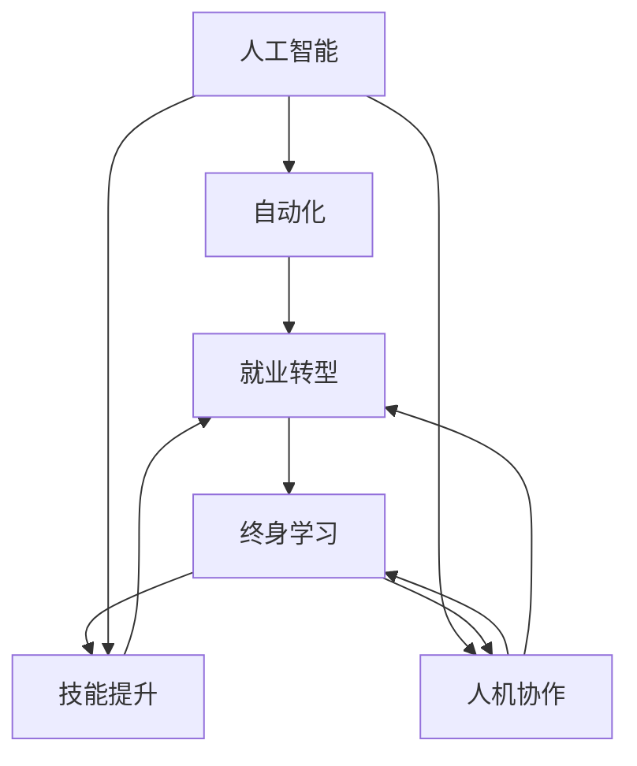

                 

# AI时代的就业转型:人机协作和终身学习

> 关键词：人机协作,终身学习,就业转型,人工智能,自动化,技能提升

## 1. 背景介绍

### 1.1 问题由来

随着人工智能(AI)技术的飞速发展，越来越多的领域正在经历前所未有的变革。自动化、智能化、信息化逐渐渗透到社会的各个角落，各行各业都面临着技术升级和转型挑战。AI技术的广泛应用，虽然在提高生产效率、优化服务体验、拓展应用场景等方面带来了巨大的潜力，但也对人类的就业结构、职业发展、工作方式等方面产生了深远影响。

在这个AI时代，如何有效应对就业转型，实现人机协作与终身学习，是每个工作者和社会都亟需面对的问题。本博文将深入探讨AI时代下的就业转型，分析人机协作与终身学习的核心概念，并通过实例解析其具体操作方法，以期为工作者提供有益的参考和指导。

### 1.2 问题核心关键点

AI时代的就业转型涉及多个关键问题：
1. **技能升级与转变**：随着AI技术的普及，许多传统岗位逐渐被自动化工具替代，技能升级成为必须。
2. **人机协作模式**：在自动化、智能化的同时，如何发挥人类的独特优势，构建人机协作的新模式，是AI时代就业转型的核心。
3. **终身学习与适应性**：在快速变化的AI环境中，如何保持学习能力，适应不断变化的技术需求，是每个从业者面临的挑战。

本文将围绕上述关键点，展开对AI时代就业转型的深入讨论。

## 2. 核心概念与联系

### 2.1 核心概念概述

为更好地理解AI时代就业转型，本节将介绍几个核心概念及其相互关系：

1. **人工智能(AI)**：通过算法和计算，模拟人类智能的技术，包括机器学习、深度学习、自然语言处理、计算机视觉等领域。
2. **自动化(Automation)**：通过AI技术，自动化执行重复性、规律性的工作流程，提高效率和精确度。
3. **人机协作(Human-Machine Collaboration)**：在AI技术的辅助下，人类与机器形成互补，共同完成任务。
4. **终身学习(Lifelong Learning)**：个体在其职业生涯中不断学习新知识、技能和工具，以适应不断变化的环境和技术需求。
5. **技能提升(Skill Enhancement)**：针对特定工作需求，提升个体在特定技能方面的能力。
6. **就业转型(Employment Transition)**：个体和企业在AI时代通过技能升级、岗位转变等方式，适应新的就业环境和技术要求。

这些核心概念之间存在紧密联系，共同构成了AI时代就业转型的复杂生态系统。

### 2.2 核心概念原理和架构的 Mermaid 流程图



这个流程图展示了各个概念之间的逻辑关系：

1. 人工智能提供了自动化和协作的基础。
2. 自动化通过AI技术实现，提升工作效率。
3. 人机协作整合了AI与人类优势，提高任务完成质量。
4. 终身学习支撑个体不断适应技术变化。
5. 技能提升是终身学习的具体体现，针对特定岗位和需求。
6. 就业转型是AI时代个体和企业的适应过程。

通过理解这些核心概念及其关系，我们可以更清晰地把握AI时代就业转型的本质。

## 3. 核心算法原理 & 具体操作步骤

### 3.1 算法原理概述

AI时代就业转型的核心在于人机协作与终身学习。这一过程中，自动化和AI技术扮演了重要角色，但如何最大化利用AI，同时保持人类的核心优势，则是转型的关键。

AI时代的人机协作，意味着在保持高效率的同时，还需强调人类的创造性、灵活性和道德责任。终身学习则要求个体不断更新知识、提升技能，以适应快速变化的技术环境。

### 3.2 算法步骤详解

基于人机协作与终身学习的AI时代就业转型，可以概括为以下五个关键步骤：

1. **技能评估与目标设定**：评估当前技能水平，明确未来职业发展目标。
2. **技能提升与培训**：根据职业目标，选择合适的技能提升路径和培训资源。
3. **AI辅助工具选择**：选择合适的AI工具和平台，提高工作效率和准确性。
4. **人机协作模式构建**：根据工作性质，设计合适的人机协作流程和机制。
5. **持续反馈与学习**：建立持续反馈机制，不断调整学习策略和协作模式。

### 3.3 算法优缺点

基于人机协作与终身学习的就业转型方法具有以下优点：
1. **提高工作效率**：通过自动化工具，大幅提升日常工作的效率和质量。
2. **促进技能提升**：通过技能培训和提升，保持职业竞争力和适应性。
3. **增强人机协作**：通过合理设计人机协作流程，充分发挥人类和机器的互补优势。
4. **支持持续学习**：通过终身学习，适应不断变化的技术环境和职业需求。

同时，该方法也存在一些缺点：
1. **对人类技能要求高**：需要具备良好的沟通能力、问题解决能力和对新技术的接受能力。
2. **技术依赖性强**：对AI工具和平台的依赖程度高，需要持续维护和更新。
3. **成本高**：技能培训和AI工具的引入，需要一定的前期投入。
4. **可能需要适应过程**：从传统工作方式到人机协作模式的转变，需要一定的适应期。

### 3.4 算法应用领域

基于人机协作与终身学习的就业转型方法，已经在多个领域得到应用，如制造、医疗、金融、教育等。

- **制造**：通过自动化生产线和AI质量检测工具，提高生产效率和产品质量。
- **医疗**：利用AI辅助诊断工具和机器人手术设备，提升诊断准确性和手术效率。
- **金融**：使用AI算法和自动化交易系统，优化风险管理、投资决策等。
- **教育**：通过AI辅导系统和个性化学习平台，提升教学效果和学生学习体验。

## 4. 数学模型和公式 & 详细讲解 & 举例说明

### 4.1 数学模型构建

本节将通过数学模型，进一步解析AI时代就业转型中的人机协作与终身学习原理。

假设有一个企业，其员工技能可以通过一个向量 $\mathbf{S} = (S_1, S_2, ..., S_n)$ 来表示，其中 $S_i$ 表示员工在技能 $i$ 上的熟练程度。

设目标职位所需技能为 $\mathbf{T} = (T_1, T_2, ..., T_m)$，其中 $T_j$ 表示目标职位所需技能 $j$ 的熟练程度。

我们定义技能提升矩阵 $A$，表示从当前技能状态到目标技能状态的转换关系。$A$ 矩阵中的每个元素 $a_{ij}$ 表示员工在技能 $i$ 提升到 $j$ 的能力系数。

员工通过学习提升后的技能状态为 $\mathbf{S'} = A\mathbf{S}$。

### 4.2 公式推导过程

员工技能提升的数学模型可以表示为：

$$
\mathbf{S'} = A\mathbf{S}
$$

其中 $A$ 为技能提升矩阵，具体形式为：

$$
A = \begin{bmatrix}
a_{11} & a_{12} & ... & a_{1m} \\
a_{21} & a_{22} & ... & a_{2m} \\
... & ... & ... & ... \\
a_{n1} & a_{n2} & ... & a_{nm}
\end{bmatrix}
$$

员工在特定技能 $i$ 上的提升能力可以通过训练、学习、实践等多种方式获得。例如，通过在线课程、实战项目、导师指导等方式，提升能力系数 $a_{ij}$。

### 4.3 案例分析与讲解

假设一个软件开发工程师希望提升其在人工智能和大数据方面的技能，当前技能水平为 $\mathbf{S} = [3, 2, 4]$，目标职位所需技能为 $\mathbf{T} = [4, 3, 5]$。

技能提升矩阵 $A$ 可以通过技能培训和实际项目经验获得，例如：

$$
A = \begin{bmatrix}
1 & 0.8 & 0 \\
0.5 & 1 & 0.7 \\
0.6 & 0 & 1
\end{bmatrix}
$$

员工在完成技能提升后，新的技能状态为：

$$
\mathbf{S'} = A\mathbf{S} = \begin{bmatrix}
1 & 0.8 & 0 \\
0.5 & 1 & 0.7 \\
0.6 & 0 & 1
\end{bmatrix} \begin{bmatrix}
3 \\
2 \\
4
\end{bmatrix} = \begin{bmatrix}
3.6 \\
3.4 \\
4
\end{bmatrix}
$$

这意味着员工在人工智能和大数据方面的技能得到了显著提升，达到了目标职位的要求。

## 5. 项目实践：代码实例和详细解释说明

### 5.1 开发环境搭建

要进行AI时代就业转型的实践，首先需要搭建好开发环境。以下是Python和TensorFlow的搭建步骤：

1. 安装Anaconda：
```bash
wget https://repo.anaconda.com/miniconda/Miniconda3-latest-Linux-x86_64.sh
bash Miniconda3-latest-Linux-x86_64.sh
```

2. 创建并激活虚拟环境：
```bash
conda create -n ai-env python=3.7
conda activate ai-env
```

3. 安装TensorFlow：
```bash
pip install tensorflow
```

4. 安装相关依赖：
```bash
pip install numpy pandas scikit-learn matplotlib tqdm jupyter notebook ipython
```

### 5.2 源代码详细实现

下面以人机协作与终身学习为范例，使用Python和TensorFlow实现技能提升与培训的模拟。

```python
import tensorflow as tf
import numpy as np

# 定义技能提升矩阵
A = np.array([
    [1, 0.8, 0],
    [0.5, 1, 0.7],
    [0.6, 0, 1]
])

# 定义当前技能状态向量
S = np.array([3, 2, 4])

# 计算提升后的技能状态
S_prime = np.dot(A, S)

print("当前技能状态：", S)
print("提升后的技能状态：", S_prime)
```

### 5.3 代码解读与分析

上述代码中，首先定义了一个技能提升矩阵 `A`，表示从当前技能状态到目标技能状态的转换关系。然后定义了当前技能状态向量 `S`，最后通过矩阵乘法计算了提升后的技能状态 `S_prime`。

在实际应用中，技能提升矩阵 `A` 通常需要通过实际数据和模型训练获得，而非简单的手动定义。此外，实际的技能提升过程可能更加复杂，涉及多种技能之间的相互作用和依赖关系。

## 6. 实际应用场景

### 6.1 智能制造

在智能制造领域，AI技术的应用主要集中在自动化生产线和质量检测等方面。通过引入自动化和AI工具，可以大幅提高生产效率和产品质量。

例如，某汽车制造企业通过引入AI视觉检测系统，自动检测汽车零部件的质量，及时发现并纠正不合格品，从而提高了生产效率和产品合格率。同时，企业还通过AI培训计划，提升员工对新设备的理解和操作能力，实现人机协作的协同作业。

### 6.2 智慧医疗

智慧医疗是AI时代就业转型的重要应用场景之一。AI技术在医疗领域的应用，包括医学影像分析、疾病诊断、个性化治疗等，极大地提升了医疗服务的质量和效率。

例如，某医院引入了AI影像诊断系统，通过深度学习算法，自动分析X光片、CT扫描等医学影像，帮助医生快速准确地诊断疾病。同时，医院还通过AI培训和技能提升计划，提升医护人员对新系统的掌握能力，实现人机协作，共同提高医疗服务水平。

### 6.3 金融服务

在金融领域，AI技术的应用主要集中在风险管理、投资决策、客户服务等方面。通过AI工具，可以显著提升金融服务的效率和准确性。

例如，某金融公司引入了AI风控系统，通过机器学习算法，自动分析客户数据，评估其信用风险，帮助公司优化贷款审批流程。同时，公司还通过AI培训计划，提升员工对AI工具的理解和操作能力，实现人机协作，提高金融服务的质量和效率。

### 6.4 教育培训

教育培训是AI时代就业转型的重要领域，通过AI技术，可以实现个性化学习、智能辅导等功能，提升教学效果和学生学习体验。

例如，某在线教育平台引入了AI辅导系统，通过深度学习算法，根据学生的学习情况，推荐适合的课程和学习路径，提高学生的学习效率。同时，平台还通过AI培训计划，提升教师对新系统的掌握能力，实现人机协作，共同提高教育质量。

## 7. 工具和资源推荐

### 7.1 学习资源推荐

为了帮助开发者掌握人机协作与终身学习的核心技术，这里推荐一些优质的学习资源：

1. 《Python深度学习》（Francois Chollet著）：系统讲解了深度学习的基本概念、原理和实现方法，适合初学者入门。
2. Coursera的《机器学习》（Andrew Ng主讲）：由斯坦福大学教授讲授的机器学习课程，涵盖深度学习的基础和应用。
3. Udacity的《深度学习专项课程》：系统学习深度学习框架（如TensorFlow、PyTorch），包括模型构建、训练和优化等内容。
4. Kaggle平台：提供大量数据集和竞赛项目，可以帮助开发者实践深度学习算法，提升技能。

### 7.2 开发工具推荐

高效的工具支持是成功实践的保障，以下是几款推荐的大模型微调开发工具：

1. Jupyter Notebook：互动式编程环境，适合快速原型开发和数据可视化。
2. TensorFlow：开源深度学习框架，支持分布式训练和大规模模型。
3. PyTorch：灵活的动态计算图框架，适合深度学习和AI研究。
4. Weights & Biases：实验跟踪工具，记录和可视化模型训练过程。
5. TensorBoard：模型训练可视化工具，帮助调试和优化模型。

合理使用这些工具，可以显著提升技能提升和AI应用开发的效率。

### 7.3 相关论文推荐

人机协作与终身学习技术的发展，得益于学界的持续研究。以下是几篇经典的相关论文，推荐阅读：

1. "Lifelong Learning with Human-AI Collaboration: A Survey"（AI与人类协作的终身学习综述）：由AI领域顶级学者撰写，系统介绍了人机协作与终身学习的理论和实践。
2. "Human-AI Collaboration in Healthcare: A Survey"（医疗领域的人机协作综述）：详细讨论了AI在医疗中的应用，以及如何通过人机协作提升医疗服务质量。
3. "Towards a Theory of Human-AI Collaboration"（人机协作的理论基础）：从哲学和心理学角度探讨了人机协作的本质和意义。
4. "Lifelong Machine Learning"（终身学习算法）：介绍了多种终身学习算法，如元学习、神经网络剪枝、迁移学习等。

通过学习这些前沿成果，可以帮助研究者把握人机协作与终身学习技术的未来方向。

## 8. 总结：未来发展趋势与挑战

### 8.1 总结

本文深入探讨了AI时代就业转型的核心问题，即人机协作与终身学习。通过分析核心概念及其相互关系，我们了解了AI时代就业转型的主要操作流程和关键技术。通过实际案例和数学模型，我们进一步解析了技能提升和AI应用的具体操作方法。

AI时代的就业转型，为各行各业带来了深刻的变革，对工作者技能、企业运营模式、社会结构等都产生了深远影响。通过系统学习和灵活应用，每个从业者都可以从中受益，更好地适应新的技术环境和职业需求。

### 8.2 未来发展趋势

展望未来，人机协作与终身学习将呈现以下几个发展趋势：

1. **技术融合加剧**：AI技术将进一步融合到更多领域，形成更强大、更智能的技术生态系统。
2. **技能培训多样化**：未来的技能培训将更加灵活多样，结合在线课程、虚拟现实、AI辅导等多种方式。
3. **人机协作深化**：人机协作将从简单的任务自动化向更复杂的任务协同转变，充分发挥AI与人类优势。
4. **终身学习常态化**：终身学习将成为每个人的常态，通过不断学习，适应快速变化的技术环境。
5. **技术伦理重视**：随着AI技术的普及，技术伦理和伦理治理将日益受到重视，确保AI技术的应用符合社会价值观和伦理标准。

### 8.3 面临的挑战

尽管人机协作与终身学习带来了巨大的潜力，但在实践中仍面临诸多挑战：

1. **技能升级难度大**：一些传统技能难以通过AI工具进行自动化替代，需要复杂的技能培训和实践。
2. **技术依赖性强**：对AI工具和平台的依赖程度高，需要持续维护和更新。
3. **数据隐私问题**：AI应用过程中涉及大量个人数据，如何保护数据隐私和安全性成为重要课题。
4. **伦理和法律问题**：AI技术的应用可能带来新的伦理和法律问题，需要制定相应的规范和标准。
5. **技术鸿沟**：不同行业和岗位之间的技术鸿沟仍然存在，如何弥合这一差距，是一个亟待解决的问题。

### 8.4 研究展望

未来，人机协作与终身学习技术的研究方向需要关注以下几个方面：

1. **技能自动评估**：开发更加准确的技能评估工具，自动评估和推荐适合的学习资源。
2. **知识图谱与AI融合**：将知识图谱与AI技术结合，构建更加全面、准确的知识体系。
3. **跨领域人机协作**：研究跨领域、跨行业的协作模式，提升AI技术的通用性和适应性。
4. **技术伦理与安全**：加强对AI技术伦理和安全性的研究，制定相应的政策和规范。
5. **个性化学习路径**：开发更加个性化的学习路径和推荐算法，提升学习效果和用户体验。

通过这些研究方向的探索，人机协作与终身学习技术必将不断突破，为社会带来更广阔的发展空间。

## 9. 附录：常见问题与解答

**Q1: 如何选择合适的技能提升路径？**

A: 选择合适的技能提升路径需要综合考虑当前岗位需求、个人兴趣和未来职业发展方向。可以通过职业规划、技能评估和行业调研等方式，明确目标，选择合适的培训资源和学习计划。

**Q2: 技能提升过程中，如何平衡学习和工作？**

A: 合理的时间管理和任务安排是平衡学习和工作的关键。可以通过设定明确的学习目标和计划，利用碎片时间进行学习和复习，提升学习效率。同时，注重实践应用，通过实际项目和案例学习，巩固所学知识。

**Q3: 如何应对技术快速变化带来的挑战？**

A: 终身学习是应对技术快速变化的重要手段。保持对新技术的关注和了解，及时更新和提升技能，是保持竞争力的关键。可以通过在线课程、专业论坛、行业会议等方式，持续学习和交流。

**Q4: 如何培养人机协作能力？**

A: 人机协作能力的培养需要从多个方面入手。首先，理解AI技术的基本原理和应用场景，提高对AI工具的掌握能力。其次，注重团队合作和沟通技巧，与AI工具形成良好的协同关系。最后，通过实际项目和任务，积累人机协作的经验，提升综合能力。

**Q5: 如何保护数据隐私和安全？**

A: 在AI应用过程中，数据隐私和安全是一个重要问题。需要严格遵守相关法律法规和标准，采取数据加密、匿名化处理等措施，保护用户隐私。同时，建立完善的安全防护机制，确保AI系统的稳定和安全运行。

通过深入理解这些常见问题及其解答，从业者可以更好地应对AI时代的就业转型，实现人机协作与终身学习，提升职业竞争力和适应性。

