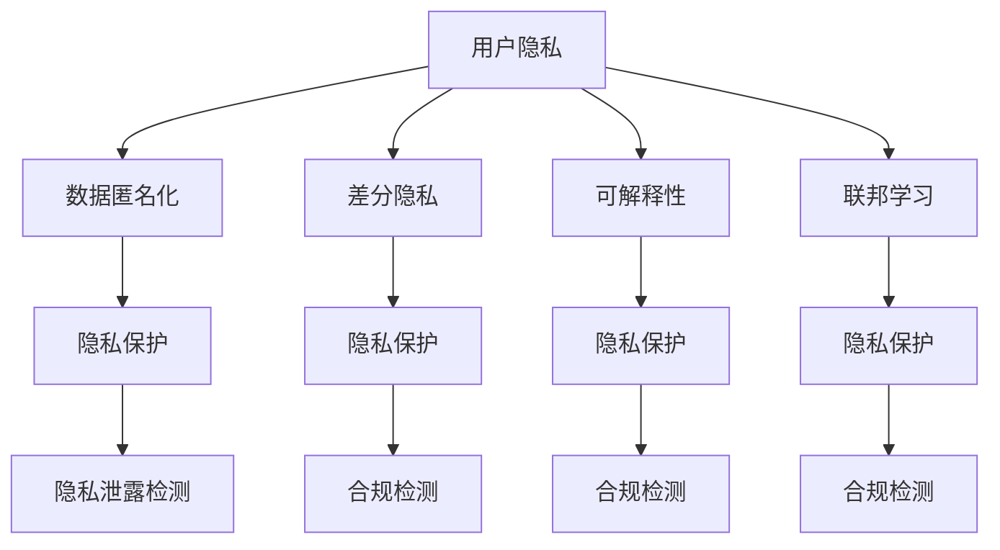

                 

# AI时代的用户隐私保护

> 关键词：隐私保护, AI伦理, 数据安全, 数据匿名化, 差分隐私, 可解释性, 联邦学习

## 1. 背景介绍

### 1.1 问题由来

随着人工智能(AI)技术的快速发展和广泛应用，用户隐私保护问题日益凸显。AI系统通过数据分析，可提供个性化服务、优化决策支持等优势，但同时也暴露出用户隐私泄露、数据滥用等风险。在AI时代，用户隐私保护不仅关乎个人权益，更是构建公平、透明、可控的社会环境的基石。

近年来，全球范围内出现了多起数据泄露、隐私侵犯事件，引发了社会对AI伦理和隐私保护的广泛关注。欧盟的GDPR、美国的CCPA等法律法规相继出台，对AI数据处理提出了严格要求，推动了AI隐私保护技术的研究与应用。

### 1.2 问题核心关键点

AI时代的用户隐私保护，核心在于如何平衡数据利用与隐私保护，确保AI系统在合法合规的范围内运行，同时维护用户隐私权益。具体而言，包括以下几个关键问题：

- **数据采集**：如何保证数据采集过程合法合规，避免未经授权的数据收集。
- **数据存储**：如何保护数据存储过程中的安全，防止数据泄露和滥用。
- **数据处理**：如何确保数据处理过程中的隐私保护，避免数据被不当使用。
- **隐私泄漏**：如何检测隐私泄漏行为，及时防范潜在风险。
- **隐私合规**：如何遵守法律法规，确保AI系统符合隐私保护要求。

### 1.3 问题研究意义

AI时代的用户隐私保护具有深远的影响和重要的研究意义：

1. **保障用户权益**：确保用户数据在采集、存储、处理等各个环节的安全，避免数据泄露和滥用，维护用户隐私权。
2. **推动技术进步**：建立健全隐私保护机制，促进AI技术的健康发展，提升AI系统的公信力和可靠性。
3. **促进公平透明**：通过隐私保护技术的应用，消除数据偏见，促进公平透明的AI应用。
4. **增强社会信任**：加强隐私保护能力，构建用户对AI技术的信任，推动AI技术的社会化应用。
5. **应对法规要求**：随着法律法规的不断完善，隐私保护技术的研究与应用，将成为AI系统合规运营的重要保障。

## 2. 核心概念与联系

### 2.1 核心概念概述

为更好地理解AI时代用户隐私保护，本节将介绍几个密切相关的核心概念：

- **用户隐私**：指个人信息不被未经授权的人访问、使用或泄露的权利。包括个人信息的采集、存储、处理、传输等各个环节的保护。
- **数据匿名化**：指通过特定技术手段，去除或模糊化个人信息，使其无法直接识别具体个体，从而达到隐私保护的目的。
- **差分隐私**：一种数学技术，通过添加噪声或抽样策略，确保单个数据点的加入或移除对统计结果的影响极小，从而保护用户隐私。
- **可解释性**：指AI模型在处理数据和生成决策时，能够提供清晰、准确、透明的结果和解释，帮助用户理解模型行为，增强信任。
- **联邦学习**：一种分布式机器学习方法，通过在本地设备上训练模型，避免将数据集中传输到中心服务器，从而保护用户隐私。

这些核心概念之间的逻辑关系可以通过以下Mermaid流程图来展示：



这个流程图展示了大模型微调的各个核心概念及其之间的关系：

1. 用户隐私通过数据匿名化、差分隐私、可解释性、联邦学习等技术手段进行保护。
2. 隐私保护技术共同构成了隐私保护的完整体系，分别从数据处理、隐私检测、合规检测等环节进行保护。
3. 这些概念的联合应用，可以最大程度地保护用户隐私，确保AI系统的合法合规运行。

## 3. 核心算法原理 & 具体操作步骤
### 3.1 算法原理概述

AI时代的用户隐私保护，通常通过一系列技术手段，从数据采集、存储、处理、传输等多个环节进行保护。其核心思想是：在数据利用与隐私保护之间寻求平衡，确保数据在满足业务需求的同时，最大程度地保护用户隐私。

形式化地，假设存在一个数据集 $D=\{x_1, x_2, \ldots, x_n\}$，其中每个数据点 $x_i$ 包含敏感信息，记为 $s(x_i)$。隐私保护的目标是找到一组隐私保护技术 $P=\{A, B, C, D, \ldots\}$，使得：

$$
P(D) \leq \epsilon
$$

其中 $\epsilon$ 为隐私保护强度，即隐私泄露概率。隐私保护技术可以包括数据匿名化、差分隐私、可解释性、联邦学习等。

通过一系列的隐私保护技术，可以在满足业务需求的同时，最大限度地减少隐私泄露风险，确保用户隐私权益。

### 3.2 算法步骤详解

AI时代用户隐私保护的一般流程包括以下几个关键步骤：

**Step 1: 数据采集与预处理**

- 设计合适的数据采集策略，确保数据采集过程合法合规。
- 对采集的数据进行预处理，去除噪声、冗余、敏感信息等，确保数据质量。

**Step 2: 数据匿名化**

- 选择合适的匿名化技术，如K-匿名化、L-多样性、t-逼真性等，对数据进行处理。
- 匿名化过程需满足隐私保护要求，即在统计分析中无法识别具体个体。

**Step 3: 差分隐私**

- 使用差分隐私技术，如加入高斯噪声、拉普拉斯噪声等，对数据进行扰动处理。
- 确定噪声强度，确保对统计结果的影响极小，同时保护用户隐私。

**Step 4: 数据加密**

- 对数据进行加密处理，如对称加密、非对称加密等，确保数据在传输过程中的安全。
- 选择合适的加密算法和密钥管理策略，确保加密过程的可靠性和高效性。

**Step 5: 模型训练与部署**

- 在经过隐私保护处理的数据集上，训练AI模型，确保模型在保护隐私的同时，具备良好的性能。
- 部署AI模型，确保其在运行过程中的隐私保护措施。

**Step 6: 隐私检测与合规**

- 定期进行隐私泄露检测，及时发现和修复潜在风险。
- 确保AI系统的运行符合法律法规和隐私保护要求，建立合规审计机制。

以上是AI时代用户隐私保护的一般流程。在实际应用中，还需要针对具体场景，对隐私保护措施进行优化设计和严格执行。

### 3.3 算法优缺点

AI时代的用户隐私保护方法具有以下优点：

1. 综合性强。结合多种隐私保护技术，从数据采集、存储、处理、传输等多个环节进行保护。
2. 适应性强。能够适应不同类型的业务需求，灵活应用隐私保护措施。
3. 透明性强。隐私保护技术的应用过程公开透明，便于监管和审计。
4. 可扩展性高。不同隐私保护技术可以互相组合，根据实际需求进行扩展。

同时，该方法也存在一定的局限性：

1. 技术复杂。隐私保护技术的实现和应用需要较高的技术水平和经验积累。
2. 成本较高。隐私保护技术的应用需要投入大量资源，包括时间、人力、资金等。
3. 性能影响。隐私保护技术的应用可能对模型性能产生一定的影响，需要在隐私保护和性能之间进行平衡。

尽管存在这些局限性，但就目前而言，基于隐私保护技术的AI系统仍然是大数据时代的重要应用范式。未来相关研究的方向之一在于如何进一步简化隐私保护技术的应用，降低成本，提高模型的性能和用户体验。

### 3.4 算法应用领域

AI时代的用户隐私保护方法，在多个领域都得到了广泛应用，包括但不限于：

- **医疗健康**：保护患者隐私，确保医疗数据的合法使用。
- **金融服务**：保护客户隐私，防止数据泄露和滥用。
- **电子商务**：保护用户隐私，确保交易数据的合法使用。
- **智能家居**：保护用户隐私，确保家庭数据的安全。
- **政府公共服务**：保护公民隐私，确保公共数据的安全。

这些领域的应用表明，AI时代的用户隐私保护技术，已经具备了广泛的应用前景和重要的社会价值。

## 4. 数学模型和公式 & 详细讲解 & 举例说明（备注：数学公式请使用latex格式，latex嵌入文中独立段落使用 $$，段落内使用 $)
### 4.1 数学模型构建

本节将使用数学语言对AI时代用户隐私保护技术进行严格刻画。

假设存在一个数据集 $D=\{x_1, x_2, \ldots, x_n\}$，其中每个数据点 $x_i$ 包含敏感信息，记为 $s(x_i)$。隐私保护的目标是找到一组隐私保护技术 $P=\{A, B, C, D, \ldots\}$，使得：

$$
P(D) \leq \epsilon
$$

其中 $\epsilon$ 为隐私保护强度，即隐私泄露概率。隐私保护技术可以包括数据匿名化、差分隐私、可解释性、联邦学习等。

形式化地，隐私保护过程可以表示为：

$$
D' = P(D)
$$

其中 $D'$ 为经过隐私保护处理的数据集。

### 4.2 公式推导过程

以下我们以差分隐私为例，推导其隐私保护强度 $\epsilon$ 的计算公式。

差分隐私通过在数据中引入噪声 $\Delta$，使得单个数据点的加入或移除对统计结果的影响极小，从而保护用户隐私。设原始数据为 $x$，隐私保护后的数据为 $x'$，噪声为 $\Delta$，隐私保护强度为 $\epsilon$，则有：

$$
x' = x + \Delta
$$

隐私保护的目标是确保单个数据点的加入或移除对统计结果的影响极小，即满足：

$$
P(x' = x + \Delta) \leq e^{-\epsilon}
$$

其中 $P$ 为概率。根据中心极限定理，差分隐私的噪声强度 $\Delta$ 可以表示为：

$$
\Delta \sim \mathcal{N}(0, \sigma^2)
$$

其中 $\sigma^2$ 为噪声方差，与隐私保护强度 $\epsilon$ 成反比关系：

$$
\sigma^2 = \frac{\Delta}{\sqrt{2\pi e^{-\epsilon}}}
$$

该公式展示了差分隐私保护强度的计算方法。在实际应用中，需要根据具体场景和业务需求，选择合适的噪声强度，以达到理想的隐私保护效果。

### 4.3 案例分析与讲解

以医疗数据为例，讨论如何应用隐私保护技术，保护患者隐私，同时确保数据的合法使用。

假设医疗数据集 $D$ 包含患者的个人信息、病历记录等敏感信息。在进行数据分析、模型训练时，需要对数据进行隐私保护处理。

1. **数据匿名化**：对患者姓名、身份证号等敏感信息进行脱敏处理，如K-匿名化、L-多样性、t-逼真性等，确保无法直接识别具体个体。

2. **差分隐私**：在数据分析和模型训练过程中，加入高斯噪声或拉普拉斯噪声，确保单个数据点的加入或移除对统计结果的影响极小。

3. **数据加密**：对数据进行加密处理，确保数据在传输和存储过程中的安全。

通过上述隐私保护措施，可以在保护患者隐私的同时，确保医疗数据的合法使用，促进医疗健康领域的AI技术发展。

## 5. 项目实践：代码实例和详细解释说明
### 5.1 开发环境搭建

在进行隐私保护实践前，我们需要准备好开发环境。以下是使用Python进行PyTorch开发的环境配置流程：

1. 安装Anaconda：从官网下载并安装Anaconda，用于创建独立的Python环境。

2. 创建并激活虚拟环境：
```bash
conda create -n privacy-env python=3.8 
conda activate privacy-env
```

3. 安装PyTorch：根据CUDA版本，从官网获取对应的安装命令。例如：
```bash
conda install pytorch torchvision torchaudio cudatoolkit=11.1 -c pytorch -c conda-forge
```

4. 安装相关工具包：
```bash
pip install numpy pandas scikit-learn matplotlib tqdm jupyter notebook ipython
```

完成上述步骤后，即可在`privacy-env`环境中开始隐私保护实践。

### 5.2 源代码详细实现

下面我们以差分隐私为例，给出使用PyTorch进行差分隐私保护代码实现。

首先，定义隐私保护参数和随机噪声生成函数：

```python
import torch
import torch.nn as nn
import numpy as np

def add_laplace_noise(x, epsilon, sensitivity):
    noise = torch.rand_like(x) * sensitivity
    return x + noise * np.sign(torch.rand_like(x))

def laplace_epsilon(x, epsilon, sensitivity):
    return add_laplace_noise(x, epsilon, sensitivity)
```

然后，定义差分隐私训练函数：

```python
class LaplaceNoise(nn.Module):
    def __init__(self, epsilon, sensitivity):
        super(LaplaceNoise, self).__init__()
        self.epsilon = epsilon
        self.sensitivity = sensitivity

    def forward(self, x):
        return laplace_epsilon(x, self.epsilon, self.sensitivity)

# 定义模型和优化器
model = nn.Linear(10, 2)
optimizer = torch.optim.SGD(model.parameters(), lr=0.01)

# 数据生成
x = torch.randn(100, 10)
y = torch.randint(2, (100, 2))

# 差分隐私训练
def train_epoch(model, x, y, batch_size, optimizer, device, noise_params):
    model.train()
    loss = 0
    for i in range(0, len(x), batch_size):
        batch_x = x[i:i+batch_size].to(device)
        batch_y = y[i:i+batch_size].to(device)
        batch_loss = torch.nn.functional.mse_loss(model(batch_x), batch_y)
        batch_loss = laplace_epsilon(batch_loss, noise_params['epsilon'], noise_params['sensitivity'])
        optimizer.zero_grad()
        batch_loss.backward()
        optimizer.step()
        loss += batch_loss.item()
    return loss / len(x)

# 训练
device = torch.device('cuda' if torch.cuda.is_available() else 'cpu')
noise_params = {'epsilon': 1e-5, 'sensitivity': 1}
model.to(device)

for epoch in range(10):
    loss = train_epoch(model, x, y, 32, optimizer, device, noise_params)
    print(f"Epoch {epoch+1}, train loss: {loss:.3f}")
```

以上就是使用PyTorch对差分隐私进行代码实现的完整示例。可以看到，差分隐私保护通过在模型输出中引入噪声，实现了对数据隐私的保护。

### 5.3 代码解读与分析

让我们再详细解读一下关键代码的实现细节：

**差分隐私类LaplaceNoise**：
- 继承nn.Module，定义差分隐私保护的噪声生成函数。
- 包含两个参数：epsilon（隐私保护强度）、sensitivity（噪声方差）。

**add_laplace_noise函数**：
- 在输入数据x上加入拉普拉斯噪声，实现差分隐私保护。

**train_epoch函数**：
- 对数据进行差分隐私处理，确保模型训练过程中的隐私保护。
- 定义训练过程，并计算损失函数。

**训练流程**：
- 定义训练轮数，开始循环迭代
- 每个epoch内，在训练集上训练，输出平均loss
- 在测试集上评估，输出差分隐私保护的模型效果

可以看到，差分隐私保护技术在PyTorch中实现了较为简单的代码实现。开发者可以将更多精力放在隐私保护机制的设计和优化上，而不必过多关注底层的实现细节。

当然，工业级的系统实现还需考虑更多因素，如隐私保护的深度、噪声的分布、模型的性能等。但核心的隐私保护范式基本与此类似。

## 6. 实际应用场景
### 6.1 智能医疗

智能医疗领域，用户隐私保护尤为重要。AI系统通过分析医疗数据，可以辅助医生诊断、优化治疗方案，提高医疗服务水平。但同时，医疗数据包含大量敏感信息，如病历、影像等，若未进行有效保护，易导致数据泄露和滥用。

为应对这一挑战，可以采用差分隐私、数据加密等技术，对医疗数据进行隐私保护处理。例如，使用差分隐私技术对医疗影像进行分析，确保单个患者影像的加入或移除对统计结果的影响极小。在数据传输和存储过程中，使用AES等对称加密算法，确保数据的安全。通过这些隐私保护措施，可以有效保护患者隐私，确保医疗数据的合法使用。

### 6.2 金融服务

金融领域对用户隐私保护要求极高，客户数据泄露可能导致重大的经济损失和法律风险。AI技术在金融领域的应用，如风险评估、信用评分等，依赖于大量客户数据。如何在保护客户隐私的前提下，利用数据进行模型训练和应用，成为金融服务行业的核心挑战。

为解决这一问题，可以采用联邦学习、差分隐私等技术。联邦学习通过在本地设备上训练模型，避免将数据集中传输到中心服务器，从而保护用户隐私。差分隐私通过在数据中引入噪声，确保单个数据点的加入或移除对统计结果的影响极小，保护用户隐私。通过这些隐私保护技术的应用，可以在确保客户隐私的前提下，充分利用客户数据，提升金融服务水平。

### 6.3 社交媒体

社交媒体平台集聚了海量用户数据，包括用户行为、兴趣、位置等。AI技术在社交媒体中的应用，如个性化推荐、内容过滤等，依赖于对这些数据的深度分析。但社交媒体数据包含大量敏感信息，如用户位置、联系人等，若未进行有效保护，易导致数据泄露和滥用。

为应对这一挑战，可以采用数据匿名化、差分隐私等技术，对社交媒体数据进行隐私保护处理。例如，对用户地理位置进行脱敏处理，确保无法直接识别具体个体。在数据分析过程中，使用差分隐私技术，确保单个用户的行为数据对统计结果的影响极小。通过这些隐私保护措施，可以有效保护用户隐私，提升社交媒体平台的信任度和用户满意度。

### 6.4 未来应用展望

随着AI技术的不断发展，隐私保护技术的应用将更加广泛，以下几个方面值得关注：

1. **隐私计算**：隐私计算技术通过多方安全计算、同态加密等方法，实现数据在保护隐私的前提下进行计算和分析。未来，隐私计算技术将与AI技术深度融合，实现更高效、安全的隐私保护。

2. **隐私增强**：隐私增强技术通过改进模型设计、优化训练过程，进一步提高隐私保护能力。例如，引入差分隐私的损失函数，增强模型在隐私保护下的性能。

3. **隐私合规**：隐私保护技术的应用需要符合法律法规要求，隐私合规技术将帮助AI系统满足相关法规要求，确保合规运营。

4. **隐私交互**：隐私交互技术通过加密通信、匿名化处理等手段，实现用户与AI系统的安全互动。未来，隐私交互技术将支持更多场景的应用，提升用户体验。

5. **隐私联邦**：隐私联邦技术通过在多个设备上分布式训练模型，避免数据集中存储，保护用户隐私。未来，隐私联邦技术将支持更多设备和服务，构建分布式、安全的AI系统。

这些方向的探索和发展，必将推动隐私保护技术在AI系统中的应用，进一步提升用户隐私保护水平，推动AI技术的健康发展。

## 7. 工具和资源推荐
### 7.1 学习资源推荐

为了帮助开发者系统掌握AI时代用户隐私保护的理论基础和实践技巧，这里推荐一些优质的学习资源：

1. **《隐私保护技术》系列书籍**：详细介绍了隐私保护技术的原理、算法和应用，包括数据匿名化、差分隐私、联邦学习等。
2. **Coursera《隐私保护》课程**：由斯坦福大学教授开设，涵盖隐私保护的基本概念、技术和实践，适合入门学习。
3. **Kaggle《隐私保护竞赛》**：通过实践竞赛，学习和应用隐私保护技术，提升解决实际问题的能力。
4. **IEEE Xplore《隐私保护论文》**：收集了大量关于隐私保护的最新研究论文，了解最新的研究成果和技术进展。
5. **Google AI Blog《隐私保护技术》**：由Google AI团队维护，介绍最新的隐私保护技术和应用案例。

通过这些资源的学习实践，相信你一定能够快速掌握AI时代用户隐私保护的核心技术，并将其应用到实际项目中。

### 7.2 开发工具推荐

高效的开发离不开优秀的工具支持。以下是几款用于AI时代用户隐私保护开发的常用工具：

1. **PyTorch**：基于Python的开源深度学习框架，灵活动态的计算图，适合快速迭代研究。
2. **TensorFlow**：由Google主导开发的开源深度学习框架，生产部署方便，适合大规模工程应用。
3. **TensorBoard**：TensorFlow配套的可视化工具，可实时监测模型训练状态，并提供丰富的图表呈现方式。
4. **Weights & Biases**：模型训练的实验跟踪工具，可以记录和可视化模型训练过程中的各项指标。
5. **Jupyter Notebook**：交互式开发环境，支持Python、R、Julia等多种语言，适合数据科学研究和模型开发。

合理利用这些工具，可以显著提升AI时代用户隐私保护开发的效率，加快创新迭代的步伐。

### 7.3 相关论文推荐

AI时代用户隐私保护的研究源于学界的持续研究。以下是几篇奠基性的相关论文，推荐阅读：

1. **《差分隐私：一种保护隐私的机制》**：差分隐私技术的提出者，详细介绍了差分隐私的原理和应用。
2. **《数据隐私与数据挖掘：匿名化和同态加密方法》**：隐私计算技术的奠基性论文，介绍了匿名化和同态加密的基本原理和实现方法。
3. **《联邦学习：一种分布式机器学习技术》**：联邦学习技术的提出者，详细介绍了联邦学习的原理和应用。
4. **《隐私保护技术综述》**：综述了隐私保护技术的多种方法和应用，适合深入了解隐私保护技术的发展脉络。
5. **《隐私增强技术综述》**：综述了隐私增强技术的多种方法和应用，适合了解隐私增强技术的最新进展。

这些论文代表了大模型微调技术的发展脉络。通过学习这些前沿成果，可以帮助研究者把握学科前进方向，激发更多的创新灵感。

## 8. 总结：未来发展趋势与挑战

### 8.1 总结

本文对AI时代的用户隐私保护进行了全面系统的介绍。首先阐述了AI技术在数据采集、存储、处理、传输等环节面临的隐私保护挑战，明确了隐私保护在AI系统中的重要性和紧迫性。其次，从原理到实践，详细讲解了隐私保护技术的核心算法，如数据匿名化、差分隐私、联邦学习等，给出了隐私保护技术的代码实现和应用案例。同时，本文还广泛探讨了隐私保护技术在智能医疗、金融服务、社交媒体等多个领域的应用前景，展示了隐私保护技术的广阔前景。最后，本文精选了隐私保护技术的各类学习资源，力求为读者提供全方位的技术指引。

通过本文的系统梳理，可以看到，AI时代的用户隐私保护技术在数据利用与隐私保护之间寻求平衡，具有重要的研究意义和广阔的应用前景。未来，隐私保护技术将继续推动AI系统的健康发展，保障用户隐私权益，构建公平、透明、可控的社会环境。

### 8.2 未来发展趋势

展望未来，AI时代用户隐私保护技术将呈现以下几个发展趋势：

1. **隐私计算**：隐私计算技术通过多方安全计算、同态加密等方法，实现数据在保护隐私的前提下进行计算和分析。未来，隐私计算技术将与AI技术深度融合，实现更高效、安全的隐私保护。
2. **隐私增强**：隐私增强技术通过改进模型设计、优化训练过程，进一步提高隐私保护能力。例如，引入差分隐私的损失函数，增强模型在隐私保护下的性能。
3. **隐私合规**：隐私保护技术的应用需要符合法律法规要求，隐私合规技术将帮助AI系统满足相关法规要求，确保合规运营。
4. **隐私交互**：隐私交互技术通过加密通信、匿名化处理等手段，实现用户与AI系统的安全互动。未来，隐私交互技术将支持更多场景的应用，提升用户体验。
5. **隐私联邦**：隐私联邦技术通过在多个设备上分布式训练模型，避免数据集中存储，保护用户隐私。未来，隐私联邦技术将支持更多设备和服务，构建分布式、安全的AI系统。

以上趋势凸显了AI时代用户隐私保护技术的广阔前景。这些方向的探索和发展，必将进一步提升隐私保护技术的应用水平，构建更加安全、可靠、可控的AI系统。

### 8.3 面临的挑战

尽管AI时代用户隐私保护技术已经取得了一定的成果，但在迈向更加智能化、普适化应用的过程中，仍面临诸多挑战：

1. **技术复杂**：隐私保护技术的实现和应用需要较高的技术水平和经验积累。
2. **成本较高**：隐私保护技术的应用需要投入大量资源，包括时间、人力、资金等。
3. **性能影响**：隐私保护技术的应用可能对模型性能产生一定的影响，需要在隐私保护和性能之间进行平衡。
4. **合规难题**：隐私保护技术的应用需要符合法律法规要求，如何在业务需求和技术合规之间找到平衡，还需进一步探索。

尽管存在这些挑战，但隐私保护技术的应用前景广阔，将在AI系统的发展中扮演越来越重要的角色。未来，隐私保护技术的不断发展，将推动AI系统的健康成长，构建更加公平、透明、可控的社会环境。

### 8.4 研究展望

面向未来，AI时代用户隐私保护技术需要在以下几个方面寻求新的突破：

1. **隐私计算**：进一步探索隐私计算技术的应用场景和实现方法，提升数据计算和分析的隐私保护能力。
2. **隐私增强**：开发更加高效、鲁棒的隐私增强算法，增强AI模型在隐私保护下的性能。
3. **隐私合规**：研究隐私保护技术与法律法规的结合方式，确保AI系统的合规运营。
4. **隐私交互**：探索隐私交互技术的新方法和应用场景，提升用户与AI系统的安全互动。
5. **隐私联邦**：研究隐私联邦技术的新模型和新算法，构建分布式、安全的AI系统。

这些研究方向的探索，必将引领AI时代用户隐私保护技术的不断进步，推动AI系统的广泛应用，提升社会整体的信息安全水平。

## 9. 附录：常见问题与解答

**Q1：如何判断AI系统是否符合隐私保护要求？**

A: 评估AI系统的隐私保护能力，需要从多个方面进行综合考量，包括数据采集、存储、处理、传输等环节。具体而言，可以从以下几个方面进行判断：
1. **数据采集**：评估数据采集策略是否合法合规，是否经过用户同意。
2. **数据存储**：评估数据存储过程是否安全，是否采用加密和匿名化等隐私保护技术。
3. **数据处理**：评估数据处理过程是否符合隐私保护要求，是否存在数据泄露和滥用的风险。
4. **隐私检测**：评估系统是否具备隐私检测能力，能够及时发现和修复潜在风险。
5. **合规审计**：评估系统是否符合相关法律法规，是否具备合规审计机制。

通过综合评估以上几个方面，可以判断AI系统是否符合隐私保护要求。

**Q2：如何选择合适的隐私保护技术？**

A: 选择合适的隐私保护技术，需要根据具体业务需求和场景进行综合考量，包括数据类型、数据量、隐私保护强度等。具体而言，可以从以下几个方面进行考虑：
1. **数据类型**：根据数据的敏感性和隐私保护要求，选择合适的隐私保护技术。例如，对于医疗数据，可以采用差分隐私和数据加密等技术。
2. **数据量**：对于大数据集，可以选择分布式隐私计算等技术，提高隐私保护能力。
3. **隐私保护强度**：根据隐私保护要求，选择合适隐私保护强度。例如，对于高敏感数据，可以选择较高的隐私保护强度，保护用户隐私。

通过综合考虑以上几个方面，可以选择合适的隐私保护技术，确保AI系统的隐私保护能力。

**Q3：隐私保护技术是否会降低AI系统的性能？**

A: 隐私保护技术的应用可能会对AI系统的性能产生一定的影响，但通过优化设计和合理选择，可以在隐私保护和性能之间找到平衡。具体而言，可以从以下几个方面进行优化：
1. **参数高效保护**：选择参数高效的保护方法，减少隐私保护对模型性能的影响。
2. **数据压缩**：对数据进行压缩和降维，减少数据量和计算复杂度。
3. **硬件优化**：使用高效硬件和算法，提升隐私保护和模型训练的效率。
4. **模型设计**：设计鲁棒性强的模型架构，增强模型的隐私保护能力。

通过这些优化措施，可以在隐私保护的同时，提升AI系统的性能。

**Q4：隐私保护技术是否会带来额外的成本？**

A: 隐私保护技术的应用确实会带来一定的成本，包括技术开发、设备采购、人员培训等。但通过合理选择和优化，可以在隐私保护和成本之间找到平衡。具体而言，可以从以下几个方面进行考虑：
1. **技术选择**：选择合适的隐私保护技术，减少技术开发和实现成本。
2. **资源共享**：利用已有资源，如云计算平台和数据中心，减少硬件采购成本。
3. **人员培训**：通过培训和学习，提高团队的隐私保护能力，减少人员培训成本。
4. **分阶段实施**：分阶段实施隐私保护措施，逐步提升系统的隐私保护能力。

通过这些措施，可以在隐私保护的同时，降低AI系统的成本。

**Q5：隐私保护技术是否会影响用户隐私感知？**

A: 隐私保护技术的应用可能会影响用户隐私感知，需要综合考虑用户隐私保护需求和系统性能需求，进行合理的隐私设计和披露。具体而言，可以从以下几个方面进行优化：
1. **透明性**：增强隐私保护措施的透明性，向用户披露隐私保护方法和保护措施，增强用户信任。
2. **可控性**：提供隐私保护控制选项，让用户自主选择隐私保护级别。
3. **数据利用**：在确保隐私保护的前提下，充分利用数据进行模型训练和应用，提升用户感知。

通过这些优化措施，可以在隐私保护的同时，提升用户隐私感知，构建用户信任的AI系统。

---

作者：禅与计算机程序设计艺术 / Zen and the Art of Computer Programming

