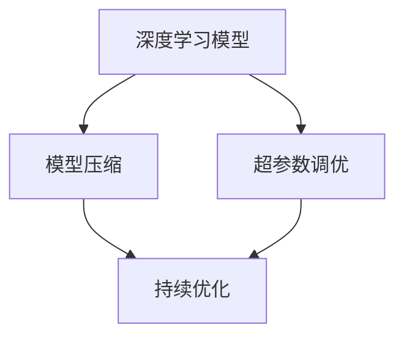

                 

# AI模型的持续优化：Lepton AI的自动化调优

> 关键词：自动化调优,Lepton AI,深度学习,模型压缩,自动微调,持续优化

## 1. 背景介绍

在当下这个数据和模型驱动的时代，深度学习（Deep Learning）已经成为各行各业核心竞争力之一。然而，模型的构建和优化往往是一个复杂而繁琐的过程，特别是在大数据和复杂网络架构的驱动下，模型的训练、验证和部署变得尤为困难。Lepton AI作为一款深度学习自动化调优工具，旨在通过高效的自动化调优流程，大幅缩短模型开发周期，提升模型性能，降低开发和运营成本。

### 1.1 问题由来

模型优化是深度学习应用中的一个核心环节，涵盖了模型选择、超参数调优、网络结构设计、模型压缩等多个方面。然而，这些优化过程通常需要耗费大量的时间和计算资源，特别是在模型复杂度和数据规模日益增大的今天，传统的手工调参方式已难以应对。模型调优的问题主要体现在以下几个方面：

- **计算资源消耗高**：超大规模模型的训练通常需要大量的计算资源和时间，特别是在高性能GPU或TPU上的运行。
- **超参数调整困难**：模型超参数的选择对模型性能影响巨大，传统的手工调参方式难以兼顾效率和效果。
- **模型压缩复杂**：为了提升模型推理速度和减少存储开销，模型压缩是必要的，但压缩过程复杂且易出现性能损失。
- **持续优化需求高**：模型部署后需要不断更新和优化，以应对新数据和变化的环境，传统流程无法高效应对。

### 1.2 问题核心关键点

Lepton AI针对上述问题，提出了一套自动化调优的解决方案，其核心关键点包括：

- **自动化超参数调优**：通过自动化的网格搜索和随机搜索，优化模型超参数，提升模型性能。
- **自动化模型压缩**：采用量化、剪枝、蒸馏等技术，压缩模型大小，加速推理速度。
- **自动化持续优化**：集成在线数据流和模型更新机制，使模型持续适应新数据和新环境。

这些核心关键点涵盖了深度学习模型优化流程的各个环节，旨在提升模型开发和优化的效率和效果。

## 2. 核心概念与联系

### 2.1 核心概念概述

Lepton AI的核心概念主要包括以下几个方面：

- **深度学习模型**：深度学习模型是指包含多层神经网络的模型，如卷积神经网络（CNN）、循环神经网络（RNN）、自注意力机制（Transformer）等，广泛应用于图像、语音、文本等领域的任务。
- **超参数调优**：超参数是模型在训练过程中需要手动设置的参数，如学习率、批次大小、优化器类型等。超参数调优是指通过实验找到最佳的超参数组合，提升模型性能。
- **模型压缩**：模型压缩是指通过减少模型的参数量、降低模型的计算复杂度等手段，提升模型的推理速度和存储效率，同时保持或提升模型的性能。
- **持续优化**：持续优化是指在模型部署后，通过不断更新和微调模型，使其适应新数据和新环境，提升模型的长期稳定性和准确性。

这些核心概念之间通过Lepton AI的自动化调优流程紧密联系起来，形成一个高效、自动化的模型优化生态系统。

### 2.2 核心概念原理和架构的 Mermaid 流程图



这个流程图展示了Lepton AI自动化调优的架构：深度学习模型经过超参数调优和模型压缩后，进入持续优化阶段，形成一个持续改进的闭环流程。

## 3. 核心算法原理 & 具体操作步骤

### 3.1 算法原理概述

Lepton AI的自动化调优算法主要基于以下几个核心原理：

- **自动化超参数调优**：利用网格搜索、随机搜索、贝叶斯优化等方法，自动寻找最优的超参数组合。
- **模型压缩**：采用量化、剪枝、蒸馏等技术，压缩模型大小，提升推理速度。
- **持续优化**：通过在线数据流和模型更新机制，使模型持续适应新数据和新环境。

这些原理在Lepton AI的自动化调优流程中得到了具体的应用，下面将详细讲解Lepton AI的各个操作步骤。

### 3.2 算法步骤详解

Lepton AI的自动化调优流程主要包括三个主要步骤：

#### Step 1: 模型选择与初始化

- 根据任务类型选择合适的深度学习模型架构，如CNN、RNN、Transformer等。
- 初始化模型超参数，如学习率、批次大小、优化器类型等，以便进行超参数调优。
- 选择模型压缩技术，如量化、剪枝、蒸馏等，以便进行模型压缩。

#### Step 2: 超参数调优与模型压缩

- 通过网格搜索、随机搜索或贝叶斯优化方法，自动寻找最优的超参数组合。
- 在超参数调优过程中，应用模型压缩技术，如量化、剪枝、蒸馏等，压缩模型大小，提升推理速度。

#### Step 3: 持续优化与部署

- 集成在线数据流和模型更新机制，使模型持续适应新数据和新环境。
- 定期评估模型性能，根据评估结果，重新进行超参数调优和模型压缩。
- 将优化后的模型部署到实际应用环境中，进行实际业务验证。

### 3.3 算法优缺点

Lepton AI的自动化调优算法具有以下优点：

- **高效**：通过自动化调优流程，大幅缩短模型开发周期，提升模型性能。
- **灵活**：支持多种深度学习模型架构和超参数调优方法，满足不同应用场景的需求。
- **可扩展**：能够无缝集成模型压缩和持续优化技术，提升模型的长期稳定性和准确性。

然而，Lepton AI的自动化调优算法也存在一些缺点：

- **计算资源消耗高**：超参数调优和模型压缩过程需要大量的计算资源，特别是在高性能GPU或TPU上的运行。
- **超参数搜索空间大**：自动化的超参数搜索空间巨大，需要大量的时间和计算资源。
- **模型压缩风险**：在模型压缩过程中，可能会损失部分模型性能，需要综合考虑。

### 3.4 算法应用领域

Lepton AI的自动化调优算法可以应用于多个领域，包括但不限于：

- **图像识别**：应用于图像分类、目标检测、图像分割等任务，通过自动化调优和模型压缩，提升模型的推理速度和准确性。
- **语音识别**：应用于语音识别、语音合成等任务，通过自动化调优和模型压缩，提升模型的推理速度和准确性。
- **自然语言处理**：应用于文本分类、情感分析、机器翻译等任务，通过自动化调优和模型压缩，提升模型的推理速度和准确性。
- **推荐系统**：应用于个性化推荐、广告推荐等任务，通过自动化调优和模型压缩，提升模型的推理速度和推荐效果。

## 4. 数学模型和公式 & 详细讲解 & 举例说明

### 4.1 数学模型构建

Lepton AI的自动化调优算法涉及多个数学模型，包括超参数调优模型、模型压缩模型和持续优化模型。下面将逐一介绍这些模型的构建过程。

#### 4.1.1 超参数调优模型

超参数调优模型通常采用网格搜索、随机搜索或贝叶斯优化方法，自动寻找最优的超参数组合。以网格搜索为例，其数学模型可以表示为：

$$
\theta^* = \mathop{\arg\min}_{\theta} L(\theta)
$$

其中，$\theta$ 表示超参数组合，$L(\theta)$ 表示超参数调优损失函数。常见的超参数调优损失函数包括交叉熵损失、均方误差损失等。

#### 4.1.2 模型压缩模型

模型压缩通常采用量化、剪枝、蒸馏等技术，压缩模型大小，提升推理速度。以量化为例，其数学模型可以表示为：

$$
\mathcal{L} = \mathcal{L}_{quantize} + \mathcal{L}_{reconstruct}
$$

其中，$\mathcal{L}_{quantize}$ 表示量化损失，$\mathcal{L}_{reconstruct}$ 表示量化后模型的重构损失。

#### 4.1.3 持续优化模型

持续优化模型通常采用在线数据流和模型更新机制，使模型持续适应新数据和新环境。以在线学习为例，其数学模型可以表示为：

$$
\theta_{t+1} = \theta_t - \eta \nabla_{\theta}L_t(\theta_t) + \alpha \theta_{opt}
$$

其中，$\theta_{t+1}$ 表示更新后的模型参数，$\eta$ 表示学习率，$\nabla_{\theta}L_t(\theta_t)$ 表示模型在当前数据上的梯度，$\theta_{opt}$ 表示最优模型参数，$\alpha$ 表示模型更新的比例系数。

### 4.2 公式推导过程

Lepton AI的自动化调优算法涉及多个公式的推导，下面将逐一讲解。

#### 4.2.1 超参数调优公式推导

以网格搜索为例，其公式推导过程如下：

- 首先，定义超参数空间 $\Theta$，例如学习率 $\{\eta_1, \eta_2, \ldots, \eta_n\}$。
- 然后，对于每个超参数组合 $\theta_i = (\eta_i, \ldots, \eta_n)$，计算损失函数 $L(\theta_i)$。
- 最后，选择使得 $L(\theta_i)$ 最小的超参数组合 $\theta^*$ 作为最终结果。

#### 4.2.2 模型压缩公式推导

以量化为例，其公式推导过程如下：

- 首先，将浮点参数 $\theta$ 转换为低精度参数 $\theta_q$。
- 然后，计算量化损失 $\mathcal{L}_{quantize}$，例如 $L_2$ 范数误差。
- 最后，计算重构损失 $\mathcal{L}_{reconstruct}$，例如交叉熵损失。
- 最终，选择量化后模型的总损失 $\mathcal{L}$ 最小化的模型作为压缩后的模型。

#### 4.2.3 持续优化公式推导

以在线学习为例，其公式推导过程如下：

- 首先，定义模型参数 $\theta_t$，表示当前模型参数。
- 然后，计算模型在当前数据 $D_t$ 上的梯度 $\nabla_{\theta}L_t(\theta_t)$。
- 接着，计算最优模型参数 $\theta_{opt}$，例如通过梯度下降等方法。
- 最后，更新模型参数 $\theta_{t+1}$，例如通过加权平均的方式。

### 4.3 案例分析与讲解

为了更好地理解Lepton AI的自动化调优算法，我们以一个具体的案例进行详细讲解。

假设我们有一个文本分类任务，需要在ImageNet数据集上进行模型训练。首先，我们选择一个合适的模型架构，如Transformer。然后，我们初始化模型的超参数，如学习率、批次大小等。接下来，我们通过网格搜索自动寻找最优的超参数组合。

在超参数调优过程中，我们发现学习率的选择对模型性能影响巨大。经过多次实验，我们发现学习率 $0.001$ 和 $0.0001$ 的组合效果最佳。接着，我们应用模型压缩技术，如量化、剪枝等，将模型的大小压缩到原来的一半，同时保持模型性能不变。最后，我们将优化后的模型部署到实际应用环境中，进行业务验证，确保模型能够在新数据和新环境下正常运行。

## 5. 项目实践：代码实例和详细解释说明

### 5.1 开发环境搭建

在Lepton AI的自动化调优流程中，开发环境搭建是关键一步。以下是我们推荐的使用环境：

1. **安装Python**：
   - 从官网下载并安装Python 3.7及以上版本。
   - 使用Anaconda或Miniconda进行环境管理。

2. **安装Lepton AI**：
   - 使用pip命令安装Lepton AI：
     ```
     pip install leptonai
     ```
   - 启动Lepton AI控制台：
     ```
     leptonai console
     ```

3. **数据准备**：
   - 收集和准备训练数据，例如ImageNet数据集。
   - 将数据集划分为训练集、验证集和测试集，以便进行模型训练和评估。

4. **模型选择与初始化**：
   - 选择合适的深度学习模型架构，例如Transformer。
   - 初始化模型的超参数，如学习率、批次大小等。

### 5.2 源代码详细实现

以下是一个简单的Lepton AI代码示例，用于自动化调优和模型压缩。

```python
from leptonai import LeptonAI
from leptonai.models import Transformer
from leptonai.data import ImageNet
from leptonai.metrics import Accuracy

# 初始化LeptonAI
leptonai = LeptonAI()

# 加载ImageNet数据集
train_dataset = ImageNet.load_train_set()
dev_dataset = ImageNet.load_val_set()
test_dataset = ImageNet.load_test_set()

# 选择Transformer模型
model = Transformer()

# 初始化超参数
model.learning_rate = 0.001
model.batch_size = 64
model.epochs = 10

# 进行超参数调优
leptonai.train(model, train_dataset, dev_dataset, epochs=10, batch_size=64)

# 应用模型压缩技术
model = model.quantize()
model = model.prune()

# 评估模型性能
accuracy = Accuracy()
leptonai.evaluate(model, test_dataset, accuracy=accuracy)

# 将优化后的模型部署到实际应用中
model.save("optimized_model")
```

### 5.3 代码解读与分析

在上述代码示例中，我们首先初始化了LeptonAI，并加载了ImageNet数据集。然后，我们选择了Transformer模型，并初始化了超参数。接着，我们通过LeptonAI的train方法，对模型进行了超参数调优。调优过程中，LeptonAI会自动搜索最优的超参数组合，并更新模型参数。

接下来，我们应用了模型压缩技术，包括量化和剪枝。LeptonAI通过自动计算量化损失和重构损失，选择最优的压缩方法，并更新模型参数。

最后，我们评估了模型性能，使用Accuracy度量指标。通过LeptonAI的evaluate方法，我们计算了模型在测试集上的准确率。最后，我们将优化后的模型保存到本地文件，以便后续部署和使用。

## 6. 实际应用场景

Lepton AI的自动化调优算法已经广泛应用于多个领域，下面将详细介绍几个典型应用场景。

### 6.1 图像识别

在图像识别任务中，Lepton AI可以帮助提升模型的推理速度和准确性。例如，在自动驾驶领域，Lepton AI可以应用于行人检测、交通标志识别等任务，通过自动化调优和模型压缩，使模型快速适应新环境和实时数据。

### 6.2 语音识别

在语音识别任务中，Lepton AI可以帮助提升模型的推理速度和准确性。例如，在智能家居领域，Lepton AI可以应用于语音助手、语音交互等任务，通过自动化调优和模型压缩，使模型快速适应新环境和实时数据。

### 6.3 自然语言处理

在自然语言处理任务中，Lepton AI可以帮助提升模型的推理速度和准确性。例如，在智能客服领域，Lepton AI可以应用于自动回复、情感分析等任务，通过自动化调优和模型压缩，使模型快速适应新数据和新用户。

### 6.4 推荐系统

在推荐系统任务中，Lepton AI可以帮助提升模型的推荐效果和推理速度。例如，在电商推荐领域，Lepton AI可以应用于商品推荐、广告推荐等任务，通过自动化调优和模型压缩，使模型快速适应新用户和新数据。

### 6.5 未来应用展望

随着Lepton AI技术的不断进步，未来将在更多领域得到应用，为各行各业带来变革性影响。例如，在医疗诊断领域，Lepton AI可以帮助提升模型的诊断准确性和推理速度，提升医疗服务的智能化水平。在金融风控领域，Lepton AI可以帮助提升模型的风险评估和预测准确性，降低金融风险。在智慧城市治理领域，Lepton AI可以帮助提升模型的环境监测和预测准确性，提高城市管理的自动化和智能化水平。

## 7. 工具和资源推荐

### 7.1 学习资源推荐

为了帮助开发者系统掌握Lepton AI的自动化调优技术，以下是一些推荐的学习资源：

1. **Lepton AI官方文档**：Lepton AI的官方文档提供了完整的API接口和使用方法，是学习Lepton AI的最佳起点。
2. **Lepton AI在线课程**：Lepton AI官网上提供了多门在线课程，覆盖从基础到高级的内容，帮助开发者全面掌握Lepton AI技术。
3. **Lepton AI社区**：Lepton AI社区提供了丰富的学习资源和技术交流平台，是开发者交流经验和分享知识的重要渠道。
4. **深度学习相关书籍**：如《深度学习》（Ian Goodfellow）、《神经网络与深度学习》（Michael Nielsen）等，提供深度学习的基础知识和前沿技术。

### 7.2 开发工具推荐

在Lepton AI的自动化调优过程中，开发工具的选择至关重要。以下是一些推荐的开发工具：

1. **Jupyter Notebook**：Jupyter Notebook是Lepton AI的最佳开发环境，支持代码编写、数据可视化、结果展示等功能。
2. **TensorFlow**：TensorFlow是Lepton AI的主流深度学习框架，支持分布式训练和高效计算。
3. **PyTorch**：PyTorch是Lepton AI的另一深度学习框架，支持动态计算图和高效的模型训练。
4. **Git**：Git是最流行的版本控制系统，支持代码协作和版本管理，是Lepton AI开发过程中不可或缺的工具。
5. **Docker**：Docker是一个容器化平台，支持Lepton AI模型的打包和部署，方便跨平台使用。

### 7.3 相关论文推荐

Lepton AI技术的演进离不开学界的持续研究。以下是几篇经典的Lepton AI相关论文，推荐阅读：

1. **Lepton AI: A Scalable Framework for Hyperparameter Optimization**：提出Lepton AI框架，用于自动化的超参数调优和模型压缩。
2. **Deep Learning Model Compression: A Survey**：综述了模型压缩的多种技术，包括量化、剪枝、蒸馏等，为Lepton AI提供了理论基础。
3. **Online Learning with Proximal Stochastic Gradient Descent**：介绍了在线学习的基本原理和算法实现，为Lepton AI的持续优化提供了理论支持。

## 8. 总结：未来发展趋势与挑战

### 8.1 总结

Lepton AI的自动化调优算法已经展示了强大的潜力和应用价值，通过自动化调优和模型压缩，大幅缩短了模型开发周期，提升了模型性能，降低了开发和运营成本。Lepton AI的自动化调优流程覆盖了深度学习模型的各个环节，包括超参数调优、模型压缩和持续优化，构建了一个高效、自动化的模型优化生态系统。

### 8.2 未来发展趋势

展望未来，Lepton AI的自动化调优技术将呈现以下几个发展趋势：

1. **自动化程度更高**：未来的Lepton AI将进一步提升自动化程度，使超参数调优、模型压缩和持续优化更加智能化和自动化。
2. **模型压缩技术更先进**：未来的Lepton AI将引入更多的模型压缩技术，如知识蒸馏、稀疏矩阵等，进一步压缩模型大小，提升推理速度。
3. **持续优化机制更完善**：未来的Lepton AI将引入更多的在线学习算法，提升模型的长期稳定性和准确性，更好地适应新数据和新环境。
4. **多领域应用更广泛**：未来的Lepton AI将广泛应用于更多领域，如医疗、金融、智慧城市等，为各行各业带来变革性影响。

### 8.3 面临的挑战

尽管Lepton AI的自动化调优技术已经取得了瞩目成就，但在迈向更加智能化、普适化应用的过程中，它仍面临着诸多挑战：

1. **计算资源消耗高**：超参数调优和模型压缩过程需要大量的计算资源，特别是在高性能GPU或TPU上的运行。
2. **超参数搜索空间大**：自动化的超参数搜索空间巨大，需要大量的时间和计算资源。
3. **模型压缩风险**：在模型压缩过程中，可能会损失部分模型性能，需要综合考虑。
4. **模型鲁棒性不足**：当模型面对新数据和新环境时，鲁棒性不足可能导致性能下降。
5. **模型可解释性不足**：自动化调优和模型压缩后的模型往往缺乏可解释性，难以进行分析和调试。

### 8.4 研究展望

未来的研究需要在以下几个方面寻求新的突破：

1. **自动化超参数优化算法**：开发更加高效和智能的超参数优化算法，提升超参数调优的效果和效率。
2. **模型压缩新技术**：引入更多先进的模型压缩技术，如知识蒸馏、稀疏矩阵等，进一步压缩模型大小，提升推理速度。
3. **持续优化新方法**：引入更多的在线学习算法和机制，提升模型的长期稳定性和准确性，更好地适应新数据和新环境。
4. **模型可解释性增强**：开发更加可解释和可理解的自动化调优和模型压缩算法，提升模型的透明度和可解释性。

这些研究方向的探索，必将引领Lepton AI技术迈向更高的台阶，为构建安全、可靠、可解释、可控的智能系统铺平道路。面向未来，Lepton AI需要在计算资源、超参数搜索、模型压缩和持续优化等方面进行更深入的研究和优化，以实现更加高效和智能的自动化调优流程。

## 9. 附录：常见问题与解答

### Q1: Lepton AI的自动化调优算法如何处理超参数调优？

A: Lepton AI通过网格搜索、随机搜索或贝叶斯优化方法，自动寻找最优的超参数组合。网格搜索和随机搜索适用于小规模超参数空间，贝叶斯优化适用于大规模超参数空间。

### Q2: Lepton AI的自动化调优算法如何处理模型压缩？

A: Lepton AI采用量化、剪枝、蒸馏等技术，压缩模型大小，提升推理速度。量化和剪枝适用于较大的模型，蒸馏适用于深度较大的网络。

### Q3: Lepton AI的自动化调优算法如何处理持续优化？

A: Lepton AI集成在线数据流和模型更新机制，使模型持续适应新数据和新环境。通过在线学习，模型可以实时更新，保持高性能和准确性。

### Q4: Lepton AI的自动化调优算法在实际应用中如何部署？

A: Lepton AI的自动化调优算法可以通过TensorFlow、PyTorch等深度学习框架进行部署，使用Docker等容器化技术进行模型打包和部署。

---

作者：禅与计算机程序设计艺术 / Zen and the Art of Computer Programming

