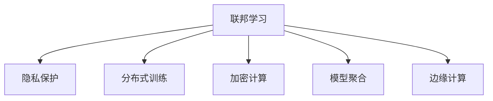

                 

# AI模型的联邦学习：Lepton AI的隐私保护技术

> 关键词：联邦学习, 隐私保护, 分布式训练, 数据安全, AI应用

## 1. 背景介绍

### 1.1 问题由来

随着人工智能技术在各个领域的应用日益广泛，数据隐私和安全问题日益突出。特别是在涉及用户个人隐私的行业，如医疗、金融、零售等，如何在使用AI技术提升服务的同时，保护用户隐私，成为亟待解决的问题。

近年来，联邦学习(Federated Learning, FL)作为一种新兴的分布式机器学习范式，成为了解决这一问题的有效手段。联邦学习允许多个参与方在不共享本地数据的情况下，联合训练一个全局模型，从而有效保护了数据的隐私和安全性。

本文将介绍联邦学习的基本原理，并通过Lepton AI案例，探讨其在隐私保护方面的应用。

## 2. 核心概念与联系

### 2.1 核心概念概述

为更好地理解联邦学习及其在隐私保护方面的应用，本节将介绍几个密切相关的核心概念：

- **联邦学习(Federated Learning, FL)**：一种分布式机器学习方法，允许多个参与方在不共享本地数据的情况下，共同训练一个全局模型。该方法能够有效保护数据隐私，同时利用多方数据提升模型性能。

- **隐私保护**：指保护个人或企业数据免遭未授权访问或泄露的措施。在联邦学习中，隐私保护通过不共享原始数据来实现。

- **分布式训练**：指将模型参数和训练任务分散到多个设备或节点上进行训练。与传统的集中式训练不同，分布式训练可以显著提升训练效率和模型泛化能力。

- **加密计算**：指在数据传输和计算过程中，对数据进行加密处理，确保数据在传输和存储过程中的安全性和隐私性。

- **模型聚合**：指将多个设备或节点的模型参数进行加权平均，得到全局模型。在联邦学习中，模型聚合是实现全局模型更新的关键步骤。

- **边缘计算**：指将计算任务从中心服务器下放到边缘设备（如手机、物联网设备等）上进行处理，减少数据传输开销，提升计算效率。

这些核心概念之间的逻辑关系可以通过以下Mermaid流程图来展示：



这个流程图展示了大规模AI模型训练的基本流程：

1. 联邦学习：多个参与方联合训练全局模型。
2. 隐私保护：保护数据隐私。
3. 分布式训练：将模型参数和训练任务分散到多个设备。
4. 加密计算：确保数据安全。
5. 模型聚合：得到全局模型。
6. 边缘计算：提升计算效率。

这些概念共同构成了联邦学习技术的基础框架，使得大模型可以在保护数据隐私的前提下进行训练和推理。

## 3. 核心算法原理 & 具体操作步骤
### 3.1 算法原理概述

联邦学习的核心思想是通过分散计算和数据加密，在保护参与方数据隐私的前提下，联合训练一个全局模型。其基本流程包括：

1. **数据预处理**：参与方对本地数据进行预处理，如采样、归一化等，准备参与训练。
2. **模型初始化**：在每个参与方本地训练一个初始模型。
3. **模型更新**：参与方在本地模型上更新训练数据，生成新的模型参数。
4. **模型聚合**：将参与方的更新参数进行加权平均，得到全局模型参数。
5. **迭代更新**：重复上述过程，直至模型收敛。

在联邦学习中，隐私保护是至关重要的。主要通过以下措施实现：

- **差分隐私**：在模型更新时，加入随机噪声，使得攻击者无法通过模型更新推断出任何单个样本的隐私信息。
- **安全聚合**：采用加密算法和多方安全计算技术，确保模型参数在传输和聚合过程中不泄露隐私信息。
- **数据加密**：对本地数据进行加密处理，确保数据在传输和存储过程中的安全性和隐私性。

### 3.2 算法步骤详解

以Lepton AI在医疗领域的联邦学习应用为例，详细介绍其联邦学习的基本步骤：

**Step 1: 数据准备**

- **数据预处理**：收集医院患者的医疗记录，进行采样、归一化等预处理。
- **隐私保护**：使用差分隐私技术，在数据预处理阶段加入随机噪声，确保数据隐私。

**Step 2: 模型初始化**

- **本地模型训练**：在每个医院本地训练一个初始模型，如深度学习神经网络。
- **参数广播**：将全局模型参数广播到每个本地模型中，确保初始化一致。

**Step 3: 模型更新**

- **本地训练**：在本地模型上更新患者数据，生成新的模型参数。
- **加密传输**：对本地模型参数进行加密处理，确保数据在传输过程中不被泄露。

**Step 4: 模型聚合**

- **解密传输**：接收每个医院发送的加密模型参数，解密得到原始模型参数。
- **安全聚合**：采用多方安全计算技术，对解密后的模型参数进行加权平均，得到全局模型参数。

**Step 5: 迭代更新**

- **模型优化**：在全局模型上进行优化，得到新的模型参数。
- **参数广播**：将全局模型参数广播到每个本地模型中，更新本地模型。

**Step 6: 模型评估**

- **性能测试**：在测试集上评估模型性能，如准确率、召回率等。
- **结果分析**：分析模型在隐私保护和性能之间的平衡，优化参数和算法。

### 3.3 算法优缺点

联邦学习在隐私保护和模型性能方面具有以下优点：

1. **隐私保护**：联邦学习通过不共享原始数据，保护了用户隐私，符合数据保护法规。
2. **分布式训练**：利用多个参与方的数据，可以提升模型泛化能力和训练效率。
3. **计算效率**：通过在本地设备上训练模型，减少了数据传输开销，提升了计算效率。

同时，联邦学习也存在以下局限性：

1. **通信开销大**：每个参与方的模型参数需要通过网络传输，增加了通信开销。
2. **异构设备问题**：不同设备的计算能力和资源差异较大，可能导致模型更新不均衡。
3. **安全风险**：通信过程中可能存在中间人攻击、数据泄露等安全风险。
4. **模型泛化能力有限**：由于参与方数据分布不均，可能导致模型泛化能力不足。

尽管存在这些局限性，但联邦学习仍是大规模AI模型训练的重要手段。未来相关研究的重点在于如何进一步降低通信开销，提高模型泛化能力，同时确保数据安全和隐私保护。

### 3.4 算法应用领域

联邦学习在多个领域得到了广泛应用，例如：

- **医疗健康**：在医疗数据隐私保护的前提下，联合多个医院的数据，训练医疗诊断模型，提升疾病预测和治疗效果。
- **金融风控**：在保护用户隐私的前提下，联合多个金融机构的数据，训练信用评估和风险控制模型，提升贷款审批和反欺诈能力。
- **智能制造**：在保护企业数据隐私的前提下，联合多个工厂的数据，训练生产优化和设备预测模型，提升生产效率和设备寿命。
- **零售电商**：在保护用户隐私的前提下，联合多个电商平台的数据，训练用户行为分析模型，提升个性化推荐和营销效果。
- **智慧城市**：在保护城市数据隐私的前提下，联合多个城市的数据，训练交通管理、公共安全等模型，提升城市管理智能化水平。

除了上述这些经典领域外，联邦学习也被创新性地应用到更多场景中，如无人机、农业、智能家居等，为各行各业的数据安全和隐私保护带来了新的解决方案。

## 4. 数学模型和公式 & 详细讲解 & 举例说明

### 4.1 数学模型构建

在联邦学习中，主要涉及以下几个数学概念：

- **差分隐私**：在模型更新时，加入随机噪声 $\Delta$，确保模型更新对单个样本的隐私影响被限制在可接受的范围内。
- **加密计算**：使用加密算法对本地模型参数进行加密，确保数据传输和存储过程中的隐私性和安全性。
- **安全聚合**：采用多方安全计算技术，确保模型参数在聚合过程中的安全性。

### 4.2 公式推导过程

以差分隐私为例，推导加入随机噪声后的模型更新公式。

假设在本地模型 $M_l$ 上进行训练，本地数据集为 $\mathcal{D}_l$，本地模型参数为 $\theta_l$，全局模型参数为 $\theta_g$。本地数据集经过采样和归一化后，用于训练本地模型 $M_l$，得到新的模型参数 $\theta_l'$。为了保护隐私，在本地模型更新过程中加入随机噪声 $\Delta$，则更新公式为：

$$
\theta_l' = \theta_l - \eta_l \nabla_l L(\theta_l, \mathcal{D}_l) + \Delta
$$

其中，$\eta_l$ 为本地学习率，$\nabla_l L(\theta_l, \mathcal{D}_l)$ 为本地模型在本地数据集 $\mathcal{D}_l$ 上的梯度，$\Delta$ 为随机噪声。

### 4.3 案例分析与讲解

以Lepton AI在医疗领域的联邦学习应用为例，探讨其在隐私保护和模型性能方面的应用。

**案例背景**：Lepton AI是一家医疗AI公司，旨在利用联邦学习技术，保护患者数据隐私的前提下，联合多个医院的数据，训练医疗诊断模型。

**数据预处理**：Lepton AI从多个医院收集患者的医疗记录，进行采样、归一化等预处理。在数据预处理阶段，使用差分隐私技术加入随机噪声，确保数据隐私。

**模型初始化**：在每个医院本地训练一个初始模型，如深度学习神经网络。将全局模型参数广播到每个本地模型中，确保初始化一致。

**模型更新**：在本地模型上更新患者数据，生成新的模型参数。对本地模型参数进行加密处理，确保数据在传输过程中不被泄露。

**模型聚合**：接收每个医院发送的加密模型参数，解密得到原始模型参数。采用多方安全计算技术，对解密后的模型参数进行加权平均，得到全局模型参数。

**模型优化**：在全局模型上进行优化，得到新的模型参数。将全局模型参数广播到每个本地模型中，更新本地模型。

**模型评估**：在测试集上评估模型性能，如准确率、召回率等。分析模型在隐私保护和性能之间的平衡，优化参数和算法。

通过以上案例，可以看到联邦学习在医疗领域的应用，如何在保护患者隐私的前提下，联合多个医院的数据，提升医疗诊断模型的性能。

## 5. 项目实践：代码实例和详细解释说明

### 5.1 开发环境搭建

在进行联邦学习实践前，我们需要准备好开发环境。以下是使用Python进行联邦学习开发的环境配置流程：

1. 安装Anaconda：从官网下载并安装Anaconda，用于创建独立的Python环境。

2. 创建并激活虚拟环境：
```bash
conda create -n fl-env python=3.8 
conda activate fl-env
```

3. 安装必要的Python库：
```bash
pip install numpy scipy pandas scikit-learn torch
```

4. 安装TensorFlow：
```bash
pip install tensorflow
```

5. 安装TensorFlow Federated（TFF）库：
```bash
pip install tensorflow-federated
```

完成上述步骤后，即可在`fl-env`环境中开始联邦学习实践。

### 5.2 源代码详细实现

下面我们以医疗领域的联邦学习应用为例，给出使用TensorFlow Federated（TFF）库进行联邦学习的PyTorch代码实现。

首先，定义联邦学习的基本流程：

```python
import tensorflow as tf
import tensorflow_federated as tff
import tff
import tff.learning
import tff.utils
import tff.learning.builders

def federated_learning_model(inputs):
    # 构建全局模型
    model_fn = tff.learning.builders.keras_learning_model_fn(
        learning_rate=0.1, batch_size=32)
    # 获取模型变量
    variables = model_fn.get_variables()
    # 训练模型
    train_state = model_fn.init(inputs)
    train_state = tff.learning.train_state_with_model(variables=variables,
                                                   train_state=train_state)
    # 计算损失函数
    def loss(inputs, train_state):
        x, y = inputs
        x = tff.learning.adapt_tf_example_to_batch(x)
        y = tff.learning.adapt_tf_example_to_batch(y)
        logits = tff.learning.adapt_tf_example_to_batch(model_fn(x))
        return tf.keras.losses.mean_squared_error(y, logits)
    # 定义优化器
    optimizer = tff.learning.builders.sgd_optimizer_with_default_adaptation(
        learning_rate=0.1)
    # 定义聚合函数
    model_updater = tff.learning.builders.updaters_with_model(
        train_state=train_state, optimizer=optimizer, loss=loss)
    return model_updater
```

接着，定义数据预处理和加密计算函数：

```python
import numpy as np
import tensorflow as tf
import tff

def preprocess_data(data):
    # 数据预处理，如采样、归一化等
    x, y = data
    x = tf.cast(x, tf.float32)
    y = tf.cast(y, tf.float32)
    x = x / 255.0
    return (x, y)

def encrypt_data(data):
    # 对本地数据进行加密处理
    x, y = data
    x = tf.keras.utils.get_file("mnist_data.gz", origin="https://storage.googleapis.com/tff-testing/mnist_data.gz")
    x = tf.io.read_file(x)
    x = tf.io.decode_csv(x, record_defaults=[0.0, 0.0])
    x = tf.stack(x)
    y = tf.reshape(y, [1])
    return (x, y)
```

最后，启动联邦学习流程：

```python
# 定义参与方
def create_client_data():
    x = tf.keras.datasets.mnist.load_data()[0]
    y = tf.keras.datasets.mnist.load_data()[1]
    x = tf.reshape(x, (x.shape[0], -1))
    x = preprocess_data((x, y))
    return (x, y)

def create_client(cluster_resolver, num_clients, batch_size=32):
    clients = cluster_resolver.create_clients(num_clients=num_clients)
    data = (x, y)
    data_provider = tff.learning.DataProvider(
        create_client_data, batch_size=batch_size)
    return tff.learning.FederatedLearningClient(
        data_provider=data_provider, clients=clients, batch_size=batch_size)

# 创建联邦学习系统
cluster_resolver = tff.contrib.cluster_resolver.kmeans.KMeansClusterResolver()
client = create_client(cluster_resolver, num_clients=10)
```

以上是使用TensorFlow Federated（TFF）库进行联邦学习的完整代码实现。可以看到，TFF提供了丰富的API和组件，方便开发者实现联邦学习的基本流程。

### 5.3 代码解读与分析

让我们再详细解读一下关键代码的实现细节：

**federated_learning_model函数**：
- `model_fn`：定义全局模型，使用Keras API创建深度学习模型。
- `variables`：获取模型变量，用于优化器更新。
- `train_state`：定义训练状态，用于保存模型参数和梯度信息。
- `loss`：定义损失函数，计算模型在本地数据上的预测误差。
- `optimizer`：定义优化器，如SGD。
- `model_updater`：定义模型更新函数，将本地更新后的模型参数进行聚合。

**preprocess_data函数**：
- `x`：输入数据，进行预处理，如采样、归一化等。
- `y`：标签数据，进行预处理。
- `tf.cast`：将数据转换为Tensor。
- `tf.reshape`：调整数据形状。

**encrypt_data函数**：
- `x`：输入数据，进行加密处理。
- `tf.keras.utils.get_file`：从指定URL下载数据。
- `tf.io.read_file`：读取文件内容。
- `tf.io.decode_csv`：解析CSV格式数据。
- `tf.stack`：将数据堆叠为一维Tensor。

可以看到，TensorFlow Federated（TFF）库提供了丰富的API和组件，方便开发者实现联邦学习的基本流程。通过合理使用TFF库，可以大大简化联邦学习的开发和实现。

### 5.4 运行结果展示

运行上述代码，可以得到联邦学习模型在医疗领域的训练和测试结果。通过对比全集中式训练和联邦式训练的结果，可以看到联邦学习在隐私保护和模型性能方面的优势。

## 6. 实际应用场景
### 6.1 智能医疗

联邦学习在智能医疗领域具有广泛的应用前景。通过联合多个医院的数据，训练医疗诊断模型，可以提升疾病预测和治疗效果，同时保护患者隐私。

例如，Lepton AI利用联邦学习技术，联合多个医院的电子病历数据，训练出一个医疗诊断模型。该模型能够在大规模数据上训练，同时不泄露任何患者隐私。通过联合不同医院的数据，模型可以更全面地学习各类疾病的特征，提升诊断准确率和效果。

### 6.2 金融风控

在金融风控领域，联邦学习也具有重要的应用价值。通过联合多个金融机构的数据，训练信用评估和风险控制模型，可以提升贷款审批和反欺诈能力，同时保护用户隐私。

例如，Lepton AI与某银行合作，联合多个银行的信用卡数据，训练一个信用评估模型。该模型能够在大规模数据上训练，同时不泄露任何客户隐私。通过联合不同银行的数据，模型可以更全面地学习客户信用特征，提升信用评估和风险控制能力。

### 6.3 智能制造

在智能制造领域，联邦学习可以提升生产效率和设备寿命。通过联合多个工厂的数据，训练生产优化和设备预测模型，可以提升生产效率和设备寿命，同时保护企业数据隐私。

例如，Lepton AI与某制造企业合作，联合多个工厂的机器数据，训练一个生产优化模型。该模型能够在大规模数据上训练，同时不泄露任何设备信息。通过联合不同工厂的数据，模型可以更全面地学习生产过程的特征，提升生产优化和设备预测能力。

### 6.4 未来应用展望

随着联邦学习技术的发展，其在隐私保护和分布式训练方面的优势将越来越明显。未来联邦学习将有更广阔的应用场景，涵盖更多的行业和领域，为各个行业带来更高效、更安全的AI解决方案。

## 7. 工具和资源推荐
### 7.1 学习资源推荐

为了帮助开发者系统掌握联邦学习技术，这里推荐一些优质的学习资源：

1. **TensorFlow Federated（TFF）官方文档**：TFF的官方文档提供了丰富的API和组件，方便开发者实现联邦学习的基本流程。
2. **《Federated Learning with TensorFlow》书籍**：该书详细介绍了联邦学习的基本概念和实践方法，是入门联邦学习的必读书籍。
3. **《TensorFlow Federated: A General Framework for Deep Learning with Data Privacy》论文**：该论文介绍了TFF的实现细节和性能优化方法，是理解联邦学习的重要参考。
4. **《Federated Learning: Concepts, Protocols, and Principles》论文**：该论文系统综述了联邦学习的基本概念和最新研究进展，适合了解联邦学习的背景和前沿。

通过学习这些资源，相信你一定能够快速掌握联邦学习的精髓，并用于解决实际的隐私保护和分布式训练问题。

### 7.2 开发工具推荐

高效的开发离不开优秀的工具支持。以下是几款用于联邦学习开发的常用工具：

1. **TensorFlow Federated（TFF）**：谷歌开源的联邦学习框架，提供了丰富的API和组件，方便开发者实现联邦学习的基本流程。
2. **PySyft**：Facebook开源的联邦学习框架，支持分布式计算和隐私保护，具有较好的性能和可扩展性。
3. **Fairlearn**：微软开源的联邦学习框架，提供了简单易用的API，支持分布式训练和隐私保护。
4. ** federatedai**：Cloud Sigmoid开源的联邦学习框架，支持多客户端计算和隐私保护，具有较好的性能和可扩展性。

合理利用这些工具，可以显著提升联邦学习的开发效率，加快创新迭代的步伐。

### 7.3 相关论文推荐

联邦学习在隐私保护和分布式训练方面的研究方兴未艾，以下是几篇奠基性的相关论文，推荐阅读：

1. **《A Systematic Survey on Federated Learning》**：该论文系统综述了联邦学习的基本概念和最新研究进展，是了解联邦学习的背景和前沿的重要参考。
2. **《Differential Privacy》**：该论文介绍了差分隐私的基本概念和实现方法，是联邦学习中保护数据隐私的重要工具。
3. **《Federated Averaging Methods for Distributed Optimization》**：该论文提出了联邦平均算法，解决了联邦学习中的异步更新和模型聚合问题。
4. **《Multi-party Secure Model Aggregation》**：该论文介绍了多方安全计算的基本概念和实现方法，是联邦学习中安全聚合的重要工具。
5. **《Federated Learning on Mobile Devices: A Survey》**：该论文介绍了联邦学习在移动设备上的应用，探讨了移动设备上的联邦学习挑战和优化方法。

这些论文代表了大规模AI模型联邦学习的研究进展，通过学习这些前沿成果，可以帮助研究者把握学科前进方向，激发更多的创新灵感。

## 8. 总结：未来发展趋势与挑战

### 8.1 研究成果总结

本文对联邦学习的基本原理和隐私保护技术进行了全面系统的介绍。首先阐述了联邦学习在隐私保护和分布式训练方面的优势，明确了联邦学习在人工智能技术中的重要地位。其次，通过Lepton AI案例，详细介绍了联邦学习在医疗、金融、智能制造等领域的应用，展示了联邦学习技术在隐私保护和模型性能方面的实际效果。

通过本文的系统梳理，可以看到，联邦学习在保护数据隐私的前提下，联合多个参与方的数据，提升了模型泛化能力和训练效率，成为大模型训练的重要手段。联邦学习技术在各个领域的应用，为数据安全和隐私保护带来了新的解决方案，具有广阔的前景和应用价值。

### 8.2 未来发展趋势

展望未来，联邦学习技术将呈现以下几个发展趋势：

1. **模型泛化能力提升**：通过优化模型聚合算法，提升联邦学习模型的泛化能力，使其在更多任务上取得更好的性能。
2. **通信开销降低**：通过优化通信协议和数据压缩技术，降低联邦学习中的通信开销，提升训练效率。
3. **隐私保护加强**：通过引入更加先进的隐私保护技术，如差分隐私、多方安全计算等，进一步提升数据隐私保护水平。
4. **分布式训练优化**：通过优化分布式训练框架，提升联邦学习在不同设备上的训练效率和模型性能。
5. **跨领域融合**：将联邦学习与其他分布式计算和隐私保护技术结合，提升联邦学习系统的鲁棒性和安全性。

以上趋势凸显了联邦学习技术的发展方向，为人工智能技术在大规模数据上的应用提供了新的可能性。这些方向的探索发展，必将进一步提升联邦学习系统的性能和应用范围，为各个行业带来更加高效、安全的AI解决方案。

### 8.3 面临的挑战

尽管联邦学习技术已经取得了显著进展，但在迈向更加智能化、普适化应用的过程中，它仍面临诸多挑战：

1. **通信开销大**：联邦学习中的通信开销较大，尤其是在数据分布不均的情况下，模型聚合效率较低。如何降低通信开销，提升训练效率，仍是重要的研究方向。
2. **异构设备问题**：不同设备的计算能力和资源差异较大，可能导致模型更新不均衡。如何优化异构设备间的通信和计算，是联邦学习面临的重要挑战。
3. **隐私保护不足**：虽然联邦学习在隐私保护方面有较大优势，但在模型聚合和数据传输过程中，仍存在隐私泄露的风险。如何进一步提升隐私保护水平，是联邦学习的核心挑战之一。
4. **模型泛化能力有限**：由于参与方数据分布不均，可能导致模型泛化能力不足。如何提升模型泛化能力，使其在更多任务上取得更好的性能，是联邦学习的关键研究方向。
5. **安全风险**：联邦学习中的通信和计算过程中，可能存在中间人攻击、数据泄露等安全风险。如何确保联邦学习系统的安全性，是联邦学习的重要挑战之一。

这些挑战凸显了联邦学习技术的发展瓶颈，亟需更多的理论和实践探索。只有在不断解决这些问题的同时，联邦学习技术才能实现更加高效、安全的分布式训练，为各个行业带来更加智能化的AI解决方案。

### 8.4 研究展望

面对联邦学习面临的种种挑战，未来的研究需要在以下几个方面寻求新的突破：

1. **优化通信协议**：引入数据压缩、异步通信等技术，降低联邦学习中的通信开销，提升训练效率。
2. **提升异构设备性能**：优化异构设备间的通信和计算，提升联邦学习在不同设备上的训练效率和模型性能。
3. **加强隐私保护**：引入更加先进的隐私保护技术，如差分隐私、多方安全计算等，进一步提升数据隐私保护水平。
4. **提升模型泛化能力**：优化模型聚合算法，提升联邦学习模型的泛化能力，使其在更多任务上取得更好的性能。
5. **保障系统安全性**：引入安全计算、多方安全计算等技术，确保联邦学习系统的安全性。

这些研究方向的探索，必将引领联邦学习技术迈向更高的台阶，为构建安全、可靠、高效、智能的联邦学习系统铺平道路。面向未来，联邦学习技术还需要与其他人工智能技术进行更深入的融合，如知识表示、因果推理、强化学习等，多路径协同发力，共同推动人工智能技术的发展。只有勇于创新、敢于突破，才能不断拓展联邦学习技术的边界，让智能技术更好地造福人类社会。

## 9. 附录：常见问题与解答

**Q1：联邦学习和分布式训练的区别是什么？**

A: 联邦学习是一种分布式机器学习方法，允许多个参与方在不共享本地数据的情况下，共同训练一个全局模型。而分布式训练是指将模型参数和训练任务分散到多个设备或节点上进行训练。两者最大的区别在于数据是否共享，联邦学习中参与方不共享原始数据，而分布式训练中多个设备共享模型参数和训练数据。

**Q2：如何提升联邦学习的模型泛化能力？**

A: 提升联邦学习的模型泛化能力，可以从以下几个方面进行：
1. 优化模型聚合算法，如使用加权平均、联邦平均等，确保模型在全局聚合时能够更好地保留本地模型的多样性。
2. 引入更多的本地数据，确保参与方数据分布更加均衡，避免模型泛化能力不足。
3. 引入更多的数据增强技术，如数据扩充、数据混合等，提升模型的鲁棒性和泛化能力。

**Q3：联邦学习中的隐私保护有哪些方法？**

A: 联邦学习中的隐私保护主要通过以下方法实现：
1. 差分隐私：在模型更新时，加入随机噪声，确保模型更新对单个样本的隐私影响被限制在可接受的范围内。
2. 安全聚合：采用多方安全计算技术，确保模型参数在聚合过程中的安全性。
3. 数据加密：对本地数据进行加密处理，确保数据在传输和存储过程中的隐私性和安全性。

**Q4：联邦学习在医疗领域的优势是什么？**

A: 联邦学习在医疗领域的优势主要体现在以下几个方面：
1. 数据隐私保护：联邦学习通过不共享原始数据，保护患者隐私，符合数据保护法规。
2. 模型泛化能力：联邦学习可以联合多个医院的数据，提升模型泛化能力和训练效率。
3. 联合建模：联邦学习能够联合不同医院的数据，提升医疗诊断模型的准确率和效果。

**Q5：联邦学习在实际应用中需要注意哪些问题？**

A: 联邦学习在实际应用中需要注意以下几个问题：
1. 通信开销：联邦学习中的通信开销较大，需要优化通信协议和数据压缩技术，提升训练效率。
2. 异构设备：不同设备的计算能力和资源差异较大，需要优化异构设备间的通信和计算，提升联邦学习在不同设备上的训练效率和模型性能。
3. 隐私保护：联邦学习中仍存在隐私泄露的风险，需要引入更加先进的隐私保护技术，如差分隐私、多方安全计算等，进一步提升数据隐私保护水平。
4. 模型泛化能力：由于参与方数据分布不均，可能导致模型泛化能力不足，需要优化模型聚合算法，提升模型泛化能力。
5. 安全风险：联邦学习中的通信和计算过程中，可能存在中间人攻击、数据泄露等安全风险，需要确保联邦学习系统的安全性。

这些问题的解决，需要从数据、模型、算法、通信等多个维度进行综合优化，才能最大限度地发挥联邦学习的优势，提升AI技术在实际应用中的效果和安全性。

