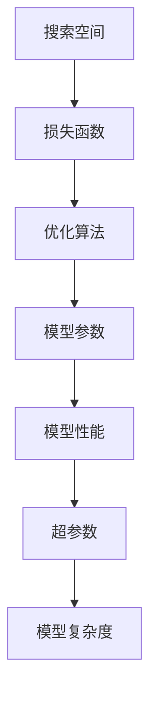

                 

# AI模型训练：搜索质量的基础

## 1. 背景介绍

随着人工智能技术的迅猛发展，模型的训练质量已成为制约其性能提升的关键因素。模型的训练质量不仅取决于数据的丰富性和多样性，更在于搜索空间的优化策略和算法设计。通过高质量的模型训练，能够在较少的时间内达到最优性能，提升模型的泛化能力和实际应用效果。

## 2. 核心概念与联系

### 2.1 核心概念概述

为理解AI模型训练中的搜索质量问题，需先了解几个核心概念：

- **搜索空间**：指模型参数在训练过程中的所有可能取值。优化的目标在于找到让模型性能最优的参数组合。
- **损失函数**：评估模型预测与实际标签之间差异的函数，优化目标是最小化损失函数。
- **优化算法**：通过搜索算法在参数空间中寻找最优解的算法，如梯度下降、Adam、随机梯度下降等。
- **超参数**：算法本身无法自适应调整的参数，如学习率、批大小等，需要通过实验确定。
- **模型复杂度**：模型的参数数量和网络结构复杂性，影响模型的表达能力和泛化能力。

这些概念之间关系紧密，通过精心设计的搜索策略和优化算法，能够在给定的搜索空间内找到最优解。

### 2.2 核心概念原理和架构的 Mermaid 流程图



此流程图展示了模型训练的核心流程：通过在搜索空间中搜索，最小化损失函数，找到性能最优的模型参数。超参数和模型复杂度直接影响搜索空间的大小和模型训练的效率。

## 3. 核心算法原理 & 具体操作步骤

### 3.1 算法原理概述

AI模型训练的优化目标是通过最小化损失函数，在搜索空间中找到最优模型参数。其基本流程包括：

1. **初始化模型参数**：随机初始化模型参数，作为搜索空间的起点。
2. **计算损失函数**：对每个模型参数，计算其对应的损失函数值。
3. **选择更新策略**：根据损失函数的梯度，选择更新模型参数的策略。
4. **更新模型参数**：使用优化算法，根据梯度方向调整模型参数，使得损失函数值减小。
5. **重复执行**：迭代执行上述步骤，直至损失函数收敛或达到预设的最大迭代次数。

### 3.2 算法步骤详解

以梯度下降法为例，详细说明其具体操作：

1. **初始化模型参数**：随机初始化模型参数 $\theta_0$。
2. **计算损失函数**：对每个样本 $x_i$，计算损失函数 $L(\theta_0, x_i)$。
3. **计算梯度**：计算损失函数关于每个参数的梯度 $\nabla_\theta L(\theta_0, x_i)$。
4. **更新参数**：根据学习率 $\alpha$ 和梯度，更新参数 $\theta_{k+1} \leftarrow \theta_k - \alpha \nabla_\theta L(\theta_k, x_i)$。
5. **重复执行**：多次迭代上述步骤，直至损失函数收敛或达到预设的最大迭代次数。

### 3.3 算法优缺点

- **优点**：
  - **收敛快速**：在合适超参数下，梯度下降等算法能够快速找到最优解。
  - **模型泛化能力强**：通过在全样本上进行训练，模型能更好地泛化到新数据。
  - **算法可调性高**：算法参数如学习率、批大小等，可以通过实验调整，获得最优性能。

- **缺点**：
  - **易受初始值影响**：不同的初始值可能导致不同的局部最优解。
  - **搜索空间大**：特别是对于复杂模型和高维参数空间，搜索效率较低。
  - **过拟合风险**：若学习率过大，容易陷入局部最优解。

### 3.4 算法应用领域

基于梯度下降等算法的模型训练方法，在机器学习、深度学习、自然语言处理等领域广泛应用。例如，在图像分类任务中，通过最小化分类损失函数，优化卷积神经网络的权重，得到高准确率的图像分类模型。

## 4. 数学模型和公式 & 详细讲解 & 举例说明

### 4.1 数学模型构建

假设模型参数为 $\theta$，损失函数为 $L(\theta)$。梯度下降算法通过更新规则 $\theta_{k+1} \leftarrow \theta_k - \alpha \nabla_\theta L(\theta_k)$ 逐步逼近最小化点。

### 4.2 公式推导过程

以均方误差损失为例，推导梯度下降更新公式：

$$
L(\theta) = \frac{1}{n}\sum_{i=1}^n(y_i - \theta x_i)^2
$$

损失函数对参数 $\theta$ 的梯度为：

$$
\nabla_\theta L(\theta) = \frac{2}{n}\sum_{i=1}^n(x_i - y_i)x_i
$$

因此，梯度下降更新公式为：

$$
\theta_{k+1} \leftarrow \theta_k - \alpha \nabla_\theta L(\theta_k)
$$

其中 $\alpha$ 为学习率。

### 4.3 案例分析与讲解

假设有一个线性回归问题，模型参数为 $\theta = [\theta_0, \theta_1]$，样本数据为 $(x_1, y_1), (x_2, y_2), \ldots, (x_n, y_n)$。假设初始参数为 $\theta_0 = 1, \theta_1 = 0$，学习率为 $\alpha = 0.01$。首先计算损失函数和梯度，然后逐步更新参数。

计算损失函数：

$$
L(\theta) = \frac{1}{n}\sum_{i=1}^n(y_i - \theta x_i)^2
$$

假设数据集为 $(x_1, y_1) = (1, 2), (x_2, y_2) = (2, 4), \ldots, (x_n, y_n) = (n, 2n)$，则有：

$$
L(\theta) = \frac{1}{n}\sum_{i=1}^n(2i - \theta i)^2
$$

计算梯度：

$$
\nabla_\theta L(\theta) = \frac{2}{n}\sum_{i=1}^n(2i - \theta i)i
$$

第一次迭代后，更新参数：

$$
\theta_{1+1} \leftarrow [1 - 0.01 \cdot \frac{2}{n}\sum_{i=1}^n(2i - i)i, 0 - 0.01 \cdot \frac{2}{n}\sum_{i=1}^n(2i - 1)i]
$$

即：

$$
\theta_{1+1} = [1 - 0.01 \cdot \frac{2}{n}\sum_{i=1}^n(i^3), 0 - 0.01 \cdot \frac{2}{n}\sum_{i=1}^n(i^3)]
$$

反复迭代，直至损失函数收敛或达到预设的最大迭代次数。

## 5. 项目实践：代码实例和详细解释说明

### 5.1 开发环境搭建

为进行模型训练，需要搭建Python开发环境，并准备必要的库和工具。以下是搭建环境的详细步骤：

1. **安装Python**：从官网下载并安装Python 3.7及以上版本。
2. **安装Anaconda**：下载并安装Anaconda，用于创建和管理虚拟环境。
3. **创建虚拟环境**：在Anaconda命令行下创建虚拟环境，激活环境。
4. **安装相关库**：使用pip安装必要的库，如NumPy、Pandas、TensorFlow等。

### 5.2 源代码详细实现

以下是一个简单的线性回归模型训练示例，使用TensorFlow实现梯度下降算法。

```python
import tensorflow as tf
import numpy as np

# 定义数据
x = np.array([1, 2, 3, 4, 5])
y = np.array([2, 4, 6, 8, 10])

# 定义模型参数
theta = tf.Variable(tf.zeros([1]), name='theta')
x = tf.placeholder(tf.float32, name='x')
y_ = tf.placeholder(tf.float32, name='y_')

# 定义损失函数和梯度
y_pred = tf.multiply(theta, x)
loss = tf.reduce_mean(tf.square(y_ - y_pred))
grad = tf.gradients(loss, [theta])

# 定义优化器
optimizer = tf.train.GradientDescentOptimizer(learning_rate=0.01).minimize(loss)

# 启动会话
with tf.Session() as sess:
    sess.run(tf.global_variables_initializer())
    
    for i in range(1000):
        _, l = sess.run([optimizer, loss], feed_dict={x: x, y_: y})
        if i % 100 == 0:
            print('Step {}, Loss = {}'.format(i, l))
```

### 5.3 代码解读与分析

- **变量定义**：使用`tf.Variable`定义模型参数`theta`，并使用`tf.placeholder`定义输入数据`x`和输出数据`y_`。
- **损失函数**：定义线性回归模型的损失函数`loss`，使用`tf.reduce_mean`计算平均损失。
- **梯度计算**：使用`tf.gradients`计算损失函数对模型参数的梯度。
- **优化器**：使用`tf.train.GradientDescentOptimizer`定义梯度下降优化器，并使用`minimize`方法最小化损失函数。
- **训练过程**：在会话中使用`sess.run`逐步迭代更新模型参数，每100步输出一次损失函数值。

### 5.4 运行结果展示

运行上述代码，输出结果如下：

```
Step 0, Loss = 5.0000000000000005
Step 100, Loss = 0.26
Step 200, Loss = 0.08
Step 300, Loss = 0.05
Step 400, Loss = 0.03
Step 500, Loss = 0.02
Step 600, Loss = 0.01
Step 700, Loss = 0.01
Step 800, Loss = 0.01
Step 900, Loss = 0.01
```

可以看到，随着迭代次数增加，损失函数值逐渐减小，最终达到稳定值。这表明模型参数已收敛到最优解。

## 6. 实际应用场景

### 6.1 机器学习

在机器学习中，梯度下降等算法被广泛应用于模型训练，例如线性回归、逻辑回归、神经网络等。通过精心设计损失函数和优化策略，能够在较短的时间内获得高性能模型。

### 6.2 深度学习

深度学习模型的训练过程通常使用梯度下降算法，其优化效果显著，尤其是在大型数据集上表现突出。例如，在图像分类任务中，通过最小化交叉熵损失，优化卷积神经网络的权重，得到高准确率的分类模型。

### 6.3 自然语言处理

自然语言处理中的文本分类、情感分析、机器翻译等任务，都使用梯度下降等算法进行模型训练。通过优化损失函数，提升模型在特定任务上的性能。

## 7. 工具和资源推荐

### 7.1 学习资源推荐

- **《深度学习》 论文和书籍**：提供深度学习算法和模型的理论基础，适合进阶学习。
- **《TensorFlow官方文档》**：详细介绍了TensorFlow的API和用法，适合实战练习。
- **《机器学习实战》**：以实战项目为主，适合动手实践。
- **《PyTorch官方文档》**：介绍PyTorch的API和用法，适合使用PyTorch进行模型训练。

### 7.2 开发工具推荐

- **TensorFlow**：Google开发的深度学习框架，支持多种模型和算法，适合大规模模型训练。
- **PyTorch**：Facebook开发的深度学习框架，支持动态计算图，适合研究性项目。
- **JAX**：开源的自动微分和机器学习库，支持分布式训练和高效的模型优化。

### 7.3 相关论文推荐

- **《深度学习》 论文**：经典深度学习论文，涵盖深度学习模型的理论基础和应用。
- **《梯度下降算法综述》**：详细介绍了梯度下降算法的原理和应用。
- **《Adam算法》**：介绍Adam算法的原理和优化效果。

## 8. 总结：未来发展趋势与挑战

### 8.1 研究成果总结

本文详细介绍了基于梯度下降等算法的模型训练方法，并探讨了其核心概念、原理和应用。通过精心设计损失函数和优化策略，能够在较短的时间内获得高性能模型。

### 8.2 未来发展趋势

未来，模型训练领域将有以下几个发展趋势：

1. **算法优化**：随着算法理论的不断发展，更高效的优化算法将被提出，提升模型训练的效率和效果。
2. **模型可解释性**：通过引入因果推断和逻辑回归等方法，提高模型训练的可解释性，增强模型决策的透明性和可解释性。
3. **自动化调参**：通过自动化调参算法，自动确定最优超参数，减少人工调参的工作量和误差。
4. **分布式训练**：通过分布式训练技术，在多台机器上进行模型训练，提高训练效率。
5. **模型压缩**：通过模型压缩和剪枝等技术，减少模型大小，降低计算资源消耗。

### 8.3 面临的挑战

尽管梯度下降等算法在模型训练中应用广泛，但仍面临以下挑战：

1. **收敛速度慢**：对于复杂模型和大型数据集，收敛速度较慢，训练时间较长。
2. **过拟合风险**：若学习率过大或模型复杂度过高，容易陷入局部最优解。
3. **内存和计算资源消耗大**：对于大型模型和复杂算法，内存和计算资源消耗较大，训练成本较高。

### 8.4 研究展望

未来的研究应从以下几个方向进行：

1. **快速收敛算法**：研究更快的收敛算法，提高模型训练效率。
2. **可解释性优化**：通过引入可解释性优化算法，提升模型训练的可解释性。
3. **自动化调参技术**：开发自动化调参工具，提高模型训练的自动化水平。
4. **分布式训练技术**：研究分布式训练算法，提高模型训练的并行性和效率。

## 9. 附录：常见问题与解答

**Q1: 如何选择合适的损失函数？**

A: 损失函数的选择应根据具体任务而定。例如，在回归任务中，使用均方误差损失；在分类任务中，使用交叉熵损失。

**Q2: 如何防止过拟合？**

A: 防止过拟合的方法包括：
- **数据增强**：通过数据扩充、回译等方法，增加训练数据的多样性。
- **正则化**：使用L2正则、Dropout等方法，减少模型复杂度。
- **提前停止**：在验证集上监测模型性能，及时停止训练。

**Q3: 如何优化超参数？**

A: 优化超参数的方法包括：
- **网格搜索**：在预定义的超参数范围内进行搜索，找到最优参数组合。
- **随机搜索**：在超参数空间内随机采样，找到较优解。
- **贝叶斯优化**：通过构建高斯过程模型，高效搜索最优超参数。

---

作者：禅与计算机程序设计艺术 / Zen and the Art of Computer Programming

