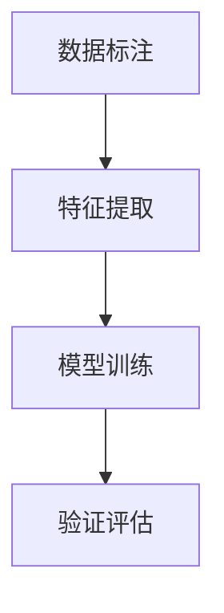

                 

# AI生成内容的真实性验证

## 1. 背景介绍

随着人工智能技术的迅猛发展，AI生成内容（AI Generated Content, AGC）的应用越来越广泛，涵盖了新闻、文章、图片、视频等多个领域。AI生成内容的真实性验证（Verification of AI Generated Content, AGC Verification）成为了一个日益重要且具有挑战性的问题。在假新闻、虚假信息泛滥的时代，如何区分AI生成的内容与真实内容，确保信息源的可靠性，是保障社会稳定、维护公共利益的关键。

### 1.1 问题由来

AI生成内容的真实性验证，旨在通过技术手段识别和判定某内容是由AI生成还是由人类创作。近年来，随着GAN、Transformers等技术的发展，AI生成内容的能力越来越强，甚至在一些特定领域（如新闻、艺术创作）已经接近甚至超越人类的水平。但这种能力带来的负面效应也愈加明显，如假新闻、虚假广告等。因此，对AI生成内容的真实性进行甄别，成为了一个亟需解决的重要课题。

### 1.2 问题核心关键点

AI生成内容的真实性验证问题，其核心在于如何构建一种有效、公平、高效的验证机制。具体而言，主要包括以下几个关键点：

1. **数据采集**：获取大量标注好的真伪样本，为模型训练提供数据基础。
2. **模型构建**：设计或选择合适的AI模型，用于提取和分析特征，判断内容真伪。
3. **特征设计**：选取有效的特征向量，对内容进行量化描述，作为模型的输入。
4. **验证方法**：设计合理的验证方法，如分类、回归等，对内容进行真伪判断。
5. **评价标准**：定义明确的评价标准，如准确率、召回率、F1值等，评估模型性能。

## 2. 核心概念与联系

### 2.1 核心概念概述

要深入理解AI生成内容真实性验证问题，首先需要明确几个核心概念：

- **AI生成内容（AGC）**：通过AI技术自动生成的文本、图像、音频等内容的总称。
- **真实性验证（AGC Verification）**：使用技术手段判断某内容是否为AI生成。
- **假新闻（Fake News）**：刻意伪造、篡改的新闻报道，意图误导公众。
- **数据标注（Data Annotation）**：为大量样本打上真伪标签，供模型训练使用。
- **特征提取（Feature Extraction）**：从内容中提取有效特征，用于模型输入。
- **模型训练（Model Training）**：在标注数据上训练模型，使其能够区分真伪内容。
- **验证评估（Evaluation）**：使用测试集评估模型性能，确保模型准确性。

这些概念之间存在紧密的联系：数据标注为模型训练提供数据，特征提取用于模型输入，模型训练实现真伪判断，而验证评估确保模型有效性。

### 2.2 核心概念原理和架构的 Mermaid 流程图

以下是AI生成内容真实性验证的核心概念及其原理和架构的Mermaid流程图：



**解释说明**：
- 数据标注（A）：从真实来源收集大量标注好的真伪样本，为模型训练提供数据。
- 特征提取（B）：使用特征提取技术，将内容转换为模型可以处理的特征向量。
- 模型训练（C）：在标注数据上训练AI模型，使其能够对内容进行真伪判断。
- 验证评估（D）：在测试集上评估模型性能，确保模型准确性和鲁棒性。

## 3. 核心算法原理 & 具体操作步骤

### 3.1 算法原理概述

AI生成内容真实性验证的算法原理，基于分类器的思想，通过训练一个区分真伪的二分类模型，实现对内容的真伪判断。算法分为以下几个步骤：

1. **数据准备**：收集并标注大量真伪样本，将数据集划分为训练集和测试集。
2. **特征提取**：使用特征提取技术，将内容转换为模型可以处理的特征向量。
3. **模型训练**：在训练集上训练分类模型，如SVM、Random Forest、神经网络等，使其能够区分真伪内容。
4. **模型评估**：在测试集上评估模型性能，计算准确率、召回率、F1值等指标。
5. **模型应用**：将模型应用于新内容，判断其真伪。

### 3.2 算法步骤详解

#### 3.2.1 数据准备

数据准备是AI生成内容真实性验证的第一步。具体步骤如下：

1. **数据采集**：从新闻、社交媒体、科技论坛等平台，采集大量文本、图像、视频等数据。
2. **数据标注**：由专家或自动标注工具为数据打上真伪标签，标注标签应尽可能准确。
3. **数据划分**：将数据集划分为训练集、验证集和测试集，一般比例为6:2:2。

#### 3.2.2 特征提取

特征提取是模型输入的重要环节。具体步骤如下：

1. **文本特征**：使用NLP技术提取文本内容中的关键词、词频、句法结构等特征。
2. **图像特征**：使用图像识别技术提取图像中的颜色、形状、纹理等特征。
3. **视频特征**：使用视频分析技术提取视频中的关键帧、动作、声音等特征。
4. **数据预处理**：对特征进行标准化、归一化、降维等处理，提高模型训练效率。

#### 3.2.3 模型训练

模型训练是AI生成内容真实性验证的核心步骤。具体步骤如下：

1. **模型选择**：选择合适的分类模型，如支持向量机（SVM）、随机森林（Random Forest）、神经网络等。
2. **参数设置**：根据数据集规模和特征维度，选择合适的模型参数。
3. **模型训练**：在训练集上训练模型，使用交叉验证等技术避免过拟合。
4. **模型优化**：通过调整超参数、正则化等手段，提高模型性能。

#### 3.2.4 模型评估

模型评估是验证模型性能的关键步骤。具体步骤如下：

1. **指标选择**：根据任务需求，选择合适的评价指标，如准确率、召回率、F1值等。
2. **测试集测试**：在测试集上测试模型，计算模型指标。
3. **结果分析**：分析模型结果，查找错误原因，调整模型参数。

#### 3.2.5 模型应用

模型应用是将训练好的模型应用于新内容，具体步骤如下：

1. **内容输入**：将待验证内容输入模型。
2. **特征提取**：对输入内容进行特征提取，转化为模型可以处理的特征向量。
3. **模型推理**：使用训练好的模型进行推理，判断内容真伪。
4. **结果输出**：输出模型判断结果，标记为真或伪。

### 3.3 算法优缺点

AI生成内容真实性验证的算法具有以下优点：

1. **高效性**：在大量标注数据上训练模型，能够快速识别真伪内容。
2. **泛化性强**：使用机器学习模型，可以处理不同类型和来源的内容。
3. **可解释性**：模型结果可以通过特征分析和权重分析等手段，解释判断依据。
4. **可扩展性**：可以扩展到多种模态的数据类型，如文本、图像、视频等。

同时，算法也存在以下缺点：

1. **数据依赖**：模型性能依赖于标注数据的质量和数量，标注成本较高。
2. **模型复杂**：训练复杂模型需要大量计算资源和时间，需要高性能计算设备。
3. **误判风险**：模型可能存在误判风险，特别是在假新闻伪装性强的场景下。
4. **对抗攻击**：假新闻作者可能通过对抗攻击手段，规避模型的检测。

### 3.4 算法应用领域

AI生成内容真实性验证的应用领域非常广泛，包括但不限于以下几个方面：

1. **新闻媒体**：对新闻报道进行真实性验证，防止假新闻传播。
2. **社交网络**：检测和过滤社交媒体上的假消息，保护用户信息安全。
3. **在线教育**：验证学生作业和考试答案的真实性，防止作弊。
4. **金融市场**：识别虚假金融信息，保护投资者利益。
5. **司法系统**：对证据和判决书进行真伪验证，保障司法公正。

## 4. 数学模型和公式 & 详细讲解 & 举例说明

### 4.1 数学模型构建

在AI生成内容真实性验证中，我们通常使用二分类模型进行真伪判断。模型的输入为特征向量 $x$，输出为真实标签 $y \in \{0, 1\}$。模型 $f$ 通过特征映射 $\phi$ 将特征向量 $x$ 映射到高维空间，并使用分类器 $h$ 进行真伪判定。模型的目标是最小化损失函数 $L$：

$$
L(f) = \mathbb{E}_{(x, y) \sim D} [\ell(f(x), y)]
$$

其中 $\ell$ 为损失函数，通常使用交叉熵损失：

$$
\ell(f(x), y) = -y \log f(x) - (1-y) \log (1-f(x))
$$

模型 $f$ 一般使用神经网络或支持向量机等方法实现。

### 4.2 公式推导过程

在二分类问题中，模型 $f(x)$ 的输出为 $f(x) = \sigma(Wx + b)$，其中 $\sigma$ 为激活函数，$W$ 和 $b$ 为模型参数。假设训练集为 $(x_1, y_1), (x_2, y_2), \ldots, (x_n, y_n)$，模型参数优化目标为：

$$
\arg\min_{W, b} \frac{1}{n} \sum_{i=1}^n \ell(f(x_i), y_i)
$$

使用梯度下降法优化模型参数，每次迭代更新参数 $\Delta W$ 和 $\Delta b$：

$$
\Delta W = -\eta \frac{\partial L}{\partial W}
$$
$$
\Delta b = -\eta \frac{\partial L}{\partial b}
$$

其中 $\eta$ 为学习率，$\partial L/\partial W$ 和 $\partial L/\partial b$ 分别为损失函数对 $W$ 和 $b$ 的偏导数。

### 4.3 案例分析与讲解

以一个简单的线性分类器为例，假设训练集为 $(x_1, y_1), (x_2, y_2), \ldots, (x_n, y_n)$，模型参数为 $W$ 和 $b$。使用梯度下降法优化模型参数，每次迭代更新参数 $\Delta W$ 和 $\Delta b$：

1. **计算梯度**：
   $$
   \Delta W = -\eta \frac{1}{n} \sum_{i=1}^n (y_i - f(x_i)) x_i
   $$
   $$
   \Delta b = -\eta \frac{1}{n} \sum_{i=1}^n (y_i - f(x_i))
   $$

2. **更新参数**：
   $$
   W \leftarrow W + \Delta W
   $$
   $$
   b \leftarrow b + \Delta b
   $$

通过多次迭代更新，模型参数收敛到最优解，实现对真伪内容的有效判断。

## 5. 项目实践：代码实例和详细解释说明

### 5.1 开发环境搭建

要实现AI生成内容真实性验证，我们需要准备Python环境，安装相关的库和工具。以下是搭建开发环境的步骤：

1. **安装Python**：从官网下载并安装Python，选择合适的版本。
2. **安装相关库**：安装NumPy、Pandas、Scikit-learn、TensorFlow等常用库，使用pip命令进行安装。
3. **搭建环境**：创建虚拟环境，安装必要的依赖包。

以下是一个简单的代码示例，演示如何搭建Python环境：

```bash
python -m venv env
source env/bin/activate
pip install numpy pandas scikit-learn tensorflow
```

### 5.2 源代码详细实现

以下是一个基于SVM的AI生成内容真实性验证的Python代码示例：

```python
import numpy as np
from sklearn import svm
from sklearn.model_selection import train_test_split
from sklearn.metrics import classification_report

# 加载数据
X_train, X_test, y_train, y_test = train_test_split(X, y, test_size=0.2, random_state=42)

# 训练模型
model = svm.SVC(kernel='linear', C=1.0)
model.fit(X_train, y_train)

# 测试模型
y_pred = model.predict(X_test)
print(classification_report(y_test, y_pred))
```

### 5.3 代码解读与分析

这段代码演示了如何使用Scikit-learn库中的SVM模型进行AI生成内容真实性验证。具体步骤如下：

1. **数据加载**：使用train_test_split函数将数据集划分为训练集和测试集。
2. **模型训练**：使用SVM模型训练数据，设置线性核函数和惩罚系数C。
3. **模型测试**：在测试集上测试模型，计算分类报告。
4. **结果输出**：输出模型的准确率、召回率、F1值等指标。

## 6. 实际应用场景

### 6.1 新闻媒体

在新闻媒体领域，AI生成内容真实性验证的应用场景包括：

1. **假新闻检测**：自动识别和标记假新闻，防止假新闻传播。
2. **可信度评估**：对新闻的可信度进行评分，帮助用户选择可信信息源。
3. **自动化审核**：自动审核新闻内容，筛选出可能存在虚假信息的报道。

### 6.2 社交网络

在社交网络领域，AI生成内容真实性验证的应用场景包括：

1. **虚假消息过滤**：自动识别和删除虚假信息，防止误导公众。
2. **用户信任度分析**：评估用户发布内容的真实性，建立用户信任度模型。
3. **社区治理**：自动识别和管理虚假信息，维护社区健康。

### 6.3 在线教育

在在线教育领域，AI生成内容真实性验证的应用场景包括：

1. **作业抄袭检测**：检测学生作业是否抄袭，防止学术不端行为。
2. **考试答案验证**：验证考试答案的真实性，防止作弊行为。
3. **学习效果评估**：评估学生学习效果，提供个性化建议。

## 7. 工具和资源推荐

### 7.1 学习资源推荐

要深入学习AI生成内容真实性验证，可以借助以下学习资源：

1. **Coursera课程**：提供AI生成内容真实性验证的相关课程，包括理论知识和实践技能。
2. **Kaggle竞赛**：参加AI生成内容真实性验证相关的Kaggle竞赛，通过实战提升技能。
3. **论文阅读**：阅读相关领域的学术论文，了解最新的研究进展。

### 7.2 开发工具推荐

以下是几个常用的AI生成内容真实性验证开发工具：

1. **TensorFlow**：支持深度学习和机器学习，提供丰富的模型库和工具。
2. **PyTorch**：灵活的深度学习框架，支持动态图和静态图，适合研究和开发。
3. **Scikit-learn**：简单易用的机器学习库，提供多种分类算法和评估工具。
4. **Keras**：高级神经网络API，支持快速构建和训练模型。

### 7.3 相关论文推荐

以下是几篇有代表性的AI生成内容真实性验证相关论文，推荐阅读：

1. **Fake News Detection using LSTM Networks**：使用LSTM网络进行假新闻检测。
2. **A Survey of Fake News Detection Techniques**：综述假新闻检测的技术和挑战。
3. **BERT-based Fake News Detection**：使用BERT模型进行假新闻检测。
4. **Semantic Features for Fake News Detection**：基于语义特征的假新闻检测方法。

## 8. 总结：未来发展趋势与挑战

### 8.1 研究成果总结

AI生成内容真实性验证技术近年来取得了显著进展，广泛应用于多个领域。在假新闻检测、虚假消息过滤等方面，取得了显著的成效。未来，随着技术的不断进步，AI生成内容真实性验证将更加高效和准确，为社会稳定和公共利益提供有力保障。

### 8.2 未来发展趋势

未来，AI生成内容真实性验证将呈现以下几个发展趋势：

1. **多模态融合**：将文本、图像、视频等多种模态的数据进行融合，提高验证的准确性和鲁棒性。
2. **跨领域应用**：将AI生成内容真实性验证技术应用于更多领域，如金融、医疗、司法等。
3. **实时验证**：实现实时内容验证，及时发现和处理虚假信息。
4. **自适应模型**：使用自适应模型，不断学习和适应新的内容和模式。

### 8.3 面临的挑战

尽管AI生成内容真实性验证技术在不断发展，但仍面临以下挑战：

1. **数据稀缺**：高质量标注数据获取困难，限制了模型的训练和验证。
2. **对抗攻击**：假新闻作者可能使用对抗攻击手段，规避模型的检测。
3. **模型复杂**：复杂模型训练和推理效率低，需要高性能计算资源。
4. **解释性不足**：模型的决策过程缺乏可解释性，难以进行调试和改进。

### 8.4 研究展望

未来，在AI生成内容真实性验证的研究中，需要重点关注以下几个方面：

1. **数据增强**：使用数据增强技术，提高数据的多样性和质量。
2. **对抗训练**：引入对抗训练技术，提高模型的鲁棒性和泛化能力。
3. **自适应模型**：研究自适应模型，提升模型对新内容的适应能力。
4. **跨模态验证**：研究跨模态数据验证方法，提高验证的准确性和鲁棒性。

总之，AI生成内容真实性验证是一个不断发展的领域，需要技术、应用、伦理等多方面的协同推进，才能更好地应对虚假信息传播的挑战，保护社会稳定和公共利益。

## 9. 附录：常见问题与解答

**Q1：AI生成内容真实性验证的准确率如何评估？**

A: AI生成内容真实性验证的准确率可以通过混淆矩阵、精确率、召回率、F1值等指标进行评估。其中混淆矩阵可以直观展示真伪判断结果的正确性和错误性，精确率和召回率分别反映模型对真和伪的识别能力，F1值综合考虑精确率和召回率，是常用的综合指标。

**Q2：如何在假新闻检测中提升模型的鲁棒性？**

A: 提升假新闻检测模型的鲁棒性，可以采用以下方法：

1. **数据增强**：通过增加假新闻的变体，增强模型的泛化能力。
2. **对抗训练**：引入对抗样本，训练鲁棒模型，防止对抗攻击。
3. **多模态融合**：将文本、图像、视频等多种模态的数据进行融合，提升模型鲁棒性。
4. **模型集成**：使用多个模型进行集成，减少单一模型的偏见和错误。

**Q3：AI生成内容真实性验证的算法有哪些？**

A: AI生成内容真实性验证的算法包括但不限于以下几种：

1. **支持向量机（SVM）**：线性分类器，适用于大规模数据集。
2. **随机森林（Random Forest）**：集成分类器，适用于多分类问题。
3. **神经网络（NN）**：深度学习模型，适用于复杂特征提取。
4. **梯度提升树（GBDT）**：集成回归器，适用于高维数据。

**Q4：AI生成内容真实性验证面临哪些挑战？**

A: AI生成内容真实性验证面临以下挑战：

1. **数据稀缺**：高质量标注数据获取困难，限制了模型的训练和验证。
2. **对抗攻击**：假新闻作者可能使用对抗攻击手段，规避模型的检测。
3. **模型复杂**：复杂模型训练和推理效率低，需要高性能计算资源。
4. **解释性不足**：模型的决策过程缺乏可解释性，难以进行调试和改进。

**Q5：AI生成内容真实性验证的实际应用场景有哪些？**

A: AI生成内容真实性验证的实际应用场景包括：

1. **新闻媒体**：对新闻报道进行真实性验证，防止假新闻传播。
2. **社交网络**：自动识别和删除虚假信息，防止误导公众。
3. **在线教育**：检测学生作业是否抄袭，防止学术不端行为。
4. **金融市场**：识别虚假金融信息，保护投资者利益。
5. **司法系统**：对证据和判决书进行真伪验证，保障司法公正。

---

作者：禅与计算机程序设计艺术 / Zen and the Art of Computer Programming

