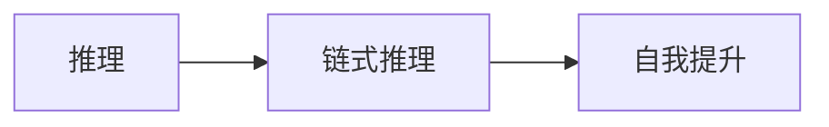
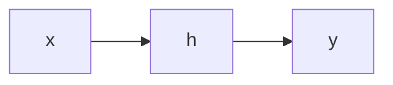
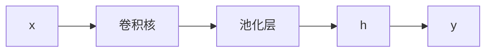

                 

# AI的推理能力:链式推理和自我提升的潜力

## 1. 背景介绍

人工智能（AI）近年来取得了巨大的进展，在诸多领域表现出色。其中，推理能力作为AI系统的核心能力之一，其重要性日益凸显。从简单的逻辑推理到复杂的因果关系建模，推理能力让AI能够处理和理解复杂的数据，从而做出更准确的决策。然而，如何提升AI的推理能力，使其在实际应用中发挥更大的潜力，仍是一个重要且复杂的问题。

本文将深入探讨AI的推理能力，特别是链式推理和自我提升的潜力。链式推理是AI推理的重要形式，能够帮助系统处理多层次、复杂的数据关系。自我提升则是指AI系统通过不断学习，优化自身的推理能力，从而适应更广泛的应用场景。本文将从这两个方面，探讨AI推理能力的发展和应用前景。

## 2. 核心概念与联系

### 2.1 核心概念概述

在讨论AI的推理能力之前，我们首先需要明确几个核心概念：

- **推理（Inference）**：指AI系统根据已知条件和逻辑规则，推导出新的结论或假设的过程。
- **链式推理（Chain of Reasoning）**：一种推理形式，涉及多步骤的逻辑推理，能够处理复杂、多层级的数据关系。
- **自我提升（Self-improvement）**：AI系统通过学习算法、优化模型、积累经验等方式，提升自身的推理能力，使其能够更好地适应新的应用场景。

这些概念之间存在着紧密的联系。链式推理是实现AI自我提升的重要手段，通过多层次的逻辑推理，AI能够更全面地理解数据，优化模型。而自我提升则提供了持续改进的动力，让AI系统在实际应用中不断提升自身的推理能力。

### 2.2 核心概念原理和架构的 Mermaid 流程图



这个流程图展示了推理、链式推理和自我提升之间的关系。链式推理是推理的高级形式，而自我提升则是推理能力不断提升的动力来源。

## 3. 核心算法原理 & 具体操作步骤

### 3.1 算法原理概述

AI的推理能力基于一系列算法和技术，其中主要包括：

- **规则推理（Rule-based Reasoning）**：基于预定义的规则进行推理，适合处理结构化数据。
- **符号推理（Symbolic Reasoning）**：利用符号表示数据，支持形式化的逻辑推理。
- **概率推理（Probabilistic Reasoning）**：利用概率模型进行推理，能够处理不确定性问题。
- **神经网络推理（Neural Network Reasoning）**：通过深度学习模型，训练推理能力，适合处理复杂、非结构化的数据。

这些算法和技术相互补充，共同构成了AI推理能力的核心。其中，神经网络推理因其强大的非线性建模能力，成为当前最为流行的推理形式之一。

### 3.2 算法步骤详解

神经网络推理的具体操作步骤如下：

1. **数据准备**：收集和标注训练数据，确保数据的多样性和代表性。
2. **模型选择**：选择适合当前任务的神经网络模型，如卷积神经网络（CNN）、循环神经网络（RNN）或变换器（Transformer）。
3. **模型训练**：在大量标注数据上训练模型，优化模型的参数，使其能够学习数据的潜在结构和规律。
4. **推理验证**：使用测试数据对训练好的模型进行验证，确保其推理能力符合预期。
5. **模型优化**：根据验证结果，调整模型结构、参数和学习率，进一步提升推理能力。
6. **应用部署**：将优化后的模型部署到实际应用场景中，进行大规模推理和决策。

### 3.3 算法优缺点

神经网络推理具有以下优点：

- **强大的非线性建模能力**：能够处理复杂、非结构化的数据，适应多种应用场景。
- **自适应能力**：通过不断的训练和优化，提升推理能力，适应新的数据和任务。
- **可扩展性**：可以通过增加模型层数或参数，提高推理精度和复杂度。

然而，神经网络推理也存在一些缺点：

- **数据依赖性强**：需要大量标注数据进行训练，数据质量直接影响推理效果。
- **模型复杂度高**：模型结构和参数较多，难以解释和调试。
- **计算资源消耗大**：推理过程需要大量的计算资源，特别是在大规模数据集上。

### 3.4 算法应用领域

神经网络推理在多个领域得到了广泛应用，主要包括：

- **自然语言处理（NLP）**：文本分类、情感分析、机器翻译、问答系统等。
- **计算机视觉（CV）**：图像识别、目标检测、图像分割、图像生成等。
- **机器人学**：路径规划、动作控制、行为决策等。
- **推荐系统**：用户行为分析、商品推荐、个性化推荐等。
- **金融风控**：信用评估、风险预警、欺诈检测等。

## 4. 数学模型和公式 & 详细讲解 & 举例说明

### 4.1 数学模型构建

神经网络推理的数学模型主要由以下几个部分组成：

- **输入层**：接收原始数据，并将其转换为神经网络能够处理的格式。
- **隐藏层**：通过多层非线性变换，提取数据特征，学习数据的潜在规律。
- **输出层**：将隐藏层提取的特征转换为推理结果，可以是分类标签、概率分布等。

### 4.2 公式推导过程

以简单的逻辑推理为例，我们以二分类任务为例，介绍神经网络推理的基本公式。

假设输入数据为 $x$，输出为 $y$，隐藏层为 $h$，神经网络的结构如图：



其中，隐藏层 $h$ 的计算公式为：

$$
h = \sigma(W_h \cdot x + b_h)
$$

其中，$W_h$ 和 $b_h$ 分别为权重和偏置项，$\sigma$ 为激活函数，通常使用 sigmoid 或 ReLU 函数。

输出层 $y$ 的计算公式为：

$$
y = \sigma(W_y \cdot h + b_y)
$$

其中，$W_y$ 和 $b_y$ 分别为权重和偏置项。

### 4.3 案例分析与讲解

以图像识别任务为例，我们采用卷积神经网络（CNN）进行推理。CNN 的隐藏层采用卷积核和池化层进行特征提取，如图：



其中，卷积核 $B$ 和池化层 $C$ 通过多次卷积和池化操作，提取出图像的特征，然后通过隐藏层 $h$ 进行推理计算。输出层 $y$ 将推理结果转换为分类标签。

## 5. 项目实践：代码实例和详细解释说明

### 5.1 开发环境搭建

为了进行神经网络推理的实践，我们需要搭建合适的开发环境。以下是 Python 环境下使用 PyTorch 和 TensorFlow 搭建开发环境的详细步骤：

1. 安装 Python 环境：
   - 安装 Anaconda，创建虚拟环境。
   - 激活虚拟环境。

2. 安装 PyTorch 和 TensorFlow：
   - 使用 pip 安装 PyTorch 和 TensorFlow，确保版本一致。
   - 导入 PyTorch 和 TensorFlow，进行基本操作测试。

3. 安装其他依赖包：
   - 安装必要的依赖包，如 NumPy、Pandas、Scikit-learn 等。

### 5.2 源代码详细实现

以下是一个简单的神经网络推理示例代码，使用 PyTorch 进行实现：

```python
import torch
import torch.nn as nn
import torch.optim as optim

# 定义神经网络模型
class Net(nn.Module):
    def __init__(self):
        super(Net, self).__init__()
        self.fc1 = nn.Linear(784, 256)
        self.fc2 = nn.Linear(256, 128)
        self.fc3 = nn.Linear(128, 10)

    def forward(self, x):
        x = torch.relu(self.fc1(x))
        x = torch.relu(self.fc2(x))
        x = self.fc3(x)
        return x

# 定义训练函数
def train(model, train_loader, epochs, optimizer):
    model.train()
    for epoch in range(epochs):
        for data, target in train_loader:
            optimizer.zero_grad()
            output = model(data.view(-1, 784))
            loss = nn.CrossEntropyLoss()(output, target)
            loss.backward()
            optimizer.step()

# 定义测试函数
def test(model, test_loader):
    model.eval()
    correct = 0
    total = 0
    with torch.no_grad():
        for data, target in test_loader:
            output = model(data.view(-1, 784))
            _, predicted = torch.max(output.data, 1)
            total += target.size(0)
            correct += (predicted == target).sum().item()
    print('Accuracy of the network on the test images: {} %'.format(100 * correct / total))

# 训练模型
model = Net()
optimizer = optim.Adam(model.parameters(), lr=0.001)
train_loader = ...
test_loader = ...
epochs = 10
train(model, train_loader, epochs, optimizer)
test(model, test_loader)
```

### 5.3 代码解读与分析

上述代码主要实现了以下功能：

- **定义神经网络模型**：使用 PyTorch 的 nn.Module 定义了一个简单的三层神经网络，包含两个隐藏层和一个输出层。
- **定义训练函数**：使用 torch.nn.CrossEntropyLoss() 作为损失函数，Adam 优化器进行参数优化。
- **定义测试函数**：计算模型在测试集上的准确率。
- **训练模型**：使用训练集进行模型训练，测试集进行模型验证。

## 6. 实际应用场景

### 6.1 自然语言处理（NLP）

在自然语言处理领域，神经网络推理得到了广泛应用。例如，文本分类、情感分析、机器翻译、问答系统等任务。以下是一些具体的示例：

- **文本分类**：使用神经网络对文本进行分类，如图像分类模型。
- **情感分析**：对文本的情感倾向进行分析，如将正面或负面情绪分类。
- **机器翻译**：将一种语言的文本翻译成另一种语言，如图像翻译模型。
- **问答系统**：根据用户提出的问题，生成最合适的回答，如图像问答模型。

### 6.2 计算机视觉（CV）

计算机视觉领域是神经网络推理的重要应用领域。例如，图像识别、目标检测、图像分割、图像生成等任务。以下是一些具体的示例：

- **图像识别**：对图像进行分类，如图像分类模型。
- **目标检测**：在图像中检测并定位特定对象，如人脸检测模型。
- **图像分割**：将图像分割成多个部分，如图像分割模型。
- **图像生成**：生成与输入相似的新图像，如图像生成模型。

### 6.3 机器人学

在机器人学领域，神经网络推理可以用于路径规划、动作控制、行为决策等任务。以下是一些具体的示例：

- **路径规划**：根据环境信息，规划机器人的移动路径。
- **动作控制**：根据传感器数据，控制机器人的动作。
- **行为决策**：根据当前状态和目标，做出最优的决策。

### 6.4 推荐系统

推荐系统是神经网络推理的另一个重要应用领域。例如，用户行为分析、商品推荐、个性化推荐等任务。以下是一些具体的示例：

- **用户行为分析**：根据用户的历史行为数据，预测用户可能感兴趣的商品。
- **商品推荐**：根据用户的历史行为数据，推荐相似的商品。
- **个性化推荐**：根据用户的历史行为数据，推荐个性化的商品。

## 7. 工具和资源推荐

### 7.1 学习资源推荐

为了深入学习神经网络推理，以下是一些推荐的资源：

- **《深度学习》（Ian Goodfellow 著）**：深度学习领域的经典教材，涵盖神经网络推理的基本概念和算法。
- **CS231n: Convolutional Neural Networks for Visual Recognition**：斯坦福大学开设的计算机视觉课程，系统讲解神经网络推理在视觉领域的应用。
- **CS224n: Natural Language Processing with Deep Learning**：斯坦福大学开设的自然语言处理课程，讲解神经网络推理在语言领域的应用。
- **PyTorch官方文档**：PyTorch 的官方文档，提供丰富的教程和示例代码，方便初学者快速上手。
- **TensorFlow官方文档**：TensorFlow 的官方文档，提供详细的教程和示例代码，方便初学者快速上手。

### 7.2 开发工具推荐

为了进行神经网络推理的开发，以下是一些推荐的工具：

- **PyTorch**：深度学习领域的主流框架，提供丰富的神经网络模型和优化器。
- **TensorFlow**：Google 推出的深度学习框架，支持大规模分布式计算。
- **Keras**：基于 TensorFlow 和 Theano 的高级深度学习框架，提供简单易用的 API。
- **MXNet**：由亚马逊推出的深度学习框架，支持多种编程语言和分布式计算。
- **TensorBoard**：TensorFlow 的可视化工具，用于监控和调试神经网络模型。

### 7.3 相关论文推荐

以下是一些推荐的相关论文，深入探讨神经网络推理的原理和应用：

- **Convolutional Neural Networks for Visual Recognition**（Alex Krizhevsky 等，NIPS 2012）：提出卷积神经网络（CNN），用于图像分类和目标检测任务。
- **ImageNet Classification with Deep Convolutional Neural Networks**（Krizhevsky 等，ICCV 2012）：使用 CNN 进行大规模图像分类任务，取得优异结果。
- **Attention is All You Need**（Vaswani 等，NIPS 2017）：提出 Transformer 模型，用于自然语言处理任务，取得优异效果。
- **BERT: Pre-training of Deep Bidirectional Transformers for Language Understanding**（Devlin 等，arXiv 2018）：提出 BERT 模型，用于自然语言处理任务，取得优异效果。

## 8. 总结：未来发展趋势与挑战

### 8.1 研究成果总结

本文详细探讨了神经网络推理的原理、操作步骤和应用领域。通过链式推理和自我提升，神经网络推理能够处理复杂、多层次的数据关系，适应不同的应用场景。

### 8.2 未来发展趋势

未来的神经网络推理将呈现以下几个发展趋势：

- **多模态推理**：将神经网络推理应用于多模态数据，如图像、语音、文本等，提高模型的泛化能力。
- **联邦学习**：在分布式环境中，通过联邦学习技术，提高模型训练的效率和安全性。
- **自监督学习**：使用自监督学习方法，提高模型的数据利用率和泛化能力。
- **生成对抗网络（GAN）**：将 GAN 技术应用于推理过程，提高模型的生成能力和鲁棒性。
- **元学习**：使用元学习技术，提高模型的快速适应能力和迁移学习能力。

### 8.3 面临的挑战

尽管神经网络推理已经取得了显著的进展，但在实际应用中仍面临一些挑战：

- **数据依赖性**：神经网络推理依赖大量的标注数据，标注成本高，数据质量直接影响推理效果。
- **模型复杂性**：神经网络模型结构和参数较多，难以解释和调试。
- **计算资源消耗**：神经网络推理需要大量的计算资源，特别是在大规模数据集上。
- **鲁棒性问题**：神经网络推理容易受到噪声和攻击的影响，鲁棒性有待提高。
- **可解释性问题**：神经网络推理模型的内部机制难以解释，缺乏透明性。

### 8.4 研究展望

未来的研究需要在以下几个方面寻求新的突破：

- **高效数据生成**：探索生成对抗网络（GAN）等技术，提高数据生成的效率和质量。
- **模型压缩与加速**：使用模型压缩和加速技术，提高模型的推理速度和效率。
- **模型解释与透明性**：研究模型的可解释性和透明性，提高模型的可信度。
- **跨模态推理**：将神经网络推理应用于多模态数据，提高模型的泛化能力。
- **分布式推理**：探索分布式推理技术，提高模型的处理能力和效率。

## 9. 附录：常见问题与解答

**Q1: 神经网络推理的优点和缺点是什么？**

A: 神经网络推理的优点包括：

- **强大的非线性建模能力**：能够处理复杂、非结构化的数据，适应多种应用场景。
- **自适应能力**：通过不断的训练和优化，提升推理能力，适应新的数据和任务。
- **可扩展性**：可以通过增加模型层数或参数，提高推理精度和复杂度。

神经网络推理的缺点包括：

- **数据依赖性强**：需要大量标注数据进行训练，数据质量直接影响推理效果。
- **模型复杂度高**：模型结构和参数较多，难以解释和调试。
- **计算资源消耗大**：推理过程需要大量的计算资源，特别是在大规模数据集上。

**Q2: 如何提高神经网络推理的鲁棒性？**

A: 提高神经网络推理的鲁棒性可以采取以下措施：

- **数据增强**：通过数据增强技术，丰富训练数据的多样性，提高模型的泛化能力。
- **正则化**：使用 L2 正则化等技术，防止模型过拟合，提高模型的鲁棒性。
- **对抗训练**：使用对抗样本训练模型，提高模型对噪声和攻击的鲁棒性。
- **模型融合**：将多个模型的输出进行融合，提高模型的鲁棒性和准确性。

**Q3: 如何提高神经网络推理的可解释性？**

A: 提高神经网络推理的可解释性可以采取以下措施：

- **特征可视化**：使用特征可视化技术，展示模型的输入特征和输出特征之间的关系。
- **模型简化**：简化模型的结构，减少模型的复杂性，提高模型的透明性。
- **解释技术**：使用解释技术，如 SHAP（Shapley Additive Explanations）、LIME（Local Interpretable Model-agnostic Explanations）等，提高模型的透明性和可信度。

**Q4: 如何提高神经网络推理的效率？**

A: 提高神经网络推理的效率可以采取以下措施：

- **模型压缩**：使用模型压缩技术，减少模型的参数量和计算量，提高模型的推理效率。
- **模型加速**：使用模型加速技术，如量化加速、模型并行等，提高模型的推理速度。
- **数据分批**：使用数据分批技术，提高模型的计算效率。

通过上述措施，可以显著提高神经网络推理的效率和鲁棒性，使其在实际应用中发挥更大的潜力。

