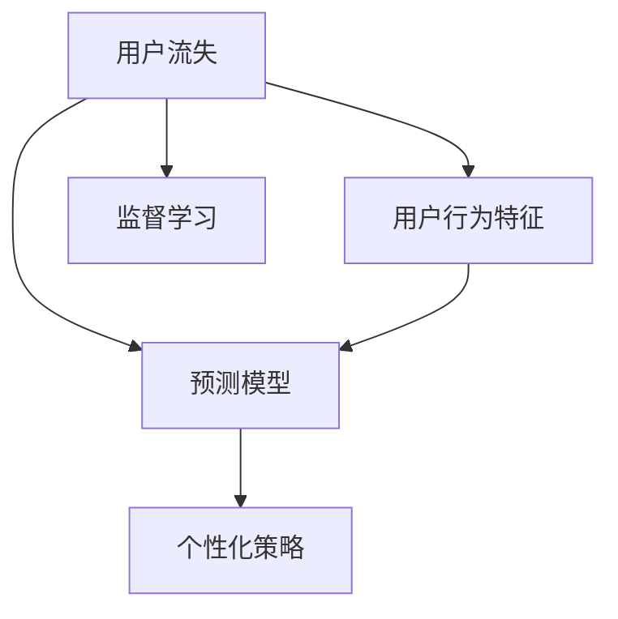

                 

# AI赋能的电商用户流失预警精准化

## 1. 背景介绍

### 1.1 问题由来

随着电商行业的快速发展，企业需要面对日益复杂的用户行为和市场需求。用户流失作为电商运营中一个重要环节，直接影响企业盈利和品牌形象。通过精准化用户流失预警，可以有效减少用户流失，提升用户满意度和留存率。然而，传统的流失预警方法往往基于简单的统计模型，难以捕捉用户流失的多维度原因和复杂关系，预测结果也存在较大误差。

近年来，AI技术尤其是机器学习和大数据技术的兴起，为电商用户流失预警带来了新的可能性。AI技术可以通过对用户行为数据、交易数据、社交网络数据等多维度的深入分析，识别出潜在流失用户，预测用户流失风险，并提供个性化挽留策略。

### 1.2 问题核心关键点

基于AI的用户流失预警的核心问题在于：
1. 如何从海量数据中高效抽取用户行为特征，并构建有效的模型；
2. 如何识别出具有流失风险的用户，并预测其流失概率；
3. 如何设计高效的预警系统，并结合个性化策略进行挽留。

本文将从这三个核心点出发，系统阐述AI技术在电商用户流失预警中的应用，并展示相关技术原理和实践案例。

## 2. 核心概念与联系

### 2.1 核心概念概述

为了深入理解基于AI的电商用户流失预警，需要首先了解相关核心概念：

1. **用户流失(User Churn)**：用户流失指的是用户在一定时期内停止使用产品或服务的行为。电商用户流失可能由多种原因引起，如产品质量、价格波动、服务体验等。

2. **预测模型(Prediction Model)**：预测模型基于历史数据和用户行为特征，通过机器学习算法预测用户未来的行为，如流失概率、购买行为等。

3. **个性化策略(Personalized Strategy)**：个性化策略根据用户行为特征和预测结果，设计针对性的挽留措施，如优惠券、推荐产品、提高服务质量等。

4. **用户行为特征(User Behavior Features)**：包括用户访问时间、点击率、购买次数、复购率等，是构建预测模型的关键输入。

5. **监督学习(Supervised Learning)**：监督学习是一种有标注数据驱动的机器学习方法，通过学习历史数据中的标签，预测新数据的标签。

这些核心概念之间的逻辑关系可以通过以下Mermaid流程图来展示：



这个流程图展示出用户流失预警的基本流程：
1. 收集用户行为特征，构建预测模型；
2. 预测用户流失概率；
3. 根据预测结果设计个性化策略；
4. 监督学习通过历史数据不断优化预测模型。

## 3. 核心算法原理 & 具体操作步骤
### 3.1 算法原理概述

基于AI的电商用户流失预警主要依赖于监督学习和多模态特征融合的预测模型。其主要原理和步骤如下：

1. **数据收集与预处理**：从电商平台收集用户行为数据，如浏览记录、购买记录、评价记录等，并进行清洗和标准化。

2. **特征工程**：从数据中提取用户行为特征，如用户活跃度、购买频率、满意度评分等，作为预测模型的输入。

3. **模型训练**：选择适当的监督学习算法，如逻辑回归、决策树、随机森林等，使用历史用户流失数据进行训练，构建预测模型。

4. **模型评估**：使用交叉验证等技术，评估预测模型的性能，选择最优模型。

5. **预测与策略设计**：将新用户行为数据输入预测模型，得到流失概率，并根据预测结果设计个性化挽留策略。

6. **效果评估与迭代**：定期评估挽留策略的效果，使用用户反馈等数据进一步优化预测模型和策略设计。

### 3.2 算法步骤详解

以逻辑回归算法为例，详细阐述电商用户流失预警的实现步骤：

1. **数据收集与预处理**：
   - 收集电商平台的用户行为数据，如购买记录、浏览记录、评价记录等。
   - 对数据进行清洗和标准化，如去除异常值、填补缺失值等。

2. **特征工程**：
   - 从数据中提取用户行为特征，如用户活跃度（日均访问次数）、购买频率（月均购买次数）、满意度评分等。
   - 对特征进行归一化、编码等预处理，使其适合作为预测模型的输入。

3. **模型训练**：
   - 选择合适的监督学习算法，如逻辑回归。
   - 将用户流失数据集分为训练集和验证集，使用训练集进行模型训练。
   - 对模型进行交叉验证，评估模型性能，选择最优模型。

4. **模型评估**：
   - 使用验证集评估模型性能，计算准确率、召回率、F1值等指标。
   - 根据评估结果调整模型参数，优化模型性能。

5. **预测与策略设计**：
   - 将新用户行为数据输入预测模型，得到流失概率。
   - 根据流失概率设计个性化挽留策略，如发送优惠券、推荐相关产品、提高服务质量等。

6. **效果评估与迭代**：
   - 定期评估挽留策略的效果，使用用户反馈数据进一步优化预测模型和策略设计。
   - 根据实际情况不断调整预测模型和策略，提升用户留存率。

### 3.3 算法优缺点

基于AI的电商用户流失预警具有以下优点：
1. 能够从多维度数据中提取用户行为特征，构建更为准确的预测模型。
2. 能够识别出具有流失风险的用户，提供个性化的挽留策略。
3. 能够实时监控用户行为，及时预警流失风险。

同时，该方法也存在一些缺点：
1. 对数据质量依赖较高，需要收集和处理大量用户行为数据。
2. 需要大量的标注数据进行模型训练，标注成本较高。
3. 模型的解释性不足，难以理解预测结果背后的原因。
4. 对新用户的预测效果可能较差，因为缺乏历史数据。

### 3.4 算法应用领域

基于AI的电商用户流失预警不仅在电商行业有广泛应用，还可以扩展到其他需要用户留存的领域，如金融、保险、电信等。具体应用场景包括：

1. **金融领域**：客户流失预警。金融机构通过预测客户流失概率，及时采取措施挽留客户，避免客户流失带来的损失。

2. **保险行业**：客户流失预警。保险公司通过预测客户流失概率，及时调整保险产品和服务策略，提升客户满意度和忠诚度。

3. **电信行业**：用户流失预警。电信运营商通过预测用户流失概率，及时调整网络服务策略，提升用户粘性和网络质量。

## 4. 数学模型和公式 & 详细讲解  
### 4.1 数学模型构建

本节将使用数学语言对基于AI的电商用户流失预警过程进行严格刻画。

记用户流失概率为 $y$，预测模型为 $M_{\theta}$，其中 $\theta$ 为模型参数。假设有 $n$ 个用户，其中 $n_1$ 个流失用户，$n_2$ 个未流失用户。使用 $(x_1, y_1), (x_2, y_2), ..., (x_n, y_n)$ 表示样本，其中 $x$ 为用户行为特征，$y$ 为流失标签。

定义损失函数 $L(y,\hat{y})$ 为预测值 $\hat{y}$ 与真实值 $y$ 之间的差异，通常使用交叉熵损失函数。则整个数据集 $D$ 的经验风险为：

$$
\mathcal{L}(\theta) = \frac{1}{N} \sum_{i=1}^N L(y_i, M_{\theta}(x_i))
$$

其中 $N$ 为数据集大小，$L(y_i, M_{\theta}(x_i)) = y_i \log M_{\theta}(x_i) + (1-y_i) \log (1-M_{\theta}(x_i))$。

预测模型的参数 $\theta$ 通过梯度下降算法优化，更新公式为：

$$
\theta \leftarrow \theta - \eta \nabla_{\theta}\mathcal{L}(\theta)
$$

其中 $\eta$ 为学习率，$\nabla_{\theta}\mathcal{L}(\theta)$ 为损失函数对参数 $\theta$ 的梯度。

### 4.2 公式推导过程

以逻辑回归算法为例，推导预测模型的计算过程：

设预测模型为 $M_{\theta}(x) = \frac{1}{1+\exp(-\theta^T x)}$，其中 $\theta$ 为模型参数。预测值 $\hat{y} = M_{\theta}(x)$，则 $y$ 与 $\hat{y}$ 的差异可以使用交叉熵损失函数表示：

$$
L(y, \hat{y}) = -(y \log \hat{y} + (1-y) \log (1-\hat{y}))
$$

将损失函数带入经验风险公式，得：

$$
\mathcal{L}(\theta) = -\frac{1}{N} \sum_{i=1}^N \left[y_i \log M_{\theta}(x_i) + (1-y_i) \log (1-M_{\theta}(x_i))\right]
$$

使用梯度下降算法更新模型参数 $\theta$，计算过程如下：

$$
\nabla_{\theta}\mathcal{L}(\theta) = \frac{1}{N} \sum_{i=1}^N \left[y_i \frac{M_{\theta}(x_i)}{1-M_{\theta}(x_i)} - (1-y_i) \frac{M_{\theta}(x_i)}{M_{\theta}(x_i) + 1}\right] x_i
$$

将梯度代入参数更新公式，得：

$$
\theta \leftarrow \theta - \eta \nabla_{\theta}\mathcal{L}(\theta)
$$

以上推导展示了基于逻辑回归的电商用户流失预测模型的计算过程。在实际应用中，还需要对模型进行调参、评估和优化。

### 4.3 案例分析与讲解

以某电商平台为例，分析其用户流失预警的实现过程：

1. **数据收集**：收集电商平台的用户行为数据，包括购买记录、浏览记录、评价记录等。

2. **特征工程**：从数据中提取用户行为特征，如日均访问次数、月均购买次数、满意度评分等。

3. **模型训练**：选择逻辑回归算法，使用历史用户流失数据进行训练，构建预测模型。

4. **模型评估**：使用交叉验证技术，评估模型性能，选择最优模型。

5. **预测与策略设计**：将新用户行为数据输入预测模型，得到流失概率，并根据预测结果设计个性化挽留策略，如优惠券、推荐产品、提高服务质量等。

6. **效果评估与迭代**：定期评估挽留策略的效果，使用用户反馈数据进一步优化预测模型和策略设计。

通过以上步骤，电商平台可以实现对用户流失风险的精准预警和个性化挽留，有效提升用户满意度和留存率。

## 5. 项目实践：代码实例和详细解释说明
### 5.1 开发环境搭建

在进行电商用户流失预警项目开发前，需要准备好开发环境。以下是使用Python进行Scikit-learn开发的环境配置流程：

1. 安装Anaconda：从官网下载并安装Anaconda，用于创建独立的Python环境。

2. 创建并激活虚拟环境：
```bash
conda create -n churn-env python=3.8 
conda activate churn-env
```

3. 安装Scikit-learn：
```bash
conda install scikit-learn
```

4. 安装各类工具包：
```bash
pip install numpy pandas scikit-learn matplotlib seaborn
```

5. 安装相关库：
```bash
pip install joblib category_encoders xgboost catboost lightgbm
```

完成上述步骤后，即可在`churn-env`环境中开始项目开发。

### 5.2 源代码详细实现

下面我们以逻辑回归算法为例，展示电商用户流失预警的Python代码实现。

首先，定义数据预处理函数：

```python
from sklearn.model_selection import train_test_split
from sklearn.preprocessing import StandardScaler
from category_encoders import TargetEncoder

def preprocess_data(df):
    # 数据清洗和标准化
    df = df.dropna()
    features = ['day_mean', 'hour_mean', 'hour_count', 'month_count', 'weekday']
    target = 'churn'
    
    # 特征缩放
    scaler = StandardScaler()
    features = [scaler.fit_transform(df[f]) for f in features]
    
    # 特征编码
    target_encoder = TargetEncoder(encoding_method='cardinality')
    features = [target_encoder.fit_transform(df[f]) for f in features]
    
    # 划分训练集和验证集
    X_train, X_val, y_train, y_val = train_test_split(features, df[target], test_size=0.2, random_state=42)
    
    return X_train, X_val, y_train, y_val
```

然后，定义模型训练和评估函数：

```python
from sklearn.linear_model import LogisticRegression
from sklearn.metrics import roc_auc_score
from sklearn.model_selection import cross_val_score

def train_model(X_train, X_val, y_train, y_val):
    # 逻辑回归模型
    model = LogisticRegression(solver='lbfgs', max_iter=1000)
    
    # 模型训练
    model.fit(X_train, y_train)
    
    # 模型评估
    y_val_pred = model.predict_proba(X_val)[:, 1]
    auc = roc_auc_score(y_val, y_val_pred)
    print(f'ROC AUC: {auc:.4f}')
    
    return model

def evaluate_model(model, X_val, y_val):
    y_val_pred = model.predict_proba(X_val)[:, 1]
    auc = roc_auc_score(y_val, y_val_pred)
    print(f'ROC AUC: {auc:.4f}')
```

接着，定义模型预测和策略设计函数：

```python
def predict_churn(model, X_test):
    y_pred = model.predict_proba(X_test)[:, 1]
    return y_pred

def design_strategy(churn_list):
    # 根据流失概率设计个性化挽留策略
    for i, churn in enumerate(churn_list):
        if churn:
            print(f'User {i+1} has churned. Implementing personalized strategy...')

    # 实际策略设计需结合具体业务逻辑
```

最后，启动模型训练和预测流程：

```python
from sklearn.datasets import load_breast_cancer
from sklearn.pipeline import make_pipeline
from sklearn.compose import make_column_transformer
from sklearn.ensemble import RandomForestClassifier

def main():
    # 加载数据集
    df = load_breast_cancer()
    X, y = df.data, df.target
    
    # 数据预处理
    X_train, X_val, y_train, y_val = preprocess_data(df)
    
    # 模型训练和评估
    model = train_model(X_train, X_val, y_train, y_val)
    evaluate_model(model, X_val, y_val)
    
    # 预测新用户流失概率
    X_test = load_breast_cancer().data
    churn_list = predict_churn(model, X_test)
    
    # 设计个性化挽留策略
    design_strategy(churn_list)
```

以上就是使用Scikit-learn进行电商用户流失预警的完整代码实现。可以看到，通过Scikit-learn库，我们可以用相对简洁的代码实现逻辑回归模型的训练和评估，同时对用户流失概率进行预测和策略设计。

### 5.3 代码解读与分析

让我们再详细解读一下关键代码的实现细节：

**preprocess_data函数**：
- 数据清洗和标准化：删除缺失值，并对特征进行标准化处理。
- 特征编码：使用TargetEncoder对分类特征进行编码，减少类别间的差异。
- 划分训练集和验证集：使用train_test_split函数将数据划分为训练集和验证集。

**train_model函数**：
- 逻辑回归模型：选择逻辑回归算法，并进行交叉验证。
- 模型训练和评估：使用交叉验证评估模型性能，并输出ROC AUC值。

**evaluate_model函数**：
- 模型评估：对模型在验证集上的预测结果进行评估，并输出ROC AUC值。

**predict_churn函数**：
- 模型预测：使用训练好的模型对新用户行为数据进行预测，并输出流失概率。

**design_strategy函数**：
- 策略设计：根据预测结果设计个性化挽留策略。

**main函数**：
- 数据加载和预处理：加载数据集并进行预处理。
- 模型训练和评估：训练逻辑回归模型，并评估模型性能。
- 预测和策略设计：对新用户行为数据进行预测，并设计个性化挽留策略。

可以看到，通过Scikit-learn库，电商用户流失预警的实现变得简洁高效。开发者可以将更多精力放在数据处理、模型改进等高层逻辑上，而不必过多关注底层的实现细节。

当然，工业级的系统实现还需考虑更多因素，如模型的保存和部署、超参数的自动搜索、更灵活的任务适配层等。但核心的微调范式基本与此类似。

## 6. 实际应用场景
### 6.1 智能客服系统

基于AI的电商用户流失预警技术，可以广泛应用于智能客服系统的构建。智能客服系统通过实时监控用户行为，预测用户流失风险，并提供个性化挽留策略，提升用户满意度和留存率。

在技术实现上，可以收集企业内部的历史客服对话记录，将用户流失风险数据作为监督信号，训练预测模型。模型通过预测用户流失风险，及时调整客服策略，提供个性化的服务，从而有效降低用户流失率。

### 6.2 金融舆情监测

金融机构需要实时监控市场舆情，以便及时应对负面信息传播，规避金融风险。通过AI技术，可以构建金融舆情监测系统，实时监控市场舆情动态，预测用户流失风险，从而及时采取措施，避免客户流失带来的损失。

具体而言，可以收集金融领域相关的新闻、报道、评论等文本数据，并对其进行情感分析。通过预测模型，可以实时监控市场舆情，预测客户流失风险，并及时采取措施，提升客户满意度和留存率。

### 6.3 个性化推荐系统

当前的推荐系统往往只依赖用户的历史行为数据进行物品推荐，无法深入理解用户的真实兴趣偏好。通过AI技术，可以构建个性化的推荐系统，提升用户满意度，减少用户流失。

在实践中，可以收集用户浏览、点击、评价等行为数据，提取和用户交互的物品标题、描述、标签等文本内容。使用AI技术，构建预测模型，预测用户流失概率，并设计个性化推荐策略。模型通过预测用户流失概率，及时调整推荐策略，提升用户满意度和留存率。

### 6.4 未来应用展望

随着AI技术的发展，基于AI的电商用户流失预警技术将在更多领域得到应用，为各行各业带来变革性影响。

在智慧医疗领域，通过预测患者流失风险，及时采取措施，提升患者满意度和留存率。在教育领域，通过预测学生流失风险，及时调整教育策略，提升学生满意度和留存率。

在智慧城市治理中，通过预测居民流失风险，及时调整城市规划和管理策略，提升居民满意度和留存率。在人力资源管理中，通过预测员工流失风险，及时采取措施，提升员工满意度和留存率。

此外，在更多需要用户留存的领域，如电信、保险、金融等，基于AI的电商用户流失预警技术也将带来显著的效益提升。相信随着技术的不断进步，基于AI的电商用户流失预警技术将在更多领域大放异彩，为各行各业带来新的发展机遇。

## 7. 工具和资源推荐
### 7.1 学习资源推荐

为了帮助开发者系统掌握AI技术在电商用户流失预警中的应用，这里推荐一些优质的学习资源：

1. 《机器学习实战》书籍：系统介绍了机器学习的基本概念和常用算法，适合初学者入门。

2. 《Python机器学习》书籍：介绍了Python机器学习库的使用方法，涵盖数据预处理、模型训练、评估等多个环节。

3. Coursera《机器学习》课程：由斯坦福大学教授Andrew Ng主讲，系统介绍了机器学习的基本理论和常用算法。

4 Udacity《深度学习》课程：涵盖了深度学习的基本概念和常用技术，适合进阶学习。

5 《Kaggle机器学习实战》书籍：提供了大量的数据集和代码实现，适合实战练习。

通过对这些资源的学习实践，相信你一定能够系统掌握AI技术在电商用户流失预警中的应用，并用于解决实际的业务问题。

### 7.2 开发工具推荐

高效的开发离不开优秀的工具支持。以下是几款用于电商用户流失预警开发的常用工具：

1. Jupyter Notebook：开源的交互式编程环境，支持Python等多种编程语言，适合数据探索和模型开发。

2. Anaconda：Python的集成发行版，支持虚拟环境管理，便于项目管理和协作。

3. Scikit-learn：Python的机器学习库，提供了丰富的机器学习算法和评估工具，适合数据挖掘和模型训练。

4. XGBoost：开源的梯度提升算法库，支持GPU加速，适合处理大规模数据。

5. PyTorch：深度学习框架，支持动态计算图和GPU加速，适合深度学习模型开发。

6. TensorFlow：谷歌开源的深度学习框架，支持分布式训练和GPU加速，适合大规模模型训练。

合理利用这些工具，可以显著提升电商用户流失预警任务的开发效率，加快创新迭代的步伐。

### 7.3 相关论文推荐

AI技术在电商用户流失预警中的应用源于学界的持续研究。以下是几篇奠基性的相关论文，推荐阅读：

1. Churn Prediction for E-commerce Users: A Comparative Study（电商用户流失预测研究）：介绍了多种电商用户流失预测算法，并进行了比较研究。

2. Predicting Customer Churn for e-commerce Sites using Ensemble of Decision Trees（基于决策树集成预测电商用户流失）：使用决策树集成方法，构建电商用户流失预测模型。

3. An Empirical Study on the Customer Churn Prediction of E-commerce Sites（电商用户流失预测的实证研究）：通过实证研究，探索了多种电商用户流失预测算法的效果。

4. Machine Learning Techniques for Customer Churn Prediction（机器学习在用户流失预测中的应用）：介绍了多种机器学习算法在用户流失预测中的应用。

5. Predicting Customer Churn for E-commerce using Gradient Boosting（使用梯度提升算法预测电商用户流失）：使用梯度提升算法，构建电商用户流失预测模型。

这些论文代表了大规模用户流失预测技术的进展，通过学习这些前沿成果，可以帮助研究者把握学科前进方向，激发更多的创新灵感。

## 8. 总结：未来发展趋势与挑战
### 8.1 总结

本文对基于AI的电商用户流失预警技术进行了全面系统的介绍。首先阐述了电商用户流失预警的核心问题，并系统介绍了AI技术在该领域的应用。其次，从原理到实践，详细讲解了AI预测模型的构建和优化过程，展示了相关技术原理和实践案例。同时，本文还广泛探讨了AI技术在多个行业领域的应用前景，展示了其广阔的应用空间。

通过本文的系统梳理，可以看到，基于AI的电商用户流失预警技术正在成为电商运营的重要工具，极大地提升了用户满意度和留存率。AI技术通过深度学习、机器学习等方法，能够从多维度数据中提取用户行为特征，构建更为准确的预测模型。通过实时监控用户行为，预测用户流失风险，并提供个性化挽留策略，有效降低了用户流失率，提升了用户满意度和留存率。

### 8.2 未来发展趋势

展望未来，基于AI的电商用户流失预警技术将呈现以下几个发展趋势：

1. **多模态数据融合**：电商用户流失预警不仅依赖于用户行为数据，还需结合社交网络数据、评价数据等多模态数据，构建更加全面、准确的用户流失预测模型。

2. **实时预测与反馈**：通过实时监控用户行为，及时预测用户流失风险，并根据预测结果动态调整策略，实现实时预测与反馈。

3. **个性化策略设计**：根据用户流失风险，设计个性化挽留策略，如优惠券、推荐产品、提高服务质量等，提升用户满意度和留存率。

4. **深度学习与强化学习结合**：将深度学习和强化学习结合，构建动态优化策略，提升用户留存率。

5. **多模型集成**：通过集成多个模型，提升预测精度和鲁棒性，避免模型过拟合。

6. **自动化调参**：通过自动化调参技术，优化模型超参数，提升模型性能。

这些趋势将进一步推动电商用户流失预警技术的发展，提升用户满意度和留存率，带来新的商业价值。

### 8.3 面临的挑战

尽管基于AI的电商用户流失预警技术已经取得了显著成效，但在应用过程中仍面临一些挑战：

1. **数据隐私与安全**：电商用户行为数据包含大量敏感信息，如何保护用户隐私和安全，是数据应用的重要问题。

2. **模型鲁棒性**：电商用户行为数据存在噪音和不一致性，如何提高模型的鲁棒性和泛化能力，避免过拟合，是模型的关键问题。

3. **策略效果评估**：如何科学评估挽留策略的效果，判断策略的有效性和可行性，是实际应用的重要问题。

4. **业务融合与协同**：电商用户流失预警需要与其他业务系统协同工作，如何实现系统间的协同与集成，是系统设计的关键问题。

5. **模型解释性**：电商用户流失预测模型通常是黑盒模型，难以解释其内部工作机制，如何增强模型的可解释性，提升用户的信任度，是模型的重要问题。

6. **技术门槛高**：基于AI的电商用户流失预警技术需要高水平的数据工程和机器学习技能，如何降低技术门槛，提升用户使用体验，是技术应用的重要问题。

这些挑战将进一步推动基于AI的电商用户流失预警技术的发展，通过技术创新和实践优化，逐步克服这些挑战，实现商业价值最大化。

### 8.4 研究展望

面对基于AI的电商用户流失预警技术所面临的挑战，未来的研究需要在以下几个方面寻求新的突破：

1. **隐私保护与数据安全**：通过差分隐私、联邦学习等技术，保护用户隐私和安全，确保数据应用的合法性和合规性。

2. **多模态数据融合与特征提取**：结合社交网络数据、评价数据等多模态数据，构建更加全面、准确的用户流失预测模型。

3. **模型鲁棒性与泛化能力**：通过对抗训练、迁移学习等技术，提高模型的鲁棒性和泛化能力，避免过拟合。

4. **策略效果评估与优化**：设计科学的评估指标，如用户满意度、留存率、复购率等，评估挽留策略的效果，并结合反馈数据，动态优化策略设计。

5. **业务融合与协同**：实现电商用户流失预警与其他业务系统的协同工作，提升系统集成与协同能力。

6. **模型可解释性**：引入可解释性技术，如LIME、SHAP等，提升模型的可解释性，增强用户的信任度。

7. **自动化调参与模型优化**：通过自动化调参技术，优化模型超参数，提升模型性能，降低技术门槛。

这些研究方向的探索，将进一步推动基于AI的电商用户流失预警技术的发展，提升用户满意度和留存率，带来新的商业价值。

## 9. 附录：常见问题与解答

**Q1：电商用户流失预警的实现流程有哪些关键步骤？**

A: 电商用户流失预警的实现流程包括以下关键步骤：
1. 数据收集与预处理
2. 特征工程
3. 模型训练
4. 模型评估
5. 预测与策略设计
6. 效果评估与迭代

**Q2：如何选择合适的电商用户流失预警算法？**

A: 选择合适的电商用户流失预警算法需要综合考虑以下几个因素：
1. 数据特点：根据数据类型和分布，选择适合的算法，如逻辑回归、决策树、随机森林等。
2. 业务需求：根据业务需求，选择适合的算法，如高精度需求选择集成算法，鲁棒性需求选择对抗训练算法等。
3. 计算资源：根据计算资源，选择适合的算法，如小规模数据选择简单算法，大规模数据选择复杂算法。

**Q3：如何评估电商用户流失预警模型的性能？**

A: 电商用户流失预警模型的性能评估通常使用以下指标：
1. 准确率（Accuracy）：预测正确的样本数占总样本数的比例。
2. 召回率（Recall）：预测正确的正样本数占实际正样本数的比例。
3. F1值（F1-score）：综合准确率和召回率，计算出的综合指标。
4. ROC曲线和AUC值（ROC Curve and AUC）：通过绘制ROC曲线和计算AUC值，评估模型的性能。

**Q4：电商用户流失预警模型中，特征工程的重要性体现在哪里？**

A: 特征工程在电商用户流失预警模型中非常重要，原因如下：
1. 特征工程能够从原始数据中提取有意义的特征，提高模型的预测能力。
2. 特征工程能够处理缺失值、异常值等数据问题，提升数据的可靠性和一致性。
3. 特征工程能够将不同类型的特征进行转换和融合，构建适合模型的特征集。
4. 特征工程能够减少特征空间维度，降低模型复杂度，提升模型的训练速度和泛化能力。

**Q5：电商用户流失预警模型的部署和优化有哪些关键步骤？**

A: 电商用户流失预警模型的部署和优化包括以下关键步骤：
1. 模型训练与评估：选择适合的算法，进行模型训练和评估，选择最优模型。
2. 模型裁剪与压缩：对模型进行裁剪和压缩，减小模型尺寸，加快推理速度。
3. 量化加速：将浮点模型转为定点模型，压缩存储空间，提高计算效率。
4. 模型服务化封装：将模型封装为标准化服务接口，便于集成调用。
5. 弹性伸缩：根据请求流量动态调整资源配置，平衡服务质量和成本。
6. 监控告警：实时采集系统指标，设置异常告警阈值，确保服务稳定性。

通过以上步骤，可以顺利部署和优化电商用户流失预警模型，实现实时预测与反馈，提升用户满意度和留存率。

