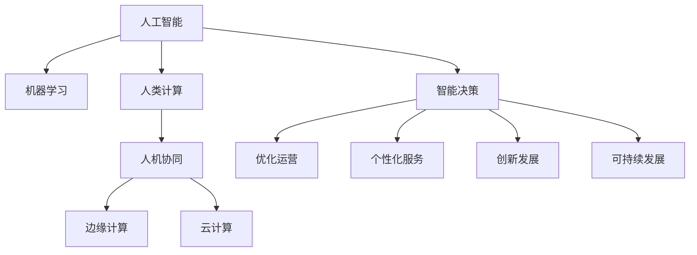

                 

## 1. 背景介绍

### 1.1 问题由来

在过去的十年中，人工智能（AI）和机器学习（ML）技术在商业领域的应用迅猛增长。从自动驾驶汽车到推荐系统，从机器人流程自动化（RPA）到智能客户服务，AI正在彻底改变各行各业的运作方式。AI技术的进步不仅带来了效率和成本的显著降低，还创造了新的商业模式和增长点。然而，随着AI技术的快速发展，传统的人类计算方式逐渐被新兴的AI技术所取代，这对商业界的管理和运营模式提出了新的挑战。

### 1.2 问题核心关键点

当前，人类计算面临的主要挑战包括：

1. **算力需求增长**：随着AI模型规模的不断增大，对算力资源的需求也在急剧增加，传统的数据中心和云服务提供商需要不断升级基础设施以满足需求。

2. **数据隐私和安全**：AI系统通常依赖大量数据进行训练，这引发了数据隐私和安全问题。如何在保护用户隐私的前提下，合理利用数据是企业必须面对的难题。

3. **模型可解释性**：许多AI模型，特别是深度学习模型，具有高度的“黑盒”特性，其决策过程难以解释，这限制了其在商业和监管领域的应用。

4. **资源效率**：大规模AI模型的训练和推理需要巨大的计算资源和能耗，这与环境保护和可持续发展目标相矛盾。

5. **模型泛化能力**：在特定的数据集和场景中表现优异的模型，在新数据或新场景中的泛化能力往往不足，导致模型应用受限。

### 1.3 问题研究意义

研究人类计算与AI的融合，对于理解如何利用AI技术提升商业运作效率、优化资源配置、改善客户体验等方面具有重要意义：

1. **提升运营效率**：通过自动化和智能化手段，优化商业流程，降低人力成本，提高生产效率。
2. **增强决策支持**：利用AI提供的数据洞察和预测能力，辅助高层决策，提升商业决策的准确性和及时性。
3. **提升客户体验**：利用AI技术提供个性化服务，改善客户体验，提升客户满意度。
4. **推动创新发展**：AI技术可以探索新的商业模式，开拓新的业务领域，推动商业创新。
5. **实现可持续发展**：通过智能化的资源管理，优化能源和资源使用，促进可持续发展。

## 2. 核心概念与联系

### 2.1 核心概念概述

为更好地理解AI驱动的商业创新，本节将介绍几个核心概念及其相互联系：

1. **人工智能（AI）**：指能够模拟人类智能行为的计算机系统，包括感知、学习、推理、决策等功能。

2. **机器学习（ML）**：指通过数据和算法，使机器能够自动学习和改进的科学。机器学习是实现人工智能的重要手段之一。

3. **人类计算（Human Computation）**：指通过人机协同方式，利用人类的智慧和技能来解决问题的方法。

4. **人机协同（Human-AI Collaboration）**：指人类与AI系统共同工作的模式，通过优势互补，提升整体效率和效果。

5. **边缘计算（Edge Computing）**：指在数据源附近进行的计算和数据处理，减少数据传输和处理时间，提高响应速度和效率。

6. **云计算（Cloud Computing）**：指通过互联网提供按需计算资源和服务，支持分布式计算和数据存储，降低企业IT基础设施的投入。

这些核心概念之间的逻辑关系可以通过以下Mermaid流程图来展示：



这个流程图展示出人工智能、机器学习、人类计算、人机协同、边缘计算和云计算等概念的相互关系：

1. 人工智能通过机器学习从数据中学习和提取规律，形成智能决策能力。
2. 人类计算和智能决策共同作用于优化运营和提升客户体验。
3. 人机协同利用人工智能和人类智慧的优势互补，提升整体效率。
4. 边缘计算和云计算提供了技术基础设施支持，确保高效的数据处理和存储。

## 3. 核心算法原理 & 具体操作步骤

### 3.1 算法原理概述

AI驱动的商业创新主要通过以下几个步骤实现：

1. **数据收集和预处理**：收集与业务相关的数据，并进行清洗和预处理，以确保数据质量和可用性。
2. **模型训练和优化**：利用机器学习算法对数据进行建模，通过大量训练优化模型参数，提高模型性能。
3. **模型部署和应用**：将训练好的模型部署到生产环境中，通过API或其他方式进行调用，实现商业应用。
4. **持续监控和迭代**：对模型性能进行持续监控和评估，根据业务需求和数据变化进行迭代优化。

### 3.2 算法步骤详解

以下是一个基于AI驱动的商业创新的详细操作步骤：

1. **数据收集与清洗**：收集与业务相关的数据，包括客户行为数据、销售记录、供应链数据等。对数据进行清洗和预处理，去除噪声和异常值，确保数据的质量和完整性。

2. **特征工程**：选择合适的特征，包括数值型特征、类别型特征和文本特征等，并对特征进行编码和归一化。特征工程是模型训练的关键步骤，直接影响模型的性能和泛化能力。

3. **模型选择和训练**：根据业务需求选择合适的模型，如决策树、随机森林、神经网络等。利用训练数据集对模型进行训练，通过交叉验证和调参优化模型参数。

4. **模型部署和应用**：将训练好的模型部署到生产环境中，通过API或其他方式进行调用，实现商业应用。例如，利用预测模型进行客户流失预测、销售预测等。

5. **性能监控和迭代**：对模型性能进行持续监控和评估，根据业务需求和数据变化进行迭代优化。例如，定期更新模型参数，重新训练模型，以适应新的业务场景。

### 3.3 算法优缺点

AI驱动的商业创新具有以下优点：

1. **高效性**：通过自动化和智能化手段，大幅提升商业流程的效率和响应速度。
2. **精准性**：利用AI提供的数据洞察和预测能力，提高商业决策的准确性和及时性。
3. **灵活性**：AI模型可以根据业务需求和数据变化进行动态调整和优化，适应不同的商业场景。
4. **可扩展性**：AI技术可以规模化部署，支持多用户的并发访问，提高系统的扩展性和稳定性。

然而，AI驱动的商业创新也存在一些缺点：

1. **数据依赖**：AI模型的性能高度依赖于数据的质量和数量，数据不足或数据偏差可能导致模型性能下降。
2. **技术复杂性**：AI技术的开发和应用需要较高的技术门槛，需要专业知识和技术储备。
3. **成本高昂**：AI技术的研发和部署需要大量资源和资金投入，短期内可能带来较高的成本压力。
4. **隐私和安全问题**：AI模型通常需要大量敏感数据进行训练，数据隐私和安全问题需要引起重视。

### 3.4 算法应用领域

AI驱动的商业创新已经在多个领域得到了广泛应用，例如：

1. **金融行业**：利用AI进行信用评分、欺诈检测、风险管理等，提升金融服务的精准度和安全性。
2. **零售行业**：利用AI进行需求预测、库存管理、个性化推荐等，提高客户满意度和运营效率。
3. **制造业**：利用AI进行质量检测、生产调度、供应链优化等，提升生产效率和产品质量。
4. **医疗行业**：利用AI进行疾病诊断、药物研发、患者管理等，提升医疗服务的精准性和效率。
5. **交通行业**：利用AI进行交通流量预测、智能调度、自动驾驶等，提高交通系统的效率和安全性。

## 4. 数学模型和公式 & 详细讲解 & 举例说明

### 4.1 数学模型构建

本节将使用数学语言对AI驱动的商业创新进行更加严格的刻画。

设商业问题为 $P$，数据集为 $D$，AI模型为 $M$，则商业创新可以表示为：

$$
\min_{M} \mathcal{L}(M, D)
$$

其中 $\mathcal{L}$ 为模型在数据集上的损失函数，用于衡量模型预测与真实结果之间的差异。

### 4.2 公式推导过程

以信用评分为例，我们可以建立如下数学模型：

设 $X$ 为客户的特征向量，$Y$ 为客户的信用评分，则线性回归模型可以表示为：

$$
Y = \theta^T X + b
$$

其中 $\theta$ 为模型参数，$b$ 为截距。模型损失函数可以表示为：

$$
\mathcal{L}(\theta) = \frac{1}{2N} \sum_{i=1}^N (y_i - \hat{y}_i)^2
$$

其中 $y_i$ 为真实信用评分，$\hat{y}_i$ 为模型预测的信用评分。

### 4.3 案例分析与讲解

以智能客服系统为例，分析其背后的数学模型和技术原理。

智能客服系统通过收集历史客户交互数据，训练AI模型，实时分析客户的问题并生成回复。其数学模型可以表示为：

设 $X$ 为客户输入的文本，$Y$ 为模型生成的回复，则模型可以表示为：

$$
Y = M(X)
$$

其中 $M$ 为自然语言处理模型，$X$ 为输入文本，$Y$ 为输出回复。模型损失函数可以表示为：

$$
\mathcal{L}(M) = \sum_{i=1}^N \ell(M(x_i), y_i)
$$

其中 $\ell$ 为损失函数，用于衡量模型预测与真实回复之间的差异。

通过上述模型和损失函数，我们可以对智能客服系统的各个环节进行优化，例如通过特征工程选择有效的文本特征，通过模型调参优化模型参数，通过数据增强提高模型的泛化能力。

## 5. 项目实践：代码实例和详细解释说明

### 5.1 开发环境搭建

在进行AI驱动的商业创新项目实践前，我们需要准备好开发环境。以下是使用Python进行PyTorch开发的环境配置流程：

1. 安装Anaconda：从官网下载并安装Anaconda，用于创建独立的Python环境。

2. 创建并激活虚拟环境：
```bash
conda create -n ai-env python=3.8 
conda activate ai-env
```

3. 安装PyTorch：根据CUDA版本，从官网获取对应的安装命令。例如：
```bash
conda install pytorch torchvision torchaudio cudatoolkit=11.1 -c pytorch -c conda-forge
```

4. 安装必要的库：
```bash
pip install numpy pandas sklearn matplotlib torchtext tqdm jupyter notebook ipython
```

完成上述步骤后，即可在`ai-env`环境中开始AI驱动的商业创新项目实践。

### 5.2 源代码详细实现

我们以客户流失预测为例，给出使用PyTorch进行模型训练和优化的代码实现。

首先，定义数据处理函数：

```python
import pandas as pd
from sklearn.model_selection import train_test_split

# 读取数据
df = pd.read_csv('customer_data.csv')

# 数据预处理
df = df.dropna(subset=['features'])
X = df.drop('churn', axis=1)
y = df['churn']

# 数据分割
X_train, X_test, y_train, y_test = train_test_split(X, y, test_size=0.2, random_state=42)
```

然后，定义模型和优化器：

```python
import torch
import torch.nn as nn
import torch.optim as optim

# 定义模型
class CustomerChurnPredictor(nn.Module):
    def __init__(self, input_size, hidden_size, output_size):
        super(CustomerChurnPredictor, self).__init__()
        self.hidden_layer = nn.Linear(input_size, hidden_size)
        self.output_layer = nn.Linear(hidden_size, output_size)

    def forward(self, x):
        x = torch.relu(self.hidden_layer(x))
        x = torch.sigmoid(self.output_layer(x))
        return x

# 定义超参数
input_size = 13
hidden_size = 64
output_size = 1
learning_rate = 0.01
epochs = 100

# 定义模型
model = CustomerChurnPredictor(input_size, hidden_size, output_size)

# 定义优化器
optimizer = optim.Adam(model.parameters(), lr=learning_rate)
```

接着，定义训练和评估函数：

```python
# 定义训练函数
def train(model, optimizer, loss_fn, X_train, y_train, X_test, y_test, epochs):
    for epoch in range(epochs):
        optimizer.zero_grad()
        predictions = model(X_train)
        loss = loss_fn(predictions, y_train)
        loss.backward()
        optimizer.step()
        accuracy = (predictions.argmax(dim=1) == y_train).float().mean().item()
        print(f'Epoch {epoch+1}, Loss: {loss:.4f}, Accuracy: {accuracy:.4f}')

# 定义评估函数
def evaluate(model, loss_fn, X_test, y_test):
    predictions = model(X_test)
    loss = loss_fn(predictions, y_test)
    accuracy = (predictions.argmax(dim=1) == y_test).float().mean().item()
    print(f'Loss: {loss:.4f}, Accuracy: {accuracy:.4f}')
```

最后，启动训练流程并在测试集上评估：

```python
# 定义损失函数
loss_fn = nn.BCELoss()

# 启动训练
train(model, optimizer, loss_fn, X_train, y_train, X_test, y_test, epochs)

# 评估模型
evaluate(model, loss_fn, X_test, y_test)
```

以上就是使用PyTorch对客户流失预测模型进行训练和评估的完整代码实现。可以看到，得益于PyTorch的强大封装，我们可以用相对简洁的代码完成模型的构建和优化。

### 5.3 代码解读与分析

让我们再详细解读一下关键代码的实现细节：

**数据处理函数**：
- `read_csv`方法：从CSV文件中读取数据，并进行初步清洗。
- `dropna`方法：删除包含缺失值的样本。
- `drop`方法：删除不需要的列。
- `train_test_split`方法：将数据集划分为训练集和测试集。

**模型定义**：
- `nn.Linear`类：定义线性层。
- `nn.ReLU`类：定义ReLU激活函数。
- `nn.Sigmoid`类：定义Sigmoid激活函数。
- `nn.BCELoss`类：定义二元交叉熵损失函数。
- `nn.Sequential`类：定义模型结构。

**训练函数**：
- `optimizer.zero_grad`方法：清除梯度缓存。
- `model(X_train)`方法：前向传播计算模型输出。
- `loss_fn(predictions, y_train)`方法：计算损失函数。
- `loss.backward()`方法：反向传播计算梯度。
- `optimizer.step()`方法：更新模型参数。
- `predictions.argmax(dim=1) == y_train`：判断预测结果是否与真实标签一致。
- `float().mean().item()`：计算准确率。

**评估函数**：
- `predictions`方法：计算模型输出。
- `loss_fn(predictions, y_test)`方法：计算损失函数。
- `predictions.argmax(dim=1) == y_test`：判断预测结果是否与真实标签一致。
- `float().mean().item()`：计算准确率。

可以看到，PyTorch提供了一套简单易用的API，可以方便地进行模型构建、训练和评估。开发者可以将更多精力放在业务逻辑和算法优化上，而不必过多关注底层的实现细节。

当然，工业级的系统实现还需考虑更多因素，如模型的保存和部署、超参数的自动搜索、更灵活的任务适配层等。但核心的商业创新过程基本与此类似。

## 6. 实际应用场景

### 6.1 智能客服系统

智能客服系统通过收集历史客户交互数据，训练AI模型，实时分析客户的问题并生成回复。具体实现步骤如下：

1. **数据收集**：收集历史客户交互记录，包括客户提问、客服回复、客户满意度等信息。
2. **数据预处理**：对数据进行清洗和标注，提取有用的特征。
3. **模型训练**：利用深度学习模型（如LSTM、Transformer等）对数据进行建模，训练生成模型。
4. **模型部署**：将训练好的模型部署到生产环境中，通过API或其他方式进行调用。
5. **持续监控和优化**：对模型性能进行持续监控和评估，根据业务需求和数据变化进行迭代优化。

智能客服系统能够大大提高客户满意度，减少人工客服的工作量，提升企业的运营效率。

### 6.2 金融舆情监测

金融机构需要实时监测市场舆论动向，以便及时应对负面信息传播，规避金融风险。具体实现步骤如下：

1. **数据收集**：收集金融领域相关的新闻、报道、评论等文本数据。
2. **数据预处理**：对数据进行清洗和标注，提取有用的特征。
3. **模型训练**：利用深度学习模型（如BERT、LSTM等）对数据进行建模，训练生成模型。
4. **模型部署**：将训练好的模型部署到生产环境中，实时监测市场舆情。
5. **持续监控和优化**：对模型性能进行持续监控和评估，根据业务需求和数据变化进行迭代优化。

金融舆情监测能够帮助金融机构及时发现和应对市场风险，保障投资者利益，维护市场稳定。

### 6.3 个性化推荐系统

个性化推荐系统通过分析用户行为数据，生成个性化的商品推荐。具体实现步骤如下：

1. **数据收集**：收集用户浏览、点击、评论、分享等行为数据。
2. **数据预处理**：对数据进行清洗和标注，提取有用的特征。
3. **模型训练**：利用深度学习模型（如RNN、神经网络等）对数据进行建模，训练生成模型。
4. **模型部署**：将训练好的模型部署到生产环境中，实时生成推荐结果。
5. **持续监控和优化**：对模型性能进行持续监控和评估，根据业务需求和数据变化进行迭代优化。

个性化推荐系统能够提高用户满意度，增加用户粘性，提升企业的销售业绩。

## 7. 工具和资源推荐

### 7.1 学习资源推荐

为了帮助开发者系统掌握AI驱动的商业创新理论基础和实践技巧，这里推荐一些优质的学习资源：

1. 《深度学习》（Ian Goodfellow著）：系统介绍了深度学习的基本概念和算法，是理解AI驱动商业创新的必读书籍。

2. 《机器学习实战》（Peter Harrington著）：通过多个实战项目，详细讲解了机器学习的应用和开发技巧，适合初学者入门。

3. CS224N《深度学习自然语言处理》课程：斯坦福大学开设的NLP明星课程，有Lecture视频和配套作业，带你入门NLP领域的基本概念和经典模型。

4. 《自然语言处理综论》（Daniel Jurafsky & James H. Martin著）：详细介绍了自然语言处理的基本理论和算法，适合深入学习。

5. HuggingFace官方文档：提供了丰富的预训练模型和完整的代码样例，是实现商业应用的重要参考。

通过对这些资源的学习实践，相信你一定能够快速掌握AI驱动商业创新的精髓，并用于解决实际的业务问题。

### 7.2 开发工具推荐

高效的开发离不开优秀的工具支持。以下是几款用于AI驱动商业创新开发的常用工具：

1. PyTorch：基于Python的开源深度学习框架，灵活动态的计算图，适合快速迭代研究。

2. TensorFlow：由Google主导开发的开源深度学习框架，生产部署方便，适合大规模工程应用。

3. HuggingFace Transformers库：提供了丰富的预训练模型和API接口，支持多种自然语言处理任务。

4. Weights & Biases：模型训练的实验跟踪工具，可以记录和可视化模型训练过程中的各项指标，方便对比和调优。

5. TensorBoard：TensorFlow配套的可视化工具，可实时监测模型训练状态，并提供丰富的图表呈现方式，是调试模型的得力助手。

6. Jupyter Notebook：交互式的编程环境，适合进行数据探索和模型实验。

合理利用这些工具，可以显著提升AI驱动商业创新的开发效率，加快创新迭代的步伐。

### 7.3 相关论文推荐

AI驱动的商业创新源于学界的持续研究。以下是几篇奠基性的相关论文，推荐阅读：

1. Deep Neural Networks for Energy-Efficient Phase Change: The Case of Residential Air Conditioning（Pham, Xu, Heath）：研究了深度学习在能源管理中的应用，展示了AI技术在提升能源效率方面的潜力。

2. Deep Learning in Privacy Preserving Smart Grid（Rastegari, Najari）：探讨了AI在智能电网中的应用，强调了隐私保护和数据安全的重要性。

3. AI-driven Business Innovation: Trends and Challenges（Jiang, Li）：分析了AI驱动商业创新的现状和趋势，指出了未来的发展方向和面临的挑战。

4. AI for Intelligent Manufacturing: A Survey（Chen, Su, Fu）：综述了AI在智能制造中的应用，展示了AI技术在提升生产效率和产品质量方面的作用。

5. AI and ML: Potential for Revolutionizing Public Health（Lewis）：探讨了AI在公共卫生中的应用，展示了AI技术在提升医疗服务质量方面的潜力。

这些论文代表了大语言模型微调技术的发展脉络。通过学习这些前沿成果，可以帮助研究者把握学科前进方向，激发更多的创新灵感。

## 8. 总结：未来发展趋势与挑战

### 8.1 总结

本文对AI驱动的商业创新进行了全面系统的介绍。首先阐述了AI驱动的商业创新在提高运营效率、提升决策支持、改善客户体验等方面的重要意义。其次，从原理到实践，详细讲解了AI驱动商业创新的数学模型和技术流程，给出了商业应用实例。最后，探讨了AI驱动商业创新面临的技术挑战和未来发展趋势，提供了系统的学习资源和开发工具。

通过本文的系统梳理，可以看到，AI驱动的商业创新正成为企业数字化转型的重要推动力，带来了巨大的商业价值。未来，随着AI技术的不断进步和应用场景的拓展，AI驱动的商业创新将进一步提升商业运作的智能化水平，为社会带来深远的变革。

### 8.2 未来发展趋势

展望未来，AI驱动的商业创新将呈现以下几个发展趋势：

1. **技术创新加速**：随着AI技术的发展，新的模型和算法不断涌现，AI驱动的商业创新将更加高效和智能。

2. **跨领域应用拓展**：AI驱动的商业创新将从传统的金融、零售、制造业等垂直领域，扩展到医疗、教育、农业等更多领域，推动更多行业的数字化转型。

3. **人机协同增强**：人机协同将成为商业创新中的主流模式，通过优势互补，提升整体效率和效果。

4. **边缘计算普及**：边缘计算将逐步普及，AI模型将部署到更多终端设备，降低计算延迟，提高响应速度。

5. **智能化管理提升**：AI技术将广泛应用于企业内部的管理决策，优化资源配置，提升运营效率。

6. **可持续发展支持**：AI驱动的商业创新将更加注重环保和可持续发展，通过智能化管理减少资源浪费，降低环境影响。

以上趋势凸显了AI驱动商业创新的广阔前景。这些方向的探索发展，必将进一步提升商业运作的智能化水平，为社会带来深远的变革。

### 8.3 面临的挑战

尽管AI驱动的商业创新已经取得了显著成就，但在迈向更加智能化、普适化应用的过程中，它仍面临着诸多挑战：

1. **数据隐私和安全**：AI模型通常需要大量数据进行训练，数据隐私和安全问题需要引起重视。

2. **技术复杂性**：AI技术的开发和应用需要较高的技术门槛，需要专业知识和技术储备。

3. **成本高昂**：AI技术的研发和部署需要大量资源和资金投入，短期内可能带来较高的成本压力。

4. **模型泛化能力不足**：在特定的数据集和场景中表现优异的模型，在新数据或新场景中的泛化能力往往不足，导致模型应用受限。

5. **可解释性不足**：许多AI模型，特别是深度学习模型，具有高度的“黑盒”特性，其决策过程难以解释，这限制了其在商业和监管领域的应用。

6. **伦理和法律问题**：AI技术的应用可能涉及伦理和法律问题，例如算法偏见、数据隐私泄露等。

这些挑战需要企业在技术、法律、伦理等方面进行全面考量，才能实现AI驱动商业创新的可持续发展。

### 8.4 研究展望

面对AI驱动商业创新所面临的挑战，未来的研究需要在以下几个方面寻求新的突破：

1. **数据隐私保护**：开发隐私保护技术，如差分隐私、联邦学习等，保护用户隐私，同时利用数据价值。

2. **模型解释性增强**：引入因果推断和可解释性技术，增强模型决策的透明度和可解释性。

3. **高效模型部署**：优化模型压缩和量化技术，提高模型的计算效率和资源利用率。

4. **跨领域知识整合**：开发跨领域知识图谱和融合技术，增强AI模型的泛化能力和知识整合能力。

5. **可持续发展支持**：引入可持续发展技术，如智能电网、智能制造等，推动AI技术在环保和可持续发展方面的应用。

这些研究方向的探索，必将引领AI驱动商业创新技术迈向更高的台阶，为构建人机协同的智能系统铺平道路。面向未来，AI驱动商业创新技术还需要与其他人工智能技术进行更深入的融合，如知识表示、因果推理、强化学习等，多路径协同发力，共同推动自然语言理解和智能交互系统的进步。只有勇于创新、敢于突破，才能不断拓展AI技术的边界，让智能技术更好地造福人类社会。

## 9. 附录：常见问题与解答

**Q1：AI驱动的商业创新是否适用于所有企业？**

A: AI驱动的商业创新虽然具有广泛的应用前景，但并非适用于所有企业。企业需要评估自身的技术基础、数据资源、业务需求等因素，选择适合自己的AI应用场景。

**Q2：AI驱动的商业创新是否需要高昂的投入？**

A: 是的，AI驱动的商业创新通常需要高昂的投入，包括数据收集、模型训练、系统部署等环节。然而，随着技术的不断进步和基础设施的完善，这些成本正在逐渐降低。

**Q3：AI驱动的商业创新是否会替代人类工作？**

A: AI驱动的商业创新旨在提升效率和自动化流程，而不是完全替代人类工作。人类将更多地参与决策和监督，与AI协同工作，共同创造更大的商业价值。

**Q4：AI驱动的商业创新是否存在技术风险？**

A: 是的，AI驱动的商业创新也存在技术风险，包括数据隐私泄露、模型偏见、技术安全等。企业需要制定相应的技术和管理措施，确保AI应用的安全和合规。

**Q5：AI驱动的商业创新是否需要跨部门协作？**

A: 是的，AI驱动的商业创新需要跨部门协作，包括数据、业务、IT等各个部门。跨部门协作能够确保项目顺利推进，实现业务和技术的无缝对接。

通过这些常见问题的解答，可以帮助企业更好地理解AI驱动商业创新的前景和挑战，制定科学合理的AI应用策略。总之，AI驱动的商业创新是一项长期而复杂的工作，需要企业不断探索和优化，才能实现其商业价值。

