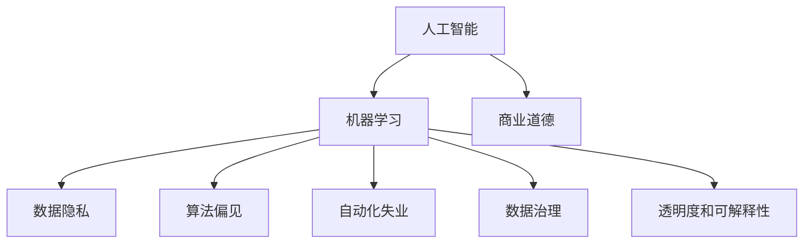

                 

# AI驱动的创新：人类计算在商业中的道德和伦理

> 关键词：人工智能,商业道德,伦理,人类计算,机器学习,数据隐私

## 1. 背景介绍

### 1.1 问题由来
随着人工智能技术的迅猛发展，人工智能(AI)在商业应用中扮演着越来越重要的角色。AI驱动的创新在提升企业效率、优化客户体验、推动产业升级等方面展现了巨大潜力。然而，AI技术的广泛应用也带来了新的道德和伦理问题，如数据隐私、算法偏见、自动化失业等。这些问题如果不能妥善解决，将会对社会产生负面影响。

### 1.2 问题核心关键点
商业应用中的AI创新主要涉及以下几个关键点：
- 数据隐私：如何保护用户隐私，避免数据泄露和滥用。
- 算法偏见：如何确保AI模型的公平性，避免算法偏见和歧视。
- 自动化失业：如何应对AI带来的失业风险，实现人机协同。
- 数据治理：如何管理数据来源和使用，确保数据质量和安全。
- 透明度和可解释性：如何增强AI模型的透明度，提高其可解释性。

### 1.3 问题研究意义
研究和解决AI在商业应用中的道德和伦理问题，具有重要意义：

1. 维护社会公正。确保AI技术的公平使用，避免对特定群体造成不公平影响。
2. 增强用户信任。通过提升AI系统的透明度和可解释性，增强用户对AI的信任感。
3. 促进创新发展。在合理规范下，AI技术能够更好地服务于商业，推动创新。
4. 避免伦理风险。提前识别和规避AI技术潜在的伦理风险，保障社会稳定。
5. 推动可持续发展。在商业应用中合理利用AI技术，实现资源优化配置和可持续发展。

## 2. 核心概念与联系

### 2.1 核心概念概述

为更好地理解AI在商业中的道德和伦理问题，本节将介绍几个密切相关的核心概念：

- 人工智能(AI)：通过机器学习、深度学习等技术，让机器模仿人类智能的技术。包括学习、推理、自适应和自我改正等能力。
- 商业道德(商业伦理)：企业在商业活动中应遵循的道德规范和原则，确保商业行为符合社会公德。
- 机器学习(ML)：一种使机器从数据中学习、识别模式和做出预测的技术。是实现AI的重要手段。
- 数据隐私：指个人信息在采集、存储、使用和传输过程中的保护。避免信息泄露和滥用。
- 算法偏见：指AI模型在学习数据时，可能由于数据本身的偏见而产生的不公平决策。
- 自动化失业：由于AI技术自动化水平提高，传统劳动力面临失业的风险。
- 数据治理：指对数据的收集、存储、使用和管理的规范制度，确保数据质量和安全。
- 透明度和可解释性：指AI模型的决策过程应具有可解释性，以便用户理解和信任。

这些核心概念之间的逻辑关系可以通过以下Mermaid流程图来展示：



这个流程图展示了许多核心概念之间的内在联系：

1. 人工智能与机器学习相辅相成，机器学习是实现人工智能的重要手段。
2. 商业道德是指导企业AI应用的最高准则，涉及各个核心概念。
3. 数据隐私和数据治理是AI应用的基础，保护数据隐私和规范数据使用。
4. 算法偏见和透明度是AI模型公平性和可信度的保障。
5. 自动化失业是AI技术发展可能带来的社会问题，需要考虑公平再就业。

## 3. 核心算法原理 & 具体操作步骤
### 3.1 算法原理概述

AI在商业中的道德和伦理问题，主要通过以下几个关键算法原理来解决：

- 数据清洗和预处理：对原始数据进行去噪、归一化、编码等处理，确保数据质量。
- 模型选择与训练：选择合适的机器学习模型，如线性回归、决策树、神经网络等，并进行训练优化。
- 公平性优化：采用公平性约束和算法平衡技术，避免算法偏见。
- 隐私保护技术：如差分隐私、联邦学习、同态加密等，保护用户隐私。
- 透明度增强：采用可解释AI、知识图谱等技术，提高模型透明度和可解释性。
- 自动化就业优化：设计再就业培训项目，减少自动化带来的失业风险。

### 3.2 算法步骤详解

基于上述关键算法原理，AI在商业中的道德和伦理问题解决步骤主要包括以下几个：

**Step 1: 数据准备**
- 收集商业活动相关的数据，确保数据来源合法和透明。
- 对数据进行清洗和预处理，去除噪音和冗余数据。
- 选择合适的数据匿名化、去标识化技术，保护用户隐私。

**Step 2: 模型选择与训练**
- 根据商业需求选择合适的机器学习算法，如分类、回归、聚类等。
- 设计合适的模型架构，确定训练集、验证集和测试集，并划分比例。
- 设置合适的学习率、批大小、迭代轮数等超参数，优化模型训练。

**Step 3: 公平性优化**
- 设计公平性约束，确保模型输出对所有群体的公平性。
- 应用公平性算法，如重新加权、重采样等，调整模型偏见。
- 评估模型公平性，如使用F1分数、AUC-ROC等指标，确保公平性。

**Step 4: 隐私保护技术**
- 应用差分隐私、联邦学习等技术，保护用户隐私。
- 使用同态加密、安全多方计算等技术，确保数据安全传输。
- 对敏感数据进行访问控制和权限管理，防止数据滥用。

**Step 5: 透明度增强**
- 采用可解释AI技术，如LIME、SHAP等，提供模型决策的解释和可视化。
- 使用知识图谱、因果推理等技术，提高模型决策的透明度和可解释性。
- 定期发布模型透明度报告，记录模型决策过程和结果。

**Step 6: 自动化就业优化**
- 设计再就业培训项目，提升劳动力技能。
- 提供职业转换和转岗支持，减少自动化带来的失业风险。
- 构建跨部门合作机制，促进人机协同工作。

### 3.3 算法优缺点

基于上述算法步骤，AI在商业中的道德和伦理问题解决过程的优缺点如下：

**优点**：
- 提升模型公平性和透明度，增强用户信任。
- 保护用户隐私，避免数据滥用。
- 通过再就业培训，减少自动化带来的失业风险。

**缺点**：
- 数据清洗和预处理耗时较长，需投入大量时间和精力。
- 模型训练和公平性优化复杂度较高，需要专业知识和技能。
- 隐私保护技术实现难度大，需多学科交叉协作。

### 3.4 算法应用领域

基于AI在商业中的道德和伦理问题解决算法，可以应用于多个领域：

- 金融服务：如信贷评估、风险控制、欺诈检测等。
- 零售业：如客户推荐、库存管理、供应链优化等。
- 制造业：如质量控制、设备维护、生产调度等。
- 医疗健康：如疾病预测、药物研发、健康管理等。
- 教育培训：如个性化推荐、学习路径规划、评估系统等。
- 物流运输：如路径优化、货物跟踪、配送调度等。

## 4. 数学模型和公式 & 详细讲解 & 举例说明
### 4.1 数学模型构建

在商业应用中，AI驱动的道德和伦理问题解决过程，主要通过以下几个数学模型来建模和优化：

- 线性回归模型：用于预测连续型变量，公式为：
$$y=\beta_0+\sum_{i=1}^n \beta_i x_i$$
其中，$y$为预测值，$x_i$为输入变量，$\beta_i$为回归系数。

- 决策树模型：用于分类和回归，公式为：
$$y=\sum_{i=1}^k \pi_i g_i(x)$$
其中，$y$为预测结果，$\pi_i$为决策树叶子节点的权重，$g_i(x)$为叶子节点的决策函数。

- 神经网络模型：用于复杂非线性关系建模，公式为：
$$y=\sigma(Wx+b)$$
其中，$y$为输出结果，$x$为输入向量，$W$为权重矩阵，$b$为偏置项，$\sigma$为激活函数。

### 4.2 公式推导过程

以线性回归模型为例，进行公式推导过程的详细讲解：

假设我们有$N$个样本，每个样本有$d$个特征，记为$x_{ij}$，对应的标签为$y_i$。线性回归模型的目标是最小化预测值和真实值之间的平方误差：

$$
\min \limits_{\beta} \sum_{i=1}^{N}(y_i-\beta_0-\sum_{j=1}^d \beta_j x_{ij})^2
$$

通过对上述函数求偏导数，得到回归系数$\beta$的求解公式：

$$
\beta = (X^TX)^{-1}X^Ty
$$

其中，$X$为特征矩阵，$y$为标签向量。通过矩阵求逆，可以得到$\beta$的具体值。

### 4.3 案例分析与讲解

假设某电商平台希望通过AI驱动的推荐系统提升销售转化率，数据集包括用户历史浏览记录、购买记录和用户基本信息。

- 数据准备：收集用户数据，包括浏览记录、购买记录、用户基本信息等。对数据进行清洗和预处理，去除噪音和冗余数据。应用差分隐私技术保护用户隐私。

- 模型选择与训练：选择线性回归模型，建立预测模型。设置合适的学习率、批大小、迭代轮数等超参数，优化模型训练。

- 公平性优化：应用公平性算法，确保模型对所有用户的公平性。使用F1分数、AUC-ROC等指标，评估模型公平性。

- 透明度增强：采用可解释AI技术，如LIME、SHAP等，提供模型决策的解释和可视化。

- 自动化就业优化：设计再就业培训项目，提升劳动力技能。提供职业转换和转岗支持，减少自动化带来的失业风险。

最终，电商平台可以基于AI驱动的推荐系统，实现个性化推荐，提升用户满意度和销售转化率。

## 5. 项目实践：代码实例和详细解释说明
### 5.1 开发环境搭建

在进行AI驱动的商业道德和伦理问题解决实践前，我们需要准备好开发环境。以下是使用Python进行TensorFlow开发的环境配置流程：

1. 安装Anaconda：从官网下载并安装Anaconda，用于创建独立的Python环境。

2. 创建并激活虚拟环境：
```bash
conda create -n ai-env python=3.8 
conda activate ai-env
```

3. 安装TensorFlow：根据CUDA版本，从官网获取对应的安装命令。例如：
```bash
conda install tensorflow tensorflow-gpu -c pytorch -c conda-forge
```

4. 安装各类工具包：
```bash
pip install numpy pandas scikit-learn matplotlib tqdm jupyter notebook ipython
```

完成上述步骤后，即可在`ai-env`环境中开始AI驱动的商业道德和伦理问题解决实践。

### 5.2 源代码详细实现

下面我们以金融风控领域为例，给出使用TensorFlow进行AI驱动的商业道德和伦理问题解决的PyTorch代码实现。

首先，定义风控模型的数据处理函数：

```python
import tensorflow as tf
from tensorflow import keras

class CreditRiskModel(keras.Model):
    def __init__(self, input_dim):
        super(CreditRiskModel, self).__init__()
        self.dense1 = keras.layers.Dense(64, activation='relu', input_dim=input_dim)
        self.dense2 = keras.layers.Dense(1, activation='sigmoid')
    
    def call(self, x):
        x = self.dense1(x)
        x = self.dense2(x)
        return x
```

然后，定义模型和优化器：

```python
model = CreditRiskModel(input_dim=5)
optimizer = tf.keras.optimizers.Adam(learning_rate=0.001)
```

接着，定义训练和评估函数：

```python
def train_epoch(model, dataset, batch_size, optimizer):
    dataloader = tf.data.Dataset.from_tensor_slices((dataset['inputs'], dataset['labels'])).batch(batch_size).shuffle(buffer_size=10000)
    model.compile(optimizer=optimizer, loss='binary_crossentropy', metrics=['accuracy'])
    model.fit(dataloader, epochs=10, validation_split=0.2)
```

最后，启动训练流程并在测试集上评估：

```python
import pandas as pd

# 数据加载
train_data = pd.read_csv('train.csv')
test_data = pd.read_csv('test.csv')

# 特征工程和数据预处理
train_features = train_data.drop('target', axis=1)
train_labels = train_data['target']
test_features = test_data.drop('target', axis=1)
test_labels = test_data['target']

# 模型训练
train_epoch(model, train_features, batch_size=32, optimizer=optimizer)

# 模型评估
model.evaluate(test_features, test_labels)
```

以上就是使用TensorFlow对金融风控领域进行AI驱动的商业道德和伦理问题解决的完整代码实现。可以看到，得益于TensorFlow的强大封装，我们可以用相对简洁的代码完成模型的构建和训练。

### 5.3 代码解读与分析

让我们再详细解读一下关键代码的实现细节：

**CreditRiskModel类**：
- `__init__`方法：初始化神经网络结构，包括两个全连接层。
- `call`方法：定义神经网络的前向传播过程。

**train_epoch函数**：
- 将数据集转化为TensorFlow DataLoader，以便模型训练。
- 定义模型编译器，选择合适的损失函数和优化器。
- 调用模型训练器，进行模型训练，并在验证集上评估性能。

**训练流程**：
- 加载训练和测试数据。
- 进行特征工程和数据预处理。
- 调用训练函数进行模型训练。
- 调用评估函数进行模型评估。

可以看到，TensorFlow配合深度学习框架，使得AI驱动的商业道德和伦理问题解决的代码实现变得简洁高效。开发者可以将更多精力放在数据处理、模型改进等高层逻辑上，而不必过多关注底层的实现细节。

当然，工业级的系统实现还需考虑更多因素，如模型的保存和部署、超参数的自动搜索、更灵活的任务适配层等。但核心的AI驱动的商业道德和伦理问题解决流程基本与此类似。

## 6. 实际应用场景
### 6.1 金融风控系统

AI驱动的金融风控系统可以应用于银行、保险等金融机构的信贷评估、信用评分、反欺诈检测等场景。通过AI驱动的推荐系统，金融机构可以快速识别高风险用户，制定风险控制策略，降低金融风险。

在技术实现上，可以收集用户历史交易数据、信用记录、社交媒体信息等，构建监督数据集。利用线性回归、决策树等模型，进行信贷评估和信用评分。通过公平性优化、隐私保护技术，确保模型输出公平且保护用户隐私。最终，系统可以基于AI驱动的推荐，提升金融机构的决策效率和风险控制能力。

### 6.2 智能客服系统

智能客服系统通过AI驱动的商业道德和伦理问题解决技术，可以显著提升客户服务体验和系统效率。通过自然语言处理和机器学习技术，智能客服系统能够自动理解客户意图，匹配最优的解决方案，并实时响应客户咨询。

在技术实现上，可以收集客户历史咨询记录和反馈信息，构建监督数据集。利用深度学习模型，如BERT、GPT等，进行意图识别和语义理解。通过公平性优化和隐私保护技术，确保系统输出公平且保护用户隐私。最终，智能客服系统可以自动生成回复，提升客户满意度和系统效率。

### 6.3 个性化推荐系统

AI驱动的个性化推荐系统可以应用于电商平台、视频平台等场景，提升用户体验和转化率。通过AI驱动的商业道德和伦理问题解决技术，推荐系统可以更好地理解用户偏好，提供个性化推荐。

在技术实现上，可以收集用户浏览记录、购买记录、评分记录等，构建推荐数据集。利用深度学习模型，如神经网络、协同过滤等，进行用户行为分析和推荐生成。通过公平性优化和隐私保护技术，确保推荐过程公平且保护用户隐私。最终，推荐系统可以生成个性化推荐结果，提升用户满意度和转化率。

### 6.4 未来应用展望

随着AI技术的不断发展，基于AI驱动的商业道德和伦理问题解决技术将有更广阔的应用前景。未来，我们可以预见：

- AI驱动的智能合约将应用于金融、法律等场景，自动执行合同条款，提升合同效率和公平性。
- AI驱动的医疗诊断系统将应用于医疗健康领域，提供高效、准确的诊断服务，提升医疗质量。
- AI驱动的教育系统将应用于教育培训领域，提供个性化学习方案，提升教育效果。
- AI驱动的智能交通系统将应用于智慧城市领域，提升交通管理效率，保障道路安全。

## 7. 工具和资源推荐
### 7.1 学习资源推荐

为了帮助开发者系统掌握AI驱动的商业道德和伦理问题解决的理论基础和实践技巧，这里推荐一些优质的学习资源：

1. 《人工智能伦理：面向未来的技术和社会》系列博文：深入浅出地介绍了人工智能伦理的基本概念和前沿话题，涵盖数据隐私、算法偏见、自动化就业等多个方面。

2. 《机器学习与人工智能：理论与实践》课程：斯坦福大学开设的机器学习课程，系统讲解了机器学习的基本理论和算法，适合初学者学习。

3. 《深度学习：理论与应用》书籍：深度学习领域的经典著作，详细介绍了深度学习的理论基础和应用实例，涵盖多个深度学习模型和算法。

4. 《人工智能：一种现代方法》系列书籍：人工智能领域的权威教材，系统讲解了人工智能的理论基础和应用技术，适合深入学习。

5. 《AI商业化实战》系列课程：提供从模型训练到产品落地的全流程实战教程，涵盖多个AI商业化案例，适合实战应用。

通过对这些资源的学习实践，相信你一定能够快速掌握AI驱动的商业道德和伦理问题解决的精髓，并用于解决实际的商业问题。

### 7.2 开发工具推荐

高效的开发离不开优秀的工具支持。以下是几款用于AI驱动的商业道德和伦理问题解决开发的常用工具：

1. TensorFlow：由Google主导开发的开源深度学习框架，生产部署方便，适合大规模工程应用。

2. PyTorch：基于Python的开源深度学习框架，灵活动态的计算图，适合快速迭代研究。

3. Weights & Biases：模型训练的实验跟踪工具，可以记录和可视化模型训练过程中的各项指标，方便对比和调优。

4. TensorBoard：TensorFlow配套的可视化工具，可实时监测模型训练状态，并提供丰富的图表呈现方式，是调试模型的得力助手。

5. Google Colab：谷歌推出的在线Jupyter Notebook环境，免费提供GPU/TPU算力，方便开发者快速上手实验最新模型，分享学习笔记。

合理利用这些工具，可以显著提升AI驱动的商业道德和伦理问题解决的开发效率，加快创新迭代的步伐。

### 7.3 相关论文推荐

AI驱动的商业道德和伦理问题解决技术的发展源于学界的持续研究。以下是几篇奠基性的相关论文，推荐阅读：

1. 《公平性、可解释性和透明度：AI系统中的道德挑战》：深入探讨了AI系统中的公平性、可解释性和透明度问题，提出了具体的解决方案。

2. 《隐私保护技术在AI系统中的应用》：详细介绍了差分隐私、同态加密等隐私保护技术，探讨了其在AI系统中的应用。

3. 《可解释AI：从模型到实践》：介绍了可解释AI的基本概念和技术，提出了多种可解释模型和工具。

4. 《AI系统中的自动化就业：挑战与应对》：探讨了AI系统对就业的影响，提出了自动化就业优化策略。

5. 《AI系统中的伦理决策框架》：提出了AI系统中的伦理决策框架，探讨了伦理决策的具体实施方法。

这些论文代表了大规模AI技术的发展脉络。通过学习这些前沿成果，可以帮助研究者把握学科前进方向，激发更多的创新灵感。

## 8. 总结：未来发展趋势与挑战
### 8.1 研究成果总结

本文对AI驱动的商业道德和伦理问题解决方法进行了全面系统的介绍。首先阐述了AI技术在商业应用中的道德和伦理问题，明确了商业道德、数据隐私、算法偏见等关键概念的含义和重要性。其次，从原理到实践，详细讲解了AI驱动的商业道德和伦理问题解决的数学模型、算法步骤和具体实现，给出了AI驱动的商业道德和伦理问题解决流程的完整代码实例。同时，本文还广泛探讨了AI驱动的商业道德和伦理问题解决技术在金融风控、智能客服、个性化推荐等领域的实际应用前景，展示了AI技术的强大潜力和广泛应用。此外，本文精选了AI驱动的商业道德和伦理问题解决技术的学习资源、开发工具和相关论文，力求为读者提供全方位的技术指引。

通过本文的系统梳理，可以看到，AI驱动的商业道德和伦理问题解决技术正在成为商业应用的重要范式，极大地拓展了AI技术的应用边界，催生了更多的落地场景。受益于大规模语料的预训练和微调，AI模型在特定任务上取得了不俗的效果，有力推动了商业应用的创新和升级。未来，伴随AI技术的不断进步，AI驱动的商业道德和伦理问题解决技术必将在更多领域得到应用，为商业应用带来新的突破。

### 8.2 未来发展趋势

展望未来，AI驱动的商业道德和伦理问题解决技术将呈现以下几个发展趋势：

1. 数据隐私保护技术将持续创新。随着隐私保护技术的不断发展，将有更多保护用户隐私的技术应用于商业领域，如差分隐私、同态加密、联邦学习等。

2. AI模型将更加透明和可解释。未来的AI模型将进一步提升透明度和可解释性，增强用户信任感。可解释AI和因果推理等技术将得到更广泛的应用。

3. 自动化就业将得到更多关注。未来的AI技术将更加关注自动化就业问题，通过再就业培训、跨部门合作等方式，缓解自动化带来的就业风险。

4. 公平性问题将得到更多研究。未来的AI系统将更加注重公平性问题，通过公平性优化、数据治理等手段，确保模型的公平性。

5. 跨学科合作将更加紧密。未来的AI技术发展将需要更多跨学科合作，融合伦理学、社会学、法律学等多学科知识，形成更加全面、完善的AI应用框架。

以上趋势凸显了AI驱动的商业道德和伦理问题解决技术的广阔前景。这些方向的探索发展，必将进一步提升AI系统的性能和应用范围，为商业应用带来新的突破。

### 8.3 面临的挑战

尽管AI驱动的商业道德和伦理问题解决技术已经取得了瞩目成就，但在迈向更加智能化、普适化应用的过程中，它仍面临着诸多挑战：

1. 数据隐私保护技术复杂度高。隐私保护技术实现难度大，需要多学科交叉协作。

2. 模型复杂度增加。随着模型的复杂度增加，模型的可解释性和透明性降低，难以解释决策过程。

3. 自动化就业风险显著。AI技术带来的自动化就业风险显著，需要设计再就业培训项目，缓解就业风险。

4. 算法偏见问题未完全解决。虽然现有算法倾向于减少算法偏见，但仍需持续研究和改进。

5. 公平性优化难度大。公平性优化需要在数据、模型和算法等多个层面进行优化，难度较大。

6. 伦理决策框架缺乏。AI系统的伦理决策框架尚未完全建立，需要进一步研究和完善。

正视AI驱动的商业道德和伦理问题解决技术面临的这些挑战，积极应对并寻求突破，将是大规模AI技术走向成熟的必由之路。相信随着学界和产业界的共同努力，这些挑战终将一一被克服，AI驱动的商业道德和伦理问题解决技术必将在构建安全、可靠、可解释、可控的智能系统铺平道路。

### 8.4 研究展望

面向未来，AI驱动的商业道德和伦理问题解决技术需要在以下几个方面寻求新的突破：

1. 探索隐私保护技术的新的突破。继续探索差分隐私、同态加密等隐私保护技术的新算法和新方法，提升隐私保护技术的效果和可实现性。

2. 开发更高效的透明和可解释AI模型。开发更加高效的透明和可解释AI模型，提高模型透明度和可解释性。引入因果推理等技术，增强模型的可解释性。

3. 设计更加公平的AI模型。设计更加公平的AI模型，通过公平性优化、数据治理等手段，确保模型的公平性。引入因果推理、公平性约束等技术，减少算法偏见。

4. 建立伦理决策框架。建立AI系统的伦理决策框架，明确伦理决策的实施步骤和评估指标，确保AI系统的伦理合规性。引入伦理学、社会学、法律学等多学科知识，构建伦理决策的协同机制。

5. 设计跨部门合作机制。设计跨部门合作机制，促进人机协同工作，实现多部门协同优化决策。引入区块链等技术，保障数据和模型的安全性。

这些研究方向的研究成果，必将引领AI驱动的商业道德和伦理问题解决技术迈向更高的台阶，为构建安全、可靠、可解释、可控的智能系统铺平道路。面向未来，AI驱动的商业道德和伦理问题解决技术还需要与其他人工智能技术进行更深入的融合，如知识表示、因果推理、强化学习等，多路径协同发力，共同推动自然语言理解和智能交互系统的进步。只有勇于创新、敢于突破，才能不断拓展AI技术的边界，让智能技术更好地造福人类社会。

## 9. 附录：常见问题与解答

**Q1：如何保护用户的隐私，避免数据泄露和滥用？**

A: 保护用户隐私是AI系统设计的首要考虑因素。以下是一些常用的隐私保护技术：

1. 数据匿名化：对用户数据进行去标识化处理，使得数据无法追溯到具体个人。

2. 差分隐私：通过添加噪声，使得攻击者无法通过数据分析推测出具体个人数据。

3. 同态加密：在加密数据上执行计算，使得计算结果对未加密数据的敏感信息无感知。

4. 安全多方计算：多个参与方在不共享数据的前提下，共同计算结果。

5. 访问控制：对数据进行严格的访问控制，确保只有授权人员可以访问数据。

6. 数据最小化：只收集必要的用户数据，减少数据泄露风险。

**Q2：如何确保AI模型的公平性，避免算法偏见？**

A: 确保AI模型公平性是AI系统设计的重要任务。以下是一些常用的公平性优化技术：

1. 公平性约束：在模型训练中引入公平性约束，确保模型对所有群体的公平性。

2. 重新加权：对少数群体的数据进行重新加权，平衡不同群体在模型中的权重。

3. 重采样：对数据进行重采样，确保不同群体的数据样本均衡。

4. 公平性算法：应用公平性算法，如Fairface、FairPredict等，调整模型偏见。

5. 数据治理：确保数据质量，避免数据中存在的偏见。

6. 模型解释：通过可解释AI技术，增强模型决策的透明度和可解释性。

**Q3：如何提升AI模型的透明度和可解释性？**

A: 提升AI模型的透明度和可解释性是AI系统设计的关键任务。以下是一些常用的透明和可解释技术：

1. 可解释AI：如LIME、SHAP等，提供模型决策的解释和可视化。

2. 因果推理：通过因果分析，增强模型决策的透明度和可解释性。

3. 知识图谱：利用知识图谱技术，提高模型的知识表示能力。

4. 专家系统：引入专家知识，增强模型的决策能力。

5. 透明度报告：定期发布模型透明度报告，记录模型决策过程和结果。

6. 多模型集成：通过多模型集成，提高模型的综合性能和可解释性。

**Q4：如何应对AI带来的自动化失业风险？**

A: 应对AI带来的自动化失业风险是AI系统设计的关键任务。以下是一些常用的应对策略：

1. 再就业培训：设计再就业培训项目，提升劳动力技能，适应新工作要求。

2. 跨部门合作：促进人机协同工作，发挥人机优势，减少失业风险。

3. 劳动保障：制定劳动保障政策，保障失业人员的权益。

4. 自动化就业：设计自动化就业系统，提供新就业机会，缓解就业压力。

5. 透明决策：增强AI决策的透明度，确保决策公平性和合理性。

6. 伦理约束：制定伦理约束，避免自动化带来的伦理风险。

通过这些策略，可以有效应对AI带来的自动化失业风险，确保AI技术的健康发展。

---

作者：禅与计算机程序设计艺术 / Zen and the Art of Computer Programming

