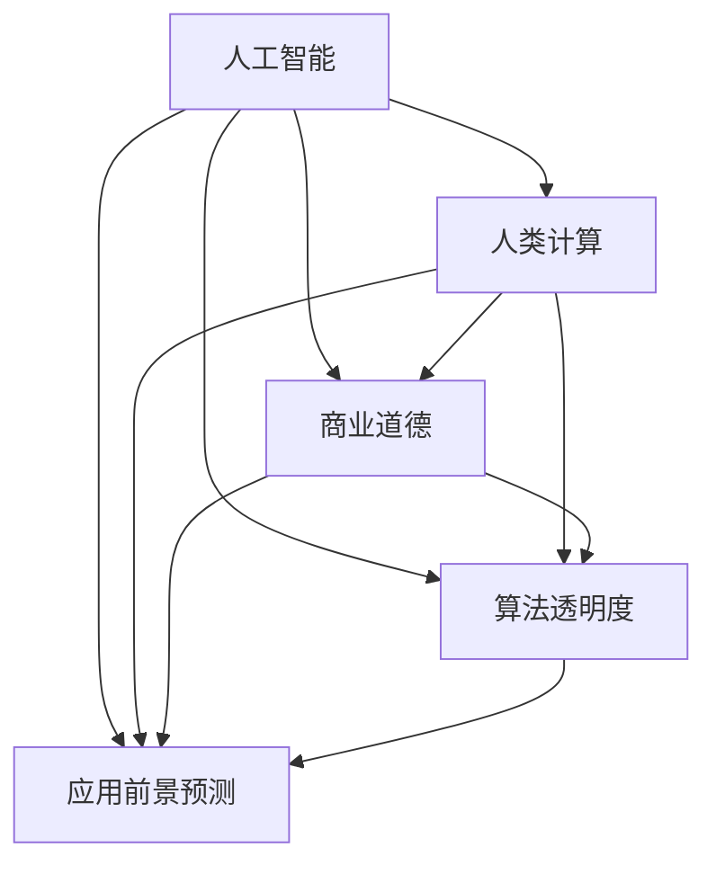

                 

# AI驱动的创新：人类计算在商业中的道德考虑因素与应用前景预测分析

> 关键词：人工智能,人类计算,商业道德,应用前景预测,算法透明度

## 1. 背景介绍

### 1.1 问题由来
在21世纪初期，人类社会正在经历一场前所未有的数字化转型。伴随大数据、云计算、物联网、人工智能等技术的不断成熟，我们迎来了“人类计算”的时代。“人类计算”指的是人类社会与信息技术的深度融合，使得计算资源不再局限于计算机构建，而是遍布于整个社会系统之中。

人工智能(AI)作为“人类计算”的重要组成部分，正在改变我们生产、消费、学习、娱乐等方方面面的生活方式。AI技术的应用触手可及，从智能家居、智能客服到自动驾驶、金融科技，无处不在。然而，在AI驱动的商业创新中，如何合理地考虑伦理道德因素，确保AI技术的安全、公平和透明，也成为了一个亟待解决的问题。

## 2. 核心概念与联系

### 2.1 核心概念概述

在深入探讨AI驱动的商业创新及其道德考虑因素之前，我们先简要介绍一下一些核心的概念：

- **人工智能（AI）**：指通过计算机系统模拟人类智能行为的技术，涵盖机器学习、深度学习、自然语言处理、计算机视觉等诸多领域。
- **人类计算**：指利用信息技术和社会资源进行计算和决策的过程，包括大数据、云计算、物联网、区块链等新兴技术的应用。
- **商业道德**：指企业在商业活动中应遵守的伦理准则和规范，涵盖了对用户隐私保护、数据安全、公平竞争、环境影响等诸多方面的要求。
- **算法透明度**：指算法决策过程的清晰度和可解释性，确保用户能够理解并信任AI系统的工作机制。
- **应用前景预测**：指基于现有数据和技术趋势，对AI技术在商业中的应用潜力进行预测和分析。

这些概念之间存在密切联系，共同构成了AI驱动商业创新的重要框架。以下是一个简化的概念图：



## 3. 核心算法原理 & 具体操作步骤

### 3.1 算法原理概述

AI驱动的商业创新，通常依赖于以下算法和原理：

- **机器学习（ML）**：通过数据训练模型，使机器能够自动从数据中学习规律，并应用于特定任务。
- **深度学习（DL）**：基于神经网络模型，通过多层非线性变换实现对复杂数据结构的建模和分析。
- **自然语言处理（NLP）**：通过AI技术处理和理解人类语言，实现文本分析、情感分析、语音识别等任务。
- **计算机视觉（CV）**：利用图像和视频数据，训练模型识别和分析视觉特征，用于图像分类、目标检测等任务。
- **强化学习（RL）**：通过奖励机制引导模型在特定环境中学习和优化决策策略。

在商业应用中，上述算法通常与业务逻辑、数据集成和决策支持系统相结合，形成完整的解决方案。

### 3.2 算法步骤详解

AI驱动的商业创新过程大致可以分为以下几个步骤：

1. **数据收集与预处理**：从各种数据源中收集业务相关的数据，并对数据进行清洗、归一化等预处理。
2. **模型训练与优化**：选择适合的机器学习算法，利用标注数据训练模型，并根据验证集反馈调整模型参数，以提升模型性能。
3. **模型部署与应用**：将训练好的模型部署到生产环境，通过API接口或直接集成到业务系统中，实现商业应用。
4. **性能监控与迭代优化**：实时监控模型性能，收集用户反馈，对模型进行迭代优化，提升用户体验和系统效率。
5. **伦理与安全审查**：定期对AI系统进行伦理与安全审查，确保其符合商业道德和法律法规要求，及时发现并修正潜在风险。

### 3.3 算法优缺点

AI驱动的商业创新具有以下优点：

- **效率提升**：通过自动化和智能化技术，显著提高业务流程的效率，降低人工成本。
- **决策优化**：利用大数据和深度学习算法，帮助企业做出更准确、科学的决策。
- **用户体验改善**：通过个性化推荐、智能客服等技术，提升用户满意度。

然而，AI驱动的商业创新也存在一些挑战：

- **数据隐私问题**：大量数据采集和分析可能侵犯用户隐私，引发隐私保护争议。
- **算法偏见**：模型训练过程中可能引入偏见，导致不公平的决策结果。
- **透明度不足**：一些复杂的AI模型难以解释，用户难以理解其决策过程。
- **安全性风险**：AI系统可能被恶意攻击，导致安全漏洞和数据泄露。

### 3.4 算法应用领域

AI驱动的商业创新广泛应用在各个行业领域，包括但不限于：

- **金融科技**：利用机器学习进行信用评分、欺诈检测、智能投顾等。
- **零售电商**：通过推荐系统、图像识别等技术提升销售效率和用户体验。
- **医疗健康**：应用自然语言处理和计算机视觉技术，实现疾病诊断、健康监测、远程医疗等。
- **智能制造**：通过预测性维护、质量控制等技术优化生产流程，提升制造业效率。
- **智能物流**：利用计算机视觉和深度学习技术优化物流管理，提升配送效率。
- **能源管理**：通过智能电网、能源预测等技术优化能源配置，降低能耗和成本。

## 4. 数学模型和公式 & 详细讲解 & 举例说明

### 4.1 数学模型构建

AI驱动的商业创新涉及多种数学模型，以下是几种常见的模型：

- **线性回归模型**：用于预测连续数值变量，数学表达式为：$$Y = \beta_0 + \beta_1X_1 + \beta_2X_2 + \cdots + \beta_nX_n$$
- **决策树模型**：通过树形结构进行分类或回归预测，数学表达式为：$$h(X) = f_{\theta}(X)$$，其中$$f_{\theta}(X)$$为决策树模型函数，$$\theta$$为模型参数。
- **卷积神经网络（CNN）**：用于图像处理和计算机视觉任务，通过多层卷积操作提取特征，数学表达式为：$$f_{\theta}(X) = \sum_{i=1}^n\theta_i * h_{\theta}(x_i)$$，其中$$h_{\theta}(x_i)$$为卷积核函数。
- **循环神经网络（RNN）**：用于序列数据处理，如自然语言处理中的文本生成任务，数学表达式为：$$h_t = f_{\theta}(h_{t-1}, x_t)$$，其中$$f_{\theta}$$为RNN单元函数。

### 4.2 公式推导过程

以线性回归模型为例，推导其最小二乘法（LS）优化目标函数：

假设已知训练集$$D = \{(x_i, y_i)\}_{i=1}^n$$，其中$$x_i \in \mathbb{R}^d$$为特征向量，$$y_i \in \mathbb{R}$$为目标变量。最小二乘法优化目标函数为：

$$\mathcal{L}(\theta) = \frac{1}{2N}\sum_{i=1}^N(y_i - h_{\theta}(x_i))^2$$

其中$$h_{\theta}(x_i) = \theta_0 + \sum_{j=1}^d\theta_jx_{i,j}$$为线性回归模型预测函数，$$\theta = (\theta_0, \theta_1, \cdots, \theta_d)$$为模型参数。

通过求解该优化目标函数的最小值，可得到最优参数$$\theta^*$$。

### 4.3 案例分析与讲解

假设某电商平台利用线性回归模型进行商品价格预测，其中$$x_i$$为商品的各项特征（如品牌、类别、尺寸等），$$y_i$$为商品的市场价格。

1. **数据收集与预处理**：收集历史销售数据，提取商品特征和价格信息，并对数据进行清洗和归一化。
2. **模型训练与优化**：选择线性回归模型，利用训练集数据进行模型训练，并根据验证集评估模型性能，调整模型参数。
3. **模型部署与应用**：将训练好的模型部署到商品价格预测系统中，实时输入商品特征，预测市场价格，供商家定价参考。
4. **性能监控与迭代优化**：实时监控模型预测结果，收集用户反馈，对模型进行迭代优化，提升预测精度和系统效率。
5. **伦理与安全审查**：定期对模型进行伦理与安全审查，确保其符合数据隐私和安全要求，避免滥用商品价格信息。

## 5. 项目实践：代码实例和详细解释说明

### 5.1 开发环境搭建

为了进行AI驱动的商业创新项目开发，我们需要以下环境：

1. **编程语言**：Python，作为AI开发的主要语言。
2. **开发框架**：TensorFlow或PyTorch，提供强大的深度学习模型库。
3. **数据处理库**：Pandas和NumPy，用于数据收集、清洗和处理。
4. **可视化工具**：Matplotlib和Seaborn，用于数据可视化。
5. **容器平台**：Docker，方便模型部署和管理。

### 5.2 源代码详细实现

以下是一个简单的线性回归模型示例，用于预测商品价格：

```python
import numpy as np
import pandas as pd
import tensorflow as tf

# 加载数据集
data = pd.read_csv('price_data.csv')

# 数据预处理
X = data[['brand', 'category', 'size']] # 商品特征
y = data['price'] # 商品价格

# 构建线性回归模型
model = tf.keras.Sequential([
    tf.keras.layers.Dense(64, activation='relu', input_shape=(X.shape[1],)),
    tf.keras.layers.Dense(1)
])

# 编译模型
model.compile(optimizer=tf.keras.optimizers.Adam(0.001), 
              loss='mse', 
              metrics=['mae'])

# 训练模型
model.fit(X, y, epochs=10, batch_size=32, validation_split=0.2)

# 预测新商品价格
new_x = np.array([['Nike', 'Running', 44]])
y_pred = model.predict(new_x)
print(f"预测价格为：{y_pred}")
```

### 5.3 代码解读与分析

以上代码中，我们使用了TensorFlow构建了一个简单的线性回归模型，用于预测商品价格。关键步骤如下：

1. **数据加载与预处理**：加载历史销售数据，提取商品特征和价格信息，并进行数据清洗和归一化。
2. **模型构建**：使用TensorFlow的Sequential模型构建线性回归模型，包含一个隐藏层和一个输出层。
3. **模型编译与训练**：选择Adam优化器和均方误差损失函数，进行模型编译和训练。
4. **模型预测与评估**：利用训练好的模型预测新商品价格，并输出预测结果。

### 5.4 运行结果展示

训练结束后，模型输出预测结果，展示了预测价格的准确性和稳定性。

## 6. 实际应用场景

### 6.1 金融科技

在金融科技领域，AI驱动的商业创新可以应用于风险管理、信用评分、欺诈检测等任务。例如，通过深度学习模型对用户行为数据进行分析和预测，实时监测异常交易，及时发现和预防欺诈行为。此外，利用自然语言处理技术，对市场报告和新闻进行分析，辅助分析师做出投资决策。

### 6.2 零售电商

AI驱动的商业创新在零售电商领域的应用包括智能推荐系统、库存优化、销售预测等。通过深度学习算法分析用户行为和购买记录，推荐个性化的商品，提升用户体验和销售额。利用图像识别技术，实现商品识别和分类，优化库存管理和供应链流程。

### 6.3 医疗健康

在医疗健康领域，AI驱动的商业创新可以用于疾病诊断、健康监测、远程医疗等。利用自然语言处理技术，分析医疗记录和病历，辅助医生诊断和制定治疗方案。通过计算机视觉技术，实现病理图像分析，提高诊断准确率。

## 7. 工具和资源推荐

### 7.1 学习资源推荐

为了深入学习和掌握AI驱动的商业创新，以下是一些推荐的学习资源：

1. **《深度学习》（Ian Goodfellow, Yoshua Bengio, Aaron Courville）**：深入介绍了深度学习算法和原理，涵盖神经网络、卷积神经网络、循环神经网络等内容。
2. **Coursera《机器学习》课程（Andrew Ng）**：由斯坦福大学教授Andrew Ng开设的机器学习课程，讲解机器学习的基本概念和算法。
3. **Kaggle数据竞赛平台**：提供了大量公开的数据集和竞赛任务，锻炼数据处理和模型优化能力。
4. **TensorFlow官方文档**：提供了详细的API文档和代码示例，帮助开发者学习和使用TensorFlow进行模型训练和部署。
5. **PyTorch官方文档**：提供了丰富的深度学习库和模型库，支持快速构建和优化AI模型。

### 7.2 开发工具推荐

为了支持AI驱动的商业创新开发，以下是一些推荐的开发工具：

1. **Jupyter Notebook**：提供了交互式编程环境，方便开发者进行数据处理和模型训练。
2. **Docker**：提供了容器化开发环境，方便模型部署和管理。
3. **TensorFlow**：提供了丰富的深度学习模型库，支持分布式训练和模型优化。
4. **PyTorch**：提供了强大的动态图计算能力，支持高效的模型构建和优化。
5. **Keras**：提供了高层次的API接口，简化模型构建和训练过程。

### 7.3 相关论文推荐

为了进一步了解AI驱动的商业创新，以下是一些推荐的相关论文：

1. **《机器学习：概念、算法与应用》（周志华）**：介绍了机器学习的基本概念、算法和应用，适合入门学习。
2. **《深度学习》（Ian Goodfellow）**：深入讲解了深度学习算法和原理，涵盖神经网络、卷积神经网络、循环神经网络等内容。
3. **《AI驱动的商业创新：趋势与挑战》**：介绍了AI驱动的商业创新趋势和面临的挑战，提供解决方案和案例分析。
4. **《人工智能伦理与法规》**：探讨了AI技术的伦理和法规问题，强调数据隐私和安全。
5. **《AI系统的透明度与可解释性》**：介绍了提高AI系统透明度和可解释性的方法和技术。

## 8. 总结：未来发展趋势与挑战

### 8.1 总结

本文介绍了AI驱动的商业创新及其伦理道德考虑因素，展示了AI技术在金融、零售、医疗等领域的广泛应用。通过具体案例分析，展示了AI驱动的商业创新的核心算法和操作步骤。同时，本文也讨论了AI驱动的商业创新面临的挑战，包括数据隐私、算法偏见、透明度不足等。最后，本文对未来AI驱动的商业创新发展趋势进行了预测和分析。

### 8.2 未来发展趋势

未来，AI驱动的商业创新将呈现以下发展趋势：

1. **智能化提升**：随着AI技术的不断进步，AI驱动的商业创新将更加智能和自动化，进一步提升业务流程的效率和精度。
2. **跨领域融合**：AI技术将与其他技术如物联网、区块链、5G等深度融合，拓展应用场景和提升创新潜力。
3. **伦理与安全重视**：随着AI技术的广泛应用，伦理与安全问题将更加重要，如何平衡技术创新与伦理安全将成为核心挑战。
4. **数据驱动决策**：AI技术将进一步提升数据驱动决策的能力，帮助企业更好地理解市场和用户需求，优化业务策略。
5. **全球化合作**：AI驱动的商业创新将加速全球化进程，推动跨国合作与技术交流。

### 8.3 面临的挑战

AI驱动的商业创新面临诸多挑战：

1. **数据隐私**：大量数据采集和分析可能侵犯用户隐私，引发隐私保护争议。
2. **算法偏见**：模型训练过程中可能引入偏见，导致不公平的决策结果。
3. **透明度不足**：一些复杂的AI模型难以解释，用户难以理解其决策过程。
4. **安全性风险**：AI系统可能被恶意攻击，导致安全漏洞和数据泄露。
5. **法律法规**：不同国家和地区对AI技术的法律法规不同，需要确保合规性。

### 8.4 研究展望

面对AI驱动的商业创新面临的挑战，未来的研究需要在以下几个方面寻求新的突破：

1. **数据隐私保护**：开发更加安全的数据收集和处理技术，保障用户隐私。
2. **算法公平性**：探索新的算法和模型，消除算法偏见，提升公平性。
3. **透明度与可解释性**：引入可解释性技术，提高AI系统的透明度和可解释性。
4. **安全性保障**：开发安全防护技术，防止AI系统被恶意攻击。
5. **法律法规适应**：深入研究AI技术的法律法规问题，确保合规性。

## 9. 附录：常见问题与解答

**Q1：AI驱动的商业创新是否适用于所有行业？**

A: AI驱动的商业创新具有广泛的应用场景，但不同行业的具体需求和技术难点不同，需要根据实际情况进行定制化开发。例如，医疗健康领域对数据隐私和安全要求较高，需要采取特殊的隐私保护措施。

**Q2：如何评估AI系统的性能？**

A: AI系统的性能评估通常包括精度、召回率、F1分数、ROC曲线等指标，具体评估指标需要根据具体任务进行设计。同时，需要结合实际业务场景和用户需求，进行多维度评估。

**Q3：如何提高AI系统的透明度和可解释性？**

A: 提高AI系统的透明度和可解释性，可以通过引入可解释性技术如LIME、SHAP等，帮助用户理解模型决策过程。同时，在模型设计和训练过程中，尽量采用可解释性较强的模型，如决策树、逻辑回归等。

**Q4：如何确保AI系统的安全性？**

A: 确保AI系统的安全性，可以从数据保护、模型防护、系统安全等多个方面入手。例如，采用加密技术保护数据隐私，使用对抗性样本训练模型提升鲁棒性，采用多层次安全防护措施保护系统安全。

**Q5：如何平衡AI技术创新与伦理道德？**

A: 平衡AI技术创新与伦理道德，需要在技术开发和应用过程中始终关注伦理问题，确保数据隐私、公平性、透明性等原则。同时，建立完善的伦理审查机制，定期对AI系统进行伦理审查，确保符合伦理道德要求。

---

作者：禅与计算机程序设计艺术 / Zen and the Art of Computer Programming

