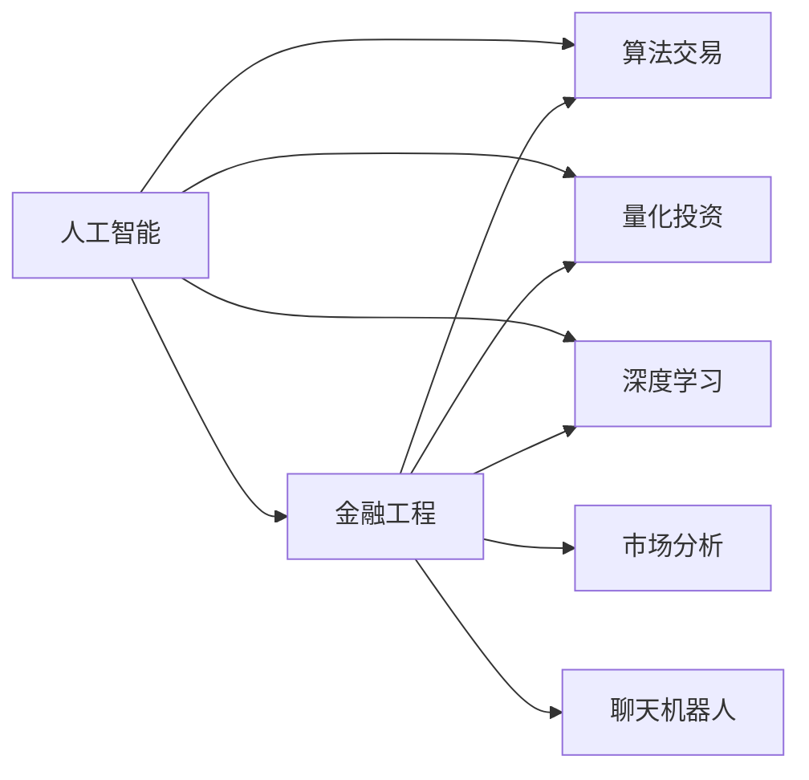

                 

# AI驱动的创新：人类计算在金融领域的作用

> 关键词：人工智能,人类计算,金融领域,金融工程,算法交易,风险管理,市场分析

## 1. 背景介绍

### 1.1 问题由来
在金融行业，人工智能(AI)技术的应用正在引发一场颠覆性的变革。传统金融行业长期以来依赖于经验丰富的专业人士，以手工和半自动化的方式完成复杂的决策过程。然而，随着数据的爆炸性增长和计算能力的快速提升，AI技术特别是人工智能计算在金融领域的应用，正在大幅提升决策效率、降低运营成本、优化风险管理等方面，展现出巨大的潜力和应用前景。

### 1.2 问题核心关键点
人工智能计算在金融领域的应用，主要集中在以下四个方面：

1. **算法交易**：利用AI算法进行高频交易，实现自动化、程序化的交易决策。
2. **风险管理**：基于深度学习和量化模型，实时监测和评估市场风险，进行风险控制和资产配置。
3. **市场分析**：通过大数据和机器学习技术，分析市场趋势和投资机会，提供精准的预测和建议。
4. **客户服务**：利用自然语言处理(NLP)和聊天机器人，提供个性化的金融咨询服务，提升客户体验。

### 1.3 问题研究意义
研究人工智能计算在金融领域的作用，对于提升金融机构的效率和竞争力，推动金融科技的创新与发展，具有重要意义：

1. **提高效率**：通过自动化和智能化决策，大幅提升金融交易和管理的效率。
2. **降低成本**：减少人工操作和复杂流程，降低运营和维护成本。
3. **优化决策**：利用大数据和先进算法，提供更精准的市场分析和投资建议。
4. **增强风控**：实时监控和预测市场风险，有效控制和降低投资风险。
5. **改善客户体验**：提供即时、个性化的金融咨询服务，提升客户满意度。

## 2. 核心概念与联系

### 2.1 核心概念概述

为了更好地理解人工智能计算在金融领域的作用，本节将介绍几个关键概念及其相互关系：

1. **人工智能(AI)**：涉及机器学习、深度学习、自然语言处理等技术，利用算法和计算模型，让机器具备一定的智能处理能力。
2. **金融工程(Financial Engineering)**：将数学、统计学、计算机科学等技术与金融学结合，开发金融产品、进行投资管理、风险评估等。
3. **算法交易(Algorithmic Trading)**：利用计算机程序和算法，自动进行高频交易，以获取市场套利和投资收益。
4. **量化投资(Quantitative Investing)**：通过建立数学模型和统计分析，优化投资决策，实现资产配置和风险控制。
5. **深度学习(Deep Learning)**：基于神经网络，进行复杂的模式识别和决策，广泛应用于金融领域。
6. **市场分析(Market Analysis)**：通过大数据和机器学习技术，分析市场趋势和投资机会，提供市场预测和策略建议。
7. **聊天机器人(Chatbot)**：利用自然语言处理技术，构建智能对话系统，提供即时金融咨询服务。

这些概念之间的逻辑关系可以通过以下Mermaid流程图来展示：



这个流程图展示了人工智能技术在金融领域的不同应用方向：

1. 人工智能通过与金融工程、算法交易、量化投资、深度学习、市场分析和聊天机器人等方向融合，实现了多维度的金融创新。
2. 金融工程利用人工智能技术，构建更复杂的金融产品，优化资产配置，提高投资回报率。
3. 算法交易和量化投资通过AI算法，实现高频自动化交易，优化决策过程。
4. 深度学习用于大数据分析和市场预测，提升决策的科学性和准确性。
5. 市场分析通过AI模型，预测市场趋势和投资机会，提供投资建议。
6. 聊天机器人结合NLP技术，提供实时、个性化的客户服务。

## 3. 核心算法原理 & 具体操作步骤
### 3.1 算法原理概述

人工智能计算在金融领域的应用，主要基于以下几个核心算法：

1. **机器学习(ML)**：通过数据训练模型，自动学习数据的规律，进行预测和分类。
2. **深度学习(DL)**：利用多层次的神经网络，处理更复杂、高维度数据的特征提取和分类。
3. **自然语言处理(NLP)**：理解和生成自然语言，实现自动化的文本分析。
4. **强化学习(RL)**：通过与环境的交互，优化决策策略，实现智能决策。
5. **强化学习在金融领域的应用**：通过智能交易系统，优化投资策略，提升交易效率。

这些算法的核心思想在于通过数据驱动的方法，自动学习并优化金融决策过程。

### 3.2 算法步骤详解

人工智能计算在金融领域的应用，一般遵循以下步骤：

**Step 1: 数据收集与预处理**
- 收集历史交易数据、市场数据、财务报表、新闻报道等各类金融数据。
- 对数据进行清洗、去重、归一化等预处理，以便后续建模使用。

**Step 2: 模型训练与评估**
- 选择合适的模型，如线性回归、支持向量机、神经网络、卷积神经网络(CNN)、循环神经网络(RNN)等。
- 在训练集上进行模型训练，调整模型参数，优化损失函数。
- 在验证集上评估模型性能，选择最优模型进行测试。

**Step 3: 模型部署与应用**
- 将训练好的模型部署到生产环境，进行实时预测和决策。
- 集成到金融交易系统、风险管理系统、客户服务系统中，提供实时服务。
- 定期更新模型，适应市场变化和新数据。

### 3.3 算法优缺点

人工智能计算在金融领域的应用，具有以下优点：

1. **高效性**：自动化决策过程，提升交易和管理的效率。
2. **精准性**：基于大量数据和先进算法，提供精准的市场预测和投资建议。
3. **实时性**：实时监测市场动态，及时调整投资策略。
4. **可扩展性**：算法和模型易于部署和扩展，适应不同规模的金融机构。

同时，也存在一些缺点：

1. **依赖数据**：需要大量高质量的数据进行训练，数据获取和处理成本较高。
2. **模型复杂性**：复杂模型可能导致过拟合，模型的可解释性较差。
3. **市场风险**：算法和模型可能受到市场波动的影响，存在一定的风险。
4. **技术门槛**：对技术要求较高，需要专业的人才进行开发和维护。

### 3.4 算法应用领域

人工智能计算在金融领域的应用，覆盖了从交易决策到风险管理、市场分析、客户服务的多个方面：

1. **算法交易**：构建自动交易系统，利用高频交易策略，实现自动化的股票、期货、外汇等金融产品的交易。
2. **量化投资**：基于量化模型和数据，进行资产配置和风险控制，优化投资组合。
3. **市场分析**：利用大数据和机器学习技术，分析市场趋势，预测价格波动，提供投资建议。
4. **风险管理**：实时监控市场风险，评估信用风险、流动性风险，进行风险控制和资产配置。
5. **客户服务**：利用聊天机器人等自然语言处理技术，提供个性化的金融咨询和服务，提升客户满意度。

## 4. 数学模型和公式 & 详细讲解 & 举例说明

### 4.1 数学模型构建

在金融领域，常用的数学模型包括线性回归、逻辑回归、支持向量机(SVM)、神经网络等。这里以线性回归模型为例，展示其数学模型构建过程。

假设有一个股票价格预测问题，模型的输入变量为时间序列特征，如股票价格、成交量、财务指标等。模型的输出变量为未来的股票价格预测值。

定义线性回归模型为：

$$
\hat{y} = \theta_0 + \theta_1 x_1 + \theta_2 x_2 + \ldots + \theta_n x_n
$$

其中 $\hat{y}$ 为预测值，$x_i$ 为输入变量，$\theta_i$ 为模型参数。

### 4.2 公式推导过程

线性回归模型的最小二乘法公式为：

$$
\hat{\theta} = (\mathbf{X}^T \mathbf{X})^{-1} \mathbf{X}^T \mathbf{y}
$$

其中 $\mathbf{X}$ 为特征矩阵，$\mathbf{y}$ 为输出向量，$\hat{\theta}$ 为最优参数。

通过求解上述最小二乘法，得到最优的模型参数，用于预测未来的股票价格。

### 4.3 案例分析与讲解

以下通过一个简单的案例，展示线性回归模型在金融领域的实际应用。

假设有一个历史股票价格数据集，包含10个交易日的价格和成交量数据。利用线性回归模型，预测第11天的股票价格。

首先，将数据标准化，构建特征矩阵 $\mathbf{X}$ 和输出向量 $\mathbf{y}$。

然后，使用最小二乘法求解最优参数 $\hat{\theta}$。

最后，将第11天的特征输入模型，得到预测价格。

## 5. 项目实践：代码实例和详细解释说明
### 5.1 开发环境搭建

在进行金融领域的AI计算实践前，我们需要准备好开发环境。以下是使用Python进行PyTorch开发的环境配置流程：

1. 安装Anaconda：从官网下载并安装Anaconda，用于创建独立的Python环境。

2. 创建并激活虚拟环境：
```bash
conda create -n finance-env python=3.8 
conda activate finance-env
```

3. 安装PyTorch：根据CUDA版本，从官网获取对应的安装命令。例如：
```bash
conda install pytorch torchvision torchaudio cudatoolkit=11.1 -c pytorch -c conda-forge
```

4. 安装TensorFlow：从官网下载并安装TensorFlow，适合生产部署使用。

5. 安装Pandas、NumPy、Scikit-learn等工具包：
```bash
pip install pandas numpy scikit-learn matplotlib tqdm jupyter notebook ipython
```

完成上述步骤后，即可在`finance-env`环境中开始AI计算实践。

### 5.2 源代码详细实现

下面我们以股票价格预测为例，给出使用PyTorch进行线性回归模型的代码实现。

```python
import torch
import numpy as np
import pandas as pd
from sklearn.preprocessing import MinMaxScaler
from sklearn.model_selection import train_test_split
from sklearn.linear_model import LinearRegression
from torch.utils.data import TensorDataset, DataLoader
from torch import nn, optim

# 读取数据
df = pd.read_csv('stock_prices.csv')

# 数据预处理
features = ['price', 'volume']
X = df[features].to_numpy()
y = df['next_day_price'].to_numpy()

# 标准化
scaler = MinMaxScaler()
X_scaled = scaler.fit_transform(X)
y_scaled = scaler.fit_transform(y.reshape(-1, 1))

# 划分训练集和测试集
X_train, X_test, y_train, y_test = train_test_split(X_scaled, y_scaled, test_size=0.2, random_state=42)

# 构建TensorDataset
train_dataset = TensorDataset(torch.tensor(X_train), torch.tensor(y_train))
test_dataset = TensorDataset(torch.tensor(X_test), torch.tensor(y_test))

# 定义模型
class LinearRegression(nn.Module):
    def __init__(self, input_dim):
        super(LinearRegression, self).__init__()
        self.linear = nn.Linear(input_dim, 1)

    def forward(self, x):
        return self.linear(x)

# 定义训练函数
def train(model, dataset, epochs, batch_size):
    model.train()
    optimizer = optim.SGD(model.parameters(), lr=0.01)
    for epoch in range(epochs):
        for batch in DataLoader(dataset, batch_size=batch_size):
            inputs, labels = batch
            optimizer.zero_grad()
            outputs = model(inputs)
            loss = nn.MSELoss()(outputs, labels)
            loss.backward()
            optimizer.step()
        print(f'Epoch {epoch+1}, loss: {loss.item()}')

# 训练模型
input_dim = X_train.shape[1]
model = LinearRegression(input_dim)
train(model, train_dataset, 100, 32)

# 测试模型
model.eval()
with torch.no_grad():
    y_pred = model(X_test).detach().numpy()
    y_test = y_test.flatten()
    print(f'Test loss: {nn.MSELoss()(y_pred, y_test).item()}')
```

### 5.3 代码解读与分析

让我们再详细解读一下关键代码的实现细节：

**数据预处理**：
- 读取数据：使用Pandas库读取股票价格数据集。
- 数据标准化：使用MinMaxScaler对输入和输出进行标准化处理，以便后续模型训练。

**模型定义**：
- 定义一个简单的线性回归模型，输入特征为`price`和`volume`，输出为`next_day_price`。
- 使用PyTorch的`nn.Linear`层构建线性回归模型。

**训练函数**：
- 定义训练函数，使用随机梯度下降优化器进行模型训练。
- 在每个epoch内，对每个batch进行前向传播、计算损失、反向传播、更新参数。
- 打印每个epoch的平均loss。

**测试模型**：
- 将模型设置为评估模式，使用`nn.MSELoss`计算预测值和真实值之间的均方误差。
- 输出测试集上的均方误差。

## 6. 实际应用场景
### 6.1 股票价格预测

在金融领域，股票价格预测是一个常见的应用场景。通过构建历史股票价格模型，可以预测未来股价走势，为投资者提供投资建议。

以线性回归模型为例，通过训练集中的历史价格和成交量数据，构建模型，预测未来一天的股票价格。这种方法在实际应用中已经被广泛应用于高频交易和算法交易系统中。

### 6.2 信用风险评估

金融机构在贷款审批时，需要进行信用风险评估，以确定贷款申请人的还款能力。传统上，这通常依赖于专家经验和手工计算。

通过引入人工智能计算，利用机器学习模型，对贷款申请人的财务数据、信用记录、社会行为等进行综合分析，可以更准确地评估其信用风险，减少坏账率。

### 6.3 高频交易系统

高频交易系统利用算法交易，实现高频自动化交易，以获取市场套利和投资收益。该系统需要实时处理海量交易数据，进行复杂的决策。

利用深度学习模型，如卷积神经网络、循环神经网络等，可以实时分析市场动态，优化交易策略，提升交易效率。

### 6.4 未来应用展望

随着人工智能计算在金融领域的应用不断深化，未来有望在以下方面取得更大的突破：

1. **个性化金融服务**：通过机器学习和大数据，提供个性化的金融咨询服务，满足不同客户的需求。
2. **智能投顾系统**：利用自然语言处理技术，构建智能投顾系统，提供智能化的投资建议和组合优化。
3. **智能风控系统**：基于深度学习和强化学习技术，构建智能风险控制系统，实时监控和预测市场风险。
4. **区块链金融**：利用区块链技术，实现去中心化的金融交易和结算，提升系统的透明性和安全性。
5. **金融数据分析**：通过大数据和机器学习技术，深入挖掘金融数据中的隐含信息，提供精准的市场预测和投资建议。

## 7. 工具和资源推荐
### 7.1 学习资源推荐

为了帮助开发者系统掌握人工智能计算在金融领域的应用，这里推荐一些优质的学习资源：

1. 《Python金融数据分析》系列博文：由金融工程专家撰写，涵盖金融数据分析、机器学习、深度学习等前沿话题。

2. 《金融工程理论与实践》课程：复旦大学开设的金融工程课程，涵盖金融工程的理论基础和实践方法。

3. 《Algorithmic Trading》书籍：由计算机科学家所著，全面介绍了算法交易的理论基础和实际应用。

4. 《Quantitative Finance with Python》书籍：使用Python实现量化金融的案例分析，展示金融量化分析的实际应用。

5. Coursera《Quantitative Finance with Python》课程：由Coursera联合LSE和Wharton开设的金融量化分析课程，提供丰富的实战练习。

通过对这些资源的学习实践，相信你一定能够快速掌握人工智能计算在金融领域的应用，并用于解决实际的金融问题。
###  7.2 开发工具推荐

高效的开发离不开优秀的工具支持。以下是几款用于金融领域AI计算开发的常用工具：

1. Python：通用的编程语言，拥有丰富的科学计算和数据分析库，适合AI计算任务。

2. PyTorch：基于Python的开源深度学习框架，灵活的动态计算图，适合快速迭代研究。

3. TensorFlow：由Google主导开发的开源深度学习框架，生产部署方便，适合大规模工程应用。

4. Pandas：数据处理和分析库，提供高性能的数据结构和各种分析工具，适合金融数据分析。

5. NumPy：科学计算库，提供高效的数组操作和数学函数，适合高性能计算。

6. Weights & Biases：模型训练的实验跟踪工具，可以记录和可视化模型训练过程中的各项指标，方便对比和调优。

7. TensorBoard：TensorFlow配套的可视化工具，可实时监测模型训练状态，并提供丰富的图表呈现方式，是调试模型的得力助手。

合理利用这些工具，可以显著提升AI计算任务的开发效率，加快创新迭代的步伐。

### 7.3 相关论文推荐

人工智能计算在金融领域的发展源于学界的持续研究。以下是几篇奠基性的相关论文，推荐阅读：

1. "A Deep Learning Approach to Financial Forecasting"：展示深度学习在金融预测中的应用，刷新了金融预测模型的性能指标。

2. "A Multi-Agent Reinforcement Learning Framework for Algorithmic Trading"：提出基于强化学习的算法交易框架，提升了高频交易的效率和收益。

3. "Quantitative Risk Management Using Deep Learning"：利用深度学习进行风险评估，提高风险管理的精准性和可靠性。

4. "Big Data Analytics in Financial Services"：通过大数据和机器学习技术，深入挖掘金融数据中的隐含信息，提供精准的市场预测和投资建议。

这些论文代表了大语言模型微调技术的发展脉络。通过学习这些前沿成果，可以帮助研究者把握学科前进方向，激发更多的创新灵感。

## 8. 总结：未来发展趋势与挑战
### 8.1 总结

本文对人工智能计算在金融领域的应用进行了全面系统的介绍。首先阐述了人工智能计算在金融领域的研究背景和意义，明确了人工智能计算在提升金融效率、降低成本、优化决策、增强风控等方面的独特价值。其次，从原理到实践，详细讲解了人工智能计算在金融领域应用的数学模型和具体操作步骤，给出了具体的应用案例。同时，本文还广泛探讨了人工智能计算在金融领域的应用前景，展示了其广阔的应用潜力。最后，本文精选了人工智能计算在金融领域的学习资源和开发工具，力求为读者提供全方位的技术指引。

通过本文的系统梳理，可以看到，人工智能计算在金融领域的应用正在逐步深化，正成为金融科技发展的重要驱动力。随着人工智能技术的不断成熟和应用落地，未来人工智能计算在金融领域的潜力将进一步释放，推动金融行业的持续创新与发展。

### 8.2 未来发展趋势

展望未来，人工智能计算在金融领域的应用将呈现以下几个发展趋势：

1. **智能化升级**：通过更智能的算法和模型，实现更精准的市场预测和投资建议，提升金融决策的科学性。
2. **去中心化发展**：利用区块链和分布式技术，构建去中心化的金融系统，提升系统的透明性和安全性。
3. **跨领域融合**：结合人工智能计算和其他先进技术，如自然语言处理、图像识别等，实现多模态金融服务。
4. **个性化服务**：利用机器学习和大数据，提供个性化的金融咨询服务，满足不同客户的需求。
5. **实时化处理**：利用实时数据和算法，实现高频交易和实时风控，提升金融系统的响应速度。

这些趋势展示了人工智能计算在金融领域的应用前景，将进一步推动金融科技的创新与发展。

### 8.3 面临的挑战

尽管人工智能计算在金融领域的应用已经取得显著成效，但在迈向更加智能化、普适化应用的过程中，仍面临诸多挑战：

1. **数据隐私和安全**：金融数据涉及敏感信息，如何保护用户隐私和数据安全，是一个重要的挑战。
2. **模型复杂性和解释性**：复杂的算法和模型可能难以解释，缺乏透明性和可解释性，对模型的信任度有待提高。
3. **市场波动性**：市场变化迅速，算法的鲁棒性和适应性有待提升。
4. **技术和资源门槛**：高昂的技术和资源成本，可能限制中小企业和中小金融机构的应用。

这些挑战需要学界和产业界共同努力，进一步优化算法和模型，提升金融系统的稳定性和安全性，促进人工智能计算在金融领域的普及和应用。

### 8.4 研究展望

面向未来，人工智能计算在金融领域的研究需要在以下几个方面进行新的突破：

1. **去中心化金融**：利用区块链和分布式技术，构建去中心化的金融系统，提升系统的透明性和安全性。
2. **金融风险管理**：结合量化分析和人工智能计算，构建智能风险管理系统，实时监控和预测市场风险。
3. **智能投顾系统**：利用自然语言处理和机器学习技术，构建智能投顾系统，提供个性化的投资建议和组合优化。
4. **金融数据分析**：通过大数据和机器学习技术，深入挖掘金融数据中的隐含信息，提供精准的市场预测和投资建议。
5. **个性化金融服务**：利用机器学习和大数据，提供个性化的金融咨询服务，满足不同客户的需求。

这些方向的研究将进一步拓展人工智能计算在金融领域的应用边界，为构建更加智能、高效、安全的金融系统铺平道路。通过多路径协同发力，才能真正实现人工智能计算在金融领域的创新应用，推动金融科技的全面发展。

## 9. 附录：常见问题与解答

**Q1：人工智能计算在金融领域是否适用于所有金融场景？**

A: 人工智能计算在金融领域的应用，主要适用于高频交易、量化投资、风险管理、市场分析等场景。对于一些需要高度人工判断和操作，或涉及复杂伦理、道德问题的金融场景，如反洗钱、反欺诈等，可能需要结合人工审查，或者采用其他技术手段。

**Q2：如何选择合适的AI模型进行金融预测？**

A: 选择合适的AI模型进行金融预测，需要考虑以下几个因素：
1. 数据类型：如果数据具有时序性，可以选择时间序列预测模型，如ARIMA、LSTM等。如果数据是分类数据，可以选择分类模型，如逻辑回归、SVM等。
2. 数据规模：数据规模较大时，可以使用深度学习模型，如卷积神经网络、循环神经网络等。数据规模较小时，可以使用浅层线性模型，如线性回归、逻辑回归等。
3. 预测目标：如果需要预测连续型数据，可以使用回归模型。如果需要预测离散型数据，可以使用分类模型。

**Q3：人工智能计算在金融领域需要考虑哪些伦理和安全问题？**

A: 人工智能计算在金融领域需要考虑以下几个伦理和安全问题：
1. 数据隐私：金融数据涉及用户隐私，需要采取严格的隐私保护措施，防止数据泄露和滥用。
2. 模型偏见：算法和模型可能存在偏见，导致不公平的决策。需要建立严格的模型审查机制，确保模型的公平性和公正性。
3. 安全风险：金融系统涉及大量敏感信息，需要采取先进的安全技术，防止系统被攻击或篡改。
4. 透明度和可解释性：算法的透明度和可解释性是用户信任的重要因素。需要提供清晰的模型解释和决策依据，提高系统的透明性和可解释性。

这些伦理和安全问题需要综合考虑，结合法律法规和行业规范，建立健全的监管机制，确保人工智能计算在金融领域的健康发展。

