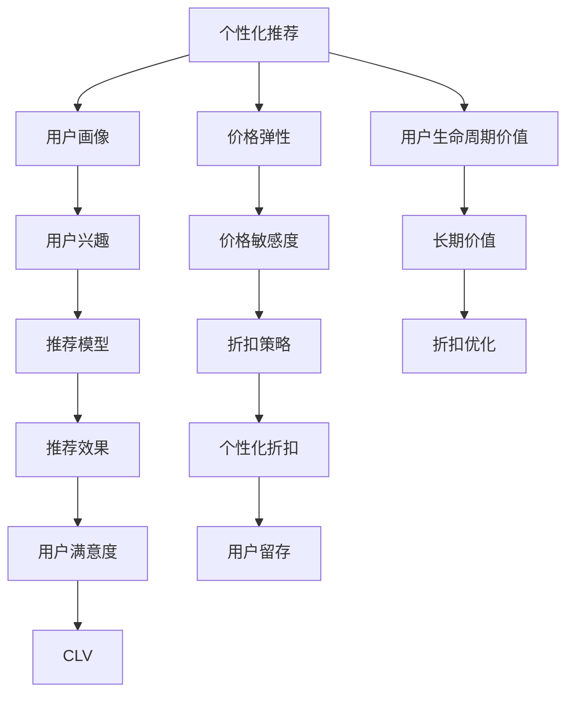
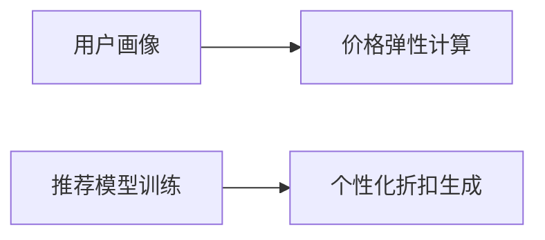

                 

# AI驱动的电商平台个性化折扣策略

## 1. 背景介绍

### 1.1 问题由来
随着电商市场的竞争日益激烈，各大电商平台纷纷通过价格策略来吸引和留住消费者。然而，传统的统一折扣策略往往无法针对不同用户进行精准营销，导致资源浪费和消费者流失。为了提升用户满意度和平台收益，商家迫切需要更智能、更个性化的折扣方案。

### 1.2 问题核心关键点
本文旨在探讨如何利用人工智能技术，特别是机器学习和大数据技术，为电商平台提供精准的个性化折扣策略。通过分析用户的历史行为、兴趣偏好、价格敏感度等特征，实现对不同用户群体的针对性营销。

## 2. 核心概念与联系

### 2.1 核心概念概述

为更好地理解本文的内容，我们首先介绍几个关键概念：

- 个性化推荐：根据用户的历史行为和偏好，推荐可能感兴趣的商品或服务。个性化折扣策略是其延伸，旨在为用户提供量身定做的价格优惠。
- 用户画像：通过对用户行为数据的分析，建立用户的兴趣模型，刻画用户画像。
- 价格弹性：用户对价格变化的敏感程度，不同用户对价格敏感度的不同影响其对折扣的反应。
- 用户生命周期价值（Customer Lifetime Value, CLV）：预测用户的长期价值，指导个性化的折扣策略制定。
- 机器学习：利用算法对历史数据进行分析学习，发现隐藏在数据中的规律和模式，用于个性化推荐和折扣策略的优化。
- 深度学习：特别是神经网络，能够自动学习特征，适用于处理复杂的推荐和折扣问题。

这些概念之间的联系如图示：



通过以上概念的连接，可以构建一个完整的个性化折扣策略的生态系统。

## 3. 核心算法原理 & 具体操作步骤
### 3.1 算法原理概述

本文提出的个性化折扣策略基于用户画像和价格弹性的双向分析。其核心思想是：通过对用户历史行为数据的分析，建立用户画像，并计算出用户的价格弹性。基于这两者，构建推荐模型，并应用于个性化折扣的生成。具体算法流程如图示：



其中，A步骤通过机器学习模型分析用户的历史行为，生成用户画像；B步骤计算用户的价格弹性；C步骤利用用户画像和价格弹性训练推荐模型；D步骤根据推荐模型生成个性化折扣。

### 3.2 算法步骤详解

#### 3.2.1 用户画像生成

**步骤1：收集用户数据**
- 用户的基本信息，如年龄、性别、职业等。
- 用户的购买历史，如购买时间、购买频率、购买金额等。
- 用户的浏览记录，如浏览的商品、点击的商品等。
- 用户评价，如对商品或服务的评价和反馈。

**步骤2：数据清洗与特征工程**
- 清洗无效、缺失的数据，确保数据的完整性和准确性。
- 特征工程，选择和构造能够反映用户兴趣和行为特征的数据，如购买金额、点击率等。

**步骤3：用户画像模型训练**
- 利用机器学习算法，如聚类、决策树、神经网络等，训练用户画像模型。
- 通过模型预测，为用户打上标签，生成用户画像。

#### 3.2.2 价格弹性计算

**步骤1：计算用户的价格弹性**
- 根据用户的购买历史和行为数据，利用回归模型计算用户的价格弹性。
- 常用的回归模型包括线性回归、决策树回归、随机森林回归等。

**步骤2：计算商品的价格弹性**
- 利用历史交易数据，通过回归模型计算商品的价格弹性。
- 计算商品的价格弹性时，考虑商品类别、季节性等因素的影响。

#### 3.2.3 推荐模型训练

**步骤1：模型选择与训练**
- 选择适合的推荐算法，如协同过滤、基于内容的推荐、深度学习等。
- 利用用户画像和商品特征训练推荐模型。

**步骤2：模型评估与优化**
- 利用交叉验证等方法评估模型效果，确保模型的准确性和稳定性。
- 根据模型效果，调整算法参数，优化推荐效果。

#### 3.2.4 个性化折扣生成

**步骤1：生成个性化折扣**
- 根据用户画像和商品价格弹性，生成个性化折扣。
- 折扣的大小应考虑用户的购买力和购买频率，避免过度优惠和亏损。

**步骤2：折扣应用与反馈**
- 应用生成的个性化折扣，并向用户推送。
- 收集用户的反馈，如点击率、购买率等，评估折扣效果。
- 根据反馈调整折扣策略，持续优化。

### 3.3 算法优缺点

#### 3.3.1 优点

- **精准度高**：基于用户画像和价格弹性的分析，能够更准确地预测用户的购买意愿，从而提供更精准的个性化折扣。
- **效率高**：自动化流程，减少人工干预，提升折扣策略的生成效率。
- **灵活性强**：能够动态调整折扣策略，适应市场的变化。
- **成本低**：通过数据分析，避免资源浪费，提升平台收益。

#### 3.3.2 缺点

- **数据依赖**：个性化折扣策略的准确性高度依赖于数据的完整性和准确性。
- **模型复杂**：需要复杂的算法和大量的计算资源进行训练和优化。
- **用户隐私问题**：用户数据的收集和使用，需要考虑用户隐私和数据安全。

### 3.4 算法应用领域

个性化折扣策略在电商平台中的应用非常广泛，具体包括：

- **促销活动**：根据用户画像和行为数据，生成个性化的促销信息和折扣优惠。
- **商品定价**：调整商品的定价策略，吸引特定用户群体。
- **库存管理**：通过预测用户的购买意愿，合理调整库存，避免缺货或积压。
- **客户留存**：通过个性化折扣提升用户满意度和忠诚度，增加客户留存率。
- **用户细分**：基于用户画像和行为数据，对用户进行细分，提供差异化的服务和产品。

## 4. 数学模型和公式 & 详细讲解 & 举例说明

### 4.1 数学模型构建

本文使用的数学模型包括用户画像模型、价格弹性计算模型和推荐模型。

#### 4.1.1 用户画像模型
用户画像模型可以使用聚类算法，如K-means，将用户分为不同群体。设用户画像模型为 $K$ 个簇的混合模型：

$$
p(x_i|z_k,\theta_k) = \sum_{k=1}^K p(z_k) p(x_i|z_k,\theta_k)
$$

其中 $x_i$ 为第 $i$ 个用户的特征向量，$z_k$ 为用户归属的簇，$\theta_k$ 为簇 $k$ 的参数。

#### 4.1.2 价格弹性计算模型
价格弹性计算模型可以使用线性回归模型：

$$
y = \beta_0 + \beta_1x + \epsilon
$$

其中 $y$ 为价格弹性系数，$x$ 为影响价格弹性的因素，$\beta_0,\beta_1$ 为模型参数，$\epsilon$ 为随机误差项。

#### 4.1.3 推荐模型
推荐模型可以使用协同过滤算法，利用用户画像和商品特征，预测用户对商品的需求：

$$
p(i|u,\theta) = \sum_{j=1}^M \alpha_{ij}u_j + \beta_i
$$

其中 $i$ 为商品编号，$u$ 为用户画像向量，$\theta$ 为推荐模型参数，$\alpha_{ij}$ 为商品特征，$u_j$ 为用户画像中对应的特征值，$\beta_i$ 为模型截距。

### 4.2 公式推导过程

#### 4.2.1 用户画像模型的推导
假设用户画像模型为 $K$ 个簇的混合模型，每个簇的分布为高斯分布：

$$
p(x_i|z_k,\theta_k) = \frac{1}{\sqrt{2\pi}\sigma_k}e^{-\frac{(x_i-\mu_k)^2}{2\sigma_k^2}}
$$

其中 $\mu_k$ 为簇 $k$ 的均值，$\sigma_k$ 为簇 $k$ 的标准差。

通过EM算法，对模型进行估计，得到用户画像。

#### 4.2.2 价格弹性计算模型的推导
利用回归模型计算价格弹性系数：

$$
y_i = \beta_0 + \beta_1x_i + \epsilon_i
$$

其中 $y_i$ 为第 $i$ 个用户的购买价格弹性，$x_i$ 为影响价格弹性的因素，$\beta_0,\beta_1$ 为模型参数，$\epsilon_i$ 为随机误差项。

通过最小二乘法，求解模型参数 $\beta_0,\beta_1$，得到价格弹性系数 $y_i$。

#### 4.2.3 推荐模型的推导
利用协同过滤算法，推荐模型可以表示为：

$$
p(i|u,\theta) = \sum_{j=1}^M \alpha_{ij}u_j + \beta_i
$$

其中 $i$ 为商品编号，$u$ 为用户画像向量，$\theta$ 为推荐模型参数，$\alpha_{ij}$ 为商品特征，$u_j$ 为用户画像中对应的特征值，$\beta_i$ 为模型截距。

### 4.3 案例分析与讲解

假设某电商平台有 100 万用户，收集了用户的历史行为数据，包括购买时间、购买金额、浏览记录等。利用K-means算法，将用户分为 5 个簇，每个簇包含 20 万用户。

对每个簇，利用回归模型计算用户的价格弹性系数。设每个簇的均值为 $\mu_k$，标准差为 $\sigma_k$，购买金额为 $x$，则价格弹性系数为：

$$
y_i = \beta_0 + \beta_1x_i + \epsilon_i
$$

对每个商品，利用回归模型计算价格弹性系数。设每个商品的类别、季节性因素为 $x$，则价格弹性系数为：

$$
y_i = \beta_0 + \beta_1x_i + \epsilon_i
$$

利用用户画像和价格弹性系数，训练协同过滤推荐模型。推荐模型可以表示为：

$$
p(i|u,\theta) = \sum_{j=1}^M \alpha_{ij}u_j + \beta_i
$$

其中 $i$ 为商品编号，$u$ 为用户画像向量，$\theta$ 为推荐模型参数，$\alpha_{ij}$ 为商品特征，$u_j$ 为用户画像中对应的特征值，$\beta_i$ 为模型截距。

根据推荐模型，生成个性化折扣，推送给用户。通过收集用户的反馈数据，如点击率、购买率等，评估折扣效果，不断调整和优化折扣策略。

## 5. 项目实践：代码实例和详细解释说明

### 5.1 开发环境搭建

在进行个性化折扣策略开发前，我们需要准备好开发环境。以下是使用Python进行PyTorch开发的环境配置流程：

1. 安装Anaconda：从官网下载并安装Anaconda，用于创建独立的Python环境。

2. 创建并激活虚拟环境：
```bash
conda create -n pytorch-env python=3.8 
conda activate pytorch-env
```

3. 安装PyTorch：根据CUDA版本，从官网获取对应的安装命令。例如：
```bash
conda install pytorch torchvision torchaudio cudatoolkit=11.1 -c pytorch -c conda-forge
```

4. 安装TensorFlow：
```bash
pip install tensorflow
```

5. 安装Scikit-Learn：
```bash
pip install scikit-learn
```

6. 安装Pandas：
```bash
pip install pandas
```

完成上述步骤后，即可在`pytorch-env`环境中开始开发。

### 5.2 源代码详细实现

下面是使用PyTorch进行用户画像、价格弹性计算和推荐模型训练的代码实现。

#### 5.2.1 用户画像生成

```python
import pandas as pd
from sklearn.cluster import KMeans

# 读取用户数据
data = pd.read_csv('user_data.csv')

# 选择特征
features = ['age', 'gender', 'occupation', 'purchase_amount', 'click_rate']

# 训练聚类模型
kmeans = KMeans(n_clusters=5)
kmeans.fit(data[features])

# 将用户分组
user_groups = kmeans.predict(data[features])

# 保存用户画像
user_profile = pd.DataFrame({'user_id': data['user_id'], 'group': user_groups})
user_profile.to_csv('user_profile.csv', index=False)
```

#### 5.2.2 价格弹性计算

```python
import numpy as np
from sklearn.linear_model import LinearRegression

# 读取用户和商品数据
user_data = pd.read_csv('user_data.csv')
product_data = pd.read_csv('product_data.csv')

# 选择特征
user_features = ['purchase_amount']
product_features = ['category', 'season']

# 训练价格弹性模型
user_model = LinearRegression()
user_model.fit(user_data[user_features], user_data['price_elasticity'])

product_model = LinearRegression()
product_model.fit(product_data[product_features], product_data['price_elasticity'])

# 计算价格弹性
user_price_elasticity = user_model.predict(user_data[user_features])
product_price_elasticity = product_model.predict(product_data[product_features])
```

#### 5.2.3 推荐模型训练

```python
import torch
from torch import nn
from torch.utils.data import DataLoader, Dataset
from torch.nn.functional import relu, sigmoid

# 定义数据集
class UserItemDataset(Dataset):
    def __init__(self, user_profile, product_data):
        self.user_profile = user_profile
        self.product_data = product_data
        
    def __len__(self):
        return len(self.user_profile)
        
    def __getitem__(self, index):
        user_id = self.user_profile.iloc[index]['user_id']
        user_group = self.user_profile.iloc[index]['group']
        user_price_elasticity = self.user_profile.iloc[index]['price_elasticity']
        
        user_items = self.product_data[self.product_data['user_id'] == user_id].reset_index(drop=True)
        item_features = user_items[['sid', 'name', 'category', 'season']].values
        user_group = torch.tensor(user_group)
        user_price_elasticity = torch.tensor(user_price_elasticity)
        
        return user_id, user_group, user_price_elasticity, item_features

# 读取数据集
user_profile = pd.read_csv('user_profile.csv')
product_data = pd.read_csv('product_data.csv')

# 创建数据集
dataset = UserItemDataset(user_profile, product_data)

# 定义模型
class RecommendationModel(nn.Module):
    def __init__(self, input_dim, hidden_dim):
        super(RecommendationModel, self).__init__()
        self.fc1 = nn.Linear(input_dim, hidden_dim)
        self.fc2 = nn.Linear(hidden_dim, 1)
        
    def forward(self, x, user_group, user_price_elasticity):
        x = x.reshape(-1, input_dim)
        x = relu(self.fc1(x))
        x = self.fc2(x)
        x = sigmoid(x)
        return x
        
# 训练模型
model = RecommendationModel(4, 8)
criterion = nn.BCELoss()
optimizer = torch.optim.Adam(model.parameters(), lr=0.01)

# 定义训练函数
def train(model, criterion, optimizer, dataset, num_epochs=10, batch_size=32):
    train_loader = DataLoader(dataset, batch_size=batch_size, shuffle=True)
    for epoch in range(num_epochs):
        for user_id, user_group, user_price_elasticity, item_features in train_loader:
            optimizer.zero_grad()
            output = model(item_features, user_group, user_price_elasticity)
            loss = criterion(output, target)
            loss.backward()
            optimizer.step()
            
    # 保存模型
    torch.save(model.state_dict(), 'model.pth')

# 训练模型
train(model, criterion, optimizer, dataset)
```

### 5.3 代码解读与分析

让我们再详细解读一下关键代码的实现细节：

#### 5.3.1 用户画像生成

**KMeans聚类算法**：
- 选择用户画像的特征，如年龄、性别、职业等。
- 使用KMeans算法，将用户分为不同簇。
- 保存用户画像，每个用户对应一个簇标签。

#### 5.3.2 价格弹性计算

**线性回归模型**：
- 选择用户和商品的价格弹性特征，如购买金额、商品类别等。
- 使用线性回归模型，计算用户和商品的价格弹性系数。
- 保存计算结果，用于后续推荐模型训练。

#### 5.3.3 推荐模型训练

**推荐模型定义**：
- 定义推荐模型，包括用户画像和商品特征的映射关系。
- 使用PyTorch定义推荐模型的前向传播函数。
- 定义交叉熵损失函数和优化器，用于训练推荐模型。

#### 5.3.4 模型训练函数

**训练函数**：
- 定义训练函数，迭代训练推荐模型。
- 通过DataLoader对数据集进行批次化加载。
- 在每个批次上，计算损失函数，更新模型参数。
- 在每个epoch结束时，保存训练好的模型。

## 6. 实际应用场景

### 6.1 智能推荐系统

个性化折扣策略可以应用于智能推荐系统中，提升推荐效果。通过分析用户画像和价格弹性，生成个性化的推荐折扣，从而提高用户的点击率和购买率。

例如，某电商平台的智能推荐系统可以对用户进行分类，根据不同用户群体的价格弹性，生成个性化的折扣策略。对于价格弹性较高的用户群体，可以提供更大的折扣优惠；对于价格弹性较低的用户群体，则可以通过其他方式进行吸引。

### 6.2 促销活动

个性化折扣策略可以应用于促销活动中，提高促销效果。通过分析用户画像和价格弹性，生成个性化的促销信息和折扣优惠，吸引用户参与。

例如，某电商平台可以根据用户的购买历史和价格弹性，生成个性化的促销信息，推送给用户。对于价格弹性较高的用户，可以提供更高的折扣；对于价格弹性较低的用户，可以提供更具吸引力的附加优惠，如赠品、优惠券等。

### 6.3 库存管理

个性化折扣策略可以应用于库存管理中，优化库存水平。通过分析用户画像和价格弹性，生成个性化的库存策略，避免库存积压或缺货。

例如，某电商平台可以根据用户的购买历史和价格弹性，预测不同用户的购买意愿，调整库存水平。对于价格弹性较高的用户，可以适当增加库存；对于价格弹性较低的用户，可以适当减少库存。

### 6.4 未来应用展望

随着个性化推荐和折扣策略的不断演进，未来将有更多的应用场景：

1. **动态定价**：根据用户画像和价格弹性，实时调整商品价格，提高销售效率。
2. **智能客服**：利用个性化折扣策略，提升客服系统的智能水平，提供更优质的客户服务。
3. **联合营销**：与其他平台进行联合营销，通过交叉推荐和折扣策略，扩大用户群体。
4. **市场预测**：分析用户画像和价格弹性，预测市场趋势，指导企业战略决策。
5. **个性化内容**：根据用户画像和价格弹性，生成个性化的内容推荐，提升用户粘性。

## 7. 工具和资源推荐

### 7.1 学习资源推荐

为了帮助开发者系统掌握个性化推荐和折扣策略的理论基础和实践技巧，这里推荐一些优质的学习资源：

1. 《推荐系统实战》：介绍推荐系统的基础知识、算法实现和实际应用，适合初学者和进阶开发者。
2. 《深度学习入门：基于PyTorch的理论与实现》：讲解深度学习的基本概念和实现方法，结合PyTorch进行实践。
3. 《Python机器学习》：系统介绍机器学习的基本方法和Python实现，适合初学者和进阶开发者。
4. Coursera《Machine Learning》课程：由斯坦福大学开设的机器学习课程，涵盖理论、算法和实践，适合深入学习。
5. Kaggle推荐系统竞赛：参加Kaggle推荐系统竞赛，实践推荐算法，提升实战能力。

通过对这些资源的学习实践，相信你一定能够快速掌握个性化推荐和折扣策略的精髓，并用于解决实际的推荐问题。

### 7.2 开发工具推荐

高效的开发离不开优秀的工具支持。以下是几款用于推荐系统开发的常用工具：

1. Apache Spark：分布式计算框架，适合大规模数据处理和机器学习任务。
2. Hadoop：大数据处理平台，支持大规模数据存储和处理。
3. TensorFlow：深度学习框架，适合复杂模型的训练和优化。
4. PyTorch：深度学习框架，适合动态计算图和高效模型训练。
5. Scikit-Learn：Python机器学习库，适合快速原型开发和模型评估。

合理利用这些工具，可以显著提升推荐系统的开发效率，加快创新迭代的步伐。

### 7.3 相关论文推荐

个性化推荐和折扣策略的研究源于学界的持续研究。以下是几篇奠基性的相关论文，推荐阅读：

1. 《A Neural Collaborative Filtering Approach》：提出基于神经网络的协同过滤推荐算法。
2. 《Adaptive BTL Bandits》：提出基于贝叶斯推断的个性化推荐算法。
3. 《Adaptive Linear Matrix Factorization》：提出自适应矩阵分解方法，提高推荐精度。
4. 《Deep Interest Network》：提出深度兴趣网络，提升推荐效果。
5. 《Epsilon-DIVA: Epsilon-Divided Adaptive Value Function for Reinforcement Learning》：提出Epsilon-DIVA算法，优化个性化推荐策略。

这些论文代表了个性化推荐和折扣策略的发展脉络。通过学习这些前沿成果，可以帮助研究者把握学科前进方向，激发更多的创新灵感。

## 8. 总结：未来发展趋势与挑战

### 8.1 总结

本文对个性化折扣策略进行了全面系统的介绍。首先阐述了个性化折扣策略的研究背景和意义，明确了其对电商平台的重要性。其次，从原理到实践，详细讲解了个性化折扣策略的数学模型和实现过程，给出了具体的代码实例。同时，本文还广泛探讨了个性化折扣策略在多个实际场景中的应用，展示了其广阔的前景。最后，本文精选了个性化推荐和折扣策略的学习资源、开发工具和相关论文，力求为读者提供全方位的技术指引。

通过本文的系统梳理，可以看到，个性化折扣策略在电商平台中的应用前景广阔，能够显著提升用户的满意度和平台的收益。未来，伴随推荐算法和折扣策略的不断演进，个性化的推荐系统将进一步提升用户的体验，推动电商平台的可持续发展。

### 8.2 未来发展趋势

展望未来，个性化折扣策略将呈现以下几个发展趋势：

1. **多模态推荐**：结合文本、图像、视频等多模态数据，提高推荐模型的表现。
2. **动态定价**：实时调整商品价格，提高销售效率。
3. **用户行为预测**：利用机器学习算法，预测用户的未来行为，优化推荐策略。
4. **推荐系统公平性**：关注推荐系统的公平性问题，确保不同用户的推荐效果。
5. **推荐系统透明性**：增强推荐系统的透明性，让用户理解推荐依据。
6. **推荐系统可解释性**：提高推荐系统的可解释性，增强用户信任。

以上趋势凸显了个性化推荐和折扣策略的广阔前景。这些方向的探索发展，必将进一步提升推荐系统的效果和用户满意度，为电商平台带来更大的商业价值。

### 8.3 面临的挑战

尽管个性化推荐和折扣策略已经取得了瞩目成就，但在迈向更加智能化、普适化应用的过程中，它仍面临着诸多挑战：

1. **数据隐私问题**：个性化推荐和折扣策略需要大量的用户数据，如何保护用户隐私和数据安全，需要谨慎处理。
2. **模型复杂度**：推荐模型和折扣策略的复杂度较高，需要大规模的计算资源进行训练和优化。
3. **推荐效果不稳定**：不同用户的行为和偏好变化较大，如何稳定推荐效果，需要持续优化和维护。
4. **算法公平性**：推荐系统的算法需要公平对待不同用户群体，避免出现偏见和歧视。
5. **推荐系统透明性**：推荐系统的决策过程需要透明，让用户理解推荐依据，增强信任感。
6. **推荐系统可解释性**：推荐系统的可解释性需要增强，以便用户理解和信任。

这些挑战需要业界共同努力，才能实现个性化推荐和折扣策略的可持续发展。只有从技术、伦理和社会等多个维度协同发力，才能真正实现个性化推荐和折扣策略的落地应用。

### 8.4 研究展望

面对个性化推荐和折扣策略所面临的挑战，未来的研究需要在以下几个方面寻求新的突破：

1. **多模态数据的融合**：利用文本、图像、视频等多模态数据，提高推荐模型的表现。
2. **动态定价策略**：实时调整商品价格，提高销售效率。
3. **推荐系统的透明性和可解释性**：增强推荐系统的透明性，让用户理解推荐依据，提高信任度。
4. **推荐系统的公平性**：关注推荐系统的公平性问题，确保不同用户的推荐效果。
5. **推荐系统的可扩展性**：提高推荐系统的可扩展性，支持大规模用户和商品。

这些研究方向的探索，必将引领个性化推荐和折扣策略的进一步发展，为电商平台带来更大的商业价值。面向未来，个性化推荐和折扣策略还需要与其他人工智能技术进行更深入的融合，如知识表示、因果推理、强化学习等，多路径协同发力，共同推动推荐系统的发展。只有勇于创新、敢于突破，才能不断拓展推荐系统的边界，让推荐系统更好地造福电商平台和用户。

## 9. 附录：常见问题与解答

**Q1：个性化折扣策略是否适用于所有电商平台？**

A: 个性化折扣策略在大多数电商平台中都能取得较好的效果，特别是对于有丰富数据和强大计算能力的平台。但对于一些数据量较小、计算能力较弱的平台，可能需要考虑其他优化方法。

**Q2：如何保证个性化折扣策略的效果？**

A: 个性化折扣策略的效果取决于数据的完整性和准确性，以及模型的训练优化。建议：
1. 收集全面的用户数据，涵盖用户行为、兴趣、购买力等。
2. 清洗无效、缺失的数据，确保数据的完整性和准确性。
3. 选择适合的机器学习算法，进行模型训练和优化。
4. 定期更新和维护模型，适应市场的变化。

**Q3：个性化折扣策略是否会对用户隐私造成威胁？**

A: 个性化折扣策略需要大量的用户数据，如何保护用户隐私和数据安全，是应用过程中需要谨慎处理的。建议：
1. 采用匿名化处理，去除敏感信息。
2. 加强数据保护措施，确保数据安全。
3. 透明化数据使用流程，让用户知情并同意。

**Q4：如何优化个性化折扣策略的推荐效果？**

A: 个性化折扣策略的推荐效果可以通过以下方式优化：
1. 定期更新模型，适应市场变化。
2. 引入用户反馈，调整推荐策略。
3. 多模型集成，提升推荐效果。
4. 引入上下文信息，提高推荐的精准度。

**Q5：个性化折扣策略如何应用于跨境电商？**

A: 个性化折扣策略可以应用于跨境电商，但需要考虑不同市场的数据特点和用户偏好。建议：
1. 收集跨境用户数据，分析其行为和偏好。
2. 引入多语言支持，优化推荐效果。
3. 根据不同市场的法规和政策，优化推荐策略。
4. 考虑物流和支付因素，优化推荐系统。

---

作者：禅与计算机程序设计艺术 / Zen and the Art of Computer Programming

