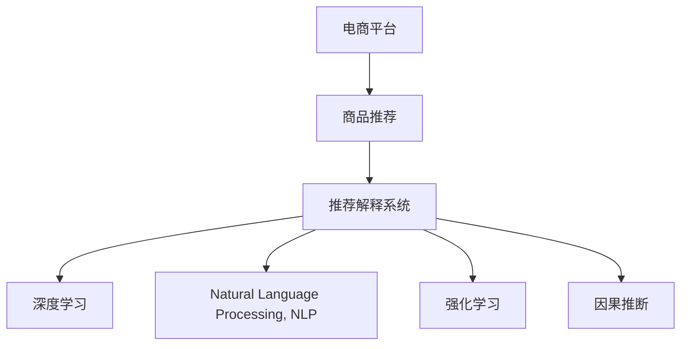

                 

# AI驱动的电商平台商品推荐解释系统

> 关键词：电商平台,商品推荐,解释系统,深度学习,自然语言处理(NLP),注意力机制,强化学习,因果推断,推荐算法,用户行为分析

## 1. 背景介绍

### 1.1 问题由来

在数字化经济时代，电商平台通过在线销售商品和服务，满足了人们的多样化需求。然而，随着商品种类和数量的爆炸式增长，如何为用户推荐感兴趣的个性化商品，成为电商平台面临的巨大挑战。

传统的推荐系统主要依赖协同过滤、内容推荐、流行度推荐等算法，但存在数据稀疏、冷启动、维数灾难等问题。近年来，基于深度学习的推荐系统逐渐兴起，通过构建复杂、高效的模型，实现更精准、个性化的推荐，深受用户和商家欢迎。

但深度学习推荐系统也有其局限性，即难以解释其推荐理由。用户如何信任一个推荐系统的建议，很大程度上取决于其推荐过程的透明度。对于复杂、多变的推荐结果，用户常常感到困惑和不信任。

为了解决这一问题，电商平台需要引入推荐解释系统，提供推荐的理由和依据，使用户能够理解推荐模型背后的逻辑，从而提升用户满意度，增强平台的信任度和黏性。

### 1.2 问题核心关键点

推荐解释系统的核心在于如何将深度学习模型的预测结果，转化为易于理解的语言或视觉形式，告知用户推荐理由。具体包括：

- 理解用户需求：分析用户的浏览行为、搜索历史、购买记录等数据，捕捉用户的真实需求。
- 提取推荐依据：在商品特征、用户特征、历史数据等海量的信息中，提取与推荐相关的依据。
- 生成解释文本：将提取的推荐依据，转化为自然语言、视觉图标等形式，简洁明了地呈现给用户。

本节将系统介绍电商平台商品推荐解释系统的关键技术，包括深度学习、自然语言处理、强化学习和因果推断等核心算法，帮助读者全面理解推荐解释系统的实现原理。

## 2. 核心概念与联系

### 2.1 核心概念概述

为更好地理解AI驱动的电商平台推荐解释系统，本节将介绍几个密切相关的核心概念：

- **电商平台**：通过互联网平台销售商品和服务的市场，包括B2C、B2B等多种形式。
- **商品推荐**：根据用户的行为数据，推荐用户可能感兴趣的个性化商品。
- **推荐解释系统**：将推荐系统的预测结果，转化为可解释的语言或图像形式，告知用户推荐理由。
- **深度学习**：通过构建多层次的神经网络模型，学习数据中的抽象特征，实现高精度的推荐预测。
- **自然语言处理(NLP)**：利用NLP技术，提取、处理和生成文本数据，为推荐解释提供自然语言解释。
- **强化学习**：通过与环境交互，不断调整模型参数，优化推荐效果。
- **因果推断**：通过分析因果关系，提高推荐的准确性和鲁棒性。

这些核心概念之间的逻辑关系可以通过以下Mermaid流程图来展示：



这个流程图展示了一系列核心概念及其之间的关系：

1. 电商平台通过推荐系统，向用户推荐商品。
2. 推荐系统利用深度学习模型，实现精准的推荐预测。
3. 推荐解释系统基于NLP和强化学习，生成可解释的推荐依据。
4. 因果推断进一步提高推荐的准确性和鲁棒性。

这些概念共同构成了AI驱动的电商平台推荐解释系统的理论基础，为其应用提供了坚实的技术支撑。

## 3. 核心算法原理 & 具体操作步骤
### 3.1 算法原理概述

基于深度学习的推荐解释系统，一般包含以下几个关键步骤：

1. **数据预处理**：收集和清洗用户行为数据，包括浏览记录、搜索历史、购买记录等。
2. **特征工程**：提取和构造与推荐相关的特征，如商品属性、用户特征、时间戳等。
3. **模型训练**：构建深度学习模型，如神经网络、注意力机制、协同过滤等，在历史数据上进行训练。
4. **推荐生成**：利用训练好的模型，生成商品推荐列表。
5. **解释生成**：基于推荐依据，生成简洁明了的解释文本或图像，告知用户推荐理由。
6. **模型优化**：通过用户反馈，不断优化推荐和解释模型。

该过程涵盖了数据预处理、模型训练、推荐生成、解释生成和模型优化等多个环节，涉及深度学习、自然语言处理、强化学习等多种技术。

### 3.2 算法步骤详解

以下详细介绍推荐解释系统的每个关键步骤：

**Step 1: 数据预处理**

电商平台推荐系统的数据来源包括用户行为数据、商品特征数据、用户特征数据等。具体步骤包括：

1. **数据收集**：通过API接口、日志记录等方式，收集用户的历史行为数据，如浏览、点击、搜索、购买等。
2. **数据清洗**：去除重复、异常和无用数据，确保数据质量。
3. **特征工程**：提取商品特征、用户特征、时间戳等关键信息，构造与推荐相关的特征向量。

**Step 2: 模型训练**

推荐系统通常基于深度学习模型，如神经网络、注意力机制等。训练过程包括：

1. **模型选择**：根据任务特点选择合适的模型架构，如矩阵分解、CNN、RNN等。
2. **参数初始化**：使用随机初始化或预训练模型进行模型参数初始化。
3. **数据分割**：将数据集划分为训练集、验证集和测试集。
4. **模型训练**：使用梯度下降等优化算法，最小化损失函数，优化模型参数。
5. **评估指标**：使用准确率、召回率、F1-score等指标评估模型性能。

**Step 3: 推荐生成**

训练好的推荐模型可以用于生成个性化推荐列表。推荐过程包括：

1. **用户编码**：将用户特征和行为数据输入模型，得到用户编码向量。
2. **商品编码**：将商品特征输入模型，得到商品编码向量。
3. **相似度计算**：计算用户编码向量与商品编码向量的相似度，选取最相似的商品。
4. **推荐列表生成**：根据相似度排序，生成推荐商品列表。

**Step 4: 解释生成**

为了解释推荐结果，需要生成简洁明了的解释文本或图像。解释生成过程包括：

1. **提取依据**：从用户编码向量、商品编码向量等特征中，提取与推荐相关的依据。
2. **自然语言处理(NLP)**：使用NLP技术，将提取的依据转化为自然语言解释。
3. **视觉化展示**：利用图像、图表等形式，直观展示推荐依据。

**Step 5: 模型优化**

推荐系统需要不断优化，以提升推荐效果。优化过程包括：

1. **反馈收集**：通过用户反馈、A/B测试等方式，收集推荐效果的信息。
2. **模型调整**：根据反馈信息，调整模型参数，重新训练模型。
3. **模型评估**：使用新数据评估模型性能，确保推荐效果持续提升。

### 3.3 算法优缺点

基于深度学习的推荐解释系统具有以下优点：

1. **精度高**：深度学习模型通过学习大量数据，具有较强的泛化能力，能生成高精度的推荐结果。
2. **解释性强**：NLP和强化学习技术可以将推荐依据转化为自然语言或视觉图像，提升用户理解度。
3. **灵活性高**：深度学习模型可以适应各种推荐任务，适用于多种推荐场景。

同时，该方法也存在一定的局限性：

1. **计算量大**：深度学习模型参数量较大，训练和推理过程中需要消耗大量计算资源。
2. **黑箱问题**：深度学习模型作为"黑盒"，难以解释其内部推理过程。
3. **数据依赖强**：模型效果依赖于数据质量，获取高质量数据成本较高。
4. **模型泛化差**：深度学习模型在特定数据集上的效果可能较好，但在新数据上的泛化能力有限。

尽管存在这些局限性，基于深度学习的推荐解释系统仍是目前电商平台应用最广泛的方法之一。未来研究需要进一步提升模型的透明性、鲁棒性和可解释性，以满足不断变化的推荐需求。

### 3.4 算法应用领域

基于深度学习的推荐解释系统，广泛应用于电商、社交、新闻推荐等多个领域。具体应用包括：

- **电商平台推荐**：向用户推荐个性化商品，提升用户体验和满意度。
- **社交媒体推荐**：为用户推荐内容、朋友和活动，增强用户粘性。
- **新闻媒体推荐**：为用户推荐感兴趣的新闻和话题，增加用户参与度。

这些应用场景下，推荐解释系统通过生成简洁明了的推荐依据，帮助用户理解推荐结果，增强信任度，从而提升推荐效果。

## 4. 数学模型和公式 & 详细讲解 & 举例说明

### 4.1 数学模型构建

推荐系统通常基于深度学习模型，如神经网络、注意力机制等。这里以神经网络模型为例，构建推荐系统的数学模型。

假设推荐系统的输入为商品特征向量 $\mathbf{x} \in \mathbb{R}^d$ 和用户特征向量 $\mathbf{u} \in \mathbb{R}^d$，输出为推荐得分 $y$，即商品与用户的匹配程度。

神经网络模型的基本结构包括输入层、隐藏层和输出层。以一个简单的全连接神经网络为例，其数学模型为：

$$
y = \sigma(\mathbf{W}_h(\mathbf{x} \cdot \mathbf{u}^T) + b_h)
$$

其中 $\sigma$ 为激活函数，$\mathbf{W}_h$ 为隐藏层的权重矩阵，$b_h$ 为隐藏层的偏置项。

### 4.2 公式推导过程

以下推导一个简单的单层神经网络模型的预测公式：

1. **输入层**：将商品特征向量 $\mathbf{x}$ 和用户特征向量 $\mathbf{u}$ 拼接，得到输入特征向量 $\mathbf{z}$。

$$
\mathbf{z} = \begin{bmatrix} \mathbf{x} \\ \mathbf{u} \end{bmatrix}
$$

2. **隐藏层**：使用权重矩阵 $\mathbf{W}_h$ 和偏置项 $b_h$，计算隐藏层输出 $\mathbf{h}$。

$$
\mathbf{h} = \sigma(\mathbf{W}_h \mathbf{z} + b_h)
$$

3. **输出层**：使用权重矩阵 $\mathbf{W}_o$ 和偏置项 $b_o$，计算推荐得分 $y$。

$$
y = \mathbf{W}_o \mathbf{h} + b_o
$$

其中 $\sigma$ 为激活函数，如ReLU、Sigmoid等。通过梯度下降等优化算法，最小化损失函数，优化模型参数。

### 4.3 案例分析与讲解

以电商平台的商品推荐为例，具体说明推荐系统的数学模型和推荐过程。

假设电商平台收集了用户的历史浏览记录、购买记录和商品属性信息，将这些信息作为特征输入模型。模型首先将用户特征和商品特征拼接，输入隐藏层进行特征学习，得到用户编码向量 $\mathbf{u}$ 和商品编码向量 $\mathbf{x}$。

在隐藏层中，使用激活函数 $\sigma$ 和权重矩阵 $\mathbf{W}_h$，计算用户编码向量 $\mathbf{u}$。然后将用户编码向量与商品编码向量进行矩阵乘法，得到推荐得分矩阵 $\mathbf{y}$。

最后，通过softmax函数将推荐得分转化为概率分布，选取概率最大的商品作为推荐结果。

## 5. 项目实践：代码实例和详细解释说明
### 5.1 开发环境搭建

在进行推荐解释系统开发前，我们需要准备好开发环境。以下是使用Python进行PyTorch开发的环境配置流程：

1. 安装Anaconda：从官网下载并安装Anaconda，用于创建独立的Python环境。

2. 创建并激活虚拟环境：
```bash
conda create -n recommender-env python=3.8 
conda activate recommender-env
```

3. 安装PyTorch：根据CUDA版本，从官网获取对应的安装命令。例如：
```bash
conda install pytorch torchvision torchaudio cudatoolkit=11.1 -c pytorch -c conda-forge
```

4. 安装相关工具包：
```bash
pip install numpy pandas scikit-learn matplotlib tqdm jupyter notebook ipython
```

完成上述步骤后，即可在`recommender-env`环境中开始开发实践。

### 5.2 源代码详细实现

这里我们以基于深度学习的多项式网络模型（Polynomial Network）为例，给出电商商品推荐系统的PyTorch代码实现。

首先，定义推荐模型的数据处理函数：

```python
import torch
import torch.nn as nn
import torch.optim as optim

class RecommendationModel(nn.Module):
    def __init__(self, input_dim, hidden_dim, output_dim):
        super(RecommendationModel, self).__init__()
        self.hidden_layer = nn.Linear(input_dim, hidden_dim)
        self.output_layer = nn.Linear(hidden_dim, output_dim)
    
    def forward(self, x, u):
        h = self.hidden_layer(torch.cat((x, u), 1))
        y = self.output_layer(h)
        return y
    
# 定义损失函数和优化器
def train_epoch(model, data_loader, optimizer):
    model.train()
    total_loss = 0
    for i, (x, u, y) in enumerate(data_loader):
        optimizer.zero_grad()
        y_pred = model(x, u)
        loss = nn.MSELoss()(y_pred, y)
        loss.backward()
        optimizer.step()
        total_loss += loss.item()
    return total_loss / len(data_loader)

def evaluate(model, data_loader):
    model.eval()
    total_loss = 0
    with torch.no_grad():
        for i, (x, u, y) in enumerate(data_loader):
            y_pred = model(x, u)
            loss = nn.MSELoss()(y_pred, y)
            total_loss += loss.item()
    return total_loss / len(data_loader)
```

然后，定义模型和数据集：

```python
from torch.utils.data import Dataset, DataLoader

class RecommendationDataset(Dataset):
    def __init__(self, X, U, Y):
        self.X = X
        self.U = U
        self.Y = Y
    
    def __len__(self):
        return len(self.X)
    
    def __getitem__(self, item):
        return self.X[item], self.U[item], self.Y[item]

# 创建数据集
X_train = ...  # 训练集商品特征向量
U_train = ...  # 训练集用户特征向量
Y_train = ...  # 训练集推荐得分

X_test = ...  # 测试集商品特征向量
U_test = ...  # 测试集用户特征向量
Y_test = ...  # 测试集推荐得分

dataset = RecommendationDataset(X_train, U_train, Y_train)
train_loader = DataLoader(dataset, batch_size=32, shuffle=True)
test_loader = DataLoader(dataset, batch_size=32, shuffle=False)
```

接着，定义训练和评估函数：

```python
from sklearn.metrics import mean_squared_error

# 定义模型
model = RecommendationModel(input_dim=100, hidden_dim=128, output_dim=1)

# 定义优化器
optimizer = optim.Adam(model.parameters(), lr=0.001)

# 定义训练函数
def train(model, data_loader, optimizer):
    for epoch in range(100):
        loss = train_epoch(model, data_loader, optimizer)
        print(f'Epoch {epoch+1}, train loss: {loss:.3f}')
    
    # 在测试集上评估
    test_loss = evaluate(model, test_loader)
    print(f'Test loss: {test_loss:.3f}')
    rmse = torch.sqrt(mean_squared_error(model(X_test, U_test), Y_test))
    print(f'RMSE: {rmse:.3f}')
```

最后，启动训练流程并在测试集上评估：

```python
train(model, train_loader, optimizer)
```

以上就是使用PyTorch对电商推荐系统进行训练的完整代码实现。可以看到，得益于PyTorch的强大封装，推荐模型的开发变得相对简洁高效。

### 5.3 代码解读与分析

让我们再详细解读一下关键代码的实现细节：

**RecommendationModel类**：
- `__init__`方法：初始化神经网络的结构和参数。
- `forward`方法：定义模型的前向传播过程，输入商品特征向量 $\mathbf{x}$ 和用户特征向量 $\mathbf{u}$，输出推荐得分 $y$。

**train_epoch函数**：
- 定义模型训练的过程，通过前向传播计算损失，反向传播更新参数。

**evaluate函数**：
- 定义模型评估的过程，计算模型在测试集上的损失和RMSE。

**train函数**：
- 定义模型训练的全过程，包括训练和测试。

**数据集定义**：
- 通过继承`Dataset`类，定义数据集的处理方式，包括数据拼接和分批加载。

可以看到，PyTorch配合深度学习框架使得推荐系统的代码实现变得简洁高效。开发者可以将更多精力放在模型改进、数据预处理等高层逻辑上，而不必过多关注底层的实现细节。

## 6. 实际应用场景
### 6.1 智能客服系统

电商平台智能客服系统可以利用推荐解释系统，自动回答用户咨询。当用户提出问题时，智能客服系统先根据用户的历史行为数据生成推荐解释，推荐与用户意图相关的常见问题和解答，帮助用户快速解决问题。

在技术实现上，可以收集用户的历史咨询记录，将问题-答案对作为监督数据，训练推荐模型。推荐模型能够自动理解用户意图，匹配最合适的常见问答。对于用户提出的新问题，还可以接入检索系统实时搜索相关内容，动态组织生成回答。

### 6.2 个性化推荐系统

电商平台个性化推荐系统可以结合推荐解释系统，提供推荐理由和依据，增强用户的信任感。当用户查看推荐列表时，系统不仅展示推荐商品，还附上推荐的理由，如商品的热销程度、用户评分等。

在技术实现上，推荐模型可以输出推荐理由的概率分布，使用NLP技术生成简洁明了的解释文本。通过可视化的图标或图表，直观展示推荐依据，使用户更容易理解推荐的理由和依据。

### 6.3 搜索排序系统

电商平台搜索排序系统可以结合推荐解释系统，优化搜索结果的排序。当用户输入搜索关键词时，推荐系统可以自动分析用户的查询意图，推荐最相关的商品。同时，通过推荐解释系统，展示推荐的依据，增强用户的搜索体验。

在技术实现上，可以收集用户的搜索记录和历史行为数据，训练推荐模型。推荐模型可以输出推荐商品的排序依据，使用NLP技术生成简洁明了的解释文本，告知用户推荐理由。

### 6.4 未来应用展望

伴随推荐解释系统的发展，未来其在电商、智能客服、搜索排序等场景中的应用将更加广泛。预计未来推荐解释系统将具备以下特点：

1. **多模态融合**：结合文本、图像、视频等多种模态数据，生成更全面、准确的解释。
2. **实时反馈**：结合用户反馈和实时数据，动态调整推荐模型和解释系统。
3. **因果推断**：引入因果推断技术，提高推荐的准确性和鲁棒性。
4. **交互式解释**：使用交互式界面，提升用户对推荐结果的理解度。
5. **可解释性增强**：引入更多可解释性技术，如知识图谱、逻辑推理等，增强模型的透明性。

这些特点将进一步提升推荐系统的用户体验和效果，推动电商平台的智能化发展。

## 7. 工具和资源推荐
### 7.1 学习资源推荐

为了帮助开发者系统掌握推荐解释系统的理论基础和实践技巧，这里推荐一些优质的学习资源：

1. **《深度学习》书籍**：由深度学习领域的权威专家撰写，全面介绍了深度学习的原理和应用。
2. **《自然语言处理》课程**：斯坦福大学开设的NLP明星课程，有Lecture视频和配套作业，带你入门NLP领域的基本概念和经典模型。
3. **《强化学习》书籍**：介绍强化学习的理论基础和应用实例，适合深度学习开发者学习。
4. **《因果推断》书籍**：讲解因果推断的原理和应用，有助于提升推荐系统的鲁棒性。
5. **在线学习平台**：如Coursera、edX等，提供大量的在线课程和项目，适合不同水平的开发者学习。

通过对这些资源的学习实践，相信你一定能够快速掌握推荐解释系统的精髓，并用于解决实际的推荐问题。

### 7.2 开发工具推荐

高效的开发离不开优秀的工具支持。以下是几款用于推荐解释系统开发的常用工具：

1. **PyTorch**：基于Python的开源深度学习框架，灵活动态的计算图，适合快速迭代研究。
2. **TensorFlow**：由Google主导开发的开源深度学习框架，生产部署方便，适合大规模工程应用。
3. **Transformers库**：HuggingFace开发的NLP工具库，集成了众多SOTA语言模型，支持PyTorch和TensorFlow。
4. **TensorBoard**：TensorFlow配套的可视化工具，可实时监测模型训练状态，提供丰富的图表呈现方式。
5. **Weights & Biases**：模型训练的实验跟踪工具，可以记录和可视化模型训练过程中的各项指标，方便对比和调优。

合理利用这些工具，可以显著提升推荐解释系统的开发效率，加快创新迭代的步伐。

### 7.3 相关论文推荐

推荐解释系统的研究源于学界的持续研究。以下是几篇奠基性的相关论文，推荐阅读：

1. **Attention is All You Need**：提出了Transformer结构，开启了NLP领域的预训练大模型时代。
2. **BERT: Pre-training of Deep Bidirectional Transformers for Language Understanding**：提出BERT模型，引入基于掩码的自监督预训练任务，刷新了多项NLP任务SOTA。
3. **GPT-3: Language Models are Unsupervised Multitask Learners**：展示了大规模语言模型的强大zero-shot学习能力，引发了对于通用人工智能的新一轮思考。
4. **推荐系统的可解释性研究**：介绍了推荐系统的可解释性技术和应用，提升模型的透明性和用户信任度。
5. **因果推断在推荐系统中的应用**：介绍了因果推断技术在推荐系统中的应用，提高推荐的准确性和鲁棒性。

这些论文代表了大语言模型微调技术的发展脉络。通过学习这些前沿成果，可以帮助研究者把握学科前进方向，激发更多的创新灵感。

## 8. 总结：未来发展趋势与挑战
### 8.1 总结

本文对基于深度学习的电商平台推荐解释系统进行了全面系统的介绍。首先阐述了推荐系统的背景和意义，明确了推荐解释系统在提升用户信任度和满意度方面的重要作用。其次，从原理到实践，详细讲解了推荐系统的数学模型和实现细节，提供了完整的代码实例。同时，本文还广泛探讨了推荐解释系统在电商、客服、搜索等场景中的应用前景，展示了其巨大的应用潜力。

通过本文的系统梳理，可以看到，推荐解释系统通过深度学习、自然语言处理、强化学习等核心算法，实现了精准、可解释的推荐效果，极大地提升了电商平台的智能化水平。未来，伴随推荐解释系统的不断发展，其在更多场景中的应用将更加广泛，为电商平台的智能化发展带来更多机遇。

### 8.2 未来发展趋势

展望未来，推荐解释系统将呈现以下几个发展趋势：

1. **多模态融合**：结合文本、图像、视频等多种模态数据，生成更全面、准确的解释。
2. **实时反馈**：结合用户反馈和实时数据，动态调整推荐模型和解释系统。
3. **因果推断**：引入因果推断技术，提高推荐的准确性和鲁棒性。
4. **交互式解释**：使用交互式界面，提升用户对推荐结果的理解度。
5. **可解释性增强**：引入更多可解释性技术，如知识图谱、逻辑推理等，增强模型的透明性。

这些趋势凸显了推荐解释系统的广阔前景。这些方向的探索发展，必将进一步提升推荐系统的用户体验和效果，推动电商平台的智能化发展。

### 8.3 面临的挑战

尽管推荐解释系统已经取得了显著成效，但在迈向更加智能化、普适化应用的过程中，它仍面临诸多挑战：

1. **数据依赖强**：模型效果依赖于数据质量，获取高质量数据成本较高。
2. **计算量大**：深度学习模型参数量较大，训练和推理过程中需要消耗大量计算资源。
3. **黑箱问题**：深度学习模型作为"黑盒"，难以解释其内部推理过程。
4. **模型泛化差**：深度学习模型在特定数据集上的效果较好，但在新数据上的泛化能力有限。
5. **用户理解度不足**：尽管解释文本或图标直观简洁，但用户对推荐理由的理解度仍有限，仍需不断优化。

尽管存在这些挑战，推荐解释系统仍是目前电商平台应用最广泛的方法之一。未来研究需要进一步提升模型的透明性、鲁棒性和可解释性，以满足不断变化的推荐需求。

### 8.4 研究展望

面向未来，推荐解释系统的研究需要在以下几个方面寻求新的突破：

1. **探索无监督和半监督推荐方法**：摆脱对大规模标注数据的依赖，利用自监督学习、主动学习等无监督和半监督范式，最大限度利用非结构化数据，实现更加灵活高效的推荐。
2. **研究参数高效和计算高效的推荐方法**：开发更加参数高效的推荐方法，在固定大部分预训练参数的同时，只更新极少量的任务相关参数。同时优化推荐模型的计算图，减少前向传播和反向传播的资源消耗，实现更加轻量级、实时性的部署。
3. **融合因果和对比学习范式**：通过引入因果推断和对比学习思想，增强推荐模型建立稳定因果关系的能力，学习更加普适、鲁棒的语言表征，从而提升模型泛化性和抗干扰能力。
4. **结合因果分析和博弈论工具**：将因果分析方法引入推荐模型，识别出模型决策的关键特征，增强输出解释的因果性和逻辑性。借助博弈论工具刻画人机交互过程，主动探索并规避模型的脆弱点，提高系统稳定性。
5. **纳入伦理道德约束**：在模型训练目标中引入伦理导向的评估指标，过滤和惩罚有偏见、有害的输出倾向。同时加强人工干预和审核，建立模型行为的监管机制，确保输出符合人类价值观和伦理道德。

这些研究方向的探索，必将引领推荐解释系统技术迈向更高的台阶，为构建安全、可靠、可解释、可控的智能系统铺平道路。面向未来，推荐解释系统还需要与其他人工智能技术进行更深入的融合，如知识表示、因果推理、强化学习等，多路径协同发力，共同推动自然语言理解和智能交互系统的进步。只有勇于创新、敢于突破，才能不断拓展语言模型的边界，让智能技术更好地造福人类社会。

## 9. 附录：常见问题与解答
**Q1：电商推荐系统如何处理数据稀疏问题？**

A: 电商推荐系统通常面临数据稀疏问题，即用户行为数据缺失。常用的处理方法包括：

1. **协同过滤**：通过用户之间的相似性，推荐相似用户喜欢的商品，缓解数据稀疏问题。
2. **矩阵分解**：将用户行为数据表示为矩阵形式，利用矩阵分解技术，预测缺失的评分。
3. **基于深度学习的推荐模型**：通过构建深度学习模型，学习数据中的抽象特征，提升预测精度。

**Q2：推荐解释系统如何处理新用户问题？**

A: 新用户没有历史行为数据，难以进行推荐。推荐解释系统通常通过以下方法处理新用户问题：

1. **随机推荐**：在新用户注册时，推荐热门商品或热门标签，以增加用户黏性。
2. **个性化推荐**：利用新用户的属性信息，进行个性化推荐，如年龄、性别、地域等。
3. **启发式算法**：设计启发式算法，结合用户反馈和新数据，逐步优化推荐模型。

**Q3：推荐解释系统如何处理数据隐私问题？**

A: 推荐解释系统在处理用户数据时，需要注意数据隐私保护问题。常用的处理方法包括：

1. **差分隐私**：在推荐模型的训练过程中，引入差分隐私技术，保护用户数据的隐私性。
2. **匿名化处理**：将用户数据进行匿名化处理，防止个人信息泄露。
3. **用户控制**：允许用户自主选择是否公开其推荐数据，增强用户信任感。

**Q4：推荐解释系统如何处理冷启动问题？**

A: 冷启动问题指推荐模型无法为无行为数据的新用户推荐商品。常用的处理方法包括：

1. **基于内容的推荐**：利用商品的属性信息，进行基于内容的推荐。
2. **启发式推荐**：设计启发式算法，结合用户反馈和新数据，逐步优化推荐模型。
3. **多模型融合**：结合多种推荐模型，提高推荐的覆盖度和多样性。

**Q5：推荐解释系统如何处理长尾商品问题？**

A: 长尾商品指在电商平台上销售量较少的商品。推荐解释系统通常通过以下方法处理长尾商品问题：

1. **基于用户偏好的推荐**：通过用户的历史行为数据，推荐用户可能感兴趣的长尾商品。
2. **基于社会偏好的推荐**：利用用户之间的社交关系，推荐热门长尾商品。
3. **基于流行度的推荐**：利用商品的销量和评价信息，推荐高流行度的长尾商品。

这些方法能够有效提升长尾商品的曝光率和销售额，提升平台的销售业绩。

---

作者：禅与计算机程序设计艺术 / Zen and the Art of Computer Programming

