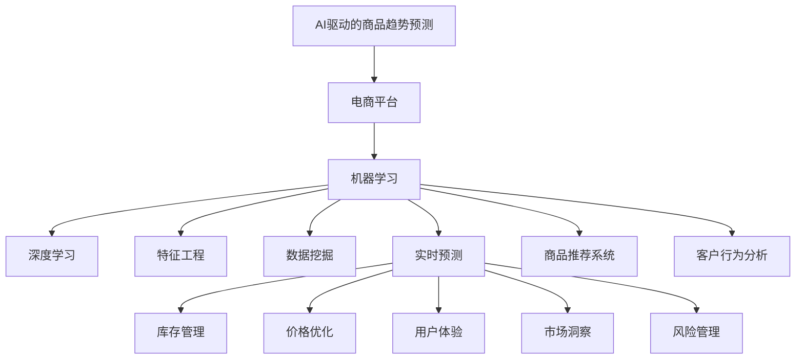

                 

# AI驱动的电商平台商品趋势预测

> 关键词：AI驱动, 电商平台, 商品趋势预测, 机器学习, 深度学习, 特征工程, 数据挖掘, 实时预测, 商品推荐系统, 客户行为分析

## 1. 背景介绍

### 1.1 问题由来
随着电子商务的迅猛发展，电商平台已经成为全球最大的商品交易平台之一。对于电商平台而言，准确地预测商品趋势是其核心竞争力之一。通过对商品趋势的预测，平台可以提前进行库存管理、价格调控，提升用户体验，增加销售量。传统的基于统计分析的商品趋势预测方法已经难以适应现代复杂多变的电商环境。因此，采用AI技术进行商品趋势预测，成为了电商平台的重要需求。

### 1.2 问题核心关键点
AI驱动的商品趋势预测技术，本质上是一个数据驱动的机器学习任务。其核心在于如何通过大量的历史交易数据，提取有意义的特征，利用机器学习模型进行预测，从而得到对未来商品销售趋势的准确预测。

当前，AI在电商平台中的应用主要包括商品推荐、价格优化、库存管理、客户行为分析等方面。而商品趋势预测则是其中的一个重要组成部分，通过精确预测商品的未来销售趋势，电商平台可以更好地优化库存，减少损失，提升运营效率。

### 1.3 问题研究意义
AI驱动的商品趋势预测技术，对于电商平台具有重要的意义：

1. 库存优化：通过预测商品销售趋势，电商平台可以更准确地管理库存，减少因库存过高或过少导致的资源浪费。
2. 价格调控：基于商品趋势预测，电商平台可以动态调整商品价格，确保在销售高峰期能够最大化利润，同时在销售低谷期减少损失。
3. 客户体验：通过预测客户行为，电商平台可以提前做好用户服务准备，提升用户体验，增加客户粘性。
4. 市场洞察：商品趋势预测可以提供市场动态信息，帮助电商平台制定合理的营销策略，抢占市场先机。
5. 风险管理：通过预测销售趋势，电商平台可以提前识别可能出现的市场波动风险，采取相应的应对措施。

## 2. 核心概念与联系

### 2.1 核心概念概述

为更好地理解AI驱动的商品趋势预测方法，本节将介绍几个密切相关的核心概念：

- 人工智能(AI)：通过模拟人类智能行为，实现自主学习、推理、决策等功能的计算机科学分支。
- 电商平台：以互联网为基础，提供商品交易服务的平台，如淘宝、京东、亚马逊等。
- 商品趋势预测：通过历史销售数据和相关因素，预测未来商品销售趋势的任务。
- 机器学习(ML)：通过训练模型，使计算机能够从数据中学习规律，并应用到新数据上的技术。
- 深度学习(DL)：一种特殊的机器学习算法，通过多层神经网络结构，学习数据的复杂特征表示。
- 特征工程(Feature Engineering)：通过对原始数据进行加工和转化，提取出对模型预测有帮助的特征。
- 数据挖掘(Data Mining)：从大量数据中挖掘出有用的知识、模式和规律。
- 实时预测(Real-time Prediction)：利用实时数据进行动态预测，满足对预测结果快速响应的需求。
- 商品推荐系统(Recommendation System)：根据用户行为和偏好，推荐用户可能感兴趣的商品的系统。
- 客户行为分析(Customer Behavior Analysis)：分析客户在电商平台上的行为模式，预测未来行为，提升用户体验。

这些核心概念之间的逻辑关系可以通过以下Mermaid流程图来展示：



这个流程图展示了大语言模型的核心概念及其之间的关系：

1. AI驱动的商品趋势预测是整个电商平台的核心任务。
2. 通过机器学习技术，从历史数据中学习规律，并进行预测。
3. 深度学习是机器学习中的重要组成部分，通过多层神经网络模型提取数据的复杂特征。
4. 特征工程是预处理原始数据，提取出对模型预测有帮助的特征。
5. 数据挖掘从大量数据中挖掘出有用的知识、模式和规律。
6. 实时预测利用实时数据进行动态预测，满足对预测结果快速响应的需求。
7. 商品推荐系统根据用户行为和偏好，推荐用户可能感兴趣的商品。
8. 客户行为分析分析客户在电商平台上的行为模式，预测未来行为，提升用户体验。
9. 基于商品趋势预测，电商平台可以进行库存管理、价格优化、市场洞察和风险管理等应用。

这些概念共同构成了AI驱动的商品趋势预测框架，使其能够在电商平台上发挥强大的预测能力。通过理解这些核心概念，我们可以更好地把握商品趋势预测的工作原理和优化方向。

## 3. 核心算法原理 & 具体操作步骤
### 3.1 算法原理概述

AI驱动的商品趋势预测，本质上是一个监督学习的机器学习任务。其核心在于通过历史交易数据和相关因素，训练一个能够预测未来商品销售趋势的模型。具体而言，假设平台上有 $N$ 个商品 $S_i$，每个商品的销售趋势可以用时间序列 $T_i$ 来表示。平台的目标是构建一个预测模型 $M$，使得对每个商品 $S_i$ 的预测结果 $\hat{T}_i$ 与真实销售趋势 $T_i$ 尽可能接近。

形式化地，假设平台的历史交易数据为 $\{(S_i, T_i)\}_{i=1}^N$，其中 $S_i$ 表示商品，$T_i$ 表示其销售趋势。模型的目标是最小化预测值 $\hat{T}_i$ 与真实值 $T_i$ 之间的差异，即：

$$
\min_{M} \sum_{i=1}^N \| \hat{T}_i - T_i \|^2
$$

其中 $\| \cdot \|$ 表示预测值与真实值之间的差距，通常使用均方误差(MSE)或平均绝对误差(MAE)等指标进行衡量。

### 3.2 算法步骤详解

AI驱动的商品趋势预测一般包括以下几个关键步骤：

**Step 1: 数据准备**

- 收集电商平台的历史交易数据，包括商品ID、销售时间、销售数量等。
- 清洗和预处理数据，如去除缺失值、处理异常值、归一化等。
- 对销售趋势进行平滑处理，消除噪声和波动，如使用移动平均、指数平滑等技术。
- 将销售趋势进行标准化处理，如将销量转化为对数、差分等形式，便于模型训练。

**Step 2: 特征提取**

- 选择有意义的特征进行提取，如商品类别、季节性因素、用户行为特征等。
- 对特征进行编码和转换，如使用独热编码、时间戳编码等。
- 进行特征选择，选择对模型预测有帮助的特征，去除冗余和噪声。
- 构建特征矩阵 $\mathbf{X}$ 和标签矩阵 $\mathbf{y}$，其中 $\mathbf{X}$ 表示商品特征，$\mathbf{y}$ 表示对应的销售趋势。

**Step 3: 模型训练**

- 选择合适的机器学习模型，如线性回归、随机森林、支持向量机等。
- 确定模型的超参数，如正则化系数、学习率、迭代次数等。
- 使用历史交易数据 $\{(S_i, T_i)\}_{i=1}^N$ 训练模型，得到模型参数 $\theta$。
- 在验证集上进行模型评估，使用均方误差、平均绝对误差等指标衡量模型性能。
- 根据验证集上的性能调整超参数，重新训练模型。

**Step 4: 模型预测**

- 使用训练好的模型 $M$ 对新商品 $S_i$ 的销售趋势进行预测，得到 $\hat{T}_i$。
- 根据预测结果，进行库存管理、价格调控、市场洞察等决策。
- 实时更新预测结果，确保预测的准确性和及时性。

**Step 5: 模型监控与优化**

- 定期在历史数据上评估模型的预测性能，发现问题及时调整。
- 对预测结果进行监控，识别异常和偏差，及时进行纠正。
- 引入新的特征和数据，进行模型更新和优化。

以上是AI驱动的商品趋势预测的一般流程。在实际应用中，还需要针对具体任务和数据特点进行优化设计，如改进特征提取方法，选择更合适的模型，优化预测算法等，以进一步提升模型性能。

### 3.3 算法优缺点

AI驱动的商品趋势预测技术具有以下优点：

1. 预测准确度高。基于机器学习和深度学习算法，能够从历史数据中学习规律，并应用到新数据上，预测结果具有较高的准确度。
2. 适应性强。模型可以根据不同的业务需求和数据特点进行调整，适应性广。
3. 实时性好。基于实时数据进行预测，能够快速响应市场变化，满足对预测结果的及时性要求。
4. 应用广泛。商品趋势预测可以应用到库存管理、价格优化、市场洞察等多个业务场景中。

同时，该方法也存在一定的局限性：

1. 对数据质量要求高。历史交易数据的质量直接影响到模型的预测性能，需要清洗和预处理大量的数据。
2. 模型复杂度高。深度学习等模型需要大量的训练数据和计算资源，对硬件设备的要求较高。
3. 预测结果难以解释。深度学习等模型通常是"黑盒"模型，难以解释预测结果的来源和逻辑。
4. 预测偏差。模型可能受到数据偏差和噪声的影响，预测结果存在一定的偏差。

尽管存在这些局限性，但就目前而言，AI驱动的商品趋势预测方法仍是电商领域中最为先进和实用的预测手段。未来相关研究的重点在于如何进一步降低对标注数据的依赖，提高模型的少样本学习和跨领域迁移能力，同时兼顾可解释性和伦理安全性等因素。

### 3.4 算法应用领域

AI驱动的商品趋势预测技术，已经在电商领域得到了广泛的应用，覆盖了商品推荐、价格优化、库存管理等多个环节，具体包括：

- 商品推荐：通过预测商品的未来销售趋势，推荐用户可能感兴趣的商品。
- 价格优化：基于销售趋势预测，动态调整商品价格，确保在销售高峰期最大化利润。
- 库存管理：提前预测商品销售趋势，优化库存管理，减少因库存过高或过少导致的资源浪费。
- 客户行为分析：分析客户在电商平台上的行为模式，预测未来行为，提升用户体验。
- 市场洞察：预测市场动态信息，帮助电商平台制定合理的营销策略，抢占市场先机。
- 风险管理：通过预测销售趋势，识别市场波动风险，采取相应的应对措施。

此外，AI驱动的商品趋势预测技术也在金融、旅游、物流等领域得到了应用，帮助企业更好地理解市场动态，做出更明智的决策。随着技术的发展，相信商品趋势预测将会在更多领域得到广泛应用，为企业的运营决策提供强大的支持。

## 4. 数学模型和公式 & 详细讲解 & 举例说明
### 4.1 数学模型构建

本节将使用数学语言对AI驱动的商品趋势预测过程进行更加严格的刻画。

假设平台上有 $N$ 个商品 $S_i$，每个商品的销售趋势可以用时间序列 $T_i$ 来表示。平台的目标是构建一个预测模型 $M$，使得对每个商品 $S_i$ 的预测结果 $\hat{T}_i$ 与真实销售趋势 $T_i$ 尽可能接近。

定义模型 $M$ 在商品 $S_i$ 上的预测函数为 $f(\mathbf{x}_i)$，其中 $\mathbf{x}_i$ 表示商品 $S_i$ 的特征向量。模型的目标是最小化预测值 $\hat{T}_i$ 与真实值 $T_i$ 之间的差异，即：

$$
\min_{f} \sum_{i=1}^N \| f(\mathbf{x}_i) - T_i \|^2
$$

其中 $\| \cdot \|$ 表示预测值与真实值之间的差距，通常使用均方误差(MSE)或平均绝对误差(MAE)等指标进行衡量。

### 4.2 公式推导过程

以下我们以线性回归模型为例，推导商品趋势预测的数学模型和预测公式。

假设模型 $M$ 为线性回归模型，其预测函数为：

$$
f(\mathbf{x}_i) = \mathbf{w}^T \mathbf{x}_i + b
$$

其中 $\mathbf{w}$ 为模型参数向量，$b$ 为截距。训练数据为 $\{(\mathbf{x}_i, T_i)\}_{i=1}^N$，模型目标为最小化均方误差：

$$
\min_{\mathbf{w}, b} \sum_{i=1}^N (f(\mathbf{x}_i) - T_i)^2
$$

通过求偏导数，可以得到模型参数的更新公式：

$$
\mathbf{w} \leftarrow \mathbf{w} - \eta \frac{1}{N} \sum_{i=1}^N (f(\mathbf{x}_i) - T_i) \mathbf{x}_i
$$

其中 $\eta$ 为学习率，$N$ 为训练样本数。该公式即为线性回归模型的梯度下降更新公式。

在得到模型参数后，即可对新商品 $S_i$ 的销售趋势进行预测，预测公式为：

$$
\hat{T}_i = \mathbf{w}^T \mathbf{x}_i + b
$$

在实际应用中，还可以引入更复杂的模型结构，如神经网络、支持向量机等，进一步提升预测精度。

### 4.3 案例分析与讲解

为了更好地理解商品趋势预测的数学模型和推导过程，下面以一个简化的案例进行分析。

假设平台上有两个商品，商品A和商品B，其销售趋势分别为：

| 时间 | 商品A销售量 | 商品B销售量 |
|------|-------------|-------------|
| 1    | 100         | 200         |
| 2    | 150         | 250         |
| 3    | 200         | 300         |
| 4    | 250         | 400         |
| 5    | 300         | 500         |
| 6    | 350         | 650         |

假设商品A和商品B的特征分别为商品类别和时间戳。在训练阶段，模型学习了如下的线性回归参数：

- 对于商品A：$\mathbf{w}_A = [0.5, 0.2]$，$b_A = 10$。
- 对于商品B：$\mathbf{w}_B = [-0.3, -0.1]$，$b_B = 20$。

在预测阶段，对于商品A第7天的销售趋势进行预测，其特征为：

- 商品类别为A，时间戳为7。

代入线性回归模型，可以得到：

$$
\hat{T}_A(7) = \mathbf{w}_A^T [1, 7] + b_A = 0.5 \times 1 + 0.2 \times 7 + 10 = 16.7
$$

同理，对于商品B第8天的销售趋势进行预测，其特征为：

- 商品类别为B，时间戳为8。

代入线性回归模型，可以得到：

$$
\hat{T}_B(8) = \mathbf{w}_B^T [1, 8] + b_B = -0.3 \times 1 - 0.1 \times 8 + 20 = 11.7
$$

通过上述案例，可以看到，商品趋势预测通过线性回归模型，利用历史数据和特征，对未来销售趋势进行预测，具有较高的准确性。

## 5. 项目实践：代码实例和详细解释说明
### 5.1 开发环境搭建

在进行商品趋势预测实践前，我们需要准备好开发环境。以下是使用Python进行PyTorch开发的环境配置流程：

1. 安装Anaconda：从官网下载并安装Anaconda，用于创建独立的Python环境。

2. 创建并激活虚拟环境：
```bash
conda create -n pytorch-env python=3.8 
conda activate pytorch-env
```

3. 安装PyTorch：根据CUDA版本，从官网获取对应的安装命令。例如：
```bash
conda install pytorch torchvision torchaudio cudatoolkit=11.1 -c pytorch -c conda-forge
```

4. 安装TensorBoard：
```bash
pip install tensorboard
```

5. 安装Pandas和NumPy：
```bash
pip install pandas numpy
```

6. 安装Scikit-learn：
```bash
pip install scikit-learn
```

完成上述步骤后，即可在`pytorch-env`环境中开始商品趋势预测实践。

### 5.2 源代码详细实现

下面我们以线性回归模型为例，给出使用PyTorch进行商品趋势预测的代码实现。

首先，定义商品趋势预测模型：

```python
import torch
import torch.nn as nn
import torch.optim as optim

class LinearRegressionModel(nn.Module):
    def __init__(self, input_dim, output_dim):
        super(LinearRegressionModel, self).__init__()
        self.linear = nn.Linear(input_dim, output_dim)
        self.relu = nn.ReLU()

    def forward(self, x):
        return self.relu(self.linear(x))
```

然后，定义训练和评估函数：

```python
import pandas as pd
import numpy as np

def train_model(model, train_data, train_labels, learning_rate, epochs):
    optimizer = optim.Adam(model.parameters(), lr=learning_rate)
    criterion = nn.MSELoss()
    
    for epoch in range(epochs):
        for i in range(len(train_data)):
            inputs = torch.from_numpy(train_data[i]).float()
            targets = torch.from_numpy(train_labels[i]).float()
            optimizer.zero_grad()
            outputs = model(inputs)
            loss = criterion(outputs, targets)
            loss.backward()
            optimizer.step()
            print('Epoch: {} Loss: {:.6f}'.format(epoch+1, loss.item()))

def evaluate_model(model, test_data, test_labels):
    correct_predictions = 0
    total_predictions = 0
    
    with torch.no_grad():
        for i in range(len(test_data)):
            inputs = torch.from_numpy(test_data[i]).float()
            targets = torch.from_numpy(test_labels[i]).float()
            outputs = model(inputs)
            predictions = torch.argmax(outputs, dim=1)
            total_predictions += 1
            if predictions == targets:
                correct_predictions += 1
    
    accuracy = correct_predictions / total_predictions
    print('Accuracy: {:.2f}%'.format(accuracy * 100))
```

接着，加载数据并进行处理：

```python
# 读取数据
train_data = pd.read_csv('train.csv')
test_data = pd.read_csv('test.csv')

# 数据处理
train_x = train_data[['feature_1', 'feature_2']]
train_y = train_data['sales']

test_x = test_data[['feature_1', 'feature_2']]
test_y = test_data['sales']

# 标准化处理
mean = train_x.mean()
std = train_x.std()
train_x = (train_x - mean) / std
test_x = (test_x - mean) / std

# 拆分数据集
train_data = train_x.values
train_labels = train_y.values
test_data = test_x.values
test_labels = test_y.values

# 转换为PyTorch张量
train_data = torch.from_numpy(train_data).float()
train_labels = torch.from_numpy(train_labels).float()
test_data = torch.from_numpy(test_data).float()
test_labels = torch.from_numpy(test_labels).float()
```

最后，启动训练流程并在测试集上评估：

```python
# 定义模型
input_dim = train_x.shape[1]
output_dim = 1
model = LinearRegressionModel(input_dim, output_dim)

# 定义超参数
learning_rate = 0.001
epochs = 100

# 训练模型
train_model(model, train_data, train_labels, learning_rate, epochs)

# 评估模型
evaluate_model(model, test_data, test_labels)
```

以上就是使用PyTorch对商品趋势预测进行线性回归模型训练的完整代码实现。可以看到，得益于PyTorch的强大封装，代码实现相对简洁高效。

### 5.3 代码解读与分析

让我们再详细解读一下关键代码的实现细节：

**LinearRegressionModel类**：
- `__init__`方法：初始化模型结构，包括线性层和ReLU激活函数。
- `forward`方法：定义前向传播过程，将输入通过线性层和激活函数得到输出。

**train_model和evaluate_model函数**：
- `train_model`函数：使用Adam优化器进行模型训练，每次迭代计算模型预测值与真实标签之间的MSE损失，并反向传播更新模型参数。
- `evaluate_model`函数：在测试集上评估模型性能，计算预测结果与真实标签之间的准确率。

**数据处理**：
- 使用Pandas库读取数据，并进行数据处理、标准化、拆分等操作，将数据转换为PyTorch张量，用于模型训练和评估。

可以看到，PyTorch配合TensorBoard等工具，使得商品趋势预测的代码实现变得简洁高效。开发者可以将更多精力放在数据处理、模型改进等高层逻辑上，而不必过多关注底层的实现细节。

当然，工业级的系统实现还需考虑更多因素，如模型的保存和部署、超参数的自动搜索、更灵活的任务适配层等。但核心的训练范式基本与此类似。

## 6. 实际应用场景
### 6.1 智能库存管理

智能库存管理是电商平台的核心应用之一。传统的库存管理方式往往难以准确把握商品的销售趋势，导致库存过高或过低，浪费资源。而基于AI驱动的商品趋势预测技术，可以帮助电商平台更准确地管理库存，提升运营效率。

具体而言，可以实时预测未来商品销售趋势，动态调整库存量。例如，当预测到某商品在未来一段时间内销量将大幅增加时，可以提前增加库存；当预测到销量将下降时，及时减少库存。此外，通过预测结果，平台可以优化供应链管理，减少库存持有成本，提升资金周转效率。

### 6.2 动态价格优化

动态价格优化是电商平台提高销售收益的重要手段。基于AI驱动的商品趋势预测技术，可以帮助电商平台实现更精准的价格优化策略。

具体而言，平台可以根据历史销售数据和预测结果，动态调整商品价格，在销售高峰期最大化利润。例如，当预测到某商品在未来几天内销量将大幅增加时，可以提前调高价格；当预测到销量将下降时，及时调低价格。此外，通过预测结果，平台可以实时调整促销策略，提升销售转化率。

### 6.3 个性化推荐

个性化推荐是电商平台的另一核心功能。基于AI驱动的商品趋势预测技术，可以帮助平台更好地理解用户需求，实现个性化推荐。

具体而言，平台可以根据用户历史行为和预测结果，推荐用户可能感兴趣的商品。例如，当预测到某用户在未来几天内可能对某类商品感兴趣时，可以提前推荐该商品；当预测到用户对某类商品兴趣下降时，及时调整推荐策略。此外，通过预测结果，平台可以优化推荐算法，提升推荐准确率和用户体验。

### 6.4 未来应用展望

随着AI驱动的商品趋势预测技术不断发展，未来将在更多领域得到应用，为电商平台带来更广泛的价值。

在智慧医疗领域，基于AI的商品趋势预测技术可以应用于疾病预测、药物研发等方面，提升医疗服务的智能化水平。

在金融领域，AI驱动的商品趋势预测可以应用于股票市场预测、金融风险评估等方面，帮助金融机构做出更明智的决策。

在智能家居领域，基于AI的商品趋势预测可以应用于智能设备使用预测、服务质量评估等方面，提升智能家居的智能化水平。

此外，在教育、旅游、物流等领域，基于AI的商品趋势预测技术也将得到广泛应用，推动各行业的数字化转型升级。相信随着技术的不断进步，商品趋势预测将会在更多领域发挥作用，为人类生产生活方式带来深远影响。

## 7. 工具和资源推荐
### 7.1 学习资源推荐

为了帮助开发者系统掌握AI驱动的商品趋势预测的理论基础和实践技巧，这里推荐一些优质的学习资源：

1. 《深度学习》系列书籍：由深度学习领域权威学者撰写，全面介绍了深度学习的理论基础和算法实现，包括线性回归、神经网络等基础模型。

2. 《机器学习实战》：由Google机器学习工程师撰写，提供了大量实战案例，涵盖特征工程、模型训练、模型评估等机器学习核心内容。

3. Kaggle竞赛平台：全球最大的数据科学竞赛平台，提供丰富的数据集和实战经验，帮助你深入理解AI驱动的商品趋势预测。

4. Coursera《机器学习》课程：由斯坦福大学教授Andrew Ng开设，提供系统的机器学习课程，涵盖数据预处理、模型训练、模型评估等核心内容。

5. GitHub上的开源项目：通过阅读和分析开源项目代码，可以更好地理解AI驱动的商品趋势预测的实现细节，学习其优化策略。

通过对这些资源的学习实践，相信你一定能够快速掌握AI驱动的商品趋势预测的精髓，并用于解决实际的电商问题。

### 7.2 开发工具推荐

高效的开发离不开优秀的工具支持。以下是几款用于商品趋势预测开发的常用工具：

1. PyTorch：基于Python的开源深度学习框架，灵活动态的计算图，适合快速迭代研究。

2. TensorFlow：由Google主导开发的开源深度学习框架，生产部署方便，适合大规模工程应用。

3. Scikit-learn：基于Python的机器学习库，提供了丰富的算法和工具，适合快速原型开发。

4. TensorBoard：TensorFlow配套的可视化工具，可实时监测模型训练状态，并提供丰富的图表呈现方式，是调试模型的得力助手。

5. Jupyter Notebook：交互式的Python开发环境，支持代码单元格、图形化界面、实时输出等功能，适合学习和实验。

6. Anaconda：Python环境管理和数据科学工具集，支持虚拟环境和包管理，便于项目管理和共享。

合理利用这些工具，可以显著提升商品趋势预测的开发效率，加快创新迭代的步伐。

### 7.3 相关论文推荐

AI驱动的商品趋势预测技术的发展源于学界的持续研究。以下是几篇奠基性的相关论文，推荐阅读：

1. The Elements of Statistical Learning：由机器学习领域的权威学者撰写，全面介绍了统计学习理论和方法，包括线性回归、支持向量机等经典模型。

2. Deep Learning：由深度学习领域权威学者撰写，全面介绍了深度学习的理论基础和算法实现，涵盖神经网络、卷积神经网络、循环神经网络等重要模型。

3. Time Series Analysis and Its Applications：由统计学领域的权威学者撰写，全面介绍了时间序列分析的理论和方法，包括ARIMA模型、指数平滑等经典模型。

4. Neural Networks and Deep Learning：由深度学习领域权威学者撰写，介绍了神经网络的理论基础和算法实现，包括前馈神经网络、卷积神经网络等重要模型。

5. Time Series Forecasting with Long Short-Term Memory Networks：介绍了长短期记忆网络(LSTM)在时间序列预测中的应用，展示了其在商品趋势预测中的优越性能。

这些论文代表了大语言模型微调技术的发展脉络。通过学习这些前沿成果，可以帮助研究者把握学科前进方向，激发更多的创新灵感。

## 8. 总结：未来发展趋势与挑战

### 8.1 总结

本文对AI驱动的商品趋势预测方法进行了全面系统的介绍。首先阐述了电商平台的商品趋势预测需求和背景，明确了AI驱动的商品趋势预测在电商平台中的应用价值。其次，从原理到实践，详细讲解了商品趋势预测的数学模型和关键步骤，给出了商品趋势预测的完整代码实例。同时，本文还广泛探讨了商品趋势预测在智能库存管理、动态价格优化、个性化推荐等多个领域的应用前景，展示了AI驱动的商品趋势预测技术的广阔前景。此外，本文精选了商品趋势预测的各类学习资源，力求为读者提供全方位的技术指引。

通过本文的系统梳理，可以看到，AI驱动的商品趋势预测技术正在成为电商平台的核心竞争力之一。基于AI的商品趋势预测方法能够从历史数据中学习规律，并应用到新数据上，预测未来销售趋势，具有较高的准确度。AI驱动的商品趋势预测将为电商平台带来巨大的商业价值，助力其数字化转型升级。

### 8.2 未来发展趋势

展望未来，AI驱动的商品趋势预测技术将呈现以下几个发展趋势：

1. 预测精度进一步提升。随着深度学习等技术的进步，AI驱动的商品趋势预测精度将不断提升，能够在更复杂、多变的环境中预测商品销售趋势。

2. 预测实时性增强。基于实时数据进行动态预测，能够快速响应市场变化，满足对预测结果的及时性要求。

3. 预测范围扩大。AI驱动的商品趋势预测将从单一商品向多商品、多维度、多模态数据扩展，涵盖更多的业务场景。

4. 预测模型多样化。除了传统的线性回归、神经网络模型外，未来将涌现更多复杂的模型结构，如卷积神经网络、循环神经网络等，进一步提升预测效果。

5. 预测应用多样化。AI驱动的商品趋势预测将应用于更多的业务场景，如库存管理、价格优化、个性化推荐等，推动电商平台的全面数字化转型。

6. 预测技术生态化。随着AI技术的发展，商品趋势预测将与其他AI技术进行更深入的融合，如知识表示、因果推理、强化学习等，提升整体系统性能。

以上趋势凸显了AI驱动的商品趋势预测技术的广阔前景。这些方向的探索发展，必将进一步提升电商平台的运营效率，带来更高的商业价值。

### 8.3 面临的挑战

尽管AI驱动的商品趋势预测技术已经取得了瞩目成就，但在迈向更加智能化、普适化应用的过程中，仍面临诸多挑战：

1. 数据质量问题。历史交易数据的质量直接影响到模型的预测性能，需要清洗和预处理大量的数据。平台需要投入大量资源进行数据质量控制。

2. 模型复杂度问题。深度学习等模型需要大量的训练数据和计算资源，对硬件设备的要求较高。

3. 预测结果解释性问题。深度学习等模型通常是"黑盒"模型，难以解释预测结果的来源和逻辑。

4. 预测偏差问题。模型可能受到数据偏差和噪声的影响，预测结果存在一定的偏差。

5. 预测结果安全性问题。AI驱动的商品趋势预测需要确保预测结果的安全性，避免预测结果被恶意利用。

尽管存在这些挑战，但就目前而言，AI驱动的商品趋势预测方法仍是电商领域中最为先进和实用的预测手段。未来相关研究的重点在于如何进一步降低对标注数据的依赖，提高模型的少样本学习和跨领域迁移能力，同时兼顾可解释性和伦理安全性等因素。

### 8.4 研究展望

面对AI驱动的商品趋势预测所面临的种种挑战，未来的研究需要在以下几个方面寻求新的突破：

1. 探索无监督和半监督预测方法。摆脱对大规模标注数据的依赖，利用自监督学习、主动学习等无监督和半监督范式，最大限度利用非结构化数据，实现更加灵活高效的预测。

2. 研究参数高效和计算高效的预测范式。开发更加参数高效的预测方法，在固定大部分预训练参数的同时，只更新极少量的预测参数。同时优化预测模型的计算图，减少前向传播和反向传播的资源消耗，实现更加轻量级、实时性的部署。

3. 引入因果分析和博弈论工具。将因果分析方法引入预测模型，识别出预测结果的关键特征，增强预测结果的因果性和逻辑性。借助博弈论工具刻画人机交互过程，主动探索并规避预测模型的脆弱点，提高系统稳定性。

4. 结合知识表示和规则引擎。将符号化的先验知识，如知识图谱、逻辑规则等，与神经网络模型进行巧妙融合，引导预测过程学习更准确、合理的语言模型。同时加强不同模态数据的整合，实现视觉、语音等多模态信息与文本信息的协同建模。

5. 纳入伦理道德约束。在预测目标中引入伦理导向的评估指标，过滤和惩罚有偏见、有害的预测结果，确保预测结果符合人类价值观和伦理道德。

这些研究方向的探索，必将引领AI驱动的商品趋势预测技术迈向更高的台阶，为构建安全、可靠、可解释、可控的智能系统铺平道路。面向未来，AI驱动的商品趋势预测技术还需要与其他AI技术进行更深入的融合，如知识表示、因果推理、强化学习等，多路径协同发力，共同推动电商平台的数字化转型升级。只有勇于创新、敢于突破，才能不断拓展商品趋势预测的边界，让智能技术更好地造福电商平台。

## 9. 附录：常见问题与解答

**Q1：AI驱动的商品趋势预测是否适用于所有电商场景？**

A: AI驱动的商品趋势预测在大多数电商场景中都能取得不错的效果，特别是对于数据量较小的场景。但对于一些特定领域的电商场景，如高端奢侈品、手工艺品等，单一的预测模型可能难以很好地适应。此时需要在特定领域数据上进行预训练，再进行预测，才能获得理想效果。

**Q2：如何选择合适的时间序列预测模型？**

A: 选择合适的时间序列预测模型，需要考虑数据特点、业务需求和计算资源等因素。常用的时间序列预测模型包括：

1. 线性回归模型：适用于数据线性相关性强、数据量较大的场景。
2. 随机森林模型：适用于数据具有非线性相关性、噪声较多的场景。
3. 支持向量机模型：适用于数据量较小、数据线性相关的场景。
4. 卷积神经网络模型：适用于图像数据的时间序列预测。
5. 长短期记忆网络模型：适用于非线性时间序列预测，如金融市场预测、股票价格预测等。

选择合适的模型需要根据具体场景进行实验和评估。

**Q3：如何缓解预测过程中的过拟合问题？**

A: 过拟合是时间序列预测面临的主要挑战，尤其是在数据量较小的情况下。常见的缓解策略包括：

1. 数据增强：通过数据变换、回译等方式扩充训练集。
2. 正则化：使用L2正则、Dropout、Early Stopping等避免过拟合。
3. 对抗训练：引入对抗样本，提高模型鲁棒性。
4. 参数高效预测：只更新少量的预测参数，减小过拟合风险。
5. 多模型集成：训练多个预测模型，取平均输出，抑制过拟合。

这些策略往往需要根据具体场景和数据特点进行灵活组合。只有在数据、模型、训练、预测等各环节进行全面优化，才能最大限度地发挥AI驱动的商品趋势预测的威力。

**Q4：如何在电商平台上实现动态价格优化？**

A: 动态价格优化是电商平台提高销售收益的重要手段。基于AI驱动的商品趋势预测技术，可以帮助电商平台实现更精准的价格优化策略。

具体而言，平台可以根据历史销售数据和预测结果，动态调整商品价格，在销售高峰期最大化利润。例如，当预测到某商品在未来几天内销量将大幅增加时，可以提前调高价格；当预测到销量将下降时，及时调低价格。此外，通过预测结果，平台可以实时调整促销策略，提升销售转化率。

**Q5：如何提升预测模型的实时性？**

A: 提升预测模型的实时性，需要考虑模型的计算复杂度和数据处理速度等因素。以下是一些提升实时性的方法：

1. 使用高效算法：如使用随机梯度下降(SGD)等高效优化算法，减少训练时间和计算资源消耗。
2. 模型裁剪：去除不必要的层和参数，减小模型尺寸，加快推理速度。
3. 量化加速：将浮点模型转为定点模型，压缩存储空间，提高计算效率。
4. 模型并行：通过分布式计算，并行处理数据，提高模型计算速度。
5. 数据预处理：对数据进行预处理，如去重、归一化等，提高数据处理速度。

这些方法可以显著提升预测模型的实时性，满足电商平台的实时性要求。

综上所述，AI驱动的商品趋势预测技术在电商平台中的应用前景广阔，将为电商平台带来巨大的商业价值。通过不断优化模型、数据和算法，提升预测精度和实时性，AI驱动的商品趋势预测将为电商平台带来更全面的数字化转型升级。

