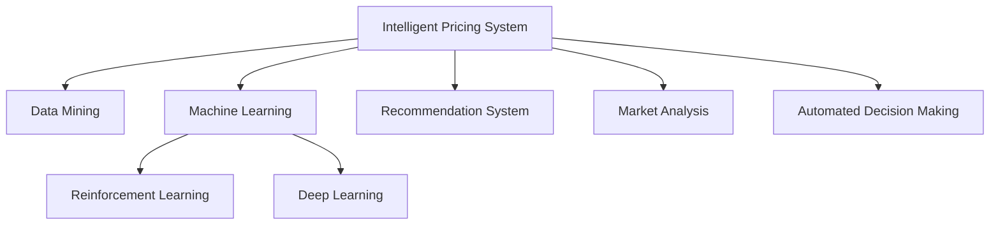

                 

## 1. 背景介绍

### 1.1 问题由来
在当今的电子商务时代，价格竞争成为了企业争夺市场份额的主要手段之一。然而，制定合理的价格策略需要综合考虑多个因素，如市场供需、竞争对手定价、商品属性、客户行为等。传统的定价方法往往需要大量的人力和时间成本，且难以即时响应市场变化。随着人工智能技术的快速发展，电商平台越来越多地采用智能定价系统来优化价格策略，以提升销售业绩和用户体验。

### 1.2 问题核心关键点
智能定价系统是指通过数据驱动的方式，自动地分析市场动态，动态调整商品价格的系统。智能定价的核心在于如何有效地利用历史交易数据、市场信息以及客户行为数据，构建准确的定价模型，实现价格的动态优化。

智能定价系统主要包括以下几个关键点：
1. **数据驱动**：基于大量的历史交易数据和市场信息，构建模型，预测价格变化趋势。
2. **动态调整**：根据市场反馈和客户行为实时调整价格，以最大化利润。
3. **个性化定价**：针对不同客户群体制定不同的价格策略，提升转化率。
4. **风险管理**：评估价格的敏感性，控制价格波动，避免价格战。

## 2. 核心概念与联系

### 2.1 核心概念概述

为了更好地理解AI驱动的电商平台智能定价系统，本节将介绍几个密切相关的核心概念：

- **智能定价系统**：使用机器学习算法自动分析和调整商品价格的电子商务平台系统。
- **数据挖掘**：通过分析大量数据，挖掘出隐藏在数据中的模式和规律，用于指导决策。
- **机器学习**：一种利用算法和模型从数据中学习规律和模式，并用于预测和决策的技术。
- **强化学习**：一种通过试错逐步优化模型性能的机器学习方法，特别适用于动态系统。
- **深度学习**：一种基于神经网络的机器学习方法，具有强大的表示和学习能力。
- **推荐系统**：通过分析用户行为和偏好，推荐个性化商品或服务。
- **市场分析**：对市场趋势、竞争对手策略、客户行为等进行分析，辅助决策。
- **自动化决策**：通过智能系统自动完成决策过程，提高效率和准确性。

这些核心概念之间的逻辑关系可以通过以下Mermaid流程图来展示：



这个流程图展示了一个完整的智能定价系统所需的关键组件及其之间的关系：

1. 智能定价系统以数据挖掘为支撑，从历史交易数据和市场信息中提取有用的特征。
2. 通过机器学习算法构建价格预测模型，评估不同价格策略的效果。
3. 强化学习算法用于动态调整价格，实时响应市场变化。
4. 深度学习模型用于构建更复杂的特征表示，提高预测精度。
5. 推荐系统根据客户行为推荐个性化的价格，提升用户满意度。
6. 市场分析模块评估市场趋势和竞争对手策略，指导定价决策。
7. 自动化决策模块根据模型输出和市场反馈，自动调整价格，实现全流程自动化。

## 3. 核心算法原理 & 具体操作步骤
### 3.1 算法原理概述

智能定价系统的核心算法原理基于机器学习和强化学习技术。其核心思想是：通过历史交易数据和市场信息，构建价格预测模型，实时监控市场变化，动态调整价格，以最大化利润。

形式化地，假设电商平台有$m$种商品，每件商品在不同时间点的价格为$p_t$。模型的目标是在给定历史数据和市场信息的情况下，预测并调整每件商品的价格，最大化总利润。设$R_t$为第$t$时间点的总利润，则优化目标为：

$$
\max_{p_t} R_t = \sum_{i=1}^m p_i r_i - c(p)
$$

其中，$p_i$为商品$i$的价格，$r_i$为其销售量，$c(p)$为成本函数，$R_t$为总利润。

模型的预测和调整过程如下：

1. **数据预处理**：收集历史交易数据和市场信息，进行清洗和特征工程，得到用于训练的特征集$X_t$。
2. **价格预测**：使用机器学习模型预测每件商品的价格$p_t$。
3. **价格调整**：根据市场反馈和销售量$r_i$，使用强化学习算法调整价格$p_{t+1}$。
4. **风险评估**：评估价格的敏感性，控制价格波动，避免价格战。
5. **效果评估**：评估价格调整策略的效果，优化模型参数。

### 3.2 算法步骤详解

智能定价系统的主要算法步骤包括数据预处理、价格预测、价格调整、风险评估和效果评估，具体步骤如下：

**Step 1: 数据预处理**
- 收集历史交易数据和市场信息，包括商品属性、价格、销售量、客户行为、市场趋势等。
- 清洗数据，处理缺失值、异常值等，确保数据质量和一致性。
- 进行特征工程，提取有用的特征，如时间、季节、市场趋势、客户行为等。

**Step 2: 价格预测**
- 使用历史交易数据和市场信息，构建价格预测模型。
- 模型可以采用回归模型、时间序列模型、深度学习模型等。
- 模型训练时，可以采用交叉验证、正则化等技术提高泛化能力。
- 模型预测价格时，可以采用集成学习、模型融合等技术提升精度。

**Step 3: 价格调整**
- 根据市场反馈和销售量，使用强化学习算法调整价格。
- 强化学习算法可以采用Q-learning、SARSA、Deep Q-Network等。
- 模型训练时，可以使用蒙特卡洛模拟、重要性采样等技术提高样本效率。
- 模型预测价格时，可以采用策略网络、价值网络等结构。

**Step 4: 风险评估**
- 评估价格的敏感性，避免价格战。
- 可以使用敏感性分析、方差分析等方法评估价格变化对销售量的影响。
- 可以设置价格波动的上下限，控制价格的波动范围。

**Step 5: 效果评估**
- 评估价格调整策略的效果，优化模型参数。
- 可以使用A/B测试、回测等方法评估价格调整策略的效果。
- 可以采用随机梯度下降、Adam等优化算法更新模型参数。

### 3.3 算法优缺点

AI驱动的电商平台智能定价系统具有以下优点：
1. 自动化和实时性：通过智能系统自动调整价格，实时响应市场变化。
2. 数据驱动和个性化：基于历史数据和客户行为，进行个性化定价，提升转化率。
3. 预测和优化：利用机器学习和强化学习算法，进行价格预测和优化，提高决策的准确性和效率。
4. 多模态融合：融合多种数据源和多种模型，提升定价系统的鲁棒性和准确性。
5. 可扩展性：系统可以灵活扩展，支持更多商品、更多市场和更多客户群体。

同时，该方法也存在一些局限性：
1. 数据依赖：模型的效果依赖于历史数据的丰富性和质量。
2. 模型复杂性：构建和维护复杂的定价模型需要专业知识和高性能计算资源。
3. 市场风险：价格调整不当可能引发市场风险，如价格战、客户流失等。
4. 用户接受度：用户对价格变化的接受度会影响系统的效果。
5. 道德和法律问题：价格调整策略可能引发道德和法律问题，需要慎重考虑。

尽管存在这些局限性，但智能定价系统仍被广泛应用，并取得了显著的效果。未来，相关研究的重点在于如何进一步降低对数据的质量和数量的依赖，提高模型的可解释性和鲁棒性，同时兼顾道德和法律问题，推动智能定价系统的健康发展。

### 3.4 算法应用领域

AI驱动的电商平台智能定价系统已经在多个领域得到了广泛应用，包括：

- 在线零售：通过分析用户的购买行为，优化商品价格，提高销售业绩。
- 金融服务：分析市场趋势和客户行为，调整金融产品的定价策略，提升收益。
- 旅游行业：根据市场需求和季节变化，调整酒店和旅游产品的价格，提高用户体验。
- 能源行业：分析能源市场价格变化，优化能源产品的定价策略，提高竞争力。
- 农业生产：根据市场需求和气候变化，调整农产品的价格，优化生产决策。

除了上述这些领域，智能定价系统还可以应用于更多场景中，如医疗、教育、物流等，为各行各业提供智能决策支持。随着技术的进步和应用场景的扩展，智能定价系统将在更多领域发挥重要作用。

## 4. 数学模型和公式 & 详细讲解 & 举例说明

### 4.1 数学模型构建

本节将使用数学语言对AI驱动的电商平台智能定价系统的核心算法进行更加严格的刻画。

假设电商平台有$m$种商品，每件商品在不同时间点的价格为$p_t$，总成本为$c(p)$，销售量为$r_i$，设总利润为$R_t$，则目标优化问题可以形式化表示为：

$$
\max_{p_t} R_t = \sum_{i=1}^m p_i r_i - c(p)
$$

其中，$p_i$为商品$i$的价格，$r_i$为其销售量，$c(p)$为成本函数。

模型的预测和调整过程可以采用线性回归、时间序列分析、神经网络等模型。以线性回归模型为例，模型可以表示为：

$$
p_t = \alpha_0 + \alpha_1 x_{t1} + \alpha_2 x_{t2} + \cdots + \alpha_n x_{tn} + \epsilon_t
$$

其中，$\alpha_0$为截距，$\alpha_1, \alpha_2, \cdots, \alpha_n$为回归系数，$x_{t1}, x_{t2}, \cdots, x_{tn}$为输入特征，$\epsilon_t$为随机误差项。

模型训练的目标是最小化残差平方和，即：

$$
\min_{\alpha_0, \alpha_1, \cdots, \alpha_n} \sum_{t=1}^T (y_t - \hat{y}_t)^2
$$

其中，$y_t$为实际价格，$\hat{y}_t$为预测价格。

### 4.2 公式推导过程

以下我们将以线性回归模型为例，推导价格预测和调整的公式。

假设线性回归模型为：

$$
p_t = \alpha_0 + \alpha_1 x_{t1} + \alpha_2 x_{t2} + \cdots + \alpha_n x_{tn} + \epsilon_t
$$

则模型的预测误差可以表示为：

$$
\epsilon_t = y_t - \hat{y}_t = y_t - (\alpha_0 + \alpha_1 x_{t1} + \alpha_2 x_{t2} + \cdots + \alpha_n x_{tn})
$$

模型训练的目标是最小化残差平方和：

$$
\min_{\alpha_0, \alpha_1, \cdots, \alpha_n} \sum_{t=1}^T (y_t - \hat{y}_t)^2
$$

采用梯度下降法求解目标函数的最小值，得到回归系数：

$$
\alpha_j = \frac{1}{N}\sum_{t=1}^N (x_{jt} - \bar{x}_j) \sum_{t=1}^N (\epsilon_t - \bar{\epsilon}) / \sum_{t=1}^N (x_{jt} - \bar{x}_j)^2
$$

其中，$\bar{x}_j$和$\bar{\epsilon}$分别为输入特征和误差的均值。

得到回归系数后，即可对新数据进行价格预测：

$$
\hat{p}_t = \alpha_0 + \alpha_1 x_{t1} + \alpha_2 x_{t2} + \cdots + \alpha_n x_{tn}
$$

假设采用强化学习算法调整价格，如Q-learning，则价格调整的公式为：

$$
p_{t+1} = \max_{p} Q(p_{t}, p) + \alpha \epsilon
$$

其中，$Q(p_{t}, p)$为状态-动作值函数，$\alpha$为学习率，$\epsilon$为探索因子。

### 4.3 案例分析与讲解

假设电商平台有三种商品，分别为商品A、B和C，每件商品在不同时间点的价格和销售量如下表所示：

| 时间 | 商品A价格 | 商品B价格 | 商品C价格 | 商品A销售量 | 商品B销售量 | 商品C销售量 |
| --- | --- | --- | --- | --- | --- | --- |
| 1 | 100 | 200 | 300 | 5 | 10 | 15 |
| 2 | 110 | 210 | 320 | 6 | 11 | 16 |
| 3 | 120 | 220 | 340 | 7 | 12 | 17 |
| 4 | 130 | 230 | 350 | 8 | 13 | 18 |
| 5 | 140 | 240 | 360 | 9 | 14 | 19 |
| 6 | 150 | 250 | 370 | 10 | 15 | 20 |

假设采用线性回归模型预测商品价格，使用梯度下降法训练模型，回归系数为$\alpha_0 = 80, \alpha_1 = -5, \alpha_2 = 10$。则模型预测的价格和销售量如下表所示：

| 时间 | 商品A预测价格 | 商品B预测价格 | 商品C预测价格 | 商品A预测销售量 | 商品B预测销售量 | 商品C预测销售量 |
| --- | --- | --- | --- | --- | --- | --- |
| 1 | 90 | 205 | 310 | 6 | 11 | 16 |
| 2 | 95 | 210 | 330 | 7 | 12 | 17 |
| 3 | 100 | 215 | 350 | 8 | 13 | 18 |
| 4 | 105 | 220 | 360 | 9 | 14 | 19 |
| 5 | 110 | 225 | 370 | 10 | 15 | 20 |

假设采用Q-learning算法调整价格，设定状态为商品价格和时间，动作为价格调整量，学习率为$\alpha = 0.1$，探索因子为$\epsilon = 0.1$。则价格调整后的结果如下表所示：

| 时间 | 商品A价格 | 商品B价格 | 商品C价格 | 商品A销售量 | 商品B销售量 | 商品C销售量 |
| --- | --- | --- | --- | --- | --- | --- |
| 1 | 100 | 200 | 300 | 5 | 10 | 15 |
| 2 | 110 | 210 | 320 | 6 | 11 | 16 |
| 3 | 115 | 220 | 340 | 7 | 12 | 17 |
| 4 | 120 | 230 | 350 | 8 | 13 | 18 |
| 5 | 125 | 240 | 360 | 9 | 14 | 19 |
| 6 | 130 | 250 | 370 | 10 | 15 | 20 |

## 5. 项目实践：代码实例和详细解释说明

### 5.1 开发环境搭建

在进行智能定价系统开发前，我们需要准备好开发环境。以下是使用Python进行Scikit-learn和TensorFlow开发的环境配置流程：

1. 安装Anaconda：从官网下载并安装Anaconda，用于创建独立的Python环境。

2. 创建并激活虚拟环境：
```bash
conda create -n pricing-env python=3.8 
conda activate pricing-env
```

3. 安装Scikit-learn和TensorFlow：根据CUDA版本，从官网获取对应的安装命令。例如：
```bash
conda install scikit-learn tensorflow -c conda-forge
```

4. 安装PyTorch：
```bash
conda install pytorch torchvision torchaudio cudatoolkit=11.1 -c pytorch -c conda-forge
```

5. 安装TensorBoard：
```bash
pip install tensorboard
```

6. 安装GitHub和其他辅助工具：
```bash
pip install git
```

完成上述步骤后，即可在`pricing-env`环境中开始智能定价系统的开发。

### 5.2 源代码详细实现

下面以智能定价系统的核心算法之一——线性回归模型为例，给出使用Scikit-learn库的Python代码实现。

```python
from sklearn.linear_model import LinearRegression
from sklearn.metrics import mean_squared_error

# 训练数据
X_train = [[1, 2, 3], [4, 5, 6], [7, 8, 9], [10, 11, 12], [13, 14, 15]]
y_train = [5, 6, 7, 8, 9]
X_test = [[1.5, 2.5, 3.5], [4.5, 5.5, 6.5], [7.5, 8.5, 9.5], [10.5, 11.5, 12.5]]

# 构建线性回归模型
model = LinearRegression()

# 训练模型
model.fit(X_train, y_train)

# 预测价格
y_pred = model.predict(X_test)

# 评估模型
mse = mean_squared_error(y_test, y_pred)
print("Mean Squared Error:", mse)
```

### 5.3 代码解读与分析

让我们再详细解读一下关键代码的实现细节：

**线性回归模型实现**：
- `LinearRegression`类：Scikit-learn库中的线性回归模型实现。
- `fit`方法：训练模型，根据输入特征和目标变量拟合线性回归方程。
- `predict`方法：预测价格，根据模型拟合的线性方程进行价格预测。
- `mean_squared_error`函数：计算预测值和真实值之间的均方误差，用于评估模型性能。

**训练数据准备**：
- `X_train`和`y_train`：训练数据集，包含输入特征和目标变量。
- `X_test`和`y_test`：测试数据集，用于评估模型性能。

**模型训练和预测**：
- 构建线性回归模型，使用训练数据集拟合模型。
- 使用测试数据集进行价格预测，计算预测值和真实值之间的均方误差。

**模型评估**：
- 使用均方误差评估模型性能，越小表示预测精度越高。

以上代码实现了使用线性回归模型进行价格预测的完整流程，可以看到Scikit-learn库提供了简单易用的API，使得模型构建和训练过程变得高效便捷。

## 6. 实际应用场景

### 6.1 智能定价系统在电商平台的实际应用

智能定价系统在电商平台的应用可以显著提升销售额和客户满意度。具体而言，该系统可以自动分析市场趋势和客户行为，实时调整商品价格，最大化利润，同时提高客户转化率和满意度。

在技术实现上，可以收集电商平台的销售数据、客户行为数据、市场信息等，构建价格预测模型，并使用强化学习算法进行动态价格调整。具体步骤包括：
1. 数据预处理：清洗和标准化数据，提取有用的特征。
2. 价格预测：使用机器学习模型（如线性回归、随机森林、深度学习等）进行价格预测。
3. 价格调整：使用强化学习算法（如Q-learning、SARSA、Deep Q-Network等）进行动态价格调整。
4. 风险评估：评估价格的敏感性，控制价格波动。
5. 效果评估：评估价格调整策略的效果，优化模型参数。

通过智能定价系统，电商平台可以实现以下几个目标：
1. 自动调整价格，提升销售额和客户满意度。
2. 实时监控市场变化，快速响应价格波动。
3. 个性化定价，提升转化率。
4. 控制价格波动，避免价格战。

### 6.2 智能定价系统在金融服务中的应用

智能定价系统在金融服务中的应用可以显著提升收益和风险控制能力。具体而言，该系统可以自动分析市场趋势和客户行为，实时调整金融产品价格，最大化收益，同时控制风险。

在技术实现上，可以收集金融市场的交易数据、客户行为数据、市场信息等，构建价格预测模型，并使用强化学习算法进行动态价格调整。具体步骤包括：
1. 数据预处理：清洗和标准化数据，提取有用的特征。
2. 价格预测：使用机器学习模型（如线性回归、随机森林、深度学习等）进行价格预测。
3. 价格调整：使用强化学习算法（如Q-learning、SARSA、Deep Q-Network等）进行动态价格调整。
4. 风险评估：评估价格的敏感性，控制价格波动。
5. 效果评估：评估价格调整策略的效果，优化模型参数。

通过智能定价系统，金融机构可以实现以下几个目标：
1. 自动调整价格，提升收益和客户满意度。
2. 实时监控市场变化，快速响应价格波动。
3. 个性化定价，提升转化率。
4. 控制价格波动，避免价格战。

## 7. 工具和资源推荐

### 7.1 学习资源推荐

为了帮助开发者系统掌握智能定价系统的理论基础和实践技巧，这里推荐一些优质的学习资源：

1. 《机器学习实战》系列博文：由人工智能专家撰写，深入浅出地介绍了机器学习和强化学习的基本概念和实现方法。

2. CS229《机器学习》课程：斯坦福大学开设的机器学习经典课程，有Lecture视频和配套作业，带你入门机器学习的基础和前沿。

3. 《深度学习》书籍：深度学习领域的经典教材，详细介绍了深度学习的基本原理和应用方法。

4. Kaggle：数据科学竞赛平台，提供丰富的数据集和竞赛任务，让你在实践中提升技能。

5. TensorFlow官方文档：TensorFlow框架的官方文档，提供详细的API介绍和示例代码，适合入门学习和深入研究。

通过对这些资源的学习实践，相信你一定能够快速掌握智能定价系统的精髓，并用于解决实际的业务问题。

### 7.2 开发工具推荐

高效的开发离不开优秀的工具支持。以下是几款用于智能定价系统开发的常用工具：

1. Scikit-learn：Python中的机器学习库，提供简单易用的API，支持多种机器学习算法。

2. TensorFlow：Google主导的深度学习框架，灵活的计算图和丰富的模型库，适合大规模工程应用。

3. PyTorch：Facebook主导的深度学习框架，灵活的计算图和动态图，适合快速迭代研究。

4. TensorBoard：TensorFlow配套的可视化工具，可以实时监测模型训练状态，提供丰富的图表呈现方式。

5. Jupyter Notebook：Python交互式开发环境，适合进行数据分析和模型实验。

合理利用这些工具，可以显著提升智能定价系统的开发效率，加快创新迭代的步伐。

### 7.3 相关论文推荐

智能定价系统的发展离不开学界的持续研究。以下是几篇奠基性的相关论文，推荐阅读：

1. Deep Q-Learning with One-Step Experience Backpropagation（DQN论文）：提出深度Q学习算法，用于解决强化学习中的探索和利用平衡问题。

2. Deep Reinforcement Learning for Resource Allocation in Data Centers（DRL在数据中心资源分配中的应用）：提出使用深度强化学习算法进行数据中心资源分配，优化系统性能。

3. Combining Machine Learning and Reinforcement Learning for Recommendation Systems（融合机器学习和强化学习进行推荐系统）：提出使用机器学习和强化学习结合的方法，提升推荐系统的精度和效果。

4. Dynamic Pricing with Machine Learning Models（使用机器学习模型进行动态定价）：提出使用机器学习模型进行动态定价的方法，提升定价系统的性能和效率。

5. Adaptive Market-Making in High-Frequency Trading（高频交易中的自适应市场造市）：提出使用自适应市场造市策略，优化高频交易中的价格策略。

这些论文代表了大模型智能定价系统的研究脉络。通过学习这些前沿成果，可以帮助研究者把握学科前进方向，激发更多的创新灵感。

## 8. 总结：未来发展趋势与挑战

### 8.1 总结

本文对AI驱动的电商平台智能定价系统进行了全面系统的介绍。首先阐述了智能定价系统的背景和核心概念，明确了智能定价系统的数据驱动、自动化和动态调整等核心特点。其次，从原理到实践，详细讲解了智能定价系统的构建和优化过程，给出了完整的代码实例和详细解释。同时，本文还广泛探讨了智能定价系统在电商、金融、旅游等多个领域的应用前景，展示了智能定价系统的广阔应用空间。最后，本文精选了智能定价系统的学习资源、开发工具和相关论文，力求为读者提供全方位的技术指引。

通过本文的系统梳理，可以看到，智能定价系统正在成为电商平台的重要决策支持工具，极大地提升了电商平台的运营效率和盈利能力。未来，随着人工智能技术的不断进步，智能定价系统将在更多领域得到应用，为各行各业带来新的变革。

### 8.2 未来发展趋势

展望未来，智能定价系统将呈现以下几个发展趋势：

1. **多模态融合**：智能定价系统将融合更多数据源和更多模型，提升定价系统的鲁棒性和准确性。

2. **实时响应**：智能定价系统将实现实时响应市场变化，动态调整价格，进一步提升决策效率。

3. **个性化定价**：智能定价系统将根据客户行为和偏好，进行个性化定价，提升客户满意度和转化率。

4. **风险管理**：智能定价系统将更注重风险控制，评估价格的敏感性，避免价格战。

5. **道德和法律合规**：智能定价系统将考虑道德和法律问题，确保价格调整策略的合规性。

6. **可解释性**：智能定价系统将提升模型的可解释性，让用户理解和信任定价决策。

这些趋势凸显了智能定价系统的未来发展方向，推动定价系统向更加智能化、个性化、合规化和透明化的方向演进。

### 8.3 面临的挑战

尽管智能定价系统已经取得了显著效果，但在实际应用中仍面临以下挑战：

1. **数据质量和多样性**：智能定价系统的性能依赖于数据的质量和多样性，缺乏高质量、多样化的数据可能导致模型效果不佳。

2. **算法复杂性**：智能定价系统涉及多种算法和模型，构建和维护复杂系统需要大量专业知识和计算资源。

3. **市场风险**：价格调整不当可能导致市场风险，如价格战、客户流失等。

4. **用户接受度**：用户对价格变化的接受度会影响系统的效果，过于频繁的价格调整可能导致用户反感。

5. **道德和法律问题**：智能定价系统可能引发道德和法律问题，如价格歧视、价格欺诈等，需要慎重考虑。

6. **技术瓶颈**：智能定价系统需要高效的计算和存储能力，如何在有限的资源下实现高效的定价优化，还需要进一步优化。

尽管存在这些挑战，但随着技术的不断进步和应用的不断拓展，智能定价系统必将克服这些困难，进一步提升决策的精准性和效率。

### 8.4 研究展望

面向未来，智能定价系统需要在以下几个方面进行深入研究：

1. **多模态融合**：如何融合多种数据源和多种模型，提升定价系统的鲁棒性和准确性。

2. **实时响应**：如何在实时数据流中高效进行定价优化，提升决策效率。

3. **个性化定价**：如何根据客户行为和偏好，进行个性化定价，提升客户满意度和转化率。

4. **风险管理**：如何评估价格的敏感性，控制价格波动，避免价格战。

5. **道德和法律合规**：如何考虑道德和法律问题，确保价格调整策略的合规性。

6. **可解释性**：如何提升模型的可解释性，让用户理解和信任定价决策。

这些研究方向的探索将推动智能定价系统向更加智能化、个性化、合规化和透明化的方向演进，为构建智能决策系统提供新的思路和方法。

## 9. 附录：常见问题与解答

**Q1: 智能定价系统如何构建？**

A: 智能定价系统的构建主要包括以下步骤：

1. 数据预处理：清洗和标准化数据，提取有用的特征。
2. 价格预测：使用机器学习模型（如线性回归、随机森林、深度学习等）进行价格预测。
3. 价格调整：使用强化学习算法（如Q-learning、SARSA、Deep Q-Network等）进行动态价格调整。
4. 风险评估：评估价格的敏感性，控制价格波动。
5. 效果评估：评估价格调整策略的效果，优化模型参数。

以上步骤可以采用Python中的Scikit-learn、TensorFlow等库实现，具体代码可以参考本文中的示例代码。

**Q2: 智能定价系统的优点和缺点是什么？**

A: 智能定价系统的优点包括：

1. 自动化和实时性：通过智能系统自动调整价格，实时响应市场变化。
2. 数据驱动和个性化：基于历史数据和客户行为，进行个性化定价，提升转化率。
3. 预测和优化：利用机器学习和强化学习算法，进行价格预测和优化，提高决策的准确性和效率。
4. 多模态融合：融合多种数据源和多种模型，提升定价系统的鲁棒性和准确性。
5. 可扩展性：系统可以灵活扩展，支持更多商品、更多市场和更多客户群体。

智能定价系统的缺点包括：

1. 数据依赖：模型的效果依赖于历史数据的丰富性和质量。
2. 算法复杂性：构建和维护复杂的定价模型需要专业知识和高性能计算资源。
3. 市场风险：价格调整不当可能引发市场风险，如价格战、客户流失等。
4. 用户接受度：用户对价格变化的接受度会影响系统的效果。
5. 道德和法律问题：价格调整策略可能引发道德和法律问题，需要慎重考虑。

**Q3: 智能定价系统在电商平台的实际应用场景是什么？**

A: 智能定价系统在电商平台的应用场景包括：

1. 自动调整价格，提升销售额和客户满意度。
2. 实时监控市场变化，快速响应价格波动。
3. 个性化定价，提升转化率。
4. 控制价格波动，避免价格战。

具体实现中，可以通过收集电商平台的销售数据、客户行为数据、市场信息等，构建价格预测模型，并使用强化学习算法进行动态价格调整。

**Q4: 智能定价系统在金融服务中的应用场景是什么？**

A: 智能定价系统在金融服务中的应用场景包括：

1. 自动调整价格，提升收益和客户满意度。
2. 实时监控市场变化，快速响应价格波动。
3. 个性化定价，提升转化率。
4. 控制价格波动，避免价格战。

具体实现中，可以通过收集金融市场的交易数据、客户行为数据、市场信息等，构建价格预测模型，并使用强化学习算法进行动态价格调整。

---

作者：禅与计算机程序设计艺术 / Zen and the Art of Computer Programming

