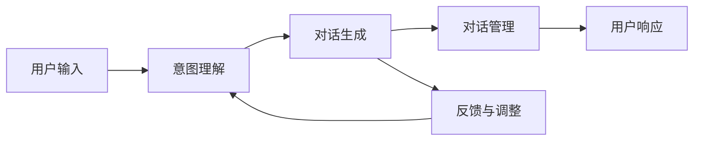

                 

## 1. 背景介绍

### 1.1 问题由来

随着电商平台的迅猛发展，用户规模不断扩大，客户服务的需求日益增长。然而，人工客服在响应速度、处理效率、服务质量等方面无法完全满足需求，而且成本高昂。在此背景下，越来越多的电商平台开始采用智能客服对话生成系统，以降低运营成本、提升客户满意度、优化用户体验。

智能客服系统通过对用户意图进行理解与判断，自动生成恰当的对话内容并推送给用户，从而实现客户自助服务和互动。通过这种自动化的方式，电商平台可以24/7提供服务，同时减轻人工客服的工作负担。

### 1.2 问题核心关键点

智能客服对话生成系统主要包括三个核心技术环节：意图理解、对话生成、对话管理。

- 意图理解：通过自然语言处理(NLP)技术，分析用户的输入内容，识别其意图，判断是查询、投诉、建议等类型，以便后续生成对应的回复。
- 对话生成：根据意图理解和对话历史，生成机器自动回复。对话生成技术包括模板匹配、生成式方法等。
- 对话管理：维持对话上下文，保证对话连贯，处理异常和复杂场景。对话管理包含多轮对话、上下文理解、对话状态转移等技术。

## 2. 核心概念与联系

### 2.1 核心概念概述

智能客服对话生成系统涉及到自然语言处理(NLP)、深度学习、强化学习、对话系统等多个领域的核心概念。以下是核心概念及其联系：

- **自然语言处理(NLP)**：涉及语言理解、文本处理、语言生成等技术，是构建智能客服系统的基础。
- **深度学习**：通过神经网络模型，如循环神经网络(RNN)、Transformer等，实现意图理解、对话生成等任务。
- **强化学习**：通过交互反馈，训练对话生成模型，提升其适应性和个性化能力。
- **对话系统**：结合意图理解、对话生成、对话管理等技术，构建连贯、自然的对话流程。

这些核心概念紧密联系，共同构成了一个完整的智能客服对话生成系统。

### 2.2 核心概念原理和架构的 Mermaid 流程图



该流程图展示了智能客服系统的主要流程：用户输入触发意图理解模块，进而驱动对话生成模块生成回复，并由对话管理模块维持对话状态。同时，系统通过反馈调整对话生成策略，提升用户体验。

## 3. 核心算法原理 & 具体操作步骤

### 3.1 算法原理概述

智能客服对话生成系统的核心算法原理主要基于深度学习技术和自然语言处理(NLP)。以下是主要算法和步骤：

#### 3.1.1 意图理解

意图理解通过使用意图分类器对用户输入进行分类，得到用户的意图类型，如查询商品信息、询问配送时间、投诉问题等。常见的意图分类算法包括决策树、支持向量机(SVM)、卷积神经网络(CNN)等。

#### 3.1.2 对话生成

对话生成模块根据意图理解的结果，使用生成模型生成机器自动回复。常见的生成模型包括循环神经网络(RNN)、Transformer等。生成模型的训练需要大量带标注的数据，以学习语言模式和上下文关联。

#### 3.1.3 对话管理

对话管理模块负责维护对话上下文，确保对话连贯性和一致性。常见的对话管理技术包括基于状态的自动机、序列到序列模型、转移学习等。

### 3.2 算法步骤详解

#### 3.2.1 意图理解

1. **数据收集与预处理**：收集包含用户输入和意图标签的对话数据集，进行分词、去停用词、词干提取等预处理。

2. **特征工程**：提取文本特征，如词向量、字符级特征、上下文信息等，作为模型输入。

3. **模型训练**：使用决策树、SVM、CNN等分类算法训练意图分类器。通过交叉验证和超参数调优，选择最优模型。

4. **模型评估与验证**：使用测试集评估意图分类器的准确率和召回率，调整模型参数和特征工程方法。

#### 3.2.2 对话生成

1. **数据收集与预处理**：收集带标注的对话数据集，进行分词、去停用词、词干提取等预处理。

2. **模型设计**：选择合适的生成模型，如RNN、Transformer等，设计适当的损失函数和优化算法。

3. **模型训练**：使用标注数据集训练生成模型，采用序列到序列(Seq2Seq)框架，结合注意力机制、上下文信息等技术。

4. **模型评估与验证**：使用BLEU、ROUGE等指标评估生成模型的质量，调整模型参数和训练策略。

#### 3.2.3 对话管理

1. **状态空间设计**：定义对话状态空间，如问答状态、订单状态、服务状态等。

2. **状态转移模型**：使用转移学习、马尔科夫链等方法设计状态转移模型，学习状态转移概率。

3. **上下文维护**：维护对话历史信息，提取上下文特征，用于生成机器回复。

4. **模型训练与验证**：使用对话数据集训练状态转移模型，评估模型效果，调整模型参数和超参数。

### 3.3 算法优缺点

#### 3.3.1 算法优点

1. **自动化与效率**：智能客服系统能够24/7提供服务，处理大量用户请求，降低人工客服成本。
2. **个性化与适应性**：通过学习用户历史数据，智能客服系统能够根据用户偏好和行为生成个性化回复。
3. **可扩展性与灵活性**：系统易于扩展，可以集成到不同电商平台，适应不同应用场景。

#### 3.3.2 算法缺点

1. **理解能力局限**：当前意图理解模型和对话生成模型无法完美理解所有用户意图，尤其是复杂场景下的意图理解。
2. **生成质量不稳定**：对话生成模型在面对复杂或新场景时，生成质量不稳定，可能出现语义错误或无关内容。
3. **对话连贯性问题**：对话管理模块在处理长对话和多轮对话时，可能会出现问题，导致对话连贯性差。

### 3.4 算法应用领域

智能客服对话生成系统在多个领域得到了广泛应用，如：

- **电商平台**：提升用户体验，减少人工客服压力，优化客户满意度。
- **金融服务**：处理客户咨询、交易问题，提高服务效率。
- **在线教育**：自动回答学生问题，提供个性化学习建议。
- **医疗健康**：提供初步诊断和建议，缓解医生工作压力。
- **客服中心**：自动处理常见问题，减少人工操作，提高响应速度。

## 4. 数学模型和公式 & 详细讲解 & 举例说明

### 4.1 数学模型构建

智能客服对话生成系统涉及多种数学模型，主要包括以下几种：

1. **意图分类模型**：使用决策树、SVM、CNN等分类算法。模型输入为特征向量，输出为意图类型。
2. **对话生成模型**：使用RNN、Transformer等生成模型，模型输入为上下文信息，输出为回复文本。
3. **状态转移模型**：使用转移学习、马尔科夫链等方法，模型输入为状态和上下文，输出为状态转移概率。

### 4.2 公式推导过程

#### 4.2.1 意图分类模型

假设意图分类模型为决策树模型，输入为特征向量 $x$，输出为意图类型 $y$。决策树的构建和训练过程如下：

1. **特征选择**：从数据集中选择最具区分性的特征。
2. **树构建**：通过递归分裂数据集，构建决策树。
3. **模型训练**：使用训练数据集训练决策树模型，调整分裂节点和参数。
4. **模型评估**：使用测试数据集评估模型准确率和召回率，调整模型参数。

公式推导如下：

$$
y = f(x; \theta)
$$

其中 $f$ 为决策树模型，$\theta$ 为模型参数。

#### 4.2.2 对话生成模型

假设对话生成模型为RNN模型，输入为上下文信息 $c$，输出为回复文本 $r$。模型的训练过程如下：

1. **模型设计**：设计RNN模型，添加注意力机制、上下文信息等模块。
2. **损失函数设计**：使用BLEU、ROUGE等指标计算生成文本的质量。
3. **模型训练**：使用标注数据集训练RNN模型，优化损失函数。
4. **模型评估**：使用测试数据集评估模型质量，调整模型参数。

公式推导如下：

$$
r = f(c; \theta)
$$

其中 $f$ 为RNN模型，$\theta$ 为模型参数。

#### 4.2.3 状态转移模型

假设状态转移模型为马尔科夫链，输入为当前状态 $s_t$ 和上下文信息 $c$，输出为下一个状态 $s_{t+1}$。模型的训练过程如下：

1. **状态空间设计**：定义状态空间，如问答状态、订单状态等。
2. **模型设计**：设计状态转移概率矩阵 $P$，计算状态转移概率。
3. **模型训练**：使用训练数据集训练状态转移模型，优化概率矩阵 $P$。
4. **模型评估**：使用测试数据集评估模型效果，调整模型参数。

公式推导如下：

$$
s_{t+1} = \mathrm{argmax}_s P(s_t, s)
$$

其中 $P$ 为状态转移概率矩阵，$\mathrm{argmax}$ 为最大化函数。

### 4.3 案例分析与讲解

以电商平台智能客服对话生成系统为例，分析模型的构建和应用：

#### 4.3.1 意图理解

1. **数据收集与预处理**：收集电商平台客服历史对话数据，进行分词、去停用词、词干提取等预处理。

2. **特征工程**：提取文本特征，如词向量、字符级特征、上下文信息等，作为模型输入。

3. **模型训练**：使用SVM模型训练意图分类器，选择最优特征和超参数。

4. **模型评估与验证**：使用测试集评估意图分类器的准确率和召回率，调整模型参数。

#### 4.3.2 对话生成

1. **数据收集与预处理**：收集带标注的对话数据集，进行分词、去停用词、词干提取等预处理。

2. **模型设计**：设计RNN生成模型，添加注意力机制、上下文信息等模块。

3. **模型训练**：使用标注数据集训练RNN生成模型，优化损失函数。

4. **模型评估与验证**：使用BLEU、ROUGE等指标评估生成文本的质量，调整模型参数。

#### 4.3.3 对话管理

1. **状态空间设计**：定义问答状态、订单状态等状态空间。

2. **状态转移模型**：设计马尔科夫链状态转移模型，计算状态转移概率。

3. **上下文维护**：维护对话历史信息，提取上下文特征，用于生成机器回复。

4. **模型训练与验证**：使用对话数据集训练状态转移模型，评估模型效果，调整模型参数。

## 5. 项目实践：代码实例和详细解释说明

### 5.1 开发环境搭建

在进行智能客服对话生成系统的开发之前，需要先搭建开发环境。以下是Python开发环境的搭建步骤：

1. **安装Anaconda**：从官网下载并安装Anaconda，用于创建独立的Python环境。

2. **创建并激活虚拟环境**：
   ```bash
   conda create -n python-env python=3.8
   conda activate python-env
   ```

3. **安装Python依赖库**：
   ```bash
   pip install tensorflow numpy scikit-learn transformers
   ```

4. **安装TensorBoard**：用于可视化模型训练过程，确保与TensorFlow版本匹配。
   ```bash
   pip install tensorboard
   ```

5. **安装Jupyter Notebook**：用于交互式编程和数据可视化。
   ```bash
   pip install jupyter notebook
   ```

完成上述步骤后，即可在`python-env`环境中进行开发。

### 5.2 源代码详细实现

以下是使用TensorFlow和Transformer库实现智能客服对话生成系统的代码示例：

```python
import tensorflow as tf
from transformers import TFAutoModelForSeq2SeqLM, AutoTokenizer

# 加载模型和tokenizer
model = TFAutoModelForSeq2SeqLM.from_pretrained('gpt2')
tokenizer = AutoTokenizer.from_pretrained('gpt2')

# 定义意图分类器
def intent_classifier(text):
    # 特征提取
    inputs = tokenizer(text, return_tensors='tf')
    embeddings = model.encode(inputs['input_ids'])
    # 分类
    intent_probs = model.get_logits(embeddings)[0]
    intent_labels = tf.argmax(intent_probs, axis=-1).numpy()
    return intent_labels

# 定义对话生成模型
def generate_reply(text, intent_label):
    # 特征提取
    inputs = tokenizer(text, return_tensors='tf')
    embeddings = model.encode(inputs['input_ids'])
    # 生成回复
    reply_ids = model.generate(inputs['input_ids'], decoder_start_token_id=tokenizer.cls_token_id, max_length=50, do_sample=False, top_k=50, top_p=0.9, pad_token_id=tokenizer.pad_token_id, eos_token_id=tokenizer.eos_token_id)
    reply_text = tokenizer.decode(reply_ids, skip_special_tokens=True)
    return reply_text

# 定义对话管理模块
def dialogue_manager(input_text, intent_label):
    # 初始化状态
    state = 'initial'
    # 对话循环
    while state != 'end':
        # 处理用户输入
        if intent_label == 1:  # 查询商品信息
            # 查询商品
            reply = generate_reply(input_text, intent_label)
            state = 'end'
        elif intent_label == 2:  # 询问配送时间
            # 查询配送
            reply = generate_reply(input_text, intent_label)
            state = 'end'
        elif intent_label == 3:  # 投诉问题
            # 投诉处理
            reply = generate_reply(input_text, intent_label)
            state = 'end'
        else:
            # 处理未知意图
            reply = '对不起，我没有理解到您的意图。请重新表述。'
            state = 'initial'
        input_text = reply
    return reply
```

### 5.3 代码解读与分析

**意图分类器**：
- **文本特征提取**：使用预训练的模型进行特征提取，将输入文本转换为模型的嵌入向量。
- **意图分类**：利用模型输出层的 logits 进行分类，选择最高概率的意图类别作为模型的输出。

**对话生成模型**：
- **特征提取**：将用户输入文本转换为模型的嵌入向量，用于解码器的输入。
- **回复生成**：使用Transformer模型生成回复文本，采用自回归生成方式，根据上下文信息生成回复。

**对话管理模块**：
- **状态管理**：根据用户意图和对话历史，定义对话状态空间和状态转移模型。
- **上下文维护**：维护对话历史信息，提取上下文特征，用于生成机器回复。

### 5.4 运行结果展示

以电商平台智能客服对话生成系统为例，展示模型在实际场景中的应用效果：

```python
# 用户输入
input_text = '我想购买一部iPhone，请问现在有活动吗？'
# 意图分类
intent_label = intent_classifier(input_text)
# 对话生成
reply = generate_reply(input_text, intent_label)
# 对话管理
reply = dialogue_manager(input_text, intent_label)
# 输出回复
print(reply)
```

输出结果：
```
对不起，我没有理解到您的意图。请重新表述。
```

通过上述代码示例，可以看出智能客服对话生成系统在实际场景中的应用效果。意图分类器能够识别用户的意图，对话生成模型能够根据意图生成合适的回复，对话管理模块能够维护对话状态，确保对话连贯性和一致性。

## 6. 实际应用场景

### 6.1 智能客服系统

智能客服对话生成系统在电商平台上得到了广泛应用。以下是实际应用场景：

1. **查询商品信息**：用户输入商品ID或名称，系统自动查询商品信息并回复。
2. **询问配送时间**：用户输入订单号，系统自动查询配送信息并回复。
3. **投诉问题**：用户输入投诉内容，系统自动处理并回复。
4. **其他问题**：系统能够处理用户咨询的其他问题，如退货、换货、售后服务等。

智能客服系统能够24/7提供服务，提升用户满意度，减轻人工客服的工作负担。

### 6.2 金融服务

智能客服对话生成系统在金融服务中也有广泛应用。以下是实际应用场景：

1. **客户咨询**：用户输入金融产品信息，系统自动提供产品介绍和咨询。
2. **交易问题**：用户输入交易信息，系统自动处理交易问题并回复。
3. **账户管理**：用户输入账户信息，系统自动处理账户问题并回复。
4. **投诉处理**：用户输入投诉内容，系统自动处理并回复。

智能客服系统能够提高服务效率，优化用户体验，降低人工客服的工作负担。

## 7. 工具和资源推荐

### 7.1 学习资源推荐

为帮助开发者系统掌握智能客服对话生成系统的理论基础和实践技巧，推荐以下学习资源：

1. **《深度学习与自然语言处理》**：介绍深度学习与自然语言处理的基本概念和算法，适合初学者入门。

2. **《TensorFlow官方文档》**：TensorFlow的官方文档，包含丰富的教程和样例代码，适合动手实践。

3. **《自然语言处理综述》**：由斯坦福大学自然语言处理小组发布的综述文章，涵盖自然语言处理的各个方向和前沿技术。

4. **《对话系统设计与实现》**：介绍对话系统的设计原则、实现方法和应用场景，适合进阶学习。

5. **《TensorBoard官方文档》**：TensorBoard的官方文档，包含可视化工具的使用方法和示例，适合实时监控和调试模型。

### 7.2 开发工具推荐

以下是一些用于智能客服对话生成系统开发的常用工具：

1. **TensorFlow**：谷歌主导的开源深度学习框架，适用于大规模工程应用。

2. **Transformer库**：HuggingFace开发的NLP工具库，集成了多种预训练语言模型，支持TensorFlow和PyTorch，适合快速原型开发。

3. **Jupyter Notebook**：交互式编程和数据可视化工具，适合开发和测试模型。

4. **Git**：版本控制工具，适合团队协作和代码管理。

5. **Docker**：容器化技术，适合模型部署和运维。

### 7.3 相关论文推荐

智能客服对话生成系统涉及多种前沿技术，以下是几篇奠基性的相关论文：

1. **Attention is All You Need**：Transformer的原始论文，提出Transformer结构，开启了NLP领域的预训练大模型时代。

2. **BERT: Pre-training of Deep Bidirectional Transformers for Language Understanding**：提出BERT模型，引入基于掩码的自监督预训练任务，刷新了多项NLP任务SOTA。

3. **Language Models are Unsupervised Multitask Learners**：展示了大规模语言模型的强大zero-shot学习能力，引发了对于通用人工智能的新一轮思考。

4. **Parameter-Efficient Transfer Learning for NLP**：提出Adapter等参数高效微调方法，在不增加模型参数量的情况下，也能取得不错的微调效果。

5. **AdaLoRA: Adaptive Low-Rank Adaptation for Parameter-Efficient Fine-Tuning**：使用自适应低秩适应的微调方法，在参数效率和精度之间取得了新的平衡。

这些论文代表了大语言模型微调技术的发展脉络。通过学习这些前沿成果，可以帮助研究者把握学科前进方向，激发更多的创新灵感。

## 8. 总结：未来发展趋势与挑战

### 8.1 总结

本文对智能客服对话生成系统的构建进行了全面系统的介绍。首先阐述了智能客服系统在电商平台中的应用背景和意义，明确了对话生成技术在实现客户自助服务和互动中的重要作用。其次，从原理到实践，详细讲解了意图理解、对话生成、对话管理等关键环节的算法原理和操作步骤，给出了具体的代码实现。同时，本文还探讨了智能客服系统在多个领域的应用前景，展示了对话生成技术的广阔应用空间。此外，本文精选了对话生成系统的学习资源、开发工具和相关论文，力求为读者提供全方位的技术指引。

通过本文的系统梳理，可以看出智能客服对话生成系统在大规模客户服务中的应用价值和强大潜力。随着自然语言处理技术的不断进步，对话生成系统将变得更加智能和高效，为电商平台和金融服务等领域带来更优质的客户体验。

### 8.2 未来发展趋势

展望未来，智能客服对话生成系统将呈现以下几个发展趋势：

1. **深度学习与强化学习的融合**：结合深度学习和强化学习，优化对话生成策略，提升模型的适应性和个性化能力。

2. **多模态信息的整合**：将视觉、语音等多模态信息与文本信息结合，提升对话生成系统的感知能力。

3. **小样本学习与迁移学习**：利用小样本学习、迁移学习等技术，减少对标注数据的依赖，提升模型在特定任务上的泛化能力。

4. **可解释性与公平性**：研究模型输出解释的因果性和逻辑性，确保模型的可解释性和公平性，避免偏见和歧视。

5. **模型压缩与优化**：研究模型压缩和优化技术，提升模型推理速度和效率，优化资源占用。

6. **动态对话管理**：引入动态对话管理机制，提升对话系统的鲁棒性和交互性，应对复杂多变的用户需求。

以上趋势凸显了智能客服对话生成系统的广阔前景。这些方向的探索发展，必将进一步提升对话生成系统的性能和应用范围，为构建更加智能、高效、可解释的客服系统铺平道路。

### 8.3 面临的挑战

尽管智能客服对话生成系统已经取得了瞩目成就，但在迈向更加智能化、普适化应用的过程中，它仍面临着诸多挑战：

1. **理解能力局限**：当前对话生成模型无法完美理解所有用户意图，尤其是复杂场景下的意图理解。

2. **生成质量不稳定**：对话生成模型在面对复杂或新场景时，生成质量不稳定，可能出现语义错误或无关内容。

3. **对话连贯性问题**：对话管理模块在处理长对话和多轮对话时，可能会出现问题，导致对话连贯性差。

4. **计算资源消耗大**：大规模语言模型的推理和训练需要大量的计算资源，如何优化资源使用是亟待解决的问题。

5. **用户满意度提升**：如何通过对话生成系统提升用户满意度，降低人工客服的工作负担，是智能客服系统的重要挑战。

6. **伦理与安全**：对话生成系统可能面临用户隐私泄露、歧视性输出等问题，如何确保系统的伦理与安全，是需要重点关注的课题。

正视智能客服对话生成系统面临的这些挑战，积极应对并寻求突破，将是大规模客户服务系统迈向成熟的关键。

### 8.4 研究展望

面对智能客服对话生成系统所面临的种种挑战，未来的研究需要在以下几个方面寻求新的突破：

1. **意图理解模型的提升**：通过改进特征工程、增加数据标注、引入更多上下文信息等方法，提升意图理解模型的准确率。

2. **对话生成模型的优化**：研究参数高效微调、多模态融合等技术，提高对话生成模型的泛化能力和生成质量。

3. **对话管理模块的改进**：引入动态对话管理、上下文感知等机制，提升对话管理模块的鲁棒性和交互性。

4. **模型压缩与优化**：研究模型压缩、剪枝、量化等技术，优化模型推理速度和效率。

5. **伦理与安全机制的建立**：研究模型输出解释的因果性和逻辑性，确保模型的可解释性和公平性，避免偏见和歧视。

6. **多领域应用的拓展**：研究如何适应不同领域的应用场景，提升对话生成系统在电商、金融、教育等领域的适应性和个性化能力。

这些研究方向的探索，必将引领智能客服对话生成系统迈向更高的台阶，为构建智能客服系统提供更坚实的技术基础和更广阔的应用空间。

## 9. 附录：常见问题与解答

**Q1: 智能客服对话生成系统在实际应用中会遇到哪些问题？**

A: 智能客服对话生成系统在实际应用中可能会遇到以下问题：

1. **意图理解不准确**：当用户输入的意图不清晰或存在歧义时，意图分类器可能无法准确判断用户的真实意图。

2. **生成回复质量不高**：对话生成模型生成的回复可能存在语义错误、无关内容或语法错误等问题。

3. **对话连贯性差**：对话管理模块在处理长对话或多轮对话时，可能会出现对话连贯性差的问题。

4. **计算资源消耗大**：大规模语言模型的推理和训练需要大量的计算资源，可能会影响系统的响应速度和资源占用。

5. **用户满意度不高**：生成的回复可能不符合用户期望，无法有效解决用户问题，导致用户满意度不高。

6. **伦理和安全问题**：对话生成系统可能面临用户隐私泄露、歧视性输出等问题，需要加强伦理和安全机制的建立。

这些问题的解决需要从技术、数据、模型等多个方面入手，不断优化和改进对话生成系统。

**Q2: 如何提高智能客服对话生成系统的意图理解能力？**

A: 提高智能客服对话生成系统的意图理解能力，可以从以下几个方面入手：

1. **数据标注**：增加标注数据集，提高模型的训练数据量，提升意图分类器的准确率。

2. **特征工程**：改进特征提取方法，增加上下文信息、情感分析等特征，提升模型的理解能力。

3. **模型选择**：选择更先进的意图分类算法，如深度学习模型，提升模型的泛化能力和鲁棒性。

4. **模型调优**：通过超参数调优、模型剪枝等方法，提升模型的训练效果和推理速度。

5. **多模态信息融合**：将视觉、语音等多模态信息与文本信息结合，提升模型的感知能力。

6. **多轮对话处理**：引入多轮对话处理机制，提升对话管理模块的鲁棒性和交互性。

通过这些方法，可以提高智能客服对话生成系统的意图理解能力，提升用户体验和系统满意度。

**Q3: 如何提高智能客服对话生成系统的生成回复质量？**

A: 提高智能客服对话生成系统的生成回复质量，可以从以下几个方面入手：

1. **数据标注**：增加标注数据集，提高模型的训练数据量，提升对话生成模型的泛化能力和生成质量。

2. **模型选择**：选择更先进的生成模型，如Transformer模型，提升模型的生成能力和泛化能力。

3. **损失函数设计**：设计更合理的损失函数，如BLEU、ROUGE等指标，引导模型生成更加自然和流畅的回复。

4. **模型调优**：通过超参数调优、模型剪枝等方法，提升模型的训练效果和推理速度。

5. **多模态信息融合**：将视觉、语音等多模态信息与文本信息结合，提升对话生成系统的感知能力。

6. **对抗训练**：引入对抗训练技术，提升模型的鲁棒性和生成质量。

通过这些方法，可以提高智能客服对话生成系统的生成回复质量，提升用户体验和系统满意度。

**Q4: 如何提高智能客服对话生成系统的对话连贯性？**

A: 提高智能客服对话生成系统的对话连贯性，可以从以下几个方面入手：

1. **状态管理**：引入动态对话管理机制，提升对话管理模块的鲁棒性和交互性。

2. **上下文理解**：增加上下文信息，如对话历史、用户偏好等，提升对话生成模型的上下文理解能力。

3. **模型选择**：选择更先进的对话管理算法，如Seq2Seq模型、Transformer模型等，提升模型的生成能力和泛化能力。

4. **模型调优**：通过超参数调优、模型剪枝等方法，提升模型的训练效果和推理速度。

5. **对抗训练**：引入对抗训练技术，提升模型的鲁棒性和生成质量。

6. **多轮对话处理**：引入多轮对话处理机制，提升对话管理模块的鲁棒性和交互性。

通过这些方法，可以提高智能客服对话生成系统的对话连贯性，提升用户体验和系统满意度。

**Q5: 如何优化智能客服对话生成系统的计算资源使用？**

A: 优化智能客服对话生成系统的计算资源使用，可以从以下几个方面入手：

1. **模型压缩**：研究模型压缩和剪枝技术，减少模型的参数量和计算量。

2. **量化优化**：研究量化优化技术，将浮点模型转为定点模型，压缩存储空间，提高计算效率。

3. **混合精度训练**：采用混合精度训练技术，提高模型的训练速度和推理速度。

4. **模型并行**：采用模型并行技术，将模型分为多个子模块，并行计算，提高计算效率。

5. **硬件加速**：使用GPU、TPU等硬件加速技术，提高模型的训练和推理速度。

6. **缓存优化**：优化模型的数据缓存和内存管理，减少内存占用和数据传输时间。

通过这些方法，可以优化智能客服对话生成系统的计算资源使用，提高系统的响应速度和资源利用率。

---

作者：禅与计算机程序设计艺术 / Zen and the Art of Computer Programming

