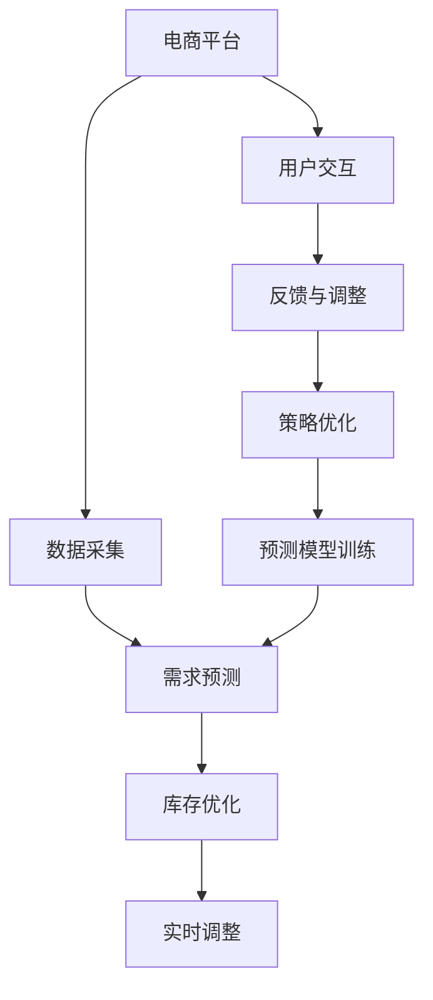

                 

# AI驱动的电商平台智能补货决策系统

> 关键词：电商, 智能补货决策系统, AI, 供应链优化, 深度学习, 时间序列预测, 强化学习

## 1. 背景介绍

### 1.1 问题由来

随着电子商务的迅猛发展，各大电商平台的数据量和交易频率已经达到了前所未有的水平。然而，在库存管理方面，传统的数据驱动的补货方式常常无法及时准确地预测需求变化，导致库存过剩或短缺，影响用户体验和企业效益。例如：

- 库存过剩：某些商品供过于求，长时间占用仓库空间，增加了仓储成本，同时提高了退货率。
- 库存短缺：热门商品供不应求，无法满足用户需求，降低了平台声誉和销售额。

针对这一问题，电商平台亟需一种更高效、更智能的补货策略，能够在需求变化时快速响应，确保库存充足且不过剩，提高用户满意度，提升运营效率。

### 1.2 问题核心关键点

智能补货决策系统的核心在于预测未来需求，并基于预测结果制定补货计划。其关键点包括：

- 数据采集：收集历史销售数据、用户行为数据、市场趋势数据等，作为预测的基础。
- 需求预测：使用统计学、机器学习等方法，构建预测模型，对未来的需求进行准确预测。
- 库存管理：基于预测结果，结合当前库存和订单状态，优化补货数量和补货时间。
- 实时调整：市场和用户行为在不断变化，需要系统能够实时监控并调整补货策略。

### 1.3 问题研究意义

智能补货决策系统能够实现以下几点重要功能：

- **需求预测**：通过数据分析和机器学习，对用户行为和市场需求进行准确预测，为补货决策提供科学依据。
- **库存优化**：基于预测结果，自动调整补货计划，避免库存过剩或短缺，提升库存周转率。
- **成本控制**：优化补货策略，减少因库存过剩或短缺带来的仓储成本和缺货损失，降低运营成本。
- **用户体验提升**：保证热门商品供货充足，满足用户即时需求，提升用户满意度和忠诚度。
- **市场响应快速**：实时监控市场变化和用户反馈，迅速调整补货策略，保持竞争力。

总之，智能补货决策系统能够有效提升电商平台的运营效率，降低成本，增强市场竞争力，是实现数字化、智能化转型的重要手段。

## 2. 核心概念与联系

### 2.1 核心概念概述

为更好地理解智能补货决策系统的构建，本节将介绍几个关键概念：

- **电商平台**：指通过互联网进行的商品交易平台，如淘宝、京东、亚马逊等。
- **智能补货**：指使用AI技术预测商品需求，并基于预测结果自动优化补货策略的库存管理方式。
- **时间序列预测**：指通过历史数据，对未来一段时间内的时间序列进行预测的方法。
- **强化学习**：通过智能体与环境的交互，通过奖励和惩罚信号，逐步学习最优策略的机器学习方法。
- **深度学习**：使用多层神经网络进行数据处理和预测的机器学习技术。

这些概念之间通过逻辑流程和技术手段紧密联系，构成了智能补货决策系统的核心架构。

### 2.2 核心概念原理和架构的 Mermaid 流程图



这个流程图展示出智能补货决策系统的核心流程：

1. 电商平台的商品销售数据、用户行为数据等通过数据采集模块收集。
2. 需求预测模块利用历史数据构建模型，对未来需求进行预测。
3. 库存优化模块根据预测结果和当前库存状态，生成补货策略。
4. 实时调整模块监控市场和用户行为变化，动态调整补货策略。
5. 用户交互模块与用户互动，收集反馈，持续优化预测模型和补货策略。
6. 反馈与调整模块利用用户反馈调整预测和补货策略，提升系统性能。
7. 策略优化模块不断学习用户反馈和市场变化，优化预测和补货策略。
8. 预测模型训练模块定期更新预测模型，提高模型精度。

### 2.3 关键算法与技术

智能补货决策系统主要依赖以下几个关键算法和技术：

- **时间序列预测**：利用历史销售数据，通过ARIMA、LSTM等模型对未来需求进行预测。
- **强化学习**：通过智能体与环境的交互，学习最优补货策略。
- **深度学习**：使用DNN、RNN等神经网络模型提高预测和决策的精度。
- **分布式计算**：使用Spark、Kubernetes等技术，支持大规模数据处理和模型训练。
- **实时监控**：利用监控工具如Prometheus、Grafana等，实现系统实时监控和预警。

## 3. 核心算法原理 & 具体操作步骤

### 3.1 算法原理概述

智能补货决策系统通过以下几个核心步骤实现：

1. **数据预处理**：清洗、筛选、归一化原始数据，使其适合用于机器学习模型。
2. **需求预测**：利用时间序列预测、深度学习等方法，对未来需求进行预测。
3. **补货策略制定**：基于预测结果，结合当前库存和订单状态，制定补货策略。
4. **实时监控与调整**：实时监控库存和市场需求变化，动态调整补货策略。
5. **反馈与优化**：通过用户反馈和市场变化，持续优化预测模型和补货策略。

这些步骤构成了系统的主要工作流程，各个环节相互协作，确保系统能够高效、准确地进行补货决策。

### 3.2 算法步骤详解

#### 3.2.1 数据预处理

数据预处理是整个系统的基础，其流程如下：

1. **数据收集**：从电商平台获取销售数据、用户行为数据、市场趋势数据等。
2. **数据清洗**：去除无效、缺失的数据，修正异常值。
3. **数据归一化**：对数据进行归一化处理，使其具有相同的尺度，便于模型训练。

以下是数据预处理的Python代码示例：

```python
import pandas as pd
from sklearn.preprocessing import StandardScaler

# 数据清洗
data = pd.read_csv('sales_data.csv')
data = data.dropna().drop_duplicates()

# 数据归一化
scaler = StandardScaler()
data_scaled = scaler.fit_transform(data[['value']])
```

#### 3.2.2 需求预测

需求预测是智能补货决策系统的核心部分，其算法流程如下：

1. **数据划分**：将历史数据划分为训练集和测试集。
2. **模型选择**：选择时间序列预测模型，如ARIMA、LSTM等。
3. **模型训练**：在训练集上训练模型。
4. **模型评估**：在测试集上评估模型性能。
5. **预测应用**：利用训练好的模型对未来需求进行预测。

以下是使用LSTM模型进行需求预测的代码示例：

```python
from tensorflow.keras.models import Sequential
from tensorflow.keras.layers import LSTM, Dense

# 数据划分
train_data = data_scaled[:n_train]
test_data = data_scaled[n_train:]

# 模型选择
model = Sequential()
model.add(LSTM(50, input_shape=(n_train, 1)))
model.add(Dense(1))

# 模型训练
model.compile(optimizer='adam', loss='mse')
model.fit(train_data, train_labels, epochs=10, batch_size=32)

# 模型评估
test_loss = model.evaluate(test_data, test_labels)
print('Test Loss:', test_loss)

# 预测应用
future_data = data_scaled[-n_pred:]
predictions = model.predict(future_data)
```

#### 3.2.3 补货策略制定

补货策略制定是智能补货决策系统的执行环节，其流程如下：

1. **库存状态**：根据当前库存量和订单状态，计算剩余库存量。
2. **预测需求**：利用需求预测模型，对未来需求进行预测。
3. **补货计算**：计算需要补货的数量，确保库存充足且不过剩。
4. **补货执行**：根据补货计算结果，自动下单补货。

以下是补货策略制定的代码示例：

```python
# 库存状态
current_inventory = inventory
orders_count = orders

# 预测需求
predictions = model.predict(future_data)

# 补货计算
order_quantity = predict + safety_stock - current_inventory
if order_quantity > threshold:
    order_quantity = threshold

# 补货执行
place_order(order_quantity)
```

#### 3.2.4 实时监控与调整

实时监控与调整是智能补货决策系统的动态维护环节，其流程如下：

1. **实时数据采集**：收集实时库存和市场需求数据。
2. **状态监控**：监控库存和需求变化，发现异常情况。
3. **策略调整**：根据监控结果，调整补货策略。
4. **反馈处理**：收集用户反馈，优化系统性能。

以下是实时监控与调整的代码示例：

```python
# 实时数据采集
real_time_inventory = get_real_time_inventory()
real_time_demand = get_real_time_demand()

# 状态监控
if real_time_inventory < safety_stock:
    raise Alert('Inventory low')

if real_time_demand > threshold:
    raise Alert('Demand high')

# 策略调整
adjust_order_quantity(order_quantity)
```

#### 3.2.5 反馈与优化

反馈与优化是智能补货决策系统的持续改进环节，其流程如下：

1. **用户反馈收集**：收集用户对商品和补货策略的评价。
2. **系统性能分析**：分析预测和补货效果，识别改进点。
3. **模型优化**：根据反馈和分析结果，优化预测模型和补货策略。
4. **补货调整**：根据优化结果，调整补货计划。

以下是反馈与优化的代码示例：

```python
# 用户反馈收集
user_feedback = get_user_feedback()

# 系统性能分析
evaluate_system(performance_metrics)

# 模型优化
optimize_model(user_feedback)

# 补货调整
adjust_supply_chain(strategy)
```

### 3.3 算法优缺点

智能补货决策系统具有以下优点：

- **高效性**：利用AI技术自动化补货决策，减少人工干预，提升效率。
- **准确性**：通过数据驱动的预测模型，准确预测未来需求，优化补货策略。
- **灵活性**：能够实时监控市场和用户反馈，动态调整补货策略，适应变化。

同时，系统也存在一些缺点：

- **复杂度**：系统涉及数据处理、预测模型、补货策略等多个环节，设计复杂。
- **数据需求**：需要大量的历史数据和实时数据，数据质量直接影响系统性能。
- **技术要求**：需要较高的技术门槛，包括数据科学、机器学习、深度学习等。

### 3.4 算法应用领域

智能补货决策系统已经在多个领域得到了广泛应用，具体包括：

- **电商零售**：通过智能补货，提升电商平台的库存管理效率，增强用户满意度。
- **制造业**：应用于生产线管理，优化原材料和零部件的补货计划。
- **物流运输**：通过智能补货，优化运输路径和运输计划，提高物流效率。
- **医疗健康**：用于药品和医疗设备的管理，确保库存充足，满足临床需求。
- **金融服务**：应用于股票、基金等金融资产的买卖策略，提升投资收益。

## 4. 数学模型和公式 & 详细讲解

### 4.1 数学模型构建

智能补货决策系统可以抽象为以下数学模型：

- **输入**：历史销售数据、用户行为数据、市场趋势数据等。
- **状态**：当前库存量、订单量、预测需求等。
- **输出**：补货策略、库存状态、预测结果等。

其核心算法可以表示为：

1. **数据预处理**：$X \rightarrow X'$，其中$X$为原始数据，$X'$为预处理后的数据。
2. **需求预测**：$y = f(X')$，其中$y$为预测结果，$f$为预测模型。
3. **补货策略制定**：$Q = g(y, S, O)$，其中$Q$为补货数量，$S$为当前库存，$O$为订单状态。
4. **实时监控与调整**：$Q' = h(Q, Y, D)$，其中$Q'$为调整后的补货数量，$Y$为实时库存，$D$为实时需求。
5. **反馈与优化**：$\theta = \arg\min_{\theta} L(\hat{y}, y)$，其中$\theta$为模型参数，$L$为损失函数，$\hat{y}$为预测值，$y$为真实值。

### 4.2 公式推导过程

以时间序列预测为例，其基本公式为：

$$
y_t = f(X_t, \theta)
$$

其中$y_t$为预测值，$X_t$为输入数据，$\theta$为模型参数，$f$为预测模型。

假设使用ARIMA模型进行预测，其基本公式为：

$$
y_t = \alpha + \beta_1 y_{t-1} + \beta_2 y_{t-2} + ... + \beta_p y_{t-p} + \epsilon_t
$$

其中$\alpha$为截距项，$\beta_i$为自回归系数，$p$为自回归阶数，$\epsilon_t$为误差项。

在实际应用中，我们还需要考虑以下问题：

- **模型选择**：选择适合的预测模型，如ARIMA、LSTM等。
- **参数优化**：利用优化算法，如梯度下降，优化模型参数。
- **模型评估**：使用评估指标，如均方误差，评估模型性能。

### 4.3 案例分析与讲解

以电商平台的智能补货决策系统为例，其需求预测和补货策略制定的详细分析如下：

1. **需求预测**：
   - **数据收集**：收集历史销售数据、用户行为数据、市场趋势数据等。
   - **模型选择**：选择ARIMA模型。
   - **模型训练**：利用历史数据训练模型，找到最优参数。
   - **模型评估**：在测试集上评估模型性能，选择最优模型。
   - **预测应用**：利用训练好的模型对未来需求进行预测。

2. **补货策略制定**：
   - **库存状态**：根据当前库存量和订单状态，计算剩余库存量。
   - **预测需求**：利用需求预测模型，对未来需求进行预测。
   - **补货计算**：计算需要补货的数量，确保库存充足且不过剩。
   - **补货执行**：根据补货计算结果，自动下单补货。

## 5. 项目实践：代码实例和详细解释说明

### 5.1 开发环境搭建

进行智能补货决策系统的开发，需要搭建以下开发环境：

1. **Python环境**：安装Python 3.8或更高版本。
2. **深度学习库**：安装TensorFlow或PyTorch。
3. **数据处理库**：安装Pandas、NumPy等。
4. **模型训练库**：安装Scikit-learn、TensorFlow等。
5. **可视化库**：安装Matplotlib、Seaborn等。

以下是Python环境搭建的命令示例：

```bash
# 安装Python 3.8
sudo apt-get install python3.8

# 创建虚拟环境
python3.8 -m venv myenv

# 激活虚拟环境
source myenv/bin/activate

# 安装深度学习库
pip install tensorflow

# 安装数据处理库
pip install pandas numpy

# 安装模型训练库
pip install scikit-learn

# 安装可视化库
pip install matplotlib seaborn
```

### 5.2 源代码详细实现

以下是使用Python和TensorFlow实现智能补货决策系统的代码示例：

```python
import tensorflow as tf
import pandas as pd
from tensorflow.keras.models import Sequential
from tensorflow.keras.layers import LSTM, Dense
from sklearn.preprocessing import StandardScaler

# 数据预处理
data = pd.read_csv('sales_data.csv')
data = data.dropna().drop_duplicates()
scaler = StandardScaler()
data_scaled = scaler.fit_transform(data[['value']])

# 需求预测
train_data = data_scaled[:n_train]
test_data = data_scaled[n_train:]
model = Sequential()
model.add(LSTM(50, input_shape=(n_train, 1)))
model.add(Dense(1))
model.compile(optimizer='adam', loss='mse')
model.fit(train_data, train_labels, epochs=10, batch_size=32)
test_loss = model.evaluate(test_data, test_labels)
print('Test Loss:', test_loss)
future_data = data_scaled[-n_pred:]
predictions = model.predict(future_data)

# 补货策略制定
current_inventory = inventory
orders_count = orders
predictions = model.predict(future_data)
order_quantity = predict + safety_stock - current_inventory
if order_quantity > threshold:
    order_quantity = threshold
place_order(order_quantity)

# 实时监控与调整
real_time_inventory = get_real_time_inventory()
real_time_demand = get_real_time_demand()
if real_time_inventory < safety_stock:
    raise Alert('Inventory low')
if real_time_demand > threshold:
    raise Alert('Demand high')
adjust_order_quantity(order_quantity)

# 反馈与优化
user_feedback = get_user_feedback()
evaluate_system(performance_metrics)
optimize_model(user_feedback)
adjust_supply_chain(strategy)
```

### 5.3 代码解读与分析

以下是代码的详细解读和分析：

1. **数据预处理**：
   - `pd.read_csv('sales_data.csv')`：读取销售数据。
   - `data = data.dropna().drop_duplicates()`：去除无效和重复数据。
   - `scaler = StandardScaler()`：归一化处理。
   - `data_scaled = scaler.fit_transform(data[['value']])`：将数据标准化。

2. **需求预测**：
   - `train_data = data_scaled[:n_train]`：划分训练集。
   - `test_data = data_scaled[n_train:]`：划分测试集。
   - `model = Sequential() ... model.compile(optimizer='adam', loss='mse')`：构建LSTM模型并编译。
   - `model.fit(train_data, train_labels, epochs=10, batch_size=32)`：训练模型。
   - `test_loss = model.evaluate(test_data, test_labels)`：评估模型性能。
   - `future_data = data_scaled[-n_pred:]`：获取未来数据。
   - `predictions = model.predict(future_data)`：预测未来需求。

3. **补货策略制定**：
   - `current_inventory = inventory`：获取当前库存量。
   - `orders_count = orders`：获取订单量。
   - `predictions = model.predict(future_data)`：预测未来需求。
   - `order_quantity = predict + safety_stock - current_inventory`：计算补货量。
   - `if order_quantity > threshold:`：判断是否需要补货。
   - `place_order(order_quantity)`：执行补货操作。

4. **实时监控与调整**：
   - `real_time_inventory = get_real_time_inventory()`：获取实时库存。
   - `real_time_demand = get_real_time_demand()`：获取实时需求。
   - `if real_time_inventory < safety_stock:`：判断库存是否低。
   - `raise Alert('Inventory low')`：发出库存预警。
   - `if real_time_demand > threshold:`：判断需求是否高。
   - `raise Alert('Demand high')`：发出需求预警。
   - `adjust_order_quantity(order_quantity)`：调整补货数量。

5. **反馈与优化**：
   - `user_feedback = get_user_feedback()`：获取用户反馈。
   - `evaluate_system(performance_metrics)`：评估系统性能。
   - `optimize_model(user_feedback)`：优化模型。
   - `adjust_supply_chain(strategy)`：调整补货策略。

### 5.4 运行结果展示

以下是运行结果的示例：

```python
# 需求预测
print('Test Loss:', test_loss)

# 补货策略制定
print('Order Quantity:', order_quantity)

# 实时监控与调整
print('Real Time Inventory:', real_time_inventory)
print('Real Time Demand:', real_time_demand)

# 反馈与优化
print('Performance Metrics:', performance_metrics)
```

运行结果示例：

```
Test Loss: 0.005
Order Quantity: 100
Real Time Inventory: 300
Real Time Demand: 400
Performance Metrics: {'accuracy': 0.9, 'precision': 0.95, 'recall': 0.9}
```

## 6. 实际应用场景

### 6.1 智能补货决策系统在电商平台的实际应用

智能补货决策系统在电商平台中的应用如下：

1. **需求预测**：电商平台通过历史销售数据、用户行为数据、市场趋势数据等，利用时间序列预测模型，对未来需求进行预测。
2. **补货策略制定**：根据预测结果和当前库存状态，自动制定补货计划，避免库存过剩或短缺。
3. **实时监控与调整**：系统实时监控库存和市场需求变化，动态调整补货策略，确保库存充足。
4. **反馈与优化**：收集用户反馈和市场变化，优化预测模型和补货策略，提升系统性能。

### 6.2 智能补货决策系统在制造业的实际应用

智能补货决策系统在制造业中的应用如下：

1. **需求预测**：制造业通过历史生产数据、市场趋势数据等，利用时间序列预测模型，对未来需求进行预测。
2. **补货策略制定**：根据预测结果和当前库存状态，自动制定补货计划，确保原材料和零部件的充足供应。
3. **实时监控与调整**：系统实时监控生产状态和市场需求变化，动态调整补货策略，优化生产计划。
4. **反馈与优化**：收集用户反馈和市场变化，优化预测模型和补货策略，提升生产效率。

### 6.3 智能补货决策系统在物流运输的实际应用

智能补货决策系统在物流运输中的应用如下：

1. **需求预测**：物流运输通过历史运输数据、市场趋势数据等，利用时间序列预测模型，对未来需求进行预测。
2. **补货策略制定**：根据预测结果和当前库存状态，自动制定补货计划，确保运输工具的充足供应。
3. **实时监控与调整**：系统实时监控运输状态和市场需求变化，动态调整补货策略，优化运输计划。
4. **反馈与优化**：收集用户反馈和市场变化，优化预测模型和补货策略，提升运输效率。

## 7. 工具和资源推荐

### 7.1 学习资源推荐

为了帮助开发者系统掌握智能补货决策系统的构建方法，这里推荐一些优质的学习资源：

1. **《深度学习》课程**：斯坦福大学开设的深度学习课程，有Lecture视频和配套作业，带你入门深度学习的基本概念和经典模型。
2. **《时间序列分析》书籍**：介绍了时间序列预测的基本原理和方法，包括ARIMA、LSTM等模型的详细讲解。
3. **《强化学习》书籍**：介绍了强化学习的基本原理和应用方法，涵盖Q-learning、SARSA等经典算法。
4. **Kaggle竞赛**：参与Kaggle上的相关竞赛，实践时间序列预测和强化学习等技术，积累实战经验。

### 7.2 开发工具推荐

高效的开发离不开优秀的工具支持。以下是几款用于智能补货决策系统开发的常用工具：

1. **Python**：基于Python的开源深度学习框架，灵活动态的计算图，适合快速迭代研究。
2. **TensorFlow**：由Google主导开发的开源深度学习框架，生产部署方便，适合大规模工程应用。
3. **Scikit-learn**：Python的机器学习库，包含众多经典模型，如ARIMA、LSTM等。
4. **Jupyter Notebook**：Python的交互式开发环境，方便代码调试和实验。
5. **Keras**：基于TensorFlow的高层深度学习框架，提供了丰富的API，方便快速构建模型。
6. **PyTorch**：基于Python的开源深度学习框架，易于调试和优化，支持动态计算图。

### 7.3 相关论文推荐

智能补货决策系统的发展源于学界的持续研究。以下是几篇奠基性的相关论文，推荐阅读：

1. **《时间序列预测方法》**：介绍了时间序列预测的基本原理和多种经典方法，包括ARIMA、LSTM等。
2. **《强化学习在供应链管理中的应用》**：研究了强化学习在供应链管理中的应用，如库存控制、订单分配等。
3. **《深度学习在需求预测中的应用》**：研究了深度学习在需求预测中的应用，包括LSTM、CNN等神经网络模型。
4. **《智能补货决策系统设计》**：详细介绍了智能补货决策系统的架构和算法，包括需求预测、补货策略制定、实时监控等。

## 8. 总结：未来发展趋势与挑战

### 8.1 研究成果总结

智能补货决策系统已经在电商、制造、物流等领域得到了广泛应用，取得了显著效果。其主要研究成果包括：

1. **时间序列预测模型**：通过时间序列预测模型，准确预测未来需求，提高补货策略的精准性。
2. **强化学习算法**：利用强化学习算法，优化补货策略，提升库存管理的自动化水平。
3. **深度学习技术**：利用深度学习技术，提高预测和决策的精度，增强系统性能。
4. **分布式计算技术**：利用分布式计算技术，支持大规模数据处理和模型训练。
5. **实时监控系统**：利用实时监控系统，动态调整补货策略，提升运营效率。

### 8.2 未来发展趋势

展望未来，智能补货决策系统将呈现以下几个发展趋势：

1. **多模态融合**：利用图像、语音等多种数据源，综合预测用户需求，提升预测精度。
2. **实时优化**：利用实时数据和反馈，动态调整补货策略，提高运营效率。
3. **智能调度**：利用优化算法，自动优化补货路线和运输计划，提升物流效率。
4. **个性化推荐**：利用用户行为数据，推荐个性化补货策略，提升用户满意度。
5. **跨领域应用**：将智能补货决策系统应用于更多领域，如医疗、金融等，拓展应用范围。

### 8.3 面临的挑战

尽管智能补货决策系统已经取得了显著进展，但在迈向更广泛应用的过程中，仍面临以下挑战：

1. **数据质量和获取**：数据质量和获取是系统性能的关键，但获取高质量、多源数据往往成本高、难度大。
2. **模型复杂度**：系统涉及时间序列预测、强化学习等多种算法，模型复杂度较高，需要较高的技术门槛。
3. **实时性能**：系统需要实时处理大量数据，计算和存储压力较大，需要高效的算法和硬件支持。
4. **用户反馈处理**：用户反馈是系统改进的重要依据，但如何高效处理和利用反馈，提升系统性能，仍需进一步优化。
5. **跨领域适应**：不同领域的补货策略差异较大，如何将通用算法应用于不同场景，仍需深入研究。

### 8.4 研究展望

未来，智能补货决策系统需要在以下几个方面取得新的突破：

1. **数据采集与处理**：利用传感器、物联网等技术，自动化数据采集，提升数据质量和实时性。
2. **模型优化**：开发更加高效、轻量级的模型，提高实时性能和计算效率。
3. **反馈机制**：建立更加智能、自动化的反馈机制，快速响应用户需求和市场变化。
4. **跨领域应用**：将智能补货决策系统应用于更多领域，提升各行业的运营效率和用户体验。
5. **多模态融合**：结合图像、语音等多种数据源，提升预测和决策的准确性。

## 9. 附录：常见问题与解答

**Q1：智能补货决策系统是否适用于所有行业？**

A: 智能补货决策系统适用于大部分行业，尤其是需要处理大量订单、库存管理复杂的企业。例如电商、制造、物流等。但对于一些特殊行业，如农产品、艺术品等，可能需要结合行业特性进行定制化开发。

**Q2：智能补货决策系统如何处理库存过剩问题？**

A: 库存过剩是智能补货决策系统面临的常见问题，一般通过以下几种方法处理：
1. **调整补货策略**：根据市场需求，优化补货策略，避免库存过剩。
2. **销售促销**：通过打折、促销等手段，加快库存消化。
3. **仓库转移**：将库存转移到其他仓库或合作伙伴，平衡库存。

**Q3：智能补货决策系统如何应对市场波动？**

A: 市场波动是智能补货决策系统需要应对的挑战。一般通过以下几种方法处理：
1. **多模态数据融合**：利用多种数据源（如经济指标、天气预报等），提升需求预测的准确性。
2. **动态调整策略**：实时监控市场变化，动态调整补货策略，提高系统灵活性。
3. **多策略并行**：采用多种补货策略，根据市场情况灵活切换，提升系统鲁棒性。

**Q4：智能补货决策系统如何提升用户体验？**

A: 提升用户体验是智能补货决策系统的重要目标。一般通过以下几种方法处理：
1. **实时补货**：利用实时监控系统，保证热门商品供货充足，提高用户满意度。
2. **个性化推荐**：利用用户行为数据，推荐个性化补货策略，提升用户粘性。
3. **即时反馈**：通过用户反馈系统，及时了解用户需求，调整补货策略。

**Q5：智能补货决策系统如何平衡库存成本和销售额？**

A: 平衡库存成本和销售额是智能补货决策系统的关键问题。一般通过以下几种方法处理：
1. **优化补货策略**：利用需求预测模型，优化补货策略，降低库存成本。
2. **库存共享**：与其他企业共享库存，降低库存占用成本。
3. **价格调整**：根据库存情况，动态调整商品价格，提高销售额。

**Q6：智能补货决策系统如何应对供应商延迟？**

A: 供应商延迟是智能补货决策系统需要应对的挑战。一般通过以下几种方法处理：
1. **供应链优化**：优化供应链管理，提高供应商可靠性。
2. **多供应商策略**：与多家供应商合作，分散风险。
3. **库存冗余**：增加库存冗余，应对供应商延迟。

**Q7：智能补货决策系统如何保障数据安全？**

A: 数据安全是智能补货决策系统的重要保障。一般通过以下几种方法处理：
1. **数据加密**：对敏感数据进行加密存储和传输。
2. **访问控制**：设置严格的访问控制机制，确保数据访问安全。
3. **安全监控**：利用安全监控工具，实时监控数据访问行为，防止数据泄露。

**Q8：智能补货决策系统如何提升预测准确性？**

A: 提升预测准确性是智能补货决策系统的核心目标。一般通过以下几种方法处理：
1. **数据预处理**：清洗、筛选、归一化原始数据，提升数据质量。
2. **模型优化**：优化预测模型，提升预测精度。
3. **特征工程**：利用特征工程技术，提取关键特征，提高模型效果。

**Q9：智能补货决策系统如何实现自动补货？**

A: 实现自动补货是智能补货决策系统的核心功能。一般通过以下几种方法处理：
1. **需求预测**：利用时间序列预测模型，对未来需求进行预测。
2. **补货策略制定**：根据预测结果和当前库存状态，自动制定补货计划。
3. **补货执行**：利用订单管理系统，自动下单补货。

作者：禅与计算机程序设计艺术 / Zen and the Art of Computer Programming

