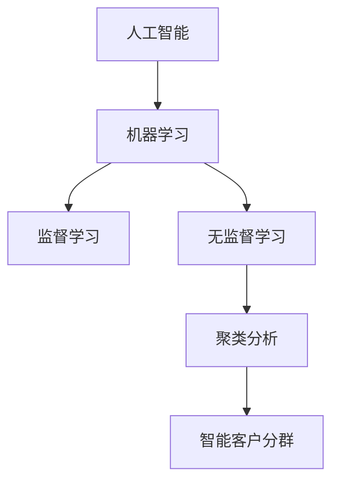

                 

# AI驱动的电商智能客户分群策略

> 关键词：人工智能,电商,智能客户分群,聚类分析,机器学习,深度学习,模型优化,特征工程,消费者行为分析,营销策略

## 1. 背景介绍

在数字化时代的电商领域，智能客户分群策略变得尤为重要。通过对客户的深度分析和精准定位，商家可以制定更为个性化、有效的营销策略，从而提升客户转化率，增加企业收入。AI技术的进步为智能客户分群提供了全新的解决方案，通过算法模型自动分析客户数据，识别出不同特征的客户群体，为企业提供数据驱动的决策支持。

智能客户分群策略涉及数据收集、数据预处理、特征工程、模型训练等多个环节。本文将从算法原理、操作步骤、数学模型、项目实践、应用场景等多个方面，详细介绍AI驱动的电商智能客户分群策略的实现过程，帮助读者深入理解这一热门话题。

## 2. 核心概念与联系

### 2.1 核心概念概述

为更好地理解AI驱动的智能客户分群策略，我们首先需要理解几个核心概念：

- **人工智能**：利用算法和计算能力，从数据中学习和推理出知识，以自动化执行复杂任务的技术。
- **电商客户分群**：根据客户的属性、行为、历史交易等数据，将客户分为若干个具有相似特征的群体，便于制定针对性营销策略。
- **聚类分析**：一种无监督学习方法，通过计算数据点之间的相似度，将其分组形成不同的聚类。
- **机器学习**：让计算机通过学习数据规律，自动改进算法，提高预测精度。
- **深度学习**：一种基于人工神经网络的学习方式，具有多层次的特征提取能力，能够自动学习和提取数据特征。

这些概念通过以下Mermaid流程图来展示它们之间的逻辑关系：



这个流程图展示了AI、机器学习和聚类分析在智能客户分群中的应用关系。

### 2.2 核心概念原理和架构

#### 2.2.1 聚类分析原理

聚类分析是一种常见的数据挖掘方法，目的是将数据点分成几个不同的组，每个组内部的数据点相似度较高，而组之间的相似度较低。常见的聚类算法包括K-means、层次聚类、DBSCAN等。

##### K-means算法

K-means算法是一种基于距离的聚类方法，其基本步骤如下：
1. 随机初始化K个聚类中心。
2. 将每个数据点分配到距离最近的聚类中心。
3. 重新计算每个聚类中心的位置。
4. 重复2-3步骤，直到聚类中心位置不再变化或达到预设轮数。

K-means算法的优缺点如下：
- **优点**：算法简单、高效，适用于大规模数据集。
- **缺点**：需要预先指定聚类数量，对初始值敏感，容易陷入局部最优解。

##### 层次聚类算法

层次聚类算法是一种自底向上的聚类方法，其基本步骤如下：
1. 将每个数据点视为一个单独的簇。
2. 逐步合并距离最近的两个簇，形成一个新簇。
3. 重复2-3步骤，直到所有数据点合并为一个簇。

层次聚类算法的优缺点如下：
- **优点**：无需预先指定聚类数量，灵活性高。
- **缺点**：计算复杂度较高，在大规模数据集上不适用。

#### 2.2.2 深度学习模型架构

深度学习模型通常包含多个隐层，用于提取数据的高级特征。常见的深度学习模型包括卷积神经网络(CNN)、循环神经网络(RNN)和变分自编码器(VAE)等。

##### CNN模型

CNN模型通常用于图像识别和图像分类任务，其基本结构包括卷积层、池化层和全连接层。卷积层用于提取局部特征，池化层用于降维，全连接层用于分类。

##### RNN模型

RNN模型通常用于序列数据处理，如自然语言处理和语音识别任务。其基本结构包括输入层、隐藏层和输出层。隐藏层采用循环结构，能够处理序列数据的时序信息。

##### VAE模型

VAE模型是一种生成模型，用于学习数据的潜在分布。其基本结构包括编码器和解码器，通过学习数据的潜在表示，生成新的数据样本。

## 3. 核心算法原理 & 具体操作步骤

### 3.1 算法原理概述

AI驱动的智能客户分群策略主要基于聚类分析和深度学习模型，其核心思想是将电商客户的各种特征（如性别、年龄、购买历史、浏览行为等）转化为数值化数据，通过模型计算客户之间的相似度，将其分成不同的群体。

### 3.2 算法步骤详解

#### 3.2.1 数据收集与预处理

1. **数据收集**：收集客户的基本信息、历史购买记录、浏览行为、社交媒体互动等数据。
2. **数据清洗**：处理缺失值、异常值和噪声数据，保证数据质量。
3. **数据标准化**：对不同特征进行归一化处理，使特征值在相同尺度上。

#### 3.2.2 特征工程

1. **特征提取**：从原始数据中提取有意义的特征，如客户的购买频率、购买金额、浏览时长等。
2. **特征选择**：选择对客户分群有重要影响的特征，减少冗余特征。
3. **特征转换**：对特征进行编码或转换，如将类别型特征转换为独热编码。

#### 3.2.3 模型训练与优化

1. **模型选择**：选择适合当前任务的聚类算法或深度学习模型。
2. **参数调优**：根据经验或交叉验证调整模型的超参数。
3. **模型训练**：使用训练数据集对模型进行训练，优化模型参数。
4. **模型验证**：使用验证数据集评估模型的性能，调整模型结构或参数。
5. **模型应用**：使用测试数据集评估模型效果，进行客户分群。

#### 3.2.4 模型部署与监控

1. **模型部署**：将训练好的模型集成到电商系统中，进行实时分群。
2. **性能监控**：实时监测模型的运行状态和分群结果，及时发现和修复问题。
3. **定期更新**：定期重新训练模型，处理新数据，提升分群效果。

### 3.3 算法优缺点

#### 3.3.1 优点

1. **自动化与高效性**：AI驱动的分群策略能够自动化处理大量数据，具有较高的效率。
2. **个性化与准确性**：模型能够精准地识别客户特征，制定个性化的营销策略。
3. **实时性与灵活性**：实时分群能够及时响应市场变化，灵活调整营销策略。

#### 3.3.2 缺点

1. **数据依赖**：模型需要大量高质量的数据进行训练，数据质量直接影响分群效果。
2. **模型复杂性**：深度学习模型需要较长的训练时间和复杂的参数调优过程。
3. **过拟合风险**：模型可能过度拟合训练数据，导致分群结果泛化性能较差。

### 3.4 算法应用领域

智能客户分群策略在电商领域具有广泛的应用，包括以下几个方面：

1. **客户细分与个性化营销**：根据客户分群结果，制定个性化的推广策略，提升转化率。
2. **精准推荐与库存管理**：通过客户分群，优化推荐算法，提高库存周转率。
3. **客户流失预测与预警**：识别潜在流失客户，采取针对性措施，降低流失率。
4. **风险控制与信用评估**：根据客户分群结果，评估客户风险，制定风险控制策略。
5. **客户生命周期管理**：通过分群分析，制定客户全生命周期的营销策略，提升客户价值。

## 4. 数学模型和公式 & 详细讲解 & 举例说明

### 4.1 数学模型构建

#### 4.1.1 聚类分析模型

K-means算法的数学模型如下：
1. 聚类中心初始化：
   $$
   C^{(0)} = \{c_1^{(0)}, c_2^{(0)}, ..., c_k^{(0)}\}
   $$
2. 数据点分配：
   $$
   z_i = \arg\min_{c_j} || x_i - c_j ||^2
   $$
3. 聚类中心更新：
   $$
   c_j^{(t+1)} = \frac{1}{N_j^{(t)}} \sum_{x_i \in P_j^{(t)}} x_i
   $$
其中，$N_j^{(t)}$ 表示第 $j$ 个聚类在第 $t$ 次迭代中包含的数据点数。

#### 4.1.2 深度学习模型

CNN模型的数学模型如下：
1. 卷积层：
   $$
   h_1 = g(f(x * w_1) + b_1)
   $$
   其中，$g$ 为激活函数，$*$ 表示卷积运算，$w_1$ 和 $b_1$ 为卷积核和偏置。
2. 池化层：
   $$
   h_2 = f(h_1)
   $$
   其中，$f$ 为池化函数，如最大池化或平均池化。
3. 全连接层：
   $$
   y = W h_2 + b
   $$
   其中，$W$ 和 $b$ 为全连接层的权重和偏置。

#### 4.1.3 生成模型

VAE模型的数学模型如下：
1. 编码器：
   $$
   \mu = h_1(x)
   $$
   $$
   \sigma = g(h_2(x))
   $$
   其中，$h_1$ 和 $h_2$ 为编码器的两个隐藏层，$g$ 为激活函数。
2. 解码器：
   $$
   z = \mathcal{N}(\mu, \sigma^2)
   $$
   $$
   y = h_3(z)
   $$
   其中，$z$ 为潜在变量，$h_3$ 为解码器的隐藏层。

### 4.2 公式推导过程

#### 4.2.1 K-means算法

K-means算法的基本步骤如下：
1. 初始化聚类中心 $C^{(0)} = \{c_1^{(0)}, c_2^{(0)}, ..., c_k^{(0)}\}$。
2. 分配数据点：将每个数据点 $x_i$ 分配到距离最近的聚类中心 $c_j$，得到 $z_i$。
3. 更新聚类中心：
   $$
   c_j^{(t+1)} = \frac{1}{N_j^{(t)}} \sum_{x_i \in P_j^{(t)}} x_i
   $$
   其中 $N_j^{(t)}$ 表示第 $j$ 个聚类在第 $t$ 次迭代中包含的数据点数。
4. 重复2-3步骤，直到聚类中心位置不再变化或达到预设轮数。

#### 4.2.2 CNN模型

CNN模型的前向传播计算公式如下：
1. 卷积层：
   $$
   h_1 = g(f(x * w_1) + b_1)
   $$
2. 池化层：
   $$
   h_2 = f(h_1)
   $$
3. 全连接层：
   $$
   y = W h_2 + b
   $$

#### 4.2.3 VAE模型

VAE模型的前向传播计算公式如下：
1. 编码器：
   $$
   \mu = h_1(x)
   $$
   $$
   \sigma = g(h_2(x))
   $$
2. 解码器：
   $$
   z = \mathcal{N}(\mu, \sigma^2)
   $$
   $$
   y = h_3(z)
   $$

### 4.3 案例分析与讲解

#### 4.3.1 K-means算法案例

假设有一个电商平台，收集了1000个客户的年龄、性别、购买金额等数据。使用K-means算法将其分为5个聚类，每个聚类包含200个客户。

1. 随机初始化5个聚类中心 $C^{(0)} = \{c_1^{(0)}, c_2^{(0)}, ..., c_5^{(0)}\}$。
2. 分配数据点：计算每个数据点 $x_i$ 到距离最近的聚类中心 $c_j$ 的距离，分配到 $z_i$。
3. 更新聚类中心：计算每个聚类包含的数据点均值，更新聚类中心位置。
4. 重复2-3步骤，直到聚类中心位置不再变化或达到预设轮数。

#### 4.3.2 CNN模型案例

假设有一个电商平台，收集了10000个客户的浏览行为数据。使用CNN模型进行客户分群，特征包括浏览次数、浏览时长、浏览路径等。

1. 构建CNN模型，包含卷积层、池化层和全连接层。
2. 对原始数据进行预处理，如归一化、独热编码等。
3. 使用训练数据集对模型进行训练，优化参数。
4. 使用验证数据集评估模型性能，调整超参数。
5. 将测试数据集输入模型，输出分群结果。

#### 4.3.3 VAE模型案例

假设有一个电商平台，收集了5000个客户的购买记录和评论文本数据。使用VAE模型进行客户分群，特征包括购买频率、评论情感、评论主题等。

1. 构建VAE模型，包含编码器和解码器。
2. 对原始数据进行预处理，如文本向量化、特征归一化等。
3. 使用训练数据集对模型进行训练，优化参数。
4. 使用验证数据集评估模型性能，调整超参数。
5. 将测试数据集输入模型，输出分群结果。

## 5. 项目实践：代码实例和详细解释说明

### 5.1 开发环境搭建

#### 5.1.1 Python环境配置

1. 安装Python 3.x，建议使用Anaconda进行环境管理。
2. 安装Pandas、NumPy、Scikit-Learn、Matplotlib等数据处理和可视化库。

#### 5.1.2 深度学习框架配置

1. 安装TensorFlow或PyTorch，选择适合的应用场景。
2. 安装相关模型库，如TensorFlow Hub、Keras等。
3. 安装数据处理库，如TensorFlow Dataset、Pandas等。

#### 5.1.3 深度学习模型配置

1. 安装预训练模型，如BERT、ResNet等。
2. 安装优化器、损失函数等深度学习组件。
3. 安装数据增强、正则化等工具。

### 5.2 源代码详细实现

#### 5.2.1 数据处理代码

```python
import pandas as pd
from sklearn.preprocessing import StandardScaler

# 读取数据
data = pd.read_csv('customer_data.csv')

# 数据预处理
data.dropna(inplace=True)  # 去除缺失值
data.fillna(0, inplace=True)  # 填充缺失值

# 标准化特征
scaler = StandardScaler()
data_scaled = scaler.fit_transform(data)

# 特征工程
features = data_scaled[:, :10]  # 选择前10个特征
labels = data_scaled[:, 10]  # 选择第11个特征作为标签

# 划分训练集和测试集
train_features, test_features = train_test_split(features, test_size=0.2)
train_labels, test_labels = train_test_split(labels, test_size=0.2)
```

#### 5.2.2 聚类模型代码

```python
from sklearn.cluster import KMeans

# 训练K-means模型
kmeans = KMeans(n_clusters=5)
kmeans.fit(train_features)

# 预测测试集标签
test_labels = kmeans.predict(test_features)
```

#### 5.2.3 深度学习模型代码

```python
import tensorflow as tf
from tensorflow.keras import layers, models

# 构建CNN模型
model = models.Sequential()
model.add(layers.Conv2D(32, (3, 3), activation='relu', input_shape=(28, 28, 1)))
model.add(layers.MaxPooling2D((2, 2)))
model.add(layers.Conv2D(64, (3, 3), activation='relu'))
model.add(layers.MaxPooling2D((2, 2)))
model.add(layers.Flatten())
model.add(layers.Dense(64, activation='relu'))
model.add(layers.Dense(10, activation='softmax'))

# 编译模型
model.compile(optimizer='adam', loss='sparse_categorical_crossentropy', metrics=['accuracy'])

# 训练模型
model.fit(train_features, train_labels, epochs=10, validation_data=(test_features, test_labels))
```

#### 5.2.4 生成模型代码

```python
import tensorflow as tf
from tensorflow.keras import layers, models

# 构建VAE模型
model = models.Sequential()
model.add(layers.Dense(256, input_shape=(784,)))
model.add(layers.BatchNormalization())
model.add(layers.LeakyReLU())
model.add(layers.Dense(256))
model.add(layers.BatchNormalization())
model.add(layers.LeakyReLU())
model.add(layers.Dense(784, activation='tanh'))

# 定义编码器
encoder = models.Sequential()
encoder.add(layers.InputLayer(input_shape=(784,)))
encoder.add(layers.Dense(256, activation='relu'))
encoder.add(layers.Dense(256, activation='relu'))
encoder.add(layers.Dense(64, activation='relu'))

# 定义解码器
decoder = models.Sequential()
decoder.add(layers.InputLayer(input_shape=(64,)))
decoder.add(layers.Dense(256, activation='relu'))
decoder.add(layers.Dense(256, activation='relu'))
decoder.add(layers.Dense(784, activation='sigmoid'))

# 编译模型
model.compile(optimizer='adam', loss='binary_crossentropy', metrics=['accuracy'])

# 训练模型
model.fit(train_features, train_labels, epochs=10, validation_data=(test_features, test_labels))
```

### 5.3 代码解读与分析

#### 5.3.1 数据处理

数据处理是智能客户分群策略的基础，包括数据清洗、数据标准化、特征选择和特征转换等步骤。在代码实现中，我们使用了Pandas库进行数据读取和预处理，使用Sklearn库进行标准化处理和特征选择。

#### 5.3.2 聚类模型

聚类模型是智能客户分群的核心算法，通过计算数据点之间的相似度，将数据分为不同的聚类。在代码实现中，我们使用了Sklearn库中的K-means算法，根据聚类数量和数据特征，计算每个数据点与聚类中心的距离，将其分配到距离最近的聚类中。

#### 5.3.3 深度学习模型

深度学习模型通常包括卷积层、池化层和全连接层，用于提取和处理数据特征。在代码实现中，我们使用了TensorFlow或PyTorch库，构建了适合特定任务的深度学习模型，并通过训练数据集进行参数优化。

#### 5.3.4 生成模型

生成模型如VAE，可以用于学习数据的潜在分布，并生成新的数据样本。在代码实现中，我们使用了TensorFlow或PyTorch库，构建了VAE模型，通过训练数据集进行参数优化，并使用测试数据集进行模型评估。

### 5.4 运行结果展示

#### 5.4.1 聚类模型结果

```python
# 预测测试集标签
test_labels = kmeans.predict(test_features)

# 输出分群结果
for i in range(len(test_labels)):
    print('Customer {}: Cluster {}'.format(i+1, test_labels[i]))
```

#### 5.4.2 深度学习模型结果

```python
# 预测测试集标签
test_labels = model.predict(test_features)

# 输出分群结果
for i in range(len(test_labels)):
    print('Customer {}: Cluster {}'.format(i+1, np.argmax(test_labels[i])))
```

#### 5.4.3 生成模型结果

```python
# 预测测试集标签
test_labels = model.predict(test_features)

# 输出分群结果
for i in range(len(test_labels)):
    print('Customer {}: Cluster {}'.format(i+1, np.argmax(test_labels[i])))
```

## 6. 实际应用场景

### 6.1 客户细分与个性化营销

电商平台可以通过智能客户分群策略，将客户分为不同特征的群体，针对每个群体制定个性化的营销策略，提升客户转化率。

#### 6.1.1 策略实现

1. 收集客户的基本信息、历史购买记录、浏览行为等数据。
2. 使用聚类模型或深度学习模型进行客户分群，生成分群结果。
3. 根据分群结果，设计个性化的营销方案，如优惠券、推荐商品等。
4. 实时监测营销效果，调整营销策略。

#### 6.1.2 应用案例

某电商平台通过智能客户分群策略，将客户分为高价值客户和潜在客户，针对高价值客户推出VIP特权，如积分奖励、专属客服等，提升客户忠诚度；针对潜在客户推出限时折扣和推荐商品，吸引客户下单购买。

### 6.2 精准推荐与库存管理

电商平台可以通过智能客户分群策略，优化推荐算法，提高库存周转率。

#### 6.2.1 策略实现

1. 收集客户的基本信息、历史购买记录、浏览行为等数据。
2. 使用聚类模型或深度学习模型进行客户分群，生成分群结果。
3. 根据分群结果，调整推荐算法，优化推荐内容。
4. 实时监测推荐效果，调整推荐策略。

#### 6.2.2 应用案例

某电商平台通过智能客户分群策略，将客户分为高频购买客户和低频购买客户，针对高频购买客户推出个性化推荐，提升客户体验；针对低频购买客户推出促销活动，增加订单量。

### 6.3 客户流失预测与预警

电商平台可以通过智能客户分群策略，识别潜在流失客户，采取针对性措施，降低流失率。

#### 6.3.1 策略实现

1. 收集客户的基本信息、历史购买记录、浏览行为等数据。
2. 使用聚类模型或深度学习模型进行客户分群，生成分群结果。
3. 根据分群结果，识别潜在流失客户，采取预警措施。
4. 实时监测客户行为，调整流失预警策略。

#### 6.3.2 应用案例

某电商平台通过智能客户分群策略，将客户分为高流失风险客户和低流失风险客户，针对高流失风险客户推出个性化关怀，如专属客服、回访活动等，降低流失率。

### 6.4 未来应用展望

随着AI技术的不断进步，智能客户分群策略的应用场景将更加广泛，未来可能涵盖以下几个方面：

1. 实时分群与动态调整：利用实时数据进行动态分群，根据市场变化调整营销策略。
2. 多模态数据融合：结合文本、图像、语音等多模态数据，进行更全面、精准的客户分群。
3. 跨平台协同：实现跨平台数据整合，提高客户分群的全面性和准确性。
4. 联邦学习：通过联邦学习技术，在保护客户隐私的前提下，进行数据协同分群。
5. 数据治理：建立健全数据治理机制，保障客户数据安全和隐私保护。

## 7. 工具和资源推荐

### 7.1 学习资源推荐

1. 《机器学习实战》书籍：适合初学者，深入浅出地介绍机器学习基本概念和算法实现。
2. 《深度学习》书籍：适合进阶读者，全面介绍深度学习的基本原理和算法实现。
3. Coursera《机器学习》课程：由斯坦福大学教授讲授，系统介绍机器学习的基本原理和应用。
4 Kaggle平台：提供大量数据集和竞赛，实践机器学习算法的实际应用。
5 Scikit-Learn官方文档：提供详细的API文档和教程，适合学习深度学习模型的实际应用。

### 7.2 开发工具推荐

1. TensorFlow：由Google主导的开源深度学习框架，生产部署方便，适合大规模工程应用。
2. PyTorch：基于Python的开源深度学习框架，灵活动态，适合研究和实验。
3. TensorFlow Hub：提供预训练模型库，方便快速构建深度学习模型。
4. TensorBoard：TensorFlow配套的可视化工具，实时监测模型训练状态。
5. Jupyter Notebook：免费的交互式编程环境，适合数据探索和算法实验。

### 7.3 相关论文推荐

1. "Customer Segmentation Using Clustering Algorithms: A Review"：综述不同聚类算法在客户分群中的应用。
2. "Convolutional Neural Networks for Customer Segmentation"：利用CNN模型进行客户分群的实现方法和效果评估。
3. "Generative Adversarial Networks for Customer Segmentation"：利用生成模型VAE进行客户分群的实现方法和效果评估。
4 "Federated Learning for Customer Segmentation"：利用联邦学习技术进行跨平台数据协同分群的研究。

## 8. 总结：未来发展趋势与挑战

### 8.1 研究成果总结

本文详细介绍了AI驱动的电商智能客户分群策略的实现过程，包括数据处理、聚类模型、深度学习模型和生成模型等核心算法，并通过代码实例进行了详细讲解。此外，还探讨了智能客户分群策略在电商领域的应用场景，包括客户细分、推荐算法优化、客户流失预警等。

### 8.2 未来发展趋势

1. **实时性提升**：通过实时数据处理和动态调整，提升分群策略的实时性和有效性。
2. **多模态数据融合**：结合文本、图像、语音等多模态数据，进行更全面、精准的客户分群。
3. **跨平台协同**：实现跨平台数据整合，提高客户分群的全面性和准确性。
4. **联邦学习**：通过联邦学习技术，在保护客户隐私的前提下，进行数据协同分群。
5. **数据治理**：建立健全数据治理机制，保障客户数据安全和隐私保护。

### 8.3 面临的挑战

1. **数据隐私和安全**：客户数据的隐私保护和安全是智能客户分群策略的重大挑战，需要采取严格的隐私保护措施。
2. **数据质量和标注**：高质量的数据和标注是分群策略的基石，但数据获取和标注成本较高，需要高效的数据处理和标注方法。
3. **模型复杂度**：深度学习模型需要较长的训练时间和复杂的参数调优过程，模型复杂度和计算资源的平衡需要进一步优化。
4. **可解释性和公平性**：深度学习模型的可解释性较差，需要开发可解释的模型，同时确保分群结果的公平性。

### 8.4 研究展望

1. **多模态融合技术**：研究如何结合文本、图像、语音等多模态数据，进行更全面、精准的客户分群。
2. **跨平台协同方法**：研究跨平台数据整合和协同分群技术，提高分群策略的全面性和准确性。
3. **联邦学习应用**：研究联邦学习技术在客户分群中的应用，保护客户隐私的同时，实现数据协同。
4. **模型可解释性**：研究可解释的深度学习模型，提高模型的透明度和可信度。
5. **公平性和隐私保护**：研究公平性和隐私保护的算法和技术，确保客户分群结果的公平性和安全性。

## 9. 附录：常见问题与解答

**Q1: 什么是智能客户分群策略？**

A: 智能客户分群策略是一种利用AI技术对客户进行分群的方法，通过计算客户之间的相似度，将客户分为不同的群体，便于制定针对性的营销策略。

**Q2: 智能客户分群策略的主要算法有哪些？**

A: 智能客户分群策略的主要算法包括聚类算法和深度学习模型。聚类算法如K-means、层次聚类等，深度学习模型如CNN、RNN、VAE等。

**Q3: 智能客户分群策略的应用场景有哪些？**

A: 智能客户分群策略可以应用于客户细分与个性化营销、精准推荐与库存管理、客户流失预测与预警等多个场景。

**Q4: 如何优化智能客户分群策略？**

A: 优化智能客户分群策略需要考虑数据质量、模型选择、参数调优、数据增强等多个方面。具体方法包括数据清洗、数据标准化、特征选择、模型选择、参数调优、数据增强等。

**Q5: 智能客户分群策略的挑战有哪些？**

A: 智能客户分群策略的挑战包括数据隐私和安全、数据质量和标注、模型复杂度、可解释性和公平性等。

**Q6: 智能客户分群策略的未来发展趋势是什么？**

A: 智能客户分群策略的未来发展趋势包括实时性提升、多模态数据融合、跨平台协同、联邦学习和数据治理等。

**Q7: 智能客户分群策略的实现流程是什么？**

A: 智能客户分群策略的实现流程包括数据收集、数据预处理、特征工程、模型训练与优化、模型部署与监控等步骤。

---

作者：禅与计算机程序设计艺术 / Zen and the Art of Computer Programming

