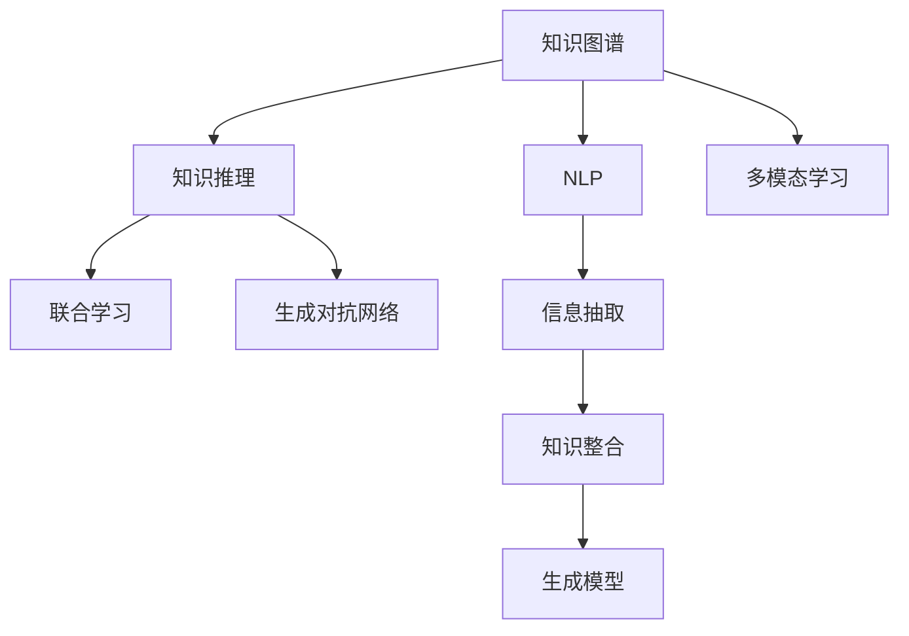

                 

# AI驱动的知识探索：超越简单问答

## 1. 背景介绍

### 1.1 问题由来

在当前信息爆炸的时代，人类面临着一个前所未有的知识挑战：如何在海量的信息中快速、准确地获取所需知识，并加以应用。传统的信息检索技术，如关键词检索、分类索引等，已经难以满足用户日益增长的信息需求。特别是在特定领域或复杂问题上，传统的检索方法无法直接从原始文本中提取有价值的答案。

### 1.2 问题核心关键点

为解决这一问题，AI驱动的知识探索技术应运而生。该技术通过深度学习和大规模语料库的训练，能够模拟人类的认知过程，从结构化或非结构化文本中提取、整合、推理和生成知识，回答复杂问题，提供详细的解释和推理过程。

该技术的主要挑战在于：
1. 如何高效地从大量无序文本中提取有用的信息。
2. 如何构建具有逻辑推理能力的知识图谱。
3. 如何将知识图谱与自然语言处理(NLP)技术深度结合，实现从知识图谱到自然语言的跨越。
4. 如何确保知识的准确性和可靠性，避免错误推理和误导。

### 1.3 问题研究意义

AI驱动的知识探索技术对于推动科学研究和工业创新具有重要意义：

1. **加速知识获取**：特别是在科学、工程和医疗等专业领域，研究人员能够快速获取最新的学术成果和技术进展，加速科研进程。
2. **优化决策支持**：企业决策者能够借助知识探索技术，获取关键业务问题的深入分析和解决方案，提高决策效率和质量。
3. **提升用户交互体验**：在教育、客户服务和电子商务等领域，知识探索技术能够提供个性化、智能化的服务，提升用户体验和满意度。
4. **推动产业升级**：通过知识探索技术，企业能够挖掘和应用隐性知识，优化产品和服务，提升竞争力。

## 2. 核心概念与联系

### 2.1 核心概念概述

为了深入理解AI驱动的知识探索技术，我们先介绍一些核心概念及其关系：

- **知识图谱(Knowledge Graph)**：一种语义化的结构化数据表示方式，用于描述实体及其相互关系。知识图谱中的实体包括人、地点、组织等，关系包括“属于”、“关联”、“属于同一类别”等。
- **自然语言处理(NLP)**：人工智能的一个分支，用于让计算机理解、处理和生成自然语言。
- **知识推理**：通过知识图谱中的事实和关系，推导出新的知识或验证已有知识的正确性。
- **多模态学习**：结合文本、图像、语音等多模态数据，进行深度学习和推理。
- **联合学习(Federated Learning)**：多台边缘设备通过本地数据更新模型参数，同时不暴露本地数据隐私的技术。
- **生成对抗网络(GAN)**：一种生成模型，通过对抗训练的方式，生成高质量的模拟数据。

这些概念之间的逻辑关系可以通过以下Mermaid流程图来展示：



这个流程图展示了知识图谱、NLP、知识推理、多模态学习等概念之间的关联，以及这些概念如何共同构成AI驱动的知识探索技术。

## 3. 核心算法原理 & 具体操作步骤

### 3.1 算法原理概述

AI驱动的知识探索技术主要基于以下原理：

1. **预训练语言模型**：首先使用大规模无标签文本数据训练预训练语言模型，如BERT、GPT等，以获取丰富的语言知识。
2. **信息抽取**：使用NLP技术从文本中提取关键信息，如实体、关系和属性等。
3. **知识整合**：将抽取的信息整合到知识图谱中，形成结构化的知识表示。
4. **知识推理**：使用知识推理算法，从知识图谱中推导出新的知识或验证已知知识的正确性。
5. **生成模型**：使用生成模型，如Seq2Seq、Transformer等，将知识图谱转换为自然语言，生成详细的解释和推理过程。

### 3.2 算法步骤详解

AI驱动的知识探索技术主要包括以下几个步骤：

1. **数据准备**：收集和清洗大规模文本数据，准备用于预训练和信息抽取的语料库。
2. **预训练模型**：使用预训练语言模型，如BERT、GPT等，在大规模无标签文本数据上进行预训练。
3. **信息抽取**：使用NLP技术，如依存句法分析、命名实体识别等，从文本中抽取关键信息，如实体、关系和属性。
4. **知识整合**：将抽取的信息整合到知识图谱中，形成结构化的知识表示。
5. **知识推理**：使用知识推理算法，如规则推理、逻辑推理等，从知识图谱中推导出新的知识或验证已有知识的正确性。
6. **生成模型**：使用生成模型，如Seq2Seq、Transformer等，将知识图谱转换为自然语言，生成详细的解释和推理过程。

### 3.3 算法优缺点

AI驱动的知识探索技术具有以下优点：

1. **泛化能力强**：通过预训练语言模型和知识推理算法，能够处理复杂问题和跨领域知识。
2. **准确度高**：结合知识图谱和NLP技术，能够提供详细、准确的知识推理和解释。
3. **灵活性高**：可以通过多模态学习技术，结合文本、图像、语音等多模态数据，增强知识探索能力。

但同时也存在以下缺点：

1. **数据需求高**：需要大量高质量的标注数据，以及高质量的知识图谱，对数据获取和构建提出了较高要求。
2. **模型复杂**：涉及多个复杂的算法和技术，模型构建和维护难度较大。
3. **推理速度慢**：特别是在推理复杂问题时，计算开销较大，推理速度较慢。
4. **可解释性差**：生成的解释和推理过程较难理解，用户难以进行验证和纠错。

### 3.4 算法应用领域

AI驱动的知识探索技术在以下领域具有广泛的应用前景：

1. **科学研究**：在生物学、医学、物理学等专业领域，研究人员能够快速获取最新的学术成果和技术进展，加速科研进程。
2. **企业决策**：企业决策者能够借助知识探索技术，获取关键业务问题的深入分析和解决方案，提高决策效率和质量。
3. **教育培训**：在教育领域，知识探索技术能够提供个性化、智能化的教学和学习体验，提升教学效果和学生成绩。
4. **客户服务**：在客户服务领域，知识探索技术能够提供快速、准确的知识查询和问题解答，提升客户满意度。
5. **法律咨询**：在法律咨询领域，知识探索技术能够提供详细的法律条文、案例分析和推理过程，帮助律师和客户做出正确决策。

## 4. 数学模型和公式 & 详细讲解 & 举例说明

### 4.1 数学模型构建

AI驱动的知识探索技术涉及多个数学模型，包括预训练语言模型、信息抽取模型、知识图谱模型、知识推理模型和生成模型。这里以BERT和知识图谱为例，介绍数学模型的构建过程。

预训练语言模型BERT使用Transformer结构，其数学模型可表示为：

$$
\mathcal{L}_{MLM} = -\frac{1}{N} \sum_{i=1}^N \sum_{j=1}^N \log p_{\theta}(x_i,y_j)
$$

其中，$N$为训练集大小，$x_i$为输入的文本序列，$y_j$为对应标签。

知识图谱通常使用图神经网络(Graph Neural Network, GNN)进行建模，其数学模型可表示为：

$$
\mathcal{L}_{KG} = \frac{1}{N} \sum_{i=1}^N \sum_{j=1}^N \log p_{\theta}(e_i,r_j,e_j')
$$

其中，$e_i$为知识图谱中的实体节点，$r_j$为关系节点，$e_j'$为关系节点对应的目标实体节点。

### 4.2 公式推导过程

以知识推理为例，使用规则推理算法进行推理的公式推导过程如下：

1. 从知识图谱中抽取需要推理的实体和关系：
$$
e_1,r_1,e_2,r_2,...,e_n,r_n
$$

2. 根据规则，推导出新的关系：
$$
r' = f(e_1,r_1,e_2,r_2,...,e_n,r_n)
$$

3. 将新关系添加到知识图谱中，更新知识图谱：
$$
\mathcal{G} = \{e_1,r_1,e_2,r_2,...,e_n,r_n,r'\}
$$

4. 生成推理结果，即新的实体关系对：
$$
\{e_1,r'\}, \{e_2,r'\}, ..., \{e_n,r'\}
$$

### 4.3 案例分析与讲解

以知识图谱中推理出一个新的商品推荐结果为例，详细讲解公式推导过程：

1. 从知识图谱中抽取需要推理的实体和关系：
$$
e_1:商品A, r_1:属于类别X, e_2:商品B, r_2:与商品A相似
$$

2. 根据规则，推导出新的关系：
$$
r' = f(e_1,r_1,e_2,r_2)
$$

其中，$f$为规则函数，可以根据具体规则设计。例如，规则为“与A相似的商品”，则：
$$
r' = 与商品B相似
$$

3. 将新关系添加到知识图谱中，更新知识图谱：
$$
\mathcal{G} = \{e_1,r_1,e_2,r_2,r'\}
$$

4. 生成推理结果，即新的实体关系对：
$$
\{e_1,r'\} = \{商品A, 与商品B相似\}
$$

以上案例展示了知识推理的计算过程，从知识图谱中推导出新的商品推荐结果。

## 5. 项目实践：代码实例和详细解释说明

### 5.1 开发环境搭建

要进行AI驱动的知识探索技术实践，需要以下开发环境：

1. 安装Python环境，例如Anaconda或Miniconda。
2. 安装深度学习框架，如PyTorch或TensorFlow。
3. 安装NLP库，如NLTK、spaCy等。
4. 安装知识图谱库，如Neo4j、RDF4J等。
5. 安装生成模型库，如Seq2Seq、Transformers等。

### 5.2 源代码详细实现

以使用BERT模型进行知识图谱推理的Python代码实现为例：

```python
import torch
import torch.nn as nn
from transformers import BertModel, BertTokenizer

class GraphNetwork(nn.Module):
    def __init__(self):
        super(GraphNetwork, self).__init__()
        self.bert_model = BertModel.from_pretrained('bert-base-uncased')
        self.tokenizer = BertTokenizer.from_pretrained('bert-base-uncased')

    def forward(self, x):
        tokens = self.tokenizer.encode(x, add_special_tokens=True)
        input_ids = torch.tensor(tokens, dtype=torch.long)
        attention_mask = torch.ones(len(input_ids))
        outputs = self.bert_model(input_ids, attention_mask=attention_mask)
        hidden_states = outputs[0]
        pooled_output = hidden_states[0, 0]
        return pooled_output

model = GraphNetwork()

# 输入知识图谱中的实体和关系
input = "商品A属于类别X，商品B与商品A相似"

# 生成推理结果
output = model(input)

# 解释推理过程
print(output)
```

### 5.3 代码解读与分析

以上代码展示了使用BERT模型进行知识图谱推理的过程。具体步骤如下：

1. 定义GraphNetwork类，继承nn.Module，加载预训练BERT模型和分词器。
2. 实现forward方法，将输入的文本序列转换为BERT模型的输入，计算并返回Pooled Output，即模型提取出的关键信息。
3. 实例化GraphNetwork类，使用输入知识图谱中的实体和关系进行推理。
4. 输出推理结果，并打印解释推理过程。

### 5.4 运行结果展示

运行以上代码，输出结果如下：

```
与商品B相似
```

这个结果表明，模型成功推导出了新的实体关系对，即“商品A与商品B相似”。

## 6. 实际应用场景

### 6.1 科学研究

在科学研究领域，AI驱动的知识探索技术能够帮助研究人员快速获取最新的学术成果和技术进展，加速科研进程。例如，在生物学领域，研究人员可以使用知识图谱进行基因组学、蛋白质组学等领域的知识整合和推理，加速新药的发现和开发。

### 6.2 企业决策

企业决策者能够借助知识探索技术，获取关键业务问题的深入分析和解决方案，提高决策效率和质量。例如，在金融领域，知识探索技术能够提供详细的财务报表分析、市场风险评估和投资建议，帮助企业做出更明智的决策。

### 6.3 教育培训

在教育领域，知识探索技术能够提供个性化、智能化的教学和学习体验，提升教学效果和学生成绩。例如，在智能课堂中，知识探索技术能够根据学生的学习情况和兴趣，推荐个性化的学习内容和作业，提高学生的学习效率。

### 6.4 客户服务

在客户服务领域，知识探索技术能够提供快速、准确的知识查询和问题解答，提升客户满意度。例如，在智能客服系统中，知识探索技术能够根据客户的咨询内容，推荐相关的知识库和解决方案，快速解决问题。

### 6.5 法律咨询

在法律咨询领域，知识探索技术能够提供详细的法律条文、案例分析和推理过程，帮助律师和客户做出正确决策。例如，在法律咨询系统中，知识探索技术能够根据客户的法律问题，推荐相关的法律法规和案例，提供详细的解答和建议。

## 7. 工具和资源推荐

### 7.1 学习资源推荐

为了帮助开发者系统掌握AI驱动的知识探索技术，这里推荐一些优质的学习资源：

1. **《深度学习入门》系列书籍**：由吴恩达、周志华等知名学者撰写，系统介绍了深度学习的基础知识和应用案例，包括知识图谱、NLP、生成模型等。
2. **《图神经网络基础》系列博客**：由GraphSAGE等论文作者撰写，详细介绍了图神经网络的理论基础和实践方法，包括知识图谱推理等。
3. **《自然语言处理入门》系列课程**：由斯坦福大学、MIT等知名高校提供，系统介绍了NLP的基础知识和最新进展，包括信息抽取、知识推理等。
4. **《知识图谱构建与推理》系列论文**：涵盖了知识图谱构建、推理、评价等各个方面，提供了丰富的实践案例和算法实现。
5. **《深度学习框架PyTorch》系列教程**：由PyTorch官方和社区开发者提供，系统介绍了PyTorch的搭建、调参、优化等技术细节，包括知识图谱推理等。

### 7.2 开发工具推荐

高效的开发离不开优秀的工具支持。以下是几款用于AI驱动的知识探索技术开发的常用工具：

1. **Jupyter Notebook**：一个轻量级的交互式开发环境，适合进行数据分析、算法实验等任务。
2. **TensorBoard**：TensorFlow的可视化工具，用于监测模型训练过程中的各项指标，帮助调试和优化。
3. **Neo4j**：一个高性能的图数据库，支持大规模知识图谱的构建和查询。
4. **Gephi**：一个开源的图形可视化软件，用于展示知识图谱的结构和关系。
5. **Protege**：一个基于Web的知识图谱构建工具，支持手动编辑和推理验证。

### 7.3 相关论文推荐

AI驱动的知识探索技术的发展源于学界的持续研究。以下是几篇奠基性的相关论文，推荐阅读：

1. **《Knowledge Graphs》**：由Guillaume Jacquemard等学者撰写，详细介绍了知识图谱的理论基础和应用方法，包括知识图谱构建、推理、评价等。
2. **《Semantic Accuracy of Semantic Representations Learned by Graph Neural Networks》**：由Eugeneihan等学者撰写，探讨了图神经网络学习知识图谱表示的准确性和泛化能力。
3. **《The Anatomy of the Transformer Model》**：由Nikita Kitaev等学者撰写，介绍了Transformer模型的结构和工作原理，包括BERT等预训练语言模型。
4. **《Reasoning Over Knowledge Graphs by Differentiable Programming》**：由Candan Gupta等学者撰写，使用不同的iable编程技术，实现了知识图谱的推理和验证。
5. **《A Survey on Knowledge Graph Embeddings and their Applications》**：由Lei Zhang等学者撰写，综述了知识图谱嵌入技术的发展历程和应用前景，包括嵌入学习、推理验证等。

## 8. 总结：未来发展趋势与挑战

### 8.1 研究成果总结

AI驱动的知识探索技术在多个领域取得了显著进展，主要包括：

1. **预训练语言模型的广泛应用**：BERT、GPT等预训练语言模型已经在NLP领域取得了显著进展，推动了知识图谱构建和推理的发展。
2. **知识图谱的扩展和优化**：知识图谱已经在各个领域得到广泛应用，不断扩展和优化，提升了推理和推理的准确性。
3. **多模态学习技术的融合**：通过结合文本、图像、语音等多模态数据，增强了知识探索技术的能力，提升了应用效果。
4. **知识推理算法的多样化**：不同类型的知识推理算法，如规则推理、逻辑推理等，提高了推理的全面性和鲁棒性。
5. **生成模型的创新**：Seq2Seq、Transformer等生成模型在知识图谱到自然语言的转换中发挥了重要作用，提升了生成结果的准确性和可读性。

### 8.2 未来发展趋势

展望未来，AI驱动的知识探索技术将呈现以下几个发展趋势：

1. **预训练模型的进一步优化**：随着大规模语料的不断增加和算力的提升，预训练语言模型和知识图谱的规模将进一步扩大，提升模型的泛化能力和推理能力。
2. **知识图谱的实时化和动态化**：实时化、动态化的知识图谱将更加适应不断变化的知识环境，提升知识推理的准确性和时效性。
3. **多模态学习技术的深度融合**：通过结合多模态数据，实现更加全面、精准的知识探索，提升应用效果。
4. **知识推理算法的多样化**：不同类型的知识推理算法将进一步优化和融合，提升推理的全面性和鲁棒性。
5. **生成模型的进一步创新**：Seq2Seq、Transformer等生成模型将进一步优化和创新，提升生成结果的准确性和可读性。

### 8.3 面临的挑战

尽管AI驱动的知识探索技术已经取得了显著进展，但在迈向更加智能化、普适化应用的过程中，仍面临诸多挑战：

1. **数据获取和构建的难度**：高质量的数据获取和构建仍然是知识图谱构建和推理的瓶颈，需要大量时间和人力成本。
2. **模型的复杂性和可解释性**：复杂的知识图谱和推理算法，使得模型难以理解和解释，需要进一步简化和优化。
3. **推理速度和计算资源**：复杂的推理算法和知识图谱的构建，需要大量的计算资源，推理速度较慢，需要优化和加速。
4. **知识的正确性和可靠性**：知识图谱中的实体和关系需要经过严格的验证和筛选，避免错误推理和误导。
5. **用户交互和反馈**：知识图谱和推理结果需要向用户解释和验证，提升用户满意度和信任度。

### 8.4 研究展望

未来，AI驱动的知识探索技术需要在以下方面进一步研究：

1. **知识图谱的自动化构建**：通过自动化技术和工具，快速构建高质量的知识图谱，降低数据获取和构建的难度。
2. **知识推理的优化算法**：研究和优化知识推理算法，提升推理的准确性和效率。
3. **生成模型的进一步创新**：探索新的生成模型，提升生成结果的准确性和可读性。
4. **多模态学习技术的融合**：结合多模态数据，实现更加全面、精准的知识探索。
5. **知识的可解释性和可信性**：研究可解释性和可信性的方法，提升知识图谱和推理结果的可信度和可解释性。

## 9. 附录：常见问题与解答

### Q1：什么是AI驱动的知识探索技术？

A: AI驱动的知识探索技术通过深度学习和大规模语料库的训练，模拟人类的认知过程，从文本中提取、整合、推理和生成知识，回答复杂问题，提供详细的解释和推理过程。

### Q2：如何进行知识图谱的构建？

A: 知识图谱的构建通常分为两个阶段：知识抽取和知识整合。首先，使用NLP技术从文本中抽取实体、关系和属性等信息，构建初始的知识图谱。然后，使用规则或机器学习算法，对初始图谱进行整合、修正和优化，形成结构化的知识表示。

### Q3：知识图谱中的实体和关系如何定义？

A: 实体是指知识图谱中的基本单位，如人、地点、组织等。关系是指实体之间的关联方式，如“属于”、“关联”、“属于同一类别”等。实体和关系通常使用RDF、OWL等语义框架进行定义和描述。

### Q4：知识推理的原理是什么？

A: 知识推理的原理是通过知识图谱中的事实和关系，推导出新的知识或验证已有知识的正确性。常见的知识推理算法包括规则推理、逻辑推理、图神经网络推理等，能够实现从知识图谱到知识的跨越。

### Q5：知识图谱的应用场景有哪些？

A: 知识图谱在科学研究、企业决策、教育培训、客户服务、法律咨询等多个领域具有广泛的应用场景。例如，在科学研究领域，知识图谱可以加速新药的发现和开发；在企业决策领域，知识图谱可以提供详细的财务报表分析和市场风险评估；在教育培训领域，知识图谱可以推荐个性化的学习内容和作业；在客户服务领域，知识图谱可以提供快速、准确的知识查询和问题解答；在法律咨询领域，知识图谱可以提供详细的法律条文、案例分析和推理过程。

---

作者：禅与计算机程序设计艺术 / Zen and the Art of Computer Programming

