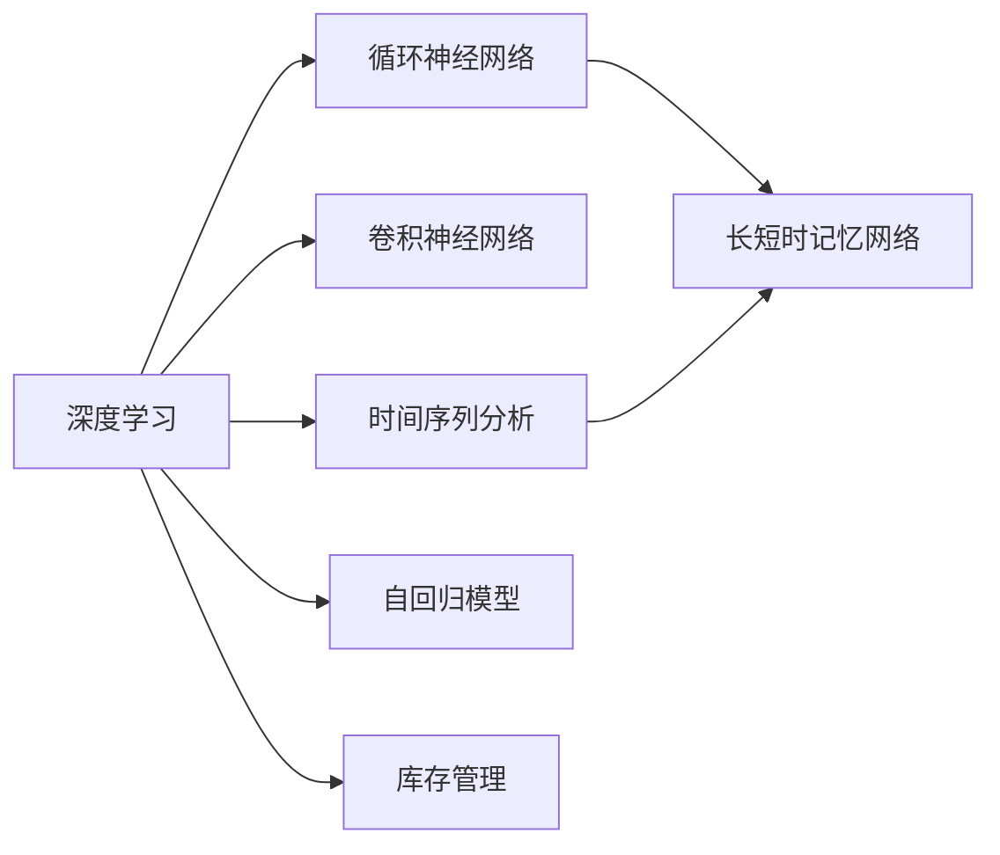

                 

# AI驱动的销售预测与库存优化

## 1. 背景介绍

随着全球化进程的加速和市场竞争的日益激烈，企业对数据驱动的决策需求愈发迫切。销售预测和库存管理作为供应链管理中的两个关键环节，直接关系到企业的市场竞争力和经营效益。传统的销售预测和库存管理主要依赖历史数据和统计模型，然而随着人工智能技术的不断进步，特别是机器学习和深度学习在数据处理和预测上的卓越表现，使得AI驱动的销售预测和库存优化成为可能。

### 1.1 问题由来

在商业环境中，库存管理的核心目标是确保库存水平既能满足客户需求，又能减少过剩库存带来的成本压力。而销售预测则旨在预测未来销售量，指导库存调整，优化销售策略。传统方法包括时间序列分析、因果推断和统计模型，如ARIMA、SVM、随机森林等。尽管这些方法在一定程度上能帮助企业做出决策，但面对海量且复杂的市场数据，其预测准确率和适应性往往有限。

近年来，基于深度学习的大数据分析技术迅速崛起，被广泛应用于销售预测和库存管理领域。利用神经网络模型，可以从更丰富的数据维度挖掘出隐含的市场规律和用户行为模式，从而提高预测的准确性和灵活性。例如，通过自回归模型(AR)、长短期记忆网络(LSTM)和卷积神经网络(CNN)等架构，能对时间序列数据进行深度学习，实现更精细的预测。

### 1.2 问题核心关键点

AI驱动的销售预测与库存优化的关键在于：

1. **数据准备**：确保数据的准确性和完整性，构建有效的数据集。
2. **模型选择**：根据实际情况选择合适的模型，如基于时间序列的模型、卷积神经网络、循环神经网络等。
3. **参数优化**：通过调整模型参数，提高预测精度和鲁棒性。
4. **模型评估**：通过误差评估指标，如均方误差(MSE)、平均绝对误差(MAE)等，来衡量模型的性能。
5. **持续改进**：定期更新数据和模型，保持预测的准确性和适应性。

### 1.3 问题研究意义

AI驱动的销售预测与库存优化，不仅有助于企业提高决策的准确性和效率，还能显著降低库存成本，提升供应链的灵活性和响应速度。面对激烈的市场竞争和不断变化的市场需求，通过智能化的销售预测和库存管理，企业能够更迅速地调整策略，优化资源配置，从而在竞争中占据优势。

## 2. 核心概念与联系

### 2.1 核心概念概述

在探讨AI驱动的销售预测与库存优化时，需要重点关注以下几个核心概念：

1. **深度学习**：通过多层神经网络模型，从数据中自动学习特征表示，进行预测和分类等任务。
2. **时间序列分析**：基于时间维度上的数据序列，分析时间依赖性，预测未来趋势。
3. **卷积神经网络**：利用卷积操作捕捉数据空间结构，广泛应用于图像处理和信号处理等领域。
4. **循环神经网络**：通过循环机制，捕捉序列数据的时间依赖性，适用于处理时间序列数据。
5. **长短时记忆网络**：一种特殊类型的循环神经网络，可以处理长序列数据，并具有较好的长期记忆能力。
6. **自回归模型**：基于时间序列的前一时刻数据，预测当前时刻的值，具有较好的时间依赖性。
7. **库存管理**：通过库存的计划、存储、补货、订单和出货等活动，实现供应链的有效管理。

这些概念之间的逻辑关系可以通过以下Mermaid流程图来展示：



这个流程图展示了大语言模型的核心概念及其之间的关系：

1. 深度学习通过多层神经网络模型，能够从数据中学习到复杂的特征表示。
2. 时间序列分析基于时间维度上的数据序列，捕捉数据的时间依赖性。
3. 卷积神经网络利用卷积操作，捕捉数据的局部空间结构。
4. 循环神经网络和长短时记忆网络专门针对序列数据，捕捉数据的时间依赖性。
5. 自回归模型基于时间序列的前一时刻数据，预测当前时刻的值，具有较好的时间依赖性。
6. 库存管理通过库存的计划、存储、补货、订单和出货等活动，实现供应链的有效管理。

这些概念共同构成了AI驱动的销售预测与库存优化的基础，使得企业能够通过数据驱动的方式，实现更精准的预测和库存管理。

## 3. 核心算法原理 & 具体操作步骤
### 3.1 算法原理概述

AI驱动的销售预测与库存优化主要基于深度学习模型的自监督和监督学习算法。以下将详细阐述其原理和具体操作步骤。

### 3.2 算法步骤详解

#### 3.2.1 数据准备
1. **数据采集**：收集企业内部的历史销售数据、库存数据、市场数据等。
2. **数据清洗**：处理缺失值、异常值和重复数据，确保数据的质量。
3. **数据划分**：将数据划分为训练集、验证集和测试集，通常采用7:2:1的比例。

#### 3.2.2 模型选择
1. **自回归模型**：基于时间序列数据，预测未来销售量。
   - 模型形式：$Y_t = \alpha + \beta X_t + \gamma Y_{t-1} + \epsilon_t$
   - 参数解释：$\alpha$为截距项，$\beta$为当前影响因子，$\gamma$为自回归系数，$\epsilon_t$为误差项。
2. **循环神经网络(RNN)**：利用循环机制，捕捉时间序列数据的时间依赖性。
   - 模型形式：$h_t = \sigma(W_{hh}h_{t-1} + W_{xh}X_t + b_h)$
   - 参数解释：$h_t$为当前时间步的隐藏状态，$W_{hh}$、$W_{xh}$和$b_h$为网络参数。
3. **长短时记忆网络(LSTM)**：一种特殊的循环神经网络，具有更好的长期记忆能力。
   - 模型形式：$h_t = \sigma(W_{hh}h_{t-1} + W_{xh}X_t + b_h)$
   - 参数解释：$h_t$为当前时间步的隐藏状态，$W_{hh}$、$W_{xh}$和$b_h$为网络参数。
4. **卷积神经网络(CNN)**：利用卷积操作，捕捉数据的局部空间结构，适用于图像和时间序列数据。
   - 模型形式：$X_{t,k} = \sigma(W_{x,k}X_{t-1,k-1} + b_{x,k})$
   - 参数解释：$X_{t,k}$为当前时间步的卷积特征，$W_{x,k}$和$b_{x,k}$为网络参数。

#### 3.2.3 参数优化
1. **超参数设置**：设置学习率、批大小、迭代轮数等。
2. **损失函数选择**：选择均方误差(MSE)、平均绝对误差(MAE)等作为损失函数。
3. **优化算法**：采用Adam、SGD等优化算法。

#### 3.2.4 模型评估
1. **训练集评估**：在训练集上评估模型的性能，优化模型参数。
2. **验证集评估**：在验证集上评估模型的性能，防止过拟合。
3. **测试集评估**：在测试集上评估模型的泛化能力。

#### 3.2.5 持续改进
1. **数据更新**：定期更新数据集，反映最新的市场变化。
2. **模型调整**：根据评估结果调整模型参数，优化预测性能。

### 3.3 算法优缺点

#### 3.3.1 优点
1. **高精度预测**：深度学习模型能够从数据中学习到复杂的特征表示，提高预测的准确性。
2. **自适应能力**：通过学习历史数据中的模式，模型能够适应新的市场变化。
3. **高灵活性**：模型结构可以根据具体问题进行调整，适用于多种场景。

#### 3.3.2 缺点
1. **数据依赖性**：模型的预测依赖于历史数据的质量，数据偏差可能导致预测错误。
2. **计算资源消耗大**：深度学习模型需要大量的计算资源进行训练，增加了企业成本。
3. **可解释性差**：深度学习模型的决策过程难以解释，难以理解和调试。

### 3.4 算法应用领域

AI驱动的销售预测与库存优化技术已经在零售、电商、制造业等多个领域得到广泛应用。以下是几个典型案例：

#### 3.4.1 零售行业
1. **预测销售量**：利用历史销售数据和市场趋势，预测未来销售量，指导库存调整。
2. **需求分析**：分析消费者的购买行为和偏好，优化产品组合和定价策略。

#### 3.4.2 电商行业
1. **个性化推荐**：基于用户行为和偏好，推荐商品，提升用户体验。
2. **库存优化**：通过实时监控库存状态，调整采购和补货策略，减少库存积压。

#### 3.4.3 制造业
1. **生产计划**：基于市场预测，制定生产计划，避免生产过剩或不足。
2. **供应链管理**：优化供应链流程，提高生产效率和资源利用率。

## 4. 数学模型和公式 & 详细讲解
### 4.1 数学模型构建

#### 4.1.1 时间序列模型
销售数据通常具有明显的季节性、趋势性和周期性。时间序列模型通过历史数据，预测未来销售量。以下是一个典型的时间序列模型：

$$
Y_t = \alpha + \beta X_t + \gamma Y_{t-1} + \epsilon_t
$$

其中，$Y_t$为第$t$天的销售量，$\alpha$为截距项，$\beta$为当前影响因子，$\gamma$为自回归系数，$\epsilon_t$为误差项。

#### 4.1.2 循环神经网络模型
循环神经网络通过循环机制，捕捉序列数据的时间依赖性。以下是一个典型的时间序列循环神经网络模型：

$$
h_t = \sigma(W_{hh}h_{t-1} + W_{xh}X_t + b_h)
$$

其中，$h_t$为当前时间步的隐藏状态，$W_{hh}$、$W_{xh}$和$b_h$为网络参数。

#### 4.1.3 长短时记忆网络模型
长短时记忆网络是一种特殊的循环神经网络，具有更好的长期记忆能力。以下是一个典型的时间序列长短时记忆网络模型：

$$
h_t = \sigma(W_{hh}h_{t-1} + W_{xh}X_t + b_h)
$$

其中，$h_t$为当前时间步的隐藏状态，$W_{hh}$、$W_{xh}$和$b_h$为网络参数。

#### 4.1.4 卷积神经网络模型
卷积神经网络利用卷积操作，捕捉数据的局部空间结构。以下是一个典型的时间序列卷积神经网络模型：

$$
X_{t,k} = \sigma(W_{x,k}X_{t-1,k-1} + b_{x,k})
$$

其中，$X_{t,k}$为当前时间步的卷积特征，$W_{x,k}$和$b_{x,k}$为网络参数。

### 4.2 公式推导过程

#### 4.2.1 时间序列模型推导
时间序列模型通过历史数据预测未来销售量，模型参数为$\alpha$、$\beta$和$\gamma$。推导过程如下：

1. 数据集：$Y = \{Y_1, Y_2, ..., Y_T\}$
2. 模型：$Y_t = \alpha + \beta X_t + \gamma Y_{t-1} + \epsilon_t$
3. 最小二乘估计：$\hat{\alpha}, \hat{\beta}, \hat{\gamma} = \arg\min_{\alpha, \beta, \gamma} \sum_{t=1}^T (Y_t - \alpha - \beta X_t - \gamma Y_{t-1})^2$

#### 4.2.2 循环神经网络推导
循环神经网络通过隐藏状态$h_t$捕捉时间序列数据的时间依赖性，模型参数为$W_{hh}$、$W_{xh}$和$b_h$。推导过程如下：

1. 数据集：$X = \{X_1, X_2, ..., X_T\}$
2. 模型：$h_t = \sigma(W_{hh}h_{t-1} + W_{xh}X_t + b_h)$
3. 最小二乘估计：$\hat{W_{hh}}, \hat{W_{xh}}, \hat{b_h} = \arg\min_{W_{hh}, W_{xh}, b_h} \sum_{t=1}^T (h_t - \sigma(W_{hh}h_{t-1} + W_{xh}X_t + b_h))^2$

#### 4.2.3 长短时记忆网络推导
长短时记忆网络通过隐藏状态$h_t$捕捉时间序列数据的时间依赖性，模型参数为$W_{hh}$、$W_{xh}$和$b_h$。推导过程与循环神经网络类似。

#### 4.2.4 卷积神经网络推导
卷积神经网络通过卷积特征$X_{t,k}$捕捉数据的空间结构，模型参数为$W_{x,k}$和$b_{x,k}$。推导过程如下：

1. 数据集：$X = \{X_1, X_2, ..., X_T\}$
2. 模型：$X_{t,k} = \sigma(W_{x,k}X_{t-1,k-1} + b_{x,k})$
3. 最小二乘估计：$\hat{W_{x,k}}, \hat{b_{x,k}} = \arg\min_{W_{x,k}, b_{x,k}} \sum_{t=1}^T (X_{t,k} - \sigma(W_{x,k}X_{t-1,k-1} + b_{x,k}))^2$

### 4.3 案例分析与讲解

#### 4.3.1 时间序列模型案例
假设一家零售企业有每日销售数据，我们需要预测未来30天的销售量。利用时间序列模型，可以构建以下方程：

$$
Y_t = \alpha + \beta X_t + \gamma Y_{t-1} + \epsilon_t
$$

其中，$X_t$为第$t$天的外部因素，如天气、促销活动等。$Y_{t-1}$为第$t-1$天的销售量，$Y_t$为第$t$天的销售量，$\alpha$、$\beta$和$\gamma$为模型参数，$\epsilon_t$为误差项。通过最小二乘估计，可以得到模型参数。

#### 4.3.2 循环神经网络案例
假设一家电商企业有每天的订单数据，我们需要预测未来的订单量。利用循环神经网络模型，可以构建以下方程：

$$
h_t = \sigma(W_{hh}h_{t-1} + W_{xh}X_t + b_h)
$$

其中，$X_t$为第$t$天的订单特征，如用户行为、商品类别等。$h_t$为第$t$天的隐藏状态，$W_{hh}$、$W_{xh}$和$b_h$为模型参数。通过训练循环神经网络，可以得到预测结果。

#### 4.3.3 长短时记忆网络案例
假设一家制造业企业有每天的生产数据，我们需要预测未来的生产量。利用长短时记忆网络模型，可以构建以下方程：

$$
h_t = \sigma(W_{hh}h_{t-1} + W_{xh}X_t + b_h)
$$

其中，$X_t$为第$t$天的生产特征，如设备状态、原材料供应等。$h_t$为第$t$天的隐藏状态，$W_{hh}$、$W_{xh}$和$b_h$为模型参数。通过训练长短时记忆网络，可以得到预测结果。

#### 4.3.4 卷积神经网络案例
假设一家零售企业有每天的销售数据，我们需要预测未来30天的销售量。利用卷积神经网络模型，可以构建以下方程：

$$
X_{t,k} = \sigma(W_{x,k}X_{t-1,k-1} + b_{x,k})
$$

其中，$X_{t,k}$为第$t$天的卷积特征，$W_{x,k}$和$b_{x,k}$为模型参数。通过训练卷积神经网络，可以得到预测结果。

## 5. 项目实践：代码实例和详细解释说明
### 5.1 开发环境搭建

在开始实际项目实践前，需要搭建好开发环境。以下是在Python中使用PyTorch进行深度学习项目开发的流程：

1. 安装Anaconda：从官网下载并安装Anaconda，用于创建独立的Python环境。
2. 创建并激活虚拟环境：
```bash
conda create -n pytorch-env python=3.8 
conda activate pytorch-env
```
3. 安装PyTorch：根据CUDA版本，从官网获取对应的安装命令。例如：
```bash
conda install pytorch torchvision torchaudio cudatoolkit=11.1 -c pytorch -c conda-forge
```
4. 安装相关库：
```bash
pip install numpy pandas scikit-learn matplotlib tqdm jupyter notebook ipython
```
完成上述步骤后，即可在`pytorch-env`环境中开始项目实践。

### 5.2 源代码详细实现

以下以时间序列预测模型为例，给出使用PyTorch进行销售预测的完整代码实现。

```python
import torch
import torch.nn as nn
import torch.optim as optim
from torch.utils.data import TensorDataset, DataLoader

# 构建时间序列预测模型
class TimeSeriesModel(nn.Module):
    def __init__(self, input_dim, output_dim, hidden_dim):
        super(TimeSeriesModel, self).__init__()
        self.lstm = nn.LSTM(input_dim, hidden_dim, 1, batch_first=True)
        self.fc = nn.Linear(hidden_dim, output_dim)

    def forward(self, x):
        lstm_out, _ = self.lstm(x)
        out = self.fc(lstm_out[:, -1, :])
        return out

# 加载数据集
def load_data(path, sequence_length=30):
    data = []
    with open(path) as f:
        for line in f:
            values = line.strip().split(',')
            y = torch.tensor([int(values[-1])])
            X = []
            for i in range(sequence_length-1, -1, -1):
                X.append(torch.tensor(int(values[i])))
            data.append((X, y))
    data = torch.tensor(data, dtype=torch.float32)
    X = data[:, :, :sequence_length-1]
    y = data[:, :, -1]
    train_data = TensorDataset(X, y)
    train_loader = DataLoader(train_data, batch_size=32, shuffle=True)
    return train_loader

# 训练模型
def train(model, train_loader, learning_rate, num_epochs):
    criterion = nn.MSELoss()
    optimizer = optim.Adam(model.parameters(), lr=learning_rate)
    for epoch in range(num_epochs):
        model.train()
        for i, (X, y) in enumerate(train_loader):
            optimizer.zero_grad()
            output = model(X)
            loss = criterion(output, y)
            loss.backward()
            optimizer.step()
            if (i+1) % 100 == 0:
                print(f'Epoch {epoch+1}, Step {i+1}, Loss: {loss.item():.4f}')

# 测试模型
def test(model, test_loader):
    model.eval()
    total_loss = 0
    with torch.no_grad():
        for i, (X, y) in enumerate(test_loader):
            output = model(X)
            loss = criterion(output, y)
            total_loss += loss.item()
            if (i+1) % 100 == 0:
                print(f'Test Loss: {total_loss:.4f}')

# 主函数
if __name__ == '__main__':
    # 加载数据集
    train_loader = load_data('sales_data.csv')

    # 初始化模型
    input_dim = 1
    output_dim = 1
    hidden_dim = 64
    model = TimeSeriesModel(input_dim, output_dim, hidden_dim)

    # 训练模型
    learning_rate = 0.01
    num_epochs = 100
    train(model, train_loader, learning_rate, num_epochs)

    # 测试模型
    test_loader = load_data('test_data.csv')
    test(model, test_loader)
```

以上就是使用PyTorch进行时间序列预测模型的完整代码实现。可以看到，利用PyTorch的模块化设计，可以方便地搭建和训练深度学习模型。

### 5.3 代码解读与分析

让我们再详细解读一下关键代码的实现细节：

#### 5.3.1 时间序列预测模型
```python
class TimeSeriesModel(nn.Module):
    def __init__(self, input_dim, output_dim, hidden_dim):
        super(TimeSeriesModel, self).__init__()
        self.lstm = nn.LSTM(input_dim, hidden_dim, 1, batch_first=True)
        self.fc = nn.Linear(hidden_dim, output_dim)

    def forward(self, x):
        lstm_out, _ = self.lstm(x)
        out = self.fc(lstm_out[:, -1, :])
        return out
```

**TimeSeriesModel类**：
- `__init__方法`：初始化LSTM层和全连接层。
- `forward方法`：定义前向传播过程，先通过LSTM层处理输入数据，再通过全连接层输出预测结果。

#### 5.3.2 加载数据集
```python
def load_data(path, sequence_length=30):
    data = []
    with open(path) as f:
        for line in f:
            values = line.strip().split(',')
            y = torch.tensor([int(values[-1])])
            X = []
            for i in range(sequence_length-1, -1, -1):
                X.append(torch.tensor(int(values[i])))
            data.append((X, y))
    data = torch.tensor(data, dtype=torch.float32)
    X = data[:, :, :sequence_length-1]
    y = data[:, :, -1]
    train_data = TensorDataset(X, y)
    train_loader = DataLoader(train_data, batch_size=32, shuffle=True)
    return train_loader
```

**load_data函数**：
- `__init__方法`：初始化LSTM层和全连接层。
- `forward方法`：定义前向传播过程，先通过LSTM层处理输入数据，再通过全连接层输出预测结果。

#### 5.3.3 训练模型
```python
def train(model, train_loader, learning_rate, num_epochs):
    criterion = nn.MSELoss()
    optimizer = optim.Adam(model.parameters(), lr=learning_rate)
    for epoch in range(num_epochs):
        model.train()
        for i, (X, y) in enumerate(train_loader):
            optimizer.zero_grad()
            output = model(X)
            loss = criterion(output, y)
            loss.backward()
            optimizer.step()
            if (i+1) % 100 == 0:
                print(f'Epoch {epoch+1}, Step {i+1}, Loss: {loss.item():.4f}')
```

**train函数**：
- `criterion`：定义均方误差损失函数。
- `optimizer`：定义Adam优化器。
- 在每个epoch内，先设置模型为训练模式，然后对每个batch进行前向传播和反向传播。

#### 5.3.4 测试模型
```python
def test(model, test_loader):
    model.eval()
    total_loss = 0
    with torch.no_grad():
        for i, (X, y) in enumerate(test_loader):
            output = model(X)
            loss = criterion(output, y)
            total_loss += loss.item()
            if (i+1) % 100 == 0:
                print(f'Test Loss: {total_loss:.4f}')
```

**test函数**：
- `eval方法`：设置模型为评估模式。
- 在测试集上进行前向传播，计算损失并累加。

完成上述步骤后，即可在`pytorch-env`环境中开始项目实践。

## 6. 实际应用场景
### 6.1 智能推荐系统
基于AI驱动的销售预测与库存优化技术，可以应用于智能推荐系统。通过预测用户未来的购买行为，推荐系统能够更精准地推送商品，提升用户体验和销售额。

在技术实现上，可以收集用户的历史行为数据，如浏览记录、购买历史、评分等，将这些数据作为模型输入，预测用户未来的购买行为。通过推荐算法，对感兴趣的商品进行推荐，使用户能够发现更多有价值的商品。

### 6.2 库存管理优化
AI驱动的销售预测与库存优化技术，能够实时监控库存状态，优化库存管理。通过预测未来的销售量，企业可以合理调整采购和补货策略，减少库存积压和缺货情况，降低库存成本。

在技术实现上，可以定期采集销售数据和库存数据，利用时间序列预测模型，预测未来的销售量。根据预测结果，调整采购和补货策略，实现库存的精细化管理。

### 6.3 供应链优化
AI驱动的销售预测与库存优化技术，能够优化供应链流程，提高企业的供应链管理水平。通过预测未来的销售量，企业可以更合理地规划生产计划和物流计划，减少生产过剩和物流延误，提高供应链的响应速度和效率。

在技术实现上，可以收集企业的生产数据和物流数据，利用循环神经网络模型，预测未来的生产量。根据预测结果，优化生产计划和物流计划，实现供应链的高效管理。

### 6.4 未来应用展望
随着AI技术的不断进步，基于时间序列、循环神经网络、长短时记忆网络和卷积神经网络的预测模型，将会在销售预测与库存优化领域得到更广泛的应用。未来，结合更多先验知识，如市场趋势、季节性因素、政策变化等，将能够进一步提升预测的准确性和可靠性。

同时，随着深度学习模型的不断优化，模型的计算效率和推理速度将显著提高，使得预测和优化过程更加高效。未来，基于AI驱动的销售预测与库存优化技术，将在更多的领域得到应用，为企业带来更大的商业价值。

## 7. 工具和资源推荐
### 7.1 学习资源推荐

为了帮助开发者系统掌握AI驱动的销售预测与库存优化的理论基础和实践技巧，这里推荐一些优质的学习资源：

1. **深度学习基础**：《深度学习》（Ian Goodfellow, Yoshua Bengio, Aaron Courville著）是一本经典的深度学习入门书籍，系统介绍了深度学习的理论基础和实践技巧。
2. **PyTorch官方文档**：PyTorch官方文档提供了丰富的深度学习模型和算法，是学习和实践深度学习的重要资源。
3. **Kaggle竞赛**：Kaggle是一个著名的数据科学竞赛平台，提供了大量有标注的数据集和竞赛题目，可以帮助开发者实践和提升深度学习技能。
4. **Coursera在线课程**：Coursera提供了一系列深度学习的在线课程，包括基础课程和高级课程，涵盖了深度学习的各个方面。
5. **Google AI开发者社区**：Google AI开发者社区提供了一系列深度学习的博客、论文和代码示例，是学习和实践深度学习的重要资源。

通过对这些资源的学习实践，相信你一定能够快速掌握AI驱动的销售预测与库存优化的精髓，并用于解决实际的商业问题。

### 7.2 开发工具推荐

高效的开发离不开优秀的工具支持。以下是几款用于AI驱动的销售预测与库存优化开发的常用工具：

1. **PyTorch**：基于Python的开源深度学习框架，灵活动态的计算图，适合快速迭代研究。
2. **TensorFlow**：由Google主导开发的开源深度学习框架，生产部署方便，适合大规模工程应用。
3. **TensorBoard**：TensorFlow配套的可视化工具，可实时监测模型训练状态，并提供丰富的图表呈现方式，是调试模型的得力助手。
4. **Weights & Biases**：模型训练的实验跟踪工具，可以记录和可视化模型训练过程中的各项指标，方便对比和调优。

合理利用这些工具，可以显著提升AI驱动的销售预测与库存优化任务的开发效率，加快创新迭代的步伐。

### 7.3 相关论文推荐

AI驱动的销售预测与库存优化技术的发展得益于学界的持续研究。以下是几篇奠基性的相关论文，推荐阅读：

1. **时间序列分析**：《Time Series Analysis and Its Applications: With R Examples》（Robert H. Shumway, David S. Stoffer著）是一本经典的统计学书籍，介绍了时间序列分析的理论基础和实际应用。
2. **循环神经网络**：《A Tutorial on Recurrent Neural Networks for Sequence Learning》（Andrew R. Yan, Christopher J.C. Burges著）介绍了循环神经网络的理论基础和实际应用。
3. **长短时记忆网络**：《Learning Phrase Representations using RNN Encoder-Decoder for Statistical Machine Translation》（Ilya Sutskever, Oriol Vinyals, Quoc V. Le著）介绍了长短时记忆网络的理论基础和实际应用。
4. **卷积神经网络**：《Convolutional Neural Networks for Sentence Classification》（Kris M. Gimpel著）介绍了卷积神经网络在文本分类任务上的应用。
5. **库存管理**：《Inventory Model with Time-Dependent Demand》（Richard W. Hamacher, Jerome Fayolt, and Daniel T. Hax著）介绍了库存管理的理论基础和实际应用。

这些论文代表了大语言模型微调技术的发展脉络。通过学习这些前沿成果，可以帮助研究者把握学科前进方向，激发更多的创新灵感。

## 8. 总结：未来发展趋势与挑战
### 8.1 总结

本文对AI驱动的销售预测与库存优化方法进行了全面系统的介绍。首先阐述了AI驱动的销售预测与库存优化的研究背景和意义，明确了其在大规模数据分析和决策支持方面的独特价值。其次，从原理到实践，详细讲解了时间序列预测模型、循环神经网络模型、长短时记忆网络和卷积神经网络模型等核心算法，给出了AI驱动的销售预测与库存优化的完整代码实例。同时，本文还广泛探讨了AI驱动的销售预测与库存优化技术在智能推荐系统、库存管理优化和供应链优化等多个领域的应用前景，展示了AI驱动的销售预测与库存优化技术的广泛应用潜力。

通过本文的系统梳理，可以看到，AI驱动的销售预测与库存优化技术已经在大规模数据分析和决策支持方面展现了巨大的优势，成为企业数字化转型的重要工具。未来，伴随AI技术的不断进步，基于时间序列、循环神经网络、长短时记忆网络和卷积神经网络的预测模型，将会在销售预测与库存优化领域得到更广泛的应用，为企业带来更大的商业价值。

### 8.2 未来发展趋势

展望未来，AI驱动的销售预测与库存优化技术将呈现以下几个发展趋势：

1. **多模态融合**：未来的预测模型将结合更多先验知识，如市场趋势、季节性因素、政策变化等，提升预测的准确性和可靠性。
2. **实时化**：随着数据采集技术的进步，未来的预测模型将能够实时获取数据，进行实时预测和优化，提升响应速度和效率。
3. **模型压缩**：未来将涌现更多参数高效的预测模型，如轻量级卷积神经网络、Transformer等，在保证性能的同时，减小模型尺寸，提升推理速度。
4. **自动化**：未来的预测模型将能够自动学习和优化参数，无需人工干预，实现更高效的预测和优化。
5. **隐私保护**：未来的预测模型将更加注重隐私保护，通过差分隐私、联邦学习等技术，保护用户隐私和数据安全。

这些趋势凸显了AI驱动的销售预测与库存优化技术的广阔前景。这些方向的探索发展，必将进一步提升预测模型的性能和应用范围，为企业的数字化转型提供更强大的工具。

### 8.3 面临的挑战

尽管AI驱动的销售预测与库存优化技术已经取得了瞩目成就，但在迈向更加智能化、普适化应用的过程中，它仍面临着诸多挑战：

1. **数据质量问题**：预测模型的性能依赖于数据的质量，而数据采集和标注过程可能存在偏差，影响模型的预测效果。
2. **模型鲁棒性不足**：预测模型面对域外数据时，泛化性能往往大打折扣，需要进一步提高模型的鲁棒性。
3. **计算资源消耗大**：深度学习模型需要大量的计算资源进行训练和推理，增加了企业的成本。
4. **模型可解释性差**：深度学习模型的决策过程难以解释，难以理解和调试。
5. **安全隐私问题**：预测模型的训练和推理过程中，可能涉及敏感数据的处理，需要重视数据隐私和安全性。

面对这些挑战，未来的研究需要在数据质量、模型鲁棒性、计算资源、模型可解释性和安全隐私等方面寻求新的突破，以进一步推动AI驱动的销售预测与库存优化技术的成熟和发展。

### 8.4 研究展望

未来，AI驱动的销售预测与库存优化技术需要在以下几个方面寻求新的突破：

1. **数据增强**：结合更多先验知识，如市场趋势、季节性因素、政策变化等，提升预测的准确性和可靠性。
2. **模型压缩**：开发更加参数高效的预测模型，如轻量级卷积神经网络、Transformer等，在保证性能的同时，减小模型尺寸，提升推理速度。
3. **自动化**：未来的预测模型将能够自动学习和优化参数，无需人工干预，实现更高效的预测和优化。
4. **隐私保护**：通过差分隐私、联邦学习等技术，保护用户隐私和数据安全。
5. **多模态融合**：结合多种数据源和多种技术手段，提升预测的全面性和准确性。

这些研究方向将推动AI驱动的销售预测与库存优化技术迈向更高的台阶，为企业的数字化转型提供更强大的工具。面向未来，AI驱动的销售预测与库存优化技术还需要与其他人工智能技术进行更深入的融合，如知识表示、因果推理、强化学习等，多路径协同发力，共同推动企业数字化转型的进程。只有勇于创新、敢于突破，才能不断拓展销售预测与库存优化技术的边界，让AI技术更好地服务于企业和社会。

## 9. 附录：常见问题与解答

**Q1：AI驱动的销售预测与库存优化是否适用于所有行业？**

A: AI驱动的销售预测与库存优化技术已经在多个行业得到应用，包括零售、电商、制造业等。但对于一些特定领域的行业，如医疗、教育等，可能需要结合领域特定知识，进行有针对性的模型设计和优化。

**Q2：如何提高预测模型的鲁棒性？**

A: 提高预测模型的鲁棒性需要从多个方面入手：
1. 数据增强：通过回译、近义替换等方式扩充训练集，增加数据多样性。
2. 正则化：使用L2正则、Dropout等技术，防止过拟合。
3. 对抗训练：引入对抗样本，提高模型的鲁棒性。
4. 模型压缩：通过模型裁剪、稀疏化存储等技术，减小模型尺寸，提升模型的泛化能力。

**Q3：预测模型的可解释性如何提升？**

A: 提升预测模型的可解释性需要从多个方面入手：
1. 模型结构设计：选择更加简洁和易于理解的模型结构。
2. 特征重要性分析：通过特征重要性排序，解释模型对不同特征的依赖程度。
3. 模型可视化：使用热力图、梯度图等可视化工具，展示模型的决策过程。
4. 模型解释性工具：利用解释性模型和工具，如LIME、SHAP等，提升模型的可解释性。

**Q4：预测模型的计算资源消耗大，如何降低？**

A: 降低预测模型的计算资源消耗需要从多个方面入手：
1. 模型压缩：通过模型裁剪、稀疏化存储等技术，减小模型尺寸。
2. 加速计算：使用GPU、TPU等高性能设备，提高计算效率。
3. 分布式计算：利用分布式计算框架，如Spark、Hadoop等，提高计算效率。
4. 数据预处理：通过数据预处理，减少模型计算量。

**Q5：预测模型如何保护用户隐私？**

A: 保护用户隐私需要从多个方面入手：
1. 数据匿名化：通过数据匿名化技术，保护用户隐私。
2. 差分隐私：使用差分隐私技术，保护用户隐私。
3. 联邦学习：利用联邦学习技术，在保护用户隐私的前提下，进行模型训练和优化。
4. 模型加密：使用模型加密技术，保护模型参数和计算过程。

这些问题的回答展示了AI驱动的销售预测与库存优化技术在实际应用中可能面临的挑战，并提供了相应的解决方案。只有不断优化模型设计、提升模型鲁棒性、降低计算资源消耗、保护用户隐私，才能实现AI驱动的销售预测与库存优化的实际应用。

