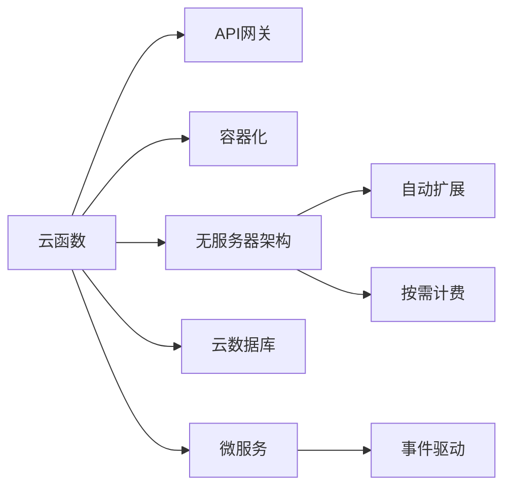

                 

# AWS Serverless应用开发

> 关键词：
1. 云函数
2. API网关
3. 容器化
4. 无服务器架构
5. 云数据库
6. 微服务
7. 弹性扩展

## 1. 背景介绍

### 1.1 问题由来

随着云计算和微服务架构的兴起，传统的单体应用已逐渐被模块化、松耦合的微服务体系所取代。微服务架构的核心思想是将复杂的应用拆分为一系列小型、自治的服务单元，每个服务负责独立的功能，便于快速构建、部署和扩展。但在实际应用中，微服务架构也面临诸多挑战，如服务间通信复杂、版本管理困难、运维成本高昂等。为了应对这些问题，无服务器架构应运而生。

无服务器架构（Serverless Architecture）是一种计算资源按需使用的计算模型，服务仅在需要时运行，无需考虑底层资源管理和运维工作。AWS Lambda等云函数是AWS Serverless架构的核心组件之一，以事件驱动的方式运行，可以自动伸缩、弹性扩展，无需担心资源限制，极大地降低了开发和运维成本。

## 2. 核心概念与联系

### 2.1 核心概念概述

为更好地理解AWS Serverless应用开发，本节将介绍几个密切相关的核心概念：

- **云函数(Cloud Function)**：AWS Lambda等云函数，是AWS Serverless架构中的核心组件。以函数形式封装应用程序代码，通过HTTP请求、API网关、事件触发等方式调用，实现弹性的计算资源管理。
- **API网关(API Gateway)**：用于管理、路由HTTP请求，将请求转发到相应的云函数。支持多种协议、HTTP方法，提供API安全、版本控制、流量限制等功能。
- **容器化(Containerization)**：将应用程序和依赖打包成容器镜像，便于在不同的环境中一致运行，支持自动部署、弹性伸缩、版本管理等。
- **无服务器架构(Serverless Architecture)**：以云函数为代表的无服务器架构，通过自动扩展、按需计费等特性，极大简化开发和运维工作，支持微服务、事件驱动、DevOps等模式。
- **云数据库(Cloud Database)**：AWS RDS等云数据库，为无服务器架构提供可靠的数据存储服务，支持自动备份、高可用性、跨地域分布等特性。
- **微服务(Microservices)**：将大型应用拆分为多个小型、自治的服务单元，便于快速迭代、独立扩展、高可用性等。

这些核心概念之间的逻辑关系可以通过以下Mermaid流程图来展示：



这个流程图展示了大语言模型的核心概念及其之间的关系：

1. 云函数通过API网关接收请求，调用容器化的微服务进行处理。
2. 无服务器架构提供弹性的计算资源管理，实现自动扩展和按需计费。
3. 容器化支持一致的运行环境，便于微服务的快速部署和扩展。
4. 云数据库提供可靠的数据存储服务，支持高可用性和跨地域分布。
5. 微服务将应用拆分为小型、自治的服务单元，便于独立扩展和版本管理。

这些概念共同构成了AWS Serverless应用的计算和存储基础，使得开发者可以专注于业务逻辑，而无需担心基础设施的管理和运维。

## 3. 核心算法原理 & 具体操作步骤

### 3.1 算法原理概述

AWS Serverless应用的开发原理，本质上是通过云函数和API网关，实现无服务器的架构设计。其核心思想是将应用程序的计算部分按需分配，无需管理底层资源，实现弹性扩展和按需计费。

在实际开发中，AWS Lambda等云函数通过事件触发机制，接收HTTP请求、API网关事件、S3文件上传等触发器的调用，自动执行函数代码，处理业务逻辑，并返回结果。云函数可以按需伸缩，根据实际请求量自动调整资源，无需担心峰值流量带来的计算资源不足。

### 3.2 算法步骤详解

基于AWS Serverless架构的应用开发，一般包括以下几个关键步骤：

**Step 1: 开发云函数**

- 选择合适的编程语言（如Python、Node.js、Java等）和框架，编写函数代码。
- 创建Lambda函数，设置函数名称、运行时环境、触发器等配置。
- 编写函数处理程序，实现具体的业务逻辑。
- 编写错误处理程序，处理函数运行中的异常。

**Step 2: 配置API网关**

- 创建API网关，设置API名称、端点和描述。
- 配置API路由，将HTTP请求路由到相应的Lambda函数。
- 设置API安全策略，定义API访问权限。
- 配置API响应和错误处理，返回正确的HTTP响应。

**Step 3: 集成数据库服务**

- 选择合适的云数据库（如AWS RDS、DynamoDB等），创建数据库实例。
- 配置数据库连接和访问权限，确保应用程序可以安全访问数据库。
- 使用AWS SDK或客户端库，在Lambda函数中访问数据库。

**Step 4: 配置持续集成与部署**

- 使用CI/CD工具（如Jenkins、GitHub Actions等），自动化构建、测试和部署过程。
- 配置GitHub、S3等源代码仓库，自动触发构建和部署。
- 配置自动化测试，确保应用程序在每次部署前通过单元测试和集成测试。

**Step 5: 监控与优化**

- 使用AWS CloudWatch等工具，监控应用程序的运行状态和性能指标。
- 设置报警规则，及时发现和处理异常情况。
- 定期分析和优化应用程序的性能瓶颈，提升系统效率。

### 3.3 算法优缺点

基于AWS Serverless架构的应用开发，具有以下优点：

1. 按需计费：根据实际使用量付费，无需担心资源闲置。
2. 弹性扩展：自动伸缩资源，无需手动管理。
3. 简化运维：无需关注底层资源和运维工作，提高开发效率。
4. 灵活部署：支持多种编程语言和框架，灵活开发应用。
5. 高度可扩展：可以快速扩展和部署，应对高并发流量。

同时，该方法也存在一些局限性：

1. 冷启动延迟：函数首次执行时会有启动延迟，影响响应速度。
2. 资源限制：AWS Lambda等云函数有资源限制，需注意函数调用次数和执行时间。
3. 安全风险：API网关和云函数暴露在公网，需注意安全配置。
4. 数据一致性：云函数调用数据库服务时，需注意数据一致性问题。
5. 成本不可控：未充分利用资源可能导致过度计费。

尽管存在这些局限性，但就目前而言，AWS Serverless架构仍是大规模应用开发的首选范式。未来相关研究的重点在于如何进一步降低冷启动延迟，优化资源利用，提高系统的稳定性和可靠性。

### 3.4 算法应用领域

基于AWS Serverless架构的应用开发，已经在电子商务、金融服务、物联网、智能家居等多个领域得到了广泛应用。例如：

- 电子商务：提供商品搜索、订单处理、库存管理等功能。通过API网关调用云函数，快速响应用户请求。
- 金融服务：实现支付结算、风险控制、数据分析等功能。通过Lambda函数处理复杂的业务逻辑，提高系统效率。
- 物联网：实现设备数据采集、分析和控制。通过云函数处理设备数据，提供实时服务。
- 智能家居：实现智能设备的自动化控制和数据采集。通过API网关调用云函数，提供便捷的用户体验。

除了上述这些经典应用外，AWS Serverless架构还被创新性地应用到更多场景中，如分布式数据处理、实时数据分析、微服务编排等，为云计算技术带来了全新的突破。随着AWS Serverless架构的不断进步，相信其在各个行业的应用场景将不断扩展，为云计算产业带来新的发展机遇。

## 4. 数学模型和公式 & 详细讲解

### 4.1 数学模型构建

AWS Serverless应用的开发，涉及到函数调度和事件处理等计算问题，其数学模型主要集中在函数调度和事件处理两个方面。

假设应用程序由多个云函数组成，每个函数的处理时间为 $T$，事件触发率为 $R$，则函数的平均请求处理时间为 $T_R$。根据事件驱动的计算模型，函数的吞吐量 $Q$ 可以通过下式计算：

$$
Q = \frac{R}{T_R}
$$

其中，$R$ 为每秒事件的平均触发次数，$T_R$ 为函数处理一个事件的平均时间。在实际应用中，$T_R$ 通常由函数的冷启动时间、实际处理时间和函数调用次数决定。

### 4.2 公式推导过程

以下我们以Lambda函数为例，推导冷启动时间和吞吐量之间的关系。

假设Lambda函数的冷启动时间为 $T_c$，实际处理时间为 $T_p$，则Lambda函数的处理时间为 $T_R = T_c + T_p$。根据事件驱动的计算模型，Lambda函数的吞吐量 $Q$ 可以通过下式计算：

$$
Q = \frac{R}{T_c + T_p}
$$

在实际应用中，冷启动时间 $T_c$ 通常远大于实际处理时间 $T_p$。因此，Lambda函数的吞吐量主要由冷启动时间决定。为了提高Lambda函数的吞吐量，需优化冷启动时间，降低冷启动延迟。

### 4.3 案例分析与讲解

假设某电子商务平台使用AWS Lambda函数处理订单处理请求，每秒订单处理请求平均触发率为 $R=1000$ 次，函数处理时间为 $T=0.2$ 秒，冷启动时间为 $T_c=5$ 秒。则Lambda函数的吞吐量为：

$$
Q = \frac{1000}{5 + 0.2} \approx 180.95 \text{次/秒}
$$

若优化冷启动时间至 $T_c=1$ 秒，则Lambda函数的吞吐量为：

$$
Q = \frac{1000}{1 + 0.2} \approx 479.05 \text{次/秒}
$$

可以看到，通过优化冷启动时间，Lambda函数的吞吐量提高了近三倍。

## 5. 项目实践：代码实例和详细解释说明

### 5.1 开发环境搭建

在进行AWS Serverless应用开发前，我们需要准备好开发环境。以下是使用Python进行AWS Serverless开发的的环境配置流程：

1. 安装AWS CLI：从官网下载并安装AWS CLI。
2. 配置AWS凭证：使用AWS CLI进行登录，配置AWS账户凭证，设置默认区域。
3. 创建IAM用户：在AWS管理控制台中创建IAM用户，分配相关权限。
4. 安装AWS SDK：安装Python的AWS SDK，支持调用AWS服务。
5. 配置CI/CD：使用GitHub Actions等工具，配置自动化构建和部署流程。

完成上述步骤后，即可在本地环境中开始AWS Serverless应用的开发。

### 5.2 源代码详细实现

下面我们以一个简单的Web应用为例，展示使用AWS SDK进行AWS Serverless开发的代码实现。

首先，创建一个Lambda函数：

```python
import os
import boto3

def lambda_handler(event, context):
    # 获取请求参数
    query = event['queryStringParameters']['q']
    
    # 连接数据库
    client = boto3.client('rds')
    conn = client.connect_to_db(
        secretArn='arn:aws:secretsmanager:us-east-1:123456789012:secret:my-secret',
        port=3306,
        dbname='my-db',
        user='my-user',
        password='my-password',
        host='my-db-instance'
    )
    
    # 查询数据库
    cursor = conn.cursor()
    cursor.execute('SELECT * FROM my-table WHERE name LIKE %s', '%' + query + '%')
    rows = cursor.fetchall()
    conn.close()
    
    # 返回查询结果
    return {
        'statusCode': 200,
        'body': json.dumps(rows)
    }
```

然后，创建一个API网关：

```python
import boto3

client = boto3.client('apigateway')
response = client.create_rest_api(
    name='my-api',
    description='My API Gateway'
)
```

接着，配置API路由：

```python
response = client.put_integration(
    restApiId=response['id'],
    resourceId='restApi/root/resource/query',
    httpMethod='GET',
    type='AWS_PROXY',
    uri='arn:aws:apigateway:us-east-1:123456789012:lambda:my-lambda-arn'
)
```

最后，在AWS管理控制台中测试API网关，确保可以正常访问Lambda函数。

### 5.3 代码解读与分析

让我们再详细解读一下关键代码的实现细节：

**Lambda函数代码**：
- 使用AWS SDK连接RDS数据库，执行查询操作，返回查询结果。
- 返回HTTP响应，将查询结果以JSON格式返回。

**API网关配置代码**：
- 创建API网关，设置API名称和描述。
- 配置API路由，将HTTP请求路由到Lambda函数。
- 使用AWS_PROXY类型，将请求转发给Lambda函数。
- 设置Lambda函数ARN，确保可以正常调用。

通过AWS SDK，开发者可以快速实现与AWS服务的集成，简化开发流程。AWS SDK支持Python、Java、Node.js等多种编程语言，方便开发者在本地环境中进行开发和调试。

## 6. 实际应用场景

### 6.1 智能客服系统

基于AWS Serverless架构的智能客服系统，可以广泛应用于企业客户服务领域。传统客服系统需要大量人力，成本高、效率低，无法满足企业快速响应用户需求的要求。通过AWS Serverless架构，可以实现自动化的客户服务流程，大幅提升服务效率和质量。

在技术实现上，可以收集企业的历史客服记录，将问题-回答对作为微调数据，在AWS Lambda函数中微调预训练语言模型，使其能够自动理解客户意图，匹配最佳答复。在实际应用中，API网关接收用户请求，调用Lambda函数进行推理和生成，提供自然流畅的客服服务。

### 6.2 金融舆情监测

金融领域需要实时监测市场舆论动向，以便及时应对负面信息传播，规避金融风险。传统人工监测方式成本高、效率低，难以应对网络时代海量信息爆发的挑战。通过AWS Serverless架构，可以实现自动化、实时化的金融舆情监测系统。

具体而言，可以收集金融领域相关的新闻、报道、评论等文本数据，并对其进行主题标注和情感标注。在此基础上对预训练语言模型进行微调，使其能够自动判断文本属于何种主题，情感倾向是正面、中性还是负面。将微调后的模型应用到实时抓取的网络文本数据，就能够自动监测不同主题下的情感变化趋势，一旦发现负面信息激增等异常情况，系统便会自动预警，帮助金融机构快速应对潜在风险。

### 6.3 个性化推荐系统

当前的推荐系统往往只依赖用户的历史行为数据进行物品推荐，无法深入理解用户的真实兴趣偏好。通过AWS Serverless架构，可以实现更加智能、灵活的个性化推荐系统。

在实践中，可以收集用户浏览、点击、评论、分享等行为数据，提取和用户交互的物品标题、描述、标签等文本内容。将文本内容作为模型输入，用户的后续行为（如是否点击、购买等）作为监督信号，在此基础上微调预训练语言模型。微调后的模型能够从文本内容中准确把握用户的兴趣点。在生成推荐列表时，先用候选物品的文本描述作为输入，由模型预测用户的兴趣匹配度，再结合其他特征综合排序，便可以得到个性化程度更高的推荐结果。

### 6.4 未来应用展望

随着AWS Serverless架构的不断演进，其在更多领域的应用前景将更加广阔。

在智慧医疗领域，基于AWS Serverless架构的智能诊断、个性化治疗方案推荐等应用，将提升医疗服务的智能化水平，辅助医生诊疗，加速新药开发进程。

在智能教育领域，微调技术可应用于作业批改、学情分析、知识推荐等方面，因材施教，促进教育公平，提高教学质量。

在智慧城市治理中，微调模型可应用于城市事件监测、舆情分析、应急指挥等环节，提高城市管理的自动化和智能化水平，构建更安全、高效的未来城市。

此外，在企业生产、社会治理、文娱传媒等众多领域，基于AWS Serverless架构的人工智能应用也将不断涌现，为传统行业数字化转型升级提供新的技术路径。相信随着技术的日益成熟，AWS Serverless架构必将在构建人机协同的智能时代中扮演越来越重要的角色。

## 7. 工具和资源推荐

### 7.1 学习资源推荐

为了帮助开发者系统掌握AWS Serverless架构的理论基础和实践技巧，这里推荐一些优质的学习资源：

1. AWS官方文档：提供详细的AWS服务文档，包括AWS Lambda、API网关等组件的API参考、最佳实践等。
2. Amazon Web Services Developer Guide：由AWS提供的开发者指南，涵盖AWS云架构、微服务、事件驱动等方面的内容。
3. AWS Serverless Cookbook：包含丰富的AWS Serverless实践案例，涵盖API网关、Lambda函数、微服务编排等组件的开发和部署。
4. AWS Serverless Architectures with Python: Developing Scalable APIs and Microservices：详细讲解使用Python开发AWS Serverless架构的案例，涵盖Lambda函数、API网关、DynamoDB等组件的使用。
5. Serverless Architectures with Python: Designing Microservices and Microservice Operations：讲解使用Python开发微服务架构的案例，涵盖微服务编排、API网关、Lambda函数等组件的使用。

通过对这些资源的学习实践，相信你一定能够快速掌握AWS Serverless架构的精髓，并用于解决实际的业务问题。

### 7.2 开发工具推荐

高效的开发离不开优秀的工具支持。以下是几款用于AWS Serverless开发的常用工具：

1. AWS CLI：AWS官方提供的命令行工具，支持AWS服务的操作和管理。
2. AWS SDK：各编程语言的AWS SDK，方便开发者在本地环境中进行开发和调试。
3. AWS CodePipeline：CI/CD工具，支持自动化构建、测试和部署流程。
4. AWS SAM：AWS Serverless Application Model，提供开箱即用的开发框架，简化开发流程。
5. AWS CodeDeploy：支持自动部署和扩展的云服务，支持多个部署域，确保服务稳定性和可靠性。

合理利用这些工具，可以显著提升AWS Serverless应用的开发效率，加快创新迭代的步伐。

### 7.3 相关论文推荐

AWS Serverless架构的发展源于学界的持续研究。以下是几篇奠基性的相关论文，推荐阅读：

1. Serverless Computing: Concepts, Technology, and Design (Tondel, 2017)：介绍Serverless架构的概念、技术架构和设计模式。
2. Microservices Architecture on Cloud Computing: A Survey (Moura et al., 2019)：综述云架构中的微服务设计、实现和应用。
3. Cloud Functions for Serverless Computing: A Review and Research Directions (Mao et al., 2021)：综述云函数的研究现状和未来发展方向。
4. Building Microservices with Serverless Architecture (Leymann et al., 2021)：探讨使用AWS Serverless架构构建微服务的应用场景和最佳实践。

这些论文代表了大语言模型微调技术的发展脉络。通过学习这些前沿成果，可以帮助研究者把握学科前进方向，激发更多的创新灵感。

## 8. 总结：未来发展趋势与挑战

### 8.1 总结

本文对AWS Serverless架构的应用开发进行了全面系统的介绍。首先阐述了AWS Serverless架构的研究背景和应用前景，明确了其作为无服务器架构的强大优势。其次，从原理到实践，详细讲解了AWS Serverless应用的开发流程和技术细节，给出了微调任务开发的完整代码实例。同时，本文还广泛探讨了AWS Serverless架构在智能客服、金融舆情、个性化推荐等多个行业领域的应用前景，展示了其巨大的应用潜力。此外，本文精选了AWS Serverless架构的学习资源，力求为读者提供全方位的技术指引。

通过本文的系统梳理，可以看到，AWS Serverless架构正在成为云计算应用开发的重要范式，极大地简化了开发和运维工作，提高了应用的可扩展性和可靠性。未来，伴随AWS Serverless架构的不断演进，相信其在各个行业的应用场景将不断扩展，为云计算产业带来新的发展机遇。

### 8.2 未来发展趋势

展望未来，AWS Serverless架构的发展趋势如下：

1. 云计算普及度持续提高。随着云计算技术的不断成熟和应用场景的不断丰富，云计算的普及度将持续提高，更多人将使用AWS Serverless架构构建应用。
2. 微服务架构更加普及。微服务架构是AWS Serverless架构的核心应用范式，未来将有更多企业采用微服务架构，实现模块化、独立扩展的应用系统。
3. 无服务器应用生态不断丰富。AWS Serverless生态将不断丰富，涵盖API网关、Lambda函数、云数据库等组件，提供更加完整的云服务解决方案。
4. 自动化程度持续提升。通过AWS SAM、AWS CDK等工具，开发者可以实现更高效的云服务编排和管理，提高开发效率。
5. 安全性和合规性得到重视。AWS Serverless架构将进一步加强安全性和合规性，确保应用程序的稳定性和可靠性。
6. 云计算与边缘计算融合。AWS Serverless架构将与边缘计算技术结合，提供更高效、更低延迟的计算服务。

以上趋势凸显了AWS Serverless架构的广阔前景。这些方向的探索发展，将进一步提升AWS Serverless架构的应用范围和性能，为云计算产业带来新的发展机遇。

### 8.3 面临的挑战

尽管AWS Serverless架构已经取得了瞩目成就，但在迈向更加智能化、普适化应用的过程中，它仍面临诸多挑战：

1. 资源限制问题。AWS Lambda等云函数有资源限制，需注意函数调用次数和执行时间。
2. 安全风险问题。API网关和云函数暴露在公网，需注意安全配置。
3. 数据一致性问题。云函数调用数据库服务时，需注意数据一致性问题。
4. 部署复杂度问题。微服务架构的复杂性，需注意服务的编排和管理。
5. 成本控制问题。未充分利用资源可能导致过度计费，需注意成本控制。

尽管存在这些挑战，但通过合理的规划和设计，这些挑战终将得以克服，AWS Serverless架构必将在构建人机协同的智能时代中扮演越来越重要的角色。

### 8.4 研究展望

未来的研究需要在以下几个方面寻求新的突破：

1. 优化冷启动延迟。通过异步调用、预加载等方式，优化Lambda函数的冷启动时间。
2. 优化资源利用。通过批量处理、异步调用等技术，提高资源利用率，降低成本。
3. 加强安全性。通过身份认证、访问控制等技术，加强API网关和云函数的安全性。
4. 提升数据一致性。通过事务管理、乐观锁等技术，确保数据的一致性和可靠性。
5. 简化部署流程。通过AWS SAM、AWS CDK等工具，简化微服务的编排和管理。
6. 优化成本控制。通过合理规划资源，降低无服务器应用的成本。

这些研究方向的探索，必将引领AWS Serverless架构走向更高的台阶，为构建安全、可靠、可扩展的智能系统铺平道路。面向未来，AWS Serverless架构需要与其他云计算技术进行更深入的融合，如边缘计算、区块链等，多路径协同发力，共同推动云计算产业的发展。总之，微调需要开发者根据具体任务，不断迭代和优化模型、数据和算法，方能得到理想的效果。

## 9. 附录：常见问题与解答

**Q1：AWS Lambda等云函数有哪些资源限制？**

A: AWS Lambda等云函数有如下资源限制：
- 最大函数执行时间：15分钟
- 最大函数内存：10GB
- 最大函数并发请求：1000次/秒
- 最大函数调用次数：100万次/天
- 最大函数存储大小：150MB

开发者需注意这些限制，合理规划函数调用次数和执行时间，避免资源浪费。

**Q2：AWS Serverless架构如何提高系统的扩展性？**

A: AWS Serverless架构通过自动扩展和按需计费机制，可以实现高可扩展性。当请求量增加时，AWS Lambda等云函数会自动扩展资源，确保系统可以应对高并发流量。此外，AWS Serverless架构还支持API网关的负载均衡和缓存功能，进一步提高系统的扩展性和稳定性。

**Q3：AWS Serverless架构如何保证数据一致性？**

A: AWS Serverless架构支持多种云数据库服务，如AWS RDS、DynamoDB等，提供数据一致性保证。开发者可利用AWS SDK连接云数据库，使用事务管理、乐观锁等技术，确保数据一致性和可靠性。此外，AWS Serverless架构还支持自动备份和灾难恢复功能，确保数据安全。

**Q4：AWS Serverless架构如何优化冷启动延迟？**

A: AWS Serverless架构中，冷启动延迟是影响Lambda函数响应速度的主要瓶颈。优化冷启动延迟的方法包括：
1. 使用异步调用：将函数调用改为异步调用，避免阻塞主线程。
2. 预加载资源：在函数启动时预加载资源，减少启动时间。
3. 使用连接池：使用连接池技术，避免频繁建立数据库连接。
4. 设置环境变量：设置环境变量，减少函数加载时间。
5. 使用缓存：使用缓存技术，减少数据加载时间。

通过这些优化方法，可以显著降低Lambda函数的冷启动延迟，提升系统的响应速度。

**Q5：AWS Serverless架构如何保障安全性？**

A: AWS Serverless架构提供了多种安全保障措施，包括：
1. API网关：支持API安全配置，设置访问权限和身份认证。
2. IAM用户：通过IAM用户和角色，控制对云函数的访问权限。
3. 加密通信：使用SSL/TLS加密通信，确保数据传输的安全性。
4. 访问控制：使用AWS WAF等工具，防止SQL注入、跨站脚本等攻击。
5. 安全日志：记录系统日志，实时监控安全事件，及时发现和处理异常情况。

通过这些安全措施，可以保障AWS Serverless架构的安全性和稳定性，确保应用程序的可靠运行。

---

作者：禅与计算机程序设计艺术 / Zen and the Art of Computer Programming

