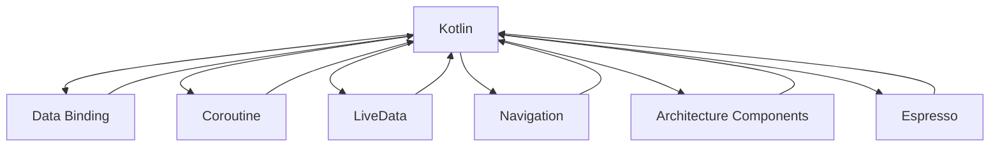

                 

# Android Jetpack：谷歌的 Android 开发套件

> 关键词：Android Jetpack, Kotlin, Data Binding, Coroutine, LiveData, Navigation, Architecture Components, Espresso

## 1. 背景介绍

### 1.1 问题由来
Android Jetpack是谷歌推出的一套基于Kotlin的Android应用开发框架。它包含了各种常用的开发工具和最佳实践，旨在帮助开发者构建稳定、高效、可维护的Android应用程序。然而，由于Android Jetpack的理念和实施方式与传统的基于XML的Android开发范式有很大差异，许多开发者在使用过程中感到困惑和疑虑。本文将详细介绍Android Jetpack的核心概念和最佳实践，帮助开发者深入理解其设计和应用，并展示其在实际开发中的应用场景。

## 2. 核心概念与联系

### 2.1 核心概念概述

为了更好地理解Android Jetpack，首先需要明确几个关键概念：

- **Kotlin**：Android Jetpack的开发语言，是一种基于Java平台的静态类型编程语言，具有简洁、安全、可读性高的特点。
- **Data Binding**：用于将XML布局与Java代码绑定的技术，使得布局代码可被Kotlin语言直接操作。
- **Coroutine**：一种轻量级异步编程模型，用于简化异步任务的管理和执行。
- **LiveData**：一种生命周期感知的响应式数据模型，用于在组件间传递数据。
- **Navigation**：用于管理应用内的路由和导航，方便处理用户界面的跳转和交互。
- **Architecture Components**：一系列组件化的架构工具，帮助构建清晰、解耦的应用层结构。
- **Espresso**：Android的UI测试框架，用于自动化测试用户界面组件。

这些概念构成了Android Jetpack的核心框架，通过合理应用，能够提升开发效率，简化应用维护，确保应用质量。

### 2.2 核心概念原理和架构的 Mermaid 流程图



该流程图展示了各核心概念之间的关系：Kotlin是Android Jetpack的开发语言和基础，其他概念都是基于Kotlin构建的。每个概念都可以看作Kotlin的一个扩展或增强。

## 3. 核心算法原理 & 具体操作步骤

### 3.1 算法原理概述

Android Jetpack的核心设计思想是通过模块化和组件化，将开发任务分解为独立且可重用的组件，从而简化开发和维护。这使得开发者可以专注于业务逻辑的实现，而无需过多关注框架层面的复杂性。

以Data Binding为例，其原理是将XML布局文件转换为Java代码，使得布局文件可以像普通Java对象一样进行操作和修改，简化了布局与代码的同步和维护工作。

### 3.2 算法步骤详解

以Data Binding为例，其具体操作步骤如下：

1. 在项目的`build.gradle`文件中添加依赖：
   ```groovy
   dependencies {
       implementation 'com.android.bindings:android-binding:2.1.0'
       implementation 'com.android.bindings:android-data:2.1.0'
   }
   ```

2. 在Java类中声明Data Binding对象：
   ```java
   private lateinit var binding: ViewBinding
   ```

3. 在布局文件中添加数据绑定声明：
   ```xml
   <?xml version="1.0" encoding="utf-8"?>
   <androidx.data.widget.DataBinding xmlns:android="http://schemas.android.com/apk/res/android"
       xmlns:tools="http://schemas.android.com/tools"
       xmlns:app="http://schemas.android.com/apk/res-auto"
       tools:context=".MainActivity">

       <RelativeLayout xmlns:android="http://schemas.android.com/apk/res/android"
           android:layout_width="match_parent"
           android:layout_height="match_parent"
           android:background="@color/background">

           <TextView
               android:id="@+id/textView"
               android:layout_width="wrap_content"
               android:layout_height="wrap_content"
               android:text="Hello World!"
               app:layout_constraintTop_toTopOf="parent"
               app:layout_constraintBottom_toBottomOf="parent"
               app:layout_constraintLeft_toLeftOf="parent"
               app:layout_constraintRight_toRightOf="parent" />

           <Button
               android:id="@+id/button"
               android:layout_width="wrap_content"
               android:layout_height="wrap_content"
               android:text="Click Me!"
               app:layout_constraintTop_toTopOf="parent"
               app:layout_constraintBottom_toBottomOf="parent"
               app:layout_constraintLeft_toLeftOf="parent"
               app:layout_constraintRight_toRightOf="parent" />
       </RelativeLayout>

   </androidx.data.widget.DataBinding>
   ```

4. 在Java类中初始化Data Binding对象：
   ```java
   override fun onViewCreated(view: View, savedInstanceState: Bundle?) {
       binding = view as ViewBinding
   }
   ```

5. 在Java类中通过Data Binding对象访问布局元素：
   ```java
   binding.textView.text = "New Text"
   binding.button.setOnClickListener { view ->
       binding.textView.text = "Button Clicked!"
   }
   ```

通过以上步骤，即可实现布局文件与Java代码的自动绑定，简化了布局与代码的同步和维护工作。

### 3.3 算法优缺点

**优点**：
- 提高了开发效率，简化了布局与代码的同步工作。
- 支持Kotlin语言，使得开发过程更加直观和简洁。
- 增强了布局的可读性和维护性。

**缺点**：
- 需要一定的学习成本，尤其是对于不熟悉Kotlin或XML布局的开发者。
- 可能导致布局文件的冗余，需要在一定程度上进行代码优化。

### 3.4 算法应用领域

Android Jetpack的各个核心概念在Android应用开发中都有广泛应用，以下列举几个主要领域：

1. **Kotlin语言**：Kotlin已成为Android开发的主流语言，具有简洁、安全、可读性高的特点，广泛应用于Android UI、服务、库、扩展等各个环节。

2. **Data Binding**：广泛应用于MVVM模式的布局与数据绑定，提升应用的可维护性和可读性。

3. **Coroutine**：用于简化异步任务的执行和管理，特别是在UI线程中执行异步任务时，可以避免常见的线程安全问题。

4. **LiveData**：用于在组件间传递数据，支持生命周期感知的响应式更新，广泛应用于UI组件和业务逻辑的交互。

5. **Navigation**：用于管理应用内的路由和导航，特别是对于复杂的应用结构和用户界面交互，可以大大简化开发和维护工作。

6. **Architecture Components**：提供了各种架构工具，如Repository、ViewModel、Data Store等，帮助构建清晰、解耦的应用层结构。

7. **Espresso**：用于自动化测试用户界面组件，可以大幅提升测试效率和质量，特别是在UI界面复杂的场景下。

## 4. 数学模型和公式 & 详细讲解 & 举例说明

### 4.1 数学模型构建

由于Android Jetpack的核心概念主要涉及编程和设计范式，不涉及具体的数学模型，因此本节不做详细讲解。

### 4.2 公式推导过程

同上，不涉及数学公式推导。

### 4.3 案例分析与讲解

以MVVM模式为例，其核心思想是将业务逻辑与UI分离，通过ViewModel和LiveData实现数据绑定和状态管理。

1. 定义ViewModel对象，用于封装业务逻辑：
   ```kotlin
   class MyViewModel : ViewModel() {
       private val name = MutableLiveData<String>()

       fun getName(): LiveData<String> {
           return name
       }

       fun setName(value: String) {
           name.value = value
       }
   }
   ```

2. 在Activity或Fragment中创建ViewModel对象，并绑定UI组件：
   ```kotlin
   val viewModel: MyViewModel by viewModels()

   binding.textView.text = viewModel.getName().value
   viewModel.setName("New Text")
   ```

通过以上步骤，即可实现ViewModel与UI组件的解耦，使得业务逻辑和UI显示分离，提升了应用的可维护性和可读性。

## 5. 项目实践：代码实例和详细解释说明

### 5.1 开发环境搭建

1. 安装Android Studio：从官网下载安装包，按照提示完成安装。
2. 创建新项目：打开Android Studio，选择"Start a new Android Studio project"，填写项目信息，选择Kotlin作为开发语言。
3. 添加依赖：在`build.gradle`文件中添加Android Jetpack的依赖，如Data Binding、LiveData、Navigation等。

### 5.2 源代码详细实现

以下是一个简单的Android Jetpack应用示例，展示Data Binding和ViewModel的使用：

1. 创建布局文件，定义UI组件：
   ```xml
   <?xml version="1.0" encoding="utf-8"?>
   <androidx.data.widget.DataBinding xmlns:android="http://schemas.android.com/apk/res/android"
       xmlns:tools="http://schemas.android.com/tools"
       xmlns:app="http://schemas.android.com/apk/res-auto"
       tools:context=".MainActivity">

       <RelativeLayout xmlns:android="http://schemas.android.com/apk/res/android"
           android:layout_width="match_parent"
           android:layout_height="match_parent"
           android:background="@color/background">

           <TextView
               android:id="@+id/textView"
               android:layout_width="wrap_content"
               android:layout_height="wrap_content"
               android:text="Hello World!"
               app:layout_constraintTop_toTopOf="parent"
               app:layout_constraintBottom_toBottomOf="parent"
               app:layout_constraintLeft_toLeftOf="parent"
               app:layout_constraintRight_toRightOf="parent" />

           <Button
               android:id="@+id/button"
               android:layout_width="wrap_content"
               android:layout_height="wrap_content"
               android:text="Click Me!"
               app:layout_constraintTop_toTopOf="parent"
               app:layout_constraintBottom_toBottomOf="parent"
               app:layout_constraintLeft_toLeftOf="parent"
               app:layout_constraintRight_toRightOf="parent" />
       </RelativeLayout>

   </androidx.data.widget.DataBinding>
   ```

2. 创建ViewModel对象，实现数据绑定和状态管理：
   ```kotlin
   class MyViewModel : ViewModel() {
       private val name = MutableLiveData<String>()

       fun getName(): LiveData<String> {
           return name
       }

       fun setName(value: String) {
           name.value = value
       }
   }
   ```

3. 在Activity中初始化Data Binding对象，并绑定UI组件：
   ```kotlin
   class MainActivity : AppCompatActivity() {

       private lateinit var binding: ViewBinding

       override fun onCreate(savedInstanceState: Bundle?) {
           super.onCreate(savedInstanceState)
           setContentView(R.layout.activity_main)

           binding = ViewBinding.inflate(layoutInflater)
           setContentView(binding.root)

           val viewModel: MyViewModel by viewModels()

           binding.textView.text = viewModel.getName().value
           binding.button.setOnClickListener { view ->
               binding.textView.text = "Button Clicked!"
           }
       }
   }
   ```

通过以上步骤，即可实现一个简单的Android Jetpack应用，展示Data Binding和ViewModel的使用。

### 5.3 代码解读与分析

Data Binding和ViewModel是Android Jetpack中两个核心的设计模式，用于简化UI组件和业务逻辑的分离和维护。

1. **Data Binding**：通过将XML布局文件转换为Java代码，实现了布局与代码的自动绑定，简化了UI组件的初始化和绑定过程。
2. **ViewModel**：通过将业务逻辑封装为LiveData，实现了状态管理和数据绑定，使得UI组件与业务逻辑分离，提升了应用的可维护性和可读性。

这些核心设计模式在实际开发中被广泛应用，是Android Jetpack的核心优势之一。

### 5.4 运行结果展示

运行以上代码，可以看到一个简单的Android应用界面，包含一个TextView和一个Button。点击Button后，TextView的内容会更新为"Button Clicked!"。

## 6. 实际应用场景

### 6.1 智能推荐系统

智能推荐系统是Android Jetpack在实际应用中的一个典型场景。通过使用Data Binding和ViewModel，可以实现推荐数据与UI组件的自动绑定，简化推荐算法的实现和维护。

1. 通过Data Binding将推荐数据展示在UI组件中，如RecyclerView。
2. 使用ViewModel封装推荐算法和数据管理，实现业务逻辑与UI的解耦。
3. 通过LiveData实时更新推荐数据，提升推荐算法的响应速度和准确性。

通过以上步骤，即可构建一个高效的智能推荐系统。

### 6.2 社交应用

社交应用是Android Jetpack在实际应用中的另一个典型场景。通过使用Navigation和Architecture Components，可以实现复杂应用结构和用户界面交互的简化和维护。

1. 使用Navigation管理应用内的路由和导航，方便处理用户界面的跳转和交互。
2. 通过Repository和ViewModel封装数据管理和服务逻辑，实现业务逻辑与UI的解耦。
3. 使用Architecture Components提供各种组件化的架构工具，提升应用的可维护性和可读性。

通过以上步骤，即可构建一个稳定、高效、可维护的社交应用。

## 7. 工具和资源推荐

### 7.1 学习资源推荐

1. **Android Jetpack官方文档**：提供了Android Jetpack的详细使用指南和示例代码。
2. **《Android Jetpack实战》书籍**：介绍了Android Jetpack的核心概念和最佳实践，适合有一定Android开发经验的开发者阅读。
3. **《Kotlin for Android Developers》书籍**：介绍了Kotlin在Android开发中的应用，适合初学者阅读。
4. **Android Developers官方博客**：提供了Android Jetpack的最新更新和最佳实践。
5. **Kotlin官方文档**：提供了Kotlin的详细使用指南和示例代码。

### 7.2 开发工具推荐

1. **Android Studio**：Android官方提供的IDE，提供了丰富的开发工具和调试功能。
2. **Espresso**：Android的UI测试框架，用于自动化测试用户界面组件。
3. **JUnit**：Android的单元测试框架，用于编写和运行单元测试。
4. **ProGuard**：Android的代码优化工具，用于优化应用代码和资源。
5. **Lint**：Android的代码分析工具，用于检查代码中的潜在问题和错误。

### 7.3 相关论文推荐

1. **《Android Jetpack: A comprehensive overview》**：介绍了Android Jetpack的核心概念和最佳实践，适合开发者阅读。
2. **《Kotlin and the Future of Android Development》**：介绍了Kotlin在Android开发中的应用，适合初学者阅读。
3. **《Data Binding: The Future of Android Development》**：介绍了Data Binding在Android开发中的应用，适合开发者阅读。
4. **《Coroutines for Android: A modern approach to asynchronous programming》**：介绍了Coroutine在Android开发中的应用，适合开发者阅读。
5. **《Reacting to Changes in LiveData》**：介绍了LiveData的用法和最佳实践，适合开发者阅读。

## 8. 总结：未来发展趋势与挑战

### 8.1 总结

本文对Android Jetpack的核心概念和最佳实践进行了系统介绍。通过详细讲解Data Binding、ViewModel、Coroutine、LiveData、Navigation等核心概念的原理和操作步骤，展示了其在工作中的应用场景。

Android Jetpack通过模块化和组件化，将开发任务分解为独立且可重用的组件，从而简化开发和维护。这使得开发者可以专注于业务逻辑的实现，而无需过多关注框架层面的复杂性。

### 8.2 未来发展趋势

展望未来，Android Jetpack将继续推动Android开发的规范化和技术演进。以下是几个可能的未来发展趋势：

1. **更强的跨平台支持**：Android Jetpack将逐渐支持跨平台开发，使得开发者可以在一个IDE中同时开发Android和iOS应用。
2. **更丰富的架构组件**：Android Jetpack将不断引入新的架构组件，进一步简化开发和维护工作。
3. **更高效的开发工具**：Android Jetpack将引入更高效的工具，如代码生成器、自动化测试工具等，提升开发效率。
4. **更强大的数据支持**：Android Jetpack将引入更强大的数据支持，如NoSQL数据库、大数据分析工具等，提升应用的数据处理能力。
5. **更灵活的开发环境**：Android Jetpack将引入更灵活的开发环境，如云开发、混合开发等，提升开发效率和应用体验。

### 8.3 面临的挑战

尽管Android Jetpack已经在Android开发中取得了显著成就，但仍面临一些挑战：

1. **学习成本高**：Android Jetpack的概念和范式与传统的Android开发范式有很大差异，需要一定的学习成本。
2. **兼容性问题**：部分老旧设备可能不支持Android Jetpack中的某些特性，需要考虑兼容性问题。
3. **性能优化问题**：部分应用场景下，Android Jetpack的性能可能略低于传统的Android开发范式，需要进一步优化。
4. **生态系统问题**：Android Jetpack的生态系统尚在发展中，部分库和组件的稳定性有待提升。

### 8.4 研究展望

为了应对上述挑战，未来的Android Jetpack研究需要重点关注以下几个方向：

1. **简化学习曲线**：进一步简化Android Jetpack的学习曲线，提升开发者对新概念和范式的接受度。
2. **优化兼容性**：提升Android Jetpack在不同设备和平台上的兼容性，确保应用在老旧设备上也能正常运行。
3. **提升性能**：优化Android Jetpack中的性能问题，提升应用的响应速度和稳定性。
4. **丰富生态系统**：进一步丰富Android Jetpack的生态系统，提升库和组件的稳定性和使用体验。
5. **引入更多功能**：引入更多功能，如更强大的数据支持、更灵活的开发环境等，提升开发效率和应用体验。

## 9. 附录：常见问题与解答

**Q1：Android Jetpack与传统Android开发范式有何不同？**

A: Android Jetpack通过模块化和组件化，将开发任务分解为独立且可重用的组件，从而简化开发和维护。相比传统的XML布局和Activity、Fragment等组件，Android Jetpack更强调业务逻辑和UI的分离，使得开发者可以专注于业务逻辑的实现，而无需过多关注框架层面的复杂性。

**Q2：Android Jetpack中LiveData和Observer有何不同？**

A: LiveData是Android Jetpack中的一种生命周期感知的响应式数据模型，用于在组件间传递数据。Observer是Java中的观察者模式，用于在数据模型发生变化时通知观察者。LiveData基于Observer实现，并提供了更强的生命周期管理，能够在Activity、Fragment等组件的生命周期变化时自动管理数据的订阅和取消。

**Q3：Android Jetpack中ViewModel和Activity、Fragment有何不同？**

A: ViewModel是Android Jetpack中的一种用于封装业务逻辑的组件，用于实现数据管理、状态管理等功能。Activity和Fragment是传统的Android开发范式中的组件，用于管理用户界面和用户交互。ViewModel与Activity、Fragment相比，更强调业务逻辑和UI的分离，使得开发者可以专注于业务逻辑的实现，而无需过多关注UI组件的实现细节。

**Q4：Android Jetpack中Coroutine和AsyncTask有何不同？**

A: Coroutine是Android Jetpack中的一种异步编程模型，用于简化异步任务的执行和管理。AsyncTask是传统的Android开发范式中的异步任务管理方式，用于在后台线程中执行异步任务。Coroutine相比AsyncTask，更简洁、更灵活，可以通过多个Coroutine同步执行多个异步任务，避免了传统的回调链带来的复杂性和易出错性。

**Q5：Android Jetpack中Navigation和Intent有何不同？**

A: Navigation是Android Jetpack中的一种用于管理应用内路由和导航的组件，用于简化用户界面的跳转和交互。Intent是Android开发中的传统组件，用于在组件间传递数据和启动新的Activity或Service。Navigation相比Intent，更简洁、更灵活，能够自动处理路由的跳转和回退，避免了Intent在路由管理中的复杂性和易出错性。

通过以上附录，可以帮助开发者更好地理解Android Jetpack的核心概念和最佳实践，并解决实际开发中遇到的问题。

