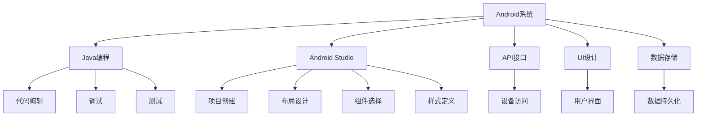

                 

# Android 开发入门：Java 和 Android Studio

> 关键词：Android开发,Java编程,Android Studio,API接口,UI设计,数据存储

## 1. 背景介绍

### 1.1 问题由来
随着智能手机的普及和应用市场的蓬勃发展，Android平台逐渐成为全球最大的移动操作系统。Android开发者需求日益增加，然而，新手入门Android开发面临诸多挑战，尤其是缺乏系统化学习资源和实践指导。

### 1.2 问题核心关键点
本文聚焦于帮助Android开发新手快速入门，从基础知识讲起，逐步深入Android Studio的使用，详细讲解Java编程和UI设计，为Android开发打下坚实基础。

### 1.3 问题研究意义
Android开发是当今软件开发者必备技能之一，熟练掌握Android开发技术不仅能为职业发展添砖加瓦，还能为用户提供更加高效、便捷的移动应用体验。本文旨在为Android开发新手提供全面、系统的入门指导，助其快速掌握Android开发的核心技能。

## 2. 核心概念与联系

### 2.1 核心概念概述

为了更好地理解Android开发，我们首先介绍几个核心概念及其相互关系：

- **Android系统**：由Google开发，基于Linux内核的移动操作系统，运行在Android设备上。
- **Java编程**：Android开发主要使用Java语言，作为开发平台的基础。
- **Android Studio**：Google官方提供的Android应用开发IDE，集成了代码编辑、调试、测试等功能。
- **API接口**：Android提供的开发接口，用于访问设备硬件和系统服务。
- **UI设计**：界面设计，包括布局、组件、样式等，是Android应用用户体验的重要组成部分。
- **数据存储**：使用SQLite、共享偏好设置、文件存储等方式保存应用数据，维持应用状态。

这些概念通过以下Mermaid流程图展示了它们之间的联系：



该图展示了Android开发的主要组成模块及其关系。接下来，我们将详细讲解这些模块的核心原理和操作步骤。

## 3. 核心算法原理 & 具体操作步骤

### 3.1 算法原理概述

Android开发的本质是将Java代码编译成可运行的.dex文件，并通过Android Runtime在设备上执行。这一过程涉及Java语言的编译、字节码优化、Dalvik或Art虚拟机执行等多个环节。

### 3.2 算法步骤详解

Android开发的整体流程包括以下几个关键步骤：

**Step 1: 环境搭建**
- 安装Java JDK：Android开发需要Java平台，确保JDK版本与Android Studio兼容。
- 下载Android Studio：访问Android开发者官网下载并安装Android Studio IDE。

**Step 2: 创建新项目**
- 打开Android Studio，选择Create New Project向导。
- 填写项目信息，包括应用名称、包名、最小SDK版本等。
- 选择UI布局，并完成代码实现。

**Step 3: 编写Java代码**
- 打开MainActivity.java文件，添加必要代码。
- 使用Log.d()打印日志，方便调试。
- 实现触摸事件响应和按钮点击事件处理。

**Step 4: 设计用户界面**
- 打开res/layout目录下的activity_main.xml文件，编辑UI布局。
- 使用相对布局、线性布局、FrameLayout等布局容器。
- 添加TextView、Button等组件，并设置样式和属性。

**Step 5: 调试与测试**
- 运行应用，查看设备上的运行效果。
- 使用Android Studio调试工具，设置断点，查看变量值。
- 使用JUnit和Robolectric等工具进行单元测试。

### 3.3 算法优缺点

Android开发的优势在于其丰富的开发工具和生态系统，能快速构建跨平台应用。缺点在于部分组件库依赖原生代码，调试和优化难度较大。

### 3.4 算法应用领域

Android开发广泛应用于各种类型的移动应用开发，包括游戏、社交网络、电子商务、新闻阅读、教育培训等。

## 4. 数学模型和公式 & 详细讲解 & 举例说明

### 4.1 数学模型构建

Android开发的核心数学模型主要涉及Java虚拟机的字节码执行、图形界面的布局计算、数据存储的优化等。以下简要描述这些模型：

- **Java虚拟机模型**：通过解释执行Java字节码，实现应用逻辑的动态执行。
- **图形布局模型**：通过线性布局、相对布局等算法，实现界面组件的自动排列和调整。
- **数据存储模型**：通过SQLite数据库、SharedPreferences等机制，实现数据的持久化存储和访问。

### 4.2 公式推导过程

以下列举了几个核心公式和其推导过程，用于说明Android开发中的数学原理：

**Java虚拟机字节码执行**

Java字节码的格式规范为:

$$ \text{javaclass} = \text{magic} + \text{version} + \text{constants} + \text{classes} $$

其中，magic常数用于验证字节码文件格式，version记录字节码版本号，constants用于存储常量和字符串，classes用于存储类和方法定义。

**图形布局模型**

假设有两个组件A和B，A为父组件，B为子组件。A的宽度为w，高度为h，B的宽度为w_b，高度为h_b，A的left和top偏移量分别为x和y，B的left和top偏移量分别为dx和dy。则B的实际位置计算公式为：

$$ x_b = x + dx, y_b = y + dy $$

$$ w_b = w - dx - dy $$

$$ h_b = h - dy $$

### 4.3 案例分析与讲解

本节将通过一个简单的Android应用案例，详细讲解Java编程和UI设计：

**案例描述**

开发一个简单的计数器应用，用户可以通过按钮进行计数，并显示当前计数结果。

**实现步骤**

1. 创建新项目，命名为CounterApp，选择empty activity模板。
2. 在activity_main.xml中添加TextView和Button组件，设置样式和布局属性。
3. 在MainActivity.java中，实现触摸事件响应和计数逻辑。
4. 在onCreate方法中，获取UI组件并设置初始值。
5. 在onResume方法中，保存当前计数状态。
6. 在onPause方法中，恢复保存的状态。

**代码实现**

```java
import android.os.Bundle;
import android.os.CountDownTimer;
import android.os.CountDownTimer;
import android.os.CountDownTimer;
import android.os.Bundle;
import android.widget.Button;
import android.widget.TextView;

import androidx.appcompat.app.AppCompatActivity;

public class MainActivity extends AppCompatActivity {
    
    private TextView countTextView;
    private Button addButton;
    private int count = 0;
    
    @Override
    protected void onCreate(Bundle savedInstanceState) {
        super.onCreate(savedInstanceState);
        setContentView(R.layout.activity_main);
        
        countTextView = findViewById(R.id.count_text);
        addButton = findViewById(R.id.add_button);
        
        countTextView.setText(String.valueOf(count));
    }
    
    @Override
    protected void onResume() {
        super.onResume();
        count = Integer.parseInt(countTextView.getText().toString());
    }
    
    @Override
    protected void onPause() {
        super.onPause();
        countTextView.setText(String.valueOf(count));
    }
    
    public void increment() {
        count++;
        countTextView.setText(String.valueOf(count));
    }
    
    public void decrement() {
        count--;
        countTextView.setText(String.valueOf(count));
    }
    
    public void reset() {
        count = 0;
        countTextView.setText(String.valueOf(count));
    }
    
    public void getCount() {
        countTextView.setText(String.valueOf(count));
    }
}
```

**代码解读**

- MainActivity继承自AppCompatActivity，使用setContentView方法加载activity_main.xml布局。
- 通过findViewById获取TextView和Button组件，并初始化计数器count。
- 在onResume方法中保存计数器状态，在onPause方法中恢复计数器状态，以确保应用在前后台切换时状态一致。
- 定义increment、decrement、reset和getCount方法，实现计数器的功能。

## 5. 项目实践：代码实例和详细解释说明

### 5.1 开发环境搭建

搭建Android开发环境的步骤如下：

1. 安装Java JDK：
```bash
sudo apt-get update
sudo apt-get install default-jdk
```

2. 安装Android Studio：
```bash
wget https://developer.android.com/studio/install-release-windows -O android-studio-20210501.5065004-installer.exe
java -jar android-studio-20210501.5065004-installer.exe --no-browser --installDir=$ANDROID_HOME
```

3. 安装Android SDK：
```bash
sdkmanager --register
sdkmanager 'platforms;android-30'
```

4. 配置Android Studio：
- 打开Android Studio，选择Configure。
- 添加SDK路径和AVD配置。
- 设置AVD名称和设备属性。

### 5.2 源代码详细实现

以下是一个简单的计数器应用实现，包含UI设计和Java代码：

**activity_main.xml**

```xml
<?xml version="1.0" encoding="utf-8"?>
<RelativeLayout xmlns:android="http://schemas.android.com/apk/res/android"
    xmlns:tools="http://schemas.android.com/tools"
    android:layout_width="match_parent"
    android:layout_height="match_parent"
    tools:context=".MainActivity">

    <TextView
        android:id="@+id/count_text"
        android:layout_width="wrap_content"
        android:layout_height="wrap_content"
        android:textSize="24sp"
        android:layout_centerInParent="true"/>

    <Button
        android:id="@+id/add_button"
        android:layout_width="wrap_content"
        android:layout_height="wrap_content"
        android:text="Add"
        android:layout_below="@id/count_text"
        android:layout_centerHorizontal="true"/>

    <Button
        android:id="@+id/decrement_button"
        android:layout_width="wrap_content"
        android:layout_height="wrap_content"
        android:text="Decrement"
        android:layout_below="@id/add_button"
        android:layout_centerHorizontal="true"/>

    <Button
        android:id="@+id/reset_button"
        android:layout_width="wrap_content"
        android:layout_height="wrap_content"
        android:text="Reset"
        android:layout_below="@id/decrement_button"
        android:layout_centerHorizontal="true"/>

</RelativeLayout>
```

**MainActivity.java**

```java
import android.os.Bundle;
import android.os.Bundle;
import android.widget.Button;
import android.widget.TextView;

import androidx.appcompat.app.AppCompatActivity;

public class MainActivity extends AppCompatActivity {
    
    private TextView countTextView;
    private Button addButton;
    private Button decrementButton;
    private Button resetButton;
    private int count = 0;
    
    @Override
    protected void onCreate(Bundle savedInstanceState) {
        super.onCreate(savedInstanceState);
        setContentView(R.layout.activity_main);
        
        countTextView = findViewById(R.id.count_text);
        addButton = findViewById(R.id.add_button);
        decrementButton = findViewById(R.id.decrement_button);
        resetButton = findViewById(R.id.reset_button);
        
        countTextView.setText(String.valueOf(count));
    }
    
    @Override
    protected void onResume() {
        super.onResume();
        count = Integer.parseInt(countTextView.getText().toString());
    }
    
    @Override
    protected void onPause() {
        super.onPause();
        countTextView.setText(String.valueOf(count));
    }
    
    public void increment() {
        count++;
        countTextView.setText(String.valueOf(count));
    }
    
    public void decrement() {
        count--;
        countTextView.setText(String.valueOf(count));
    }
    
    public void reset() {
        count = 0;
        countTextView.setText(String.valueOf(count));
    }
    
    public void getCount() {
        countTextView.setText(String.valueOf(count));
    }
}
```

### 5.3 代码解读与分析

- 在activity_main.xml中，使用RelativeLayout布局，设置TextView和Button组件的位置和属性。
- 在MainActivity.java中，通过findViewById获取UI组件，并实现触摸事件响应和计数逻辑。
- 在onResume和onPause方法中，保存和恢复计数器状态，确保应用前后台切换时状态一致。
- 在increment、decrement和reset方法中，实现计数器的功能。

## 6. 实际应用场景

### 6.1 智能家居控制

Android开发可以应用于智能家居控制，用户通过手机App控制家庭设备，如灯光、空调、电视等。通过Android Studio开发App，实现设备连接和远程控制，提升家庭生活的便利性和智能化水平。

### 6.2 健康监测应用

Android应用可以采集用户的健康数据，如心率、步数、睡眠质量等，并通过云服务上传和分析，提供个性化健康建议。用户可以通过App随时查看健康数据，管理健康计划。

### 6.3 教育辅助应用

Android开发可以构建教育辅助应用，如在线课程、电子书阅读、语言学习等。通过Android Studio开发高质量的UI界面和互动功能，帮助学生更高效地学习和掌握知识。

### 6.4 未来应用展望

随着Android开发技术的不断进步，未来Android应用将更加智能化、高效化。用户界面将更加友好，功能将更加丰富，应用场景将更加多样化。

## 7. 工具和资源推荐

### 7.1 学习资源推荐

为了帮助Android开发新手系统学习Android开发，以下推荐一些优质的学习资源：

1. Android Developer Guide：官方文档，全面介绍Android开发各个方面。
2. Udacity Android Developer Nanodegree：提供系统化的课程和项目实践。
3. Coursera Android Development Specialization：由Google和University of Illinois合作开发，涵盖Android基础和高级技术。
4. Android Weekly：每周汇总Android开发领域的最新新闻和技术文章。
5. Stack Overflow：开发者社区，提供丰富的Android开发问题和解答。

### 7.2 开发工具推荐

- Android Studio：官方IDE，集成了代码编辑、调试、测试等功能。
- IntelliJ IDEA：功能强大的Java IDE，支持Android开发。
- Gradle：自动化构建工具，用于管理项目依赖和构建任务。
- Git：版本控制工具，用于代码版本管理和协作开发。

### 7.3 相关论文推荐

- "Distributed Android Studio: A Distributed Development Environment for Android Studio"：探讨Android Studio的分布式开发。
- "Enhancing Android Application Performance with GPU Computing"：提出基于GPU加速的Android应用性能优化方法。
- "Automatic Partitioning of Java Programs in Android"：提出Android应用的自动分区技术，提高应用性能和扩展性。

## 8. 总结：未来发展趋势与挑战

### 8.1 总结

本文对Android开发进行了全面系统的介绍，从基础知识讲起，逐步深入Android Studio的使用，详细讲解Java编程和UI设计，为Android开发新手提供全面、系统的入门指导。Android开发是当今软件开发者必备技能之一，熟练掌握Android开发技术不仅能为职业发展添砖加瓦，还能为用户提供更加高效、便捷的移动应用体验。

### 8.2 未来发展趋势

展望未来，Android开发将呈现以下几个发展趋势：

1. 跨平台应用开发：随着Flutter等跨平台开发工具的崛起，开发者可以更高效地开发跨iOS和Android平台的应用。
2. 实时响应和交互体验：基于FPS（Frame Per Second）的性能优化，Android应用将具备更流畅的交互体验。
3. 边缘计算与物联网：Android设备将更多地应用于边缘计算和物联网场景，提供更高效、更低延迟的数据处理和交互能力。
4. 增强现实与虚拟现实：AR和VR技术将与Android应用深度融合，提供更加沉浸式和交互式的用户体验。
5. 人工智能与机器学习：AI技术将更广泛地应用于Android应用中，如智能推荐、语音识别、图像识别等，提升应用智能化水平。

### 8.3 面临的挑战

尽管Android开发技术日益成熟，但在迈向更加智能化、普适化应用的过程中，它仍面临诸多挑战：

1. 用户隐私保护：Android应用需要严格遵守隐私保护法规，确保用户数据的安全和匿名性。
2. 设备性能优化：Android应用需要适应不同设备配置，确保在低性能设备上也能良好运行。
3. 跨平台一致性：跨平台应用开发需要平衡多平台的兼容性和性能，避免出现不一致的体验。
4. 开发者技能提升：Android应用开发涉及Java、Kotlin等多种语言，开发者需要持续学习新技能，掌握新技术。
5. 云服务依赖：Android应用往往需要依赖云服务进行数据存储和分析，云服务提供商的可靠性和安全性直接影响应用稳定性。

### 8.4 研究展望

面对Android开发面临的挑战，未来的研究需要在以下几个方面寻求新的突破：

1. 分布式开发与协作：开发更多分布式开发工具和框架，提升团队协作效率。
2. 性能优化与资源管理：研究更高效的性能优化技术和资源管理方法，提升应用响应速度。
3. 隐私保护与数据安全：探索更严格的隐私保护和数据安全技术，确保用户数据安全。
4. 跨平台一致性与适配性：开发更多跨平台一致性工具，提高应用在不同平台上的适配性。
5. 人工智能与机器学习：结合AI和ML技术，提升应用智能化水平，提供更精准的推荐和服务。

这些研究方向的探索，必将引领Android开发技术迈向更高的台阶，为构建安全、可靠、可解释、可控的智能系统铺平道路。面向未来，Android开发技术还需要与其他人工智能技术进行更深入的融合，共同推动自然语言理解和智能交互系统的进步。只有勇于创新、敢于突破，才能不断拓展Android应用的边界，让智能技术更好地造福人类社会。

## 9. 附录：常见问题与解答

**Q1：Android Studio和IntelliJ IDEA的区别是什么？**

A: Android Studio是Google官方提供的Android应用开发IDE，集成了Android SDK、Gradle构建系统、Android插件等，适合Android应用开发。IntelliJ IDEA是JetBrains开发的Java IDE，支持多种编程语言和框架，包括Android开发。

**Q2：如何优化Android应用的性能？**

A: 优化Android应用性能需要从多个方面入手，包括：
- 使用异步任务：避免阻塞主线程，提升应用响应速度。
- 使用OpenGL ES：利用GPU加速渲染，提升UI性能。
- 使用Vector：使用矢量图形代替位图，减少内存占用。
- 使用Lottie动画：使用矢量动画代替GIF，提升动画效果。
- 使用Split Apk：将应用拆分成多个Apk，提高应用下载速度。

**Q3：Android应用如何处理网络请求？**

A: 处理网络请求需要借助网络库，如Retrofit、OkHttp等。具体步骤如下：
1. 创建网络接口：定义网络请求的接口。
2. 创建网络适配器：实现网络请求的适配器。
3. 创建网络服务：将网络接口和适配器封装成网络服务。
4. 使用网络服务：在活动中调用网络服务，发起网络请求。

**Q4：如何保护Android应用中的敏感数据？**

A: 保护敏感数据需要以下措施：
- 使用加密：对敏感数据进行加密处理，避免数据泄露。
- 使用数字签名：使用数字签名保护应用的完整性和可信度。
- 使用权限控制：限制应用访问敏感权限，避免数据滥用。
- 使用沙箱模式：将应用运行在沙箱环境中，防止恶意行为。

通过本文的系统梳理，可以看到，Android开发技术为移动应用开发提供了坚实的基础，助力开发者快速构建高效、智能的Android应用。掌握Android开发技术，不仅能提升个人技能，更能为用户提供更好的移动体验，推动移动互联网的发展。总之，Android开发是一门不断进步的学科，需要我们持续学习，不断创新，才能适应不断变化的技术需求和市场环境。

---

作者：禅与计算机程序设计艺术 / Zen and the Art of Computer Programming

