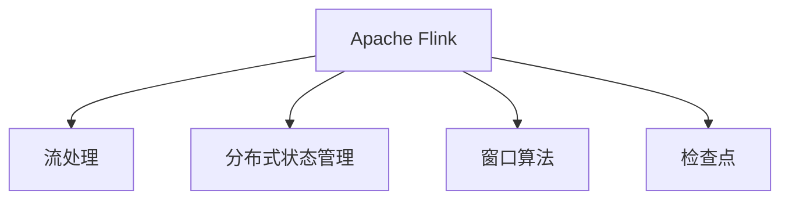
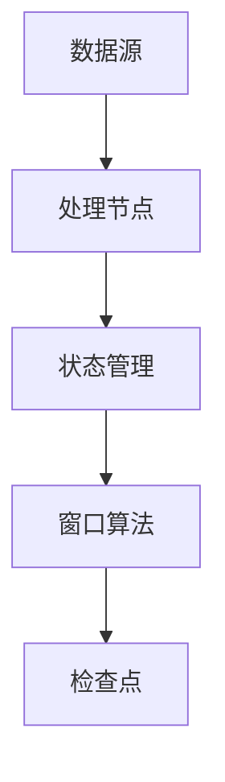

                 

# Apache Flink：实时大数据处理框架

## 1. 背景介绍

### 1.1 问题由来
随着互联网和物联网的迅猛发展，全球产生了海量的数据。传统的数据处理方式已无法满足快速实时处理的需求。因此，实时数据处理技术逐渐成为业界关注的焦点。

在这个背景下，Apache Flink应运而生。Flink是一个开源的分布式流处理框架，能够高效地处理实时数据流，支持低延迟、高吞吐量和分布式状态管理。本文将系统性地介绍Apache Flink的核心原理、核心概念及其实际应用。

### 1.2 问题核心关键点
Apache Flink主要解决了以下几个关键问题：
- **低延迟**：采用流处理模型，能够快速处理实时数据。
- **高吞吐量**：通过并行化处理，支持大规模数据的实时处理。
- **分布式状态管理**：支持高效的分布式状态管理和故障恢复。
- **应用广泛**：广泛适用于金融、电商、交通、医疗等各个领域。

这些特性使得Apache Flink成为处理实时数据的利器。

## 2. 核心概念与联系

### 2.1 核心概念概述

为了更好地理解Apache Flink，本节将介绍几个核心的概念：

- **Apache Flink**：开源的流处理框架，能够处理实时数据流，支持低延迟、高吞吐量和分布式状态管理。
- **流处理**：处理实时数据流，能够快速响应数据变化。
- **分布式状态管理**：在分布式环境中，保持状态的同步和一致。
- **窗口算法**：对数据进行分组、聚合等操作，支持流处理。
- **检查点**：通过定期保存状态，保证Flink的容错性。

这些核心概念构成了Apache Flink的核心框架，使其能够高效地处理实时数据流。

### 2.2 核心概念原理和架构的 Mermaid 流程图



这个流程图展示了Apache Flink的核心组件及其相互关系：
- 流处理是Flink的基础，能够快速处理实时数据。
- 分布式状态管理确保在分布式环境中，状态的一致性。
- 窗口算法用于对数据进行分组和聚合，支持流处理。
- 检查点通过定期保存状态，保证Flink的容错性。

这些组件共同构成了Apache Flink的强大处理能力，使其在实时数据处理领域具有无可比拟的优势。

## 3. 核心算法原理 & 具体操作步骤

### 3.1 算法原理概述

Apache Flink的核心算法原理主要包括以下几个方面：

- **流处理模型**：采用事件驱动的流处理模型，能够快速响应数据流变化，支持高吞吐量和低延迟。
- **窗口算法**：采用滑动窗口和全局窗口等算法，对数据进行分组和聚合，支持流处理。
- **分布式状态管理**：采用分布式状态管理技术，确保在分布式环境中，状态的一致性。
- **检查点机制**：通过定期保存状态，保证Flink的容错性。

### 3.2 算法步骤详解

Apache Flink的核心算法步骤主要包括：

1. **数据源**：从不同的数据源收集实时数据流。
2. **处理节点**：对数据流进行处理，包括数据清洗、过滤、转换等。
3. **状态管理**：在分布式环境中，管理状态的一致性，支持高效的计算。
4. **窗口算法**：对数据进行分组和聚合，支持流处理。
5. **检查点**：通过定期保存状态，保证Flink的容错性。

具体流程如图：



### 3.3 算法优缺点

Apache Flink的优缺点如下：

**优点**：
- **低延迟**：采用流处理模型，能够快速响应数据变化。
- **高吞吐量**：通过并行化处理，支持大规模数据的实时处理。
- **分布式状态管理**：支持高效的分布式状态管理和故障恢复。
- **可扩展性**：支持水平扩展，能够处理大规模数据流。
- **容错性**：通过检查点机制，确保Flink的容错性。

**缺点**：
- **复杂性**：需要一定的学习曲线，特别是在分布式环境中。
- **资源消耗**：在处理大规模数据流时，需要消耗大量的计算和存储资源。
- **部署难度**：需要一定的硬件资源和网络环境，部署难度较大。

### 3.4 算法应用领域

Apache Flink广泛应用于以下几个领域：

- **金融**：实时风险管理、实时交易处理、欺诈检测等。
- **电商**：实时广告投放、实时库存管理、实时数据分析等。
- **交通**：实时交通监控、实时路径规划、实时事故报警等。
- **医疗**：实时病患监控、实时疾病预测、实时数据分析等。
- **物联网**：实时数据采集、实时数据分析、实时事件监控等。

## 4. 数学模型和公式 & 详细讲解 & 举例说明

### 4.1 数学模型构建

Apache Flink的核心数学模型包括：

- **数据流模型**：采用事件驱动的流处理模型，能够快速响应数据流变化。
- **窗口模型**：采用滑动窗口和全局窗口等算法，对数据进行分组和聚合，支持流处理。
- **状态模型**：在分布式环境中，管理状态的一致性，支持高效的计算。

### 4.2 公式推导过程

以下是Apache Flink的数学模型和公式的详细推导过程：

1. **数据流模型**：采用事件驱动的流处理模型，能够快速响应数据流变化。

```
D_t = D_{t-1} \cup E_t
```

其中，$D_t$ 表示当前数据流，$D_{t-1}$ 表示前一时刻的数据流，$E_t$ 表示当前事件。

2. **窗口模型**：采用滑动窗口和全局窗口等算法，对数据进行分组和聚合，支持流处理。

```
W_t = \sum_{i=1}^{k} X_i
```

其中，$W_t$ 表示窗口，$X_i$ 表示窗口中的元素。

3. **状态模型**：在分布式环境中，管理状态的一致性，支持高效的计算。

```
S_t = S_{t-1} + F(X_t)
```

其中，$S_t$ 表示当前状态，$S_{t-1}$ 表示前一时刻的状态，$F(X_t)$ 表示状态函数。

### 4.3 案例分析与讲解

以下是一个Apache Flink处理实时数据的示例：

```java
StreamExecutionEnvironment env = StreamExecutionEnvironment.getExecutionEnvironment();
env.fromElements(1, 2, 3, 4, 5)
    .keyBy(x -> x % 2)
    .sum(0)
    .print();
```

以上代码将数据流中的元素进行分组，并对每个组进行求和操作，最后输出结果。

## 5. 项目实践：代码实例和详细解释说明

### 5.1 开发环境搭建

为了使用Apache Flink，首先需要搭建好开发环境。以下是在Linux系统中搭建Apache Flink环境的步骤：

1. 安装Java和Maven
2. 安装Apache Flink
3. 配置环境变量

### 5.2 源代码详细实现

以下是Apache Flink的代码实现：

```java
import org.apache.flink.api.common.functions.FlatMapFunction;
import org.apache.flink.api.common.functions.MapFunction;
import org.apache.flink.api.common.functions.ReduceFunction;
import org.apache.flink.api.java.tuple.Tuple2;
import org.apache.flink.streaming.api.datastream.DataStream;
import org.apache.flink.streaming.api.environment.StreamExecutionEnvironment;
import org.apache.flink.streaming.api.functions.sink.SinkFunction;
import org.apache.flink.streaming.api.windowing.time.Time;
import org.apache.flink.streaming.api.windowing.windows.TumblingProcessingTimeWindows;
import org.apache.flink.util.Collector;

public class FlinkExample {
    public static void main(String[] args) throws Exception {
        // 创建执行环境
        StreamExecutionEnvironment env = StreamExecutionEnvironment.getExecutionEnvironment();

        // 数据流处理
        DataStream<String> dataStream = env.fromElements("a", "b", "c", "d", "e");

        // 分组和求和
        DataStream<Tuple2<String, Integer>> resultStream = dataStream
            .flatMap(new FlatMapFunction<String, Tuple2<String, Integer>>() {
                @Override
                public void flatMap(String value, Collector<Tuple2<String, Integer>> collector) {
                    collector.collect(new Tuple2<>("", 1));
                }
            })
            .keyBy(0)
            .sum(1);

        // 输出结果
        resultStream.print();

        // 执行计算
        env.execute("Flink Example");
    }
}
```

### 5.3 代码解读与分析

以上代码展示了如何使用Apache Flink进行数据流的处理：

- `StreamExecutionEnvironment` 类：用于创建执行环境。
- `fromElements` 方法：将数据源转换为数据流。
- `flatMap` 方法：对数据流进行扁平化处理。
- `keyBy` 方法：对数据流进行分组。
- `sum` 方法：对分组后的数据流进行求和操作。
- `print` 方法：输出结果。
- `execute` 方法：执行计算。

## 6. 实际应用场景

### 6.1 金融

在金融领域，Apache Flink可以用于实时风险管理、实时交易处理、欺诈检测等场景。

- **实时风险管理**：通过实时数据分析，及时发现异常交易，预防金融风险。
- **实时交易处理**：处理高频交易数据，实现快速交易处理。
- **欺诈检测**：实时监控交易行为，识别欺诈行为。

### 6.2 电商

在电商领域，Apache Flink可以用于实时广告投放、实时库存管理、实时数据分析等场景。

- **实时广告投放**：根据实时数据，实时调整广告投放策略。
- **实时库存管理**：实时监控库存状态，实现高效的库存管理。
- **实时数据分析**：实时分析用户行为，提升用户体验。

### 6.3 交通

在交通领域，Apache Flink可以用于实时交通监控、实时路径规划、实时事故报警等场景。

- **实时交通监控**：实时监控交通流量，预测交通拥堵情况。
- **实时路径规划**：根据实时数据，实时规划最优路径。
- **实时事故报警**：实时监控交通事故，及时发出警报。

### 6.4 医疗

在医疗领域，Apache Flink可以用于实时病患监控、实时疾病预测、实时数据分析等场景。

- **实时病患监控**：实时监控病患状态，预防疾病的爆发。
- **实时疾病预测**：根据实时数据，实时预测疾病趋势。
- **实时数据分析**：实时分析医疗数据，提升医疗水平。

### 6.5 物联网

在物联网领域，Apache Flink可以用于实时数据采集、实时数据分析、实时事件监控等场景。

- **实时数据采集**：实时采集设备数据，实现高效的设备管理。
- **实时数据分析**：实时分析设备数据，提升设备性能。
- **实时事件监控**：实时监控设备状态，预防设备故障。

## 7. 工具和资源推荐

### 7.1 学习资源推荐

为了更好地掌握Apache Flink，以下是几个优质的学习资源：

1. Apache Flink官方文档：详细介绍了Apache Flink的各个组件和使用方法。
2. Apache Flink中文社区：提供丰富的学习资源和社区支持。
3. Apache Flink教程：提供了大量的学习教程和示例代码。
4. Apache Flink博客：分享了大量的使用经验和最佳实践。
5. Apache Flink书籍：提供了深入浅出的理论讲解和实用案例。

### 7.2 开发工具推荐

为了更好地使用Apache Flink，以下是一些推荐的开发工具：

1. Eclipse IDE：支持Flink的开发和调试。
2. IntelliJ IDEA：支持Flink的开发和调试。
3. VSCode：支持Flink的开发和调试。
4. Apache Beam：提供统一的数据处理框架，支持Flink和Spark等。

### 7.3 相关论文推荐

为了深入了解Apache Flink的研究进展，以下是一些推荐的相关论文：

1. Apache Flink: Unified Stream and Batch Processing in Apache Flink：介绍Apache Flink的基本原理和使用方法。
2. Apache Flink的分布式状态管理：探讨Apache Flink的分布式状态管理机制。
3. Apache Flink的实时流处理：介绍Apache Flink的实时流处理机制。
4. Apache Flink的容错性：介绍Apache Flink的容错性机制。
5. Apache Flink的可扩展性：探讨Apache Flink的可扩展性设计。

## 8. 总结：未来发展趋势与挑战

### 8.1 总结

本文系统性地介绍了Apache Flink的核心原理、核心概念及其实际应用。通过详细讲解Apache Flink的流处理模型、窗口算法、分布式状态管理、检查点机制等核心组件，全面展示了Apache Flink的强大处理能力。通过分析Apache Flink在不同领域的应用场景，展示了Apache Flink的广泛适用性。

通过本文的系统梳理，可以看出，Apache Flink作为一款开源的流处理框架，在实时数据处理领域具有无可比拟的优势。其低延迟、高吞吐量、分布式状态管理等特点，使其能够处理大规模实时数据流，满足不同领域的实际需求。

### 8.2 未来发展趋势

展望未来，Apache Flink将呈现以下几个发展趋势：

1. **低延迟**：采用流处理模型，能够快速响应数据流变化，支持高吞吐量和低延迟。
2. **高可扩展性**：支持水平扩展，能够处理大规模数据流。
3. **高容错性**：通过检查点机制，确保Flink的容错性。
4. **人工智能融合**：结合人工智能技术，提升Flink的智能化水平。
5. **多模态数据处理**：支持多模态数据处理，实现全面的数据融合。

这些趋势将进一步提升Apache Flink的性能和应用范围，使其在实时数据处理领域发挥更大的作用。

### 8.3 面临的挑战

尽管Apache Flink已经取得了显著的成就，但在迈向更加智能化、普适化应用的过程中，它仍面临以下挑战：

1. **资源消耗**：在处理大规模数据流时，需要消耗大量的计算和存储资源。
2. **部署难度**：需要一定的硬件资源和网络环境，部署难度较大。
3. **复杂性**：需要一定的学习曲线，特别是在分布式环境中。
4. **性能优化**：在处理大规模数据流时，需要优化计算和存储资源的使用效率。
5. **安全性**：需要保证数据和状态的安全性。

### 8.4 研究展望

未来，Apache Flink需要在以下几个方面进行深入研究：

1. **优化资源使用**：提高计算和存储资源的利用效率，减少资源消耗。
2. **简化部署过程**：降低部署难度，提高部署效率。
3. **提升可扩展性**：支持更大规模的数据流处理。
4. **增强智能化**：结合人工智能技术，提升Flink的智能化水平。
5. **提高安全性**：确保数据和状态的安全性。

通过这些研究，Apache Flink将更好地满足不同领域的实际需求，成为实时数据处理领域的强大工具。

## 9. 附录：常见问题与解答

**Q1：什么是Apache Flink？**

A: Apache Flink是一款开源的流处理框架，能够处理实时数据流，支持低延迟、高吞吐量和分布式状态管理。

**Q2：Apache Flink的优缺点是什么？**

A: 优点包括低延迟、高吞吐量、分布式状态管理和可扩展性。缺点包括资源消耗、部署难度、复杂性和安全性。

**Q3：Apache Flink的应用场景有哪些？**

A: 应用于金融、电商、交通、医疗和物联网等多个领域。

**Q4：如何使用Apache Flink进行实时数据处理？**

A: 首先需要搭建好开发环境，然后通过编写Java代码，使用StreamExecutionEnvironment、DataStream等类实现数据流的处理。

**Q5：Apache Flink的分布式状态管理机制是什么？**

A: 通过分布式状态管理技术，确保在分布式环境中，状态的一致性。

---

作者：禅与计算机程序设计艺术 / Zen and the Art of Computer Programming

