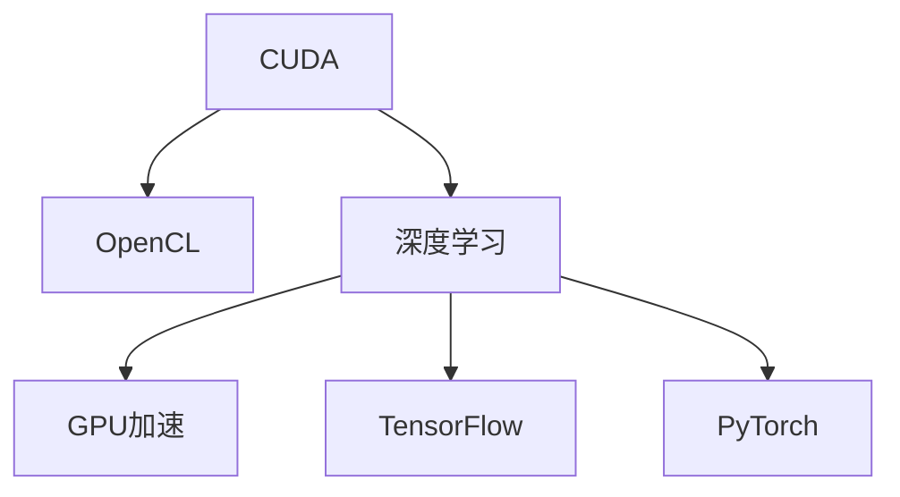

                 

# CUDA编程：释放GPU的AI计算潜力

> 关键词：CUDA编程, 深度学习, 神经网络, GPU加速, AI计算, 高性能计算

## 1. 背景介绍

### 1.1 问题由来

随着深度学习技术的兴起，神经网络在图像识别、自然语言处理、语音识别等领域取得了显著进展。然而，传统的CPU计算能力难以满足深度学习模型日益增长的计算需求，尤其是在大规模数据集和复杂网络结构上，训练速度缓慢，能耗巨大。因此，GPU加速技术逐渐成为深度学习领域不可或缺的一部分。

### 1.2 问题核心关键点

GPU加速的核心在于通过并行计算提高计算效率，充分利用GPU的强大并行处理能力。深度学习模型的计算密集型特征，使得GPU在模型训练和推理中具有显著优势。然而，GPU编程的复杂性和内存管理难度也带来了挑战。

### 1.3 问题研究意义

CUDA编程技术的应用，极大提升了深度学习模型的训练效率和计算能力。通过优化GPU并行计算、内存管理等底层细节，开发者可以大幅减少计算时间，提升AI计算的总体性能，推动深度学习技术的普及和应用。

## 2. 核心概念与联系

### 2.1 核心概念概述

为更好地理解CUDA编程及其在深度学习中的作用，本节将介绍几个关键概念：

- CUDA：NVIDIA开发的并行计算平台和编程模型，用于充分利用GPU的并行处理能力。
- OpenCL：开放计算语言，由Khronos集团制定，提供跨平台并行计算解决方案。
- 深度学习：利用神经网络进行数据表示和推理的机器学习技术，广泛应用于图像识别、语音识别、自然语言处理等领域。
- GPU加速：通过并行计算技术，将深度学习模型中计算密集型部分迁移到GPU上进行计算，提升模型训练和推理速度。
- TensorFlow、PyTorch：目前主流的深度学习框架，支持CUDA编程，提供丰富的GPU计算功能。

这些核心概念之间的逻辑关系可以通过以下Mermaid流程图来展示：



这个流程图展示了这个体系的核心概念及其之间的关系：

1. CUDA和OpenCL提供了并行计算能力。
2. 深度学习是利用神经网络进行数据表示和推理的机器学习技术。
3. GPU加速是将深度学习模型中计算密集型部分迁移到GPU上进行计算。
4. TensorFlow和PyTorch等深度学习框架，支持CUDA编程，提供丰富的GPU计算功能。

## 3. 核心算法原理 & 具体操作步骤
### 3.1 算法原理概述

CUDA编程的核心在于充分利用GPU的并行处理能力，提高计算效率。其基本原理是通过将深度学习模型中计算密集型的操作迁移到GPU上进行并行计算，从而大幅提升计算速度和性能。

具体而言，CUDA编程通过以下几个步骤实现GPU加速：

1. 数据转换：将CPU数据转换为GPU数据，利用GPU的内存空间。
2. 并行计算：将计算密集型的神经网络层迁移到GPU上进行并行计算，同时利用线程并行、块并行等技术，最大化GPU的并行处理能力。
3. 内存管理：合理管理GPU内存，避免内存碎片和溢出。
4. 上下文切换：优化CPU和GPU之间的数据交换，减少上下文切换开销。

### 3.2 算法步骤详解

CUDA编程通常包含以下几个关键步骤：

**Step 1: 安装CUDA和相关驱动**

1. 从NVIDIA官网下载并安装CUDA和CUDA Toolkit。
2. 安装CUDA驱动，确保GPU与操作系统兼容。

**Step 2: 编写CUDA内核代码**

1. 定义GPU内核函数，指定线程块大小和每个线程的执行任务。
2. 在函数中使用`__global__`关键字定义并行计算的线程块。
3. 使用`#pragma unroll`等指令优化计算过程，提高并行效率。
4. 使用`__shared__`关键字定义共享内存，用于线程间的数据交换。
5. 在函数结束前，使用`__syncthreads()`同步线程，确保所有线程完成计算。

**Step 3: 数据传输和内存管理**

1. 使用`cudaMalloc()`和`cudaMemcpy()`等函数在CPU和GPU之间传输数据。
2. 使用`cudaFree()`释放分配的GPU内存，避免内存泄漏。
3. 使用`cudaDeviceSynchronize()`同步GPU和CPU，确保所有操作完成。

**Step 4: 测试和优化**

1. 使用CUDA工具（如nvprof）监控程序性能，分析瓶颈。
2. 使用CUDA Graphs等技术优化内存访问和数据传输。
3. 使用OpenCL等并行计算框架作为备选，提高程序的可移植性。

**Step 5: 集成深度学习框架**

1. 将CUDA编程的计算内核与深度学习框架（如TensorFlow、PyTorch）集成。
2. 使用深度学习框架提供的GPU计算API，如`tf.gpu_device()`、`torch.cuda.device()`等。
3. 调整框架的参数设置，优化GPU资源的利用率。

### 3.3 算法优缺点

CUDA编程具有以下优点：

1. 高效性：利用GPU的并行处理能力，加速深度学习模型的训练和推理。
2. 可移植性：CUDA编程可在多个NVIDIA GPU上运行，提高程序的可移植性。
3. 易用性：深度学习框架提供了丰富的GPU计算API，简化编程难度。

同时，CUDA编程也存在一些缺点：

1. 依赖性：CUDA编程依赖于NVIDIA的硬件和软件生态，不够开放。
2. 编程复杂：需要掌握GPU编程的底层细节，编程难度较大。
3. 硬件限制：CUDA编程仅适用于NVIDIA的GPU，其他硬件平台无法使用。

尽管存在这些局限性，但CUDA编程技术在深度学习领域的应用仍然广泛，并且不断在优化和改进中。

### 3.4 算法应用领域

CUDA编程在深度学习中的应用涵盖了以下几个主要领域：

- 图像识别：使用卷积神经网络（CNN）在GPU上进行图像分类、目标检测等任务。
- 自然语言处理：利用循环神经网络（RNN）和Transformer模型在GPU上进行语言建模、机器翻译等任务。
- 语音识别：使用递归神经网络（RNN）和注意力机制在GPU上进行语音识别、语音合成等任务。
- 推荐系统：使用深度学习模型在GPU上进行用户行为分析、物品推荐等任务。
- 强化学习：使用深度Q网络（DQN）和策略梯度方法在GPU上进行游戏智能、机器人控制等任务。

## 4. 数学模型和公式 & 详细讲解 & 举例说明

### 4.1 数学模型构建

为了更好地理解CUDA编程在深度学习中的作用，下面将从数学角度对深度学习模型在GPU上的并行计算进行详细讲解。

假设深度学习模型包含多个神经网络层，每个层包含多个参数。在CPU上，模型前向传播和反向传播的计算过程需要大量时间。而利用CUDA编程，可以将这些计算密集型的操作迁移到GPU上进行并行计算，提升模型训练和推理的效率。

### 4.2 公式推导过程

假设深度学习模型包含$L$层神经网络，每层有$n_i$个神经元，$w_i$为权重矩阵，$b_i$为偏置向量。前向传播的计算过程可以表示为：

$$
h_1 = \sigma(w_1^T x + b_1)
$$

$$
h_i = \sigma(w_i^T h_{i-1} + b_i), \quad i=2,3,\ldots,L
$$

其中$\sigma$为激活函数。

在CUDA编程中，可以通过并行计算提升前向传播的效率。具体而言，可以将每一层的计算任务分配给不同的线程块进行并行计算，每个线程块负责计算一层的输出。通过并行计算，可以在GPU上同时计算多个层的输出，从而大幅提升计算速度。

### 4.3 案例分析与讲解

以卷积神经网络（CNN）为例，分析CUDA编程的并行计算效果。

假设CNN包含多个卷积层和池化层，每个卷积层包含多个卷积核，每个核大小为$k \times k$。在CPU上，每个卷积核的计算过程需要大量时间。而利用CUDA编程，可以将这些计算密集型的卷积操作迁移到GPU上进行并行计算，提升计算速度。

具体而言，可以将每个卷积核的计算任务分配给不同的线程块进行并行计算，每个线程块负责计算一个核的输出。通过并行计算，可以在GPU上同时计算多个核的输出，从而大幅提升计算速度。

## 5. 项目实践：代码实例和详细解释说明
### 5.1 开发环境搭建

在进行CUDA编程实践前，我们需要准备好开发环境。以下是使用Linux进行CUDA开发的环境配置流程：

1. 安装Anaconda：从官网下载并安装Anaconda，用于创建独立的Python环境。

2. 创建并激活虚拟环境：
```bash
conda create -n pytorch-env python=3.8 
conda activate pytorch-env
```

3. 安装CUDA和相关驱动：
```bash
conda install -c conda-forge cudatoolkit=11.1
```

4. 安装必要的依赖包：
```bash
pip install numpy scipy matplotlib h5py
```

5. 编译TensorFlow或PyTorch：
```bash
pip install tensorflow==2.5
# 或
pip install torch==1.9
```

完成上述步骤后，即可在`pytorch-env`环境中开始CUDA编程实践。

### 5.2 源代码详细实现

下面我们以卷积神经网络（CNN）为例，给出使用CUDA编程实现的前向传播和反向传播代码实现。

首先，定义卷积核的大小和数量：

```python
kernels = 64
kernel_size = (3, 3)
```

然后，定义卷积核的权重矩阵和偏置向量：

```python
weights = torch.randn(kernels, 1, kernel_size[0], kernel_size[1])
biases = torch.randn(kernels)
```

接下来，定义CUDA编程的卷积操作：

```python
import torch
from torch.cuda import *

# 定义GPU上的卷积操作
def conv2d_cuda(input, weights):
    out = zeros(input.size(), dtype=input.dtype, device='cuda')
    for i in range(out.size(0)):
        in_point = input[i,:]
        out_point = zeros(weights.size(), dtype=input.dtype, device='cuda')
        for j in range(weights.size(0)):
            for k in range(kernel_size[0]):
                for l in range(kernel_size[1]):
                    out_point[j,k,l] = sum(weights[j,:,:,k,l] * in_point[i-l:i+l+1,:])
        out[i,:] = out_point + biases[j]
    return out
```

在上述代码中，我们定义了一个CUDA编程的卷积操作函数`conv2d_cuda`，将输入数据`input`和权重矩阵`weights`迁移到GPU上进行卷积计算。

最后，进行前向传播和反向传播计算：

```python
# 定义输入数据
input_data = torch.randn(64, 1, 28, 28, device='cuda')

# 前向传播
output = conv2d_cuda(input_data, weights)

# 计算梯度
input_data.grad = torch.randn(64, 1, 28, 28, device='cuda')
output.grad = torch.randn(output.size(), device='cuda')

# 反向传播
weights.grad = zeros(weights.size(), device='cuda')
for i in range(input_data.size(0)):
    in_point = input_data[i,:]
    out_point = output[i,:]
    for j in range(weights.size(0)):
        for k in range(kernel_size[0]):
            for l in range(kernel_size[1]):
                weights.grad[j,k,l] += out_point[j,k,l] * in_point[i-l:i+l+1,:]
    weights.grad += 1

# 更新权重
weights -= learning_rate * weights.grad
```

在上述代码中，我们首先定义了输入数据`input_data`，然后通过`conv2d_cuda`函数进行前向传播计算，得到输出数据`output`。接着，计算输入数据和输出数据的梯度，通过反向传播计算权重梯度，并更新权重。

### 5.3 代码解读与分析

让我们再详细解读一下关键代码的实现细节：

**卷积操作**：
- `conv2d_cuda`函数定义了GPU上的卷积操作，将输入数据`input`和权重矩阵`weights`迁移到GPU上进行卷积计算。

**前向传播**：
- 通过`conv2d_cuda`函数进行前向传播计算，得到输出数据`output`。

**反向传播**：
- 定义输入数据和输出数据的梯度，通过反向传播计算权重梯度，并更新权重。

**更新权重**：
- 使用学习率更新权重，完成模型训练。

## 6. 实际应用场景

### 6.1 智能推荐系统

智能推荐系统需要处理大量用户数据和物品数据，计算复杂度极高。利用CUDA编程，可以在GPU上高效计算用户行为表示和物品特征表示，提升推荐算法的训练速度和预测精度。

在具体实现中，可以构建深度学习模型（如DNN、CNN、RNN等），利用CUDA编程加速模型训练。同时，可以利用GPU并行计算能力，对大量数据进行矩阵运算和模型推理，提升系统的实时响应能力。

### 6.2 医疗影像分析

医疗影像分析需要处理大量高分辨率的图像数据，计算密集型特征提取和分类任务。利用CUDA编程，可以在GPU上高效计算卷积神经网络（CNN）等模型，提升图像分类的准确率和处理速度。

在具体实现中，可以构建基于深度学习的医学影像分类模型，利用CUDA编程加速模型的训练和推理。同时，可以利用GPU并行计算能力，对大量图像数据进行特征提取和分类，提升系统的处理速度和准确率。

### 6.3 金融风险管理

金融风险管理需要处理大量的历史交易数据和市场数据，计算密集型特征提取和风险预测任务。利用CUDA编程，可以在GPU上高效计算深度学习模型，提升风险预测的准确率和处理速度。

在具体实现中，可以构建基于深度学习的风险预测模型，利用CUDA编程加速模型的训练和推理。同时，可以利用GPU并行计算能力，对大量数据进行特征提取和预测，提升系统的处理速度和准确率。

### 6.4 未来应用展望

随着深度学习技术的不断发展，CUDA编程的应用领域将不断扩展。未来，CUDA编程将在以下几个方面发挥更大的作用：

1. 高效计算：利用GPU的并行处理能力，加速深度学习模型的训练和推理。
2. 多模态计算：支持图像、语音、文本等多种数据类型的并行计算，提升系统的综合处理能力。
3. 分布式计算：支持多GPU、多节点分布式计算，提升系统的扩展性和可靠性。
4. 实时计算：支持低延迟、高吞吐率的实时计算，满足实时性要求高的应用场景。

## 7. 工具和资源推荐

### 7.1 学习资源推荐

为了帮助开发者系统掌握CUDA编程的理论基础和实践技巧，这里推荐一些优质的学习资源：

1. NVIDIA CUDA官方文档：提供详细的CUDA编程指南和示例代码，是CUDA编程的权威参考。

2. Coursera的CUDA编程课程：由NVIDIA专家授课，涵盖CUDA编程的基本概念和实践技巧。

3. NVIDIA DeepLearning Workshop：提供深度学习与CUDA编程的实战培训，包括模型训练、性能调优等。

4. CUDA by Example：一本介绍CUDA编程实践的书籍，涵盖CUDA编程的各个方面。

5. PyTorch官方文档：提供深度学习框架与CUDA编程的集成使用指南，方便开发者进行实际开发。

通过对这些资源的学习实践，相信你一定能够快速掌握CUDA编程的精髓，并用于解决实际的深度学习问题。

### 7.2 开发工具推荐

CUDA编程的开发工具众多，选择合适的工具可以显著提升开发效率和程序性能。以下是几款常用的CUDA开发工具：

1. Visual Studio：支持CUDA编程，提供丰富的开发调试功能。

2. Eclipse：支持CUDA插件，提供集成的开发和调试环境。

3. CLion：提供CUDA插件，支持CUDA编程的智能代码补全和调试。

4. NVIDIA Toolkit：提供CUDA编程所需的工具包和库文件，方便开发者进行实际开发。

5. PyCharm：提供CUDA插件，支持CUDA编程的调试和性能分析。

合理利用这些工具，可以显著提升CUDA编程的开发效率和程序性能，加速深度学习模型的开发和优化。

### 7.3 相关论文推荐

CUDA编程在深度学习中的应用研究取得了丰硕的成果，以下是几篇具有代表性的相关论文，推荐阅读：

1. CUDA-Accelerated Deep Learning: A Survey and Tutorial（CUDA加速深度学习：综述与教程）：总结了CUDA编程在深度学习中的多种应用场景，并提供了详细的实践指南。

2. GPUs for Deep Learning: The Benefits of Deep Learning with GPUs（GPU加速深度学习：GPU的好处）：介绍了使用GPU加速深度学习的优势和实际效果。

3. How to Train Deep Learning Models on a GPU（如何在GPU上训练深度学习模型）：提供了CUDA编程训练深度学习模型的详细步骤和最佳实践。

4. A Survey of CUDA-Based Deep Learning（CUDA加速的深度学习综述）：总结了CUDA编程在深度学习中的各种优化技术，并提供了案例分析。

这些论文代表了大规模并行计算技术在深度学习中的应用趋势，通过学习这些前沿成果，可以帮助研究者把握学科前进方向，激发更多的创新灵感。

## 8. 总结：未来发展趋势与挑战

### 8.1 总结

本文对CUDA编程及其在深度学习中的应用进行了全面系统的介绍。首先阐述了CUDA编程的背景和意义，明确了GPU加速在深度学习模型训练和推理中的重要性。其次，从原理到实践，详细讲解了CUDA编程的数学模型和计算过程，给出了CUDA编程的代码实现。同时，本文还广泛探讨了CUDA编程在智能推荐、医疗影像、金融风险管理等多个领域的应用前景，展示了CUDA编程的巨大潜力。此外，本文精选了CUDA编程的各类学习资源，力求为读者提供全方位的技术指引。

通过本文的系统梳理，可以看到，CUDA编程在深度学习中的应用已经非常广泛，极大地提升了深度学习模型的计算效率和性能。未来，随着深度学习技术的不断进步和CUDA编程的持续优化，相信CUDA编程将更加高效、灵活地服务于深度学习模型的训练和推理。

### 8.2 未来发展趋势

展望未来，CUDA编程将在以下几个方面持续发展：

1. 算法优化：不断优化CUDA编程的算法和数据结构，提升程序的性能和效率。
2. 编程模型：引入更多高级编程模型（如Tensor Core、CUDA Graphs等），提升并行计算的效率和可移植性。
3. 多GPU并行：支持多GPU、多节点分布式计算，提升系统的扩展性和可靠性。
4. 实时计算：支持低延迟、高吞吐率的实时计算，满足实时性要求高的应用场景。
5. 多模态计算：支持图像、语音、文本等多种数据类型的并行计算，提升系统的综合处理能力。

这些趋势凸显了CUDA编程技术的广阔前景。这些方向的探索发展，必将进一步提升深度学习系统的性能和应用范围，为人工智能技术的发展提供坚实的技术基础。

### 8.3 面临的挑战

尽管CUDA编程技术在深度学习中的应用已经取得了显著成效，但在迈向更加智能化、普适化应用的过程中，它仍面临着诸多挑战：

1. 编程复杂度：CUDA编程需要掌握GPU编程的底层细节，编程难度较大。
2. 硬件依赖性：CUDA编程依赖于NVIDIA的硬件和软件生态，不够开放。
3. 性能优化：CUDA编程需要优化数据传输和内存管理，提升计算效率。
4. 模型扩展性：CUDA编程需要支持多GPU、多节点分布式计算，提升系统的扩展性。

尽管存在这些挑战，但随着深度学习技术的不断发展，CUDA编程技术也在不断进步和优化中。未来，通过技术创新和工具完善，相信CUDA编程将更加高效、灵活地服务于深度学习模型的训练和推理。

### 8.4 研究展望

面对CUDA编程面临的挑战，未来的研究需要在以下几个方面寻求新的突破：

1. 引入更多高级编程模型：引入Tensor Core、CUDA Graphs等高级编程模型，提升并行计算的效率和可移植性。
2. 优化数据传输和内存管理：优化数据传输和内存管理，减少上下文切换和内存碎片，提升计算效率。
3. 支持多GPU并行计算：支持多GPU、多节点分布式计算，提升系统的扩展性和可靠性。
4. 引入更多编程工具：引入更多编程工具（如CLion、Eclipse等），提升开发效率和程序性能。

这些研究方向将进一步提升CUDA编程在深度学习中的应用效果，推动深度学习技术的普及和应用。只有勇于创新、敢于突破，才能不断拓展深度学习模型的边界，让AI计算技术更好地服务于人类社会的各个领域。

## 9. 附录：常见问题与解答

**Q1：CUDA编程为什么比CPU编程效率高？**

A: CUDA编程利用GPU的并行处理能力，每个计算单元可以同时处理多个计算任务，从而大幅提升计算速度。相比之下，CPU编程通常只能顺序执行任务，效率较低。

**Q2：CUDA编程如何优化内存管理？**

A: 在CUDA编程中，可以采用如下几种方法优化内存管理：

1. 使用共享内存：共享内存可以多个线程间共享，减少数据传输开销。
2. 使用缓存：利用CUDA的缓存机制，缓存计算结果，避免重复计算。
3. 使用跨设备内存迁移：使用CUDA MemcpyDToH和MemcpyHToD函数，优化CPU和GPU之间的数据传输。
4. 使用CUDA Graphs：利用CUDA Graphs技术，减少上下文切换开销，提升计算效率。

**Q3：CUDA编程在深度学习中有什么应用？**

A: CUDA编程在深度学习中的应用非常广泛，可以加速以下任务：

1. 图像分类：使用卷积神经网络（CNN）在GPU上进行图像分类。
2. 目标检测：使用卷积神经网络（CNN）在GPU上进行目标检测。
3. 自然语言处理：使用循环神经网络（RNN）和Transformer模型在GPU上进行语言建模、机器翻译等任务。
4. 推荐系统：使用深度学习模型在GPU上进行用户行为分析、物品推荐等任务。
5. 强化学习：使用深度Q网络（DQN）和策略梯度方法在GPU上进行游戏智能、机器人控制等任务。

**Q4：CUDA编程有哪些编程模型？**

A: CUDA编程支持多种编程模型，主要包括：

1. CUDA C++：使用C++语言编写CUDA代码，支持GPU并行计算。
2. CUDA Python：使用Python语言编写CUDA代码，支持GPU并行计算。
3. CUDA Graphs：使用CUDA Graphs技术，优化计算过程，减少上下文切换开销。
4. CUDA Tensor Core：使用CUDA Tensor Core指令集，提高计算速度和效率。

通过使用这些编程模型，开发者可以灵活选择适合的任务和环境，提升程序性能和开发效率。

**Q5：CUDA编程在实际开发中需要注意哪些问题？**

A: 在实际开发中，CUDA编程需要注意以下几个问题：

1. 内存管理：合理管理GPU内存，避免内存碎片和溢出。
2. 并行计算：优化计算过程，避免数据竞争和死锁。
3. 上下文切换：优化CPU和GPU之间的数据交换，减少上下文切换开销。
4. 性能优化：优化数据传输和计算过程，提升计算效率。
5. 开发工具：使用合适的开发工具（如Visual Studio、CLion等），提升开发效率和程序性能。

通过合理规避这些问题，开发者可以更好地掌握CUDA编程技术，提升深度学习模型的训练和推理性能。

---

作者：禅与计算机程序设计艺术 / Zen and the Art of Computer Programming

