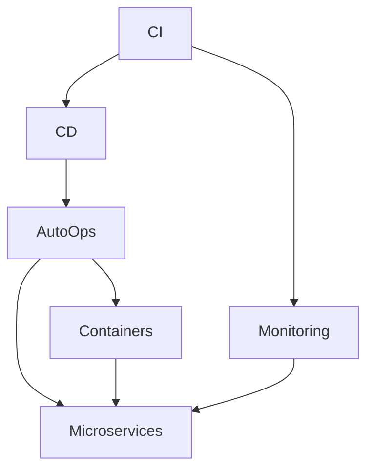

                 

# DevOps实践：从开发到运维的无缝衔接

> 关键词：DevOps, CI/CD, 持续集成, 持续部署, 自动化运维, 容器化, 微服务, 持续监控

## 1. 背景介绍

### 1.1 问题由来

随着软件复杂度的不断提高，软件开发和运维（Ops）之间的鸿沟也在不断扩大。传统的开发和运维部门往往各自为政，数据和工具不一致，导致软件部署周期长、版本管理混乱、故障排查困难等问题。为了解决这些问题，DevOps应运而生。

DevOps是一种强调开发（Development）和运维（Operations）紧密协作的文化和实践，旨在提升软件的交付速度和质量，降低运维成本。DevOps的核心思想是将开发和运维的各个环节自动化、标准化，实现快速迭代、无缝衔接。

### 1.2 问题核心关键点

DevOps的核心关键点包括：
- **持续集成（Continuous Integration, CI）**：通过自动化的测试和集成，确保软件代码的可靠性和稳定性。
- **持续部署（Continuous Deployment, CD）**：自动化地将经过测试的代码部署到生产环境，提升软件交付速度。
- **自动化运维（Automated Operations）**：通过自动化工具和脚本，减少人工操作，提高运维效率。
- **容器化（Containerization）**：使用Docker等容器技术，将应用和其依赖打包成一个独立的运行环境，便于部署和管理。
- **微服务（Microservices）**：将复杂的单体应用拆分成多个小的、可独立部署的服务，提高系统可维护性和扩展性。
- **持续监控（Continuous Monitoring）**：实时监控系统的运行状态，及时发现和解决问题，确保系统稳定运行。

通过这些实践，DevOps可以实现从代码提交到服务部署的自动化流程，大幅提升开发和运维的效率，降低人工错误和故障风险。

## 2. 核心概念与联系

### 2.1 核心概念概述

为更好地理解DevOps的实践，本节将介绍几个密切相关的核心概念：

- **持续集成（CI）**：将代码更改自动集成到共享仓库中，并自动运行一系列测试，以验证代码的稳定性。CI的核心是自动化测试和集成，通过持续集成可以尽早发现和修复代码中的问题。

- **持续部署（CD）**：在通过CI的测试后，将代码自动部署到生产环境中。CD的关键是自动化部署，通过持续部署可以加速软件交付，缩短发布周期。

- **自动化运维（AutoOps）**：通过自动化工具和脚本，实现对应用、配置、监控等运维操作的自动化处理。AutoOps的目标是减少人工干预，提高运维效率和准确性。

- **容器化（Containers）**：使用容器技术将应用和其依赖打包成独立的运行环境，便于部署和管理。容器化技术包括Docker、Kubernetes等，是DevOps的重要基础。

- **微服务（Microservices）**：将复杂的单体应用拆分成多个小的、可独立部署的服务。微服务架构提升了系统的可维护性和扩展性，便于快速迭代和故障隔离。

- **持续监控（Monitoring）**：实时监控系统的运行状态，及时发现和解决问题，确保系统稳定运行。持续监控包括应用监控、性能监控、日志监控等，是DevOps的重要保障。

这些核心概念之间的逻辑关系可以通过以下Mermaid流程图来展示：



这个流程图展示了大规模系统构建中，DevOps各个实践环节的相互联系和支撑关系。CI是整个流程的起点，负责代码的集成和自动化测试；CD负责将通过测试的代码部署到生产环境；AutoOps则提供自动化运维支持；容器的使用贯穿于整个流程中；微服务架构是现代系统的核心；持续监控确保系统稳定运行。

## 3. 核心算法原理 & 具体操作步骤
### 3.1 算法原理概述

DevOps的实践是基于一系列自动化工具和脚本的持续集成、持续部署和自动化运维，其核心思想是通过自动化技术实现软件开发和运维的无缝衔接。

具体而言，DevOps的流程可以分为以下几个关键环节：

- **代码提交**：开发者将代码更改推送到共享仓库，触发CI流程。
- **持续集成**：自动化地拉取代码、运行测试，验证代码的稳定性。
- **持续部署**：通过自动化脚本将通过测试的代码部署到生产环境。
- **自动化运维**：使用自动化工具进行配置管理、监控、报警等运维操作。
- **持续监控**：实时监控系统状态，及时发现和解决问题。

### 3.2 算法步骤详解

以下是DevOps自动化流程的详细步骤：

**Step 1: 代码提交**

1. 开发者将代码更改推送到共享仓库（如Git）。
2. 触发CI流程，拉取最新代码。

**Step 2: 持续集成**

1. 在CI服务器上执行自动化测试，包括单元测试、集成测试、性能测试等。
2. 记录测试结果，并生成报告，便于开发者排查问题。

**Step 3: 持续部署**

1. 通过自动化脚本将通过测试的代码部署到测试环境和生产环境。
2. 自动回滚失败部署，确保系统的稳定性。

**Step 4: 自动化运维**

1. 使用自动化脚本配置应用和数据库等资源。
2. 定期执行自动化任务，如备份、恢复、故障检测等。

**Step 5: 持续监控**

1. 实时监控系统的运行状态，包括应用性能、网络流量、日志等。
2. 配置报警规则，一旦发现异常，立即通知相关人员。

### 3.3 算法优缺点

DevOps的自动化流程有以下优点：
1. 提升交付速度。通过持续集成和持续部署，可以大幅缩短发布周期，提升软件交付速度。
2. 减少人为错误。自动化测试和部署减少了人工操作，降低了人为错误和故障风险。
3. 提高运维效率。通过自动化运维工具，可以显著提高运维效率和准确性。
4. 提升系统稳定性。持续监控及时发现和解决问题，确保系统稳定运行。

同时，DevOps也存在一些局限性：
1. 复杂度高。大规模系统的CI/CD流程可能复杂，需要良好的管理和监控机制。
2. 技术门槛高。自动化流程涉及多种工具和脚本，需要较高的技术门槛。
3. 成本高。自动化工具和运维成本较高，需要一定的投入。
4. 灵活性受限。自动化流程一旦设置，不易灵活调整，可能影响开发进度。

尽管存在这些局限性，但DevOps在现代软件开发和运维中已经成为不可或缺的实践。通过不断优化和改进，DevOps将更加高效地支撑大规模系统的构建和运行。

### 3.4 算法应用领域

DevOps的自动化流程已经被广泛应用于各种规模的软件系统，包括Web应用、移动应用、IoT设备、大数据系统等。具体应用领域包括：

- **Web应用**：包括网站、API、微服务架构等，通过CI/CD提升交付速度和质量。
- **移动应用**：通过自动化测试和部署，快速迭代新功能和修复bug。
- **IoT设备**：通过容器化和微服务，实现设备和应用的灵活部署和扩展。
- **大数据系统**：通过自动化工具和脚本，提升数据处理和分析的效率和稳定性。

除了这些常见应用外，DevOps在教育、医疗、金融等垂直领域也有广泛的应用，提升了各行业的数字化转型能力。

## 4. 数学模型和公式 & 详细讲解 & 举例说明

### 4.1 数学模型构建

为更好地理解DevOps的自动化流程，我们可以使用数学模型对其进行建模和分析。

假设系统有$N$个功能模块，每个模块的开发和运维周期为$T$。通过DevOps自动化流程，可以定义系统交付周期的数学模型：

$$
T_{\text{total}} = T \times N + t_{\text{CI}} + t_{\text{CD}} + t_{\text{AutoOps}} + t_{\text{Monitoring}}
$$

其中，$t_{\text{CI}}$、$t_{\text{CD}}$、$t_{\text{AutoOps}}$、$t_{\text{Monitoring}}$分别表示持续集成、持续部署、自动化运维和持续监控所需的额外时间。

通过优化这些时间，可以提升系统交付周期$T_{\text{total}}$的效率。

### 4.2 公式推导过程

通过上述模型，可以推导出提升系统交付效率的公式：

$$
T_{\text{total}} \leq T \times N + \sum_{i=1}^{N} \Delta_i
$$

其中，$\Delta_i$表示第$i$个模块的额外时间。为了最小化$T_{\text{total}}$，需要最大化$\Delta_i$的效率，减少不必要的等待和人工操作。

### 4.3 案例分析与讲解

以一个典型的Web应用系统为例，通过DevOps自动化流程，可以显著提升其交付速度和稳定性：

1. **持续集成**：通过自动化测试，可以尽早发现和修复代码中的问题，减少后期修复成本。
2. **持续部署**：自动化部署可以提升发布速度，减少手动部署带来的风险。
3. **自动化运维**：配置管理、监控报警等自动化运维操作，提高了系统运维效率。
4. **持续监控**：实时监控系统状态，及时发现和解决问题，提升了系统稳定性。

## 5. 项目实践：代码实例和详细解释说明
### 5.1 开发环境搭建

在进行DevOps实践前，我们需要准备好开发环境。以下是使用Git、Jenkins、Docker和Kubernetes的开发环境配置流程：

1. 安装Git：从官网下载并安装Git，用于代码版本控制。
2. 安装Jenkins：从官网下载并安装Jenkins，用于持续集成和持续部署。
3. 安装Docker：从官网下载并安装Docker，用于容器化部署。
4. 安装Kubernetes：从官网下载并安装Kubernetes，用于自动化运维和调度管理。
5. 安装必要的依赖库和工具包。

完成上述步骤后，即可在开发环境中开始DevOps实践。

### 5.2 源代码详细实现

以下是使用Jenkins、Docker和Kubernetes进行Web应用系统构建的Python代码实现：

1. 在Jenkins上配置CI流程：
```python
import jenkins

# 连接Jenkins服务器
server = jenkins.Jenkins('http://jenkins.example.com', username='admin', password='password')

# 定义CI流程步骤
def ci_build():
    # 拉取最新代码
    server.build('web-app', parameters={'branch': 'master'})
    # 运行自动化测试
    server.build('test-app', parameters={'branch': 'master'})
    # 生成测试报告
    server.build('report-app', parameters={'branch': 'master'})

# 启动CI流程
ci_build()
```

2. 在Dockerfile中定义容器镜像构建：
```dockerfile
FROM python:3.8
WORKDIR /app
COPY requirements.txt .
RUN pip install -r requirements.txt
COPY . .
```

3. 在Kubernetes中定义应用和服务：
```yaml
apiVersion: apps/v1
kind: Deployment
metadata:
  name: web-app
spec:
  replicas: 3
  selector:
    matchLabels:
      app: web-app
  template:
    metadata:
      labels:
        app: web-app
    spec:
      containers:
      - name: web-app
        image: my-web-app:latest
        ports:
        - containerPort: 8080
---
apiVersion: v1
kind: Service
metadata:
  name: web-app-service
spec:
  selector:
    app: web-app
  ports:
    - protocol: TCP
      port: 80
      targetPort: 8080
```

完成上述步骤后，即可在开发环境中构建并运行Web应用系统。

### 5.3 代码解读与分析

让我们再详细解读一下关键代码的实现细节：

**Jenkins CI流程**：
- 通过Jenkins连接服务器，定义了拉取代码、运行测试和生成报告三个CI步骤，分别对应三个构建任务。
- Jenkins通过构建任务和触发器，实现了持续集成的自动化。

**Docker镜像构建**：
- Dockerfile中定义了Python3.8镜像的构建步骤，包括安装依赖、复制代码和运行应用。
- 通过Docker镜像，可以轻松地在多个环境中部署和扩展应用。

**Kubernetes应用和服务**：
- Kubernetes定义了三个副本的Web应用部署，确保高可用性。
- 通过Service定义服务，使应用可以访问网络，便于外部调用。

## 6. 实际应用场景
### 6.1 企业内部应用系统

基于DevOps的自动化流程，可以构建企业内部的应用系统，实现从开发到运维的无缝衔接。例如：

1. **代码管理**：通过Git版本控制工具，统一管理代码版本和变更。
2. **持续集成**：使用Jenkins等工具，自动化执行测试和构建任务，确保代码的稳定性和可发布性。
3. **持续部署**：使用Jenkins、Kubernetes等工具，自动将通过测试的代码部署到生产环境。
4. **自动化运维**：使用Kubernetes、Ansible等工具，自动化配置和管理应用环境。
5. **持续监控**：使用Prometheus、Grafana等工具，实时监控应用状态，及时发现和解决问题。

通过DevOps实践，企业内部的应用系统可以实现快速迭代、高效运维，提升整体的软件交付速度和稳定性。

### 6.2 开源社区项目

DevOps的自动化流程也被广泛应用于开源社区项目中，提升开源项目的协作效率和代码质量。例如：

1. **持续集成**：使用GitHub Actions、Jenkins等工具，自动化执行测试和构建任务，确保代码的稳定性和可发布性。
2. **持续部署**：使用GitHub Actions、Jenkins、Docker等工具，自动化将通过测试的代码部署到生产环境。
3. **自动化运维**：使用Kubernetes、Ansible等工具，自动化配置和管理应用环境。
4. **持续监控**：使用Prometheus、Grafana等工具，实时监控项目状态，及时发现和解决问题。

通过DevOps实践，开源社区项目可以实现高效协作、快速迭代，提升代码质量和用户体验。

### 6.3 云服务平台

DevOps的自动化流程也被应用于云服务平台中，提升云服务的稳定性和可扩展性。例如：

1. **持续集成**：使用GitLab CI/CD、Jenkins等工具，自动化执行测试和构建任务，确保代码的稳定性和可发布性。
2. **持续部署**：使用GitLab CI/CD、Jenkins、Docker等工具，自动化将通过测试的代码部署到云平台。
3. **自动化运维**：使用Kubernetes、Ansible等工具，自动化配置和管理云平台资源。
4. **持续监控**：使用Prometheus、Grafana等工具，实时监控云平台状态，及时发现和解决问题。

通过DevOps实践，云服务平台可以实现高效运维、快速扩展，提升服务稳定性和用户体验。

### 6.4 未来应用展望

随着DevOps技术的不断演进，未来的应用场景将更加多样化：

1. **边缘计算**：在边缘设备上部署和运行应用，通过DevOps实现高效管理和运维。
2. **智能运维**：结合人工智能技术，实时分析和预测系统问题，实现更智能的运维管理。
3. **区块链应用**：在区块链平台上构建和部署应用，通过DevOps提升系统效率和可靠性。
4. **工业互联网**：在工业互联网平台上构建和部署应用，通过DevOps实现高效协同和智能化运维。

## 7. 工具和资源推荐
### 7.1 学习资源推荐

为了帮助开发者系统掌握DevOps的理论基础和实践技巧，这里推荐一些优质的学习资源：

1. **《持续集成和持续部署实践指南》**：介绍CI/CD的原理和实践，详细讲解Jenkins、GitLab CI/CD等工具的使用方法。
2. **《Kubernetes实战》**：介绍Kubernetes的架构和实践，详细讲解Docker、Kubernetes等工具的使用方法。
3. **《DevOps革命》**：介绍DevOps文化的核心思想和实践方法，帮助开发者理解DevOps的精髓。
4. **《云原生计算基础》**：介绍云原生架构的核心概念和技术栈，帮助开发者构建高效的云应用。
5. **《微服务架构实践》**：介绍微服务架构的设计和实践方法，帮助开发者构建可扩展、可维护的微服务系统。

通过对这些资源的学习实践，相信你一定能够快速掌握DevOps的精髓，并用于解决实际的开发和运维问题。

### 7.2 开发工具推荐

高效的开发离不开优秀的工具支持。以下是几款用于DevOps开发的常用工具：

1. **Jenkins**：开源的持续集成和持续部署工具，支持多种插件和扩展，灵活配置CI/CD流程。
2. **GitLab CI/CD**：开源的持续集成和持续部署工具，集成在GitLab中，支持CI/CD、CDK等高级功能。
3. **GitHub Actions**：开源的持续集成和持续部署工具，集成在GitHub中，支持CI/CD、CDK等高级功能。
4. **Docker**：开源的容器化工具，支持Dockerfile、Compose等语法，方便构建和管理容器镜像。
5. **Kubernetes**：开源的容器编排工具，支持Debei、Compose等语法，方便管理和调度容器集群。
6. **Prometheus**：开源的监控和报警工具，支持多维时间序列数据和灵活的查询语言。
7. **Grafana**：开源的可视化工具，支持多种数据源和图表，方便展示监控结果。

合理利用这些工具，可以显著提升DevOps任务的开发效率，加快创新迭代的步伐。

### 7.3 相关论文推荐

DevOps的自动化流程源于学界的持续研究。以下是几篇奠基性的相关论文，推荐阅读：

1. **《构建持续集成和持续部署的自动化工具链》**：介绍CI/CD工具链的构建方法，详细讲解Jenkins、GitLab CI/CD等工具的使用方法。
2. **《Kubernetes：云平台上的容器编排系统》**：介绍Kubernetes的架构和实践，详细讲解Docker、Kubernetes等工具的使用方法。
3. **《DevOps文化和实践》**：介绍DevOps文化的核心思想和实践方法，帮助开发者理解DevOps的精髓。
4. **《云原生计算架构》**：介绍云原生架构的核心概念和技术栈，帮助开发者构建高效的云应用。
5. **《微服务架构设计》**：介绍微服务架构的设计和实践方法，帮助开发者构建可扩展、可维护的微服务系统。

这些论文代表了大规模系统构建中DevOps的实践方向，通过学习这些前沿成果，可以帮助研究者把握学科前进方向，激发更多的创新灵感。

## 8. 总结：未来发展趋势与挑战
### 8.1 研究成果总结

本文对DevOps自动化流程进行了全面系统的介绍。首先阐述了DevOps的实践背景和核心思想，明确了CI/CD、容器化、微服务、持续监控等关键环节。其次，从原理到实践，详细讲解了DevOps的数学模型和关键步骤，给出了DevOps任务的完整代码实现。同时，本文还广泛探讨了DevOps在企业内部应用、开源社区项目、云服务平台等场景中的应用前景，展示了DevOps范式的巨大潜力。此外，本文精选了DevOps技术的各类学习资源，力求为读者提供全方位的技术指引。

通过本文的系统梳理，可以看到，DevOps自动化流程正在成为软件开发和运维的重要范式，极大地提升了系统的交付速度和稳定性，降低了运维成本。未来，伴随DevOps技术的不断演进，其在规模化系统构建和运维中的应用将更加广泛，推动企业向更加智能化、自动化的方向发展。

### 8.2 未来发展趋势

展望未来，DevOps自动化流程将呈现以下几个发展趋势：

1. **云原生和微服务**：云原生和微服务架构将进一步普及，通过DevOps实现高效、可扩展的系统构建和运维。
2. **容器化和Kubernetes**：容器化和Kubernetes将更加普及，成为构建和部署应用的标准。
3. **持续集成和持续部署**：CI/CD将更加自动化、智能化，提升软件交付速度和质量。
4. **自动化运维和持续监控**：AutoOps和Monitoring将更加智能化、实时化，提升系统运维效率和稳定性。
5. **多云和混合云**：多云和混合云的普及，将推动DevOps技术的进一步演进，提升跨云环境下的系统构建和运维能力。
6. **人工智能和机器学习**：人工智能和机器学习将进一步融入DevOps流程，提升系统的智能化和自动化水平。

以上趋势凸显了DevOps自动化流程的广阔前景。这些方向的探索发展，必将进一步提升软件开发和运维的效率，推动企业的数字化转型进程。

### 8.3 面临的挑战

尽管DevOps自动化流程已经取得了显著成效，但在迈向更加智能化、普适化应用的过程中，它仍面临着诸多挑战：

1. **复杂度高**：大规模系统的CI/CD流程可能复杂，需要良好的管理和监控机制。
2. **技术门槛高**：自动化流程涉及多种工具和脚本，需要较高的技术门槛。
3. **成本高**：自动化工具和运维成本较高，需要一定的投入。
4. **灵活性受限**：自动化流程一旦设置，不易灵活调整，可能影响开发进度。
5. **安全性和合规性**：自动化流程涉及大量的数据和操作，需要严格的安全和合规措施。

尽管存在这些挑战，但DevOps在现代软件开发和运维中已经成为不可或缺的实践。通过不断优化和改进，DevOps将更加高效地支撑大规模系统的构建和运行。

### 8.4 研究展望

面对DevOps面临的这些挑战，未来的研究需要在以下几个方面寻求新的突破：

1. **优化CI/CD流程**：优化CI/CD流程的自动化和智能化，提升软件交付速度和质量。
2. **降低技术门槛**：提供更多易用、灵活的自动化工具，降低技术门槛，提升开发者体验。
3. **降低成本**：优化自动化工具的使用成本，降低运维和管理成本。
4. **提高灵活性**：设计更加灵活、可配置的自动化流程，适应不同的开发和运维场景。
5. **加强安全性**：引入更加严格的安全和合规措施，确保自动化流程的可靠性和安全性。
6. **引入人工智能**：结合人工智能技术，提升自动化流程的智能化水平，实现更智能的自动化运维和管理。

这些研究方向将进一步推动DevOps技术的发展，提升企业的数字化转型能力和效率。相信随着技术不断进步，DevOps将发挥更大的作用，成为现代软件开发和运维的重要支撑。

## 9. 附录：常见问题与解答
----------------------------------------------------------------

**Q1: DevOps和敏捷开发有什么区别？**

A: DevOps和敏捷开发虽然都强调快速交付和团队协作，但DevOps更注重自动化和集成。DevOps通过持续集成、持续部署和自动化运维，将开发和运维紧密衔接，实现高效的软件交付和稳定运行。而敏捷开发则更注重快速迭代和反馈，强调团队的灵活性和自组织性。

**Q2: DevOps适用于所有规模的软件系统吗？**

A: DevOps适用于各种规模的软件系统，从小型项目到大型企业应用。但不同规模的系统在DevOps的实践上略有差异，需要根据具体情况进行优化和调整。

**Q3: DevOps的自动化流程需要多少技术投入？**

A: DevOps的自动化流程需要一定的技术投入，包括工具选择、配置和集成等。但通过合理规划和配置，可以显著提升开发和运维效率，降低人力成本。

**Q4: DevOps的自动化流程可以用于多云环境吗？**

A: DevOps的自动化流程可以用于多云环境，但需要考虑不同云平台之间的兼容性、数据隔离和安全问题。通过云原生和微服务架构，可以实现跨云环境下的高效构建和运维。

**Q5: DevOps是否适用于教育和科研领域？**

A: DevOps不仅适用于企业和工业应用，也在教育、科研等领域得到广泛应用。例如，高校可以使用DevOps流程管理课程开发和教学资源，提升教育质量和学习效率。

总之，DevOps自动化流程是现代软件开发和运维的重要实践，通过不断优化和改进，DevOps将在各个领域发挥更大作用，提升系统的效率和稳定性，推动数字化转型进程。

---

作者：禅与计算机程序设计艺术 / Zen and the Art of Computer Programming

